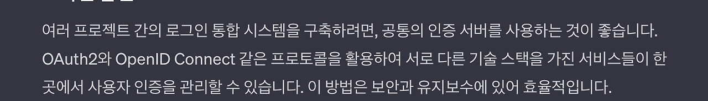
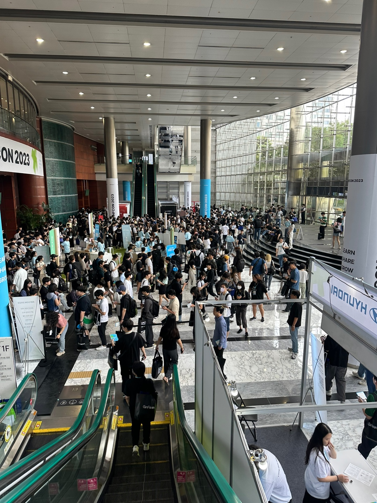
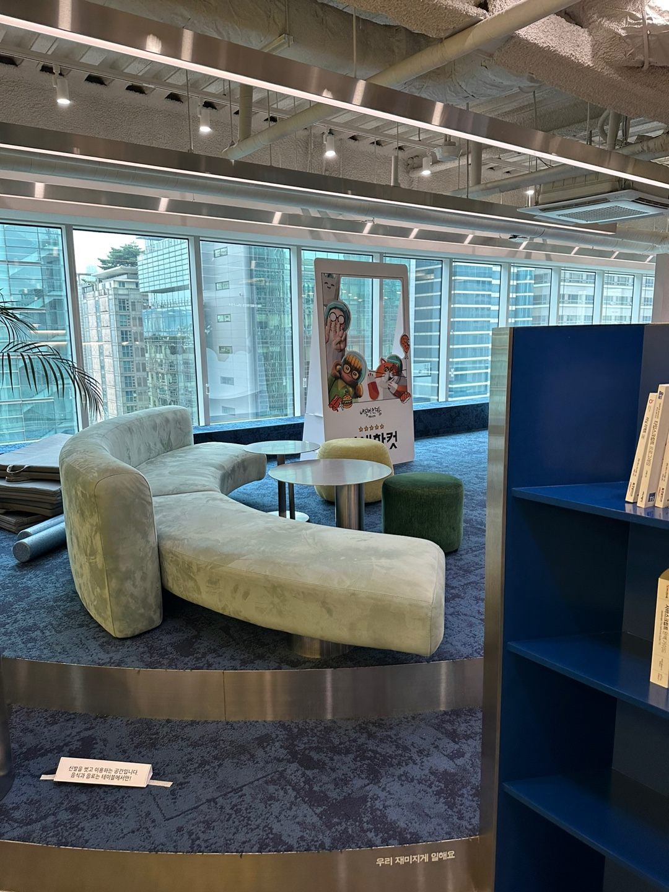

## 0\. 서론

2023년 매우 많은 이벤트들이 있던 한 해입니다.  
이번 한 해의 마무리 겸, 새로운 기술 블로그의 첫 포스트로 올 한 해의 일들을 정리해 보고자 합니다.  
이 포스트에 분류는 회사, 블로그, 콘퍼런스,반성할 점, 2024목표 총 5개의 분류로 작성되었습니다.

## 1\. 회사 📚

이 포스트를 쓸려고 할 때 잠시 고민을 해보았습니다. "**올 한 해에 무슨 이벤트들이 있었을까?**"  
처음에는 별일이 없어 보여서 무슨 내용을 써야 할까 기억을 돌이켜보니, 나름 많은 이벤트들이 있었습니다.

### 1-1. 기존 코드 리팩토링

우리 팀의 개발 프로세스에 대해 잠깐 설명을 드리자면 다음과 같습니다.  
1\. 기존에 만들어둔 공통 템플릿을 가져옵니다.  
2\. 템플릿을 각 기관의 프로젝트에 맞게 수정을 진행합니다.  
3\. 이후, 추가적인 기능 요청 건에 대하여 개발을 진행합니다.  
4. 배포(납품) 합니다.  
이제까지는 아무런 생각 없이 이 프로세스에 대해 개발을 진행하였습니다.  
하지만, 어느 순간 의문사항이 들어서 아래와 같이 팀장님께 질문을 하였습니다.

> Q. 팀장님. 우리가 가져오는 공통 템플릿은 언제 최초로 만들어졌나요?
> 
> A. 제가 입사하기 전에 만들어졌을걸요? 그런데 안 건드시는 게 좋으실 거세요.

여기서 나는 조금 의문사항을 가졌습니다. 기존 템플릿 코드를 보니, javascript 코드도 지금 현재 서비스 종료를 한 Internet Explore에 대비한 코드들로 조금 난잡해져 있었고, 공통된 코드들이 여러 파일에 많이 분포되어 있었습니다. 또한 너무 많은 이미지들의 사용으로 페이지가 로드가 될 때 렌더링 속도 또한 저하되는 사실을 발견하게 되었습니다.

이러한 이유를 팀장님께 말씀을 드리고 리팩토링 계획을 제안하였습니다. 팀장님도 제 의견에 동의를 해주셨고 저는 기존 템플릿에 대한 리팩토링 작업에 들어가게 되었습니다.

#### 1-1-1. 반복된 코드 없애기

제가 먼저 해야 할 작업으로 반복된 코드를 하나의 파일에 모아두는 작업을 하였습니다. 구체적인 사항은 자세히 말씀을 드릴 수는 없지만, 예시로 말씀을 드리자면 쿠키를 적용하고, 적용한 쿠키를 가져오는 부분이 각각 파일마다 비즈니스 로직이 직접 작성되어 있던 부분을 하나의 모듈로 묶어서 적용시켰습니다.

#### 1-1-2. 이미지 최소화

렌더링 속도의 저해요인이 각 이미지들의 큰 용량들 때문이었습니다. 그래서 디자인팀에게 이미지들의 용량을 줄여줄 수는 없을지 제안을 하였고 최대한 이미지 용량들을 줄였지만, 여전히 큰 용량들이었고 렌더링 속도에는 크게 영향을 끼치지 못했습니다. 그래서 생각해낸 방법이 "꼭 필요한 이미지들만 적용하고 그 외에는 css를 이용하여 우리가 만들자!"라는 방법이었습니다. 그래서 진짜 필요한 이미지들을 제외한 이미지들(ex. 단순 버튼 이미지)을 HTML 태그들을 생성 후, css로 되자 하여 대체를 하였습니다.

이를 통해 우리는 그래서 **렌더링 속도를 기존 대비 50% 빠르게** 해두었습니다.

> LightHouse 지표로 설명을 해드리고 싶지만, 회사 보안으로 보여드리지 못하는 점 죄송합니다.

### 1-2. 실시간 자막 변경

우리는 기존에 실시간 자막을 vtt나 srt를 이용하여 영상에 자막을 커스텀 하게 제공하였습니다. 하지만, 이 방법은 각 서버에 vtt나 srt를 지원해 주지 않는 WAS에는 도입이 힘들어 실시간 자막을 적용하고 싶어도 할 수 없었습니다. 이에 저는 여러 방법들을 알아보고, javascript의 timeupdate 이벤트를 이용하여 js 파일만으로 실시간 자막을 제공하는 방식으로 수정하게 되었습니다. 이를 통하여 실시간 자막을 모든 프로젝트에 도입을 할 수 있게 되었습니다.

### 1-3. 사내 회의실 예약 시스템 개발

2023년 들어오면서 전반적인 회사들이 안 좋아지는 소식을 듣게 되었습니다. 이 소식은 저희 회사도 예외사항이 아니었습니다. 그래서 저희 회사에 최대한 비용을 아낄 요소들은 아끼자는 말이 나오게 되었습니다. 그래서 저는 고민을 하게 되었고, "외부 솔루션을 이용하는 회의실 예약 시스템을 제가 개발해 보자."라는 생각을 하게 되었습니다. 그리고 현재 개발을 완료하게 되었고 **연간 솔****루션 비용으로 60만 원씩** **나가는 비용을 절약**하게 되었습니다.

> 자세한 내용은, 회사와 이야기를 한 후 허가가 있다면 간략한 내용을 적어보겠습니다.

### 1-4. 사내 백오피스 통합로그인 모듈 개발

회의실 예약 시스템을 만들고 우리 팀장님께서 주신 추가 의견이 우리의 백오피스를 통합로그인으로 만들자는 의견을 주셨습니다.

그래서 저는 다시 고민을 하게 되었습니다. 왜냐하면 일단, 각 프로젝트들은 docker로 띄워져 있어서 도메인이 다르다는 점이였습니다. 그래서 chat gpt에게 의견을 구해보았습니다.

뭐 일단, OAuth2로 인증서버를 따로 두 자는 의견을 받았지만, 받아들일 수 없었습니다. 왜냐하면 아직 제가 OAuth2에 대해 익숙하지 않고 다른 프로젝트를 서버단까지 건들기에는 부담이 컸기 때문입니다. 또한 인증모듈을 분리시키기엔 시간적인 여유가 많이 없었습니다. 그래서 생각을 해보고 팀장님과 팀원들 분과 회의를 거친 뒤에 나온 결론은 다음과 같습니다.

1\. 일단, 로그인 ui 부분은 회의실 예약 시스템 폼으로 통일하자.  
2\. 로그인 api는 회의실 예약 시스템으로 사용하자.  
3\. 통합로그인 api를 따로 만들어두자.

위의 의견을 자세히 풀어보면, 다른 프로젝트들은 로그인 부분이 다행히도 없어서, ui 통일은 다른 클라이언트 코드에 링크를 넣어두는 것으로 해결이 가능했습니다. 다음으로, 회의실 예약 시스템 로그인 페이지로 들어가면 access token을 생성하여 클라이언트에게 응답을 내주고, 클라이언트는 로컬 스토리지에 저장시킵니다. 그리고 추가적으로 응답으로 내려주는 access token을 내부 ip를 키로 하여 redis에 저장시킵니다. 이후 다른 프로젝트 root 페이지에 접속 시, redis에 ip를 키로 하는 access token이 있으면 access token을 가져와서 로그인을 시키는 로직으로 변경하게 되었습니다.

## 2\. 블로그 💻

기존의 나는 블로그의 작성을 생활화하지 않았고, 점점 적는 게 귀찮다는 나태함으로 미루고 있었고 결국 유령 블로그가 되었습니다.  
그리고 12월이 되고 나서야 다른 개발자들의 회고록이 점점 나오게 되었고, 다시 한번 이 나태함을 걷고 학습하고 글을 써보자는 생각이 들게 되었습니다. 그래서 기존 velog로 작성한 유령 블로그를 이어갈려고 하였지만, 가끔 velog의 서버 장애 이슈로 velog에서 대중적인 티스토리 블로그로 이관하게 되었습니다.

## 3\. 콘퍼런스 🏛

작년까지만 해도 개발자 콘퍼런스 가는 것은 나와는 먼 아기였던 것 같았습니다. 하지만 올해는 운이 좋게도 3번의 기회가 생겨서 개발자 콘퍼런스를 갈 수 있게 되었습니다.

### 3-1. 인프콘 2023

올해에도 인프콘을 주최한다는 소식에 얼른 신청을 하였지만, 결과는 처참하게 떨어지게 되었습니다.

하지만 운이 좋게도 아는 지인분이 양도를 해주셨고 즐겁게 인프콘을 가게 되었습니다.

처음 개발자 컨퍼런스를 가는 만큼 마음도 들떴고 듣고싶던 발표세션도 체크를 하면서 기다리게 되었습니다. 그러면서 여러 발표세션을 듣고 아는 지인분들도 만나면서 정말 뜻 깊은 시간이자 반성을 하게 되는 시간이 되었습니다. 일단 제가 영상에서만 보던 동욱님, 토비님, 영한님을 실제 뵐수 있어서 좋았지만 강연을 들으면서 제가 그 동안 많은 학습을 게을리 했고 많은 부분이 부족하다는 점을 느끼게 되었습니다.

또한, 해당 세션들에 대해 공유할 부분을 정리해서 팀원분들과 의견을 공유하게 되는 계기가 되었습니다.

### 3-2. 유스콘 2023

운이 더욱 좋게도 유스콘 또한 바로 당첨되게 되었습니다. 인프콘보다는 규모가 작았지만 확실히 핸즈 온 실습 강연과 동기부여 세션을 통해 많은 지식들을 알게 되었습니다. 특히, 'SSE' 핸즈 온 세션과 'react-hook-form' 세션에서 SSE라는 개념과 react hook form을 처음 접하게 되었고, 이 개념을 바로 다음 출근 날에 팀원분들과 공유 후에 백오피스 프로젝트 중 하나인 '회의실 예약 시스템'에 적용을 시켰습니다.

### 3-3. Chat-gpt 강연

chat-gpt가 언론에도 많이 유명한 강세를 타던 시점에 저희 회사에도 chat-gpt에 관심을 가지게 되었고, 회사 차원에서 외부 chat-gpt 강연을 듣게 되었습니다. 물론, 대상이 개발자에 대한 대상은 아니었기에 조금은 아쉬운 부분을 가진 상태에서 강연을 들었지만, 충분히 많은 도움이 되는 시간이었던 것 같습니다. 일단 프롬프트 작성법부터 시작해서, 유료 사용자에 한해서 custom instructions 부분을 통한 chat-gpt 응답 커스텀 화?를 시킬 수 있었고, 이미지 생성 등 다양한 플러그인에 대해서도 접할 수 있는 좋은 기회이자 시간이었고 이 강연을 통하여 사내 팀원분들과도 똑똑하게 chat-gpt를 이용하게 되는 계기가 된 것 같습니다.

## 4\. 반성할 점

### 4-1. 개인공부

개인 공부에 있어서는 정말 많이 반성해야 할점이 많습니다. 올해 초만 해도 "1일 1커밋을 목표로 해보자"라는 목표를 두었지만, 피곤하다는 핑계, 회사에서 힘들었다는 핑계로 공부를 많이 미루곤 했습니다. 회사에서 열심히 했으니 성장했다는 말도 안 되는 핑곗거리로공부를 너무 게으르게 하게 된 점에 많은 반성을 하게 되며, 다시 한번 목표를 다 잡아서 공부를 해봐야겠다는 다짐을 해야 할 것 같습니다. 또한 추가적으로 앞서 서두에서 설명드렸던 블로그도 유령 블로그로 만들지 않고 꾸준히 주기적으로 작성해야겠다는 다짐을 해야겠습니다.

### 4-2. 운동

분명 올해 초에 헬스장 1년권을 신청했지만 1달에 몇 번 못 간 게 너무 반성하게 되는 점입니다. 퇴근 후 피곤하다는 핑계, 주말에는 휴식 좀 해야 한다는 핑계가 너무 앞섰던 것 같습니다. 이를 반성하고 2024년에는 꾸준히 운동도 해서 건강과 체력을 기르는 습관을 만들어야겠습니다.

## 5\. 2024 목표

### 5-1. 더 나은 환경으로 만들기.

내년에는 좀 더 나은 환경을 만들어가자는 것입니다. 더 나은 환경이라고 하자면 이직도 있겠지만, "**현재 팀원분들과 같이 고민과 성장을 통해  회사에 조금 더 기여를 할 수 있는 부분을 찾자**"라는 목표를 두고 제 자신도 이에 맞게 실천하고 노력하는 삶을 살아야겠다 다짐합니다.

### 5-2. 블로그

블로그를 유령 블로그가 아닌 활성화된 블로그를 만들어서, 제 경험과 지식을 다른 분들께 공유할 수 있는 open api와 같은 블로그가 되게 만들어 갈 예정입니다. 많은 관심 부탁드립니다.

## 마무리

그럼 이상으로 2023 주니어 개발자 회고를 마치겠습니다. 여기까지 읽어주셔서 감사합니다.