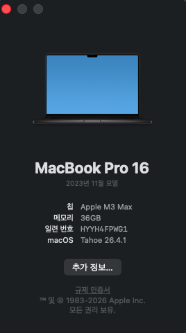
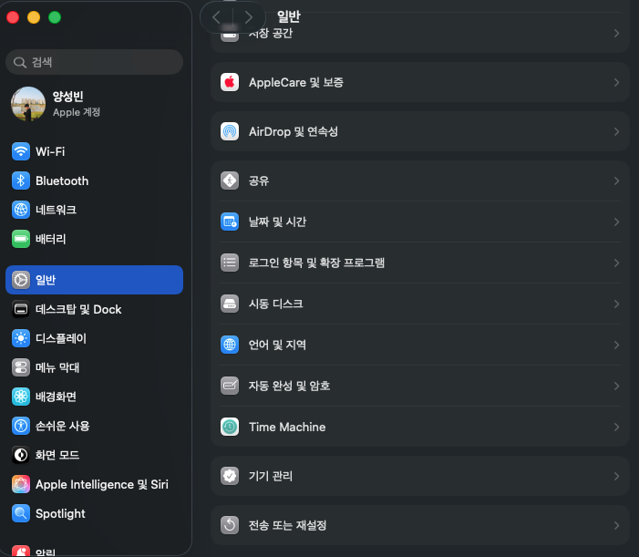
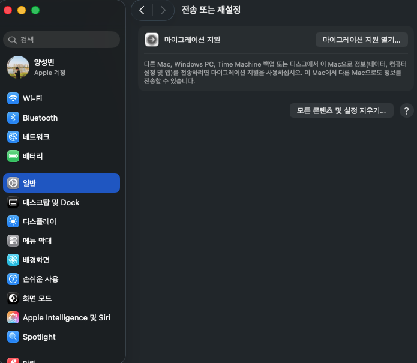
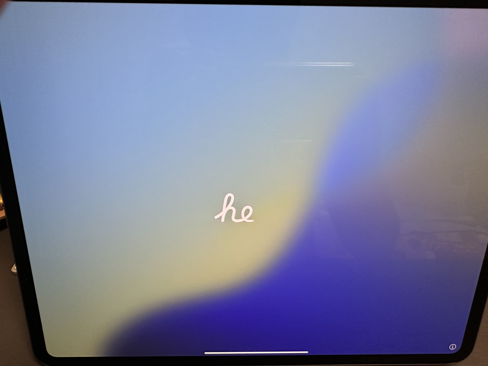
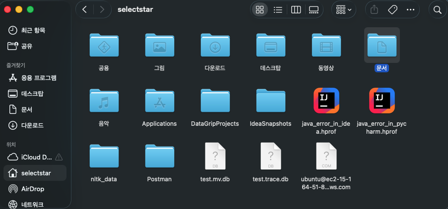
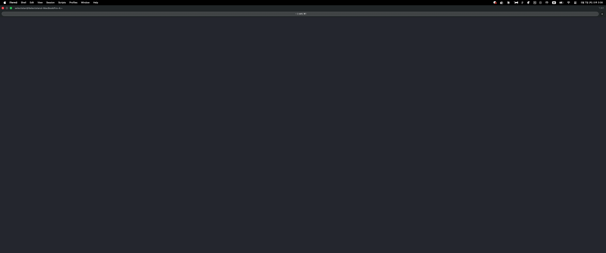

> 해당 포스팅은
> 인프런의 [맥북 처음 샀을 때 꼭 해야 할 세팅 A to Z (Claude Code · Homebrew · Agentic Coding 포함 | macOS 올인원)](https://inf.run/ijAW9)를
> 참조하여
> 만들었습니다.


## 📺 제 맥북을 직접 초기화했습니다..

필자는 이미 개발자였기 때문에 맥북에 너무나도 많은 세팅이 되어 있는 상태였다. 그런데 해당 포스팅을 진행하면서 여러 가지 맥 세팅을 알려드려야 하는데, 현재 상태에서부터 시작하는 것은 필자도 헷갈리는
부분이 있을 뿐 아니라 결정적으로 독자들에게 큰 도움이 되지 않을 수 있겠다는 생각이 들었다. 그래서 맥북을 초기화하는 과정을 시뮬레이션해보고 처음부터 진행해보려고 한다. 본격적으로 macOS 세팅을 시작하기
전에 아래 링크를 먼저 보여드리려고 한다.

> https://support.apple.com/ko-kr/109033

최신 버전 macOS의 이름은 Tahoe다.

> macOS의 이름은 여러 가지로 계속 바뀌어 오고 있다.
>
> 필자는 2026.05.07 기준 최신 버전인 Tahoe를 쓰고 있음을 아래에서 확인할 수 있다.



필자의 초기화 시뮬레이션은 최신 버전으로 진행할 예정이다. 그러면 한번 초기화를 진행해보자. 아래와 같이 설정에 들어가서 일반을 클릭한다.



다음으로 하단의 "전송 또는 재설정"을 클릭한다. 그러면 아래와 같은 화면이 나올 것이다.



그리고 "모든 콘텐츠 및 설정 지우기"를 클릭한 뒤 비밀번호를 입력하면 전체 프로그램이 삭제될 것이다. 그러면 한번 진행해보자.

## ⚙️ MacOS 초기 설정 및 유저 생성

맥을 초기화하면 맥 초기 화면이 나올 것이다.



유튜브 등을 참고하면서 계속 진행해보자. 그러다 보면 Mac 계정 생성 단계가 나올 것이다. 여기서 가장 중요한 부분이 등장한다. 바로 **계정 이름**이다. 가장 주의해야 할 점은 한글 이름을
지정하는 경우다. 한글 이름을 지정하면 Python이나 JavaScript가 제대로 동작하지 않는 이슈가 있다. 물론 나중에 변경할 수도 있다. 그런데 변경한 이후에도 설정이 꼬이는 경우가 있는데, 그것을 독자들이
다시 새로 세팅하기에는 너무 번거롭고, 새로 세팅한다고 하더라도 환경이 확실하게 잡히지 않는 경우가 존재한다. 그래서 가장 좋은 방법은 처음 만들 때부터 영어로 쓰는 것이다. 나머지 항목은 편한 방식으로
진행하면 된다.

다음은 Apple 계정 로그인인데 지금 진행해도 좋고 나중에 해도 무방하다. 편한 방식으로 진행하면 된다. 다음으로 이용약관이 나오는데 동의를 누르고 계속 진행해보자. 시간대는 독자가 속한 국가로
설정하고, 분석 항목도 편한 방식으로 선택하면 된다. 나머지 단계도 편하게 진행하면 된다. 앞으로 조금 불편하거나 헷갈릴 수 있는 부분들을 위주로 작성해보겠다. 그렇게 계속 진행하다 보면 세팅이 완료된다.


여기서 중요했던 부분은 계정 설정이었던 것 같다. 이제 영어 이름이 제대로 들어갔는지 확인해보자. 파인더를 켜서 문서를 누르고, Mac 단축키 `command + 위 화살표`를 누르면 해당 문서보다 한 단계 위로
올라갈 수 있는데, 아까 계정명으로 설정한 이름이 제대로 나와 있는 것을 알 수 있다.



## 📑 MacOS 소개, 유닉스 명령어, 앱 추천 리스트

이제 앞으로 학습할 macOS 소개, 간단한 유닉스 명령어, 앱 추천 리스트에 대해 정리해보겠다. 여기 있는 내용을 모두 암기하기보다는, 잘 메모해두었다가 잊어버렸을 때 참고하면서 친숙해지는
것을 목표로 해보자.

### macOS 한 번에 이해하기

> 처음 쓰는 사람도, 개발을 시작하는 사람도 이해할 수 있는 macOS 사용법과 유닉스 기초

- **대상 독자**: macOS 초보자, Windows에서 넘어온 사용자, 개발 공부를 시작한 사용자
- **문서 성격**: 친절하지만 가볍지 않은 실전형 입문 가이드
- **출처**: [주말코딩 (youtube.com/@weekendcode)](https://youtube.com/@weekendcode)

---

#### 0. 들어가며

이 문서는 GUI와 CLI를 따로 떼어 보지 않고, macOS를 실제로 이해하고 다루는 데 도움을 드리는 입문서예요.

##### 이 문서의 대상

Windows 환경에 익숙하지만 Mac을 새로 쓰게 된 분들, 개발 공부를 시작하면서 macOS도 함께 익혀야 하는 분들, Finder와 Terminal이 여전히 낯선 분들을 위해 준비한 문서예요.

##### 이 문서로 얻을 수 있는 것

| 얻을 수 있는 것   | 설명                                              |
|-------------|-------------------------------------------------|
| macOS 구조 이해 | Darwin, XNU, Finder, Terminal의 관계를 입문자 눈높이에서 이해 |
| 명령어 감각      | 파일 탐색, 검색, 권한, 프로세스 관련 기초 명령 학습                 |
| 실전 습관       | 설치, 삭제, 백업, 정리, 단축키, 권한 관리 감각 형성                |
| 개발 연결성      | Homebrew, Git, SSH, zsh 같은 주제로 확장 가능            |

##### 핵심 관점

> macOS를 잘 다룬다는 것은 화면 버튼을 많이 아는 것이 아니라, **파일·앱·권한·설정·명령어가 어떻게 연결되는지** 이해하는 거예요.

##### GUI와 CLI를 함께 익히는 이유

GUI는 친절하고 직관적이에요. CLI는 더 정확하고 반복하기 쉬운 작업 방식을 제공해요. 두 방식은 서로 경쟁하는 관계가 아니라, 함께 배울수록 이해를 더 잘 도와주는 관계예요. Finder가 파일 구조를 눈으로
보여 준다면, Terminal은 경로와 명령이라는 더 직접적인 언어로 같은 구조를 이해하는 데 도움을 줍니다.

---

#### 1. macOS의 유닉스 기반 역사와 소개

macOS는 세련된 GUI 운영체제이면서도 **Darwin과 XNU를 기반으로 한 유닉스 계열 시스템**이에요.

##### macOS는 어떤 운영체제인가

macOS는 Apple이 Mac용으로 개발한 데스크톱 운영체제예요. 사용자는 Finder, Dock, 메뉴바, 설정 앱 같은 그래픽 환경을 먼저 접하지만, 그 아래에는 유닉스 계열 시스템의 성격이 살아 있어요. 이
점
때문에 일반 사용자에게는 쓰기 쉬운 운영체제이고, 개발자에게는 강력한 도구를 제공하는 운영체제가 돼요.

##### 유닉스란 무엇인가

| 개념         | 입문자용 설명                                       |
|------------|-----------------------------------------------|
| 파일 중심 사고   | 설정과 로그를 포함한 많은 자원을 파일처럼 다뤄요.                  |
| 작은 도구 조합   | 하나의 거대한 앱보다, 한 가지 일을 잘하는 도구를 이어 붙이는 방식을 선호해요. |
| 텍스트 기반 작업  | 자동화와 검색이 쉬워요.                                 |
| 다중 사용자와 권한 | 사용자와 그룹, 권한 개념이 운영체제 깊숙이 들어 있어요.              |

##### Darwin, BSD, Mach, XNU

macOS는 전체 제품 이름이고, **Darwin은 기반 시스템 층**, **XNU는 커널**, **BSD와 Mach는 그 기술적 뿌리**를 설명할 때 함께 등장하는 이름이에요. 초보자 입장에서는 각 용어를 깊게
파는 것보다, macOS가 단순한 GUI 껍데기가 아니라 깊은 시스템 구조를 가진 운영체제라는 점을 감각적으로 이해하시는 것이 더 중요해요.

```
+------------------------------------------------------+
|                   사용자 앱                          |
+------------------------------------------------------+
|         GUI / Finder / Dock / 메뉴바                 |
+------------------------------------------------------+
|         프레임워크 / 시스템 서비스                    |
+------------------------------------------------------+
|                    Darwin                            |
+------------------------------------------------------+
|                   XNU 커널                           |
+------------------------------------------------------+
|                    하드웨어                          |
+------------------------------------------------------+
```

##### 역사 흐름 요약

| 시기          | 사건               | 의미                   |
|-------------|------------------|----------------------|
| 1969~1970년대 | 유닉스 시작           | 현대 운영체제와 개발 환경에 큰 영향 |
| 1997년       | Apple의 NeXT 인수   | 현대 macOS 기반 형성       |
| 2001년       | Mac OS X 공개      | 현대 계열 운영체제 본격화       |
| 2016년 이후    | macOS 명칭 사용      | Apple 플랫폼 이름 체계 통합   |
| 2020년 이후    | Apple Silicon 전환 | 성능과 배터리, 호환성 경험 변화   |

##### 헷갈리는 개념 정리

> **macOS**는 전체 운영체제, **Darwin**은 기반 시스템 층, **XNU**는 커널, **Finder**는 GUI 파일 탐색 앱, **Terminal**은 명령 입력 창, **zsh**는 명령을
> 해석하는 셸이에요.

##### 왜 개발자에게 매력적인가

GUI가 편하면서도 Terminal, Git, SSH, 패키지 관리 도구와 자연스럽게 이어진다는 점이 macOS의 큰 장점이에요. 개발뿐 아니라 문서 작업, 브라우징, 영상, 발표까지 한 기기에서 부드럽게 이어지는
감각도 큰 매력으로 느껴질 수 있어요.

---

#### 2. 대표적인 유닉스 명령어

명령어를 외워야 할 목록이 아니라 **실제 작업 흐름에 맞춘 도구 모음**으로 이해하는 것이 중요해요.

##### 명령어를 배우기 전에

| 요소  | 의미               | 예시          |
|-----|------------------|-------------|
| 명령어 | 무엇을 할지 정하는 본체    | `ls`        |
| 옵션  | 동작 방식을 바꾸는 추가 설정 | `-l`, `-a`  |
| 인자  | 대상이나 값           | `Documents` |

> ⚠️ **복붙 전 5초 점검**
> 현재 위치가 맞는지, 삭제나 권한 변경 명령은 아닌지, `sudo`가 정말 필요한지 먼저 확인하자.

##### 경로 이동과 파일 탐색

| 명령어   | 역할       | 자주 쓰는 옵션          | 예시                    | 주의점            |
|-------|----------|-------------------|-----------------------|----------------|
| `pwd` | 현재 위치 확인 | 보통 없음             | `pwd`                 | 삭제 전 확인 습관     |
| `ls`  | 목록 보기    | `-l`, `-a`, `-h`  | `ls -lah ~/Downloads` | 숨김 파일도 보일 수 있음 |
| `cd`  | 디렉터리 이동  | `~`, `..`, `-` 패턴 | `cd ~/Documents`      | 공백 경로는 따옴표 처리  |

```bash
pwd
ls
cd ~/Desktop
ls -la
```

##### 파일과 폴더 만들기

| 명령어     | 역할       | 자주 쓰는 옵션   | 예시                                | 주의점             |
|---------|----------|------------|-----------------------------------|-----------------|
| `mkdir` | 디렉터리 생성  | `-p`       | `mkdir -p project/src/components` | 중간 경로까지 생성 가능   |
| `touch` | 빈 파일 생성  | 보통 없음      | `touch memo.txt`                  | 내용은 자동으로 생기지 않음 |
| `cp`    | 복사       | `-r`, `-i` | `cp -r assets backup-assets`      | 폴더는 보통 `-r` 필요  |
| `mv`    | 이동/이름 변경 | `-i`       | `mv draft.txt final.txt`          | 복사가 아니라 위치 변경   |
| `rmdir` | 빈 폴더 삭제  | 보통 없음      | `rmdir emptyfolder`               | 안이 비어 있어야 삭제 가능 |

##### 내용 확인과 검색

| 명령어    | 역할        | 예시                         | 주의점                |
|--------|-----------|----------------------------|--------------------|
| `cat`  | 파일 전체 출력  | `cat README.md`            | 긴 파일은 보기 어려움       |
| `less` | 페이지 단위 보기 | `less large-log.txt`       | `q`로 종료            |
| `head` | 앞부분 보기    | `head -n 20 server.log`    | 시작 부분 확인용          |
| `tail` | 끝부분 보기    | `tail -f server.log`       | `Ctrl + C`로 종료     |
| `grep` | 문자열 검색    | `grep -ni "error" app.log` | 검색 범위를 과하게 넓히지 않기  |
| `find` | 파일 찾기     | `find . -name "*.md"`      | 범위가 넓으면 결과가 매우 많아짐 |

##### 삭제, 권한, 시스템 상태

> ⚠️ **`rm -rf`는 특히 조심해야 하는 조합이에요.** 경로를 잘못 입력하면 매우 큰 피해가 날 수 있어요.

| 명령어      | 핵심 역할     | 예시                               | 주의점                                |
|----------|-----------|----------------------------------|------------------------------------|
| `rm`     | 삭제        | `rm -i memo.txt`                 | 휴지통처럼 복구되지 않음                      |
| `chmod`  | 권한 변경     | `chmod +x run.sh`                | 숫자 권한은 의미를 이해하고 사용                 |
| `chown`  | 소유권 변경    | `sudo chown user:staff file.txt` | 시스템 파일에 신중                         |
| `sudo`   | 관리자 권한 실행 | `sudo command`                   | 이유를 모르면 사용하지 않기                    |
| `ps`     | 프로세스 목록   | `ps aux`                         | 문제 해결 시 유용                         |
| `top`    | 실시간 상태 보기 | `top`                            | Activity Monitor의 텍스트 버전으로 생각하면 쉬움 |
| `kill`   | 프로세스 종료   | `kill 12345`                     | `-9`는 강제 종료                        |
| `uname`  | 시스템 정보    | `uname -a`                       | 설치 문서 확인에 유용                       |
| `whoami` | 현재 사용자    | `whoami`                         | 권한 문제 파악에 도움                       |

##### 현대 macOS 실사용 명령

| 명령어     | 역할           | 예시                  | 포인트                  |
|---------|--------------|---------------------|----------------------|
| `open`  | 파일·폴더·URL 열기 | `open .`            | Terminal과 Finder를 연결 |
| `which` | 명령 위치 확인     | `which brew`        | PATH 이해에 중요          |
| `echo`  | 텍스트/변수 출력    | `echo $HOME`        | 환경 변수 확인용            |
| `git`   | 버전 관리        | `git status`        | `status`를 자주 보기      |
| `curl`  | URL 요청       | `curl -LO URL`      | 받은 스크립트 즉시 실행은 신중    |
| `ssh`   | 원격 접속        | `ssh user@host`     | 공개키 기반 접속 이해         |
| `brew`  | 패키지 관리       | `brew install wget` | `--cask` 구분하기        |

---

#### 3. 추천 앱

많이 설치하는 것보다 **현재의 불편을 정확히 해결하는 조합**을 고르는 것이 중요해요.

##### 카테고리별 추천

| 카테고리     | 앱                                                                                | 핵심 용도                | 추천 대상                     |
|----------|----------------------------------------------------------------------------------|----------------------|---------------------------|
| 런처       | Raycast, Alfred                                                                  | 빠른 실행과 검색, 워크플로우     | 키보드 중심 사용을 원하는 사용자        |
| 창 관리     | Rectangle, AltTab, BetterTouchTool                                               | 창 정렬, 전환, 제스처 보완     | 멀티태스킹이 많은 사용자             |
| 클립보드     | Maccy, Clipy                                                                     | 히스토리와 스니펫            | 복사/붙여넣기가 많은 사용자           |
| 삭제/정리    | AppCleaner, Pearcleaner, Hidden Bar                                              | 앱 제거, 메뉴바 정리         | 환경을 깔끔하게 유지하고 싶은 사용자      |
| 캡처/파일    | Shottr, Dropover, Keka                                                           | 스크린샷, 임시 선반, 압축      | 문서 작업, 강의, 파일 이동이 많은 사용자  |
| 브라우저/미디어 | Zen Browser, Brave, IINA, Hand Mirror                                            | 브라우징, 영상, 카메라 확인     | 집중 환경과 미디어 사용을 모두 원하는 사용자 |
| 일정/지식    | Notion Calendar, Numi, Obsidian, Dato                                            | 일정, 계산, 노트           | 학습과 업무 정리를 함께 하는 사용자      |
| 개발       | Karabiner-Elements, Proxyman, TablePlus, ResponsivelyApp, Postman, HTTPS Unicorn | 입력 환경, 네트워크, DB, 테스트 | 개발 공부를 시작하거나 실무를 하는 사용자   |

##### 강사(주말코딩) 실사용 앱

| 앱               | 실사용 포인트            |
|-----------------|--------------------|
| Alfred          | 빠른 실행과 워크플로우 자동화   |
| Pearcleaner     | 앱 제거 후 잔여 파일 정리    |
| IINA            | 영상 재생과 강의 자료 확인    |
| Brave           | 개발 테스트와 일반 브라우징 병행 |
| HTTPS Unicorn   | 로컬 HTTPS 환경 테스트    |
| ResponsivelyApp | 반응형 웹 강의·실습 확인     |
| Hidden Bar      | 메뉴바 정리             |
| CheatSheet      | 단축키 학습 보조          |
| Clipy           | 스니펫과 클립보드 재사용      |
| Rectangle       | 창 정렬               |
| Scroll Reverser | 입력 장치 감각 보정        |
| TopNotch        | 상단 디자인 정리          |
| Postman         | API 테스트            |

##### 빠른 추천

| 분류                | 앱 5개                                                                                         |
|-------------------|----------------------------------------------------------------------------------------------|
| 입문자가 먼저 설치하면 좋은 앱 | Rectangle, Raycast, AppCleaner, Maccy 또는 Clipy, Hidden Bar                                   |
| 개발자라면 추가하면 좋은 앱   | Homebrew, TablePlus, Proxyman, Karabiner-Elements, ResponsivelyApp 또는 Postman                |
| 취향에 따라 갈리는 앱      | Raycast vs Alfred, Maccy vs Clipy, Zen Browser vs Brave vs Safari, BetterTouchTool, TopNotch |

---

#### 4. macOS를 잘 다루기 위한 여러 팁들

Finder 정리, 설치 습관, 백업과 보안, 터미널 태도 같은 작은 습관이 맥 사용 경험을 크게 바꿔요.

##### Finder를 잘 쓰는 습관

사이드바는 자주 여는 위치만 남기고, 다운로드 폴더는 수정 날짜 기준으로 정렬해 보세요. Quick Look도 자주 활용하시면 작업 흐름이 훨씬 더 편해져요.

> 💡 **실전 팁**: 사이드바는 운영체제 전체 구조를 보여 주는 목록이라기보다, 자주 여는 위치를 모아 둔 바로가기 모음이라고 생각하시면 관리가 훨씬 쉬워져요.

##### Spotlight / Raycast / Alfred

앱 실행, 계산, 간단한 검색은 런처에서 처리하는 습관을 들여 보시면 좋아요. 키보드 몇 번으로 작업 흐름이 이어지면 Dock과 Launchpad를 오가는 횟수도 자연스럽게 줄어들어요.

##### Dock과 메뉴바 정리

Dock에는 매일 쓰는 앱만 남겨 두시는 편이 좋아요. 메뉴바에도 상태 확인이 꼭 필요한 항목만 남기면 훨씬 깔끔해져요. 메뉴바가 어수선하다면 Hidden Bar 같은 보조 도구가 정리에 도움을 줍니다.

##### 트랙패드와 제스처

두 손가락 스크롤, 보조 클릭, Mission Control, 데스크톱 전환 제스처부터 익히면 맥 특유의 입력 경험이 훨씬 더 편해져요.

##### 파일 경로와 폴더 구조

유닉스 계열 시스템에서는 **루트 디렉터리**와 **홈 디렉터리**를 구분해서 이해하시면 좋아요. 루트 디렉터리 `/`는 시스템 전체의 가장 바깥 기준점이에요. 시스템 폴더와 공용 경로는 여기서 시작해요. 반면 홈
디렉터리 `~`는 현재 사용자에게 주어진 개인 작업 공간이에요. 문서, 다운로드, 바탕화면, 개인 설정처럼 내가 직접 다루는 파일은 홈 디렉터리 주변에 두는 경우가 많아요.

| 경로              | 의미                   |
|-----------------|----------------------|
| `/Applications` | 앱이 주로 설치되는 위치        |
| `/Users`        | 사용자 계정 상위 경로         |
| `~/Downloads`   | 다운로드 파일 보관 위치        |
| `~/Library`     | 사용자 기준 설정, 캐시, 앱 데이터 |

##### 앱 설치 방식의 차이

| 방식        | 특징              | 언제 적합한가         |
|-----------|-----------------|-----------------|
| App Store | 가장 단순하고 안전한 편   | 초보자, 공식 앱 중심    |
| DMG       | 드래그 앤 드롭 설치가 많음 | 일반적인 서드파티 앱     |
| pkg       | 설치 마법사 형식       | 보조 구성 요소가 필요한 앱 |
| brew      | 명령줄 기반 설치       | 개발 도구와 반복 세팅    |

##### 백업과 보안

Time Machine은 한 번쯤 꼭 설정해 두시면 좋아요. Gatekeeper와 관리자 권한도 불편한 장애물이라기보다, 실수를 줄여 주는 보호막이라고 생각하시면 이해가 더 쉬워져요.

> 💡 **실전 팁**: `sudo`가 붙은 명령을 복붙하기 전에는, 그 명령이 정말 시스템 수준 변경을 요구하는지 먼저 확인해 주세요.

##### 초보자가 자주 하는 실수

| 실수               | 왜 문제인가         | 더 나은 습관                   |
|------------------|----------------|---------------------------|
| 다운로드 폴더 방치       | 파일이 쌓여 찾기 어려워짐 | 주 1회 정리                   |
| 의미 모르는 `sudo` 사용 | 시스템 설정 꼬임 가능   | 이유 확인 후 사용                |
| 앱을 휴지통으로만 삭제     | 관련 파일이 남을 수 있음 | AppCleaner/Pearcleaner 활용 |
| 런처 대신 Dock만 고집   | 작업 흐름이 느려짐     | Spotlight 또는 Raycast 활용   |
| Terminal 완전 회피   | 문제 해결이 어려워짐    | 읽기 명령부터 익히기               |

---

#### 5. 마무리

macOS를 잘 다룬다는 것은 많은 기능을 외우는 것이 아니라, **운영체제의 구조와 자신만의 사용 습관을 함께 만드는 것**이에요.

##### 입문자용 추천 학습 순서

1. Finder와 파일 구조 익히기
2. 필수 단축키 5~10개 익히기
3. Spotlight 또는 Raycast 사용 습관 만들기
4. `pwd`, `ls`, `cd`, `mkdir`, `cat` 익히기
5. 앱 설치와 삭제 방식 이해하기
6. Homebrew, Git, SSH 같은 주제로 확장하기

---

#### 부록 A. 필수 단축키 모음

> ⚠️ **꼭 확인해 주세요.**
> 단축키로 앱을 종료하기 전에는 지금 어떤 애플리케이션이 선택되어 있는지 먼저 확인해 주세요. 현재 선택된 애플리케이션 이름은 화면 왼쪽 위 메뉴바에서 확인할 수 있어요.

| 단축키                       | 설명           |
|---------------------------|--------------|
| `Command + Space`         | Spotlight 열기 |
| `Command + Tab`           | 앱 전환         |
| `Command + Q`             | 앱 종료         |
| `Command + W`             | 창 닫기         |
| `Command + Shift + 3/4/5` | 스크린샷 관련      |
| `Space`                   | Quick Look   |

---

#### 부록 B. 대표 명령어 치트시트

| 명령어    | 역할       | 예시                         |
|--------|----------|----------------------------|
| `pwd`  | 현재 위치 확인 | `pwd`                      |
| `ls`   | 목록 보기    | `ls -la`                   |
| `cd`   | 폴더 이동    | `cd ~/Documents`           |
| `grep` | 문자열 검색   | `grep -ni "error" app.log` |
| `git`  | 버전 관리    | `git status`               |
| `brew` | 패키지 관리   | `brew install wget`        |

---

#### 부록 C. 추천 앱 요약표

| 카테고리 | 앱                                                | 핵심 용도     |
|------|--------------------------------------------------|-----------|
| 런처   | Raycast, Alfred                                  | 빠른 실행과 검색 |
| 창 관리 | Rectangle, AltTab, BetterTouchTool               | 창 정렬, 전환  |
| 클립보드 | Maccy, Clipy                                     | 히스토리와 스니펫 |
| 개발   | Karabiner-Elements, Proxyman, TablePlus, Postman | 개발 생산성 향상 |

---

## 🐚 터미널과 외부 터미널 설치

이번에는 터미널과 외부 터미널 설치에 대해 학습해보자. 터미널이 무엇인지 간단히 짚어보고, 필자가 사용하고 있는 터미널과 AI 시대에 사람들이 가장 많이 쓰는 터미널 종류를 설명해보겠다.

터미널을 배우기 전에 터미널이 무엇인지 알아보자. 가장 기본적으로 시작해야 할 것이 바로 운영체제다. 운영체제 중에서도 macOS는 UNIX 계열을 기반으로 만들어졌기 때문에, UNIX가 어떻게 동작하는지 대략적으로
알아야 한다. UNIX는 Portable Operating System Interface, 즉 표준 규격인 POSIX를 따르는 운영체제다. 이 POSIX라는 정의를 따르는 형태의
운영체제인 것이다. 사용자는 운영체제에 명령을 내리거나, 입력한 명령에 대한 응답을 받을 때 터미널이라는 것을 사용한다. 터미널을 셸(shell)이라고 부르는 경우도 있다. 셸은
CS에서 컴퓨터 프로그램의 한 종류로, 비교적 넓은 형태이며 시스템에 직접적으로 접근할 수 있다고 정의되어 있다. 이게 무슨 이야기냐면, 운영체제 시스템에 직접 명령을 내릴 수 있는 프로그램을 의미한다.
이러한 셸을 UNIX 계열에서는 흔히 터미널이라고 부른다.

macOS에서 터미널은 바탕화면에 보이지 않는다. macOS 검색창에 **터미널**이라고 검색해보면 나오는 것을 알 수 있다.


여기서 어떤 명령어를 치면 그 명령어에 대한 결과가 나온다. 몇 가지 중요한 명령어가 있어서 실제로 AI 에이전트를 돌릴 때 많이 사용하게 될 것이다. 그리고 AI 에이전트들도 이 명령어를
사용하는 도구를 실행시키게 된다.

> 이는 UNIX 명령어를 학습할 때 다뤄보자.

macOS에서 기본 제공하는 터미널을 사용해도 되지만 필자는 별로 추천하지 않고, 새로운 별도의 터미널을 다운받을 것이다. 최근 AI 에이전트 코딩이 많이 부상하면서 여러 터미널로
갈아타는 분들이 많은 것으로 알고 있다. 그래서 대표적인 세 가지 종류의 터미널을 설명하고, 다른 터미널 종류는 별도로 소개하도록 하겠다.

### iterm2

필자가 사용하고 있는 터미널은 **iterm2**다. [iterm2](https://iterm2.com/)에 접속하여 다운로드받으면 된다. iterm2를 사용하는 이유는 나중에 원하는 형태로
커스터마이즈하기가 매우 좋기 때문이다.

> 커스터마이즈 과정은 나중에 따로 시간을 가질 예정이다.

물론 독자가 이것을 똑같이 사용할 필요는 없다.

### ghostty

두 번째로 많이 사용되는 터미널 프로그램은 [ghostty](https://ghostty.org/)다. 특히 ghostty는 GPU를 이용해서 화면을 그리기 때문에 빠르고, 기능이 많은 크로스 플랫폼 터미널
에뮬레이터다.

> ghostty는 플랫폼 네이티브 UI와 GPU 가속 기능을 갖춘 터미널 에뮬레이터다.

다만 필자는 ghostty를 사용하다가 몇 가지 버그를 경험하여 현재는 사용하고 있지 않다.

### warp terminal

[warp terminal](https://www.warp.dev/)은 에이전트 빌딩에 특화된 형태의 터미널이다. 사용하고 싶은 분은 사용해도 무방한데, Warp은 실제 에이전트 코딩을 하시는 분들이
굉장히 많이 쓰는 터미널이다. 다만 필자는 사용하고 있지 않다. 요새는 이런 것들 외에도 GitHub에 오픈소스로 올라온 터미널이 굉장히 많으니 한번 찾아보도록 하자.

결론적으로 필자는 iterm2를 사용할 것이고, 별도의 설치 과정은 생략하겠다. 각자 설치하면 아래와 같은 화면이 나올 것이다.



위의 사진을 보면 `zsh`라고 보이는데, 이것을 우리는 Z shell이라고 부르며 유닉스 셸 종류 중 하나다. 유닉스 셸에는 bash, z-shell, c-shell 등 다양한 종류가 존재한다.
지금 iterm2에는 zsh가 들어 있는 것이고, 정확히 말하면 iterm2가 zsh를 래핑한 프로그램이라고 생각하면 좋다.

또한 zsh를 구글링해보면 바로 [oh my zsh](https://ohmyz.sh/)가 나오는데, 이것은 사람들이 만든 프로젝트로 우리의 iterm2를 커스터마이징하는 데 사용할 수 있다. 해당 페이지에 가면
다양한 테마와 색상이 존재한다. 한번 직접 살펴보도록 하자.

그러면 이것이 왜 중요할까? 가상 환경이 떠 있는지 떠 있지 않은지를 한눈에 확인할 수 있다는 점이 가장 중요하다.
특히 Python이나 Ruby로 개발하다 보면 이것이 얼마나 중요한지 알 수 있을 것이다. 어떤 환경을 세팅하고 서버를 올리기 전에 로컬에서 미리 세팅해두는 것이 굉장히 중요하기 때문이다.

또한 oh my zsh 외에도, zsh를 더 예쁘게 꾸밀 수 있는 powerlevel10k가 존재한다. oh my zsh를 통해 zsh의 테마를 커스터마이징했다면, UI를 더 보기 좋게 꾸밀 수 있는
GUI 도구도 존재한다는 뜻이다. 이런 여러 가지 도구들을 한꺼번에 세팅해두는 수고가 필요하니 한번 도전해보자.

## ⌨️ MacOS 주요 단축키

이제 macOS 초기화 및 세팅을 완료했다. macOS를 본격적으로 다루기 전에 크게 두 가지를 말하고 싶다. 첫 번째는, macOS를 처음 쓰는 분이라면 단축키가 어색할 수 있다는 점이다. 윈도우와
다르게 맥은 모든 프로그램에서 키보드의 특수 문자(기호)를 단축키 표시로 사용한다. 이 키보드의 단축키 기호가 익숙하지 않다면 개발할 때도 여러 키에 대해 헷갈릴 수 있을 것이다.
그래서 그것을 먼저 살펴보고 시작해보자.

### 키보드에 있는 문자

- command: 단축키 핵심 키
- option: 특수 문자 입력
- shift: 대문자 / 기호
- control: 보조 제어
- return: 엔터
- delete: 삭제

여기서 맥을 처음 쓰는 독자라면 가장 헷갈리는 것이 command, option, shift이다. 보면 알겠지만 익숙하지 않은 기호들로 구성되어 있는 것을 볼 수 있다. 해당 키보드 키의 문양을
외워두면 크게 어렵지 않을 것이다.

### 기본적인 macOS 단축키

- command + w: 현재 실행 중인 창 닫기
- command + q: 현재 실행 중인 애플리케이션 종료
- command + space: Spotlight 검색
- control + 화살표(좌/우): 멀티 데스크톱 화면 이동
- command + delete: 파일 삭제

위의 단축키 목록은 가장 기본적인 단축키이며, 거의 대부분의 응용 프로그램에서 동일하게 동작한다.

> 물론 그렇지 않은 경우도 존재한다.

거의 비슷하게 동작하니 유심히 살펴보고 외워보자.

## 📜 MacOS 발전의 역사

### macOS의 역사: Macintosh System Software부터 Apple Silicon까지

평소에 매일 사용하는 macOS가 어떤 길을 걸어 지금의 모습이 되었는지 정리해보려고 한다. 백엔드 개발자로서 매일 터미널을 열고, Homebrew로 패키지를 설치하고, Docker를 띄우면서도 정작
이 운영체제가 어떤 구조 위에서 동작하는지에 대해서는 깊게 생각해본 적이 별로 없었다. 마침 macOS 역사를 한번 정리해 볼 기회가 생겨서, 1984년 첫 Macintosh부터 최근의 Apple Silicon
시대까지 어떤 핵심 전환점들이 있었는지 차근차근 살펴보려고 한다.

macOS의 역사는 크게 다섯 시점으로 나눠 볼 수 있다. 1984년 System Software의 등장, 1996년 NeXT 인수, 2001년 Mac OS X 출시, 2006년 Intel 전환, 그리고 2020년
이후의 Apple Silicon 시대다. 각 시점마다 Apple은 단순한 버전업이 아니라 운영체제의 뼈대 자체를 바꾸는 큰 결정을 내려왔는데, 이 흐름을 따라가다 보면 오늘날 macOS가 왜 지금과 같은 모습이
되었는지 자연스럽게 이해할 수 있다.

### 시작점: 고전 Mac OS가 만든 사용자 경험 혁명

1984년 Macintosh와 함께 등장한 System Software는 명령어 중심이던 개인용 컴퓨팅을 그래픽 사용자 인터페이스 중심으로 전환시킨 출발점이다. 지금의 우리에게는 너무나 당연한 폴더, 아이콘, 메뉴,
창이라는 시각적 메타포가 이때 처음으로 일반 사용자에게 본격적으로 제공되었고, 이후 데스크톱 운영체제 설계의 기준이 되었다.

하지만 초기 Mac OS는 사용성 면에서는 선구적이었지만, 현대적 운영체제의 핵심인 메모리 보호와 안정적인 멀티태스킹 구조는 충분히 갖추지 못했다. 백엔드 관점에서 비유해보자면, 모든 프로세스가 같은 메모리 공간을
공유하는 환경에서 한 프로세스가 잘못된 메모리 영역에 접근하면 시스템 전체가 영향을 받는 구조였다. 이는 마치 트랜잭션 격리 수준이 전혀 없는 데이터베이스에서 모든 세션이 같은 데이터를 직접 만지는 것과 비슷한
상황이라고 보면 된다. 단순한 작업에서는 문제가 없지만, 동시에 여러 작업을 안정적으로 처리해야 하는 환경에서는 한계가 명확했다.

그 결과 복잡한 소프트웨어와 네트워크 환경이 확장되자 한계가 드러났고, Apple은 더 근본적인 구조 전환이 필요하다는 결론에 이르렀다. 그럼에도 이 시기의 유산은 오늘날 macOS 깊숙이 남아 있다. 직관적인
인터페이스, 타이포그래피 중심의 미감, 창 기반 생산성, 크리에이티브 워크플로우라는 Mac의 정체성은 바로 이 시기의 철학 위에서 성장했다고 볼 수 있다.

정리하자면 고전 Mac OS는 다음과 같은 특징을 가진다.

- System 1부터 9까지 이어지며 메뉴바, Finder, 데스크 액세서리 같은 핵심 UI 요소를 정착시켰다.
- 사용성 측면에서는 강력했지만 안정성 구조는 제한적이었다.
- 이 시기의 디자인 철학이 이후 macOS 경험의 기준이 되었다.

### 전환점: NeXT 기술이 macOS의 뼈대를 바꾸다

Apple은 기존 Mac OS의 구조적 한계를 해결하기 위해 1996년 NeXT를 인수했고, 이 결정이 훗날 Mac OS X의 직접적인 토대가 되었다. NeXT는 스티브 잡스가 Apple을 떠난 후 설립한
회사인데, 그곳에서 만든 NeXTSTEP이라는 운영체제는 이미 현대적인 운영체제 설계를 갖추고 있었으며, 안정성·개발 생산성·그래픽 처리 측면에서 강점을 보였다.

기술적으로 가장 중요한 변화는 커널 구조였다. NeXTSTEP은 Mach 마이크로커널과 BSD Unix를 하나의 커널 공간에서 결합한 XNU 하이브리드 커널 구조를 채택했고, 이를 통해 멀티태스킹, 메모리 보호,
권한 체계, 네트워킹 신뢰성이 크게 향상되었다. 백엔드 개발자 시점에서 보면 이 부분이 정말 흥미로운데, 사실상 macOS는 이때부터 Unix 계열 운영체제가 되었기 때문이다. 우리가 macOS에서 `ls`,
`grep`, `ssh`, `curl` 같은 명령어를 자연스럽게 쓸 수 있는 이유, 그리고 Linux 서버에서 작성한 셸 스크립트를 큰 변경 없이 macOS 터미널에서 돌릴 수 있는 이유가 모두 여기서 시작된다.

여기에 Objective-C 기반의 객체지향 개발 환경과 Interface Builder 경험은 이후 Cocoa 프레임워크와 Xcode 생태계로 자연스럽게 이어졌고, 훗날 Swift로 발전하는 언어적 토대가 되었다.
Java나 Kotlin으로 백엔드를 짤 때 익숙한 객체지향 패턴이 이 시기에 macOS 앱 개발 영역에서도 본격적으로 자리잡았다고 보면 된다.

그래픽 측면에서는 NeXTSTEP의 Display PostScript에서 영감을 받아 Mac OS X에서 Quartz로 새롭게 구현된 PDF 기반 렌더링 엔진이 도입되며, 고품질 화면 출력의 기준을 세웠다. 인쇄용
그래픽 기술인 PostScript를 화면 렌더링에 가져왔다는 발상이 흥미로운데, 그래서 macOS의 화면 출력과 PDF 생성이 자연스럽게 같은 파이프라인 위에서 동작하는 것이다.

macOS의 핵심 정체성은 바로 이 시점에서 완성된다. 겉으로는 사용자 친화적인 Mac 경험을 유지하면서, 내부는 Unix 계열의 강력하고 안정적인 시스템으로 재구성한 덕분에 일반 사용자와 전문가, 개발자를 동시에
만족시키는 플랫폼이 될 수 있었다. 이 "겉은 부드럽지만 속은 단단한" 구조가 오늘날까지 이어지는 macOS의 가장 큰 강점이다.

### Mac OS X의 핵심 엔진: Aqua, Darwin, Cocoa/Quartz

2001년 출시된 Mac OS X는 사용자 경험과 시스템 구조를 함께 바꾼 큰 변화였다. 이 변화를 이해하려면 세 가지 레이어를 함께 살펴보는 것이 좋다.

먼저 **Aqua**는 Mac OS X의 시각적 정체성을 책임지는 인터페이스다. Dock과 반투명 효과, 부드러운 곡선의 윈도우 디자인으로 Mac OS X의 첫인상을 규정했고, 기능보다 경험을 먼저 전달하며 운영체제
자체를 하나의 브랜드로 만들었다. 지금 우리가 macOS를 떠올릴 때 자연스럽게 그려지는 그 시각적 인상이 Aqua에서 시작되었다고 보면 된다.

다음으로 **Darwin**은 Mac OS X의 오픈소스 기반 시스템이다. 앞서 이야기한 BSD Unix와 Mach를 바탕으로 권한 관리와 안정성을 확보했고, 개발자 친화적 구조 덕분에 터미널과 서버 작업도
자연스럽게 품을 수 있게 되었다. Darwin이 있기 때문에 macOS에서 Nginx나 PostgreSQL 같은 Linux 서버용 소프트웨어를 거의 그대로 빌드해서 돌려볼 수 있고, Docker Desktop이나
Homebrew 같은 도구가 자연스럽게 동작할 수 있는 것이다.

마지막으로 **Cocoa와 Quartz**는 앱 개발과 화면 출력을 담당하는 레이어다. Cocoa는 현대 Mac 앱의 틀을 잡아 주는 객체지향 프레임워크이고, Quartz는 부드러운 화면 렌더링을 맡았다. 결과적으로
Mac 앱은 더 정교하고 더 읽기 좋은 인터페이스를 갖게 되었다. 백엔드 비유로 풀자면, Cocoa는 Spring 프레임워크처럼 앱의 표준 구조를 잡아 주는 역할이고, Quartz는 그 위에서 동작하는 출력
엔진이라고
보면 자연스럽다.

이 세 레이어가 위아래로 차곡차곡 쌓여 있는 구조 덕분에, Mac OS X는 단순한 OS 업데이트가 아니라 완전히 새로운 운영체제로 다시 태어날 수 있었다.

### 성장기: 10.0부터 Snow Leopard까지

Mac OS X는 출시 이후 약 10년 동안 빠른 속도로 발전했다. 이 시기는 새로운 운영체제의 기반을 다지는 동시에 실사용성을 끌어올리는 과정이었다고 볼 수 있다.

**Cheetah와 Puma (2001, 10.0/10.1)**는 새 운영체제의 방향을 처음 제시한 단계다. Aqua와 Unix 기반 구조가 본격적으로 등장했지만, 성능과 완성도는 아직 과도기 단계였다. 새로운
시스템이 그렇듯 초기 사용자들은 안정성보다 가능성을 보고 사용했던 시기다.

**Jaguar (2002, 10.2)**에서는 전반적인 속도와 반응성이 크게 개선되었다. 특히 Quartz Extreme이 도입되면서 GPU를 활용한 화면 렌더링이 본격화되었고, 이때부터 Mac OS X가
실용적으로 쓸 만한 운영체제라는 평가를 받기 시작했다.

**Panther와 Tiger (2003~2005, 10.3/10.4)** 시기에는 Exposé, Spotlight, Dashboard 같은 기능들이 도입되었다. 검색과 창 관리, 생산성 경험이 강화되면서 Mac
OS X의 대중적 매력이 본격적으로 확대된 시기다. 특히 Spotlight는 운영체제 차원에서 파일 색인을 만들어 검색을 빠르게 만들어 주는 기능인데, 백엔드로 비유하자면 Elasticsearch 같은 검색 인덱스를
OS가 기본으로 깔아준 셈이라고 볼 수 있다.

**Leopard와 Snow Leopard (2007~2009, 10.5/10.6)**는 기능 추가보다 완성도와 효율에 집중한 단계다. Leopard에서 Time Machine이 도입되며 백업 경험이 혁신되었고,
Snow Leopard에서는 64비트 전환과 내부 성능 정비가 가속되었다. 특히 Snow Leopard는 거의 새로운 기능 없이 내부 최적화에만 집중한 버전으로 유명한데, 지금도 많은 개발자들이 가장 안정적이었던
버전 중 하나로 기억하는 시기다.

### 시대별 대표 소프트웨어와 제품

기반이 다져진 Mac OS X는 이후 세 가지 영역에서 강력한 소프트웨어 생태계를 만들어 갔다.

**크리에이티브 영역**에서는 Photoshop, Final Cut Pro, Logic Pro가 Mac을 창작자의 기본 장비로 만들었다. 정확한 색 표현과 타이포그래피, 안정적인 미디어 워크플로우가 강점이었고, 영상
편집이나 음악 작업을 하는 사람들이 Mac을 선택하는 흐름이 이때부터 굳어졌다.

**생산성 영역**에서는 Office, iWork, Safari, Mail이 Mac을 일상 업무 도구로 확장시켰다. 개인 사용자뿐 아니라 팀 협업과 문서 중심 업무 환경에도 자연스럽게 스며들었고, 더 이상 Mac이
디자이너만 쓰는 컴퓨터가 아니게 되는 결정적 계기가 되었다.

**개발자 도구 영역**에서는 Xcode, Terminal, Homebrew가 개발자에게 강한 생산성을 제공했다. GUI와 CLI가 자연스럽게 공존해 앱 개발과 서버 작업을 한 플랫폼에서 처리할 수 있게 된 것이다.
백엔드 개발자 입장에서 가장 와닿는 부분이 바로 이 영역인데, IntelliJ로 Kotlin 코드를 짜다가 터미널을 열어 `brew install redis`로 Redis를 띄우고, 곧바로 Docker로 컨테이너를
실행하는 식의 자연스러운 워크플로우가 가능한 것은, Darwin이라는 Unix 기반 위에 GUI 환경이 잘 얹혀 있기 때문이다.

### 두 번째 대전환: Intel 전환은 macOS를 더 넓은 시장으로 보냈다

2005년 WWDC에서 발표되고 2006년 첫 Intel Mac 출시와 함께 본격화된 Intel 전환은 macOS 역사에서 가장 실용적인 결정 가운데 하나였다. PowerPC 시대의 한계를 벗어나 성능 효율, 노트북
경쟁력, 소프트웨어 이식성 측면에서 훨씬 더 넓은 선택지를 확보하게 된 것이다.

이 전환에서 인상적인 부분은 Apple이 사용자 경험의 단절을 최소화하기 위해 어떤 장치를 마련했는가이다. Apple은 전환 초기부터 Rosetta를 탑재해 기존 PowerPC 앱의 실행을 지원했고, 같은 해
Boot Camp 베타를 공개해 Windows 설치도 가능하게 했다. Boot Camp는 이후 Leopard(10.5, 2007)에서 정식 기능으로 포함되었다. 이는 단순히 CPU를 교체한 것이 아니라, 사용자가
기존 생태계와 단절되지 않고 새 하드웨어로 이동하도록 설계한 전략적 전환이었다.

백엔드 관점에서 보면 Rosetta는 일종의 호환성 레이어인데, 새 아키텍처에서 옛 바이너리를 동적으로 번역해서 실행시켜 주는 방식이다. 마치 레거시 API를 대체할 때 곧바로 끊지 않고 새 API와 옛 API를
한동안 함께 운영하다가 점진적으로 옮기는 전략과 비슷하다. 사용자 입장에서는 "내 앱이 갑자기 안 돌아간다"는 충격 없이 자연스럽게 새 환경으로 넘어갈 수 있었던 것이다.

이 시기 macOS는 전문가용 플랫폼에서 프리미엄 범용 PC 플랫폼으로 확장되었다. Intel 전환은 훗날 Apple Silicon으로 다시 구조를 바꿀 때 필요한 경험과 자신감을 축적한, 중요한 중간 단계로 평가할
수 있다. 한 번 큰 아키텍처 전환을 성공적으로 해낸 경험이 있었기 때문에, 약 15년 후의 또 다른 전환도 매끄럽게 진행될 수 있었던 것이다.

전환기의 핵심 기능을 정리하면 다음과 같다.

- Leopard에서는 Time Machine과 Boot Camp 지원이 강화되었다.
- Snow Leopard에서는 64비트 최적화와 성능 정비가 진행되었다.
- Rosetta는 아키텍처 전환 비용을 완화하는 핵심 장치였다.

### 융합의 시대: macOS는 독립 OS를 넘어 생태계의 허브가 되었다

2010년대 이후 macOS는 더 이상 독립적인 데스크톱 운영체제로만 설명되지 않는다. iPhone, iPad, Apple Watch, iCloud와 연결되며 Apple 생태계의 중심 허브로 재정의되었고,
Handoff, AirDrop, iMessage 연동, Universal Clipboard는 기기 간 연속성을 일상의 기본 기능으로 만들었다. iPhone에서 복사한 텍스트를 Mac에서 그대로 붙여넣을 수 있게 된
것은 작은 변화처럼 보이지만, 사용자 경험 관점에서는 굉장히 큰 패러다임 전환이다.

내부 기술도 크게 진화했다. 가장 흥미로운 변화 중 하나는 **APFS(Apple File System)**의 도입인데, SSD 중심 시대에 맞게 파일 시스템을 처음부터 재설계한 것이다. 기존 HFS+가 회전식
하드디스크 시대의 가정을 안고 있었던 데 비해, APFS는 SSD의 특성에 맞춰 카피온라이트(Copy-on-Write), 스냅샷, 공간 공유 같은 현대적인 기능을 기본으로 제공한다. 백엔드 개발자에게 비유하자면,
마치
디스크 기반 RDBMS의 가정을 버리고 메모리/SSD 중심으로 새로 설계한 데이터베이스 엔진을 도입한 것과 비슷한 느낌이다.

여기에 Gatekeeper와 샌드박싱은 보안을 강화했고, Metal은 그래픽 처리 효율을 높였다. Catalyst는 iOS 앱을 macOS로 이식하는 공통 기반을 처음으로 열었고, SwiftUI는 플랫폼 경계를
넘나드는 앱 개발의 새로운 표준을 제시했다. SwiftUI는 선언형 UI 패러다임인데, 백엔드 개발자에게는 React나 Compose의 사고방식과 비슷하다고 설명하면 가장 빠르게 이해된다.

이 시기의 핵심은 macOS가 한 대의 컴퓨터를 위한 소프트웨어에서 여러 기기의 경험을 연결하는 운영 레이어로 진화했다는 점이다. 사용자는 파일이 아니라 작업의 맥락 전체를 이동시키게 되었고, Apple은 그 경험을
통합 설계하는 방향으로 플랫폼 전략을 고도화했다.

버전별 주요 기능을 정리하면 다음과 같다.

- Mavericks에서는 Finder Tabs와 전력 효율 개선이 도입되었다.
- Yosemite에서는 iOS와의 연속성 디자인과 Handoff가 적용되었다.
- High Sierra, Mojave, Catalina에서는 APFS, 다크 모드, Catalyst가 차례로 강화되었다.

### 현대 macOS: Big Sur부터 Apple Silicon 최적화 시대까지

2020년 이후의 macOS는 이전과는 또 다른 방향성을 보여 준다.

**Big Sur (2020)**는 macOS 11로 번호 체계를 전환한 상징적 버전이다. Mac OS X 시절부터 약 20년간 유지하던 10.x 체계에서 벗어나면서 단순한 버전업이 아닌 새로운 시대의 시작을
알렸다. Apple Silicon 대응과 UI 대개편이 함께 진행되었고, 현대 macOS 디자인 언어의 기준을 새로 제시했다.

**Monterey (2021)**에서는 Universal Control로 기기 경계를 더 축소했고, Shortcuts 도입으로 자동화 범위를 확대했다. Universal Control은 Mac과 iPad 사이를
마우스 커서로 자연스럽게 넘나들 수 있게 해 주는 기능인데, 두 장치를 별도의 컴퓨터가 아니라 하나의 작업 공간처럼 다룰 수 있게 만들어 준다.

**Ventura (2022)**에서는 Stage Manager로 멀티태스킹을 재정리했고, Continuity Camera로 iPhone 연동을 강화했다. Sonoma (2023)에서는 데스크톱 위젯으로 개인화가
강화되었고, 화상회의와 발표 경험이 더 정교해졌다.

**Sequoia 이후 (2024+)** 부터는 개인화와 온디바이스 AI 흐름이 강화되고 있다. 앱과 기기, 맥락을 함께 이해하는 OS를 지향하면서 macOS를 개인 컴퓨팅 허브로 다시 한번 재정의하려는 방향이
뚜렷하다. 백엔드 관점에서 흥미로운 부분은 추론을 클라우드가 아닌 디바이스 자체에서 처리하는 온디바이스 AI 흐름인데, 이는 프라이버시와 지연 시간 모두에서 이점이 있다. 마치 모든 요청을 중앙 서버로 보내는 대신
엣지 노드에서 일정 부분을 처리하는 엣지 컴퓨팅 아키텍처와 비슷한 방향이라고 볼 수 있다.

### macOS가 남긴 의미

지금까지 macOS의 약 40년 역사를 따라와 보았다. 마지막으로 한 운영체제의 변화가 컴퓨팅 문화를 어떻게 바꿨는지 세 가지 관점에서 정리해 보려고 한다.

먼저 **디자인 철학** 측면이다. macOS는 복잡한 기술을 사람이 이해하기 쉬운 경험으로 번역했다. 타이포그래피와 여백, 애니메이션이 단순한 장식이 아니라 브랜드 인식 자체를 만든 사례였다. 운영체제의 시각적
일관성이 왜 중요한지를 가장 잘 보여 준 케이스라고 볼 수 있다.

다음으로 **기술 구조** 측면이다. macOS는 Unix의 안정성과 소비자 친화성을 같은 운영체제 안에 함께 담아냈다. 그래서 일반 사용자와 전문가, 개발자가 같은 플랫폼에서 공존할 수 있었다. 백엔드 개발자
입장에서 이 부분이 정말 큰 의미를 가지는데, 우리가 노트북 한 대로 클라이언트 작업과 서버 작업, 디자인 검토와 빌드/배포까지 모두 처리할 수 있는 것은 결코 당연한 일이 아니다. Unix 기반 위에 일관된 GUI
환경이 잘 얹혀 있기 때문에 가능한 일이다.

마지막으로 **미래 방향** 측면이다. Apple Silicon과 연속성, 온디바이스 AI는 다음 세대의 핵심이다. macOS는 단순 데스크톱 OS를 넘어 개인 컴퓨팅의 허브로 계속 진화하고 있다. 앞으로
macOS가 어떤 방향으로 더 진화할지 지켜보는 것도 흥미로운 관전 포인트가 될 것 같다.

여기까지가 macOS의 역사를 큰 흐름 중심으로 정리해 본 내용이다. 평소에 무심코 사용하던 운영체제도 이렇게 한 번 정리해 보면, 매일 켜는 터미널과 매번 누르는 Cmd 키 하나에도 꽤 긴 이야기가 담겨 있다는
것을 새삼 느끼게 된다. 다음 포스팅에서는 또 다른 주제로 찾아오도록 하겠다.