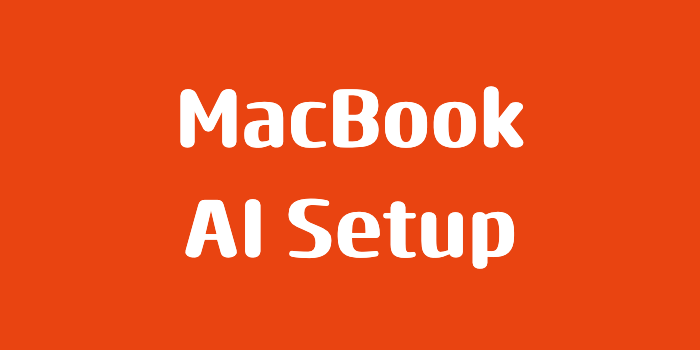
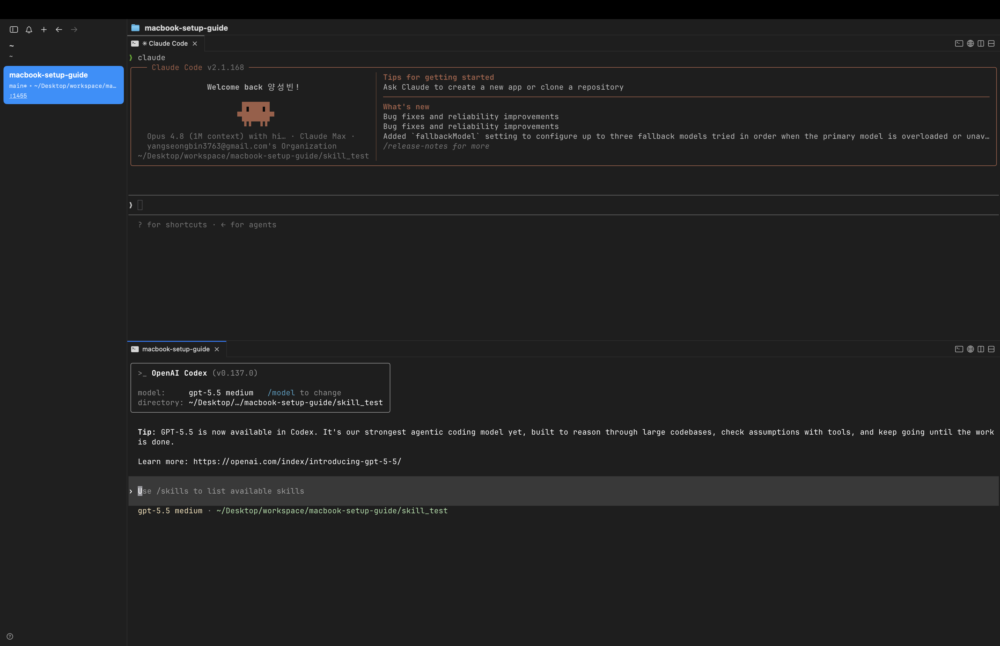
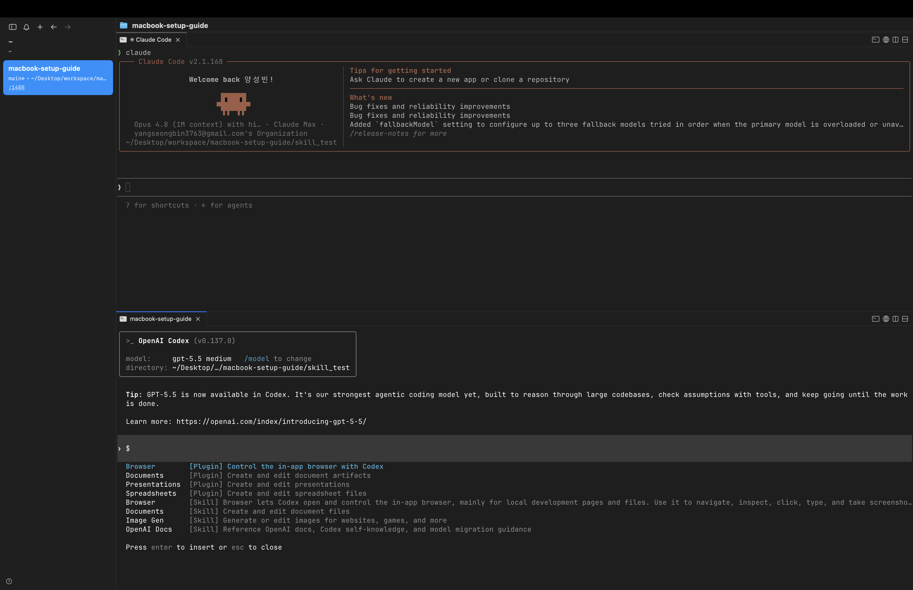
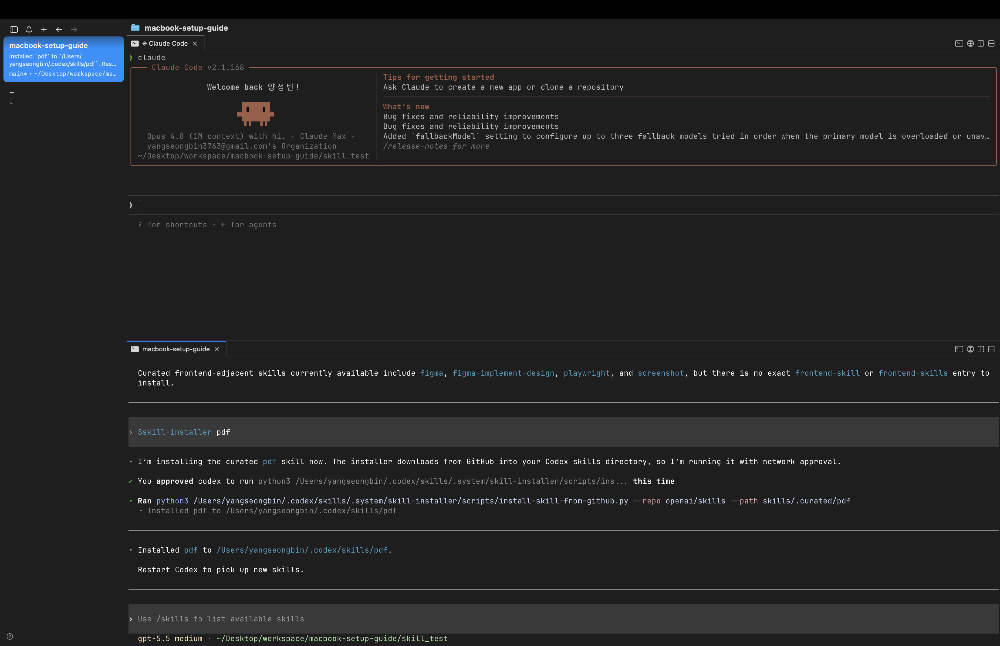
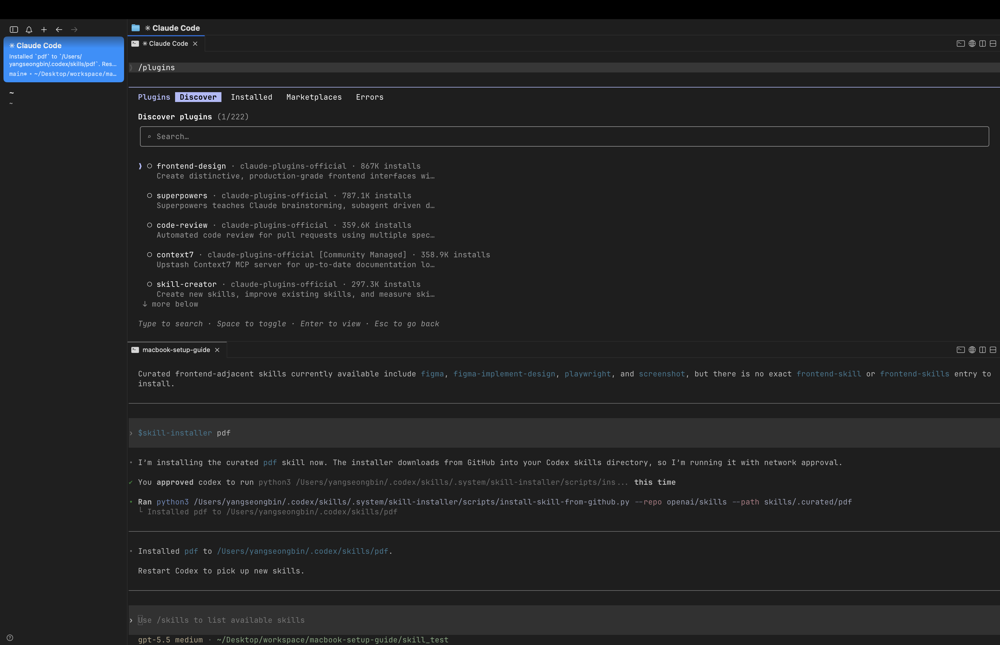
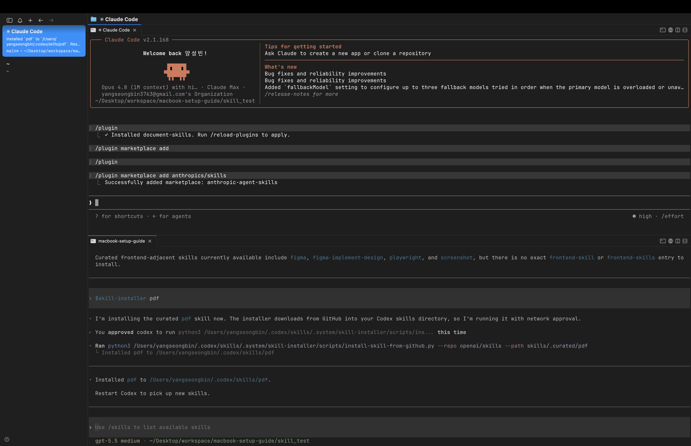
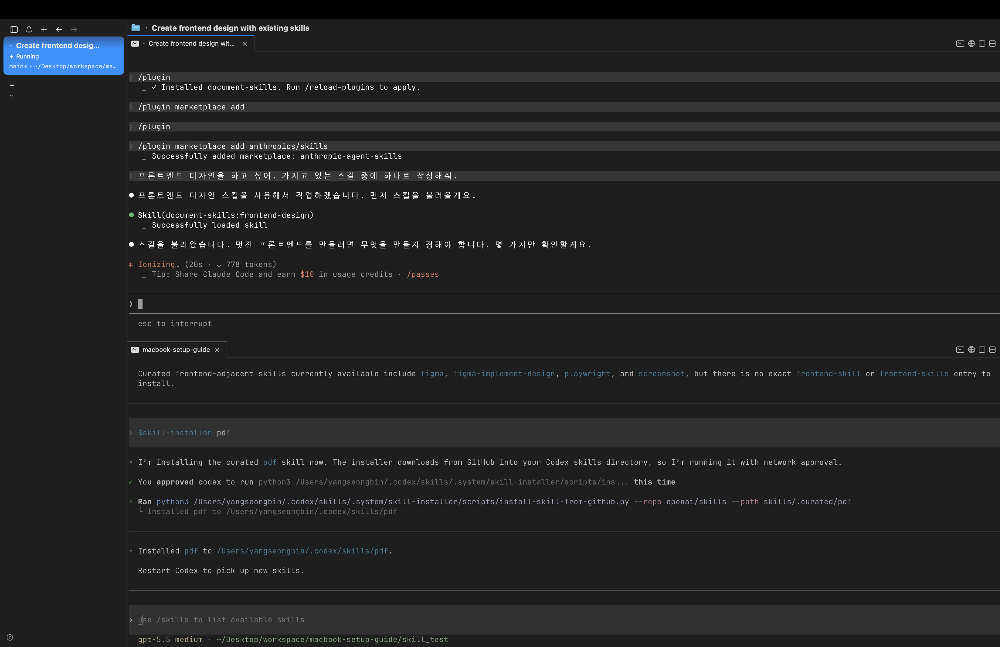
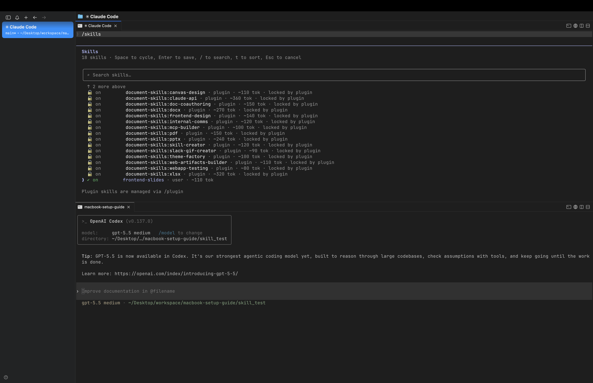
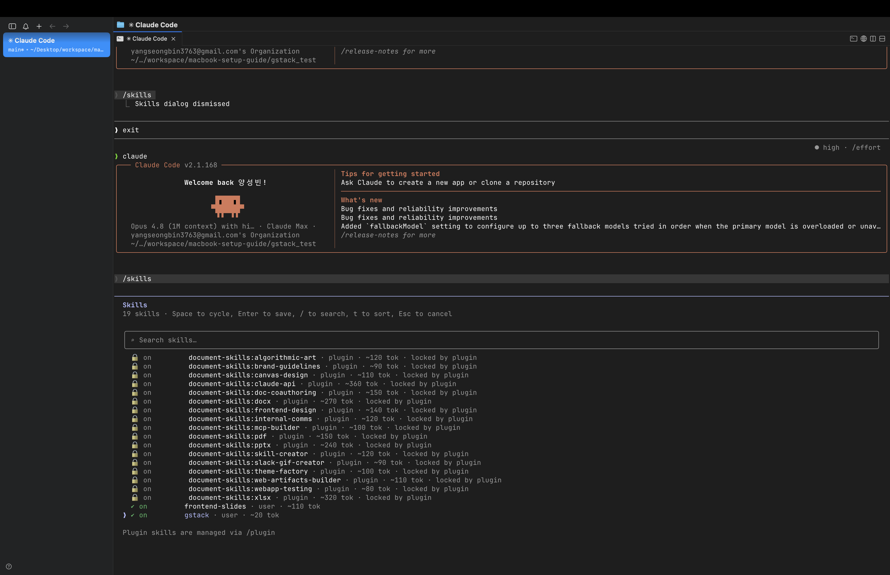
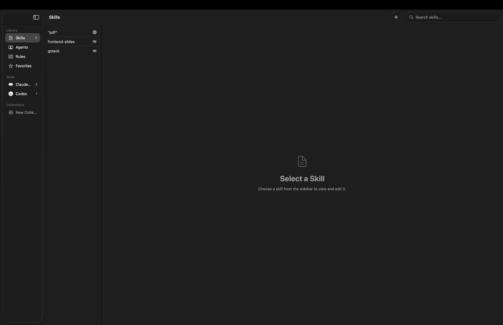

> 해당 포스팅은
> 인프런의 [맥북 처음 샀을 때 꼭 해야 할 세팅 A to Z (Claude Code · Homebrew · Agentic Coding 포함 | macOS 올인원)](https://inf.run/ijAW9)를
> 참조하여
> 만들었습니다.



## 🧩 Agent Skills은 무엇인가요?

이번 섹션에서는 LLM 에이전트의 능력을 한 단계 더 확장해주는 **스킬(Skill)** 이라는 개념을 다뤄보려 한다. 참고로 *스킬* 이라고 읽어도 되고 *스킬스(Skills)* 라고 읽어도 된다. 뒤에 's'를
붙이고 안 붙이고는 편한 대로 부르면 된다.

이 스킬이라는 개념은 Anthropic의 **Claude** 에서 처음 도입되었고, 현재는 OpenAI의 **Codex** 에서도 지원하는 등 LLM 에이전트 기술의 핵심 요소로 점점 자리를 잡아가고 있다.

### 스킬은 왜 등장했을까

스킬이 왜 필요해졌는지 이해하려면, 우리가 LLM을 사용해온 흐름을 한번 되짚어볼 필요가 있다.

처음에는 그냥 **자연어 프롬프트** 만 사용했다. 우리가 ChatGPT에게 말을 건네듯 질문을 던지는 방식이다. 그러다 점차 **마크다운(Markdown)** 형태로 맥락(Context)을 주입하는 방식으로
발전했다. 이후 Cursor, Project IDX 같은 에디터들이 등장했고, macOS 터미널에 자리 잡은 Claude Code는 운영체제 API에 직접 접근할 수 있게 되면서 편의성이 크게 올라갔다.

그런데 여기서 한 가지 문제가 생겼다. 에이전트가 많은 것을 할 수 있게 되면서 **맥락(Context)이 과도하게 팽창** 하기 시작한 것이다. 그래서 특정 작업에 필요한 지식, 규칙, 자산, 절차 등을 하나로
묶어 *재사용 가능한 패키지* 로 만들자는 발상이 나왔고, 그것이 바로 **스킬** 이다.

> 우리가 원하는 것은 단순히 한 번 쓰고 마는 프롬프트가 아니다. 특정 작업에 필요한 내용을 **딱 한 번만 만들어두고 계속 재사용** 하는 것, 그것이 스킬의 핵심이다.

### 스킬이란 무엇인가

다시 한번 정의해보자. **스킬은 특정 작업에 필요한 지식, 규칙, 자산, 절차 등을 묶어 재사용 가능하게 만든 패키지** 이다. 단순히 정보를 제공하는 데서 그치지 않고, *실행* 을 전제로 한다는 점이 가장
큰 특징이다.

실제 스킬은 `skill.md` 라는 파일을 중심으로 구성되며, 대략 다음과 같은 요소들을 담는다.

- **name** : 이 스킬의 이름
- **when_to_use** : 언제 이 스킬을 사용해야 하는지
- **instructions** : 핵심적으로 무엇을 어떻게 해야 하는지
- **assets** : 템플릿, 아이콘, 스크립트 등 함께 쓰이는 자산
- 그 외에 출력 품질은 어떠해야 하는지 등의 기준

즉 스킬은 LLM 에이전트가 특정 태스크를 만났을 때 *알아서 가져다 쓰기를 기대* 하는 하나의 규격인 셈이다.

### 마크다운과 스킬은 무엇이 다를까

여기서 의문이 들 수 있다. "그냥 마크다운 파일에 정리해두는 것과 뭐가 다르지?" 강사님은 이 차이를 한 문장으로 정리한다.

> **마크다운은 설명하는 것이고, 스킬은 일을 지시하는 것이다.**

조금 더 풀어보자. 일반 마크다운 파일은 *수동적인 콘텐츠* 이다. 주어진 내용을 맥락으로 주입하는 데 그치며, 본질적으로 사람이 읽고 이해하기 위한 파일에 가깝다. 재사용을 위한 실행 규격으로 설계된 것이
아니다.

반면 스킬은 *실행을 전제로 한 콘텐츠* 이다. "이런 상황에서 이렇게 작업하라"는 태스크 기반으로 동작하며, 지식을 일관된 작업 흐름으로 바꿔준다. 게다가 스킬은 특정 요청이 있을 때만 호출되어 토큰을
소비하기 때문에, 컨텍스트 윈도우에 주는 부담도 적다는 장점이 있다.

### 스킬은 어떻게 동작할까

스킬의 전체 동작 흐름은 다음과 같다.

1. 먼저 호출 조건이 발생한다. 예를 들어 "슬라이드 디자인" 같은 특정 단어가 촉매제가 되어 자동으로 불려나가거나, 사용자가 직접 "이 스킬을 써줘"라고 명시적으로 지시한다.
2. 호출 조건이 만족되면 에이전트가 해당 스킬(마크다운)을 읽는다.
3. 그 안에 담긴 템플릿, 아이콘, 스크립트 등 구체적인 지침을 활용해 작업을 수행한다.

예를 들어 파워포인트를 만든다면, Python 스크립트를 실행하거나 XML을 수정하는 등의 구체적인 방법을 스킬 안에 미리 심어두어 *일관된 결과물* 이 나오도록 기대할 수 있다.

이처럼 스킬의 또 다른 핵심은 **품질 고정** 이다. 특정 영역의 색상, 폰트, 레이아웃 같은 품질 기준을 스킬에 명확히 박아두면, 매번 같은 수준의 결과물을 얻을 수 있다. 다만 여러 디자인을 하나의 스킬에
욱여넣기보다는, *특정 영역의 품질을 고정* 하는 데 집중하는 것이 좋다. 정답이 정해져 있는 것은 아니므로 여러 번 시도해보며 최적의 스킬을 찾아가야 한다.

### 스킬은 어디에 저장될까

macOS 환경 기준으로, 스킬은 홈 디렉토리(`~/`) 아래의 숨겨진 디렉토리에 저장된다. Codex는 `.codex`, Claude는 `.claude` 디렉토리 안의 `Skills` 폴더에 스킬 파일을 넣어두면
된다.

이 스킬 폴더에는 스크립트, 템플릿, 참고 자료, 에셋 등이 함께 들어갈 수 있다. 그래서 스킬 폴더 하나가 마치 *작은 제품* 처럼 통째로 재활용될 수 있다는 점이 매력적이다.

### 어떤 작업에 스킬을 쓰면 좋을까

그렇다면 어떤 작업이 스킬로 만들기 좋을까? 기준은 의외로 단순하다.

> **반복되고, 기준이 있으며, 품질 편차가 생길 수 있는 작업이라면 스킬 후보가 된다.**

실제로 스킬은 정말 다양한 분야에서 활용될 수 있다. 몇 가지 예시를 들면 다음과 같다.

- 문서 작성 (워드 문서, 회의록 작성)
- 슬라이드 제작 및 파싱, 카드 뉴스 제작
- 자료 수집 및 PDF 생성·병합, 엑셀 작업
- 블로그 포스팅
- 코딩 (레포지토리 규칙 적용)
- 소프트웨어 운영 (Runbook)
- 디자인 (스타일 가이드, 프론트엔드 UI 컴포넌트 설계)
- 데이터 작업, 그리고 법률·세무·의학 같은 전문 용어 처리

### 마치며

이번 글에서는 Agent Skills이 무엇이고, 왜 등장했으며, 마크다운과는 어떻게 다른지 살펴보았다. 핵심만 다시 정리하자면, **스킬은 특정 작업에 필요한 모든 것을 묶어 재사용하는 실행 중심의
패키지** 이고, **반복되며 품질 기준이 있는 작업이라면 무엇이든 스킬로 만들 수 있다.**

스킬은 아직 널리 알려진 개념은 아니다. 그래서 다음 글에서는 실제로 맥에서 스킬을 사용하는 모습을 시연해보려 한다. 스킬 제너레이터를 사용하는 방법과, macOS용 오픈소스 앱을 통해 GUI 방식으로 스킬을
다루는 방법을 차례로 다뤄볼 예정이다.

## 🔧 Skill 설치와 사용하기 (Claude code + Codex)

앞선 글에서 스킬이 무엇인지 개념을 살펴봤으니, 이번에는 실제로 맥북에 스킬을 **설치하고 사용하는 방법** 을 다뤄보려 한다. 이번 챕터는 **Claude Code** 와 **Codex** 두 가지 도구를
모두 활용한다.

### 들어가기 전에: 스킬의 기본 구조

본격적인 설치에 앞서 스킬의 기본 구조를 다시 한번 짚어보자. Codex와 Claude가 제공하는 Agent Skills은 각각 `name`, `description` 같은 **메타데이터** 로 시작하며,
`skill.md` 와 `agent.yaml` 같은 파일을 필요로 한다.

그리고 스킬과 관련해서 알아두면 좋은 두 가지 명령어가 있다.

- **`skill-creator`** : 내가 직접 만든 프롬프트나 작업을 *새로운 스킬로 만들 때* 사용한다.
- **`skill-installer`** : 공식 저장소에 올라온 스킬을 *가져와 설치할 때* 사용한다.

> 즉, **Creator는 내가 만들 때, Installer는 남이 만든 걸 가져올 때** 쓴다고 기억하면 된다.

### Homebrew로 Claude Code와 Codex 설치하기

스킬을 사용하려면 당연히 Claude Code와 Codex가 먼저 설치되어 있어야 한다. 만약 설치가 안 되어 있다면 관련 명령어 자체가 동작하지 않는다.

설치는 이전 강의에서도 다뤘듯이 **Homebrew** 를 이용하는 것이 편하다.

```bash
# Claude Code 설치
brew install claude-code

# 이미 Codex가 설치되어 있다면 업데이트
brew upgrade codex
```

설치가 끝났다면 `brew list` 명령어로 두 도구가 잘 설치되었는지 확인할 수 있다.

```bash
brew list
```



### Codex에서 스킬 설치하기

먼저 Codex부터 살펴보자. Codex를 실행하고 초기 설정을 마친 뒤, 다음 명령어로 기본 스킬 목록을 확인할 수 있다.

```bash
/skills
```



Codex는 OpenAI에서 제공하는 **`skill-installer`** 를 통해 스킬을 설치한다. 예를 들어 GitHub의 `openai/skills` 저장소에 있는 `frontend-skill` 을 설치하고,
이어서 `pdf` 스킬도 설치해볼 수 있다.



설치된 스킬은 홈 디렉토리 아래 `.codex` 디렉토리 안의 `skills` 폴더에서 그 위치와 내용을 직접 확인할 수 있다.

```bash
~/.codex/skills/
```

### Claude에서 스킬 설치하기

이번에는 Claude Code이다. Claude Code를 실행하고 마찬가지로 `/skills` 명령어로 스킬 목록을 확인할 수 있다.

여기서 한 가지 중요한 차이가 있다. **Claude는 Codex처럼 공식 `skill-install` 도구를 제공하지 않는다.** 대신 **플러그인(Plugin) 시스템** 을 통해 스킬을 설치한다.



방법은 이렇다. `Marketplace` 에서 `anthropic/skills` 를 추가한 뒤, 거기서 `Document Skills` 같은 스킬을 설치하는 방식이다. 이렇게 설치한 스킬을 활용하면 예를 들어
프론트엔드 랜딩 페이지를 생성하는 작업 등을 수행할 수 있다.





> 정리하자면, **Codex는 `skill-installer` 도구로, Claude는 플러그인(Marketplace)을 통해** 스킬을 설치한다는 점이 가장 큰 차이이다.

### 다른 사람이 만든 스킬 가져오기 (보안 검토는 필수!)

공식 저장소뿐 아니라, 다른 사람이 만들어 공개한 스킬을 가져다 쓸 수도 있다. 대표적으로 `awesome-claude-skills` 같은 저장소에서 다양한 스킬을 다운로드할 수 있다.

다운로드한 스킬을 열어보면 스크립트, 마크다운 등 여러 파일로 구성되어 있는 것을 볼 수 있다. 그런데 여기서 **반드시** 짚고 넘어가야 할 점이 있다. 바로 **보안 검토** 이다.

남이 만든 스킬 안에는 악성 코드가 숨어 있거나, 내 정보를 외부로 빼돌리는 코드가 들어 있을 수도 있다. 그래서 무작정 믿고 실행하면 안 된다. 강사님의 표현을 빌리자면,

> "이것만 믿는 거는 바보짓이죠."

그래서 다운로드한 스킬을 실행하기 전에, Claude에게 해당 스킬의 코드를 **보안 분석** 해달라고 요청하는 과정을 거치는 것이 좋다. 악성 코드나 정보 유출이 의심되는 부분이 없는지 한 번 검토받는 것이다.

### 가져온 스킬을 내 스킬로 저장하기

검토를 마친 스킬은 내 환경에 저장해 사용할 수 있다. Claude의 경우 `.claude` 디렉토리 안의 `skills` 폴더에 원하는 이름(예: `frontend-slides`)으로 저장하면 된다.

```bash
~/.claude/skills/frontend-slides/
```



저장한 뒤 Claude를 재시작하면, 내가 추가한 사용자 정의 스킬(`frontend-slides`)이 목록에 나타나는 것을 확인할 수 있다. Codex 역시 마찬가지로 `skill-installer` 를 통해
설치한
`frontend-skill` 과 `pdf` 스킬을 확인할 수 있다.

### 마치며

이번 글에서는 Claude Code와 Codex에서 스킬을 설치하고 사용하는 방법을 살펴보았다. 핵심을 정리하면 다음과 같다.

- **`skill-creator`** 는 내가 직접 스킬을 만들 때, **`skill-installer`** 는 공식 스킬을 가져올 때 쓴다.
- **Codex** 는 `skill-installer` 도구로, **Claude** 는 플러그인(Marketplace)을 통해 스킬을 설치한다.
- 설치된 스킬은 각각 `~/.codex/skills` 와 `~/.claude/skills` 에 저장된다.
- 남이 만든 스킬을 가져올 때는 **반드시 보안 검토를 거치자.**

다음 글에서는 이렇게 설치한 앱이나 직접 작업한 내용을 바탕으로, *나만의 스킬을 만드는 과정* 을 다뤄볼 예정이다.

## 🖥️ gstack 설치와 Skills 목록 GUI 앱 추천

앞선 글에서 스킬을 설치하고 사용하는 방법을 알아봤다. 사실 처음 스킬을 설치했을 때는 *이걸 어떻게 써야 하나* 좀 애매하게 느껴질 수 있다. 하지만 실제 프롬프트에 적용해보면 꽤 훌륭한 결과물을 얻을 수
있다.

강사님은 스킬을 활용해 크게 세 가지 업무를 많이 한다고 한다.

- **PDF 리서치 보고서** 작성
- **슬라이드 디자인**
- **코드 리팩토링 및 보안 점검**

이렇게 스킬은 분명 유용하지만, 한 가지 불편한 점이 있다. 스킬이 점점 늘어나면 수십, 수백 개가 될 수도 있는데 이걸 일일이 확인하기가 어렵다는 것이다. 그래서 이번 글에서는 **G-Stack** 이라는 스킬
모음을 설치해보고, 설치된 스킬들을 한눈에 볼 수 있게 해주는 **GUI 앱** 을 소개하려 한다.

### G-Stack 설치하기

먼저 **G-Stack** 이다. 이는 **Garry Tan** 이라는 사람이 만든 스킬 모음인데, 그는 미국의 유명한 VC(벤처 캐피털)인 **Y Combinator** 의 CEO이기도 하다.

G-Stack 안에는 정말 *엄청나게 많은 스킬이 짬뽕* 되어 있다. 각 폴더 하나하나가 모두 개별 스킬로 활용될 수 있는 구조이다.

설치 방법은 간단하다. 앞서 배운 `git clone` 명령어를 사용하면 된다. `git clone` 은 원격 저장소의 모든 파일을 내 컴퓨터로 통째로 복제해오는 명령어이다.

```bash
# Claude 스킬 디렉토리에 G-Stack을 복제
git clone <G-Stack 저장소 주소> ~/.claude/skills/gstack
```

이렇게 하면 `~/.claude/skills/gstack` 경로에 G-Stack이 설치된다. 설치 후 `claude` 를 실행하면, 유저 스킬 목록에 G-Stack이 추가된 것을 확인할 수 있다.



> 앞 글에서도 강조했지만, 이렇게 외부에서 가져온 스킬을 로컬에 설치할 때는 **보안에 유의** 해야 한다는 점을 잊지 말자.

### Skills 목록을 한눈에: Chops

그런데 여기서 문제가 생긴다. 앞서 말했듯 스킬이 수십, 수백 개로 늘어나면 이걸 터미널에서 일일이 살펴보기가 너무 번거롭다.

이 문제를 해결해주는 오픈소스 앱이 바로 **Chops** 이다. Chops는 설치된 스킬 폴더들을 **GUI(그래픽 화면)** 로 보여주어, 내가 설치한 모든 스킬을 한눈에 파악할 수 있게 해준다.

Chops를 설치하면 앞서 설치한 G-Stack을 포함해 설치된 스킬들이 화면에 쭉 나타나고, 각 스킬 폴더로 바로 이동하는 기능도 제공한다. 뿐만 아니라 Claude Code, Codex 같은 도구들을 모아둔
**Tools** 섹션도 함께 제공한다.



### 보너스: 마크다운 에디터 Clearly

추가로 강사님은 G-Stack을 만든 그 개발자(Garry Tan)가 만든 또 다른 오픈소스도 소개한다. 바로 **Clearly** 라는 깔끔한 **마크다운 에디터** 이다.

스킬은 결국 마크다운 파일을 중심으로 구성되기 때문에, 이런 마크다운 에디터 하나쯤 알아두면 커스터마이즈한 스킬을 다듬을 때 유용하게 쓸 수 있다.

### 마치며

이번 글에서는 G-Stack 스킬 모음을 설치하고, 설치된 스킬을 한눈에 관리할 수 있는 GUI 앱 Chops를 살펴보았다. 정리하자면 다음과 같다.

- **G-Stack** : Y Combinator CEO Garry Tan이 만든 방대한 스킬 모음. `git clone` 으로 `~/.claude/skills` 에 설치한다.
- **Chops** : 설치된 스킬들을 GUI로 한눈에 보여주는 오픈소스 앱.
- **Clearly** : 같은 개발자가 만든 깔끔한 마크다운 에디터.

커스터마이즈한 스킬을 매번 로컬 디렉토리에 직접 복사·붙여넣기 하는 것은 번거로운 일이다. 이런 GUI 앱들을 활용하면 스킬 관리가 한결 수월해진다. 다음 글에서는 드디어 *내 작업물을 직접 스킬로 만들어주는*
**`skill-generator`** 를 다뤄볼 예정이다.