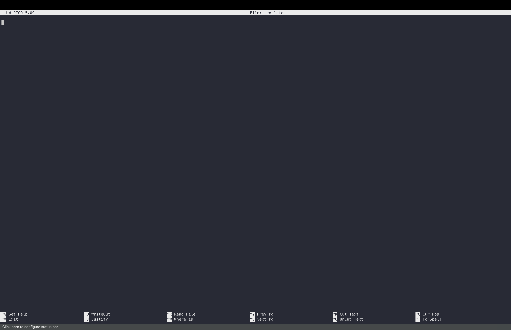
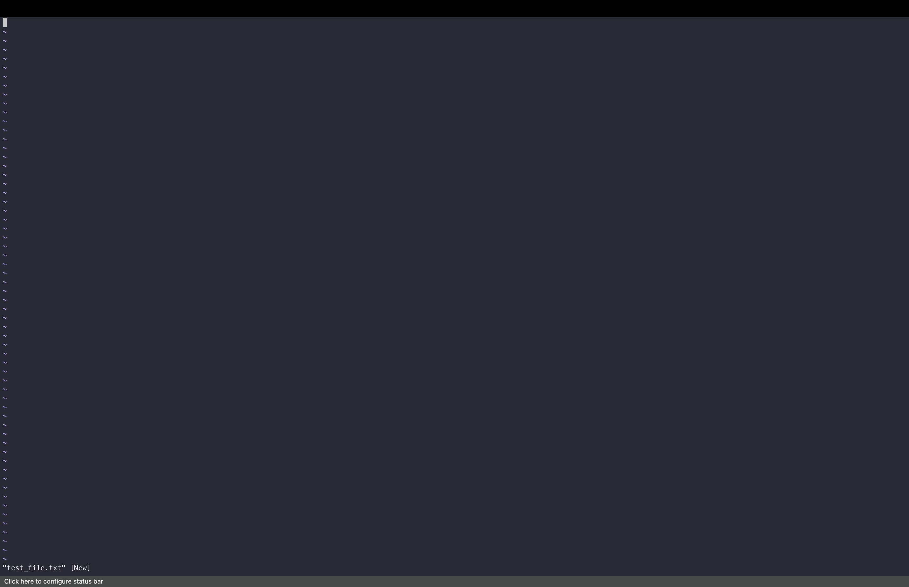
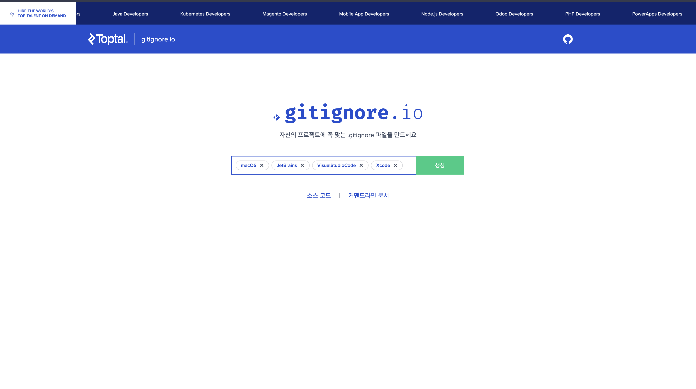

> 해당 포스팅은
> 인프런의 [맥북 처음 샀을 때 꼭 해야 할 세팅 A to Z (Claude Code · Homebrew · Agentic Coding 포함 | macOS 올인원)](https://inf.run/ijAW9)를
> 참조하여
> 만들었습니다.


## 📝 터미널 에디터 활용 (nano, vi)

이번에는 Mac OS에서 내장되어 있는 터미널 에디터를 사용해보도록 하겠다. AI로 검색을 해보면 Mac OS에서는 4가지 에디터가 내장되어 있다고 한다. 첫번째는 nano이고, 두번째는 vim, 세번째는 vi,
네번째는 ed라고 나올 것이다. 여기서 vi와 vim은 같다고 보면 좋을 것 같고 nano같은 에디터는 최근에 나온 것중에서 상당히 사용성이 좋은 형태이다.

우리는 에디터라고 하면 보통 Cursor나 vs-code같은 코드 에디터를 생각할 수 있다. 그런데 터미널 에디터는 이 터미널 안에서 무언가를 수정할 때 필요하다. 우리는 앞서서 `cat`이라는 명령어를 통해 파일을
살펴보기도 했고 파일에 무언가를 넣기도 하였다. 지금부터는 진짜 에디터처럼 한번 사용해보도록 하겠다. 그러면 한번 실습을 해보자.

특정 디렉토리를 만든 후 우리는 여기서 3가지 파일을 만들어 볼 것이다. 첫번째는 txt 파일을 만들어 볼 것이고 두번째는 `.gitignore`파일을 만들 것이고 세번째는 가장 간단한 형태의 json 파일을 만들어
볼 것이다. 먼저 우리는 `nano`라는 것부터 사용해볼 것이다. 아래의 명령어를 실행해보자.

```bash
nano test1.txt
```

그러면 아래와 같이 나올 것이다.



nano 에디터는 많은 명령어들이 있는데, 화면 아래쪽에 단축키 힌트가 표시되기 때문에 가장 중요한 몇개만 알아도 무방할 것이다. 먼저 `Ctrl + O`이다. 해당 명령어는 writeout, 즉 작성한 내용을
파일로 저장할 때 사용을 한다. 그리고 종료할때는 `Ctrl + X`(exit)를 이용하면 된다. 나머지는 하나씩 살펴보거나 AI로 검색해보면 좋을 것 같다. 이제 텍스트를 그냥 작성해보자. 작성 후에 저장을 하려면
`Ctrl + O`를 누르면 된다. 그러면 하단에 파일 이름을 지정하라고 나오는데 변경해도 그대로 두어도 된다. 엔터를 누르면 저장이 완료되고 다시 작성창으로 간다. 이후에 `Ctrl + X`를 누르면 해당 nano
에디터가 빠져나간다.

다음은 vi 에디터를 사용해보자. 아래의 명령어를 실행해보자.

```bash
vi test_file.txt
```



그러면 위와 같이 나오는데 무언가를 입력하면 입력되지 않는다. vi 에디터에는 2가지 모드가 존재하는데 이것을 헷갈리면 안된다. 바로 Input(입력) 모드와 Command(명령) 모드이다. vi는 처음 실행하면
명령 모드 상태이기 때문에 바로 타이핑을 해도 입력이 되지 않는 것이다. 무언가를 입력하기 위해서는 `i`를 눌러서 input 모드로 진입해야 한다.


즉, `esc`와 `i`를 통해 모드를 변경할 수 있다. `i`를 누르면 insert 모드가 된다. 이렇게 Insert 모드가 되어야지 텍스트를 입력할 수 있다. 입력을 하고 나서 입력모드를 해제하려면 `esc`를
누르면 insert 모드가 해제되고 아래와 같이 명령어를 입력한다.

```bash
:wq
```

위의 명령어는 저장하고 나가겠다는 명령어이다. `w`는 write(저장), `q`는 quit(종료)를 의미하기 때문에 이 둘을 조합한 것이다. 이것 외에도 그냥 나가고 싶다면 `:q`를 하고 저장하지 않고 강제로
나가고 싶다면 `:q!`를 사용하면 된다. 참고로 vi 에디터로만 코딩하는 소위 고인물 개발자분들도 있다고 하니, 익숙해지면 그만큼 강력한 에디터라는 뜻일 것이다.

두번째는 `.gitignore`파일을 만들어보자. `.gitignore`는 Git에서 추적하지 않을 파일 목록을 지정하는 설정 파일이다.
[gitignore 생성 코드](https://www.toptal.com/developers/gitignore)를 통해 샘플을 만들어보자.



위의 화면에 생성 버튼을 누르고 나온 내용을 전체 복사한 다음, nano 에디터로 `.gitignore` 파일을 열어서 붙여넣고 저장하면 된다. 여기서 vi가 아닌 nano를 쓰는 이유는 nano 에디터가 복사
붙여넣기 하기에 좀 더 용이하기 때문이다.

이제 json 파일을 하나 만들어보자. 이번에는 vi 에디터를 사용해 볼 것이다. `vi test.json` 명령어로 파일을 열고 `i`를 눌러 입력 모드로 진입한 후 아래의 샘플을 붙여넣자. 그리고 `esc`를
누르고 `:wq`로 저장하고 나오면 된다.

```json
{
  "name": "홍길동",
  "age": 30,
  "is_developer": true,
  "skills": [
    "Python",
    "JavaScript"
  ],
  "address": {
    "city": "서울",
    "zipcode": "12345"
  }
}
```

저장이 잘 되었는지는 `cat test.json` 명령어로 확인해 볼 수 있다. 이처럼 간단한 스크립트나 보조 설정 파일을 수정할 때는 매번 GUI 에디터를 켜는 것보다 터미널 에디터를 활용하는 것이 시간을 훨씬
절약할 수 있다. 그리고 이 능력은 바로 다음에 진행할 Claude Code 설정 파일 수정에서 진가를 발휘한다.

## 🪝 터미널로 Claude Code Hooks 추가

이번에는 claude code hook에 대해 배워보도록 하자. 그 훅을 nano 에디터를 통해서 수정해보는 것도 진행을 해보도록 하겠다.

먼저 우리는 hooks라는 개념을 알아야 할 것 같다. 한번 [공식문서](https://code.claude.com/docs/ko/hooks-guide)를 참고해보도록 하자. 우리가 하나의 소프트웨어를 사용하려면
소프트웨어의 라이프사이클을 판별해야 하는 경우가 존재한다. 클로드 코드는 그 자체가 에이전트 툴이다. 그래서 클로드 코드도 생애주기가 존재한다. 그래서 공식문서에도 아래와 같은 이야기가 나온다.

> Hooks는 Claude Code의 라이프사이클의 특정 지점에서 실행되는 사용자 정의 셸 명령입니다.

이게 무슨 이야기냐면 우리가 클로드 코드를 사용할 때 어떤 상황에 마주치게 되는데 그때 "이렇게 실행해주세요"라는 것을 우리가 커스터마이징을 할 수 있다는 것이다.

클로드 코드의 hook은 입력 또는 권한을 기다릴 때 발생하는 Notification 이벤트를 사용한다. 쉽게 말하면 우리가 클로드 코드를 사용할 때 권한때문에 기다린 적이 존재했을 것이다. 파일을 생성할때 혹은
읽을 때 혹은 명령어를 실행할때 우리의 입력을 클로드 코드는 기다리고 있다. 그런데 우리가 클로드 코드를 돌려놓고 다른 것을 하다가 보면 그것을 잊어버릴 때가 존재한다. 그래서 그 때 우리는 특정한 hook이라는
것을 통해서 그때 어떤 기능을 실행하라고 설정할 수가 있다.

그러면 좀 더 hook의 작동 방식에 대해 살펴보자. Hook 이벤트는 Claude Code의 라이프사이클의 특정 지점에서 발생한다. 이벤트가 발생하면 일치하는 모든 hooks가 병렬로 실행되고 동일한 hook
명령은 자동으로 중복 제거된다. 그러면 한번 hook을 만들어보자.

```text
claude code를 작동하고 그 안에서 권한을 요청할 때 대기하고 싶지가 않아! 특정 음악 파일을 실행하게 하고 싶은데 어떻게 hook을 작성해야 할까? example.mp3 파일을 예제로 만들어줘!
```

위의 프롬프트를 클로드한테 요청해보자. 그러면 대략적으로 아래와 같은 응답을 받을 것이다.

먼저 mp3 파일을 아래와 같이 진행한다.

```bash
mkdir -p ~/.claude/sounds
mv ~/Downloads/example.mp3 ~/.claude/sounds/example.mp3
```

이후 hook 설정을 해야 하는데, 여기서 한가지 알아둘 점이 있다. 공식문서에서는 `settings.json`에 설정을 추가하라고 안내하지만, 모든 프로젝트가 아닌 지금 작업중인 프로젝트에만 hook을 적용하고
싶다면 프로젝트 디렉토리 안의 `.claude/settings.local.json` 파일에 설정하면 된다. 그러면 한번 만들어보자. 먼저 프로젝트 디렉토리에서 `.claude` 디렉토리를 만들고, 앞에서 배운
nano 에디터로 설정 파일을 열어보자.

```bash
mkdir .claude
nano .claude/settings.local.json
```

그리고 아래와 같이 작성을 한다. 여기서 `matcher`는 어떤 조건일 때 hook을 실행할지 정하는 요소이고, `command`에는 실행할 셸 명령을 적는다. macOS에서 오디오 파일을 재생해주는
`afplay` 명령어를 사용하였다.

```json
{
  "hooks": {
    "Notification": [
      {
        "matcher": "permission_prompt",
        "hooks": [
          {
            "type": "command",
            "command": "afplay \"$HOME/.claude/sounds/example.mp3\""
          }
        ]
      }
    ]
  }
}
```

설정이 끝났으면 실제로 동작하는지 확인해보자. Claude Code를 실행하고 새로운 자바스크립트 파일을 만들어서 콘솔 로그를 찍어달라고 요청해보자. 그러면 파일 생성 권한을 요청하는 순간 우리가 설정한 mp3
파일의 소리가 자동으로 재생되는 것을 확인할 수 있다. 이제 Claude Code를 돌려놓고 다른 작업을 하다가도 소리만 듣고 권한 요청이 왔다는 것을 바로 알아차릴 수 있게 된 것이다.

이렇게 여러 hook들을 조합해서 구성한 Claude Code 환경을 하네스(Harness)라고 부르기도 한다. hook 하나만 잘 설정해도 에이전트를 기다리는 시간을 크게 줄일 수 있으니, 각자 자신만의 hook을
만들어보는 것을 추천한다.

## 🔗 외부 API 연동 및 설정 (JSON, GLM)

이번에는 Claude Code에 외부 API를 연동해보도록 하겠다. 우리가 앞에서 nano 에디터로 JSON 파일을 다루는 법을 배웠는데, 그것을 실전으로 활용해 볼 차례이다. 바로 Claude Code의
`settings.json` 파일을 직접 수정해서 외부 모델인 GLM-5를 연동해 볼 것이다.

### 왜 외부 API를 연동할까?

그런데 왜 굳이 외부 API를 연동해야 할까? 이유는 간단하다. Claude Code에 붙어 있는 Opus 모델의 API가 너무 비싸기 때문이다. 실제로 에이전틱 코딩 좀 한다 하는 사람들은 대부분 GLM-5
모델을 사용하고 있다고 한다. GLM-5는 중국의 AI 기업 Zhipu AI가 개발하고 Z.AI 플랫폼을 통해 서비스되는 대형 언어 모델로, 코딩과 AI Agent 작업에 특화되어 있으며 오픈소스 모델 중에서는
최고 수준의 코딩 성능을 자랑한다. 실제 코딩 능력을 측정하는 벤치마크인 SWE-bench Verified에서 77.8%를 기록하며 Claude Opus 4.5와 유사한 수준을 보여줄 정도다. 그러면서도 가격은
훨씬 저렴하다.

### GLM 코딩플랜 알아보기

여기서 GLM 코딩플랜이라는 것을 알아두면 좋다. GLM 코딩플랜은 Z.AI가 개발자를 위해 제공하는 월정액 구독 서비스로, Claude Code, Cline, Cursor 같은 기존 AI 코딩 도구에서 API 키만
바꿔 꽂으면 GLM-5를 그대로 사용할 수 있다. 가장 큰 장점은 토큰당 요금을 걱정하지 않고 정해진 사용량 안에서 자유롭게 코딩할 수 있다는 점이다. 요금제는 아래와 같다.

- **Lite**: 월 $10. 기본적인 사용에 적합하다.
- **Pro**: 월 $30. GLM-5를 포함하며 웹 검색, 이미지 분석 MCP 기능도 제공한다.
- **Max**: 월 $60. Pro 요금제의 4배에 해당하는 사용량을 제공한다.

가격을 한번 비교해보자. GLM 코딩플랜은 Claude Pro 대비 Lite 플랜은 3배, Max 플랜은 60배의 사용량을 제공한다. 그리고 Claude Max(월 $200)와 비교하면 Pro 요금제 기준으로 약
7분의 1 가격이니 상당히 경제적이다. 참고로 GLM-4까지는 반값 혜택이 있었는데 GLM-5부터는 사라졌다고 한다. 실제로 최초 가격 대비 4배가 올랐고 앞으로 더 오를 것이라고 하니, 사용할 생각이 있다면
빨리 구독하는 것이 유리할 수 있다. 그래도 할인 혜택은 남아있다. 1년 구독 시 30% 추가 할인이 적용되고(Max 기준 1년에 600달러 수준), z.ai 코딩플랜에 처음 가입할 경우 레퍼럴 코드를 통해
10% 할인을 받을 수 있으니 참고하자.

특히 Max 플랜은 빠른 속도를 제공하며 사실상 거의 무제한급의 API 사용량을 제공한다. 하루 종일 프로그래밍을 해도 다 쓰기 어려운 수준이라고 한다.

### API Key 발급과 Concurrency Limit

z.ai에 가입을 했다면 API Key를 발급받아야 한다. API Key 설정 화면의 Limit 항목에 들어가보면 언어 모델 사용량과 Concurrency Limit을 확인할 수 있다. Concurrency
Limit이란 동시에 실행 가능한 API 요청의 최대 개수를 의미한다. GLM-5 모델의 Concurrency Limit은 5개로, Claude Code 여러 개를 동시에 돌려도 충분한 사용량을 제공한다.

여기서 한가지 정말 중요한 주의사항이 있다. API Key는 절대 외부에 공개되면 안된다. 만약 API Key가 공개되는 형태의 제품을 만들면 다른 사람이 내 키로 API를 마구 호출할 수 있고, 그 비용은 전부
내가 부담하게 된다. 말 그대로 비용이 줄줄 새어나가는 것이다. 그래서 API Key는 코드에 직접 적지 않고 `.env` 같은 환경변수 파일로 분리해서 관리하는 것이 기본이다.

### settings.json 수정하기

이제 본격적으로 Claude Code의 설정 파일을 수정해보자. Claude Code의 설정은 `~/.claude/settings.json` 파일에 JSON 형태로 저장되어 있다. 앞에서 배운 nano 에디터로
열어보자.

```bash
nano ~/.claude/settings.json
```

먼저 API Key는 `.env` 파일에 `ANTHROPIC_AUTH_TOKEN`이라는 이름으로 입력해두고, `settings.json`에서 이를 읽어오도록 설정한다. npx로 설치해주는 도구들도 있지만, 우리는
직접 `.env` 파일을 수정하는 방식을 사용할 것이다. 직접 수정해봐야 구조가 눈에 들어오기 때문이다.

```bash
# ~/.claude/.env
ANTHROPIC_AUTH_TOKEN=발급받은_API_KEY
```

그리고 `settings.json`의 `env` 섹션에 API Key와 API의 base URL을 설정해준다.

```json
{
  "env": {
    "ANTHROPIC_AUTH_TOKEN": "발급받은_API_KEY",
    "ANTHROPIC_BASE_URL": "https://api.z.ai/api/anthropic"
  }
}
```

여기서 `ANTHROPIC_BASE_URL`이 핵심이다. 원래 Claude Code는 Anthropic의 서버로 요청을 보내는데, 이 값을 z.ai의 주소로 바꿔주면 Claude Code가 보내는 모든 요청이
z.ai의 GLM 모델로 가게 되는 것이다.

### GLM 모델 매핑 설정

그런데 Claude Code는 내부적으로 Opus, Sonnet, Haiku라는 모델 이름을 사용한다. 그래서 이 내부 모델 이름을 외부 API의 어떤 모델로 연결할지 매핑을 해줘야 한다. 이것 역시
`settings.json`에서 설정할 수 있다.

```json
{
  "env": {
    "ANTHROPIC_AUTH_TOKEN": "발급받은_API_KEY",
    "ANTHROPIC_BASE_URL": "https://api.z.ai/api/anthropic",
    "ANTHROPIC_DEFAULT_OPUS_MODEL": "glm-5",
    "ANTHROPIC_DEFAULT_SONNET_MODEL": "glm-4.7",
    "ANTHROPIC_DEFAULT_HAIKU_MODEL": "glm-4.7-flash"
  }
}
```

위와 같이 Opus 모델은 GLM-5에, Sonnet 모델은 GLM-4.7에, 그리고 가벼운 작업을 담당하는 Haiku 모델은 GLM-4.7 Flash에 매핑을 해주었다. 이렇게 하면 Claude Code 입장에서는
Opus를 호출한다고 생각하지만 실제로는 GLM-5가 응답을 하게 되는 것이다.

### 실행하고 모델 전환 테스트

설정이 끝났으면 Claude Code를 실행해서 정상적으로 연동이 되었는지 확인해보자. 실행 후 슬래시 명령어로 모델을 확인해보면 GLM-4.7 Flash 모델이 연동된 것을 볼 수 있다.

```bash
/model
```

위 명령어를 통해 Opus, Sonnet 등 다른 모델로 전환해보면 각각 GLM-5, GLM-4.7 Flash 등으로 매핑되어 동작하는 것을 확인할 수 있다. 이런 식으로 다양한 외부 API를 Claude Code에
유연하게 매핑할 수 있다는 것이 핵심이다.

연동이 잘 되었으니 실제로 코드를 한번 생성시켜보자. GLM-4.7 Flash 모델을 사용해서 Node.js 기반 JavaScript로 고객에게 인사말을 생성하는 간단한 테스트를 해보면, 상당히 빠른 응답 속도로
코드를 만들어주는 것을 확인할 수 있다. 단순히 `console.log`만 찍는 것이 아니라 `readline` 같은 모듈을 활용한 코드도 잘 생성해준다.

### GLM 모델, 써볼만 할까?

그렇다면 성능은 어떨까? 강사님의 평가에 따르면 GLM-5 모델은 Claude의 이전 버전인 4.5 Sonnet과 비빌 만한 수준이라고 한다. 물론 4.6 Sonnet부터는 Claude가 월등히 좋다. 하지만 API
비용과 가성비를 고려하면 GLM-5 모델을 쓰는 것이 훨씬 더 낫지 않을까라는 것이 강사님의 생각이다.

그리고 이 외부 API 연동은 실용적인 활용 방안이 하나 더 있다. Claude Code를 하루 종일 사용하다 보면 API 사용량을 초과하는 경우가 생긴다. 그럴 때 다른 API로 즉시 전환해서 코드 수정, 평가,
주석 달기 같은 작업을 계속 이어갈 수 있다. 더 나아가 셸 스크립트를 활용하면 여러 API를 유연하게 전환하면서 사용할 수도 있다.

결국 이번 시간의 핵심은 단순히 GLM을 연동하는 방법 자체가 아니라, `settings.json`이라는 JSON 설정 파일을 직접 수정해서 도구를 내 입맛대로 커스터마이징할 수 있다는 것이다. 앞에서 배운 터미널
에디터와 JSON 구조에 대한 이해가 있다면 어떤 외부 API라도 어렵지 않게 연동할 수 있을 것이다.