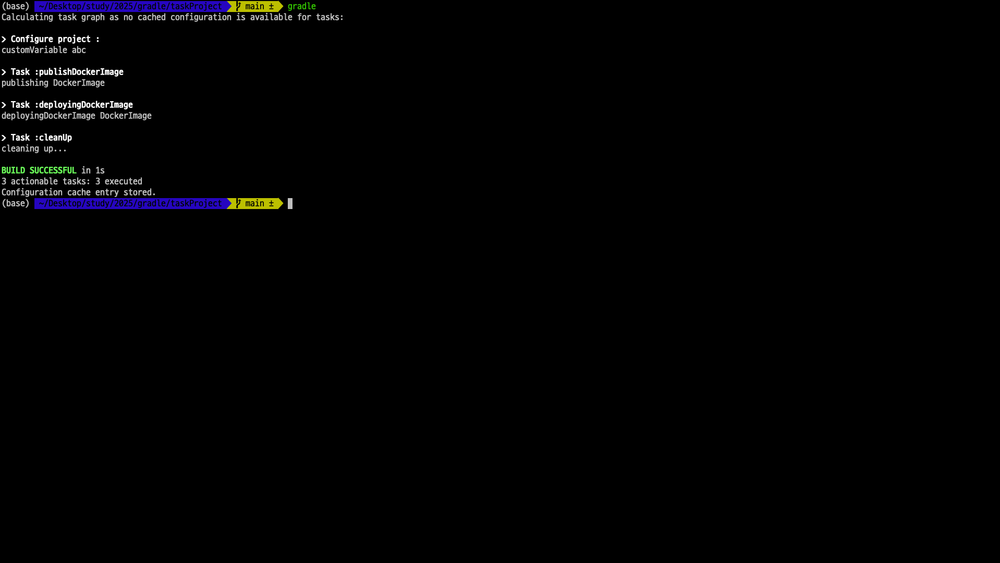

> 해당 블로그 글은 [인프런 강의](https://inf.run/xZG3C)를 바탕으로 쓰여진 글입니다.

## Project 클래스

- Gradle의 Project 객체는 빌드 시스템 내의 `단일 프로젝트를 나타내며 빌드를 구성하기 위한 시스템`이 된다.

- 이는 빌드의 configuration, tasks, dependencies 등을 포함한다.

- 프로젝트 속성
  - Project 객체는 프로젝트 name, description, version, 디렉토리 경로 등 다양한 속성을 보유한다.
  - 이러한 속성은 빌드 스크립트 내에서 접근하고 수정할 수 있다.

좀 더 자세한 것은 [gradle 공식문서](https://docs.gradle.org/current/dsl/org.gradle.api.Project.html)를 살펴보자.

그러면 실제 build.gradle을 통해서 각각 뭐하는 놈인지 살펴보자. 먼저 예시코드부터 살펴보자.

``` groovy
/*
 * This file was generated by the Gradle 'init' task.
 *
 * This generated file contains a sample Java application project to get you started.
 * For more details on building Java & JVM projects, please refer to https://docs.gradle.org/8.13/userguide/building_java_projects.html in the Gradle documentation.
 */

plugins {
    // Apply the application plugin to add support for building a CLI application in Java.
    id 'application'
}

project.version = '1.0.0'
project.description = 'A sample Gradle Project to demonstrate the Project object'

// custom properties
project.ext.prop1 = "foo"

project.repositories({
    // Use Maven Central for resolving dependencies.
    // {}의 클로져가 파라미터로 들어간다.
    mavenCentral()
})

project.dependencies ({
    // Use JUnit Jupiter for testing.
    testImplementation libs.junit.jupiter

    testRuntimeOnly 'org.junit.platform:junit-platform-launcher'

    // This dependency is used by the application.
    implementation libs.guava
})

// Apply a specific Java toolchain to ease working on different environments.
project.java ({
    toolchain {
        languageVersion = JavaLanguageVersion.of(21)
    }
})

project.application ({
    println "Project Name: ${project.name}"
    println "UUID: ${project.getPath()}"
    println "Project Version: ${project.version}"
    println "Project Description: ${project.description}"
    println "Project Custom Prop1: ${project.ext.prop1}"
    // Define the main class for the application.
    mainClass = 'org.example.App'
})

tasks.named('test') {
    // Use JUnit Platform for unit tests.
    useJUnitPlatform()
}
```

먼저 보면 `plugins`라는 것이 존재한다. 플러그인은 말 그대로 프로젝트를 사용할 때 도움이 되는 것을이 모여져 있다. 위의 코드에서는 `applicaiton`이라는 플러그인을 이용하여 해당 프로젝트를 개발하겠다고 하는 것이다.

그리고 공식문서에도 명시되어 있듯이 `project.version`나 `project.description`을 명시하여 사용할 수 있으며 `project.ext.prop1`같이 ext라는 것을 이용하여 커스텀 프로퍼티를 만들 수 있다.

그리고 위의 코드를 살펴보다 보면 기존 코드와 조금 달라진 점이 있을 것이다. 바로 `repositories`와 `dependencies`부분이 project.형태로 변경이 되어 있다. 즉, 각각의 것들은 전부 쉽게 생각해서 지난 Groovy시간에 배운 클로져라고 생각하면 된다. 원래는 project의 메서드 형태로 존재했지만 좀 더 가독성이 좋게 클로져 형태로 변경을 해준 것이다.

## Task 클래스에 대해 알아보자

이제 Gradle의 Task에 대해 살펴보자.

### Task란?

- Task 클래스는 빌드 내의 단일 작업 단위를 나타낸다.

- 각 Task는 코드 컴파일, 테스트 실행 또는 애플리케이션 패키징과 같은 특정 동작을 수행한다.

- Task 클래스의 주요 개념
  - 기본 구조: Task는 name, action 및 dependencies을 가진다. 각 태스크는 여러 액션을 포함할 수 있으며, 이는 태스크가 실행될 때 순차적으로 실행되는 코드 블록이다.

### Task 클래스의 주요 개념

- 생명주기
  - 생성: Task는 구성 단계에서 생성
  - 구성: 이 단계에서는 Task 속성과 의존성이 설정
  - 실행: 이 단계에서는 Task의 action이 정의된 순서대로 실행

- 유형
  - 기본 Task: Gradle은 build, test, clean과 같은 내장 task를 제공
  - 사용자 정의 Task: 빌드 스크립트에서 직접 사용자 정의 Task를 생성하거나 재사용을 위해 별도의 클래스로 정의할 수 있습니다.

- 태스크 속성
  - name: 빌드 스크립트에서 참조하는 데 사용되는 태스크의 이름이다.
  - dependsOn: 이 Task 전에 실행되어야 하는 다른 태스크를 지정한다.
  - group 및 description: Gradle 태스크 목록에서 태스크를 분류하고 설명하는 데 도움이 된다.
  - enabled: 태스크가 실행되어야 하는지 결정한다. false로 설정하면 태스크가 건너뛰어진다.

- 액션
  - 액션은 태스크가 수행하는 작업을 정의한다. doLast와 doFirst 메소드를 사용하여 태스크에 액션을 추가할 수 있으며, 이는 태스크의 시작 또는 끝에 실행할 코드 블록을 지정할 수 있다.

- 의존성
  - 태스크는 다른 태스크에 의존할 수 있으며, 이는 지정된 순서대로 실행되도록 보장한다. 의존성은 dependsOn을 사용하여 정의할 수 있다.

### 실습

그러면 직접 코드를 작성하고 어떻게 구성되는지 보자. 아마 지금까지 학습했다면 이해가 빠를 것이다. 그리고 조금 달라진 점들을 살펴보고자 한다.

태스크 선언하는 방법은 `project.task("태스크 이름") + 클로져`로 하거나 `task + 태스크 이름 + 클러져`로 하는 방식이다. 하지만 현재 Gradle 버전에서 SonarQube가 경고를 해당 문구를 바꾸라고 경고를 띄워준다. 그래서 위와 같이 `tasks.register('태스크 이름') + 클로져`로 변경해야 한다.

``` groovy
tasks.register('prepTask') {
    println "configuration prepTask"
    doLast {
        println "Doing preparation"
    }
}
```

다음으로 살펴 볼 액션은 `dependsOn`이다. 해당 키워드는 해당 task를 실행하기 전에 의존하는 task를 설정해서 의존하는 task를 실행 후 실행하게 해준다. 원래 강의에서도 아래와 같이 작성을 했었다.

``` groovy
task deployingDockerImage(dependesOn: publishDockerImage) {
    dependsOn publishDockerImage

    // true면 아래 doFirst 실행, 아니면 실행 안함
    onlyIf {
        publishVersion == "1.0.0"
    }

    doFirst {
        println "deployingDockerImage DockerImage"
    }
}
```
위와 같이 파라미터로 map형식으로 전달을 해줘야 했다. 하지만 `tasks.register`로 변경이 되면서 해당 부분은 아래와 같이 변경이 되었다.

``` groovy
tasks.register('deployingDockerImage') {
    dependsOn publishDockerImage

    // true면 아래 doFirst 실행, 아니면 실행 안함
    onlyIf {
        publishVersion == "1.0.0"
    }

    doFirst {
        println "deployingDockerImage DockerImage"
    }
}
```

다음으로 살펴 볼 액션은 `onlyIf`이다. 해당 키워드의 의미는 onlyIf 다음의 클로져의 함수가 반환이 true이면 아래 action을 실행할 수 있고 아니면 실행을 못하게 하는 특별한 액션이다. 여기서 또 바뀐 점이 있다. 원래는 아래와 같이 작성이 되었다.

``` groovy
tasks.register('publishDockerImage') {
    ext.version = "1.0.0"
    def customVariable = "abc"

    println "customVariable ${customVariable}"

    doFirst {
        println "publishing DockerImage"
    }
}

// 기존에는 task + 태스크 이름(dependsOn: 의존성 task)
tasks.register('deployingDockerImage') {
    dependsOn publishDockerImage

    // true면 아래 doFirst 실행, 아니면 실행 안함
    onlyIf {
        publishDockerImage.version == "1.0.0"
    }

    doFirst {
        println "deployingDockerImage DockerImage"
    }
}
```

이렇게 하면 아래와 같이 빌드가 실패된다.

``` bash
Could not evaluate onlyIf predicate for task ':deployingDockerImage'.
> Could not evaluate spec for 'Task satisfies onlyIf closure'.
```

해당 오류의 의미를 ai와 구글링을 통해 살펴본 결과 원인은 아래와 같았다. 

> 문제는 publishDockerImage가 TaskProvider 객체이기 때문에, 직접 version 속성을 참조하면 평가 오류가 발생한다.

그래서 나는 아래와 같이 task자체를 변수에 담는 시도를 하였다.

``` groovy
def publishDockerImageTask = tasks.register('publishDockerImage') {
    ext.version = "1.0.0"
    def customVariable = "abc"

    println "customVariable ${customVariable}"

    doFirst {
        println "publishing DockerImage"
    }
}

tasks.register('deployingDockerImage') {
    dependsOn publishDockerImageTask

    onlyIf {
        publishDockerImageTask.get().version == "1.0.0"
    }

    doFirst {
        println "publishing DockerImage"
    }
}
```

하지만 또 다른 이슈가 발생하였다.

``` bash
problem was found storing the configuration cache.
- Task :deployingDockerImage of type org.gradle.api.DefaultTask: cannot serialize object of type 'org.gradle.api.DefaultTask', a subtype of 'org.gradle.api.Task', as these are not supported with the configuration cache.
  See https://docs.gradle.org/8.13/userguide/configuration_cache.html#config_cache:requirements:task_access
```

해당 이슈를 찾아본 결과 원인은 아래와 같았다.

> 오류는 onlyIf 클로저 내에서 Task 객체의 프로퍼티를 직접 참조하여, 비직렬화 가능한 Task 인스턴스가 캡처되기 때문에 발생합니다.

그래서 결국 최종적으로 아래와 같이 버전정보를 담는 변수를 선언하고 그 변수를 적용하였고 성공을 할 수 있었다.

``` groovy
def publishDockerImageTask = tasks.register('publishDockerImage') {
    ext.version = "1.0.0"
    def customVariable = "abc"
    
    println "customVariable ${customVariable}"
    
    doFirst {
        println "publishing DockerImage"
    }
}

// 클로저 외부에서 version 값을 미리 추출하여 저장합니다.
def publishVersion = publishDockerImageTask.get().version

tasks.register('deployingDockerImage') {
    dependsOn publishDockerImageTask

    // 오직 캡처된 publishVersion 값을 비교합니다.
    onlyIf {
        publishVersion == "1.0.0"
    }

    doFirst {
        println "publishing DockerImage"
    }
}
```

다음으로 살펴 볼 액션은 `file`에 관한 액션이다. 이 부분에도 트러블슈팅이 있었다. 기존에는 해당 태스크를 실행시키면 파일을 하나 생성해주는 task였다. 그래서 file을 이용하여 아래와 같이 작성하였다.

``` groovy
tasks.register('fileTask') {
    doLast {
        def file = file('fileTaskSample.txt')
        file.text = 'Hello, Gradle'
        println "Created file at ${file.absolutePath}"
    }
}
```

그러더니 아래와 같이 에러가 발생하였다.

``` bash
Cannot reference a Gradle script object from a Groovy closure as these are not supported with the configuration cache.
```

구글링을 통해서도 잘 나오지를 않아서 ai를 통하여 문제해결을 시도하였고 결국 자바의 파일 생성 api를 이용하기로 하였다. 그리고 아래와 같이 변경하였다.

``` groovy
import java.nio.file.Files
import java.nio.file.Paths

tasks.register('fileTask') {
    doLast {
        // 미리 저장된 변수(projectDirPath)를 사용하여 파일 경로를 생성합니다.
        def path = Paths.get(project.projectDir.toString(), "fileTaskSample.txt")
        Files.write(path, "Hello, Gradle".getBytes("UTF-8"))
        println "Created file at ${path.toAbsolutePath()}"
    }
}
```

하지만 또 다른 이슈가 발생하였다.

``` bash
Cannot reference a Gradle script object from a Groovy closure as these are not supported with the configuration cache.
```

해당 오류의 의미는 Gradle configuration cache는 Groovy 클로저 내부에서 Gradle 스크립트 객체를 참조할 수 없다라는 것이다. 그래서 필자는 `project.projectDir.toString()`부분을 변수로 빼었고 아래와 같이 최종 작성할 수 있었다.

``` groovy
import java.nio.file.Files
import java.nio.file.Paths

tasks.register('fileTask') {
    doLast {
        // project 디렉토리를 기준으로 파일 경로 생성
        def path = Paths.get(project.projectDir.toString(), "fileTaskSample.txt")
        // 파일에 "Hello, Gradle" 텍스트를 기록 (UTF-8 인코딩)
        Files.write(path, "Hello, Gradle".getBytes("UTF-8"))
        println "Created file at ${path.toAbsolutePath()}"
    }
}
```

다음으로 알아 볼 액션은 `finalizedBy`이다. 해당 액션은 태스트 + finalizedBy + 태스트 이다. 해당 태스크가 끝나고 다음으로 바로 실행 할 태스크를 지정해주는 것이다.

``` groovy
deployingDockerImage.finalizedBy cleanUp
```

마지막으로 알아 볼 액션은 defaultTasks 이다. 사용법은 아래와 같고 해당 액션 다음의 태스크명을 적어주면 우리가 터미널에서 `gradle`이라고만 쳐도 해당 태스크가 자동 실행된다.

``` groovy
defaultTasks "deployingDockerImage"
```



> 잘못된 지식이 있을 경우 댓글로 남겨주시면 빠르게 반영하겠습니다!
