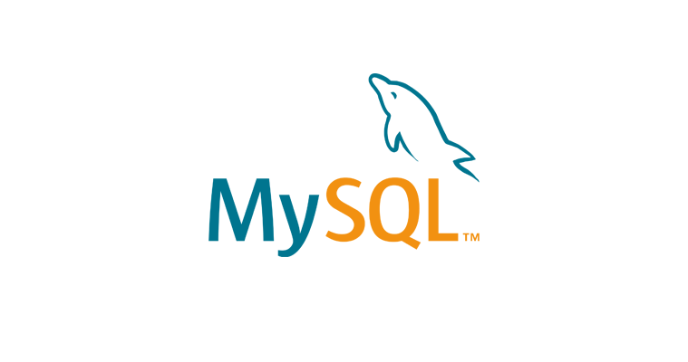
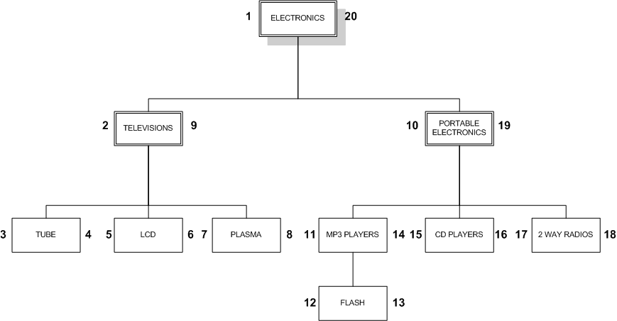
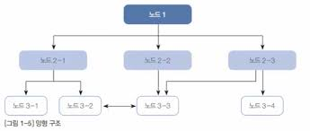
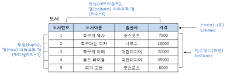

> 해당 블로그 글은 [이것이 MySQL이다](https://www.youtube.com/playlist?list=PLVsNizTWUw7Hox7NMhenT-bulldCp9HP9)를 바탕으로 쓰여진 글입니다.

MySQL은 DBMS 소프트웨어 일종으로 Oracle사에 만든 제품이다.

## 데이터베이스의 정의와 특징

데이터베이스는 데이터의 집합을 의미한다. 그리고 해당 데이터베이스가 여러개 모여서 만듭 집합을 DBMS라고 일컫는다. 데이터베이스는 여러명의 사용자나 응용 프로그램이 공유하고 동시에 접근이 가능해야 한다. 그래서 많은 사람들이 착각하는 경우가 존재한다. 많은 사람들이 Excel같은 프로그램을 데이터베이스와 같다고 생각하는 경우가 많다. 왜냐하면 엑셀과 같은 프로그램은 데이터의 집합으로 사용될 수 있기 때문이다. 하지만 DBMS라고 안 부르는 이유가 대용량을 관리하거나 여러명의 사용자가 공유하는 개념이 아니기 때문에 DBMS라고 부르지 않는 것이다.

> 📚 용어 정리
>
> - 데이터베이스: 데이터의 집합
> - DBMS: 데이터베이스 집합으로 여러 데이터베이스들을 관리 및 운영을 하기 위한 소프트웨어

DBMS 종류에는 MySQL 외에도 MariaDB, PostgreSQL, Oracle, SQLite(모바일 전용)등이 존재한다. 차이는 각 DBMS별로 차이가 있지만 MySQL은 상용버전도 존재하고 무료버전도 존재한다. 그래서 실무에서는 상용버전을 사용하니 유의를 해야 한다. 만약 무료를 사용하고 싶다면 온전히 전부 무료인 MariaDB, PostgreSQL을 사용하면 되며 돈이 많다면 Oracle을 이용하면 될 것이다. 단, Oracle. MariaDB은 윈도우, 리눅스, 유닉스 운영체제에서만 가능하며 맥 OS에는 호환이 안 되는 걸로 알고 있다.

DBMS에는 다음과 같은 특징들이 가지고 있다.

### 데이터 무결성

데이터베이스 안의 데이터는 어떤 경로를 통해서 들어왔던지 간에 데이터에 오류가 있어서는 안된다. 데이터베이스 안에 저장되는 데이터에는 정말 중요하고 민감한 내용이 많이 존재한다. 은행 계좌라던지, 비밀번호, 유심정보등이 이에 속한다. 그런데 이런 데이터가 오류가 있으면 정말 큰 사고로 나타날 것이다.

### 데아터 독립성

데이터베이스 크기가 변경되거나 데이터 파일의 저장소를 변경하더라도 기존에 작성된 응용 프로그램은 전혀 영향을 받지 않아야 한다. 즉, 쉽게 말해 MySQL을 MariaDB로 바꾼다고 하더라도 이것을 이용해 작성된 응용프로그램은 변경이 없어야 한다는 의미이다.

### 보안

데이터베이스 안의 데이터에 아무나 접근하는게 아니라 데이터를 소유하는 사람이나 접근 허가를 맡은 사용자만이 접근을 해야 한다. 물론 허용된 사용자는 모든 곳을 접근하는 것이 아닌 제한된 곳만 접근한다고 볼 수 있다.

### 데이터 중복의 최소화

동일한 데이터가 여러개 중복되어 저장되는 것을 방지한다.

### 응용 프로그램 제작 및 수정이 용이

일반 어플리케이션을 만들 때 데이터베이스를 이용하면 공통적인 프로그램 제작이 가능해진다. 그리고 유지보수 또한 쉬워진다.

### 데이터 안전성 향상

대부분 DBMS가 백업 및 복원 기능을 이용하여 데이터가 오염될 경우 해당 기능을 이용하여 복원한다.

## 데이터베이스의 발전

처음에는 데이터베이스라는 개념은 없었을 것이다. 그러면 어떻게 데이터베이스가 발전해왔는지 살펴보도록 하자.

### 오프라인 관리

예전에 컴퓨터가 없을 시절에는 일반 종이 장부처럼 종이로 데이터를 관리했을 것이다. 예전에 아버지한테 듣기로는 회사에 급여를 받을때나 출퇴근 기록을 할때 종이로 했다는 소식을 들었다. 이처럼 컴퓨터가 없을 때는 종이로 많이 관리가 되었을 것이다.

### 파일시스템 관리

컴퓨터를 사용하면서 종이에 기록하던 것을 전부 컴퓨터 파일로 관리하기 시작했다. 쉽게 생각해서 이전 종이로 근태관리를 했던 것을 엑셀파일 같은 것으로 관리를 했다고 생각하면 쉬울 것이다. 그런데 이 파일로 데이터를 관리하는 것은 한계점이 명확했다. 만약 시간이 지나서 근태관리도 점점 데이터가 쌓였을 것이다. 그런데 이렇게 데이터가 커지면 파일의 용량이 점점 커질 것이고 데이터 중복으로 인한 불일치도 생겼을 것이다. 예를 들어 같은 날 출근 기록을 실수로 한 사람이 여러번 했을 경우도 있기 때문인 것이다.

### 데이터베이스 관리 시스템

이런 문제를 해결하고자 데이터베이스가 등장한 것이다. 즉 DBMS라 부른다. DBMS는 파일 시스템의 단점을 보완하고 대량의 데이터를 효율적으로 관리하고 운용하기 위해서 사용된 것이다.

또한, DBMS에 데이터를 잘 관리하고 활용하기 위해 새로운 언어가 만들어졌는데 이것을 우리는 SQL이라고 부른다. 그래서 SQL을 활용하여 DBMS에 데이터들을 추출 및 조작을 할 수 있는것이다.

## DBMS 분류

DBMS 분류에는 크게 5가지로 나눌 수 있다. 해당 내용은 크게 중요한 것은 아니지만 어떤 분류가 있는지 알고 넘어가는 것이 좋을 것 같다. 결론부터 먼저 말하지면 우리가 사용할 MySQL같은 DBMS는 RDBMS라고 한다. 대부분 사용하는 DBMS가 관계형 데이터베이스 시스템(RDBMS)라고 한다.

### 계층형 DBMS

초창기 DBMS로는 계층형 DBMS가 나왔다. 해당 DBMS는 위와 같이 트리 구조로 데이터가 구성되어 있어서 계층형이라고 부른다. 검색은 상당히 빠른 구조이지만 접근의 유연성이 부족하다는 문제가 있었다.

### 망형 DBMS

망형 DBMS는 계층형 DBMS 문제점을 개선하고자 탄생하게 되었다. 망형 DBMS는 트리구조에서 수평적으로도 노드들이 연결된 구조이다. 하지만 해당 망형 DBMS도 해당 내부에 복잡한 내부 포인터를 사용하고 있어서 사용자가 해당 구조를 다 알아야 프로그램 작성이 가능하다는 점에서 매우 불편했다.

### 관계형 DBMS

RDBMS의 핵심 개념은 데이터베이스는 테이블이라는 최소단위로 구성되며 해당 테이블은 하나 이상의 열을 가지고 있다는 것이다. 마치 엑셀과 유사할 것이다.

> 📚 용어 정리
>
> 테이블의 가로를 행이라고 부르며 영어로는 row라고 하며 세로를 열이라고 하며 영어로는 column이라고 부른다.

> 📚 용어 정리
>
> 테이블을 다른 말로 릴레에션 혹은 엔티티라고 부른다.

## SQL 개요

RDBMS를 운영하고 질의할 때 사용하는 언어가 바로 SQL이다. 우리가 알고 있는 프로그래밍 언어랑 구조자체는 다르다. 그럼 SQL의 특징을 한번 살펴보도록 하자.

- DBMS 회사와 독립적이다.
  - SQL은 모든 DBMS 제작회사에 공통적으로 공개를 하고 각 제작회사는 표준 SQL에 맞춰서 DBMS를 개발한다. 그러므로 표준 SQL은 대부분 DBMS와 호환된다. 그리고 각자 회사만의 추가 SQL을 만드는데 대표적으로 오라클의 PL/SQL이 존재한다.
- 다른 시스템과의 이식성이 좋다.
- 표준은 계속 발전한다.
  - SQL은 다른 RDBMS와의 호환성이 매우 좋다.
- 대화식 언어이다.
- 분산형 클라이언트/서버 구조이다.

## MySQL 소개

MySQL은 외부에 만든 것을 오라클이 인수하여 만든 DBMS이다. MySQL은 비상업용이나 교육용은 무료로 사용이 가능하지만 상업용으로 사용할 경우 상업용 라이센스를 취득해야만 사용이 가능하다.

> 잘못된 지식이 있을 경우 댓글로 남겨주시면 빠르게 반영하겠습니다!