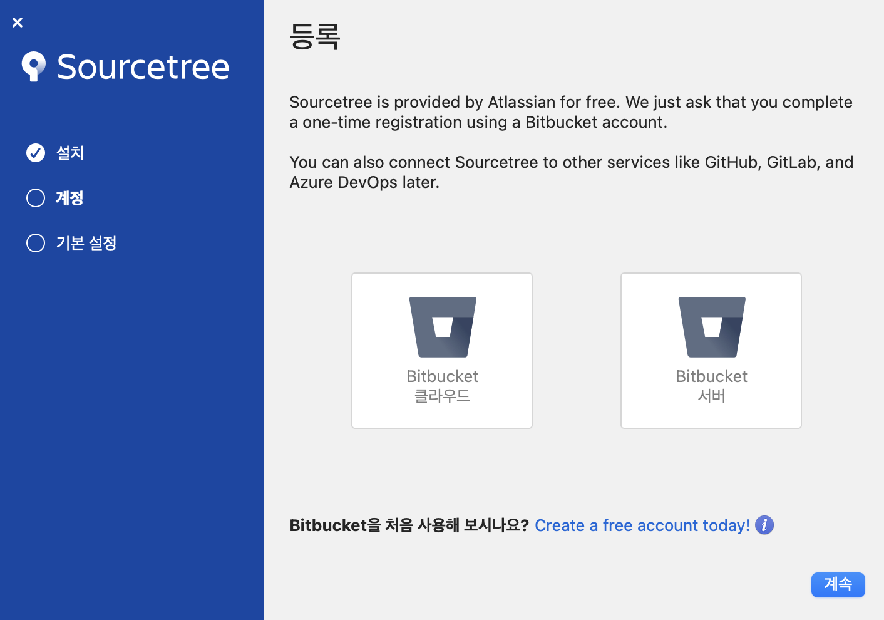
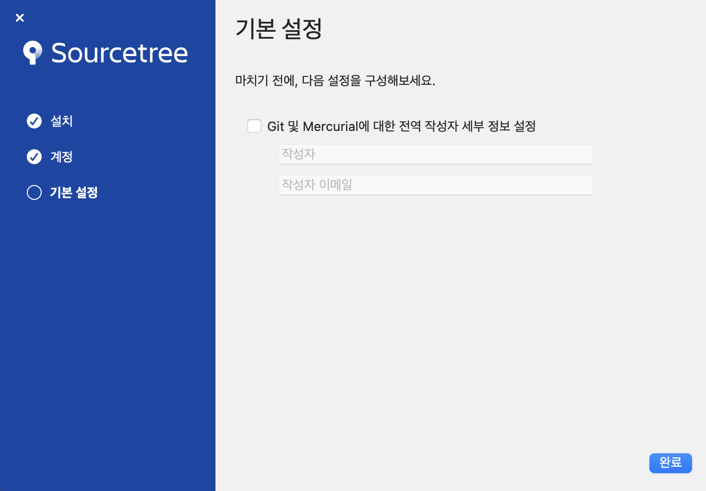
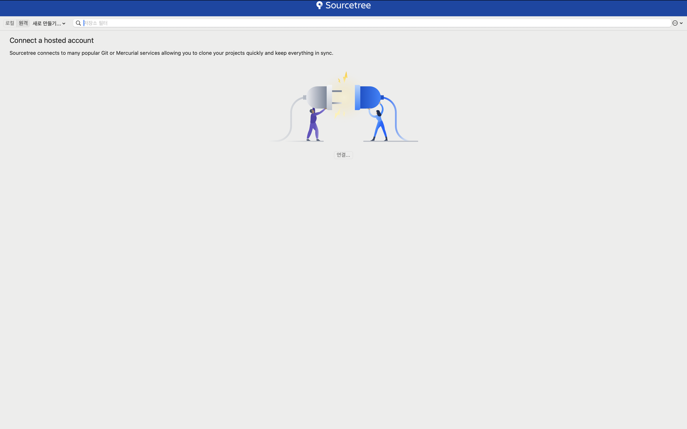

> 해당 블로그 글은 [얄코님의 인프런 강의](https://inf.run/SvdA2)를 바탕으로 쓰여진 글입니다.

## Git 시작하기

우리는 왜 git을 배워야 할까? 어떤 프로그래밍 언어로 개발을 시작하든, 어떤 분야의 개발자가 되던지 git은 필수적이다.

git은 프로젝트의 **시간**과 **차원**을 자유롭게 넘나들 수 있게 해주는 도구이다. 여기서 시간이라고 하면, 프로젝트의 버전을 과거로 되돌리거나 특정 내역을 취소할 수 있다. 또한 프로젝트의 여러 모드를 쉽고 빠르게 전환이 가능하다. 즉, 차원을 넘나들 수 있는 것으로 볼 수 있다. 그리고 대규모 어플리케이션을 만드는 회사에서 나 혼자 만드는 것이 아닌 다른 팀원분들과 협업해서 만들어가야 한다. git은 이런 협업 관점에서 많은 도움을 준다.

만약 이런 git이 없다라면, 우리가 예전에 아는 것처럼 프로젝트 파일마다 버전을 기록해야 하거나 혹은 아래와 같은 이미지처럼 관리해야 하는데 이것은 딱 봐도 용량도 많이 차지하고 비효율적이라고 느낄 것이다.


## 강의를 위한 설치와 세팅

이제 git을 설치해보자. 본 필자 환경은 맥이다. 따라서 맥에 관련된 설치사항만 전달드릴테니 윈도우 사용자시라면 검색해서 해보시는것을 추천드린다.

### git 설치

맥은 기본적으로 git이 설치되어 있다. 아래와 같이 터미널에서 명령어를 치면 git version 정보가 나올 것이다.

``` bash
git --version
```

만약 위의 명령어를 쳤을 때 [git 공식 사이트](https://git-scm.com/)과 다르면 추가 업데이트를 해줘야 한다. 먼저, 우리는 homebrew라는 것을 설치해줘야 한다. [homebrew 공식 사이트](https://brew.sh/)에 접속하여 사이트에 명시되어 있는 명령어를 복사하여 터미널에 입력하면 homebrew 설치는 완료된다. 이후, 아래와 같이 brew 명령어를 통해 git을 설치하자.

``` bash
brew install git
```

> ✅ 추가
>
> 맥 사용자의 경우 `git config --global core.autocrlf input`을 터미널에 입력해주자. 왜냐하면 해당 명령어는 윈도우 사용자와 맥 사용자의 엔터 방식 차이로 인한 오류를 방지해준다.

> ✅ 추가
>
> m1 이상 사용자라면 homebrew가 정상적으로 동작을 안 할 수 있다. 추가적으로 아래의 명령어들을 입력해주자.
>
> `echo 'eval "$(/opt/homebrew/bin/brew shellenv)"' >> /Users/사용자명/.zprofile`
>
> `eval "$(/opt/homebrew/bin/brew shellenv)"`

### 소스트리 설치

다음으로 git을 GUI로 쉽게 사용이 가능하게 하는 소스트리를 설치해주자. GUI로 git을 사용하게 하는 툴의 대표적인 근본 프로그램이다. 소스트리 외에 깃 크라켄, 깃헙 데스크탑등이 존재하지만 무료인 소스트리를 현업에서도 많이 사용하는 것 같다. [소스트리 공식 사이트](https://www.sourcetreeapp.com/)에 다운로드 버튼을 클릭해 설치하여 실행하면 아래와 같이 나올 것이다.



해당 부분은 BitBucket이라는 Git과 유사한 툴인데 생략하고 다음을 누른다.



이후 계정 입력 칸이 나오는데 체크박스 체크 후 본인의 이름과 이메일을 작성해준다.



위와 같이 나오면 정상적으로 설치가 된 것이다.

### iterm2 세팅

iterm2 세팅은 본인이 원하시는 걸로 해도 된다. 구글링을 통해서 한번 따라 해보자. 해당 과정은 필수가 아니므로 꼭 안 해도 된다.

### vscode 세팅

vscode는 경량 IDE다. 해당 ide 또한 구글링을 통해 설치하도록 하자.

## CLI vs GUI. 무엇을 사용해야 할까요?

git을 다루는 방식은 터미널에 명령어를 입력하는 CLI 방식과 소스트리를 이용한 GUI 방식이 존재한다. 그래서 사람들은 보통 GUI 방식을 많이 익히려고들 한다. 하지만 실무에서는 확실히 CLI 방식이 많이 사용되며 CLI를 완벽히 익히고 나서 GUI를 사용해도 좋을 것이다.

## Git 설정 & 프로젝트 관리 시작하기


> 잘못된 지식이 있을 경우 댓글로 남겨주시면 빠르게 반영하겠습니다!