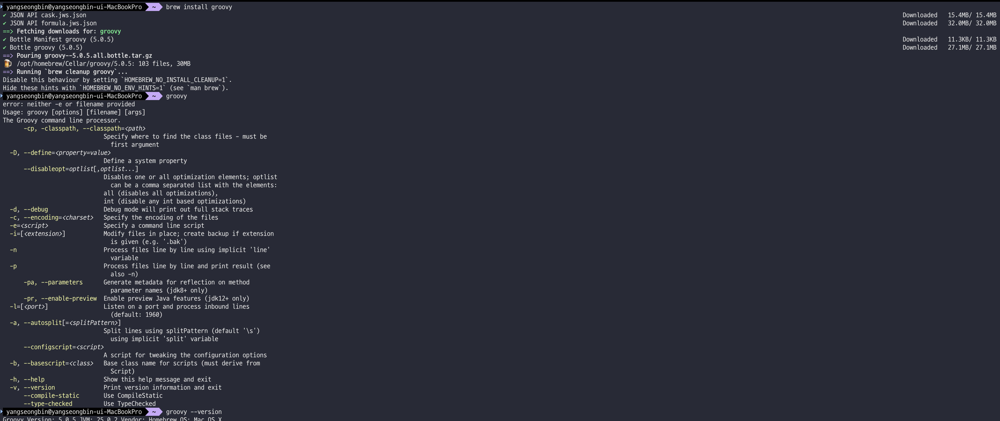
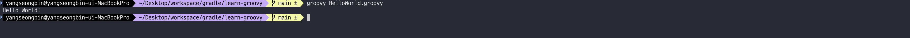

## Groovy 설치 및 Hello World 만들어 보기

### Groovy란?

지금까지 Gradle 시리즈에서 빌드 스크립트를 Groovy DSL로 작성해왔다. `build.gradle` 파일의 문법이 Java와 비슷하면서도 다른 느낌이었는데, 이번 글에서는 Gradle의 빌드 스크립트 언어인
**Groovy**가 어떤 언어인지 알아보자.

Apache Groovy는 Java 플랫폼을 위한 강력하고 선택적으로 타입을 지정할 수 있는(optionally typed) **동적 언어**이다. 스크립팅과 애플리케이션 개발 모두를 지원하는 다목적 언어로
설계되었다.

### Groovy의 주요 특징

#### Java 호환성

Groovy는 JVM 위에서 동작하기 때문에 Java와 완벽하게 호환된다. Groovy 코드에서 Java 라이브러리와 프레임워크를 그대로 사용할 수 있고, 반대로 Java에서 Groovy 코드를 호출하는 것도
가능하다. 실제로 대부분의 Java 코드는 그 자체로 유효한 Groovy 코드이기도 하다.

```groovy
// Java 클래스를 Groovy에서 그대로 사용
import java.util.ArrayList
 
def list = new ArrayList<String>()
list.add("Hello")
list.add("Groovy")
println list  // [Hello, Groovy]
```

#### 동적 타이핑과 정적 타이핑

Groovy는 Python이나 JavaScript처럼 **동적 타이핑**을 지원하면서, 동시에 Java처럼 **정적 타이핑**도 지원한다. 상황에 따라 원하는 수준의 타입 안전성을 선택할 수 있다.

```groovy
// 동적 타이핑 — def 키워드 사용
def name = "Gradle"
def number = 42
def list = [1, 2, 3]
 
// 정적 타이핑 — 타입 명시
String greeting = "Hello"
int count = 10
```

`def` 키워드를 사용하면 타입을 명시하지 않아도 되며, 런타임에 타입이 결정된다. 빌드 스크립트처럼 빠르게 작성하고 유연하게 동작해야 하는 경우에 동적 타이핑이 편리하다.

#### 간결한 문법

Groovy는 Java보다 훨씬 간결하고 표현력이 뛰어나다. 보일러플레이트 코드를 줄여주어 빠르게 작성하고 읽기 쉽다.

```groovy
// Java 스타일
List<String> names = new ArrayList<>();
names.add("Alice");
names.add("Bob");
for (String name : names) {
    System.out.println(name);
}
 
// Groovy 스타일
def names = ["Alice", "Bob"]
names.each { println it }
```

Groovy에서 자주 사용되는 간결한 문법을 Java와 비교하면 다음과 같다.

| 기능            | Java                                       | Groovy            |
|---------------|--------------------------------------------|-------------------|
| 리스트 생성        | `new ArrayList<>(Arrays.asList("a", "b"))` | `["a", "b"]`      |
| 맵 생성          | `Map.of("key", "value")`                   | `[key: "value"]`  |
| 문자열 보간        | `"Hello " + name`                          | `"Hello ${name}"` |
| getter/setter | 직접 작성 또는 lombok                            | 자동 생성             |
| 세미콜론          | 필수                                         | 생략 가능             |
| 괄호            | 필수                                         | 경우에 따라 생략 가능      |
| null 안전 접근    | `obj != null ? obj.method() : null`        | `obj?.method()`   |

#### 인터프리터 & 컴파일러

Groovy는 스크립팅 언어(런타임에 인터프리트)로도, 컴파일 언어(JVM 바이트코드로 컴파일)로도 사용할 수 있다. `.groovy` 파일을 `groovy` 명령어로 바로 실행할 수도 있고, `groovyc`로
컴파일하여 `.class` 파일을 생성할 수도 있다.

### Groovy 설치 및 실행

#### 설치

macOS에서는 Homebrew로 간단히 설치할 수 있다.

```bash
brew install groovy
```

설치 후 버전을 확인해보자.

```bash
$ groovy --version
Groovy Version: 5.0.5 JVM: 25.0.2 Vendor: Homebrew OS: Mac OS X
```



#### Hello World

Groovy 스크립트를 작성하고 실행해보자. `HelloWorld.groovy` 파일을 만든다.

```groovy
println("Hello World!")
```

Java의 `System.out.println()`과 달리, Groovy에서는 `println`만으로 출력이 가능하다. 더 나아가 괄호도 생략할 수 있다.

```groovy
println "Hello World!"
```

실행은 `groovy` 명령어로 한다.

```bash
$ groovy HelloWorld.groovy
Hello World!
```

컴파일 없이 바로 실행되는 것을 확인할 수 있다. 이것이 Groovy의 스크립팅 특성이다.



### Groovy의 주요 활용 분야

#### 빌드 자동화

Groovy의 가장 대표적인 활용처가 바로 **Gradle**이다. Gradle의 Groovy DSL은 Groovy의 간결한 문법을 활용하여 빌드 스크립트를 읽기 쉽고 표현력 있게 작성할 수 있게 해준다. 이
시리즈에서 계속 작성해온 `build.gradle` 파일이 바로 Groovy 코드이다.

```groovy
// build.gradle — 이것이 Groovy 코드이다
plugins {
    id 'java'
}
 
repositories {
    mavenCentral()
}
 
dependencies {
    implementation 'org.springframework.boot:spring-boot-starter-web'
}
```

위 코드가 가능한 이유는 Groovy의 문법적 특성 때문이다. 메서드 호출 시 괄호를 생략할 수 있고, 클로저(Closure)를 마지막 인자로 전달할 때 중괄호를 사용할 수 있다. `plugins { }`,
`dependencies { }` 같은 블록이 모두 Groovy의 클로저 문법이다.

#### 스크립팅과 자동화

파일 처리, 데이터 가공, 시스템 관리 등 자동화 스크립트 작성에 Groovy가 많이 사용된다. Java의 라이브러리를 그대로 활용하면서도 스크립트 언어의 편의성을 누릴 수 있기 때문이다.

#### 웹 개발

Groovy 기반의 웹 프레임워크인 **Grails**는 Ruby on Rails에서 영감을 받은 프레임워크로, Groovy의 강점을 활용하여 빠른 웹 애플리케이션 개발을 지원한다.

#### 테스팅

Groovy는 **Spock** 테스트 프레임워크의 기반 언어이다. Spock은 BDD(Behavior-Driven Development) 스타일의 테스트를 간결하게 작성할 수 있어 Java/Kotlin
프로젝트에서도 테스트 코드만 Groovy(Spock)로 작성하는 경우가 많다. `gradle init`에서 테스트 프레임워크를 선택할 때 Spock이 있었던 것도 이 때문이다.

### Groovy vs Kotlin DSL

이 시리즈의 첫 글에서 Groovy DSL과 Kotlin DSL을 비교한 적이 있다. Gradle에서 두 언어의 위상을 정리하면 다음과 같다.

| 항목    | Groovy DSL         | Kotlin DSL         |
|-------|--------------------|--------------------|
| 파일명   | `build.gradle`     | `build.gradle.kts` |
| 현재 위상 | 레거시로 분류되는 추세       | Gradle 공식 권장       |
| 장점    | 간결한 문법, 유연한 동적 타이핑 | 타입 안전성, IDE 자동 완성  |
| 학습 가치 | 기존 프로젝트 유지보수에 필수   | 신규 프로젝트에 권장        |

Gradle 공식 문서에서는 Kotlin DSL을 권장하고 있지만, 여전히 많은 프로젝트와 레퍼런스가 Groovy DSL로 작성되어 있다. 또한 Groovy의 문법을 이해하면 `build.gradle`을 읽고
수정하는 데 어려움이 없으므로, 두 DSL 모두 알아두는 것이 좋다.

## Data Type에 대해서 알아보자

### Groovy의 데이터 타입

Groovy의 개요와 주요 특징을 살펴보았다. 이번에는 Groovy의 **데이터 타입**을 구체적으로 알아보자. Groovy는 JVM 기반 언어이므로 Java의 원시 타입(Primitive Types)을 그대로
사용하면서도, 필요할 때 자동으로 래퍼 클래스(Wrapper Class)로 변환한다. 여기에 Groovy만의 편리한 타입들이 추가된다.

### 원시 데이터 타입 (Primitive Data Types)

Groovy는 Java의 8가지 원시 타입을 모두 지원한다. 다만 Groovy 내부에서는 원시 타입도 객체로 취급되어, 필요 시 자동으로 래퍼 클래스로 박싱(boxing)된다.

```groovy
// Byte — 8비트 정수
byte b = 10
println "Byte: $b"
println b.class  // class java.lang.Byte
 
// Short — 16비트 정수
short s = 30000
println "Short: $s"
 
// Integer — 32비트 정수
int i = 100000
println "Integer: $i"
 
// Long — 64비트 정수
long l = 10000000000L
println "Long: $l"
 
// Float — 32비트 부동소수점
float f = 10.5F
println "Float: $f"
 
// Double — 64비트 부동소수점
double d = 20.99
println "Double: $d"
 
// Character — 16비트 유니코드 문자
char c = 'A'
println "Character: $c"
 
// Boolean — 참/거짓
boolean bool = true
println "Boolean: $bool"
```

`b.class`를 출력해보면 `java.lang.Byte`가 나온다. `byte`로 선언했지만 Groovy가 내부적으로 래퍼 클래스로 처리하고 있다는 것을 알 수 있다. 이는 Groovy가 모든 것을 객체로 다루기
때문이며, Java와의 주요 차이점 중 하나이다.

각 원시 타입과 래퍼 클래스의 대응 관계를 정리하면 다음과 같다.

| 원시 타입     | 크기   | 래퍼 클래스      | 설명                         |
|-----------|------|-------------|----------------------------|
| `byte`    | 8비트  | `Byte`      | 정수 (-128 ~ 127)            |
| `short`   | 16비트 | `Short`     | 정수 (-32,768 ~ 32,767)      |
| `int`     | 32비트 | `Integer`   | 정수 (약 ±21억)                |
| `long`    | 64비트 | `Long`      | 정수 (매우 큰 범위), 리터럴에 `L` 접미사 |
| `float`   | 32비트 | `Float`     | 부동소수점, 리터럴에 `F` 접미사        |
| `double`  | 64비트 | `Double`    | 부동소수점 (기본 소수점 타입)          |
| `char`    | 16비트 | `Character` | 유니코드 문자                    |
| `boolean` | -    | `Boolean`   | `true` 또는 `false`          |

### 참조 데이터 타입 (Reference Data Types)

#### String

Groovy의 문자열은 `java.lang.String` 인스턴스이지만, 더 편리한 문법을 제공한다. 큰따옴표(`"`), 작은따옴표(`'`), 삼중 따옴표(`"""`, `'''`)를 사용할 수 있다.

```groovy
// 작은따옴표 — 순수 문자열 (java.lang.String)
String str1 = 'Hello, Groovy!'
 
// 큰따옴표 — 문자열 보간 지원 (GString)
String name = "Gradle"
String str2 = "Hello, ${name}!"
println str2  // Hello, Gradle!
 
// 삼중 따옴표 — 멀티라인 문자열
String multiline = """
    이것은
    여러 줄의
    문자열입니다.
"""
println multiline
```

이전 글에서 다뤘듯이, 작은따옴표 문자열에서는 보간이 동작하지 않고, 큰따옴표 문자열에서만 `${}` 보간이 동작한다. Gradle 빌드 스크립트에서 의존성 좌표에 작은따옴표를 쓰는 이유가 바로 이것이다.

#### BigInteger와 BigDecimal

원시 타입의 범위를 넘어서는 매우 큰 정수나 정밀한 소수를 다뤄야 할 때 사용한다.

```groovy
// BigInteger — 임의 크기의 정수
BigInteger bigInt = new BigInteger("12345678901234567890")
println "BigInteger: $bigInt"
 
// BigDecimal — 정밀한 소수
BigDecimal bigDec = new BigDecimal("12345.6789")
println "BigDecimal: $bigDec"
```

Groovy에서 특이한 점은, 소수점이 있는 숫자 리터럴의 기본 타입이 Java와 다르다는 것이다. Java에서 `3.14`는 `double`이지만, Groovy에서 `def x = 3.14`로 선언하면
`BigDecimal`이 된다. 이는 금융 계산 등에서 부동소수점 오차를 방지하는 데 유리하다.

```groovy
def x = 3.14
println x.class  // class java.math.BigDecimal
```

#### List

Groovy의 리스트는 `java.util.List` 인스턴스이지만, 대괄호(`[]`)로 간편하게 생성할 수 있다. 중복 요소를 허용하는 순서가 있는 컬렉션이다.

```groovy
// 리스트 생성
List<Integer> list = [1, 2, 3, 4, 5]
println "List: $list"
 
// 인덱스 접근
println list[0]     // 1
println list[-1]    // 5 (마지막 요소)
 
// 리스트 조작
list << 6           // 요소 추가
println list        // [1, 2, 3, 4, 5, 6]
 
// 유용한 메서드들
println list.size()      // 6
println list.contains(3) // true
println list.collect { it * 2 }  // [2, 4, 6, 8, 10, 12]
println list.findAll { it > 3 }  // [4, 5, 6]
```

#### Map

Groovy의 맵은 `java.util.Map` 인스턴스이며, 대괄호 안에 `키: 값` 형태로 정의한다. 순서가 보장되지 않는 키-값 쌍의 컬렉션이다.

```groovy
// 맵 생성
Map<String, Integer> map = [name: 1, age: 25]
println "Map: $map"
 
// 값 접근
println map.name      // 1 (프로퍼티 방식)
println map['age']    // 25 (인덱스 방식)
 
// 맵 조작
map.city = "Seoul"
println map           // [name:1, age:25, city:Seoul]
 
// 키/값 순회
map.each { key, value ->
    println "${key}: ${value}"
}
```

Gradle 빌드 스크립트에서도 맵이 자주 등장한다. 예를 들어 태스크에 속성을 전달할 때 사용된다.

#### Range

Range는 Groovy의 고유한 타입으로, 시작 값과 끝 값으로 정의되는 값의 시퀀스이다. 주로 숫자나 문자에 사용된다.

```groovy
// 포함 범위 (inclusive) — 1부터 5까지
Range range = 1..5
println "Range: $range"       // [1, 2, 3, 4, 5]
println range.size()          // 5
println range.contains(3)     // true
 
// 제외 범위 (exclusive) — 1부터 4까지 (5 제외)
def halfOpen = 1..<5
println halfOpen              // [1, 2, 3, 4]
 
// 문자 범위
def chars = 'a'..'f'
println chars.toList()        // [a, b, c, d, e, f]
 
// 반복에 활용
(1..3).each { println "반복 ${it}회" }
```

### 특수 데이터 타입 (Special Data Types)

#### Closure

클로저(Closure)는 Groovy에서 가장 중요한 특수 타입이다. `groovy.lang.Closure`의 인스턴스로, 주변 스코프의 변수를 캡처할 수 있는 익명 함수이다. 중괄호(`{}`)로 정의하고, `->`
기호로 파라미터와 본문을 구분한다.

```groovy
// 기본 클로저
def sayHello = { println "Hello, Groovy!" }
sayHello()  // Hello, Groovy!
 
// 파라미터가 있는 클로저
def add = { a1, a2 -> a1 + a2 }
println add(5, 3)  // 8
 
// 이름이 있는 파라미터
def greet = { name -> println "Hello, $name!" }
greet("Groovy")  // Hello, Groovy!
```

#### 암묵적 파라미터 `it`

클로저의 파라미터가 하나일 때, 파라미터를 선언하지 않으면 자동으로 `it`이라는 이름으로 참조할 수 있다.

```groovy
def square = { it * it }
println square(4)  // 16
```

이 `it`은 Gradle 빌드 스크립트에서도 자주 등장한다. 예를 들어 `tasks.named('test') { useJUnitPlatform() }`에서 생략된 파라미터가 바로 `it`이다.

#### 기본값 파라미터

```groovy
def greetWithDefault = { name = "Stranger" -> println "Hello, $name!" }
greetWithDefault()       // Hello, Stranger!
greetWithDefault("Bob")  // Hello, Bob!
```

#### 클로저를 함수 인자로 전달

클로저는 다른 함수의 인자로 전달할 수 있다. 이것이 바로 Gradle이 DSL처럼 동작하는 핵심 원리이다.

```groovy
def operate(a, b, operation) {
    return operation(a, b)
}
 
def result = operate(4, 5, { x, y -> x + y })
println result  // 9
```

Gradle에서 `dependencies { ... }`, `tasks.register('hello') { ... }` 같은 구문이 전부 클로저를 인자로 전달하는 것이다.

#### Null과 Safe Navigation Operator

Groovy에서 `null`은 `java.lang.Void` 타입의 객체로 취급된다. Java에서 `null`에 메서드를 호출하면 `NullPointerException`이 발생하지만, Groovy는 **Safe
Navigation Operator(`?.`)** 를 통해 이를 안전하게 처리할 수 있다.

```groovy
String nullableString = null
println "Length: ${nullableString?.length()}"  // Length: null
```

`nullableString`이 `null`이므로 `?.length()`는 `NullPointerException`을 던지지 않고 `null`을 반환한다. Kotlin의 `?.`과 동일한 개념이다.

### 동적 타이핑 (Dynamic Typing with `def`)

Groovy는 동적 타이핑을 지원하며, `def` 키워드를 사용하면 변수의 타입을 명시하지 않아도 된다. Groovy가 런타임에 타입을 추론한다.

```groovy
def dynamicVar = "I am a string"
println "Value: $dynamicVar (Type: ${dynamicVar.getClass().name})"
// Value: I am a string (Type: java.lang.String)
 
dynamicVar = 42
println "Value: $dynamicVar (Type: ${dynamicVar.getClass().name})"
// Value: 42 (Type: java.lang.Integer)
 
dynamicVar = [1, 2, 3]
println "Value: $dynamicVar (Type: ${dynamicVar.getClass().name})"
// Value: [1, 2, 3] (Type: java.util.ArrayList)
```

같은 변수에 문자열, 정수, 리스트를 순서대로 대입할 수 있다. Java에서는 불가능한 일이지만, Groovy의 동적 타이핑 덕분에 가능하다. 빌드 스크립트처럼 유연성이 중요한 상황에서 편리하지만, 대규모 코드에서는
타입 안전성이 떨어질 수 있으므로 상황에 맞게 사용해야 한다.

### Groovy 데이터 타입과 Gradle의 관계

지금까지 배운 Groovy 데이터 타입들이 Gradle 빌드 스크립트에서 어떻게 활용되는지 연결해보자.

| Groovy 데이터 타입 | Gradle에서의 활용 예시                                                                  |
|---------------|----------------------------------------------------------------------------------|
| String        | 의존성 좌표 (`'org.springframework:spring-core:6.0.0'`)                               |
| List          | 소스 디렉토리 설정, 태스크 입력 파일 목록                                                         |
| Map           | 태스크 속성 전달, 플러그인 설정                                                               |
| Closure       | `dependencies { }`, `tasks.register { }`, `doFirst { }`, `doLast { }` 등 거의 모든 블록 |
| Range         | 버전 범위 지정                                                                         |
| `def`         | 빌드 스크립트 내 변수 선언                                                                  |

특히 **Closure**는 Gradle 빌드 스크립트의 근간이 되는 타입이다. `build.gradle` 파일의 거의 모든 `{ }` 블록이 클로저이며, 이를 이해하면 빌드 스크립트가 어떻게 동작하는지 훨씬
명확해진다.

## Methods에 대해 알아보자

### Groovy의 메서드

Groovy의 데이터 타입을 살펴보았다. 이번에는 Groovy의 **메서드(Method)** 를 알아보자. Groovy의 메서드는 Java와 유사하지만, 동적 타이핑과 암묵적 반환 등 Groovy만의 특성이 더해져
훨씬 간결하게 작성할 수 있다.

### 메서드 선언 방식

Groovy에서 메서드를 선언하는 방식은 여러 가지가 있다. 반환 타입과 파라미터 타입을 명시하는 정도에 따라 같은 기능을 다양하게 표현할 수 있다.

#### 1. 반환 타입과 파라미터 타입을 모두 명시

가장 Java에 가까운 방식이다. 반환 타입과 파라미터 타입을 모두 명시하고, `return` 키워드로 값을 반환한다.

```groovy
int add1(int a, int b) {
    return a + b
}
println(add1(3, 4))  // 7
```

Java 개발자라면 가장 익숙한 형태이다. 타입이 명시되어 있으므로 코드의 의도가 분명하다.

#### 2. 반환 타입을 `def`로 선언

반환 타입에 `def`를 사용하면 어떤 타입이든 반환할 수 있다. 파라미터 타입은 여전히 명시한다.

```groovy
def add2(int a, int b) {
    return a + b
}
println(add2(3, 4))  // 7
```

`def`는 "이 메서드의 반환 타입을 런타임에 결정하겠다"는 의미이다. 반환 타입이 상황에 따라 달라질 수 있는 경우에 유용하다.

#### 3. 파라미터 타입도 생략

반환 타입뿐 아니라 파라미터 타입까지 모두 생략할 수 있다. 완전한 동적 타이핑이다.

```groovy
def add3(a, b) {
    return a + b
}
println(add3(3, 4))    // 7
println(add3("Hello", " World"))  // Hello World
```

파라미터 타입을 지정하지 않으면 어떤 타입의 인자든 받을 수 있다. 위 예시에서 숫자를 넣으면 덧셈이 되고, 문자열을 넣으면 문자열 결합이 된다. Groovy의 동적 타이핑이 만들어내는 유연함이지만, 의도하지 않은
타입이 전달될 수 있으므로 주의가 필요하다.

#### 4. `return` 키워드 생략 (암묵적 반환)

Groovy에서는 `return` 키워드를 생략할 수 있다. **메서드의 마지막 표현식(expression)의 결과가 자동으로 반환된다.**

```groovy
def add4(a, b) {
    a * b
    a + b
}
println(add4(5, 6))  // 11
```

이 코드에서 `a * b`는 평가되지만 그 결과(`30`)는 어디에도 저장되지 않고 버려진다. 마지막 표현식인 `a + b`의 결과(`11`)만 반환된다. 이 동작을 명확히 이해하는 것이 중요하다.

```groovy
int add5(int a, int b) {
    a + b
}
println(add5(3, 4))  // 7
```

반환 타입을 `int`로 명시하면서도 `return`을 생략할 수 있다. 마지막 표현식 `a + b`가 암묵적으로 반환된다.

#### 메서드 선언 방식 비교

| 방식     | 반환 타입      | 파라미터 타입    | return 키워드 | 특징                |
|--------|------------|------------|------------|-------------------|
| `add1` | `int` (명시) | `int` (명시) | 사용         | Java와 동일, 가장 명확   |
| `add2` | `def` (동적) | `int` (명시) | 사용         | 반환 타입만 유연하게       |
| `add3` | `def` (동적) | 생략 (동적)    | 사용         | 완전한 동적 타이핑        |
| `add4` | `def` (동적) | 생략 (동적)    | 생략         | 가장 간결, 마지막 표현식 반환 |
| `add5` | `int` (명시) | `int` (명시) | 생략         | 타입 안전 + 간결한 반환    |

### 암묵적 반환의 동작 원리

암묵적 반환은 Groovy를 이해하는 데 핵심적인 개념이다. 좀 더 다양한 사례를 살펴보자.

#### 조건문에서의 암묵적 반환

```groovy
def check(value) {
    if (value > 0) {
        "양수"
    } else {
        "음수 또는 0"
    }
}
println check(5)   // 양수
println check(-3)  // 음수 또는 0
```

`if-else`의 각 분기에서 마지막 표현식이 반환된다. `return`이 없어도 동작한다.

#### 주의: 마지막 표현식만 반환된다

```groovy
def process(a, b) {
    def sum = a + b     // 대입문 — 반환 대상 아님
    def product = a * b // 이것이 마지막 표현식
}
println process(3, 4)  // 12
```

`def product = a * b`가 마지막 표현식이므로, 대입의 결과인 `12`가 반환된다. `sum`인 `7`은 반환되지 않는다.

### 기본값 파라미터

Groovy 메서드는 파라미터에 기본값을 지정할 수 있다. Java에서는 메서드 오버로딩으로 처리해야 하는 것을 Groovy에서는 훨씬 간결하게 작성할 수 있다.

```groovy
def greet(name, greeting = "Hello") {
    "${greeting}, ${name}!"
}
println greet("Gradle")           // Hello, Gradle!
println greet("Gradle", "Hi")     // Hi, Gradle!
```

### 가변 인자 (Varargs)

파라미터 개수가 정해지지 않은 경우 가변 인자를 사용할 수 있다.

```groovy
def sum(int... numbers) {
    numbers.sum()
}
println sum(1, 2, 3)        // 6
println sum(1, 2, 3, 4, 5)  // 15
```

### 메서드와 클로저의 차이

이전 글에서 클로저를 배웠는데, 메서드와 클로저는 비슷해 보이지만 중요한 차이가 있다.

```groovy
// 메서드
def addMethod(a, b) {
    a + b
}
 
// 클로저
def addClosure = { a, b -> a + b }
```

| 항목        | 메서드                             | 클로저                        |
|-----------|---------------------------------|----------------------------|
| 정의 방식     | `def name(params) { }`          | `def name = { params -> }` |
| 일급 객체 여부  | 아님 (직접 변수에 대입 불가)               | 일급 객체 (변수에 대입, 인자로 전달 가능)  |
| `this` 참조 | 메서드가 속한 클래스                     | 클로저를 정의한 클래스               |
| 인자로 전달    | `.&` 연산자 필요 (`this.&addMethod`) | 그대로 전달 가능                  |

Gradle 빌드 스크립트에서는 대부분 **클로저**가 사용된다. `dependencies { }`, `doFirst { }`, `doLast { }` 등이 모두 클로저이다. 하지만 커스텀 태스크 클래스나 플러그인을
작성할 때는 메서드도 사용하므로 둘 다 이해해두는 것이 좋다.

### Gradle 빌드 스크립트에서의 메서드 활용

`build.gradle`에서 반복되는 로직을 메서드로 추출하여 재사용할 수 있다.

```groovy
// build.gradle에서 유틸리티 메서드 정의
def getVersionName() {
    def tag = "git describe --tags --abbrev=0".execute().text.trim()
    tag ?: "0.0.1-SNAPSHOT"
}
 
version = getVersionName()
```

또 다른 예로, 여러 서브 프로젝트에 공통 설정을 적용할 때 메서드를 활용할 수 있다.

```groovy
def configureCommonDependencies(project) {
    project.dependencies {
        implementation 'org.slf4j:slf4j-api:2.0.9'
        testImplementation 'org.junit.jupiter:junit-jupiter:5.10.0'
    }
}
```

## Class에 대해 알아보자

### Groovy의 클래스

이전 글에서 Groovy의 메서드를 살펴보았다. 이번에는 Groovy의 **클래스(Class)** 를 알아보자. Groovy의 클래스는 Java와 기본 구조가 같지만, 보일러플레이트를 크게 줄여주는 편의 기능들이
있다. 특히 자동 생성되는 getter/setter와 맵 기반 생성자는 Gradle 플러그인이나 커스텀 태스크를 이해하는 데 핵심적인 개념이다.

### 기본 클래스 정의

```groovy
class Person {
    String name
    int age
 
    def showDetails() {
        println "Name: $name, Age: $age"
    }
}
 
def p = new Person(name: 'Joon', age: 40)
p.showDetails()  // Name: My name is Joon, Age: 40
```

Java와 비교하면 눈에 띄는 차이가 있다. `private` 필드 선언도, getter/setter 메서드도, 별도의 생성자 정의도 없는데 정상적으로 동작한다.

### 자동 프로퍼티 (Auto-generated Getter/Setter)

Groovy 클래스에서 필드를 선언하면 **getter와 setter가 자동으로 생성된다.** 접근 제어자를 명시하지 않은 필드는 기본적으로 `private`이 되고, 대신 `public` getter/setter가
만들어진다.

```groovy
class Person {
    String name
    int age
}
 
def p = new Person()
p.setName("Joon")    // setter 호출
p.setAge(40)
println p.getName()  // getter 호출 — Joon
println p.getAge()   // 40
```

여기서 Groovy의 편의 문법이 하나 더 있다. `p.name`으로 접근하면 Groovy가 내부적으로 `p.getName()`을 호출해준다. 즉, **프로퍼티 접근 문법이 사실은 getter/setter 호출이다.
**

```groovy
// 아래 두 줄은 동일하다
println p.getName()
println p.name       // → 내부적으로 getName() 호출
```

이것이 Java의 Lombok이 하는 일을 Groovy가 언어 차원에서 기본 제공하는 것이다.

#### getter 오버라이드

자동 생성된 getter를 재정의하여 반환 값을 커스터마이징할 수 있다.

```groovy
class Person {
    String name
    int age
 
    // 자동 생성된 getName()을 오버라이드
    def getName() {
        "My name is ${name}"
    }
 
    def showDetails() {
        println "Name: $name, Age: $age"
    }
}
 
def p = new Person(name: 'Joon', age: 40)
println p.name  // My name is Joon
```

`p.name`은 오버라이드된 `getName()`을 호출하므로 `"My name is Joon"`이 반환된다. `showDetails()` 안의 `$name`도 마찬가지로 `getName()`을 통해 접근하므로
동일한 결과가 나온다.

### 생성자 (Constructor)

#### 맵 기반 생성자 (기본 제공)

Groovy는 별도의 생성자를 정의하지 않아도 **맵 기반 생성자**를 자동으로 제공한다. 이름 있는 인자(named arguments)로 객체를 생성할 수 있다.

```groovy
class Person {
    String name
    int age
}
 
// 맵 기반 생성자 — 순서와 무관하게 이름으로 지정
def p1 = new Person(name: 'Joon', age: 40)
def p2 = new Person(age: 25, name: 'Alice')
 
// 일부 필드만 지정할 수도 있다
def p3 = new Person(name: 'Bob')
println p3.age  // 0 (int의 기본값)
```

이 맵 기반 생성자가 바로 Gradle 빌드 스크립트에서도 활용되는 패턴이다.

#### 커스텀 생성자

직접 생성자를 정의할 수도 있다. 단, 커스텀 생성자를 정의하면 **기본 맵 기반 생성자는 사라진다.**

```groovy
class Car {
    String model
    int year
 
    // 커스텀 생성자
    Car(String model, int year) {
        this.model = model
        this.year = year
    }
}
 
def car = new Car("Tesla", 2024)
println "Model: ${car.model}, Year: ${car.year}"
// Model: Tesla, Year: 2024
 
// 아래는 에러 발생 — 커스텀 생성자를 정의하면 맵 기반 생성자가 사라진다
// def car2 = new Car(model: "BMW", year: 2023)  // ❌ 에러
```

맵 기반 생성자와 커스텀 생성자를 모두 사용하고 싶다면, 기본 생성자(no-arg constructor)를 함께 정의해야 한다.

```groovy
class Car {
    String model
    int year
 
    Car() {}  // 기본 생성자 — 맵 기반 생성자가 동작하려면 필요
 
    Car(String model, int year) {
        this.model = model
        this.year = year
    }
}
 
def car1 = new Car("Tesla", 2024)           // 커스텀 생성자
def car2 = new Car(model: "BMW", year: 2023) // 맵 기반 생성자
```

### 상속 (Inheritance)

Groovy의 상속은 Java와 동일하게 `extends` 키워드를 사용한다. 메서드 오버라이드 시 `@Override` 어노테이션을 붙일 수 있다.

```groovy
class Animal {
    def speak() {
        println "Animal sound"
    }
}
 
class Dog extends Animal {
    @Override
    def speak() {
        println "Bark"
    }
}
 
def dog = new Dog()
dog.speak()  // Bark
```

#### 다형성

상속에서 다형성도 Java와 동일하게 동작한다.

```groovy
class Cat extends Animal {
    @Override
    def speak() {
        println "Meow"
    }
}
 
List<Animal> animals = [new Dog(), new Cat(), new Animal()]
animals.each { it.speak() }
// Bark
// Meow
// Animal sound
```

#### `super` 키워드

부모 클래스의 메서드를 호출할 때 `super`를 사용한다.

```groovy
class Puppy extends Dog {
    @Override
    def speak() {
        super.speak()  // 부모(Dog)의 speak() 호출
        println "Whimper"
    }
}
 
new Puppy().speak()
// Bark
// Whimper
```

### 정적 메서드와 프로퍼티 (Static)

`static` 키워드를 사용하면 인스턴스 없이 클래스 이름으로 직접 접근할 수 있는 메서드와 프로퍼티를 정의할 수 있다.

```groovy
class Calculator {
    static double PI = 3.14159
 
    static double square(double num) {
        return num * num
    }
}
 
println Calculator.PI          // 3.14159
println Calculator.square(5)   // 25.0
```

### Java와 Groovy 클래스 비교

동일한 기능을 하는 클래스를 Java와 Groovy로 비교해보면 Groovy의 간결함이 명확하게 드러난다.

#### Java 버전

```java
public class Person {
    private String name;
    private int age;
 
    public Person() {}
 
    public Person(String name, int age) {
        this.name = name;
        this.age = age;
    }
 
    public String getName() { return name; }
    public void setName(String name) { this.name = name; }
    public int getAge() { return age; }
    public void setAge(int age) { this.age = age; }
 
    @Override
    public String toString() {
        return "Person{name='" + name + "', age=" + age + "}";
    }
}
```

#### Groovy 버전

```groovy
class Person {
    String name
    int age
 
    @Override
    String toString() {
        "Person{name='${name}', age=${age}}"
    }
}
```

Java에서 약 20줄이 필요한 코드가 Groovy에서는 8줄로 줄어든다. 생성자, getter, setter가 모두 자동 생성되기 때문이다.

### 인터페이스와 트레잇 (Trait)

#### 인터페이스

Groovy는 Java와 동일하게 인터페이스를 지원한다.

```groovy
interface Speakable {
    def speak()
}
 
class Parrot implements Speakable {
    @Override
    def speak() {
        println "Polly wants a cracker!"
    }
}
```

#### 트레잇 (Trait)

Groovy는 Java의 인터페이스보다 강력한 **Trait**을 제공한다. Trait은 인터페이스처럼 사용하면서 기본 구현(메서드 본문과 상태)을 가질 수 있다. Java 8의 `default` 메서드와 비슷하지만
필드(상태)도 가질 수 있다는 점이 다르다.

```groovy
trait Loggable {
    def log(String message) {
        println "[LOG] ${message}"
    }
}
 
trait Timestamped {
    Date createdAt = new Date()
}
 
class Service implements Loggable, Timestamped {
    def execute() {
        log("Service executed at ${createdAt}")
    }
}
 
new Service().execute()
// [LOG] Service executed at Mon Mar 30 ...
```

여러 Trait을 동시에 구현하여 다중 상속과 유사한 효과를 낼 수 있다.

### Gradle에서의 클래스 활용

Gradle 빌드 스크립트에서 클래스가 활용되는 주요 사례를 정리하면 다음과 같다.

#### 커스텀 태스크 클래스

```groovy
// build.gradle
class GreetTask extends DefaultTask {
    @Input
    String greeting = "Hello"
 
    @TaskAction
    def greet() {
        println "${greeting}, Gradle!"
    }
}
 
tasks.register('greet', GreetTask) {
    greeting = "Hi"
}
```

`DefaultTask`를 상속하여 커스텀 태스크를 만들 수 있다. `@TaskAction`이 붙은 메서드가 Execution Phase에서 실행되고, `@Input`이 붙은 프로퍼티가 증분 빌드의 입력으로
사용된다.

#### 확장(Extension) 클래스

플러그인에서 설정을 받을 때 확장 클래스를 사용한다. Groovy의 자동 프로퍼티 덕분에 간결하게 정의할 수 있다.

```groovy
class MyPluginExtension {
    String appName = "default"
    int port = 8080
}
 
// 플러그인에서 등록
project.extensions.create('myPlugin', MyPluginExtension)
 
// 사용자가 build.gradle에서 설정
myPlugin {
    appName = "MyApp"
    port = 3000
}
```

이 `myPlugin { }` 블록 역시 클로저이며, 그 안에서 `appName = "MyApp"`은 실제로 `setAppName("MyApp")`을 호출하는 것이다. 자동 프로퍼티를 이해하면 이런 DSL 문법이
어떻게 동작하는지 명확해진다.

## 조건문에 대해 알아보자

### Groovy의 조건문

이전 글에서 Groovy의 클래스를 살펴보았다. 이번에는 Groovy의 **조건문**을 알아보자. Groovy의 `if`문은 Java와 기본 구조가 같지만, **Groovy Truth**라는 독특한 개념 덕분에
boolean이 아닌 타입도 조건으로 사용할 수 있어 훨씬 간결한 코드를 작성할 수 있다.

### if / else if / else

기본 구조는 Java와 동일하다. `if`, `else if`, `else` 절을 지원한다.

```groovy
if (condition) {
    // condition이 true일 때
} else if (anotherCondition) {
    // anotherCondition이 true일 때
} else {
    // 위 조건이 모두 false일 때
}
```

실제 예시를 보자.

```groovy
def number = 10
 
if (number > 0) {
    println 'Positive number'
} else if (number < 0) {
    println 'Negative number'
} else {
    println 'Zero'
}
// Positive number
```

### Groovy Truth

Groovy에서 가장 주목할 점은 **Groovy Truth**이다. Java에서는 `if`문의 조건에 반드시 `boolean` 타입이 와야 하지만, Groovy에서는 boolean이 아닌 다양한 타입을 조건으로
사용할 수 있다. Groovy가 자동으로 해당 값을 `true` 또는 `false`로 평가해준다.

| 타입          | false로 평가        | true로 평가         |
|-------------|------------------|------------------|
| Numbers     | `0`              | `0`이 아닌 모든 숫자    |
| Strings     | 빈 문자열 `""`, `''` | 비어있지 않은 문자열      |
| Collections | 빈 컬렉션 `[]`       | 비어있지 않은 컬렉션      |
| Objects     | `null`           | `null`이 아닌 모든 객체 |
| Boolean     | `false`          | `true`           |

#### Collections에서의 Groovy Truth

코드 예시에서 리스트를 조건으로 사용하는 것을 볼 수 있다.

```groovy
def list = [1, 2, 3]
 
if (list) {  // 리스트가 비어있지 않으면 true
    println 'List is not empty'
} else {
    println 'List is empty'
}
// List is not empty
```

Java에서는 `if (!list.isEmpty())` 또는 `if (list != null && !list.isEmpty())`라고 작성해야 하지만, Groovy에서는 `if (list)`만으로 충분하다. 빈
리스트와 `null` 모두 `false`로 평가되기 때문이다.

```groovy
def emptyList = []
def nullList = null
 
if (emptyList) { println "실행 안 됨" }  // false — 빈 리스트
if (nullList) { println "실행 안 됨" }   // false — null
```

#### Numbers에서의 Groovy Truth

```groovy
def count = 0
if (count) {
    println "0이 아님"
} else {
    println "0이거나 null"
}
// 0이거나 null
 
def total = 42
if (total) {
    println "값이 있음: $total"
}
// 값이 있음: 42
```

#### Strings에서의 Groovy Truth

```groovy
def name = ""
if (name) {
    println "이름: $name"
} else {
    println "이름이 비어있음"
}
// 이름이 비어있음
 
def greeting = "Hello"
if (greeting) {
    println greeting
}
// Hello
```

#### Objects에서의 Groovy Truth

```groovy
def obj = null
if (obj) {
    println "객체가 존재"
} else {
    println "null입니다"
}
// null입니다
```

### 삼항 연산자

Java와 동일하게 삼항 연산자를 사용할 수 있다.

```groovy
def score = 85
def grade = score >= 90 ? "A" : "B"
println grade  // B
```

### Elvis 연산자 (`?:`)

Groovy는 삼항 연산자를 더 간결하게 만든 **Elvis 연산자**를 제공한다. 값이 `null`이거나 Groovy Truth에서 `false`로 평가될 때 기본값을 지정할 수 있다.

```groovy
// 삼항 연산자
def name1 = userName != null ? userName : "Anonymous"
 
// Elvis 연산자 — 위와 동일한 동작을 더 간결하게
def name2 = userName ?: "Anonymous"
```

`?:` 연산자는 왼쪽 값이 Groovy Truth에서 `true`이면 그 값을 반환하고, `false`이면 오른쪽 기본값을 반환한다.

```groovy
def config = null
def port = config ?: 8080
println port  // 8080
 
def customPort = 3000
port = customPort ?: 8080
println port  // 3000
```

이 연산자는 Gradle 빌드 스크립트에서 기본값 설정 패턴으로 자주 사용된다.

```groovy
// build.gradle에서의 활용 예시
def env = System.getenv('APP_ENV') ?: 'development'
def port = project.findProperty('server.port') ?: '8080'
```

### switch문

Groovy의 `switch`문은 Java보다 훨씬 강력하다. Java에서는 정수, 문자열, enum 정도만 사용할 수 있지만, Groovy에서는 **클래스 타입, 정규표현식, Range, Collection** 등
다양한 타입을 `case`에 사용할 수 있다.

```groovy
def value = 15
 
switch (value) {
    case 0:
        println "Zero"
        break
    case 1..9:
        println "한 자리 수"
        break
    case 10..99:
        println "두 자리 수"
        break
    case Integer:
        println "정수"
        break
    default:
        println "기타"
}
// 두 자리 수
```

`case`에 Range(`1..9`, `10..99`)를 사용하는 것은 Java에서는 불가능한 Groovy만의 기능이다.

클래스 타입과 정규표현식도 사용할 수 있다.

```groovy
def input = "hello@example.com"
 
switch (input) {
    case ~/.*@.*/:       // 정규표현식
        println "이메일 형식"
        break
    case String:         // 타입 체크
        println "문자열"
        break
    case [1, 2, 3]:      // 리스트에 포함 여부
        println "1, 2, 3 중 하나"
        break
}
// 이메일 형식
```

### Gradle 빌드 스크립트에서의 조건문 활용

조건문과 Groovy Truth는 Gradle 빌드 스크립트에서 빈번하게 사용된다.

#### 환경별 설정 분기

```groovy
def env = System.getenv('BUILD_ENV') ?: 'dev'
 
if (env == 'prod') {
    apply plugin: 'com.google.cloud.tools.jib'
} else if (env == 'staging') {
    // staging 전용 설정
} else {
    // 개발 환경 기본 설정
}
```

#### 프로퍼티 존재 여부 확인

```groovy
// Groovy Truth 활용 — findProperty가 null이면 false
if (project.findProperty('signing.keyId')) {
    apply plugin: 'signing'
    signing {
        sign publishing.publications
    }
}
```

#### 태스크 조건부 실행

```groovy
tasks.register('deploy') {
    onlyIf {
        // Groovy Truth — env가 null이거나 빈 문자열이면 실행하지 않음
        System.getenv('DEPLOY_KEY')
    }
    doLast {
        println "Deploying..."
    }
}
```

`onlyIf` 블록에서 Groovy Truth를 활용하면 환경 변수가 설정된 경우에만 태스크를 실행하도록 간결하게 작성할 수 있다.

## 반복문에 대해 알아보자

### Groovy의 반복문

이전 글에서 Groovy의 조건문과 Groovy Truth를 살펴보았다. 이번에는 Groovy의 **반복문**을 알아보자. Groovy는 컬렉션, Range, Map 등 다양한 iterable 객체를 순회할 수 있는
여러 방법을 제공하며, Java의 전통적인 `for`문보다 훨씬 간결하고 표현력 있는 반복 패턴을 사용할 수 있다.

### for-in 루프

Groovy의 `for` 루프는 Java의 향상된 for문(enhanced for)과 유사하지만, `:`대신 `in` 키워드를 사용한다.

```groovy
for (variable in iterable) {
    // 각 요소에 대해 실행할 코드
}
```

#### List 순회

```groovy
def fruits = ['Apple', 'Banana', 'Cherry']
 
for (fruit in fruits) {
    println fruit
}
// Apple
// Banana
// Cherry
```

#### Range 순회

```groovy
// 포함 범위 (1부터 5까지)
for (i in 1..5) {
    println "Number: $i"
}
// Number: 1
// Number: 2
// Number: 3
// Number: 4
// Number: 5
 
// 제외 범위 (1부터 4까지, 5 제외)
for (i in 1..<5) {
    println "Number (exclusive): $i"
}
// Number (exclusive): 1
// Number (exclusive): 2
// Number (exclusive): 3
// Number (exclusive): 4
```

Range와 `for-in`의 조합은 Java의 `for (int i = 1; i <= 5; i++)`를 대체하는 Groovy 관용 표현이다.

#### Map 순회

```groovy
def colors = [red: '#FF0000', green: '#00FF00', blue: '#0000FF']
 
for (color in colors) {
    println "${color.key}: ${color.value}"
}
// red: #FF0000
// green: #00FF00
// blue: #0000FF
```

Map을 `for-in`으로 순회하면 각 요소는 `Map.Entry` 객체이므로 `.key`와 `.value`로 접근한다.

### each와 eachWithIndex

`for-in` 루프 외에 Groovy에서 더 자주 사용되는 반복 방식이 **`each`** 메서드이다. 클로저를 인자로 받아 각 요소에 대해 실행한다.

#### each

```groovy
def fruits = ['Apple', 'Banana', 'Cherry']
 
fruits.each { fruit ->
    println fruit
}
// Apple
// Banana
// Cherry
```

파라미터가 하나이므로 `it`으로 대체할 수도 있다.

```groovy
fruits.each { println it }
```

#### eachWithIndex

인덱스가 필요한 경우 `eachWithIndex`를 사용한다.

```groovy
fruits.eachWithIndex { fruit, index ->
    println "Fruit at index $index: $fruit"
}
// Fruit at index 0: Apple
// Fruit at index 1: Banana
// Fruit at index 2: Cherry
```

#### Map에서의 each

Map에서 `each`를 사용하면 키와 값을 구조 분해(destructure)하여 받을 수 있다.

```groovy
def colors = [red: '#FF0000', green: '#00FF00', blue: '#0000FF']
 
colors.each { key, value ->
    println "$key: $value"
}
// red: #FF0000
// green: #00FF00
// blue: #0000FF
```

### for-in vs each

두 방식 모두 반복을 수행하지만 차이가 있다.

| 항목                 | `for-in` | `each`            |
|--------------------|----------|-------------------|
| 문법 스타일             | 전통적 제어문  | 클로저 기반 메서드        |
| `break`/`continue` | 사용 가능    | 사용 불가             |
| 반환값                | 없음       | 원본 컬렉션 반환         |
| Groovy 관용성         | 보통       | 높음 (Groovy다운 스타일) |

`break`나 `continue`가 필요한 경우에는 `for-in`을, 그 외에는 `each`를 사용하는 것이 Groovy 관용적이다.

```groovy
// break가 필요한 경우 — for-in 사용
for (num in [1, 2, 3, 4, 5]) {
    if (num == 3) break
    println num
}
// 1
// 2
```

### while 루프

Java와 동일한 `while` 루프도 지원한다.

```groovy
def count = 0
while (count < 3) {
    println "Count: $count"
    count++
}
// Count: 0
// Count: 1
// Count: 2
```

### times, upto, downto

Groovy는 숫자 객체에 반복 메서드를 직접 제공한다. 단순 N회 반복이라면 `times`가 가장 간결하다.

```groovy
// N회 반복
5.times { println "반복 $it" }
// 반복 0
// 반복 1
// 반복 2
// 반복 3
// 반복 4
 
// 오름차순 반복
1.upto(5) { println "Up: $it" }
// Up: 1 ~ Up: 5
 
// 내림차순 반복
5.downto(1) { println "Down: $it" }
// Down: 5 ~ Down: 1
```

### 컬렉션 변환 메서드

반복과 함께 자주 사용되는 컬렉션 변환 메서드들도 알아두면 유용하다. 이 메서드들은 Gradle 빌드 스크립트에서도 빈번하게 등장한다.

```groovy
def numbers = [1, 2, 3, 4, 5]
 
// collect — 각 요소를 변환하여 새 리스트 생성 (Java의 map)
def doubled = numbers.collect { it * 2 }
println doubled  // [2, 4, 6, 8, 10]
 
// findAll — 조건에 맞는 요소만 필터링 (Java의 filter)
def evens = numbers.findAll { it % 2 == 0 }
println evens  // [2, 4]
 
// find — 조건에 맞는 첫 번째 요소
def firstEven = numbers.find { it % 2 == 0 }
println firstEven  // 2
 
// any — 하나라도 조건을 만족하면 true
println numbers.any { it > 4 }  // true
 
// every — 모두 조건을 만족하면 true
println numbers.every { it > 0 }  // true
 
// sum — 합계
println numbers.sum()  // 15
 
// inject — 누적 연산 (Java의 reduce)
def product = numbers.inject(1) { acc, val -> acc * val }
println product  // 120
```

| 메서드       | Java Stream 대응 | 설명             |
|-----------|----------------|----------------|
| `collect` | `map()`        | 각 요소를 변환       |
| `findAll` | `filter()`     | 조건에 맞는 요소 필터링  |
| `find`    | `findFirst()`  | 조건에 맞는 첫 요소    |
| `any`     | `anyMatch()`   | 하나라도 만족하면 true |
| `every`   | `allMatch()`   | 모두 만족하면 true   |
| `inject`  | `reduce()`     | 누적 연산          |

### Gradle 빌드 스크립트에서의 반복문 활용

#### 소스 디렉토리 설정

```groovy
sourceSets {
    main {
        java {
            srcDirs = ['src/main/java', 'src/generated/java']
        }
    }
}
```

#### 멀티 모듈 공통 설정

```groovy
// settings.gradle에서 include한 서브 프로젝트들에 공통 설정 적용
subprojects {
    apply plugin: 'java'
 
    dependencies {
        testImplementation 'org.junit.jupiter:junit-jupiter:5.10.0'
    }
}
```

`subprojects { }`는 내부적으로 모든 서브 프로젝트를 순회하며 클로저를 실행하는 것이다.

#### 동적 태스크 생성

```groovy
def environments = ['dev', 'staging', 'prod']
 
environments.each { env ->
    tasks.register("deploy${env.capitalize()}") {
        doLast {
            println "Deploying to $env..."
        }
    }
}
// deployDev, deployStaging, deployProd 태스크가 생성됨
```

`each`로 리스트를 순회하면서 동적으로 태스크를 생성하는 패턴은 실무에서 자주 사용된다.