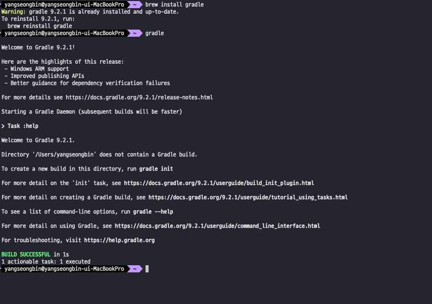

> 해당 블로그 글은 [인프런 강의](https://inf.run/xZG3C)를 바탕으로 쓰여진 글입니다.

## Gradle란 무엇인가?

Gradle란 `자바`나 `스칼라` 프로젝트에서 많이 사용되는 `빌드 자동화 도구`이다. 또한 Gradle은 
`코드 컴파일, 패키징, 테스트 실행 및 퍼블리싱`과 같은 작업을 자동화함으로써 `소프트웨어 구축, 테스트 및 배포 과정`을 단순화한다. 이 외에도 수많은 특징들이 존재한다. 그러면 한번 특징들을 살펴보자.

### 선언적 빌드 스크립트

- Gradle은 `Groovy` 또는 `Kotlin`으로 작성된 빌드 스크립트를 사용하여 빌드 프로세스의 단계를 정의한다. 이러한 스크립트는 소프트웨어 구축 및 배포에 필요한 작업을 지정한다.

- Gradle의 선언적 언어는 작업과 의존성을 쉽게 import가 가능하게 하며, 어떻게 할 것인지보다는 무엇을 달성하고자 하는지에 집중할 수 있게 한다.

- 또한 Gradle은 DSL언어로 작성된다. 대표적인 DSL언어는 위에서 언급한 Groovy나 Kotlin이다.

> ✅ DSL이란?
>
> 빌드 프로세스 및 구성을 설명하기 위해 특별히 맞춤화된 언어

### 선언적 빌드 스크립트: Groovy DSL

``` groovy
plugins {
    id 'java'
    id 'org.springframework.boot' version '3.3.1'
    id 'io.spring.dependency-management' version '1.1.5'
    id 'org.asciidoctor.jvm.convert' version '3.3.2'
}

repositories {
    mavenCentral()
}

dependencies {
    implementation 'org.springframework.boot:spring-boot-starter-data-jpa'
    implementation 'org.springframework.boot:spring-boot-starter-web'
    compileOnly 'org.projectlombok:lombok'
    annotationProcessor 'org.springframework.boot:spring-boot-configuration-processor'
    annotationProcessor 'org.projectlombok:lombok'
    implementation 'com.h2database:h2'
    testImplementation 'org.springframework.boot:spring-boot-starter-test'
    testImplementation 'org.springframework.restdocs:spring-restdocs-mockmvc'
    testImplementation 'org.springframework.security:spring-security-test'
    testRuntimeOnly 'org.junit.platform:junit-platform-launcher'
}
```

- 위의 코드는 Groovy로 작성된 Gradle 파일이다.
- Gradle 빌드 스크립트는 Groovy 구문과 규칙을 사용한다.
- Groovy DSL 스크립트는 `build.gradle`이라는 이름의 파일에 정의된다.
- 구문이 간결하여 읽기 쉬운 형식으로 빌드 구성을 표현하기 쉽다.
  - plugins는 말 그대로 해당 플러그인을 가져다 쓰겠다는 의미이다.
  - repositories는 의존성들을 해당 저장소에서 가져오겠다는 의미인데 여기는 `maven 저장소`에서 가져온다는 의미이다.
  - dependencies는 의존성들을 가져 올 프레임워크 혹은 라이브러리들을 명시하면 된다.

### 선언적 빌드 스크립트: Kotlin DSL

``` kotlin
plugins {
    id("java")
}

repositories {
    mavenCentral()
}

dependencies {
        implementation(Dependencies.Logging.KOTLIN_LOGGING)

        testRuntimeOnly(Dependencies.Test.PLATFORM_LAUNCHER)
        testImplementation(Dependencies.Test.KOTLIN_TEST_JUNIT)
        testImplementation(Dependencies.Test.KOTEST_ASSERTIONS_CORE)
        testImplementation(Dependencies.Test.KOTEST_EXTENSIONS_TEST_CONTAINERS)
}
```

- Gradle은 또한 스크립팅 언어로 `Kotlin`을 사용하는 Kotlin 기반 DSL을 지원한다.
- Kotlin DSL 스크립트는 `build.gradle.kts`라는 이름의 파일에 정의한다.(.kts 확장자는 Kotlin 스크립팅)

### 의존성 관리

- Gradle은 `Maven Central` 혹은 `JCenter`와 같은 저장소와 통합되어 외부 종속성을 지정하고 해당 버전을 관리할 수 있게 한다.
- 자동으로 종속성을 해결하고 로컬에 캐시하여 빌드 성능과 안정성을 향상시킨다. 즉, 기존에 한번 import하면 캐시를 이용해 정말 빠르게 의존성을 가져온다.

### 점진적 빌드

- Gradle은 마지막 빌드 이후 변경된 작업만 실행하여 점진적 빌드를 수행한다.
  - 이는 빌드 프로세스의 속도를 크게 향상시키며, 특히 대규모 프로젝트에서 그 효과를 실감나게 볼 수 있다.
- 작업을 다시 실행해야 하는지 결정하기 위해 체크섬과 타임스탬프를 사용한다.
- 이것을 이용하여 한번 컴파일한 부분은 다시 컴파일 하지 않는다. 물론, 컴파일 한 부분중에 변경사항이 있으면 체크섬과 타입스탬프를 이용해서 다시 컴파일하기는 한다.

### Multiple Project 빌드

- Gradle은 여러 서브프로젝트나 모듈이 있는 복잡한 프로젝트를 처리할 수 있다.

- 각 서브프로젝트는 자체 종속성과 작업을 가질 수 있지만, 단일 빌드 스크립트의 일부로 함께 빌드될 수 있다.

- 이는 대규모 애플리케이션, MSA 또는 모듈식 아키텍처를 가진 모든 소프트웨어에 특히 유용하다.

### 커스텀 및 확장성

- Gradle은 작업을 사용자 정의하고 자체 플러그인을 만들 수 있는 풍부한 API 및 플러그인 시스템을 제공한다.

- Java 코드 컴파일, 테스트 실행, JAR 파일 패키징 등과 같은 일반적인 작업을 위한 플러그인이 제공된다.

- Gradle의 유연성 덕분에 Android 앱부터 웹 애플리케이션까지 다양한 유형의 프로젝트를 지원 가능하다.

### 빌드 스캔

> 빌드 스캔은 빌드에 대한 상세한 인사이트를 제공하는 기능을 한다.

- 빌드 성능, 종속성 및 작업 실행 시간에 대한 정보를 포함하여 빌드 프로세스를 최적화하는 데 도움을 준다.

- 이러한 스캔은 다른 사람들과 공유할 수 있어 팀 환경에서 문제를 진단하기 쉽게 해준다.

### CI/CD

- Gradle은 Jenkins, CircleCI 및 Travis CI와 같은 도구를 사용하여 CI/CD 파이프라인에 쉽게 통합될 수 있다.

- 작업을 헤드리스로 실행할 수 있는 능력은 자동화된 빌드, 테스트 및 배포에 적합하다.

### 설치

설치는 아래의 사이트에 접속해서 설치를 할 수 있다.

> https://gradle.org

필자는 맥 환경이므로 아래의 명령어를 통해 설치를 할 수 있었다.

``` shell
brew install gradle
```

설치 결과는 아래와 같다.



> 잘못된 지식이 있을 경우 댓글로 남겨주시면 빠르게 반영하겠습니다!
