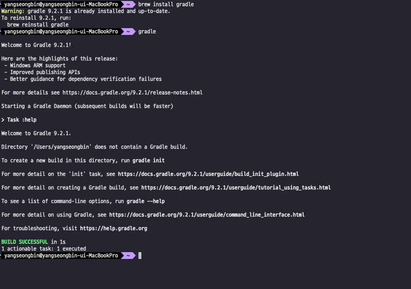

## Gradle이란 무엇인가?

Gradle은 주로 Java 또는 Scala 프로젝트에 사용되는 강력한 빌드 자동화 도구이며, 다양한 언어의 프로젝트도 지원한다. Gradle은 빌드 툴이므로 코드를 컴파일하고, 바이너리를 패키징하고, 테스트를
실행하고, 아티팩트를 게시하는 등의 작업을 자동화하여 소프트웨어 빌드, 테스트 및 배포 프로세스를 단순화한다. Gradle은 기본적으로 실행을 할 때 소스 코드와 테스트 코드를 가져와 app.jar와 같은 실행
파일이나 테스트 커버리지 리포트 등을 생성한다.

### 왜 Gradle인가? (Maven과의 비교)

Gradle이 등장하기 전에는 Maven이 Java 생태계의 대표적인 빌드 도구였다. Maven은 XML 기반의 POM(Project Object Model) 파일을 사용하여 빌드를 정의하는데, 프로젝트 규모가
커질수록 XML이 장황해지고 커스터마이징이 어려워지는 단점이 있다. Gradle은 이러한 한계를 극복하기 위해 설계되었으며, 주요 차이점은 다음과 같다.

| 항목      | Maven              | Gradle                                                 |
|---------|--------------------|--------------------------------------------------------|
| 빌드 스크립트 | XML (`pom.xml`)    | Groovy/Kotlin DSL (`build.gradle`, `build.gradle.kts`) |
| 유연성     | 컨벤션 기반, 커스터마이징 제한적 | 프로그래밍 언어 기반, 높은 유연성                                    |
| 성능      | 증분 빌드 미지원          | 증분 빌드 + 빌드 캐시 + 데몬                                     |
| 의존성 관리  | 잘 갖추어져 있음          | Maven 리포지토리 호환 + 더 세밀한 설정 가능                           |
| 멀티 프로젝트 | 지원하나 설정이 복잡        | 유연하고 간결한 멀티 프로젝트 구성                                    |

Gradle 공식 벤치마크에 따르면 거의 모든 시나리오에서 Maven보다 최소 2배 이상 빠르며, 빌드 캐시를 활용할 경우 최대 100배까지 빠를 수 있다.

### 선언적 빌드 스크립트

Gradle은 빌드 프로세스의 단계를 정의하기 위해 Groovy 또는 Kotlin으로 작성된 빌드 스크립트를 사용한다. 이 스크립트들은 소프트웨어 빌드 및 배포에 필요한 태스크(Tasks)를 명시한다. Gradle의
선언적 언어는 태스크와 의존성을 쉽게 기술할 수 있게 해주어, '어떻게(How)'보다는 '무엇을(What)' 달성하고자 하는지에 집중할 수 있게 한다. 또한, 빌드 프로세스와 구성을 기술하기 위해 특별히 맞춤화된
언어인 DSL(Domain-Specific Language)을 사용한다.

### Groovy DSL

```groovy
plugins {
    id 'java'
    id 'org.springframework.boot' version '3.2.0'
}

group = 'com.example'
version = '0.0.1-SNAPSHOT'

repositories {
    mavenCentral()
}

dependencies {
    implementation 'org.springframework.boot:spring-boot-starter-web'
    testImplementation 'org.springframework.boot:spring-boot-starter-test'
}

test {
    useJUnitPlatform()
}
```

Groovy DSL은 Gradle이 제공하는 원조 DSL로, Groovy 언어로 작성된다. 대부분의 기존 Gradle 빌드 스크립트는 Groovy 문법과 규칙을 따른다. Groovy DSL 스크립트는
`build.gradle`이라는 파일명으로 정의된다. Groovy는 문법이 간결하여 빌드 구성을 읽기 쉬운 형식으로 표현하기 좋다.

### Kotlin DSL

```kotlin
plugins {
    id("java")
    id("org.springframework.boot") version "3.2.0"
}

group = "com.example"
version = "0.0.1-SNAPSHOT"

repositories {
    mavenCentral()
}

dependencies {
    implementation("org.springframework.boot:spring-boot-starter-web")
    testImplementation("org.springframework.boot:spring-boot-starter-test")
}

tasks.test {
    useJUnitPlatform()
}
```

Gradle은 Kotlin을 스크립팅 언어로 사용하는 Kotlin 기반 DSL도 지원한다. Kotlin DSL 스크립트는 `build.gradle.kts`라는 파일명으로 정의된다. Groovy와 유사하지만 문법적으로
차이가 있다.

### Groovy DSL vs Kotlin DSL

| 항목     | Groovy DSL                  | Kotlin DSL           |
|--------|-----------------------------|----------------------|
| 파일명    | `build.gradle`              | `build.gradle.kts`   |
| 문자열    | 작은따옴표(`'...'`) 및 큰따옴표 모두 사용 | 큰따옴표(`"..."`)만 사용    |
| 함수 호출  | 괄호 생략 가능 (`id 'java'`)      | 괄호 필수 (`id("java")`) |
| 타입 안전성 | 동적 타입                       | 정적 타입, 컴파일 타임 검증     |
| IDE 지원 | 자동 완성 제한적                   | 강력한 자동 완성 및 리팩토링 지원  |

최근에는 Kotlin DSL이 공식 권장되는 추세이며, 타입 안전성과 IDE 자동 완성 덕분에 빌드 스크립트의 생산성과 유지보수성이 향상된다.

### 의존성 관리

Gradle은 Maven Central 및 JCenter와 같은 리포지토리와 통합되어 외부 라이브러리(의존성)를 지정하고 버전을 관리할 수 있게 해준다. 이렇게 함으로써 의존성을 자동으로 해결(resolve)하고
로컬에 캐시(cache)하여 빌드 성능과 신뢰성을 향상시킨다.

### 증분 빌드

Gradle은 마지막 빌드 이후 변경된 태스크만 실행하는 '증분 빌드(Incremental Build)'를 수행한다. 이 기능은 특히 대규모 프로젝트에서 빌드 프로세스 속도를 크게 높여준다. 체크섬(
checksums)과 타임스탬프를 사용하여 특정 태스크를 다시 실행해야 하는지 여부를 판단하여, 체크섬이 다르면 실행을 다시 하여 빌드하고 아니면 그대로 둔다.

### 빌드 캐시

증분 빌드와 함께 알아두면 좋은 개념이 빌드 캐시(Build Cache)이다. 증분 빌드가 "마지막 빌드 이후 변경된 태스크만 다시 실행"하는 것이라면, 빌드 캐시는 "과거에 동일한 입력으로 실행된 태스크의 결과물을
저장해두고 재사용"하는 메커니즘이다.

예를 들어, `feature-A` 브랜치에서 작업하다가 `main` 브랜치로 전환한 뒤 다시 `feature-A`로 돌아오는 상황을 생각해보면, 증분 빌드만으로는 변경이 감지되어 태스크를 다시 실행하지만, 빌드
캐시가 있다면 이전에 동일한 입력으로 이미 빌드한 결과를 캐시에서 가져와 빌드 시간을 크게 단축할 수 있다.

빌드 캐시는 로컬 캐시와 리모트 캐시로 나뉘며, 리모트 캐시를 설정하면 팀원 간에 빌드 결과를 공유하여 CI/CD 환경에서도 빌드 속도를 향상시킬 수 있다.

```bash
# 빌드 캐시 활성화
gradle build --build-cache
```

또는 `gradle.properties`에 아래와 같이 설정하여 항상 활성화할 수 있다.

```properties
org.gradle.caching=true
```

### Gradle Daemon

Gradle은 빌드 성능을 위해 데몬(Daemon) 프로세스를 사용한다. Gradle Daemon은 백그라운드에서 상주하는 장수(long-lived) 프로세스로, 빌드가 요청될 때마다 JVM을 새로 기동하지 않고
이미 실행 중인 데몬이 빌드를 처리한다.

JVM 기동 시 클래스 로딩과 JIT 컴파일에 상당한 시간이 소요되는데, 데몬을 활용하면 이 오버헤드를 제거하여 첫 번째 빌드 이후의 빌드 속도가 크게 향상된다. Gradle 3.0부터 데몬은 기본적으로 활성화되어
있다.

### 멀티 프로젝트 빌드

Gradle은 여러 하위 프로젝트(subprojects)나 모듈이 있는 복잡한 프로젝트를 처리할 수 있다. 각 하위 프로젝트는 고유한 의존성과 태스크를 가질 수 있지만, 하나의 단일 빌드 스크립트의 일부로서 함께
빌드될 수 있다. 이는 대규모 애플리케이션, 마이크로서비스 또는 모듈러 아키텍처를 가진 소프트웨어에 특히 유용하다.

### 사용자 정의 및 확장 가능성

Gradle은 풍부한 API와 플러그인 시스템을 제공하여 태스크를 커스터마이징하거나 자신만의 플러그인을 만들 수 있다. Java 코드 컴파일, 테스트 실행, JAR 파일 패키징 등 일반적인 작업을 위한 플러그인들이
이미 제공된다. Gradle의 유연성 덕분에 안드로이드 앱부터 웹 애플리케이션까지 광범위한 프로젝트 유형을 지원할 수 있다.

### 빌드 스캔

빌드 스캔은 빌드에 대한 상세한 인사이트를 제공하는 기능이다. 빌드 성능, 의존성, 태스크 실행 시간 등에 대한 정보를 포함하여 빌드 프로세스를 최적화하는 데 도움을 준다. 이 스캔 결과는 다른 사람과 공유할 수
있어, 팀 환경에서 문제를 진단하기가 더 쉬워진다.

### 지속적 통합 및 배포 (CI/CD)

Gradle은 Jenkins, CircleCI, Travis CI와 같은 도구를 사용하여 CI/CD 파이프라인에 쉽게 통합될 수 있다. 헤드리스(headless, GUI 없이) 방식으로 태스크를 실행할 수 있는 능력
덕분에 자동화된 빌드, 테스트 및 배포에 매우 적합하다.

### 설치

설치는 매우 간단하다. 맥 기준으로 아래와 같이 homebrew를 이용하면 쉽다.

```bash
brew install gradle
```



### Gradle Wrapper

실무에서는 `brew install gradle`로 시스템에 직접 설치하기보다 Gradle Wrapper를 사용하는 것이 권장된다. Gradle Wrapper는 프로젝트에 포함되는 스크립트(`gradlew`,
`gradlew.bat`)와 설정 파일로, 프로젝트에서 사용할 Gradle 버전을 고정하고 자동으로 다운로드해준다.

Wrapper를 사용하면 팀원 모두가 동일한 Gradle 버전으로 빌드하게 되어 "내 환경에서는 되는데?"와 같은 문제를 방지할 수 있고, CI/CD 서버에 별도로 Gradle을 설치할 필요가 없다.

```bash
# Wrapper 생성
gradle wrapper --gradle-version 8.5

# Wrapper를 통한 빌드 (시스템에 Gradle이 설치되어 있지 않아도 동작)
./gradlew build
```

Wrapper를 실행하면 프로젝트 루트에 다음과 같은 파일들이 생성된다.

```
├── gradle
│   └── wrapper
│       ├── gradle-wrapper.jar
│       └── gradle-wrapper.properties
├── gradlew
└── gradlew.bat
```

`gradle-wrapper.properties` 파일에서 Gradle 버전을 확인하고 변경할 수 있다. 이 파일들은 버전 관리 시스템(Git 등)에 함께 커밋하여 팀 전체가 동일한 환경에서 빌드할 수 있도록 한다.