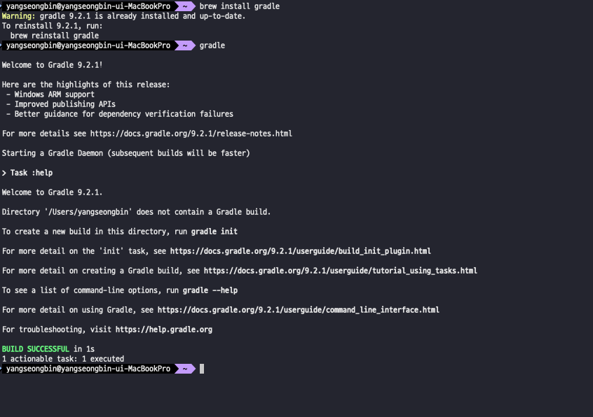

## Gradle이란 무엇인가?

Gradle은 주로 Java 또는 Scala 프로젝트에 사용되는 강력한 빌드 자동화 도구이며, 다양한 언어의 프로젝트도 지원한다. Gradle은 빌드 툴이므로 코드를 컴파일하고, 바이너리를 패키징하고, 테스트를
실행하고, 아티팩트를 게시하는 등의 작업을 자동화하여 소프트웨어 빌드, 테스트 및 배포 프로세스를 단순화한다. Gradle은 기본적으로 실행을 할 때 소스 코드와 테스트 코드를 가져와 app.jar와 같은 실행
파일이나 테스트 커버리지 리포트 등을 생성한다.

### 빌드 툴이 필요한 이유

빌드 툴 없이 Java 프로젝트를 배포하려면 어떤 일이 벌어지는지 생각해보자. 소스 파일을 일일이 `javac`로 컴파일하고, 필요한 라이브러리 JAR을 직접 내려받아 클래스패스에 넣고, 컴파일된 클래스를
`jar` 명령으로 묶고, 테스트를 수동으로 실행해야 한다. 파일이 몇 개일 때는 그럭저럭 되지만, 소스가 수백 개가 되고 라이브러리가 서로 다른 버전을 요구하기 시작하면 사람이 감당할 수 있는 수준을 벗어난다.

```bash
# 빌드 툴이 없다면...
javac -cp "libs/spring-core.jar:libs/jackson.jar:..." -d build/classes $(find src -name "*.java")
jar cf app.jar -C build/classes .
java -cp "app.jar:libs/*" com.example.Main
```

빌드 툴은 이 반복 작업을 하나의 명령으로 압축한다. Gradle이 자동화해주는 작업은 크게 다음과 같다.

- **컴파일 (Compile)**: 소스 코드를 바이트코드로 변환
- **의존성 해결 (Dependency Resolution)**: 필요한 외부 라이브러리와 그 라이브러리가 다시 필요로 하는 라이브러리까지 자동으로 내려받기
- **테스트 (Test)**: 단위 테스트 실행 및 리포트 생성
- **패키징 (Package)**: JAR, WAR, 실행 가능한 배포본 생성
- **검증 (Verify)**: 정적 분석, 코드 커버리지 등 품질 게이트 실행
- **배포 (Publish)**: 아티팩트를 사내 저장소나 Maven Central에 게시

또한 Gradle은 Java와 Scala뿐 아니라 Kotlin, Groovy, Android, C/C++, JavaScript까지 폭넓은 생태계를 지원한다. 안드로이드 앱의 공식 빌드 시스템이 Gradle이라는 점만
봐도 그 적용 범위를 짐작할 수 있다.

### 빌드 툴의 계보: Ant → Maven → Gradle

Java 진영의 빌드 툴은 크게 세 세대를 거쳤다.

**Ant (2000)** 는 최초의 본격적인 Java 빌드 툴로, XML로 "무엇을 어떤 순서로 실행할지"를 직접 기술했다. 자유도는 높았지만 컨벤션이 없어 프로젝트마다 빌드 스크립트가 제각각이었고, 의존성 관리
기능도 없어 JAR 파일을 직접 저장소에 커밋해야 했다.

**Maven (2004)** 은 "설정보다 관습 (Convention over Configuration)"을 내세워 표준 디렉토리 구조와 정해진 빌드 라이프사이클을 도입했고, 중앙 저장소 (Maven
Central) 기반의 의존성 관리를 정착시켰다. 덕분에 프로젝트 간 일관성은 크게 좋아졌지만, 정해진 틀을 벗어나는 작업을 하려면 플러그인을 직접 만들어야 하는 경직성이 남았다.

**Gradle (2008)** 은 Maven의 컨벤션과 의존성 관리 모델은 그대로 가져오면서, 빌드 스크립트를 XML이 아닌 실제 프로그래밍 언어 (Groovy/Kotlin) 로 작성하게 만들었다. 조건문과
반복문, 함수를 그대로 쓸 수 있으니 Maven에서 플러그인을 만들어야 했던 커스터마이징을 스크립트 몇 줄로 해결할 수 있다.

### 왜 Gradle인가? (Maven과의 비교)

Gradle이 등장하기 전에는 Maven이 Java 생태계의 대표적인 빌드 도구였다. Maven은 XML 기반의 POM (Project Object Model) 파일을 사용하여 빌드를 정의하는데, 프로젝트 규모가
커질수록 XML이 장황해지고 커스터마이징이 어려워지는 단점이 있다. Gradle은 이러한 한계를 극복하기 위해 설계되었으며, 주요 차이점은 다음과 같다.

| 항목          | Maven                            | Gradle                                                 |
|---------------|----------------------------------|--------------------------------------------------------|
| 빌드 스크립트 | XML (`pom.xml`)                  | Groovy/Kotlin DSL (`build.gradle`, `build.gradle.kts`) |
| 유연성        | 컨벤션 기반, 커스터마이징 제한적 | 프로그래밍 언어 기반, 높은 유연성                      |
| 성능          | 증분 빌드 미지원                 | 증분 빌드 + 빌드 캐시 + 데몬                           |
| 의존성 관리   | 잘 갖추어져 있음                 | Maven 리포지토리 호환 + 더 세밀한 설정 가능            |
| 멀티 프로젝트 | 지원하나 설정이 복잡             | 유연하고 간결한 멀티 프로젝트 구성                     |

Gradle 공식 벤치마크에 따르면 거의 모든 시나리오에서 Maven보다 최소 2배 이상 빠르며, 빌드 캐시를 활용할 경우 최대 100배까지 빠를 수 있다.

### 선언적 빌드 스크립트

Gradle은 빌드 프로세스의 단계를 정의하기 위해 Groovy 또는 Kotlin으로 작성된 빌드 스크립트를 사용한다. 이 스크립트들은 소프트웨어 빌드 및 배포에 필요한 태스크 (Tasks)를 명시한다.
Gradle의 선언적 언어는 태스크와 의존성을 쉽게 기술할 수 있게 해주어, '어떻게 (How)'보다는 '무엇을 (What)' 달성하고자 하는지에 집중할 수 있게 한다. 또한, 빌드 프로세스와 구성을 기술하기 위해
특별히 맞춤화된 언어인 DSL (Domain-Specific Language)을 사용한다.

### Groovy DSL

```groovy
plugins {
    id 'java'
    id 'org.springframework.boot' version '3.2.0'
}

group = 'com.example'
version = '0.0.1-SNAPSHOT'

repositories {
    mavenCentral()
}

dependencies {
    implementation 'org.springframework.boot:spring-boot-starter-web'
    testImplementation 'org.springframework.boot:spring-boot-starter-test'
}

test {
    useJUnitPlatform()
}
```

Groovy DSL은 Gradle이 제공하는 원조 DSL로, Groovy 언어로 작성된다. 대부분의 기존 Gradle 빌드 스크립트는 Groovy 문법과 규칙을 따른다. Groovy DSL 스크립트는
`build.gradle`이라는 파일명으로 정의된다. Groovy는 문법이 간결하여 빌드 구성을 읽기 쉬운 형식으로 표현하기 좋다.

### Kotlin DSL

```kotlin
plugins {
    id("java")
    id("org.springframework.boot") version "3.2.0"
}

group = "com.example"
version = "0.0.1-SNAPSHOT"

repositories {
    mavenCentral()
}

dependencies {
    implementation("org.springframework.boot:spring-boot-starter-web")
    testImplementation("org.springframework.boot:spring-boot-starter-test")
}

tasks.test {
    useJUnitPlatform()
}
```

Gradle은 Kotlin을 스크립팅 언어로 사용하는 Kotlin 기반 DSL도 지원한다. Kotlin DSL 스크립트는 `build.gradle.kts`라는 파일명으로 정의된다. Groovy와 유사하지만 문법적으로
차이가 있다.

### Groovy DSL vs Kotlin DSL

| 항목        | Groovy DSL                                | Kotlin DSL                        |
|-------------|-------------------------------------------|-----------------------------------|
| 파일명      | `build.gradle`                            | `build.gradle.kts`                |
| 문자열      | 작은따옴표(`'...'`) 및 큰따옴표 모두 사용 | 큰따옴표(`"..."`)만 사용          |
| 함수 호출   | 괄호 생략 가능 (`id 'java'`)              | 괄호 필수 (`id("java")`)          |
| 타입 안전성 | 동적 타입                                 | 정적 타입, 컴파일 타임 검증       |
| IDE 지원    | 자동 완성 제한적                          | 강력한 자동 완성 및 리팩토링 지원 |

최근에는 Kotlin DSL이 공식 권장되는 추세이며, 타입 안전성과 IDE 자동 완성 덕분에 빌드 스크립트의 생산성과 유지보수성이 향상된다.

### 의존성 관리

Gradle은 Maven Central과 같은 리포지토리와 통합되어 외부 라이브러리 (의존성)를 지정하고 버전을 관리할 수 있게 해준다. 이렇게 함으로써 의존성을 자동으로 해결 (resolve)하고 로컬에 캐시
(cache)하여 빌드 성능과 신뢰성을 향상시킨다.

```groovy
repositories {
    mavenCentral()
}
 
dependencies {
    implementation 'com.fasterxml.jackson.core:jackson-databind:2.17.0'
}
```

여기서 중요한 것이 **전이적 의존성 (Transitive Dependency)** 이다. 위 예제에서 `jackson-databind` 하나만 선언했지만, 이 라이브러리가 내부적으로 의존하는
`jackson-core`와 `jackson-annotations`까지 Gradle이 알아서 함께 내려받는다. 즉, 개발자는 직접 사용하는 라이브러리만 선언하면 되고 그 아래 딸려오는 것들은 Gradle이 의존성
그래프를 따라가며 해결한다.

한 번 내려받은 라이브러리는 `~/.gradle/caches/modules-2` 아래에 캐시되어 여러 프로젝트가 공유한다. 그래서 같은 라이브러리를 쓰는 새 프로젝트를 빌드할 때는 네트워크를 다시 타지 않는다.

> 오래된 자료에는 `jcenter()`를 저장소로 지정하는 예제가 자주 등장하는데, JCenter는 2021년 신규 패키지 업로드가 중단된 뒤 서비스 종료 수순을 밟았다. 지금은 `mavenCentral()`을
> 사용하는 것이 표준이다.

### 증분 빌드

Gradle은 마지막 빌드 이후 변경된 태스크만 실행하는 '증분 빌드 (Incremental Build)'를 수행한다. 이 기능은 특히 대규모 프로젝트에서 빌드 프로세스 속도를 크게 높여준다. 체크섬
(checksums)과 타임스탬프를 사용하여 특정 태스크를 다시 실행해야 하는지 여부를 판단하여, 체크섬이 다르면 실행을 다시 하여 빌드하고 아니면 그대로 둔다.

### 빌드 캐시

증분 빌드와 함께 알아두면 좋은 개념이 빌드 캐시 (Build Cache)이다. 증분 빌드가 "마지막 빌드 이후 변경된 태스크만 다시 실행"하는 것이라면, 빌드 캐시는 "과거에 동일한 입력으로 실행된 태스크의
결과물을 저장해두고 재사용"하는 메커니즘이다.

예를 들어, `feature-A` 브랜치에서 작업하다가 `main` 브랜치로 전환한 뒤 다시 `feature-A`로 돌아오는 상황을 생각해보면, 증분 빌드만으로는 변경이 감지되어 태스크를 다시 실행하지만, 빌드
캐시가 있다면 이전에 동일한 입력으로 이미 빌드한 결과를 캐시에서 가져와 빌드 시간을 크게 단축할 수 있다.

빌드 캐시는 로컬 캐시와 리모트 캐시로 나뉘며, 리모트 캐시를 설정하면 팀원 간에 빌드 결과를 공유하여 CI/CD 환경에서도 빌드 속도를 향상시킬 수 있다.

```bash
# 빌드 캐시 활성화
gradle build --build-cache
```

또는 `gradle.properties`에 아래와 같이 설정하여 항상 활성화할 수 있다.

```properties
org.gradle.caching=true
```

### Configuration Cache

증분 빌드와 빌드 캐시가 **실행 (Execution) 단계**를 최적화하는 기능이라면, Configuration Cache는 그 앞 단계인 **설정 (Configuration) 단계**를 최적화한다.

Gradle은 태스크를 실행하기 전에 모든 빌드 스크립트를 평가해서 어떤 태스크가 있고 서로 어떤 순서로 실행되어야 하는지 (태스크 그래프) 를 계산한다. 멀티 모듈 프로젝트에서는 이 설정 단계만으로도 수 초가
걸리는데, 빌드 스크립트가 바뀌지 않았다면 매번 같은 결과를 다시 계산하는 셈이다. Configuration Cache는 이 태스크 그래프 계산 결과를 저장해두고 재사용하여 설정 단계를 통째로 건너뛴다.

```bash
# 단발성으로 활성화
./gradlew build --configuration-cache
```

```properties
# gradle.properties에서 항상 활성화
org.gradle.configuration-cache=true
```

활성화한 뒤 처음 빌드하면 `Configuration cache entry stored.`가, 이후 빌드에서는 `Configuration cache entry reused.`가 출력된다.

| 기능                | 최적화 대상   | 재사용하는 것                           |
|---------------------|---------------|-----------------------------------------|
| 증분 빌드           | Execution     | 입력이 바뀌지 않은 태스크의 출력물      |
| 빌드 캐시           | Execution     | 과거에 동일 입력으로 만든 태스크 결과물 |
| Configuration Cache | Configuration | 빌드 스크립트 평가 결과 (태스크 그래프) |

Configuration Cache는 Gradle 8.1에서 정식 (stable) 기능이 되었으며, 대규모 멀티 모듈 프로젝트일수록 체감 효과가 크다. 다만 빌드 스크립트가 설정 단계에서 시스템 환경이나 외부 상태에
직접 접근하면 캐싱이 불가능하다는 제약이 있어, 플러그인 호환성 확인이 필요하다.

### Gradle Daemon

Gradle은 빌드 성능을 위해 데몬 (Daemon) 프로세스를 사용한다. Gradle Daemon은 백그라운드에서 상주하는 장수 (long-lived) 프로세스로, 빌드가 요청될 때마다 JVM을 새로 기동하지 않고
이미 실행 중인 데몬이 빌드를 처리한다.

JVM 기동 시 클래스 로딩과 JIT 컴파일에 상당한 시간이 소요되는데, 데몬을 활용하면 이 오버헤드를 제거하여 첫 번째 빌드 이후의 빌드 속도가 크게 향상된다. Gradle 3.0부터 데몬은 기본적으로 활성화되어
있다.

### 멀티 프로젝트 빌드

Gradle은 여러 하위 프로젝트 (subprojects)나 모듈이 있는 복잡한 프로젝트를 처리할 수 있다. 각 하위 프로젝트는 고유한 의존성과 태스크를 가질 수 있지만, 하나의 단일 빌드 스크립트의 일부로서 함께
빌드될 수 있다. 이는 대규모 애플리케이션, 마이크로서비스 또는 모듈러 아키텍처를 가진 소프트웨어에 특히 유용하다.

### 사용자 정의 및 확장 가능성

Gradle은 풍부한 API와 플러그인 시스템을 제공하여 태스크를 커스터마이징하거나 자신만의 플러그인을 만들 수 있다. Java 코드 컴파일, 테스트 실행, JAR 파일 패키징 등 일반적인 작업을 위한 플러그인들이
이미 제공된다. Gradle의 유연성 덕분에 안드로이드 앱부터 웹 애플리케이션까지 광범위한 프로젝트 유형을 지원할 수 있다.

### 빌드 스캔

빌드 스캔은 빌드에 대한 상세한 인사이트를 제공하는 기능이다. 빌드 성능, 의존성, 태스크 실행 시간 등에 대한 정보를 포함하여 빌드 프로세스를 최적화하는 데 도움을 준다. 이 스캔 결과는 다른 사람과 공유할 수
있어, 팀 환경에서 문제를 진단하기가 더 쉬워진다.

사용법은 간단해서, 빌드 명령에 `--scan` 옵션만 붙이면 된다.

```bash
./gradlew build --scan
```

```
BUILD SUCCESSFUL in 12s
 
Publishing build scan...
https://gradle.com/s/xxxxxxxxxxxxx
```

출력된 URL을 열면 어떤 태스크가 얼마나 걸렸는지, 어떤 태스크가 캐시에서 재사용되었는지, 의존성 트리는 어떻게 구성되는지를 웹에서 확인할 수 있다. "내 로컬에서는 빌드가 되는데 CI에서만 실패한다"와 같은
문제를 추적할 때 특히 유용하다.

### 지속적 통합 및 배포 (CI/CD)

Gradle은 Jenkins, CircleCI, Travis CI와 같은 도구를 사용하여 CI/CD 파이프라인에 쉽게 통합될 수 있다. 헤드리스 (headless, GUI 없이) 방식으로 태스크를 실행할 수 있는
능력 덕분에 자동화된 빌드, 테스트 및 배포에 매우 적합하다.

### 설치

Gradle은 JVM 위에서 동작하므로 **JDK가 먼저 설치되어 있어야 한다.** 최신 Gradle (9.x) 은 JDK 17 이상을 요구하므로, 설치 전에 자바 버전부터 확인하자.

```bash
java -version
```

```
openjdk version "17.0.6" 2023-01-17
OpenJDK Runtime Environment Temurin-17.0.6+10 (build 17.0.6+10)
OpenJDK 64-Bit Server VM Temurin-17.0.6+10 (build 17.0.6+10, mixed mode)
```

JDK가 준비되었다면 설치는 매우 간단하다. 맥 기준으로 아래와 같이 homebrew를 이용하면 쉽다.

```bash
brew install gradle
```



여러 버전의 Gradle을 오가며 테스트해야 한다면 SDKMAN!을 쓰는 것도 좋은 선택이다.

```bash
sdk install gradle
```

설치가 끝나면 `gradle -v`로 확인한다.

```bash
gradle -v
```

```
------------------------------------------------------------
Gradle 9.0.0
------------------------------------------------------------
 
Build time:    2025-07-17 12:48:00 UTC
Revision:      2db9560bb68c367a265b10516c856c840f9bed8d
 
Kotlin:        2.2.0
Groovy:        4.0.28
Ant:           Apache Ant(TM) version 1.10.15
Launcher JVM:  17.0.11 (Amazon.com Inc. 17.0.11+9-LTS)
OS:            Mac OS X 14.7.4 aarch64
```

출력에서 Gradle 자체 버전뿐 아니라 내장된 Kotlin/Groovy 버전과 실행에 사용된 JVM까지 함께 보여준다는 점을 기억해두자. 빌드 스크립트에서 사용할 수 있는 Kotlin 문법은 시스템에 설치된
Kotlin이 아니라 여기 표시된 **Gradle 내장 Kotlin 버전**을 따른다.

### Gradle Wrapper

실무에서는 `brew install gradle`로 시스템에 직접 설치하기보다 Gradle Wrapper를 사용하는 것이 권장된다. Gradle Wrapper는 프로젝트에 포함되는 스크립트 (`gradlew`,
`gradlew.bat`)와 설정 파일로, 프로젝트에서 사용할 Gradle 버전을 고정하고 자동으로 다운로드해준다.

Wrapper를 사용하면 팀원 모두가 동일한 Gradle 버전으로 빌드하게 되어 "내 환경에서는 되는데?"와 같은 문제를 방지할 수 있고, CI/CD 서버에 별도로 Gradle을 설치할 필요가 없다.

```bash
# Wrapper 생성
gradle wrapper --gradle-version 8.5

# Wrapper를 통한 빌드 (시스템에 Gradle이 설치되어 있지 않아도 동작)
./gradlew build
```

Wrapper를 실행하면 프로젝트 루트에 다음과 같은 파일들이 생성된다.

```
├── gradle
│   └── wrapper
│       ├── gradle-wrapper.jar
│       └── gradle-wrapper.properties
├── gradlew
└── gradlew.bat
```

`gradle-wrapper.properties` 파일에서 Gradle 버전을 확인하고 변경할 수 있다.

```properties
distributionBase=GRADLE_USER_HOME
distributionPath=wrapper/dists
distributionUrl=https\://services.gradle.org/distributions/gradle-8.5-bin.zip
zipStoreBase=GRADLE_USER_HOME
zipStorePath=wrapper/dists
```

핵심은 `distributionUrl`이다. `./gradlew`를 실행하면 이 URL의 배포본이 로컬에 있는지 확인하고, 없으면 자동으로 내려받은 뒤 그 버전으로 빌드를 수행한다. 그래서 팀원이 Gradle을 아예
설치하지 않았더라도 `./gradlew build` 한 줄이면 동일한 버전으로 빌드가 된다.

버전을 올릴 때는 이 파일을 직접 수정하기보다 `wrapper` 태스크를 쓰는 것이 안전하다. 스크립트 파일까지 함께 갱신해주기 때문이다.

```bash
./gradlew wrapper --gradle-version 9.0.0
```

이 파일들은 `gradle-wrapper.jar`를 포함하여 **모두 버전 관리 시스템 (Git 등)에 커밋해야 한다.** JAR 파일이라 실수로 `.gitignore`에 걸리는 경우가 있는데, 이 파일이 없으면
Wrapper가 동작하지 않는다.

### Gradle 프로젝트의 표준 구조

지금까지 나온 파일들을 종합하면 Gradle 프로젝트의 전형적인 구조는 다음과 같다.

```
gradle-project
├── .gradle                     # Gradle이 사용하는 내부 캐시 (커밋 대상 아님)
├── build                       # 빌드 산출물 (커밋 대상 아님)
├── gradle
│   └── wrapper                 # Wrapper JAR 및 설정
├── gradle.properties           # 빌드 환경 설정 (JVM 옵션, 캐시 활성화 등)
├── gradlew                     # Wrapper 실행 스크립트 (Unix)
├── gradlew.bat                 # Wrapper 실행 스크립트 (Windows)
├── settings.gradle             # 빌드에 포함할 프로젝트 정의
├── subproject-one
│   └── build.gradle            # 하위 프로젝트별 빌드 스크립트
└── subproject-two
    └── build.gradle
```

여기서 역할이 헷갈리기 쉬운 세 파일을 구분해두면 이후 학습이 수월하다.

| 파일                | 역할                                                                    |
|---------------------|-------------------------------------------------------------------------|
| `settings.gradle`   | 빌드에 **어떤 프로젝트가 포함되는지** 정의 (루트 프로젝트명, 하위 모듈) |
| `build.gradle`      | 프로젝트를 **어떻게 빌드할지** 정의 (플러그인, 의존성, 태스크)          |
| `gradle.properties` | 빌드가 **어떤 환경에서 실행될지** 정의 (JVM 메모리, 캐시, 병렬 빌드)    |

`gradle.properties`에는 앞에서 다룬 성능 옵션들을 모아둘 수 있다.

```properties
org.gradle.parallel=true
org.gradle.caching=true
org.gradle.configuration-cache=true
org.gradle.jvmargs=-Xmx2g -Dfile.encoding=UTF-8
```

### 정리

Gradle은 단순히 "코드를 컴파일해주는 도구"가 아니라, 의존성 해결부터 테스트, 패키징, 배포까지 소프트웨어 개발의 전 과정을 자동화하는 빌드 자동화 플랫폼이다. XML 대신 Groovy/Kotlin DSL을
사용하여 선언적이면서도 유연한 빌드 스크립트를 작성할 수 있고, 증분 빌드와 빌드 캐시, Configuration Cache, 데몬을 통해 빌드 속도를 끌어올린다.

다음 글에서는 `gradle init` 명령어로 실제 프로젝트를 생성해보면서 태스크를 직접 정의하고 실행해볼 예정이다.