> 해당 블로그 글은 [인프런 강의](https://inf.run/xZG3C)를 바탕으로 쓰여진 글입니다.

## 첫번째 프로젝트 만들어보기

gradle 프로젝트를 시작해보려고 한다. 지난시간에 gradle 설치까지 진행했었다. 그럼 터미널에 gradle이 잘 설치가 되었는지 아래와 같이 명령어를 쳐보자.

``` bash
gradle
```

정상적으로 설치가 되었다면 아래와 같이 나올 것이다.

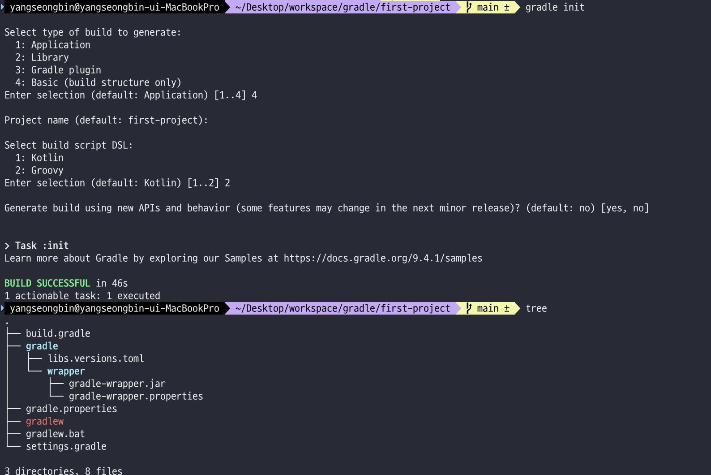

### 생성

그러면 이제 gradle 프로젝트를 만들어보자. 아래와 같이 명령어를 쳐서 gradle 프로젝트를 만들어보자. 캡쳐한 이미지처럼 옵션도 선택하면 될 것 같다.

``` bash
gradle init
```

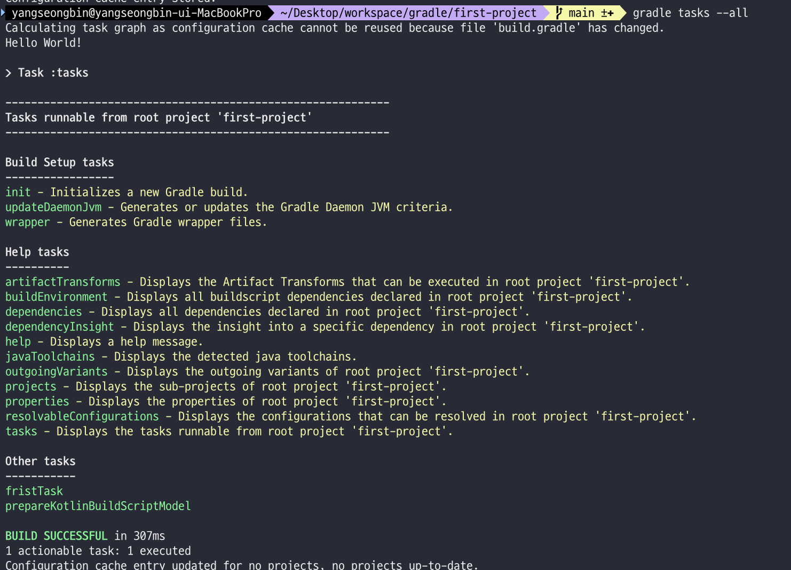

옵션은 진짜 읽어만 봐도 어떤 의미인지 알 수 있을테니 따로 설명은 생략한다.

그러면 생성된 프로젝트가 잘 되었는지 구조를 아래의 명령어를 통해 확인해보자.

``` bash
tree
```

그러면 아래와 같이 잘 생성된 것을 볼 수 있다.

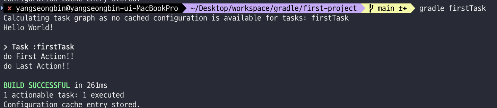

> ⚠️ 주의
>
> tree는 리눅스의 기본 명령어가 아니다. 따로 설치를 해줘야 한다.
>
> 필자는 `brew install tree`를 통하여 설치를 진행하였다.

그러면 IDE를 통해 정말 잘 설치가 되었는지 확인해보자. 필자는 인텔리제이가 익숙하므로 인텔리제이를 이용하겠다. 인텔리제이가 처음이라면 친숙한 IDE를 이용하거나 [필자가 작성한 인텔리제이 글](https://sungbin.kr/IntelliJ-소개/)을 참조 바란다.

잠깐, IDE로 구조를 살펴보기 전에 각각의 파일이 뭐하는 놈들인지는 알아야 할 것 같다. 뭐하는 놈들인지 확인 후 IDE로 살펴보자.

### 생성된 디렉토리 및 파일이 뭐하는 놈인데?

- wrapper: `gradle init`할 때 그 상태의 버전 정보를 담아서 넣어준다. 특히 `gradle-wrapper.properties`에 설치한 gradle 정보가 있디.

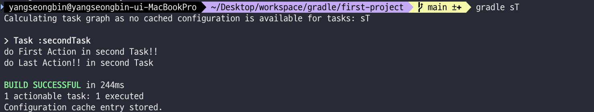

- gradlew: 일종의 bash 스크립트이다. 뭔가 알 수 없는 것들이 들어가져 있는데 대략적으로 말하자면 우리가 `build.gradle`에 작성한 코드를 실행시켜주는 놈이라고 생각하자.
- gradlew.bat: gradlew의 윈도우 버전
- settings.gradle: 프로젝트 네임이 존재한다. root project를 세팅해주는 역할을 하는 것 같다.


- build.gradle: 여기다가 우리가 원하는 코드들을 작성해주면 된다. 처음에는 아래처럼 공란이고 주석만 존재한다.

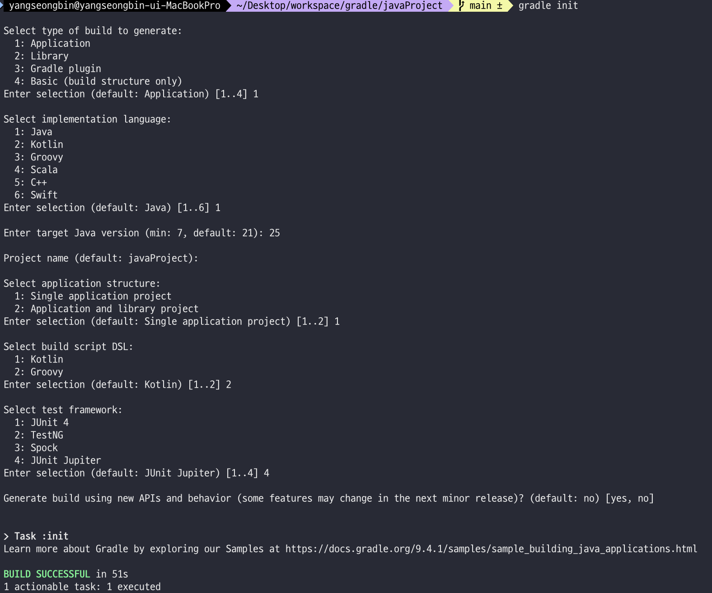

### 실행

그러면 현재 상태에서 한번 gradle 프로젝트를 실행해보자. 실행하는 명령어는 아래와 같다.

``` bash
gradle tasks --all
```

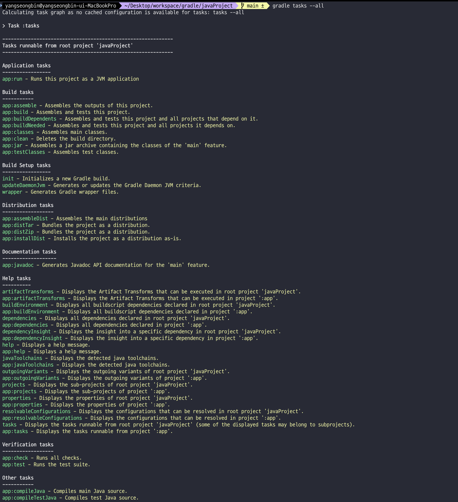

뭔가 각종 어떤 명령어를 쓸 수 있는지 tasks들로 나온다. 영어를 잘 읽어보면 대략적으로 뭐하는 것들인지는 눈치를 깔 수 있다.

그러면 아래와 같이 `build.gradle`에 작성해보자.

``` groovy
tasks.register('firstTask') {
    println "Hello World!"
    doFirst {
        println "First action"
    }

    doLast {
        println "Last action"
    }
}

tasks.register('secondTask') {
    doFirst {
        println "First action in secondTask"
    }

    doLast {
        println "Last action in secondTask"
    }
}
```

그리고 아까 배웠던 `gradle tasks --all`을 실행하면 아래와 같이 나온다.

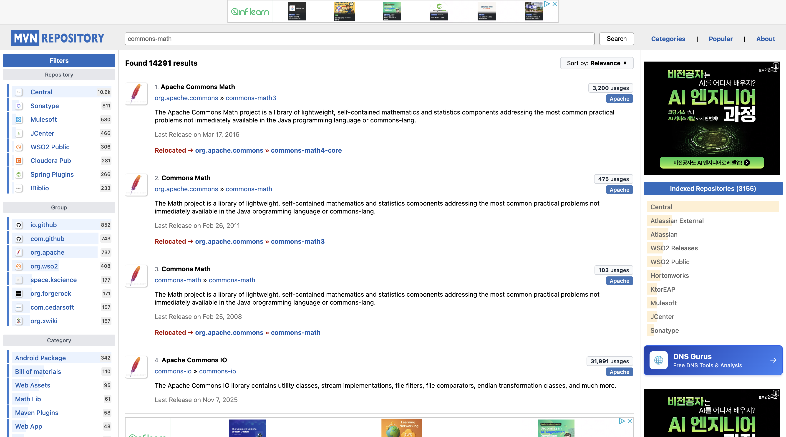

그럼 코드를 설명해보자. 우리가 명령을 선언을 해야 gradle이 동작을 할 것이다. 명령어 등록하는 함수같은 표현은 `tasks.register('명령어 이름')`으로 선언을 하면 된다. 또한 출력은 `println`으로 출력할 수 있다.

`doFirst`는 task를 실행할때 가장 먼저 실행하는 부분이고 `doLast`는 가장 나중에 실행하는 부분이다. 그러면 한번 각각의 task 실행 결과를 보자.

task 실행하는 명령어는 아래와 같다.

``` bash
gradle 태스크 이름
```

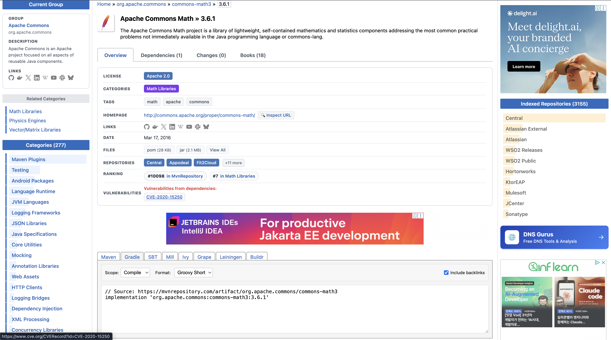

아래와 같이 첫글자를 따서 단축어도 적용이 된다. 또한 gradle로 안 하고 gradlew를 이용해서 실행을 해도 무방하다. 아직까지는 별 차이를 못느끼겠다.

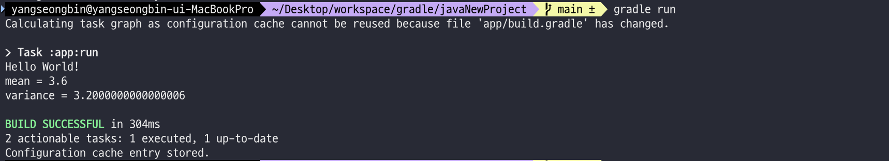

> ✅ 참고
>
> 참고로 gradle 문법이 강의와 다르다. 이유를 보니 특정 gradle 버전부터는 SonarQube 플러그인이 이렇게 바꾸라고 경고를 띄워준다. 변경된 문법에 익숙할 필요가 있을 것 같다.

## Java 프로젝트 만들어보기

그럼 이제 자바 프로젝트를 만들어보자. 물론 쉽게 IDE의 도움을 받아서 만들 수 있을 것 같다. 하지만 어떤 환경에 처할 지 모르니 해당 방법도 잘 알아두자.

### 생성

아까와 같이 `gradle init`을 해두고 아래의 옵션처럼 진행하면 자바 프로젝트가 만들어진다.

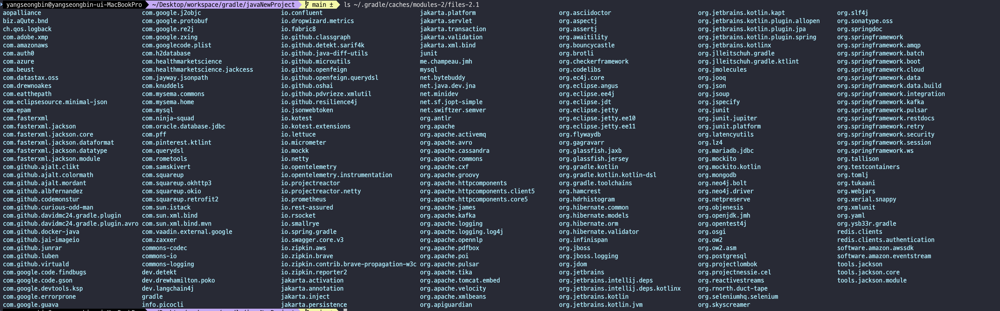

### 디렉토리 구조

`tree` 명령어를 이용하면 아래와 같이 나온다. 구조를 보면 달라진 것은 app 디렉토리가 생겨난 것을 볼 수 있고 그 안에 샘플 자바 파일과 테스트 코드, build.gradle이 있는 것을 볼 수 있다.

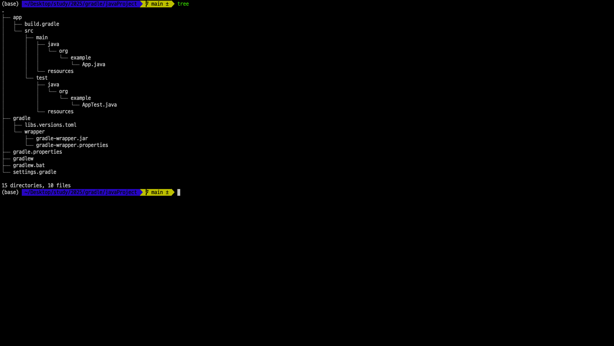

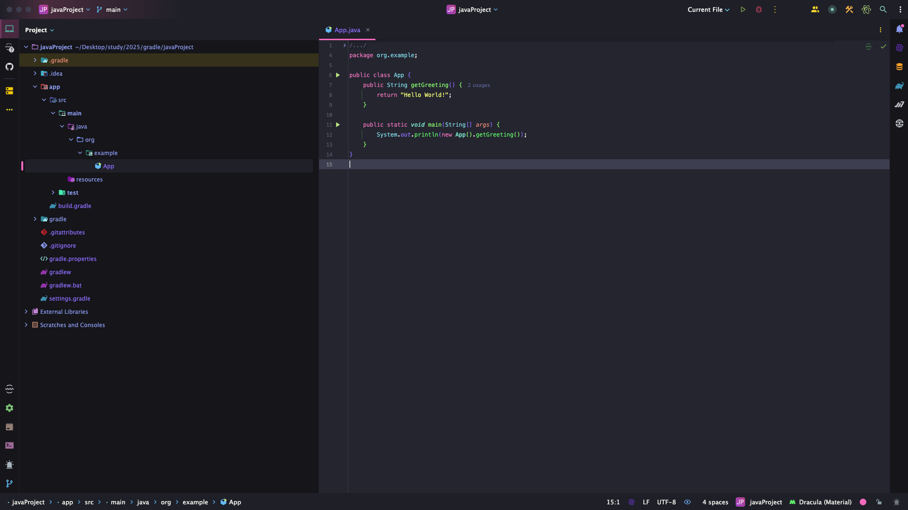

그러면 `settings.gradle` 파일을 살펴보자. 살펴보면 아래와 같다.

``` groovy
/*
 * This file was generated by the Gradle 'init' task.
 *
 * The settings file is used to specify which projects to include in your build.
 * For more detailed information on multi-project builds, please refer to https://docs.gradle.org/8.13/userguide/multi_project_builds.html in the Gradle documentation.
 */

plugins {
    // Apply the foojay-resolver plugin to allow automatic download of JDKs
    id 'org.gradle.toolchains.foojay-resolver-convention' version '0.9.0'
}

rootProject.name = 'javaProject'
include('app')
```

코드를 분석해보면 `plugins`는 말 그대로 플러그인을 말하며 그 안의 `id`는 플러그인의 id를 말한다. 또한 `include`는 해당 디렉토리를 포함시킨다라고 생각하면 될 것 같다. 여기서는 새롭게 생긴 app 디렉토리를 포함시키는 것 같다.

### 다양한 task 확인

이제 아까 배운 `gradle tasks --all`을 입력해보자. 그럼 아래처럼 갑자기 수많은 task가 생긴 것을 볼 수 있다.

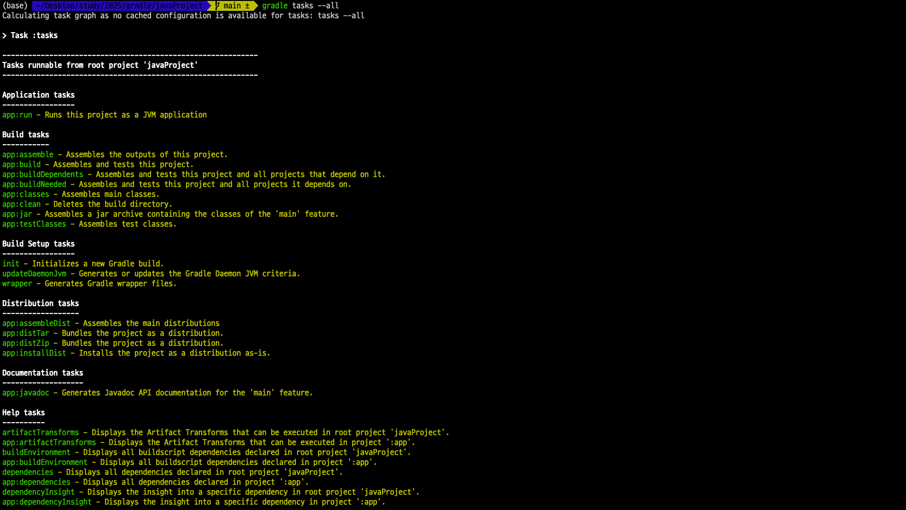

이렇게 갑자기 많은 tasks가 생긴 이유는 바로 build.gradle의 plugins로 application을 이용하기 때문이다. app 디렉토리 안에 있는 build.gradle을 확인해보자.

``` groovy
/*
 * This file was generated by the Gradle 'init' task.
 *
 * This generated file contains a sample Java application project to get you started.
 * For more details on building Java & JVM projects, please refer to https://docs.gradle.org/8.13/userguide/building_java_projects.html in the Gradle documentation.
 */

plugins {
    // Apply the application plugin to add support for building a CLI application in Java.
    id 'application'
}

repositories {
    // Use Maven Central for resolving dependencies.
    mavenCentral()
}

dependencies {
    // Use JUnit Jupiter for testing.
    testImplementation libs.junit.jupiter

    testRuntimeOnly 'org.junit.platform:junit-platform-launcher'

    // This dependency is used by the application.
    implementation libs.guava
}

// Apply a specific Java toolchain to ease working on different environments.
java {
    toolchain {
        languageVersion = JavaLanguageVersion.of(21)
    }
}

application {
    // Define the main class for the application.
    mainClass = 'org.example.App'
}

tasks.named('test') {
    // Use JUnit Platform for unit tests.
    useJUnitPlatform()
}
```

위의 코드를 보면 다양한 것을 알 수 있다. 일단 새롭게 보는 `repositories`가 있는데 해당 부분은 의존성같은 라이브러리를 import해올 때 저장소를 `mavenCentral()`로 가져오겠다는 부분이고 `dependencies`는 각종 라이브러리나 프레임워크를 기제해두는 곳이다. 그리고 플러그인으로 appplication을 사용하기 때문에 application task를 이용이 가능하며 여기에 mainClass를 지정할 수 있다. 나머지 설명 안 한 부분들은 그냥 눈에만 익히고 추후에 학습해도 되는 부분들이니 넘어가자.

### 컴파일

그러면 자바 프로젝트를 실행해보자. 자바는 기본적으로 컴파일 후, 실행이 가능하다. 그러면 먼저 컴파일을 진행해야 한다. 컴파일하는 명령어는 아래와 같다.

``` bash
gradle compileJava
```

컴파일을 하면 아래처럼 build 디렉토리가 만들어지는 것을 볼 수 있다. 즉, 성공적으로 컴파일이 되었다는 이야기이다.

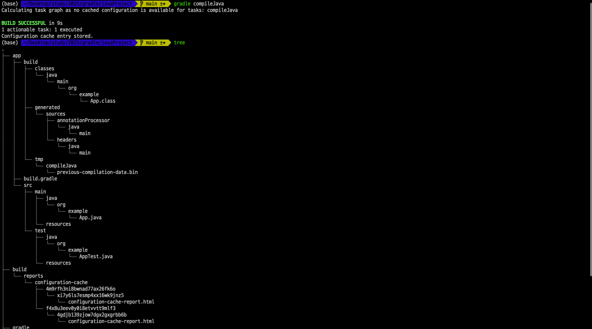

### 실행

이제 실행을 해보자. 실행을 하는 명령어는 아래와 같다.

``` bash
gradle run
```

그러면 메인클래스로 지정된 자바 파일이 실행되서 콘솔에 나오는 것을 볼 수 있다.

### 빌드

물론 빌드도 가능하고 Jar파일을 만드는 것도 가능하다. 아래와 같이 명령어를 입력하면 jar파일이 생성된다.

``` bash
gradle jar
```

### 테스트

테스트도 실행이 가능하다. 아래와 같이 명령어를 입력해보자.

``` bash
gradle test
```

## Java 외부 라이브러리를 가져와서 Dependency 해결해 보기

그러면 이제 외부 라이브러리를 가져와서 의존성에 추가해보자. 우리가 의존성에 추가하고 싶은 라이브러리를 [mavenCentral](https://mvnrepository.com/)에 들어가서 검색한다. 강의에서는 수학관련 라이브러리를 찾아서 `dependencies` 넣어줬다.

``` groovy
/*
 * This file was generated by the Gradle 'init' task.
 *
 * This generated file contains a sample Java application project to get you started.
 * For more details on building Java & JVM projects, please refer to https://docs.gradle.org/8.13/userguide/building_java_projects.html in the Gradle documentation.
 */

plugins {
    // Apply the application plugin to add support for building a CLI application in Java.
    id 'application'
}

repositories {
    // Use Maven Central for resolving dependencies.
    mavenCentral()
}

dependencies {
    // Use JUnit Jupiter for testing.
    testImplementation libs.junit.jupiter

    testRuntimeOnly 'org.junit.platform:junit-platform-launcher'

    // This dependency is used by the application.
    implementation libs.guava

    // https://mvnrepository.com/artifact/org.apache.commons/commons-math3
    // 추가
    implementation 'org.apache.commons:commons-math3:3.6.1'
}

// Apply a specific Java toolchain to ease working on different environments.
java {
    toolchain {
        languageVersion = JavaLanguageVersion.of(21)
    }
}

application {
    // Define the main class for the application.
    mainClass = 'org.example.App'
}

tasks.named('test') {
    // Use JUnit Platform for unit tests.
    useJUnitPlatform()
}

```

여기서는 강의와 다르게 short형태로 추가했는데 ':'을 분리하면 맨 처음께 artifactId로 알면 될 것이고 다음이 name 다음이 버전정보로 보면된다. 하지만 여기서 눈치 빠른 분들은 찾았을 것이다. 위에 `libs.guava`는 뭐 아무것도 없다. 그러면 어떻게 버전정보등을 찾을 수 있을까? 바로 gradle 디렉토리 하위에 `libs.versions.toml` 파일이 있다. 여기에 버전 정보가 적혀져 있다.

``` toml
# This file was generated by the Gradle 'init' task.
# https://docs.gradle.org/current/userguide/platforms.html#sub::toml-dependencies-format

[versions]
guava = "33.3.1-jre"
junit-jupiter = "5.11.3"

[libraries]
guava = { module = "com.google.guava:guava", version.ref = "guava" }
junit-jupiter = { module = "org.junit.jupiter:junit-jupiter", version.ref = "junit-jupiter" }
```

그리고 추가적으로 우리는 맨 [첫시간](https://sungbin.kr/Gradle-Introduction/)에 gradle은 매번 다운로드 받지 않고 캐싱을 한다고 했었다. 이것을 아래처럼 확인해볼 수 있다.

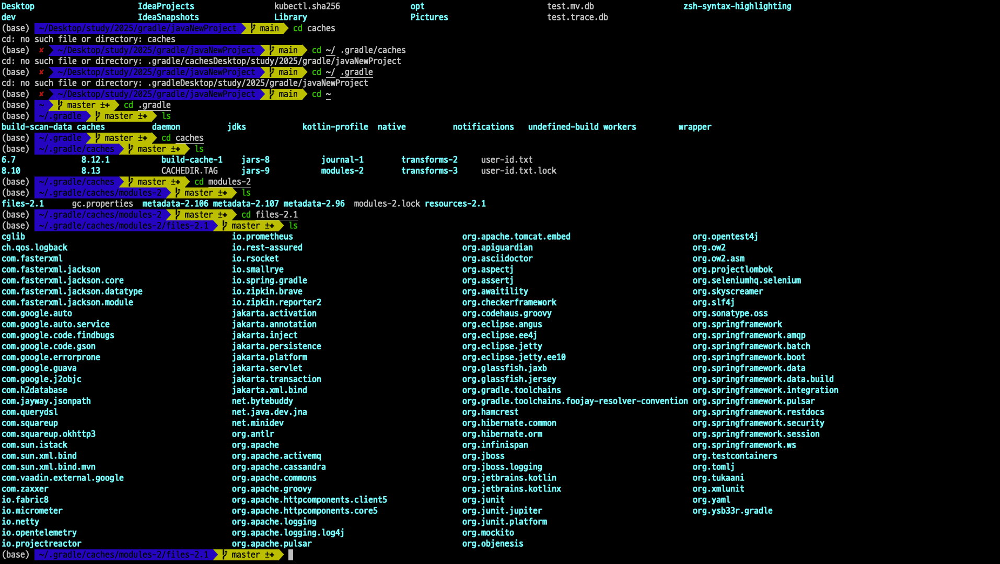

## Gradle 빌드 단계에 대해 알아보자

### Gradle 빌드 단계

- Gradle에서 빌드는 세 가지 주요 단계로 구성된다.
  - 초기화(Initialization)
  - 구성(Configuration)
  - 실행(Execution)
- 각 단계는 특정 목적을 가지며 특정 순서로 실행된다.

### 초기화(Initialization)

- 목적
  - Gradle은 어떤 프로젝트들이 빌드의 일부인지 결정한다.
  - 다중 프로젝트 빌드에서는 관련된 모든 서브프로젝트들을 식별한다.
- 과정
  - Gradle은 설정 파일(settings.gradle 또는 settings.gradle.kts)을 평가하여 프로젝트 계층 구조를 설정하고 포함된 서브프로젝트를 정의한다.
- 결과
  - Gradle이 찾은 각 프로젝트에 대해 Project 객체가 생성된다.

### 구성(Configuration)

- 목적
  - Gradle은 빌드 스크립트(build.gradle 또는 build.gradle.kts)를 평가하여 프로젝트를 구성한다. 이 단계에서는 지정된 태스크 그래프를 기반으로 어떤 태스크가 실행될지 결정한다.
- 과정
  - Gradle은 각 빌드 스크립트의 코드를 읽고 실행하여 프로젝트와 태스크를 구성한다.
  - 태스크 의존성과 속성이 설정되지만, 태스크 자체는 아직 실행되지 않는다.
- 결과
  - 태스크 그래프가 완성되어 Gradle이 어떤 태스크가 실행될지와 그 순서를 알 수 있다.

### 실행(Execution)

- 목적
  - Gradle은 실제로 Configuration Phase에서 생성된 태스크 그래프에 따라 태스크를 실행한다.
- 과정
  - Gradle은 의존성에 따라 태스크를 실행한다. 태스크는 실행 대상으로 표시되었고 출력물이 오래되었거나 누락된 경우에만 실행된다.
  - 태스크 액션(코드 컴파일, 파일 복사 등)이 이 단계에서 수행된다.
- 결과
  - 컴파일된 코드, 패키지된 바이너리와 같은 빌드 출력물이 생성된다.

### 추가사항

- Gradle은 가능한 한 작업을 회피하여 빌드 시간을 최적화하도록 설계되었다. 최신 상태 확인과 캐싱과 같은 기술을 사용하여 재실행할 필요가 없는 태스크를 건너뛴다.
- 이러한 각 단계는 Gradle의 빌드 라이프사이클의 일부로, 빌드가 실행될 때마다 반복된다.

## Gradle Daemon에 대해 알아보자

### Gradle Daemon

- Gradle 데몬은 Gradle이 빌드 성능을 향상시키기 위해 사용하는 오래 실행되는 백그라운드 JVM 프로세스이다.
- 빌드가 완료된 후에도 계속 실행되며, 후속 빌드에서 재사용될 준비가 되어 있다.
- Gradle에 의해 시작되고 빌드 사이에 살아있는 상태로 유지된다.
- 이전 빌드의 정보(프로젝트 구성 및 태스크 출력물 등)를 캐시하여 후속 빌드의 시작 및 실행 시간을 줄인다.
- 기본적으로 Gradle은 대부분의 빌드에서 데몬을 자동으로 활성화하고 시작한다.

### Gradle Daemon 장점

- 더 빠른 빌드 시간
  - 데몬은 JVM을 계속 실행하여 각 빌드마다 새로운 JVM 인스턴스를 시작하는 데 필요한 시간을 줄인다.
  - 또한 프로젝트 구성을 캐시하여 중복된 구성과 클래스 로딩을 피함으로써 빌드를 더 빠르게 만든다.
- 향상된 리소스 활용
  - 메모리와 캐시와 같은 리소스를 재사용함으로써, 데몬은 특히 빌드를 자주 실행할 때 시스템 리소스를 최적화한다.
- 줄어든 시작 시간
  - 일반적으로 Gradle은 각 빌드마다 새 프로세스를 초기화해야 하는데, 이는 시간이 소요된다. 데몬은 빌드 사이에 활성 상태를 유지하여 이러한 오버헤드를 피한다.

### 명령어

``` bash
# 데몬 시작하여 빌드
gradle build --daemon

# 데몬 정지
gradle --stop

# 데몬 없이 빌드
gradle build --no-daemon

# 데몬 상태
gradle --status
```

### Gradle Daemon: 라이프 사이클과 관리

- 데몬은 일정 기간 동안 비활성 상태(일반적으로 3시간)가 지속되거나 시스템이 종료될 때 자동으로 중지.
- --status 플래그를 사용하여 여러 데몬 인스턴스를 모니터링하고 제어할 수 있으며, 이 플래그는 실행 중인 데몬과 각각의 상태를 보여준다.

### 트러블슈팅과 고려사항

- 메모리 관리: 메모리 문제가 발생하거나 데몬의 메모리 사용량을 조정하고 싶다면, gradle.properties에서 JVM 옵션(예: 최대 힙 크기를 위한 -Xmx)을 설정할 수 있다.
  - org.gradle.jvmargs=-Xmx2g
  - [참조 링크](https://docs.gradle.org/current/userguide/build_environment.html#sec:gradle_configuration_properties)
  - gradle.properties 위치
    - 사용자 수준: ~/.gradle/gradle.properties
    - 프로젝트 수준: project-root/gradle.properties
- 오래된 데몬: 때로는 특히 Gradle 버전을 업그레이드한 후 오래된 데몬 인스턴스로 인해 문제가 발생할 수 있다. 데몬을 중지하거나 Gradle 캐시를 지우면 이러한 문제를 해결할 수 있다.
- 병렬 빌드: 데몬은 병렬 빌드(--parallel 사용)를 지원하여 특히 다중 프로젝트 빌드에서 빌드 성능을 더욱 최적화.

> 잘못된 지식이 있을 경우 댓글로 남겨주시면 빠르게 반영하겠습니다!
