## 첫번째 프로젝트 만들어보기

### 프로젝트 만들기

Gradle 프로젝트를 처음부터 만들어보자. 먼저 프로젝트 디렉토리를 생성하고 `gradle init` 명령어를 실행한다.

```bash
mkdir first-project
cd first-project
gradle init
```

`gradle init`을 실행하면 몇 가지 질문이 나온다.

```
Select type of build to generate:
  1: Application
  2: Library
  3: Gradle plugin
  4: Basic (build structure only)
Enter selection (default: Application) [1..4] 4
 
Project name (default: first-project):
 
Select build script DSL:
  1: Kotlin
  2: Groovy
Enter selection (default: Kotlin) [1..2] 2
 
Generate build using new APIs and behavior (some features may change in the next minor release)? (default: no) [yes, no]
 
> Task :init
BUILD SUCCESSFUL in 46s
1 actionable task: 1 executed
```

여기서는 Gradle의 기본 구조만 살펴보기 위해 **Basic (build structure only)** 을 선택하고, 빌드 스크립트 DSL은 **Groovy**를 선택했다.

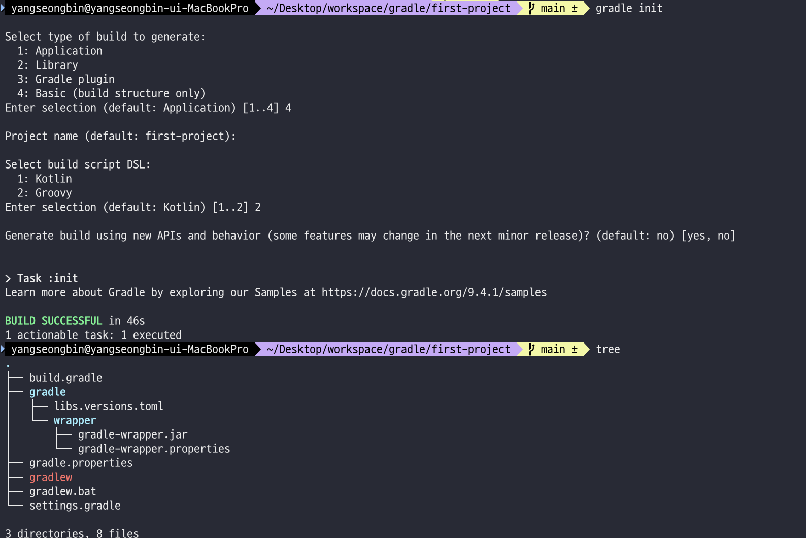

### 프로젝트 구조

생성된 프로젝트의 구조를 `tree` 명령어로 확인해보면 다음과 같다.

```
.
├── build.gradle
├── gradle
│   ├── libs.versions.toml
│   └── wrapper
│       ├── gradle-wrapper.jar
│       └── gradle-wrapper.properties
├── gradle.properties
├── gradlew
├── gradlew.bat
└── settings.gradle
```

각 파일과 디렉토리의 역할은 다음과 같다.

| 파일/디렉토리                     | 설명                                                |
|-----------------------------|---------------------------------------------------|
| `build.gradle`              | 프로젝트의 빌드 스크립트. 태스크, 플러그인, 의존성 등을 정의한다.            |
| `settings.gradle`           | 프로젝트의 이름과 멀티 프로젝트 구성을 정의한다.                       |
| `gradle.properties`         | Gradle 빌드에서 사용할 프로퍼티를 정의한다.                       |
| `gradlew` / `gradlew.bat`   | Gradle Wrapper 실행 스크립트 (Unix / Windows).          |
| `gradle/wrapper/`           | Gradle Wrapper 관련 파일. 프로젝트에서 사용할 Gradle 버전을 고정한다. |
| `gradle/libs.versions.toml` | 의존성 버전을 중앙에서 관리하기 위한 Version Catalog 파일이다.        |

### Task 등록하기

Gradle의 핵심은 **태스크(Task)** 이다. `build.gradle` 파일에 태스크를 등록하여 원하는 작업을 정의할 수 있다. `tasks.register`를 사용하여 첫 번째 태스크를 만들어보자.

```groovy
tasks.register('firstTask') {
    println "Hello World!"
    doFirst {
        println "do First Action!!"
    }
 
    doLast {
        println "do Last Action!!"
    }
}
```

여기서 중요한 포인트가 있다. `doFirst`, `doLast` 블록 안의 코드와 바깥의 코드는 **실행 시점이 다르다.**

### Configuration Phase vs Execution Phase

Gradle은 빌드를 수행할 때 크게 두 단계를 거친다.

1. **Configuration Phase (구성 단계)**: 빌드 스크립트를 평가하고 태스크 그래프를 구성한다. `tasks.register` 블록 내부이지만 `doFirst`/`doLast` **바깥**에 있는
   코드가 이 단계에서 실행된다.
2. **Execution Phase (실행 단계)**: 실제로 태스크가 실행되는 단계이다. `doFirst`와 `doLast` **안의** 코드가 이 단계에서 실행된다.

위 예시에서 `println "Hello World!"`는 Configuration Phase에서 실행되고, `doFirst`와 `doLast` 안의 `println`은 Execution Phase에서 실행된다.
실제로 `gradle tasks --all`을 실행해보면 이를 확인할 수 있다.

```bash
$ gradle tasks --all
Hello World!    # ← Configuration Phase에서 출력됨
 
> Task :tasks
...
Other tasks
-----------
firstTask
prepareKotlinBuildScriptModel
 
BUILD SUCCESSFUL in 262ms
```

`firstTask`를 실행하지 않았는데도 `Hello World!`가 출력된다. 이는 Configuration Phase에서 빌드 스크립트를 평가하면서 `println "Hello World!"`가 실행되었기
때문이다. 즉, **태스크의 실제 동작 로직은 반드시 `doFirst` 또는 `doLast` 블록 안에 작성해야 한다.**

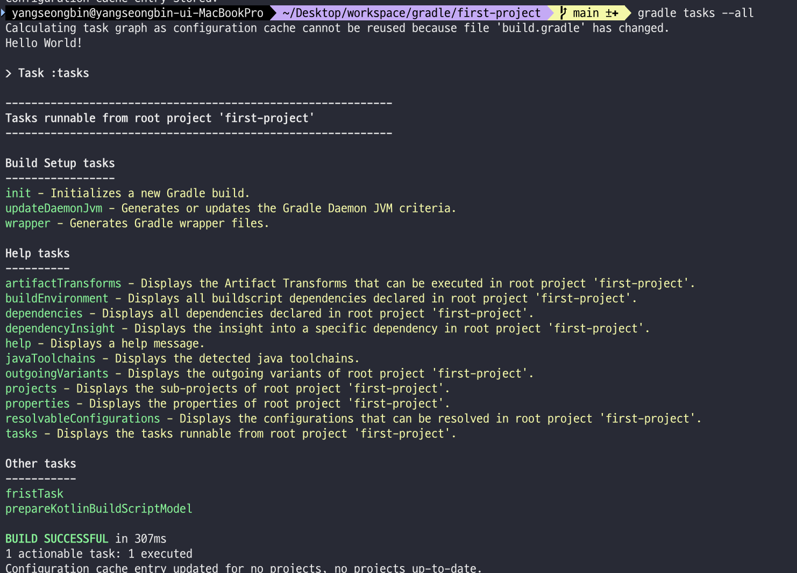

### Task 실행하기

이제 태스크를 실행해보자.

```bash
$ gradle firstTask
Hello World!
 
> Task :firstTask
do First Action!!
do Last Action!!
 
BUILD SUCCESSFUL in 261ms
```

`doFirst`가 먼저 실행되고, `doLast`가 그 뒤에 실행되는 것을 확인할 수 있다. `doFirst`는 태스크 액션의 맨 앞에, `doLast`는 맨 뒤에 추가되는 액션이다.

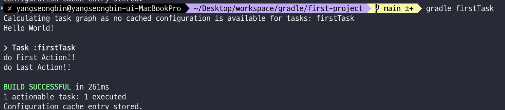

### Task 이름 축약

Gradle은 태스크 이름의 **camelCase 축약**을 지원한다. 태스크 이름의 각 대문자 앞글자만 입력하면 해당 태스크를 실행할 수 있다.

```bash
$ gradle fT    # firstTask의 축약
Hello World!
 
> Task :firstTask
do First Action!!
do Last Action!!
 
BUILD SUCCESSFUL in 241ms
```

`firstTask`를 `fT`로 축약하여 실행할 수 있다. 단, 축약된 이름이 다른 태스크와 충돌하지 않아야 한다.

### 여러 개의 Task 등록하기

두 번째 태스크를 추가해보자.

```groovy
tasks.register('firstTask') {
    println "Hello World!"
    doFirst {
        println "do First Action!!"
    }
 
    doLast {
        println "do Last Action!!"
    }
}
 
tasks.register('secondTask') {
    doFirst {
        println "do First Action in second Task!!"
    }
 
    doLast {
        println "do Last Action!! in second Task"
    }
}
```

`gradle tasks --all`로 등록된 태스크를 확인하면 `firstTask`와 `secondTask`가 모두 표시된다.

```bash
$ gradle tasks --all
...
Other tasks
-----------
firstTask
prepareKotlinBuildScriptModel
secondTask
 
BUILD SUCCESSFUL in 262ms
```

`secondTask`도 축약하여 실행할 수 있다.

```bash
$ gradle sT
 
> Task :secondTask
do First Action in second Task!!
do Last Action!! in second Task
 
BUILD SUCCESSFUL in 244ms
```

`secondTask`에는 Configuration Phase에서 실행되는 `println`이 없으므로, `Hello World!`가 출력되지 않는 점도 주목하자.

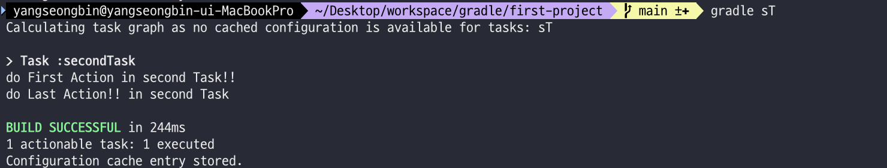

### Gradle Wrapper로 실행하기

지금까지는 시스템에 설치된 `gradle` 명령어로 태스크를 실행했다. 하지만 실무에서는 **Gradle Wrapper(`./gradlew`)** 를 사용하는 것이 권장된다. Wrapper를 사용하면 프로젝트에
고정된 Gradle 버전으로 빌드하게 되어 팀원 간 환경 차이 문제를 방지할 수 있다.

```bash
$ ./gradlew fT
Hello World!
 
> Task :firstTask
do First Action!!
do Last Action!!
 
BUILD SUCCESSFUL in 280ms
```

```bash
$ ./gradlew sT
 
> Task :secondTask
do First Action in second Task!!
do Last Action!! in second Task
 
BUILD SUCCESSFUL in 257ms
```

`gradle` 대신 `./gradlew`를 사용하는 것 외에는 사용법이 동일하다. 앞으로의 예제에서도 `./gradlew`를 사용하는 습관을 들이는 것이 좋다.

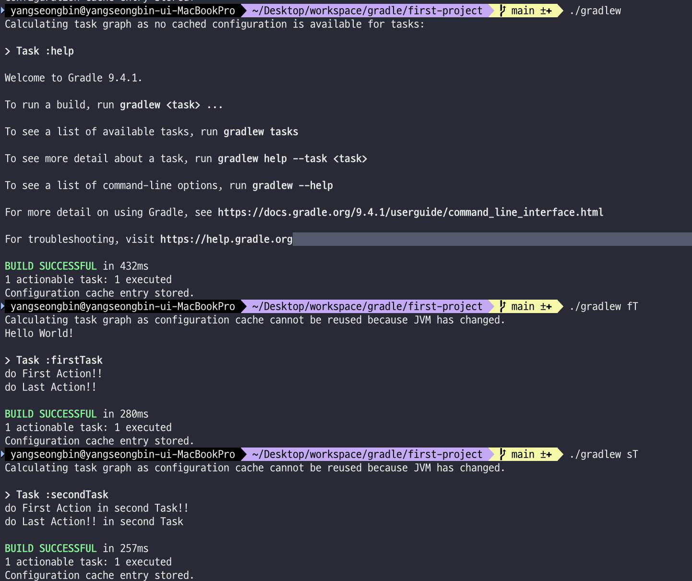

## Java 프로젝트 만들어보기

이전 글에서는 Basic 타입으로 Gradle의 기본 구조와 태스크를 살펴보았다. 이번에는 **Application** 타입으로 실제 Java 프로젝트를 생성하고, Gradle이 제공하는 주요 빌드 태스크들을 하나씩
실행해보자.

### 프로젝트 생성

```bash
mkdir javaProject
cd javaProject
gradle init
```

Application 타입을 선택하면 Basic 타입보다 더 많은 질문이 나온다.

```
Select type of build to generate:
  1: Application
  2: Library
  3: Gradle plugin
  4: Basic (build structure only)
Enter selection (default: Application) [1..4] 1
 
Select implementation language:
  1: Java
  2: Kotlin
  3: Groovy
  4: Scala
  5: C++
  6: Swift
Enter selection (default: Java) [1..6] 1
 
Enter target Java version (min: 7, default: 21): 25
 
Project name (default: javaProject):
 
Select application structure:
  1: Single application project
  2: Application and library project
Enter selection (default: Single application project) [1..2] 1
 
Select build script DSL:
  1: Kotlin
  2: Groovy
Enter selection (default: Kotlin) [1..2] 2
 
Select test framework:
  1: JUnit 4
  2: TestNG
  3: Spock
  4: JUnit Jupiter
Enter selection (default: JUnit Jupiter) [1..4] 4
```

각 선택 항목을 정리하면 다음과 같다.

- **Build type**: Application — 실행 가능한 애플리케이션 프로젝트를 생성한다.
- **Implementation language**: Java — 구현 언어로 Java를 선택한다.
- **Target Java version**: 25 — 대상 Java 버전을 지정한다.
- **Application structure**: Single application project — 단일 애플리케이션 프로젝트 구조를 선택한다.
- **Build script DSL**: Groovy — 빌드 스크립트를 Groovy DSL로 작성한다.
- **Test framework**: JUnit Jupiter — JUnit 5(Jupiter)를 테스트 프레임워크로 사용한다.

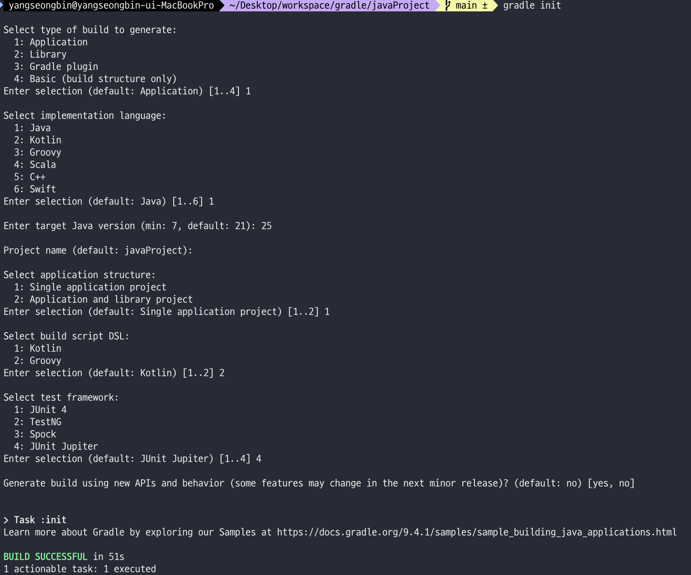

### 프로젝트 구조

생성된 프로젝트 구조를 확인해보자.

```
.
├── app
│   ├── build.gradle
│   └── src
│       ├── main
│       │   ├── java
│       │   │   └── org
│       │   │       └── example
│       │   │           └── App.java
│       │   └── resources
│       └── test
│           ├── java
│           │   └── org
│           │       └── example
│           │           └── AppTest.java
│           └── resources
├── gradle
│   ├── libs.versions.toml
│   └── wrapper
│       ├── gradle-wrapper.jar
│       └── gradle-wrapper.properties
├── gradle.properties
├── gradlew
├── gradlew.bat
└── settings.gradle
```

이전의 Basic 프로젝트와 비교했을 때 눈에 띄는 차이점이 있다. `build.gradle`과 소스 코드가 루트가 아닌 **`app`이라는 하위 프로젝트(subproject)** 안에 위치한다는 것이다. 이는
Gradle의 멀티 프로젝트 구조로, 루트 프로젝트(`javaProject`) 아래에 `app`이라는 서브 프로젝트가 포함된 형태이다.

소스 코드 구조는 Maven과 동일한 **컨벤션**을 따른다. `src/main/java`에 메인 소스가, `src/test/java`에 테스트 소스가 위치한다.

### 주요 파일 살펴보기

#### settings.gradle

```groovy
plugins {
    // Apply the foojay-resolver plugin to allow automatic download of JDKs
    id 'org.gradle.toolchains.foojay-resolver-convention' version '1.0.0'
}
 
rootProject.name = 'javaProject'
include('app')
```

`settings.gradle`은 프로젝트의 전체 구조를 정의하는 파일이다. `rootProject.name`으로 루트 프로젝트의 이름을 지정하고, `include('app')`으로 `app` 서브 프로젝트를
포함시킨다. 만약 `core`, `api`, `infra` 같은 모듈을 추가하고 싶다면 여기에 `include`를 추가하면 된다.

`foojay-resolver` 플러그인은 Java Toolchain에서 필요한 JDK를 자동으로 다운로드할 수 있게 해주는 플러그인이다.

#### app/build.gradle

```groovy
plugins {
    // Apply the application plugin to add support for building a CLI application in Java.
    id 'application'
}
 
repositories {
    // Use Maven Central for resolving dependencies.
    mavenCentral()
}
 
dependencies {
    // Use JUnit Jupiter for testing.
    testImplementation libs.junit.jupiter
 
    testRuntimeOnly 'org.junit.platform:junit-platform-launcher'
 
    // This dependency is used by the application.
    implementation libs.guava
}
 
// Apply a specific Java toolchain to ease working on different environments.
java {
    toolchain {
        languageVersion = JavaLanguageVersion.of(25)
    }
}
 
application {
    // Define the main class for the application.
    mainClass = 'org.example.App'
}
 
tasks.named('test') {
    // Use JUnit Platform for unit tests.
    useJUnitPlatform()
}
```

`build.gradle`의 각 블록을 하나씩 살펴보자.

- **`plugins`**: `application` 플러그인을 적용한다. 이 플러그인은 `java` 플러그인을 내부적으로 포함하며, `run`, `installDist`, `distZip` 등 애플리케이션 실행과
  배포에 필요한 태스크들을 추가해준다.
- **`repositories`**: 의존성을 다운로드할 리포지토리로 Maven Central을 지정한다.
- **`dependencies`**: 프로젝트의 의존성을 선언한다. `implementation`은 컴파일 및 런타임에 필요한 의존성, `testImplementation`은 테스트에만 필요한 의존성이다.
- **`java.toolchain`**: 빌드에 사용할 Java 버전을 지정한다. 시스템에 해당 버전이 없으면 `foojay-resolver`를 통해 자동으로 다운로드한다.
- **`application.mainClass`**: `gradle run`으로 실행할 메인 클래스를 지정한다.

#### Version Catalog (libs.versions.toml)

의존성 선언에서 `libs.junit.jupiter`, `libs.guava`와 같이 직접 좌표(coordinates)를 쓰지 않고 별칭(alias)을 사용하는 것을 볼 수 있다. 이는 **Version
Catalog** 기능으로, `gradle/libs.versions.toml` 파일에서 의존성 버전을 중앙 관리한다. 멀티 모듈 프로젝트에서 모든 서브 프로젝트가 동일한 의존성 버전을 사용하도록 보장해주는 유용한
기능이다.

#### gradle.properties

```properties
org.gradle.configuration-cache=true
```

`gradle.properties`에는 Gradle 빌드의 전역 설정을 정의할 수 있다. 여기서는 **Configuration Cache**가 활성화되어 있다. Configuration Cache는 빌드의
Configuration Phase 결과를 캐싱하여, 빌드 스크립트가 변경되지 않았다면 Configuration Phase를 건너뛰고 바로 Execution Phase를 실행한다. 터미널 로그에서
`Reusing configuration cache`라고 표시되는 것이 바로 이 기능이 동작하는 것이다.

#### App.java

```java
package org.example;
 
public class App {
    public String getGreeting() {
        return "Hello Gradle!";
    }
 
    public static void main(String[] args) {
        System.out.println(new App().getGreeting());
    }
}
```

Gradle이 자동 생성해주는 샘플 애플리케이션이다. 간단한 `main` 메서드를 가지고 있어 바로 실행해볼 수 있다.

### 주요 태스크 실행해보기

Application 타입으로 생성된 프로젝트에는 Basic 타입에 비해 훨씬 많은 태스크가 등록되어 있다. `gradle tasks --all`로 확인하면 Application, Build,
Distribution, Documentation, Verification 등 카테고리별로 태스크가 분류되어 있는 것을 볼 수 있다.

이 중에서 가장 자주 사용하는 핵심 태스크들을 직접 실행해보자.

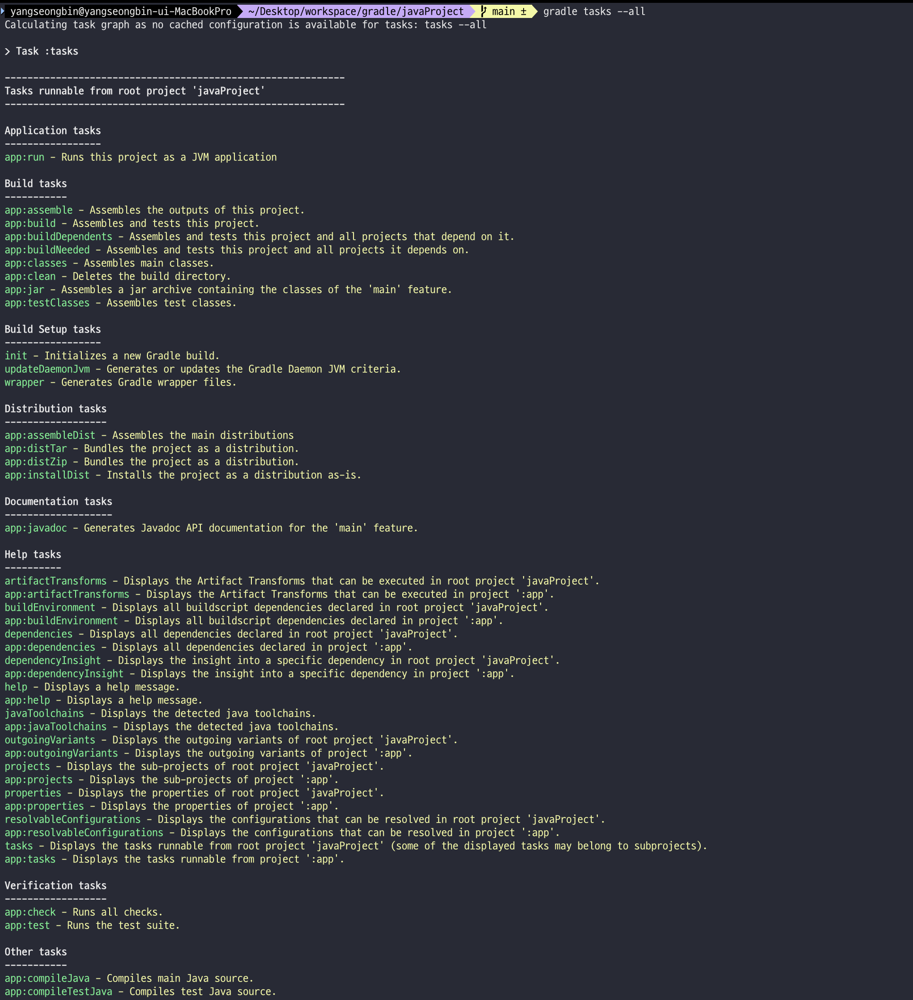

#### compileJava — 소스 코드 컴파일

```bash
$ gradle compileJava
 
BUILD SUCCESSFUL in 418ms
1 actionable task: 1 up-to-date
```

`compileJava` 태스크는 `src/main/java` 하위의 Java 소스 파일을 컴파일하여 `.class` 파일을 생성한다. 컴파일 후 `app/build/classes/java/main/` 디렉토리에
`App.class`가 생성된 것을 확인할 수 있다.

```
app/build/
├── classes
│   └── java
│       └── main
│           └── org
│               └── example
│                   └── App.class
└── ...
```

#### run — 애플리케이션 실행

```bash
$ gradle run
 
> Task :app:run
Hello Gradle!
 
BUILD SUCCESSFUL in 302ms
2 actionable tasks: 1 executed, 1 up-to-date
```

`run` 태스크는 `application` 플러그인이 제공하는 태스크로, `mainClass`에 지정된 클래스의 `main` 메서드를 실행한다. 결과에서
`2 actionable tasks: 1 executed, 1 up-to-date`라고 나오는 것은, `run` 태스크가 `compileJava` 태스크에 의존하기 때문이다. 이미 컴파일이 완료되어
up-to-date 상태이므로 `compileJava`는 건너뛰고 `run`만 실행된 것이다. 이것이 바로 **증분 빌드**가 동작하는 모습이다.

#### jar — JAR 파일 패키징

```bash
$ gradle jar
 
BUILD SUCCESSFUL in 305ms
2 actionable tasks: 1 executed, 1 up-to-date
```

`jar` 태스크는 컴파일된 클래스 파일들을 하나의 JAR(Java Archive) 파일로 패키징한다. 실행 후 `app/build/libs/app.jar` 파일이 생성된다.

```
app/build/
├── libs
│   └── app.jar        ← 생성된 JAR 파일
└── tmp
    └── jar
        └── MANIFEST.MF
```

#### test — 테스트 실행

```bash
$ gradle test
 
BUILD SUCCESSFUL in 805ms
3 actionable tasks: 2 executed, 1 up-to-date
```

`test` 태스크는 `src/test/java` 하위의 테스트 코드를 컴파일하고 실행한다. 테스트 실행 후에는 `app/build/reports/tests/test/index.html`에 HTML 형식의 테스트
리포트가 생성된다. 브라우저에서 열어보면 테스트 통과/실패 현황을 시각적으로 확인할 수 있다.

```
app/build/
├── reports
│   └── tests
│       └── test
│           ├── index.html    ← 테스트 리포트
│           ├── css/
│           └── js/
└── test-results
    └── test
        ├── binary/
        └── TEST-org.example.AppTest.xml
```

#### clean — 빌드 결과물 삭제

```bash
$ gradle clean
 
BUILD SUCCESSFUL in 251ms
1 actionable task: 1 executed
```

`clean` 태스크는 `app/build` 디렉토리를 삭제하여 이전 빌드 결과물을 깨끗하게 정리한다. 새로운 상태에서 빌드를 다시 시작하고 싶을 때 사용한다.

### 태스크 의존성 그래프

지금까지 실행한 태스크들은 서로 독립적이지 않다. Gradle의 태스크들은 **의존성 그래프(DAG, Directed Acyclic Graph)** 를 형성하며, 특정 태스크를 실행하면 그 태스크가 의존하는 선행
태스크들이 자동으로 먼저 실행된다.

```
compileJava
    ↓
 classes
    ↓
   jar
    
compileJava → compileTestJava → test → check
                                         ↓
              jar → assemble ──────→   build
```

예를 들어 `gradle build`를 실행하면 컴파일, 테스트, JAR 패키징이 모두 순서대로 실행된다. 반대로 `gradle compileJava`만 실행하면 컴파일만 수행된다. 이 의존 관계 덕분에 필요한
태스크 하나만 지정해도 선행 작업이 자동으로 처리되는 것이다.

### 자주 사용하는 태스크 조합

실무에서 자주 사용하는 태스크 조합을 정리하면 다음과 같다.

| 명령어                    | 설명                                    |
|------------------------|---------------------------------------|
| `gradle clean build`   | 빌드 결과물을 삭제한 후 전체 빌드 (컴파일 + 테스트 + 패키징) |
| `gradle run`           | 애플리케이션 실행                             |
| `gradle test`          | 테스트만 실행                               |
| `gradle jar`           | JAR 파일만 생성                            |
| `gradle clean`         | 빌드 디렉토리 삭제                            |
| `gradle build -x test` | 테스트를 제외하고 빌드 (`-x`는 태스크 제외 옵션)        |
| `gradle dependencies`  | 의존성 트리 확인                             |

## Java 외부 라이브러리를 가져와서 Dependency 해결해 보기

### 의존성 관리란?

Java 프로젝트를 생성하고 기본 태스크들을 실행해보았다. 이번에는 Gradle의 핵심 기능 중 하나인 **의존성 관리(Dependency Management)** 를 직접 실습해보자. 외부 라이브러리를
프로젝트에 추가하고, Gradle이 이를 어떻게 해결(resolve)하고 캐싱하는지 살펴본다.

### 프로젝트 준비

이전과 동일하게 Java Application 프로젝트를 생성한다.

```bash
mkdir javaNewProject
cd javaNewProject
gradle init
```

생성 옵션은 이전 글과 동일하게 Application / Java / Groovy DSL / JUnit Jupiter를 선택한다.

```bash
$ gradle run
 
> Task :app:run
Hello World!
 
BUILD SUCCESSFUL in 399ms
```

기본 생성된 프로젝트가 정상적으로 실행되는 것을 확인했다.

### 외부 의존성 추가하기

#### Maven Repository에서 라이브러리 찾기

통계 계산을 위해 Apache Commons Math 라이브러리를 추가해보자. [Maven Repository](https://mvnrepository.com/)에서 원하는 라이브러리를 검색하면 Gradle용 의존성
선언 코드를 확인할 수 있다.

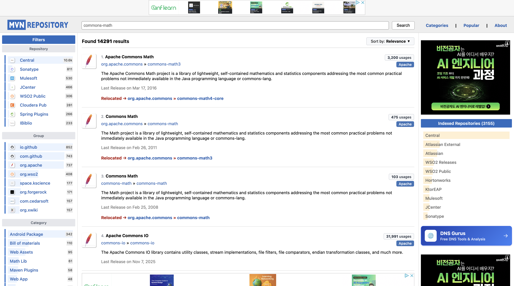

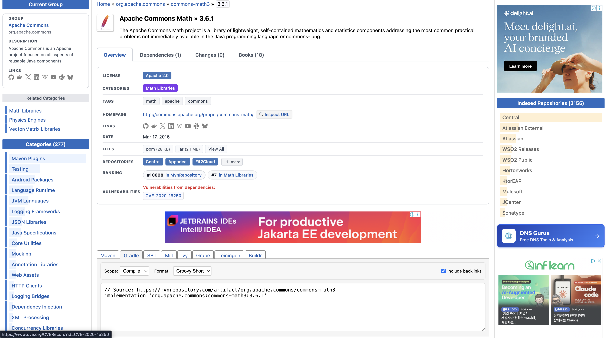

#### build.gradle에 의존성 선언

`app/build.gradle`의 `dependencies` 블록에 라이브러리를 추가한다.

```groovy
dependencies {
    // This dependency is used by the application.
    implementation libs.guava
 
    // Source: https://mvnrepository.com/artifact/org.apache.commons/commons-math3
    implementation 'org.apache.commons:commons-math3:3.6.1'
 
    // Use JUnit Jupiter for testing.
    testImplementation libs.junit.jupiter
 
    testRuntimeOnly 'org.junit.platform:junit-platform-launcher'
}
```

의존성 선언은 `'그룹:아티팩트:버전'` 형식을 따른다. 여기서 `org.apache.commons`가 그룹, `commons-math3`가 아티팩트, `3.6.1`이 버전이다. 이 형식은 Maven의 좌표(
coordinates) 체계와 동일하다. Maven Repository에서 검색한 의존성을 그대로 복사해서 붙여넣으면 된다.

#### 의존성 구성(Configuration)

`dependencies` 블록 안에서 `implementation`, `testImplementation` 같은 키워드가 보이는데, 이를 **의존성 구성(Dependency Configuration)** 이라고
한다. 어떤 구성을 사용하느냐에 따라 해당 의존성이 언제, 어디서 사용 가능한지가 결정된다.

| 구성                   | 컴파일 | 런타임 | 테스트 컴파일 | 테스트 런타임 | 설명                                              |
|----------------------|:---:|:---:|:-------:|:-------:|-------------------------------------------------|
| `implementation`     |  O  |  O  |    O    |    O    | 가장 일반적인 의존성. 내부 구현에 사용된다.                       |
| `api`                |  O  |  O  |    O    |    O    | `java-library` 플러그인 전용. 의존성이 소비자에게도 노출된다.       |
| `compileOnly`        |  O  |  X  |    X    |    X    | 컴파일 시에만 필요하고 런타임에는 불필요한 의존성. (예: Lombok)        |
| `runtimeOnly`        |  X  |  O  |    X    |    O    | 런타임에만 필요한 의존성. (예: JDBC 드라이버)                   |
| `testImplementation` |  X  |  X  |    O    |    O    | 테스트 코드에서만 사용하는 의존성.                             |
| `testRuntimeOnly`    |  X  |  X  |    X    |    O    | 테스트 런타임에만 필요한 의존성. (예: JUnit Platform Launcher) |

`implementation`과 `api`의 차이가 헷갈릴 수 있는데, 핵심은 **의존성의 전이(transitivity)** 이다. 모듈 A가 모듈 B에 의존하고, 모듈 B가 라이브러리 C를
`implementation`으로 선언했다면, 모듈 A는 라이브러리 C에 직접 접근할 수 없다. 반면 `api`로 선언했다면 모듈 A에서도 라이브러리 C를 사용할 수 있다. `implementation`을 사용하면
불필요한 재컴파일을 줄여 빌드 성능이 향상되므로, 가능한 한 `implementation`을 사용하는 것이 권장된다.

### 코드에서 라이브러리 사용하기

추가한 Apache Commons Math 라이브러리를 사용하여 `App.java`를 수정하자.

```java
package org.example;
 
import org.apache.commons.math3.stat.descriptive.DescriptiveStatistics;
 
public class App {
    public String getGreeting() {
        return "Hello World!";
    }
 
    public static void main(String[] args) {
        System.out.println(new App().getGreeting());
 
        double[] values = {1.2, 2.4, 3.6, 4.8, 6.0};
        DescriptiveStatistics stats = new DescriptiveStatistics(values);
 
        double mean = stats.getMean();
        double variance = stats.getVariance();
 
        System.out.println("mean = " + mean);
        System.out.println("variance = " + variance);
    }
}
```

`build.gradle`에 의존성을 선언하기만 하면, Gradle이 Maven Central에서 라이브러리를 자동으로 다운로드하고 클래스패스에 추가해준다. 별도의 JAR 파일 다운로드나 수동 설정이 필요 없다.

실행해보면 정상적으로 통계 값이 출력된다.

```bash
$ gradle run
 
> Task :app:run
Hello World!
mean = 3.6
variance = 3.2000000000000006
 
BUILD SUCCESSFUL in 304ms
2 actionable tasks: 1 executed, 1 up-to-date
```

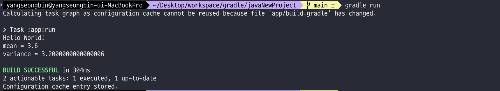

### Version Catalog

`build.gradle`에서 직접 좌표를 입력하는 방식 외에, Version Catalog를 사용하여 의존성 버전을 중앙에서 관리할 수도 있다. `gradle/libs.versions.toml` 파일을 확인해보자.

```toml
[versions]
guava = "33.5.0-jre"
junit-jupiter = "6.0.1"
 
[libraries]
guava = { module = "com.google.guava:guava", version.ref = "guava" }
junit-jupiter = { module = "org.junit.jupiter:junit-jupiter", version.ref = "junit-jupiter" }
```

이 파일은 크게 세 섹션으로 구성된다.

- **`[versions]`**: 버전 번호를 변수처럼 정의한다.
- **`[libraries]`**: 라이브러리의 그룹:아티팩트와 버전 참조를 매핑한다.
- **`[plugins]`** (여기서는 미사용): 플러그인 버전을 관리한다.

`build.gradle`에서는 `libs.guava`, `libs.junit.jupiter`와 같이 별칭(accessor)으로 참조할 수 있다. commons-math3도 Version Catalog로 관리하고
싶다면 다음과 같이 추가하면 된다.

```toml
[versions]
guava = "33.5.0-jre"
junit-jupiter = "6.0.1"
commons-math3 = "3.6.1"
 
[libraries]
guava = { module = "com.google.guava:guava", version.ref = "guava" }
junit-jupiter = { module = "org.junit.jupiter:junit-jupiter", version.ref = "junit-jupiter" }
commons-math3 = { module = "org.apache.commons:commons-math3", version.ref = "commons-math3" }
```

그러면 `build.gradle`에서 이렇게 사용할 수 있다.

```groovy
dependencies {
    implementation libs.guava
    implementation libs.commons.math3
    testImplementation libs.junit.jupiter
    testRuntimeOnly 'org.junit.platform:junit-platform-launcher'
}
```

직접 좌표를 하드코딩하는 것과 Version Catalog를 사용하는 것, 두 방식 모두 동작하지만, **멀티 모듈 프로젝트에서는 Version Catalog를 사용하는 것이 강력히 권장된다.** 여러 서브
프로젝트에서 동일한 라이브러리를 사용할 때 버전을 한 곳에서 관리할 수 있어 일관성을 유지하기 좋기 때문이다.

### Gradle의 의존성 캐시

Gradle은 다운로드한 의존성을 로컬에 캐싱하여 매번 다시 다운로드하지 않도록 한다. 캐시 디렉토리는 `~/.gradle/caches/` 하위에 위치한다.

```bash
$ ls ~/.gradle/caches/modules-2/files-2.1
 
aopalliance          com.google.guava     io.netty             org.apache.commons   ...
```

`~/.gradle/caches/modules-2/files-2.1/` 디렉토리를 보면, 지금까지 다운로드한 모든 의존성이 그룹별로 캐싱되어 있는 것을 확인할 수 있다. Gradle은 한 번 다운로드한 의존성을
여기에 저장하고, 다른 프로젝트에서 동일한 의존성을 사용하면 캐시에서 바로 가져온다.

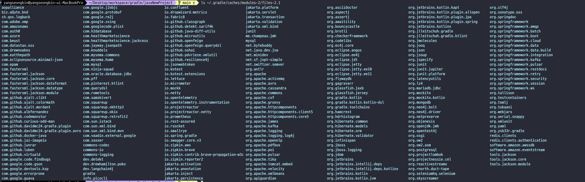

캐시 구조를 정리하면 다음과 같다.

| 디렉토리                                    | 설명                               |
|-----------------------------------------|----------------------------------|
| `~/.gradle/caches/modules-2/files-2.1/` | 다운로드된 JAR, POM 파일 등 의존성 아티팩트     |
| `~/.gradle/caches/modules-2/metadata-*` | 의존성 메타데이터 (버전 정보, 전이 의존성 등)      |
| `~/.gradle/caches/build-cache-1/`       | 빌드 캐시 (태스크 결과물)                  |
| `~/.gradle/wrapper/`                    | Gradle Wrapper로 다운로드한 Gradle 배포판 |
| `~/.gradle/daemon/`                     | Gradle Daemon 관련 파일              |
| `~/.gradle/jdks/`                       | Toolchain으로 자동 다운로드한 JDK         |

캐시에 문제가 생겨 의존성을 다시 다운로드하고 싶다면 `--refresh-dependencies` 옵션을 사용할 수 있다.

```bash
gradle build --refresh-dependencies
```

또는 캐시 디렉토리 자체를 삭제할 수도 있다.

```bash
rm -rf ~/.gradle/caches
```

단, 이 경우 모든 의존성을 처음부터 다시 다운로드하므로 첫 빌드가 느려질 수 있다.

### 의존성 트리 확인하기

프로젝트가 커지면 어떤 의존성이 어떤 의존성을 끌어오는지 파악하기 어려워진다. `dependencies` 태스크를 사용하면 전체 의존성 트리를 확인할 수 있다.

```bash
gradle dependencies
```

특정 구성의 의존성만 보고 싶다면 `--configuration` 옵션을 사용한다.

```bash
# 컴파일 타임 의존성만 확인
gradle dependencies --configuration compileClasspath
 
# 런타임 의존성만 확인
gradle dependencies --configuration runtimeClasspath
```

특정 의존성이 왜 포함되었는지 추적하고 싶다면 `dependencyInsight` 태스크를 사용한다.

```bash
# commons-math3가 어떤 경로로 포함되었는지 확인
gradle dependencyInsight --dependency commons-math3 --configuration compileClasspath
```

이 명령어들은 의존성 충돌이나 버전 문제를 디버깅할 때 매우 유용하다.

### 의존성 충돌 해결

여러 라이브러리가 동일한 의존성의 서로 다른 버전을 요구하면 **의존성 충돌(Dependency Conflict)** 이 발생한다. Gradle은 기본적으로 **가장 높은 버전을 선택(newest wins)** 하는
전략으로 충돌을 해결한다.

예를 들어, 라이브러리 A가 `commons-lang3:3.12`를, 라이브러리 B가 `commons-lang3:3.14`를 요구하면, Gradle은 `3.14`를 선택한다. 이 해결 과정은
`dependencies` 태스크에서 확인할 수 있으며, 버전이 올라간 경우 `→` 기호로 표시된다.

특정 버전을 강제하고 싶다면 다음과 같이 할 수 있다.

```groovy
configurations.all {
    resolutionStrategy {
        // 특정 버전 강제 지정
        force 'org.apache.commons:commons-lang3:3.12'
    }
}
```

단, 버전 강제 지정은 호환성 문제를 일으킬 수 있으므로 신중하게 사용해야 한다.

## Gradle 빌드 단계에 대해 알아보자

### Build Lifecycle이란?

Gradle은 빌드를 실행할 때 세 가지 단계를 순서대로 거친다. 이 세 단계를 **Build Lifecycle(빌드 생명주기)** 라고 하며, 모든 빌드는 이 생명주기를 반복한다. Gradle을 제대로 이해하려면
각 단계에서 무슨 일이 일어나는지, 어떤 코드가 어느 단계에서 실행되는지를 명확히 알아야 한다.

세 단계는 다음과 같다.

1. **Initialization (초기화)**
2. **Configuration (구성)**
3. **Execution (실행)**

### Initialization Phase (초기화 단계)

#### 목적

빌드에 참여하는 프로젝트가 어떤 것들인지 결정하는 단계이다. 멀티 프로젝트 빌드에서는 어떤 서브 프로젝트들이 포함되는지를 이 단계에서 식별한다.

#### 과정

Gradle은 `settings.gradle` (또는 `settings.gradle.kts`) 파일을 평가(evaluate)하여 프로젝트 계층 구조를 설정하고, 포함할 서브 프로젝트를 정의한다.

```groovy
// settings.gradle
rootProject.name = 'javaProject'
include('app')
```

위 설정에서 Gradle은 루트 프로젝트 `javaProject`와 서브 프로젝트 `app`을 인식한다.

#### 결과

발견된 각 프로젝트에 대해 **Project 객체**가 생성된다. 싱글 프로젝트라면 Project 객체가 1개, 멀티 프로젝트라면 루트 + 서브 프로젝트 수만큼 생성된다.

### Configuration Phase (구성 단계)

#### 목적

Initialization Phase에서 생성된 모든 프로젝트의 빌드 스크립트(`build.gradle`)를 평가하여 프로젝트와 태스크를 구성하는 단계이다. 이 단계에서 **태스크 그래프(Task Graph)** 가
완성되어 Gradle은 어떤 태스크를 어떤 순서로 실행해야 하는지를 알게 된다.

#### 과정

Gradle은 각 프로젝트의 `build.gradle` 파일을 읽고 실행하여 프로젝트와 태스크를 구성한다. 이때 태스크의 의존 관계와 속성이 설정되지만, **태스크 자체는 아직 실행되지 않는다.**

#### 결과

태스크 그래프가 완성된다. Gradle은 이 그래프를 통해 어떤 태스크가 실행 대상인지, 어떤 순서로 실행해야 하는지를 파악한다.

### 중요한 포인트: 어떤 코드가 Configuration Phase에서 실행되는가?

이전 글에서 `println "Hello World!"`가 태스크를 실행하지 않아도 출력되는 현상을 다루었다. 이제 그 이유를 정확히 이해할 수 있다. `build.gradle`에 다음과 같이 작성하고 실행해보자.

```groovy
println "Start Configuration..."
println "End Configuration..."
 
tasks.register('firstTask') {
    println "Hello World!"
    doFirst {
        println "do First Action!!"
    }
 
    doLast {
        println "do Last Action!!"
    }
}
```

```bash
$ ./gradlew fT
 
> Configure project :
Start Configuration...
End Configuration...
Hello World!
 
> Task :firstTask
do First Action!!
do Last Action!!
 
BUILD SUCCESSFUL in 276ms
```

출력 결과를 보면 실행 흐름이 명확하게 구분된다.

1. `> Configure project :` — Configuration Phase가 시작됨을 나타낸다.
2. `Start Configuration...` / `End Configuration...` — `build.gradle` 최상위에 작성한 코드가 Configuration Phase에서 실행된다.
3. `Hello World!` — `tasks.register` 블록 내부이지만 `doFirst`/`doLast` 바깥에 있는 코드도 Configuration Phase에서 실행된다.
4. `> Task :firstTask` — Execution Phase가 시작됨을 나타낸다.
5. `do First Action!!` / `do Last Action!!` — `doFirst`와 `doLast` 안의 코드가 Execution Phase에서 실행된다.

정리하면 다음과 같다.

| 코드 위치                                              | 실행 단계                         |
|----------------------------------------------------|-------------------------------|
| `build.gradle` 최상위                                 | Configuration Phase           |
| `tasks.register { ... }` 블록 내부 (doFirst/doLast 바깥) | Configuration Phase           |
| `doFirst { ... }`                                  | Execution Phase (태스크 액션 시작 시) |
| `doLast { ... }`                                   | Execution Phase (태스크 액션 종료 시) |

### Execution Phase (실행 단계)

#### 목적

Configuration Phase에서 완성된 태스크 그래프에 따라 실제로 태스크를 실행하는 단계이다.

#### 과정

Gradle은 태스크의 의존 관계에 따라 순서대로 태스크를 실행한다. 이때 태스크는 실행 대상으로 표시되어 있고, 출력이 최신 상태가 아닌(outdated) 경우에만 실행된다. 컴파일, 파일 복사, JAR 패키징 등
실제 작업(Task Action)이 이 단계에서 수행된다.

#### 결과

컴파일된 코드, 패키징된 바이너리, 테스트 리포트 등 빌드 결과물이 생성된다.

### Task Avoidance (태스크 회피)

Gradle은 빌드 시간을 최적화하기 위해 불필요한 작업을 최대한 피하도록 설계되어 있다. **up-to-date 검사**와 **캐싱**을 통해 다시 실행할 필요가 없는 태스크를 건너뛴다.

```bash
$ gradle compileJava
 
BUILD SUCCESSFUL in 267ms
1 actionable task: 1 up-to-date
```

`1 up-to-date`는 소스 코드에 변경이 없어 컴파일을 건너뛰었다는 의미이다. Gradle은 태스크의 입력(Input)과 출력(Output)을 추적하여 입력이 변경되지 않았다면 태스크를 다시 실행하지 않는다.

태스크 실행 시 나타나는 상태 레이블을 정리하면 다음과 같다.

| 레이블          | 의미                         |
|--------------|----------------------------|
| (레이블 없음)     | 태스크가 정상적으로 실행됨             |
| `UP-TO-DATE` | 입력/출력이 변경되지 않아 건너뜀 (증분 빌드) |
| `FROM-CACHE` | 빌드 캐시에서 이전 결과를 가져옴         |
| `SKIPPED`    | 명시적으로 건너뜀 (예: `-x` 옵션 사용)  |
| `NO-SOURCE`  | 입력 파일이 없어 실행할 필요 없음        |

### Configuration Avoidance: `tasks.register` vs `tasks.create`

Configuration Phase에서의 성능도 중요한데, 여기서 알아야 할 개념이 **Configuration Avoidance(구성 회피)** 이다.

```groovy
// ❌ tasks.create — Configuration Phase에서 즉시 태스크 객체가 생성되고 구성된다.
tasks.create('oldWayTask') {
    doLast {
        println "Old way!"
    }
}
 
// ✅ tasks.register — 태스크가 실제로 필요할 때까지 생성과 구성을 지연(lazy)시킨다.
tasks.register('newWayTask') {
    doLast {
        println "New way!"
    }
}
```

`tasks.create`는 Configuration Phase에서 태스크 객체를 즉시 생성하므로, 해당 태스크를 실행하지 않더라도 매번 생성 비용이 발생한다. 반면 `tasks.register`는 태스크가 실제로
실행되거나 다른 태스크에 의해 참조될 때까지 생성을 지연시킨다.

프로젝트에 수십, 수백 개의 태스크가 있는 대규모 빌드에서는 이 차이가 Configuration Phase 성능에 상당한 영향을 미친다. **Gradle 공식 문서에서도 `tasks.register`를 사용하는 것을
권장하며, `tasks.create`는 레거시(legacy) API로 간주된다.**

### Build Lifecycle Hook

Gradle은 각 Build Phase의 특정 시점에 커스텀 로직을 삽입할 수 있는 **Lifecycle Hook**을 제공한다. 빌드 과정을 모니터링하거나 특정 조건에 따라 동작을 변경할 때 유용하다.

### 주요 Hook

```groovy
// settings.gradle에서 사용 — Initialization 직후
gradle.settingsEvaluated {
    println "Settings evaluated!"
}
 
// build.gradle에서 사용 — 각 프로젝트 구성 완료 후
afterEvaluate {
    println "Project ${project.name} has been evaluated"
}
 
// build.gradle에서 사용 — 태스크 그래프가 완성된 후 (Configuration → Execution 전환 시점)
gradle.taskGraph.whenReady {
    println "Task graph is ready. Tasks to execute: ${it.allTasks.collect { it.name }}"
}
```

`gradle.taskGraph.whenReady`는 특히 유용한데, Configuration Phase가 끝나고 Execution Phase가 시작되기 직전에 호출된다. 예를 들어 릴리스 빌드인지 확인하여 특정
태스크를 활성화/비활성화하는 데 사용할 수 있다.

```groovy
gradle.taskGraph.whenReady { taskGraph ->
    if (taskGraph.hasTask(':app:publish')) {
        // 릴리스 빌드일 때만 실행할 로직
        version = '1.0.0'
    } else {
        version = '1.0.0-SNAPSHOT'
    }
}
```

### 전체 흐름 요약

Gradle 빌드의 전체 흐름을 하나의 그림으로 정리하면 다음과 같다.

```
┌─────────────────────────────────────────────────────┐
│                 1. Initialization Phase              │
│                                                      │
│  settings.gradle 평가                                │
│  → 빌드에 참여할 프로젝트 결정                         │
│  → Project 객체 생성                                  │
└──────────────────────┬──────────────────────────────┘
                       ▼
┌─────────────────────────────────────────────────────┐
│                 2. Configuration Phase               │
│                                                      │
│  build.gradle 평가 (모든 프로젝트)                    │
│  → 플러그인 적용, 의존성 선언, 태스크 구성              │
│  → 태스크 그래프(DAG) 완성                             │
│                                                      │
│  ⚠️ doFirst/doLast 바깥 코드가 여기서 실행됨           │
└──────────────────────┬──────────────────────────────┘
                       ▼
┌─────────────────────────────────────────────────────┐
│                 3. Execution Phase                    │
│                                                      │
│  태스크 그래프 순서대로 태스크 실행                     │
│  → UP-TO-DATE인 태스크는 건너뜀 (Task Avoidance)      │
│  → doFirst → Task Action → doLast 순서로 실행         │
│  → 빌드 결과물 생성 (.class, .jar 등)                 │
└─────────────────────────────────────────────────────┘
```

## Gradle Daemon에 대해 알아보자

### Gradle Daemon이란?

Gradle Daemon은 빌드 성능을 향상시키기 위해 Gradle이 사용하는 **장수(long-running) 백그라운드 JVM 프로세스**이다. 빌드가 완료된 후에도 종료되지 않고 계속 실행 상태를 유지하며,
다음 빌드 요청이 들어오면 이미 준비된 상태에서 바로 처리한다. Gradle이 자동으로 데몬을 시작하고 빌드 간에 유지시키며, 기본적으로 활성화되어 있다.

### 왜 Daemon이 필요한가?

Gradle은 JVM 위에서 동작한다. JVM을 새로 기동하면 클래스 로딩, JIT(Just-In-Time) 컴파일, 메모리 할당 등 상당한 초기화 오버헤드가 발생한다. 매 빌드마다 이 과정을 반복하면 실제 빌드
작업보다 JVM 시작에 더 많은 시간을 소모하게 된다.

Daemon은 이 문제를 해결한다. 첫 빌드에서 JVM을 기동한 뒤 종료하지 않고 백그라운드에서 유지하므로, 두 번째 빌드부터는 JVM 기동 비용 없이 바로 빌드를 시작할 수 있다.

### Daemon의 이점

#### 빌드 시간 단축

Daemon이 JVM을 계속 실행 상태로 유지하므로 매 빌드마다 새로운 JVM을 시작할 필요가 없다. 또한 프로젝트 구성 정보와 태스크 출력을 캐싱하여 중복 작업과 클래스 로딩을 줄인다. 첫 번째 빌드 대비 두 번째
빌드부터 체감할 수 있을 정도로 빠르다.

#### 리소스 활용 최적화

빌드를 자주 실행하는 개발 환경에서 특히 효과적이다. 메모리와 캐시를 재사용하여 매번 새로 할당하는 낭비를 줄이고, 시스템 리소스를 효율적으로 사용한다.

#### 시작 시간 제거

Daemon이 없다면 매 빌드마다 JVM 프로세스를 초기화해야 한다. Daemon은 빌드 간에 활성 상태를 유지함으로써 이 오버헤드를 완전히 제거한다.

### Daemon 명령어

Daemon을 관리하기 위한 주요 명령어는 다음과 같다.

```bash
# 데몬을 사용하여 빌드 (기본 동작이므로 --daemon은 생략 가능)
gradle build --daemon
 
# 실행 중인 데몬 중지
gradle --stop
 
# 데몬 없이 빌드 (일회성으로 데몬을 사용하지 않을 때)
gradle build --no-daemon
 
# 실행 중인 데몬 목록과 상태 확인
gradle --status
```

`gradle --status`를 실행하면 현재 실행 중인 데몬의 PID, 상태, Gradle 버전 등을 확인할 수 있다.

```bash
$ gradle --status
 
   PID STATUS   INFO
 12345 IDLE     9.4.1
```

| 상태        | 의미                    |
|-----------|-----------------------|
| `IDLE`    | 대기 중 — 빌드 요청을 기다리고 있다 |
| `BUSY`    | 빌드 실행 중               |
| `STOPPED` | 중지됨                   |

### Daemon의 생명주기

Daemon은 영원히 실행되지 않는다. 일정 시간 동안 빌드 요청이 없으면 자동으로 종료된다.

- **기본 유휴 타임아웃**: 3시간. 마지막 빌드 이후 3시간 동안 요청이 없으면 자동 종료된다.
- **시스템 종료 시**: 컴퓨터를 종료하면 데몬도 함께 종료된다.
- **Gradle 버전 변경 시**: 서로 다른 Gradle 버전은 각각 별도의 데몬 인스턴스를 사용한다. 즉, 프로젝트 A가 Gradle 8.5를, 프로젝트 B가 Gradle 9.4.1을 사용하면 데몬이 2개
  실행될 수 있다.

`--status` 명령어로 여러 데몬 인스턴스를 모니터링하고, 불필요한 데몬이 있다면 `--stop`으로 정리할 수 있다.

### Daemon 호환성

Daemon이 재사용되려면 몇 가지 조건이 맞아야 한다. 조건이 맞지 않으면 Gradle은 새로운 데몬을 시작한다.

| 조건        | 설명                       |
|-----------|--------------------------|
| Gradle 버전 | 동일한 Gradle 버전이어야 한다      |
| JVM 버전    | 동일한 JVM으로 실행되어야 한다       |
| JVM 옵션    | `-Xmx` 등 JVM 인자가 동일해야 한다 |

이전 실습에서 `./gradlew fT` 실행 시 `configuration cache cannot be reused because JVM has changed`라는 메시지가 나온 적이 있는데, 이는 시스템의
`gradle`과 Wrapper의 `./gradlew`가 서로 다른 JVM을 사용했기 때문이다. JVM이 달라지면 별도의 데몬 인스턴스가 생성된다.

### 트러블슈팅과 주의사항

#### 메모리 관리

Daemon이 사용하는 메모리를 조정하고 싶다면 `gradle.properties`에서 JVM 옵션을 설정할 수 있다.

```properties
# 최대 힙 사이즈를 2GB로 설정
org.gradle.jvmargs=-Xmx2g
```

`gradle.properties`는 두 곳에 위치할 수 있으며, 적용 우선순위가 다르다.

| 위치                            | 적용 범위                              |
|-------------------------------|------------------------------------|
| `~/.gradle/gradle.properties` | User-level. 해당 사용자의 모든 프로젝트에 적용된다. |
| `프로젝트 루트/gradle.properties`   | Project-level. 해당 프로젝트에만 적용된다.     |

Project-level 설정이 User-level 설정보다 우선한다. 팀에서 공유하는 프로젝트라면 Project-level에 설정하여 모든 팀원이 동일한 JVM 옵션을 사용하도록 하는 것이 좋다.

대규모 프로젝트에서 `OutOfMemoryError`가 발생한다면 `-Xmx` 값을 올려보는 것이 첫 번째 시도해볼 수 있는 방법이다. 다만 무작정 올리기보다는 실제 빌드에 필요한 메모리를 빌드 스캔 등으로 확인한
후 적절한 값을 설정하는 것이 바람직하다.

#### 오래된 Daemon 문제

Gradle 버전을 업그레이드한 후 빌드가 비정상적으로 동작한다면, 이전 버전의 Daemon이 남아있는 것이 원인일 수 있다. 이 경우 데몬을 중지하고 캐시를 정리하면 해결되는 경우가 많다.

```bash
# 모든 데몬 중지
gradle --stop
 
# 필요한 경우 캐시까지 정리
rm -rf ~/.gradle/caches
rm -rf ~/.gradle/daemon
```

#### 병렬 빌드

Daemon은 `--parallel` 옵션과 함께 사용하면 멀티 프로젝트 빌드에서 서로 의존 관계가 없는 서브 프로젝트들을 동시에 빌드할 수 있다.

```bash
gradle build --parallel
```

또는 `gradle.properties`에 설정하여 항상 활성화할 수 있다.

```properties
org.gradle.parallel=true
```

병렬 빌드는 멀티 모듈 프로젝트에서 빌드 시간을 크게 단축시켜준다. 예를 들어 `core`, `api`, `infra`, `batch` 같은 모듈이 있는 프로젝트에서 `core`는 독립적으로 빌드할 수 있고,
`api`와 `infra`도 서로 의존하지 않는다면 이들을 동시에 빌드하여 전체 빌드 시간을 줄일 수 있다.

### CI/CD 환경에서의 Daemon

CI/CD 환경에서는 Daemon 사용에 대해 다른 전략이 필요할 수 있다. 로컬 개발 환경에서는 빌드를 반복적으로 실행하므로 Daemon의 캐싱 효과가 크지만, CI 환경에서는 매번 새로운 환경에서 빌드하는 경우가
많아 Daemon의 이점이 제한적일 수 있다.

| 환경                | 권장 설정                                 |
|-------------------|---------------------------------------|
| 로컬 개발             | Daemon 활성화 (기본값) — 반복 빌드에서 큰 성능 이점    |
| CI/CD (일회성 빌드)    | `--no-daemon` 고려 — 메모리 관리가 깔끔하고 예측 가능 |
| CI/CD (캐시 재사용 가능) | Daemon 활성화 + 빌드 캐시 활용                 |

## 성능 관련 gradle.properties 종합 정리

Daemon과 관련된 설정을 포함하여, 빌드 성능에 영향을 주는 주요 `gradle.properties` 설정을 한 곳에 정리해보자.

```properties
# Daemon JVM 메모리 설정
org.gradle.jvmargs=-Xmx2g -XX:+HeapDumpOnOutOfMemoryError
 
# 병렬 빌드 활성화
org.gradle.parallel=true
 
# Configuration Cache 활성화 (Configuration Phase 결과 캐싱)
org.gradle.configuration-cache=true
 
# 빌드 캐시 활성화 (Task 결과물 캐싱)
org.gradle.caching=true
 
# 데몬 활성화 (기본값이 true이므로 명시하지 않아도 됨)
org.gradle.daemon=true
```

이 설정들은 프로젝트 루트의 `gradle.properties`에 넣어두면 팀 전체가 동일한 성능 설정으로 빌드할 수 있다.