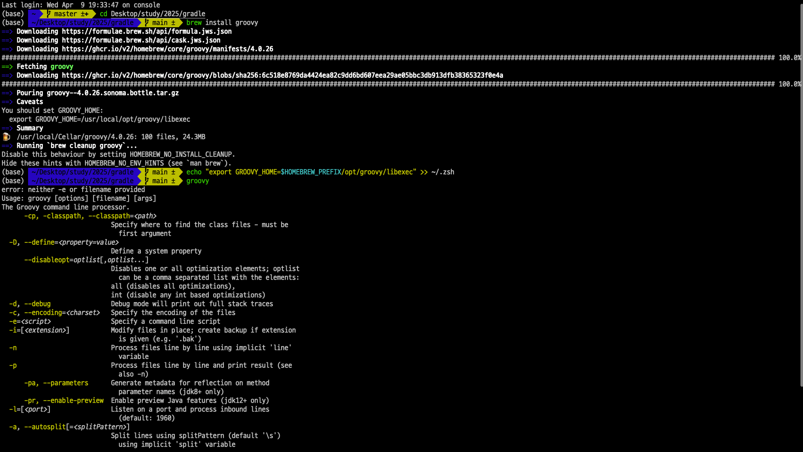

> 해당 블로그 글은 [인프런 강의](https://inf.run/xZG3C)를 바탕으로 쓰여진 글입니다.

## Groovy 설치 및 HelloWorld 만들어보기

해당 포스트는 `Groovy`에 대해 학습을 할 것이다. 우리가 왜 Groovy를 배워야 할까? 이유는 단순하다. Gradle에서 DSL로 Groovy를 택하기 때문이다. 그러면 자세히 한번 보자.

### Groovy란?

Apache Groovy는 선택적 타입 지정이 가능하며, `Java 플랫폼을 위한 동적 스크립트 언어`이다. 스크립팅과 애플리케이션 개발을 모두 지원하는 기능을 갖춘 다목적 언어로 설계되었다.

- `Java 호환성`: Groovy는 Java와 원활하게 통합되며, Groovy 코드 내에서 Java 라이브러리와 프레임워크를 사용할 수 있다. Groovy는 JVM에서 실행되므로 Java에서 Groovy 코드를 호출하거나 그 반대도 가능하다.

- `동적 및 정적 타입 지정`: Groovy는 동적 타입 지정(ex. Python, JavaScript)과 정적 타입 지정(ex. Java) 모두를 지원한다. 이러한 유연성 덕분에 필요에 가장 적합한 타입 안전성 수준을 선택할 수 있다.

- `간결한 구문`: Groovy는 Java보다 더 간결하고 표현력이 풍부한 구문을 가지고 있다. 상용구 코드를 줄여 더 빠르게 작성하고 더 쉽게 읽을 수 있다.
  - Groovy에는 ';'같은 것을 안 붙여도 된다.

- `해석 및 컴파일`: Groovy는 스크립팅 언어와 컴파일 언어 모두로 사용될 수 있으며, 이는 JVM에서 실행되는 바이트코드로 컴파일할 수 있음을 의미한다.
  - Groovy는 Gradle이나 Jenkins pipeline에서 사용된다.

### Groovy의 사용사례

- 빌드 자동화: Groovy는 Gradle과 같은 빌드 도구에서 널리 사용되며, 빌드 구성 언어를 제공하여 빌드 스크립트를 간결하고 표현력 있게 만든다.

- 스크립팅 및 자동화: Groovy는 파일 조작, 데이터 처리, 시스템 관리와 같은 작업을 위한 자동화 스크립트 작성에 인기가 있다.

- 웹 개발: Groovy를 기반으로 한 Grails 프레임워크는 Groovy의 강점을 활용하여 빠른 개발이 가능한 잘 알려진 웹 애플리케이션 프레임워크이다.

- 테스팅: Groovy는 간결한 구문과 강력한 기능 덕분에 테스팅 프레임워크(예: Spock)에서 자주 사용된다.

### 설치

설치는 간단하다. 일단 [Groovy 다운로드 사이트](https://groovy.apache.org/download.html)에 접속한다. 그러면 친절히 어떻게 다운로드 해야하는지 알려준다. 필자는 맥 환경이고 brew를 이용함으로 아래와 같이 명령어를 기입한다.

``` bash
brew install groovy
```

그리고 groovy 관련 환경 설정을 해줘야 한다. zsh 터미널을 이용하는 필자는 [brew 사이트](https://formulae.brew.sh/formula/groovy#default)에서 설명하는 환경설정대로 진행해줬다.

``` bash
echo "https://formulae.brew.sh/formula/groovy#default" >> ~/ .zsh
```

그러면 아래의 사진과 같이 `groovy`라고 치면 명령어들이 막 나올 것이다.



### 실행

간단한 groovy 코드를 작성해보자. 디렉토리를 하나 만들어주고 아래와 같이 groovy파일을 작성하자.

``` groovy
println("Hello World!")
```

> ✅ 참고
>
> 참고로 groovy파일의 확장자는 .groovy이다.

그리고 터미널에 아래와 같이 명령어를 입력하면 실행이 잘 될 것이다.

``` bash
groovy 파일명.groovy
```

## Data Type에 대해서 알아보자

어떠한 프로그래밍이든 그 프로그래밍의 정의 및 장점에 대해 학습하면 다음으로 학습하는 것이 바로 데이터 타입이다. 그럼 Groovy의 데이터 타입에 대해 알아보자.

### 데이터 타입

Groovy는 JVM 기반 언어로, Java의 primitive 타입을 사용하지만 필요에 따라 wrapper 타입도 사용 가능하다.

#### primitive type
- byte: 8-bit 정수 (Byte)

``` groovy
// Byte
byte b = 10;
println "Byte: $b" // 변수를 부를때는 $ 싸인을 붙인다.
println b.class // 해당 변수의 패키지 명을 부를때 .class를 붙인다.
```

- short: 16-bit 정수 (Short)

``` groovy
// Short
short s = 30000
println "Short: $s"
```

- int: 32-bit 정수 (Integer)

``` groovy
// Integer
int i = 100000
println "Integer: $i"
```

- long: 64-bit 정수 (Long)

``` groovy
// Long
long l = 10000000000L
println "Long: $l"
```

- float: 32-bit 부동소수점 (Float)

``` groovy
// Float
float f = 10.5F
println "Float: $f"
```

- double: 64-bit 부동소수점 (Double)

``` groovy
// Double
double d = 20.99
println "Double: $d"
```

- char: 16-bit 유니코드 문자 (Character)

``` groovy
// Character
char c = 'A' // ""나 """도 가능
println "Character: $c"
```

- boolean: 불리언 값 (Boolean)

``` groovy
// Boolean
boolean bool = true
println "Boolean: $bool"
```

#### 레퍼런스 타입

- String: Groovy 문자열은 주로 이중 따옴표(")나 단일 따옴표(')를 사용하며, 여러 줄 문자열에는 삼중 따옴표(""")도 사용할 수 있습니다. Groovy 문자열은 java.lang.String 클래스의 인스턴스이지만, 작업을 위한 더 편리한 구문을 제공한다.

``` groovy
// String
String str = "Hello, Groovy!"
println "String: $str"
```

- BigInteger, BigDecimal: 각각 임의로 큰 정수와 정밀한 십진수 값을 처리하기 위한 타입이다. 이들은 원시 타입의 범위를 벗어나는 숫자를 다룰 때 특히 유용하다. 그런데 실무에서는 과연 쓸까가 의문이다.

``` groovy
// BigInteger
BigInteger bigInt = new BigInteger("12345678901234567890")
println "BigInteger: $bigInt"

// BigDecimal
BigDecimal bigDec = new BigDecimal("12345.6789")
println "BigDecimal: $bigDec"
```

- List: 중복 요소를 포함할 수 있는 순서가 있는 컬렉션이다. Groovy 리스트는 java.util.List의 인스턴스이지만, Groovy는 def list = [1, 2, 3]과 같은 편리한 구문을 추가한다. 해당 구문이 약간 파이썬의 튜플과 비슷한 느낌이다.

``` groovy
// List
List<Integer> list = [1, 2, 3, 4, 5]
println "List: $list"
```

- Map: 순서가 없는 키-값 쌍의 컬렉션. Groovy 맵은 java.util.Map의 인스턴스이며 def map = [key1: value1, key2: value2]와 같은 구문으로 정의할 수 있다. 일종의 파이썬 문법 같으면서 뭔가 좀 달라서 이 부분은 유심히 다시 보자.

``` groovy
// Map
Map<String, Integer> map = [name: 1, age: 25]
println "Map: $map"
```

- Range: 일반적으로 숫자나 문자로 구성된 시작과 끝이 정의된 값의 시퀀스 .. (포함) 또는 ..< (제외)를 사용하여 정의한다. 예를 들어, 1..10은 1부터 10까지의 포함 범위이다. 이 부분도 거의 파이썬 문법을 착안한 느낌이다.

``` groovy
// Range
Range range = 1..5
println "Range: $range"
```

#### 특별한 데이터 타입

- Closure: Groovy의 익명 함수 또는 람다 버전이다. 일종의 js와 유사한 느낌으로 받아들이면 쉬울 것 같다. 클로저는 groovy.lang.Closure의 인스턴스이며 주변 스코프의 변수를 캡처할 수 있다. 중괄호 {}로 정의되며 { param -> println param }과 같이 매개변수를 받을 수 있다.

``` groovy
// Closure
def sayHello = { println "Hello, Groovy!" }
sayHello()

def add = { a1, a2 -> a1 + a2 }
println add(5, 3)

def greet = { name -> println "Hello, $name!" }
greet("Groovy")

// implicit parameter :: 파라미터를 넣어주면 파라미터 선언없이 it로 대체 가능
def square = {it * it}
println square(4)

def greetWithDefault = {name = "Stranger" -> println "Hello, $name!" }
greetWithDefault()
greetWithDefault("Bob")

def operate(a, b, operation) {
  return operation(a, b)
}

def result = operate(4, 5, {x, y -> x + y})
println result
```

- Null: Groovy는 null을 java.lang.Void 타입의 객체로 취급한다. 값의 부재를 나타내는 데 유용하며, Groovy는 안전 탐색 연산자(?.)를 제공하여 NullPointerException을 발생시키지 않고 null을 처리할 수 있다. 안전 탐색 연산자를 보니 해당 부분은 타입스크립트와 유사한 느낌이다.

``` groovy
// Null and Safe Navigation Operator
String nullableString = null
println "Nullable String Length: ${nullableString?.length()}"
```

#### 동적 타이핑

- Groovy는 동적으로 타입이 지정되므로 변수 타입을 명시적으로 선언할 필요가 없다.
- def를 사용하여 타입을 지정하지 않고 변수를 선언할 수 있으며, Groovy가 실행 시간에 타입을 추론한다.

``` groovy
// -- Dynamic Typing with def
def dynamicVar = "I am a string"
println "Dynamic Variable: $dynamicVar (Type: ${dynamicVar.getClass().name})"

dynamicVar = 42
println "Dynamic Variable: $dynamicVar (Type: ${dynamicVar.getClass().name})"

dynamicVar = [1, 2, 3]
println "Dynamic Variable: $dynamicVar (Type: ${dynamicVar.getClass().name})"
```

## Methods에 대해 알아보자

위에서 살펴본 것처럼 `def`라는 키워드를 통해 함수를 만들 수 있다. 하지만 Groovy에서는 다양하게 함수를 만드는 방법이 존재한다.

### 자바처럼

``` groovy
int add1(int a, int b) {
  return a + b // 자바처럼
}

println(add1(a = 3, b = 4))
```

### 파이썬처럼

``` groovy
def add2(int a, int b) {
  return a + b // 파이썬 처럼
}

println(add2(a = 3, b = 4))
```

### 파이썬처럼 + 파라미터 타입 생략(지양)

``` groovy
def add3(a, b) {
  return a + b
}

println(add3(a = 3, b = 4))
```

### 가장 마지막에 작성한 부분이 return(지양)

``` groovy
def add4(a, b) {
  a * b // 이 부분은 스킵
  a + b // 이 부분이 반환
}

println(add4(a = 3, b = 4))
```

### 권장사항

``` groovy
int add5(int a, int b) {
  a + b // return 생략 : 표준
}

println(add5(a = 3, b = 4))
```

## Class에 대해 알아보자

클래스도 자바스크립트나 파이썬과 같은 클래스와 유사한 것 같다.

### Getter & Setter

일반적인 문법은 같으나 조금 신기한 개념이 있다. Groovy의 getter나 setter는 따로 어노테이션을 안 만들어줘도 자동으로 지원을 해준다. 다만 굳이 getter나 setter를 만들면 해당 메서드로 오버라이딩 된다. 또한 getter나 setter할때 `인스턴스명.필드명`으로 호출할 수 있다.

``` groovy
class Person {
  String name
  int age

  // override
  def getName() {
    "My name is ${name}"
  }

  def showDetails() {
    println "Name: $name, Age: $age" 
  }
}

p = new Person(name: 'Joon', age: 40)
p.showDetails()

// getter나 setter에서 가져온다. 다만, 기본 getter와 setter를 만들어주는데 오버라이드 개념으로 선언을 하면 오버라이딩 된 getter나 setter가 가져온다.
println(p.name)
```

### 생성자

생성자도 기본적으로 다른 언어와 유사하다. 코드로 보면 바로 이해가 갈 것이다.

``` groovy
// -- Constructor
class Car {
  String model
  int year

  // Custom Constructor
  Car(String model, int year) {
    this.model = model
    this.year = year
  }
}

def car = new Car("Tesla", 2024)
println "Model: ${car.model}, Year: ${car.year}"
```

### 상속

상속도 마찬가지로 다른 언어와 유사하다.

``` groovy
class Animal {
  def speak() {
    println "Animal sound"
  }
}

class Dog extends Animal {
  @Override
  def speak() {
    println "Bark"
  }
}

def dog = new Dog()
dog.speak()
```

### static method & properties

static 메서드와 변수 또한 사용방법이 같다.

``` groovy
class Calculator {
  static double PI = 3.141592

  static double square(double num) {
    return num * num
  }
}

println Calculator.PI
println Calculator.square(5)
```

## 조건문에 대해 알아보자

조건문도 일종의 자바스크립트와 유사하다. 그러면 한번 살펴보자.

### 조건문

- Groovy에서 if 문은 코드를 조건부로 실행하는 데 사용된다. `if`, `else if`, `else` 절을 지원하며 `boolean`, `number` 및 컬렉션(Groovy는 빈 컬렉션이나 null을 false로 취급함)을 포함한 다양한 타입과 함께 작동할 수 있다.

- Groovy에는 "Groovy Truth"라는 개념이 있으며, 여기서 많은 boolean이 아닌 타입들이 자동으로 true 또는 false로 된다.
  - 숫자: 0은 false 다른 모든 숫자는 true.
  - 문자열: 빈 문자열은 false 비어있지 않은 문자열은 true.
  - 컬렉션: 빈 컬렉션은 false 비어있지 않은 컬렉션은 true.
  - 객체: null은 false 모든 null이 아닌 객체는 true.

## 반복문에 대해 알아보자

반복문도 파이썬과 매우 유사하다.

### fori

자바의 fori와 같은 효과를 보는 groovy 문법을 하고 싶을 때는 아래와 같이 하면 된다.

``` groovy
// Exclusive upper bound
for (i in 1..<5) {
  println "Number (exclusive): $i" // 1, 2, 3, 4까지만 출력
}
```

만약 5까지 출력을 하게 하고 싶으면 아래와 같이 변경하면 된다.

``` groovy
for (i in 1..5) {
  println "Number: $i"
}
```

### iter

이것도 자바의 iter과 같은 효과를 보는 문법이 있다. 아래와 같이 하면 된다.

``` groovy
def fruits = ['Apple', 'Banana', 'Cherry']

for (fruit in fruits) {
  println fruit
}
```

Map을 이용할 때는 아래와 같이 할 수 있다.

``` groovy
def colors = [red: '#FF000', green: '#00FF00', blue: '#0000FF']

for (color in colors) {
  println "${color.key}: ${color.value}"
}
```

### 자바스크립트의 for-each 방법

자바스크립트처럼 for-each처럼 사용 가능한 방법이 있다. 한번 살펴보자.

``` groovy
colors.each {key, value ->
  println "$key: $value"
}

println ""

fruits.each { fruit ->
  println fruit
}
```

만약 인덱스도 같이 사용하고 싶은데 해당 문법처럼 사용하려면 `eachWithIndex`를 이용하여 아래와 같이 변경하면 된다.

``` groovy
fruits.eachWithIndex { fruit, index ->
  println "Fruit at index $index: $fruit"
}
```

> 잘못된 지식이 있을 경우 댓글로 남겨주시면 빠르게 반영하겠습니다!
