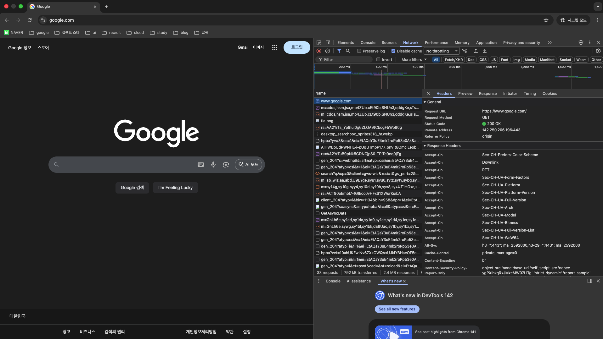
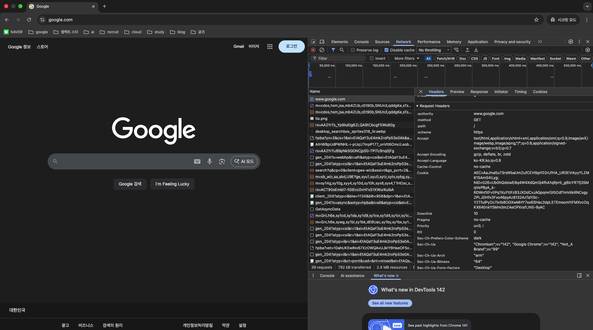
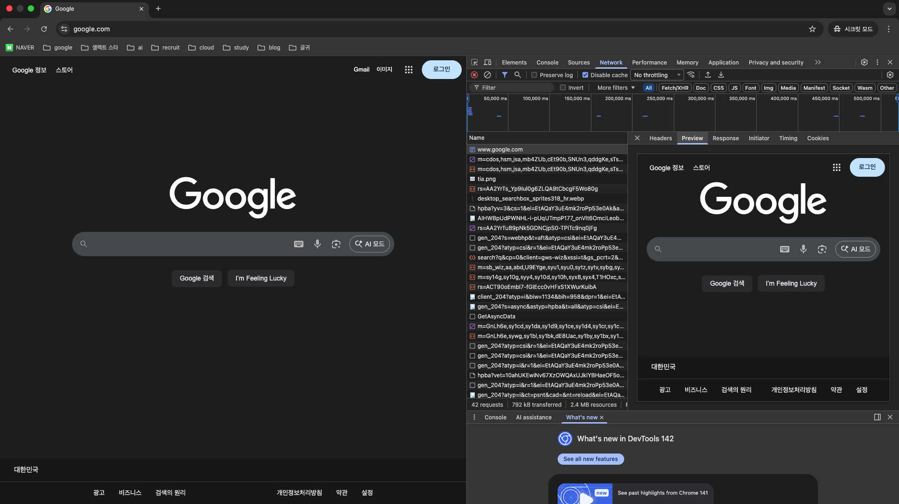
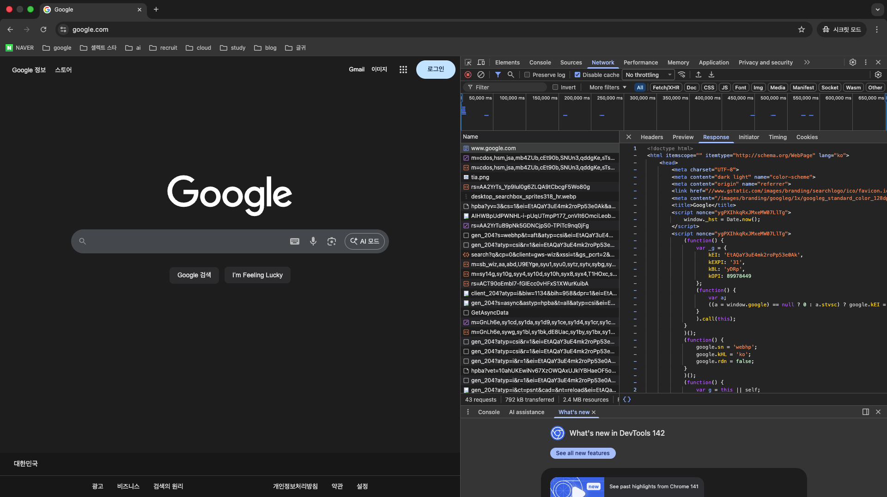
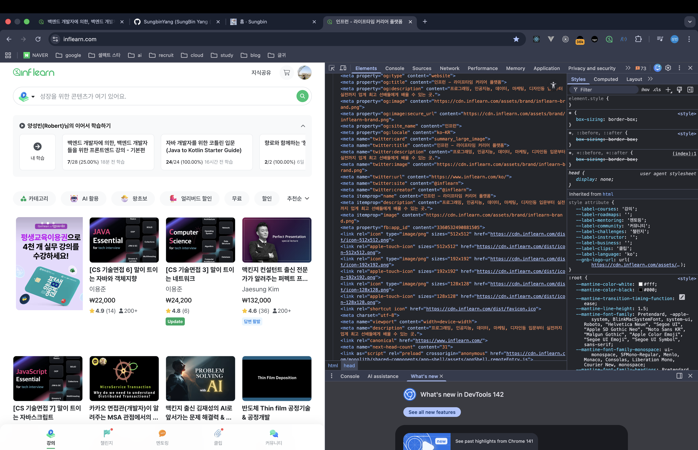
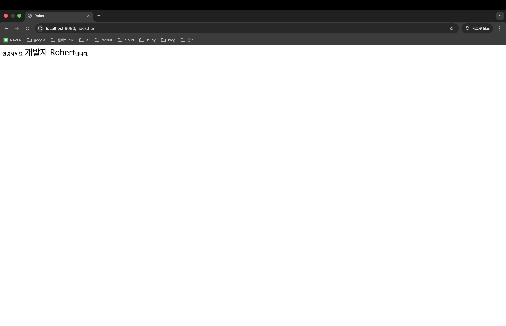
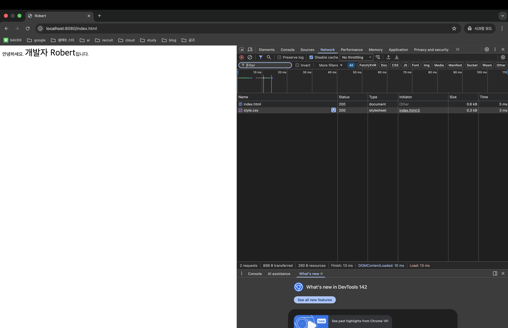
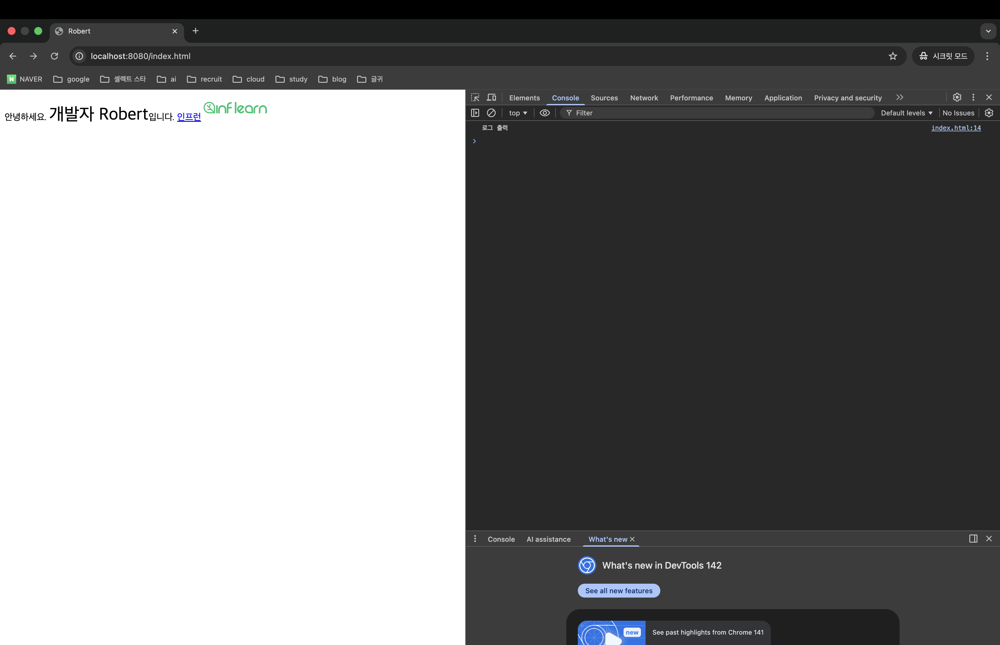

> 해당 포스팅은 인프런의 [백엔드 개발자에 의한, 백엔드 개발자들을 위한 프론트엔드 강의 - 기본편](https://inf.run/DQ8mU)를 참조하여 만들었습니다.


## HTML의 기본 구조

지금부터 프론트엔드 코드 작성 방법에 대해 알아보도록 하겠다. 지금부터 웹 브라우저와 HTML 문서의 관계, 그리고 HTML의 기본 구조에 대해 알아보도록 하겠다.

### 웹 브라우저와 HTML

먼저 HTML 문서가 어디서 사용되는지 알아보자. 특히, HTML 문서가 서버와 웹 브라우저 사이에서 어떻게 사용되고 있고 그것을 가리키는 용어는 각각 무엇인지 알아 볼 필요가 있을 것이다.

우리는 웹 서비스를 사용할 때 웹 브라우저를 사용한다. 사용자가 웹 브라우저에서 특정 URL을 접속하거나 링크를 누르면 HTTP 요청이 서버쪽으로 날아간다. 그럼 웹 서버는 이 HTTP 요청을 받아서 HTTP 요청에 대응되는 HTML 문서를 서버에서 찾아낸다. 그리고 그 HTML 문서를 HTTP 응답에 포함시켜주는 것이다. 그럼 웹 브라우저는 그 응답에 포함된 HTML 문서를 읽어와서 정해진 문법에 맞게 화면에 그려낸다. 이렇게 HTML 코드를 화면에 그리는 과정을 전문용어로 '렌더링'한다라고 표현한다. 이런 과정을 웹 브라우저에서 직접 확인이 가능하다. 바로 **개발자 도구**를 이용해보면 된다.



웹 페이지에 접속을 하고 F12버튼을 누르면 위와 같이 사이드 바에 탭이 하나 열리는 것을 볼 수 있다. 여기서 Network 탭으로 접속해 다시 새로고침을 해보면 뭔가 여러 파일들이 쭉 나오는 것을 볼 수 있다. 여기서 제일 처음것을 눌러보면 알 듯이 이거 하나하나가 HTTP 요청과 응답이라고 보면 좋을 것이다. 이 2개를 묶어서 HTTP 트랜잭션이라고도 부른다. 그리고 이 HTTP 트랜잭션 하나를 눌렀을 때 오른쪽에는 이 HTTP 트랜잭션에 해당하는 HTTP 요청과 응답이 각각 나와있다.


하나의 HTTP 트랜잭션을 열어보면 여러개의 탭들이 존재하는데 Headers, Preview, Response 이렇게 3가지만 보도록 하겠다. 먼저 headers에서 general이라고 되어 있는 이 부분은 요청과 응답 헤더 중애서 자주 사용되는 헤더들 중요한 헤더들을 모아서 보여주는 것이다. 아래 쪽의 response headers는 응답에 대한 헤더들이 나와 있다.



아래로 스크롤을 좀 더 내려보면 위와 같이 request headers도 보이는 것을 알 수 있다.



다음으로 preview 탭으로 가보면 위와 같이 우리가 지금 보고 있는 해당 웹 페이지를 보여주고 있다. 즉, 해당 HTTP 트랜잭션을 통해 받아온 정보를 미리보기로 보여주는 것을 의미한다. 또한, HTML 문서만 보여주기 때문에 일부 이미지를 로드해야한다던지 CSS를 로드해야 하는 행위는 다른 트랜잭션에서 진행할 수 있으므로 깨지는 화면이 보이는 경우도 존재한다.



preview에 그려진 HTML 문서가 궁금할 때는 위와 같이 response 탭을 클릭하면 어떤 응답이 내려왔는지 알 수 있다. 이렇게 개발자 도구를 보면서 확인해볼 수 있었던 것처럼 HTML 문서 내에 포함되어 있는 자바스크립트나 CSS, 이미지등 다른 요소들은 웹 브라우저가 자동으로 해당 요소들을 요청해서 사용자에게는 HTML 문서에 CSS나 Javascript 그리고 이미지가 포함된 웹페이지를 하나로 렌더링 해서 보여주는 것이다.

### HTML은 태그로 이루어져 있다.

``` html
<form action="./article" method="post">
    <input type="text" name="title" />
    <input type="text" name="content" />
    <input type="submit" />
</form>
```

다음으로 HTML의 문법적인 특징에 대해 알아보도록 하자. Java와 같은 프로그래밍 언어에서 문법의 기초를 이루는 건 세미콜론(;) 단위로 나뉘는 하나하나의 문장 실행문이라고 부른다. 반면 HTML에서의 문법은 기본적으로 태그 단위로 나뉜다. 위의 코드가 대표적인 HTML 예시이다. 위의 코드를 보면 `form`이라는 태그가 존재하고 그 태그 안에 `input`이라는 태그가 3개 들어가져 있는 형태이다. 특징을 보면 이렇게 끝나는 부분에 slash를 하고 태그 이름으로 나와 있는 부분이 존재한다. 이런 태그를 닫는 태그라고 부르며 form 태그는 여는 태그와 닫는 태그가 있는 반면에 input 태그는 여는 태그와 닫는 태그로 존재하지 않고 하나의 태그로만으로 존재한다. 이런게 몇개 존재하는데 실제 적용해보면 많이 익숙해질 것이다.

### HTML 태그 용어

``` html
<form action="./article" method="post">
    <input type="text" name="title" />
    <input type="text" name="content" />
    <input type="submit" />
</form>
```

HTML 태그 용어는 계속 등장하기 때문에 알아가보자.

- 태그 이름: 태그의 가장 앞에 온다. 특정 태그가 어떤 태그인지 결정하는데 가장 중요한게 바로 이 태그의 이름이다. ex. form
- 태그의 속성과 값: 태그의 구체적인 특징을 결정 짓는 것이다. 이 속성은 보통 attribute라고 부르는 경우가 더 많아서 혼용해서 사용하는 점 유의하면 좋을 것 같다. 그리고 이 각각의 속성에는 값이 매핑되는 형태이다. 즉, 속성의 이름이 나오고 그리고 등호가 나오고 그리고 큰 따옴표로 감싸지는 형태이다. ex. action="./article", method="post"

### HTML 문서의 기본 구조

``` html
<html>
    <head></head>
    <body>

    </body>
</html>
```

HTML이 태그 단위로 이루어져 있고 기본적인 용어도 알아보았다. 다음으로 HTML 문서가 어떤 구조를 가지고 있는지 알아보면 좋을 것이다. HTML 문서는 기본적으로 위와 같은 형태로 존재한다. 가장 최상단에는 html이라는 태그로 시작을 진행한다. 모든 HTML의 다른 태그들은 이 HTML 태그 안쪽에 존재한다. 그리고 이 HTML 태그 안에 head와 body 태그가 위치한다. 각각의 태그가 무엇을 하는지는 추후에 알아보도록 하자.

``` html
<!DOCTYPE html>
<html>
    <head></head>
    <body>

    </body>
</html>
```

그런데 이런 식으로 html 태그보다 위에 DocType이라고 되어 있는 태그를 볼 수 있는데 이 태그는 DocType이라는 선언으로 HTML 태그의 일부라기 보다는 이 HTML 문서가 어떤 문법으로 해석되어야 하는지를 정의한다. 마치 자바의 버전이 있는 것처럼 HTML 문서의 버전을 의미한다. HTML도 발전을 해오면서 여러가지 버전이 존재하였는데 현재 가장 널리 알려진 버전은 HTML5이다. 위의 `<!DOCTYPE html>`이 HTML5를 의미하는 것이다.

### <head>

head 태그는 HTML 문서를 설명하기 위한 데이터가 주로 들어간다. 이를 메타 데이터라고 부르는데 메타 데이터는 데이터를 설명하기 위한 데이터라고 보묜 좋을 것 같다. head 태그 안에는 여러 태그들이 존재하는데 주요 태그로는 아래와 같다.

- <title>
- <meta>
- <link>

### <body>

다음은 body 태그에 대해 알아보자. 우리가 앞으로 작성해야 할 프론트엔드 코드는 해당 body 태그 안에서 작성할 것이다. body에 작성하게 되는 태그들은 보통 웹 브라우저에 실제로 보이는 것들이다. body에 들어가는 태그는 아주 많은데 아래 3가지 정도만 일단 살펴보도록 하겠다.

- <a>
- 
- <script>

### 주석

``` html
<form action="./article" method="post">
    <input type="text" name="title" />
    <input type="text" name="content" />
    <input type="submit" />
</form>

<!-- 주석 -->
```

HTML도 주석이 존재한다. 주석은 보통 `<!-- -->`로 형태로 작성을 한다.

## head 태그에 포함되는 주요 태그들

이번에는 HTML의 head 태그에 포함된 주요 태그들에 대해 알아보도록 하자. head 태그의 위치는 html 태그 안의 최상단에 위치한다. 그러면 head 태그 안에서 사용하는 주요 태그에 대해 알아보도록 하자.

### title

title 태그는 웹 브라우저에 표시되는 해당 웹 페이지의 제목을 지정할 수 있는 태그이다. title 태그를 사용하면 이 페이지가 어떤 페이지인지 알 수 있다. 그러면 한번 코드로 살펴보자.

``` html
<!DOCTYPE html>
<html lang="ko">
<head>
    <meta charset="UTF-8">
    <title>Robert</title>
</head>
<body>

</body>
</html>
```

위와 같은 코드에 title 태그의 원하는 이름으로 바꿔보고 실행을 했을 때 잘 반영되었는지 확인해보면 좋을 것이다.

### meta

다음은 meta 태그에 대해 알아보도록 하자. meta 태그의 속성은 뭘 사용하느냐에 따라 아주 많은 기능을 사용할 수 있다. 여기서는 대략 2가지 정도를 설명드리고 싶다. meta 태그로 할 수 있는 일 중 하나는 웹 페이지의 **인코딩**에 대한 내용이고 다른 하나는 **검색 엔진을 위해 이 웹 페이지가 어떤 페이지인지 설명**하는 기능이 존재한다. 여기서 실습으로 볼 것은 인코딩에 대한 내용이고 검색 엔진에 대한 내용은 개발자 도구를 통해 알아보도록 하자.

``` html
<!DOCTYPE html>
<html lang="ko">
<head>
    <meta charset="UTF-8">
    <title>Robert</title>
</head>
<body>

</body>
</html>
```

먼저 인코딩에 대해 설명해보도록 하겠다. 위의 코드에서 `charset`이라는 속성으로 UTF-8이라는 문자열을 넣어주고 있다. 문자열 UTF-8은 인코딩 방식 중 하나인데 현재 거의 표준처럼 사용하고 있는 인코딩 방식이다. 우리가 어떤 웹 어플리케이션을 개발을 할 때 인코딩 방식을 정해야 한다면 그때는 반드시 UTF-8을 사용해야 한다.

> 📝 용어 정리
>
> 인코딩: 어떤 파일에 대한 내용을 기록할 때 어떤 방식으로 이 파일의 내용을 기록할 것인가에 대한 내용이다.

예를 들어, 한글을 저장할 때 어떤 인코딩 방식은 2바이트를 쓸 수 있고 어떤 인코딩 방식은 3바이트를 쓸 수 있다. 그런데 그런 방식 중 하나의 일종이 UTF-8인 것이고 기존에 우리가 많이 쓰던 방식이 있는데 그것이 EUC-KR 방식이다.

이렇게 인코딩 종류가 있는데 만약 서로 다른 인코딩으로 적혀져 있다면 어떻게 될까? 만약 위의 코드를 다른 인코딩으로 하면 어떻게 될까? 위의 html 파일은 UTF-8로 해석을 하려고 하지만 만약 인코딩 방식을 다른 인코딩 방식으로 하면 어떻게 될까? 직접 실습해보시면 알겠지만 내용 중에 한글 내용이 깨지는 것을 알 수 있을 것이다. 이렇게 깨진 경우에는 2가지 방식이 있다. 파일 인코딩 체계를 변경해주던가 meta 태그의 charset을 인코딩한 방식으로 변경해주면 된다.



그리고 위와 같이 인프런 홈페이지에 개발자 도구를 열어서 head 태그 안에 meta 태그를 보면 검색 엔진 관련 태그들이 있는 것을 확인해 볼 수 있다.

### link

link 태그는 html 파일에 css 파일들을 적용하기 위해 사용되는 태그이다. HTML 문서에 link 태그가 존재한다면 웹 브라우저는 해당 파일을 다운로드 하여 css 속성으로 페이지에 적용을 한다. 그러면 한번 실습을 해보도록 하자.

``` html
<!DOCTYPE html>
<html lang="ko">
<head>
    <meta charset="UTF-8">
    <link rel="stylesheet" href="./style.css">
    <title>Robert</title>
</head>
<body>
    안녕하세요. <span class="custom-style">개발자 Robert</span>입니다.
</body>
</html>
```

``` css
.custom-style {
    font-size: 30px;
}
```

위와 같이 코드를 작성해보자. link 태그로 속성 rel에 stylesheet를 주면 css를 정의할 것이다라는 의미이고 href 속성을 주면 해당 css 파일의 경로를 찾아서 웹 브라우저가 다운로드를 해준다. 그리고 body안에 span 태그로 class라는 속성을 주어 원하는 네임을 정의를 해주었고 그 네이밍으로 css에 스타일을 정의를 해주었다.

> css에 .이라는 의미는 class라는 속성을 찾아라라는 의미이다.

그리고 스프링 애플리케이션을 실행하면 아마 아래와 같이 스타일이 적용된 페이지를 볼 수 있을 것이다.



여기서 더 하나 알아가보면 꼭 css를 외부 파일에 정의하고 해야하는 것은 아니다. 아래처럼 style 태그를 head 태그 안에 정의를 하고 그 안에 css를 정의해도 괜찮다.

``` html
<!DOCTYPE html>
<html lang="ko">
<head>
    <meta charset="UTF-8">
    <style>
        .custom-style {
            font-size: 30px;
        }
    </style>
    <title>Robert</title>
</head>
<body>
    안녕하세요. <span class="custom-style">개발자 Robert</span>입니다.
</body>
</html>
```

자, 그러면 이렇게 내부에 css를 정의하는 방식 말고 이전에 봤던 파일에 정의하고 불러오는 방식에는 조금 특별한 차이가 있다. 바로 css 문서를 불러오는 과정에서 HTTP 트랜잭션이 하나 더 날라가는 효과를 볼 수 있다. 바로 아래처럼 말이다.



위의 네트워크 탭을 보면 index.html은 네트워크 상태가 200이 날라온 것을 볼 수 있다. 그런데 style.css는 304가 나왔다. 304 상태 코드는 해당 파일이 캐시가 되어 있는 경우 해당 네트워크 상태가 나올 수가 있다.

## body 태그에 포함되는 주요 태그들

다음으로 body 태그 안에 포함된 주요 태그들에 대해 살펴보도록 하자. body 태그는 html 태그 안에 가장 하단에 위치를 한다. HTML 문서에서 실제 보이는 부분을 담당하는 태그로 UI를 개발하는 경우 head 태그보다는 주로 이 body 태그 내에서 코드를 작성한다. 화면에 표현할 수 있는 요소가 매우 다양하기 때문에 body 안에 사용할 수 있는 태그는 정말 다양하지만 이번에는 a, img, script 3가지 태그에 대해서만 알아보도록 하겠다.

### a

a 태그는 다른 페이지로 연결하는 링크를 만드는 태그이다. 이렇게 페이지 사이를 이동하는 것이야 말로 웹에 근간이 되는 정보 탐색 방식이라 할 수 있다. 어느 페이지에 포함된 링크를 타고 다른 페이지로 이동하는 건 개발자가 아닌 다른 사람에게도 익숙한 행동이다. 그리고 그걸 가능하게 해주는 태그가 바로 a 태그이다. 그러면 한번 실습을 해보자.

``` html
<!DOCTYPE html>
<html lang="ko">
<head>
    <meta charset="UTF-8">
    <link rel="stylesheet" href="./style.css">
    <title>Robert</title>
</head>
<body>
    안녕하세요. <span class="custom-style">개발자 Robert</span>입니다.
    <a href="https://www.inflearn.com">인프런</a>
</body>
</html>
```

위와 같이 a 태그를 정의하고 href 속성으로 연결할 링크를 걸어둔다. 그리고 a 태그 안에 다른 태그나 텍스트를 넣을 수 있다. 마치 하이퍼 링크와 같은 개념이라 생각하면 쉬울 것이다. 화면은 아래와 같을 것이다. 화면을 보면 위의 내 소개 문구와 하이퍼 링크가 1줄로 되어 있는 것을 알 수 있을 것이다. 우리가 코드에 개행을 했지만 개행이 적용이 되지 않았다. 그 이유는 HTML에는 개행을 시켜주는 태그가 따로 존재한다. 일단 이것은 나중에 알아보도록 하자.


그런데 실습해 본 독자들은 알겠지만 링크를 클릭하면 원래 있던 창이 없어지고 그 창으로 새로운 페이지로 이동됨을 알 수 있을 것이다. 우리가 생각해보면 어떤 링크는 이처럼 해당 탭에서 새로운 페이지로 변하기도 하지만 어떤 링크는 새 탭이 열려서 나오는 경우도 존재한다. 그것을 결정하는 것은 a 태그의 속성을 지정해주면 된다.

``` html
<!DOCTYPE html>
<html lang="ko">
<head>
    <meta charset="UTF-8">
    <link rel="stylesheet" href="./style.css">
    <title>Robert</title>
</head>
<body>
    안녕하세요. <span class="custom-style">개발자 Robert</span>입니다.
    <a href="https://www.inflearn.com" target="_blank">인프런</a>
</body>
</html>
```

위와 같이 a 태그의 target이라는 속성을 주고 그 값으로 _blank라는 값을 주면 해당 링크를 클릭했을 때 새 창으로 링크 페이지가 열리는 것을 볼 수 있을 것이다.

### img

img 태그는 간단하다. 그냥 이미지를 보여주는 태그이다. 우리가 웹 서비스를 이용하다 보면 이미지를 많이 볼 수 있는데 그 이미지를 웹 페이지에 넣을 수 있는 태그이다. 그러면 한번 실습을 해보자.

``` html
<!DOCTYPE html>
<html lang="ko">
<head>
    <meta charset="UTF-8">
    <link rel="stylesheet" href="./style.css">
    <title>Robert</title>
</head>
<body>
    안녕하세요. <span class="custom-style">개발자 Robert</span>입니다.
    <a href="https://www.inflearn.com" target="_blank">인프런</a>
    
</body>
</html>
```

위와 같이 img 태그에 src 속성에 이미지 경로를 적어주고 alt 속성은 해당 이미지를 불러오는게 실패했을 경우 대체 텍스트로 보여주는 것을 의미한다.

### script

다음으로 script 태그에 대해 알아보자. script 태그는 자바스크립트 코드를 넣을 수 있는 태그이다. 자바스크립트 코드를 직접 넣는 것도 가능하고 css처럼 자바스크립트 코드를 외부에 받아와서 실행할 수 있다. 그러면 한번 실습을 해보자.

``` html
<!DOCTYPE html>
<html lang="ko">
<head>
    <meta charset="UTF-8">
    <link rel="stylesheet" href="./style.css">
    <title>Robert</title>
</head>
<body>
안녕하세요. <span class="custom-style">개발자 Robert</span>입니다.
<a href="https://www.inflearn.com" target="_blank">인프런</a>


<script>
    console.log('로그 출력');
</script>
</body>
</html>
```

위의 코드를 작성하고 한번 잘 작동 되는지 알아보자. `console.log`는 마치 자바의 `System.out.println`과 같은 것이다.



스프링 어플리케이션을 다시 실행하고 개발자 도구에 콘솔 탭에 가보면 로그가 잘 찍힌 것을 볼 수 있을 것이다.