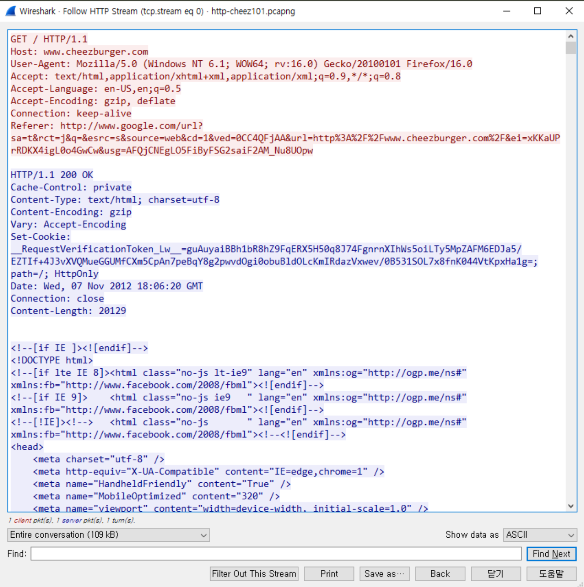

> 해당 블로그 글은 [영한님의 인프런 강의](https://inf.run/vskmA)를 바탕으로 쓰여진 글입니다.

## HTTP 기본 이론

### HTTP 시작

웹은 기본적으로 클라이언트 서버 구조로 이루어져 있다. 클라이언트가 무언가 요청을 보내면 서버가 그 요청을 확인해서 내부적으로 처리 후 응답을 보낼 께 있으면 응답을 내려준다. 이 구조를 클라이언트 서버 구조라고도 부르지만 request-response 구조라고도 부른다.

### 모든 것이 HTTP

HTTP 메세지에는 모든 것을 전송할 수 있다. 대표적으로 아래와 같다.

- HTML, TEXT
- IMAGE, 음성, 영상, 파일
- JSON, XML
- 거의 모든 형태의 데이터 전송 가능
- 서버 간 데이터를 주고 받을 때도 HTTP를 사용한다.

### HTTP 메세지

HTTP 메세지는 요청 메세지와 응답 메세지로 나뉜다.

#### 요청 메세지

요청 메세지의 형식은 아래와 같다.

``` http
GET /search?q=hello&hl=ko HTTP/1.1
HOST www.google.com

```

#### 응답 메세지

응답 메세지의 형식은 아래와 같다.

``` http
HTTP/1.1 200 OK
Content-Type: text/html;charset=UTF-8
Content-Length: 3423

<html>
    <body></body>
</html>
```

기본적으로 메세지 구조는 시작라인 + 헤더 + 공백 라인(CRLF) + message body로 이루어진다.

### 시작 라인

``` http
GET /search?q=hello&hl=ko HTTP/1.1
HOST www.google.com

```

#### 요청 메세지 - HTTP 메서드

- 종류: GET, POST, PUT, DELETE...
- 서버가 수행해야 할 동작 지정
    - GET: 리소스 조회
    - POST: 요청 내역 처리(ex. 회원가입..)

#### 요청 메세지 - 요청 대상

- absolute-path[?query]
- 절대경로="/"로 시작하는 경로
- 쿼리: key1=value1&key2=value2 형식으로 데이터 전달

#### 요청 메세지 - HTTP 버전

- HTTP 버전 정보가 담기며 대부분 HTTP/1.1이다.

#### 응답 메세지

``` http
HTTP/1.1 200 OK
Content-Type: text/html;charset=UTF-8
Content-Length: 3423

<html>
    <body></body>
</html>
```

- HTTP 버전
- HTTP 상태 코드: 요청 성공 혹은 실패를 나타냄
    - 200: 성공
    - 400: 클라이언트 요청 오류
    - 404: 요청 리소스 없음
    - 500: 서버 내부 오류
- 이유 문구: 사람이 이해할 수 있는 짧은 상태의 코드 설명 글

### HTTP 헤더

#### 용도

- HTTP 전송에 필요한 모든 부가 정보
- name: value(필드 이름은 대소문자 구분 X)
- ex. 메세지 바디 내용, 메세지 바디 크기, 압축, 인증, 요청 클라이언트 정보...
- 필요 시, 임의의 헤더 추가 가능

#### HTTP 메세지 바디

- 실제 전송할 데이터
- HTML 문서, 이미지, 영상, JSON등 byte로 표현할 수 있는 모든 데이터 전송 가능

## HTTP 메서드

### HTTP 메서드 종류

- GET: 리소스 조회
- POST: 요청 데이터 처리, 주로 등록에 사용

### GET

- 리소스 조회
- 서버에 전달하고 싶은 데이터는 query를 통해 전달
- 메세지 바디는 사용X

### POST

- 요청 데이터 처리
- 메세지 바디를 통해 서버로 요청 데이터 전달
- 서버는 요청 데이터 처리
    - 메세지 바디를 통해 들어온 데이터를 처리하는 모든 기능을 수행한다.
- 주로 전달된 데이터로 신규 리소스 등록, 프로세스 처리에 사용

그러면 조금 더 HTTP를 자세히 살펴보자.

### HTTP
- HTTP는 HTML문서를 전송받기 위해 만들어진 응용프로그램 계층 통신 프로토콜이다.
- 1996년에 1.0스펙이 발표되었으며, 1999년 6월에 1.1이 발표되었다.
- 기본적으로 클라이언트의 요청에 대응하는 응답형식으로 작동한다.
- 헤더는 다음과 같이 분류된다.
  * 일반 헤더
  * 요청 헤더
  * 응답 헤더
  * 엔티티 헤더
- 요청에 사용되는 메서드는 주로 GET, POST이다.

HTTP는 HTML문서를 전송하고 전송받기 위해 만들어진 L7 프로토콜이다. 핵심은 헤더이다. 헤더는 TCP/IP에서 이야기가 많이 나왔다. 어떤 단위로 데이터다 잘라지는데 IP 네트워크인 경우 최대 MTU로 잘라진다. 그래서 이 MTU에 IP Header가 나오고 그 뒤에 Payload가 온다. 중요한 것은 단위 데이터로 잘라지다 보니 끊어서 생각하기 좋았는데 L5이상은 socket 통신을 하고 socket통신의 데이터는 stream 데이터이다. 즉, 시작은 있는데 끝은 해석을 좀 해봐야 한다. 그 해석하는 규정이 HTTP에 들어있다. 그런데 문제가 뭐냐면 프로토콜이 TCP/IP일때는 16진수로 나왔는데 HTTP는 전부 문자열 형태로 되어있다. 심지어 header부분도 문자열로 되어있어서 우리가 직관적으로 이해하기 너무 쉽다. 그래서 HTTP header안에는 무엇이 있고 이 부분을 자세히 공부해야 하는데 너무 방대함으로 핵심적인 부분만 살펴보자.

일단 기본원리는 간단하다. 무언가 요청하고 응답하고 이 구조인데 여기서 요청이 무엇이냐면 HTML문서를 요청하는 것이고 HTML문서를 응답하는 구조로 날라온다.

> 사실 HTML문서뿐만 아니라 이미지, json등 이런 문서들이 올 수 있는데 편의상 HTML문서라고 이야기하자.

요청이란것을 할 때 요청방법들이 있는데 이것을 메서드라고 하고 주로 문자열 형태로 GET 혹은 POST가 존재한다. GET은 말 그대로 달라는 것이고 POST도 GET과 유사하게 달라는 것인데 차이는 일단 POST는 방향성 자체가 다르다. GET은 일종의 다운로드 개념이라면 POST는 업로드 개념으로 클라이언트에서 서버로 날라간다라는 개념이 더 크다.

### HTTP 트래픽



와이어 샤크나 포스트맨 프로그램으로 HTTP 메서드를 확인해보면 위의 그림과 같다.

- request
  * requset url: ex) /
  * HTTP version: ex) HTTP 1.1
  * host: ex) www.cheezburger.com
  * user-agent: 요청자가 어떤 브라우저로 어떤 OS로 요청을 했는지 정보 표기
  * Accept: 이 요청이 어떤 형식으로만 받을지 표기
  * Accept-language: 요청을 보낼때 어떤 언어표기로만 보낼지 표기
  * Accept-Encoding: 인코딩 체계
  * Refer: 이 요청을 어떤 url로부터 타고 요청을 하는지 표기
- response
  * HTTP version: ex) HTTP 1.1
  * HTTP Status: 응답 상태를 나타낸다. ex) 200 OK
  * Content-Type: 응답한 문서가 어떤 형식인지 표기
  * Content-Encoding: 인코딩 체계
  * Set-Cookie: http-only cookie를 저장할때 이 곳에 저장을 하며 주로 jwt refresh token값을 저장한다.
  * Date: 송신할때 날짜를 표기
  * Content-Length: 응답한 문서의 byte 길이

### HTTP Method

- GET: 일종의 다운로드 개념에 가깝다. ex) 다운로드
- POST: 일종의 업로드 개념과 가깝다. ex) 업로드, 회원가입, 로그인등..
- HEAD: 뭔가를 보낼때 데이터 영역을 제외하고 보낼때 사용
- TRACE
- PUT: 어떤 데이터나 문서를 갱신할때 사용
- DELETE: 어떤 데이터나 문서를 지울때 사용
- OPTIONS
- CONNECT

### HTTP 응답코드

- 200 OK: 요청이 정상적으로 처리됨
- 201 CREATE: 요청에 대한 새로운 자원을 생성하는데 성공함
- 301 MOVED PERMANENTLY
- 302 FOUND
- 400 BAD REQUEST: HTTP규약에 맞지 않은 요청
- 403 Forbidden: 권한이 없거나 잘못된 파일 실행 접근시도
- 404 NOT FOUND: 클라이언트에서 서버쪽으로 특정 resource에 대한 request를 보내는데 해당 resource가 없을 경우
- 500 INTERNAL SERVER ERROR: 내부 오류때문에 요청을 처리하지 못할때

> 잘못된 지식이 있을 경우 댓글로 남겨주시면 빠르게 반영하겠습니다!