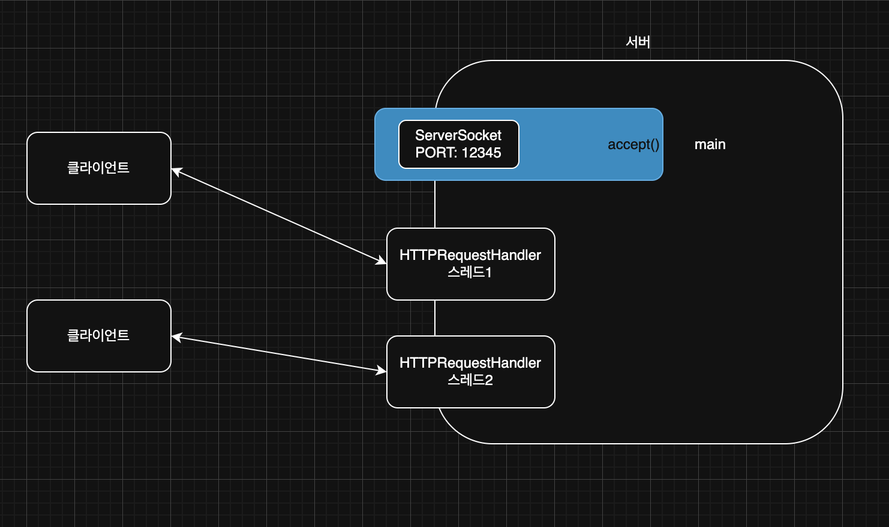
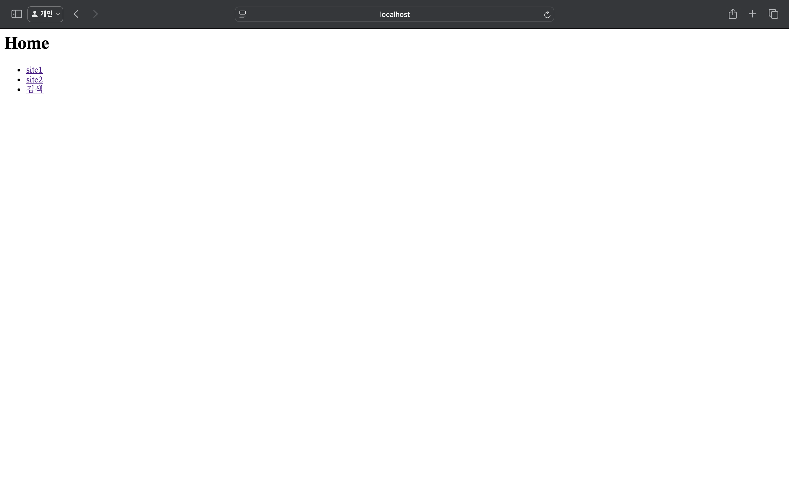
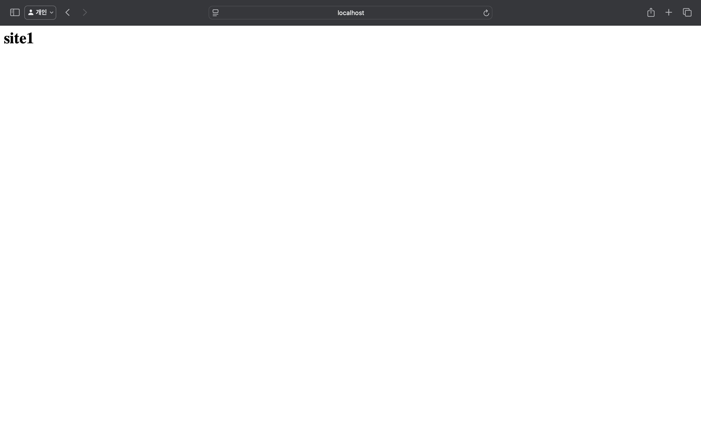
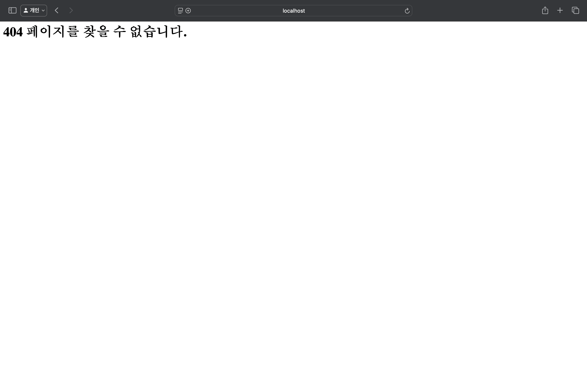

> 해당 블로그 글은 [영한님의 인프런 강의](https://inf.run/vskmA)를 바탕으로 쓰여진 글입니다.

## HTTP 서버1 - 시작

HTTP 서버를 직접 만들어보자. 우리가 구현하는 HTTP 서버는 웹 브라우저에 접속하면 아래와 같은 html이 나오게끔 할 것이다.

``` html
<h1>Hello World</h1>
```

그럼 코드를 작성해보자.

``` java
package was.v1;

import java.io.BufferedReader;
import java.io.IOException;
import java.io.InputStreamReader;
import java.io.PrintWriter;
import java.net.ServerSocket;
import java.net.Socket;

import static java.nio.charset.StandardCharsets.UTF_8;
import static util.MyLogger.log;

public class HttpServerV1 {

    private final int port;

    public HttpServerV1(int port) {
        this.port = port;
    }

    public void start() throws IOException {
        ServerSocket serverSocket = new ServerSocket(port);
        log("서버 시작 port: " + port);

        while (true) {
            Socket socket = serverSocket.accept();
            process(socket);
        }
    }

    private void process(Socket socket) throws IOException {
        try (socket;
             BufferedReader reader = new BufferedReader(new InputStreamReader(socket.getInputStream(), UTF_8));
             PrintWriter writer = new PrintWriter(socket.getOutputStream(), false, UTF_8)) {
            String requestString = requestString(reader);

            if (requestString.contains("/favicon.ico")) {
                log("favicon 요청");
                return;
            }

            log("HTTP 요청 정보 출력");
            System.out.println(requestString);

            log("HTTP 응답 생성 중...");
            sleep(5000);
            responseToClient(writer);
            log("HTTP 응답 전달 완료");
        }
    }

    private String requestString(BufferedReader reader) throws IOException {
        StringBuilder sb = new StringBuilder();
        String line;
        while ((line = reader.readLine()) != null) {
            if (line.isEmpty()) {
                break;
            }

            sb.append(line).append("\n");
        }
        return sb.toString();
    }

    private void responseToClient(PrintWriter writer) {
        String body = "<h1>Hello World</h1>";
        int length = body.getBytes(UTF_8).length;
        StringBuilder sb = new StringBuilder();

        sb.append("HTTP/1.1 200 OK\r\n");
        sb.append("Content-Type: text/html\r\n");
        sb.append("Content-Length: ").append(length).append("\r\n");
        sb.append("\r\n");
        sb.append(body);

        log("HTTP 응답 정보 출력");
        System.out.println(sb);

        writer.println(sb);
        writer.flush();
    }

    private void sleep(int millis) {
        try {
            Thread.sleep(millis);
        } catch (InterruptedException e) {
            throw new RuntimeException(e);
        }
    }
}
```

- HTTP 메시지의 주요 내용들은 문자로 읽고 쓰게 된다.
- 따라서 여기서는 `BufferedReader`,`PrintWriter`를 사용했다.
  - 해당 클래스들을 쓰는 이유는 HTTP 규약을 한줄 라인으로 읽고 써야하는데 해당 클래스들이 편리한 기능들을 제공하기 때문이다.
- `Stream`을 `Reader`,`Writer`로 변경할 때는 항상 인코딩을 확인하자.

### Auto Flush

``` java
new PrintWriter(socket.getOutputStream(), false, UTF_8)
```

- `PrintWriter`의 두 번째 인자는 `autoFlush` 여부이다.
- 이 값을 `true`로 설정하면 `println()`으로 출력할 때 마다 자동으로 플러시 된다.
  - 첫 내용을 빠르게 전송할 수 있지만, 네트워크 전송이 자주 발생한다.
- 이 값을 `false`로 설정하면 `flush()`를 직접 호출해주어야 데이터를 전송한다.
  - 데이터를 모아서 전송하므로 네트워크 전송 횟수를 효과적으로 줄일 수 있다. 한 패킷에 많은 양의 데이터를 담아서 전송할 수 있다.
- 여기서는 `false`로 설정했으므로 마지막에 꼭 `writer.flush()`를 호출해야 한다.

### requestString()

HTTP 요청을 읽어서 `String`으로 반환한다. HTTP 요청의 시작 라인, 헤더까지 읽는다.

- `line.isEmpty()`이면 HTTP 메시지 헤더의 마지막으로 인식하고 메시지 읽기를 종료한다.
- HTTP 메시지 헤더의 끝은 빈 라인으로 구분할 수 있다. 빈 라인 이후에는 메시지 바디가 나온다.

### favicon.ico

웹 브라우저에서 해당 사이트의 작은 아이콘을 추가로 요청할 수 있다. 여기서는 사용하지 않으므로 무시한다. 크롬 같은 현대적인 브라우저는 url을 요청할 때 `/favicon.ico`라는 url을 엄청 요청한다. 그 이유는 요즘 현대적인 웹 어플리케이션에는 파비콘이 존재하니 브라우저가 이것을 알고 요청을 엄청 보내는 것이다. 그런데 우리가 만든 것은 파비콘이 따로 존재하지 않고 이게 중요한게 아니니 무시하기로 하였다.

### responseToClinet()

HTTP 응답 메시지를 생성해서 클라이언트에 전달한다. 시작라인, 헤더, HTTP 메시지 바디를 전달한다. HTTP 공식 스펙에서 다음 라인은 `\r\n`(캐리지 리턴 + 라인 피드)로 표현한다. 참고로 `\n`만 사용해도 대부분의 웹 브라우저는 문제없이 작동한다. 마지막에 `writer.flush()`를 호출해서 데이터를 전송한다.

그러면 해당 서버를 실행하면 아래와 같은 화면이 나올 것이다.


그럼 이제 요청 메세지와 응답 메세지 중 주요 부분을 살펴보자.

### 요청 메세지

``` http
GET / HTTP/1.1
Host: localhost:12345
Connection: keep-alive
sec-ch-ua: "Chromium";v="136", "Google Chrome";v="136", "Not.A/Brand";v="99"
sec-ch-ua-mobile: ?0
sec-ch-ua-platform: "macOS"
Upgrade-Insecure-Requests: 1
User-Agent: Mozilla/5.0 (Macintosh; Intel Mac OS X 10_15_7) AppleWebKit/537.36 (KHTML, like Gecko) Chrome/136.0.0.0 Safari/537.36
Accept: text/html,application/xhtml+xml,application/xml;q=0.9,image/avif,image/webp,image/apng,*/*;q=0.8,application/signed-exchange;v=b3;q=0.7
Sec-Fetch-Site: none
Sec-Fetch-Mode: navigate
Sec-Fetch-User: ?1
Sec-Fetch-Dest: document
Accept-Encoding: gzip, deflate, br, zstd
Accept-Language: ko-KR,ko;q=0.9,en-US;q=0.8,en;q=0.7
Cookie: Idea-c714edb9=6f1ffc81-f807-4077-9a1b-58af758c08a1

```

#### 시작 라인

- `GET` : GET 메서드 (조회)
- `/` : 요청 경로, 별도의 요청 경로가 없으면 `/`를 사용한다.
- `HTTP/1.1` : HTTP 버전

#### 헤더

- `Host` : 접속하는 서버 정보
- `User-Agent` : 웹 브라우저의 정보
- `Accept` : 웹 브라우저가 전달 받을 수 있는 HTTP 응답 메시지 바디 형태
- `Accept-Encoding` : 웹 브라우저가 전달 받을 수 인코딩 형태
- `Accept-Language` : 웹 브라우저가 전달 받을 수 있는 언어 형태

### 응답 메세지

``` http
HTTP/1.1 200 OK
Content-Type: text/html
Content-Length: 20

<h1>Hello World</h1>
```

#### 시작 라인

- `HTTP/1.1` : HTTP 버전
- `200` : 성공
- `OK` : `200`에 대한 설명

#### 헤더

- `Content-Type` : HTTP 메시지 바디의 데이터 형태, 여기서는 HTML을 사용
- `Content-Length` : HTTP 메시지 바디의 데이터 길이

정말 간단하게 웹 서버 하나를 만들었다. 그런데 하나 문제가 있다. 지금 일부러 웹 페이지 로드까지 5초정도 걸리게 해두었다. 그런데 지금 다른 브라우저로 동시에 요청을 하면 마지막으로 요청한 브라우저는 10초가 걸리는 증상이 발생한다. 해당 문제를 해결해보자.

## HTTP 서버2 - 동시 요청

스레드를 사용해서 동시에 여러 요청을 처리할 수 있도록 서버를 개선해보자.



위와 같은 그림처럼 만들어 볼 예정이다. 위의 그림을 보니 이전에 채팅 프로그램이 생각 날 것이다. 그것과 거의 유사하다.

그러면 먼저 `HttpRequestHandler`를 만들어보자. 이 클래스는 사용자로부터 들어온 요청을 처리해주는 객체이다.

``` java
package was.v2;

import java.io.BufferedReader;
import java.io.IOException;
import java.io.InputStreamReader;
import java.io.PrintWriter;
import java.net.Socket;

import static java.nio.charset.StandardCharsets.UTF_8;
import static util.MyLogger.log;

public class HttpRequestHandlerV2 implements Runnable {

    private final Socket socket;

    public HttpRequestHandlerV2(Socket socket) {
        this.socket = socket;
    }

    @Override
    public void run() {
        try {
            process();
        } catch (IOException e) {
            log(e);
        }
    }

    private void process() throws IOException {
        try (socket;
             BufferedReader reader = new BufferedReader(new InputStreamReader(socket.getInputStream(), UTF_8));
             PrintWriter writer = new PrintWriter(socket.getOutputStream(), false, UTF_8)) {
            String requestString = requestString(reader);

            if (requestString.contains("/favicon.ico")) {
                log("favicon 요청");
                return;
            }

            log("HTTP 요청 정보 출력");
            System.out.println(requestString);

            log("HTTP 응답 생성 중...");
            sleep(5000);
            responseToClient(writer);
            log("HTTP 응답 전달 완료");
        }
    }

    private String requestString(BufferedReader reader) throws IOException {
        StringBuilder sb = new StringBuilder();
        String line;
        while ((line = reader.readLine()) != null) {
            if (line.isEmpty()) {
                break;
            }

            sb.append(line).append("\n");
        }
        return sb.toString();
    }

    private void responseToClient(PrintWriter writer) {
        String body = "<h1>Hello World</h1>";
        int length = body.getBytes(UTF_8).length;
        StringBuilder sb = new StringBuilder();

        sb.append("HTTP/1.1 200 OK\r\n");
        sb.append("Content-Type: text/html\r\n");
        sb.append("Content-Length: ").append(length).append("\r\n");
        sb.append("\r\n");
        sb.append(body);

        log("HTTP 응답 정보 출력");
        System.out.println(sb);

        writer.println(sb);
        writer.flush();
    }

    private void sleep(int millis) {
        try {
            Thread.sleep(millis);
        } catch (InterruptedException e) {
            throw new RuntimeException(e);
        }
    }
}
```

- 동시에 요청한 수 만큼 별도의 스레드에서 `HttpRequestHandler`가 수행된다.

이제 서버를 만들어 보자.

``` java
package was.v2;

import java.io.IOException;
import java.net.ServerSocket;
import java.net.Socket;
import java.util.concurrent.ExecutorService;
import java.util.concurrent.Executors;

import static util.MyLogger.log;

public class HttpServerV2 {

    private final ExecutorService es = Executors.newFixedThreadPool(10);

    private final int port;

    public HttpServerV2(int port) {
        this.port = port;
    }

    public void start() throws IOException {
        ServerSocket serverSocket = new ServerSocket(port);
        log("서버 시작 port: " + port);

        while (true) {
            Socket socket = serverSocket.accept();
            es.submit(new HttpRequestHandlerV2(socket));
        }
    }
}
```

- `ExecutorService` : 스레드 풀을 사용한다. 여기서는 `newFixedThreadPool(10)`을 사용해서 최대 동시에 10개의 스레드를 사용할 수 있도록 했다. 결과적으로 10개의 요청을 동시에 처리할 수 있다. 이렇게 한 이유는 무한정으로 할 수도 있지만 무한정으로 하다가 서버가 다운될 수 있는 경우가 있기에 보통 실무에서도 수백개정도까지 한다.
- `es.submit(new HttpRequestHandlerV2(socket))` : 스레드 풀에 `HttpRequestHandlerV2` 작업을 요청한다.
- 스레드 풀에 있는 스레드가 `HttpRequestHandlerV2`의 `run()`을 수행한다.

> ✅ 참고
>
> ExecutorService는 스레드를 생성하고 관리해준다.

이제 각 브라우저에 동시에 요청을 보내면 약 5초 후에 응답 값을 렌더링 해주는 것을 볼 수 있다.

## HTTP 서버3 - 기능 추가

HTTP 서버들은 URL 경로를 사용해서 각각의 기능을 제공하게끔 만들어보겠다.

- home: `/` 첫 화면
- site1: `/site1` 페이지 화면1
- site2: `/site2` 페이지 화면2
- search: `/search` 기능 검색 화면, 클라이언트에서 서버로 검색어를 전달할 수 있다.
- notFound: 잘못된 URL을 호출했을 때 전달하는 화면

``` java
package was.v3;

import java.io.BufferedReader;
import java.io.IOException;
import java.io.InputStreamReader;
import java.io.PrintWriter;
import java.net.Socket;
import java.net.URLDecoder;

import static java.nio.charset.StandardCharsets.UTF_8;
import static util.MyLogger.log;

public class HttpRequestHandlerV3 implements Runnable {

    private final Socket socket;

    public HttpRequestHandlerV3(Socket socket) {
        this.socket = socket;
    }

    @Override
    public void run() {
        try {
            process();
        } catch (IOException e) {
            log(e);
        }
    }

    private void process() throws IOException {
        try (socket;
             BufferedReader reader = new BufferedReader(new InputStreamReader(socket.getInputStream(), UTF_8));
             PrintWriter writer = new PrintWriter(socket.getOutputStream(), false, UTF_8)) {
            String requestString = requestString(reader);

            if (requestString.contains("/favicon.ico")) {
                log("favicon 요청");
                return;
            }

            log("HTTP 응답 생성 중...");

            if (requestString.startsWith("GET /site1")) {
                site1(writer);
            } else if (requestString.startsWith("GET /site2")) {
                site2(writer);
            } else if (requestString.startsWith("GET /search")) {
                search(writer, requestString);
            } else if (requestString.startsWith("GET / ")) {
                home(writer);
            } else {
                notFound(writer);
            }

            log("HTTP 응답 전달 완료");
        }
    }

    private String requestString(BufferedReader reader) throws IOException {
        StringBuilder sb = new StringBuilder();
        String line;
        while ((line = reader.readLine()) != null) {
            if (line.isEmpty()) {
                break;
            }

            sb.append(line).append("\n");
        }
        return sb.toString();
    }

    private void home(PrintWriter writer) {
        writer.println("HTTP/1.1 200 OK");
        writer.println("Content-Type: text/html; charset=UTF-8");
        writer.println();
        writer.println("<h1>Home</h1>");
        writer.println("<ul>");
        writer.println("<li><a href='/site1'>site1</a></li>");
        writer.println("<li><a href='/site2'>site2</a></li>");
        writer.println("<li><a href='/search?q=hello'>검색</a></li>");
        writer.println("</ul>");
        writer.flush();
    }

    private void site1(PrintWriter writer) {
        writer.println("HTTP/1.1 200 OK");
        writer.println("Content-Type: text/html; charset=UTF-8");
        writer.println();
        writer.println("<h1>site1</h1>");
        writer.flush();
    }

    private void site2(PrintWriter writer) {
        writer.println("HTTP/1.1 200 OK");
        writer.println("Content-Type: text/html; charset=UTF-8");
        writer.println();
        writer.println("<h1>site2</h1>");
        writer.flush();
    }

    private void notFound(PrintWriter writer) {
        writer.println("HTTP/1.1 404 Not Found");
        writer.println("Content-Type: text/html; charset=UTF-8");
        writer.println();
        writer.println("<h1>404 페이지를 찾을 수 없습니다.</h1>");
        writer.flush();
    }

    private static void search(PrintWriter writer, String requestString) {
        int startIndex = requestString.indexOf("q=");
        int endIndex = requestString.indexOf(" ", startIndex + 2);
        String query = requestString.substring(startIndex + 2, endIndex);
        String decode = URLDecoder.decode(query, UTF_8);

        writer.println("HTTP/1.1 200 OK");
        writer.println("Content-Type: text/html; charset=UTF-8");
        writer.println();
        writer.println("<h1>Search</h1>");
        writer.println("<p>query: " + query + "</p>");
        writer.println("<p>decode: " + decode + "</p>");
        writer.flush();
    }
}
```

HTTP 요청 메시지의 시작 라인을 파싱하고, 요청 URL에 맞추어 응답을 전달한다. 다른 부분은 코드를 보면 바로 알수 있으니 설명은 생략하고 특이한 검색 부분을 살펴보겠다.

### 검색

- `GET /search?q=hello`
- URL에서 `?` 이후의 부분에 `key1=value1&key2=value2` 포멧으로 서버에 데이터를 전달할 수 있다.
- 이 부분을 파싱하면 요청하는 검색어를 알 수 있다.

나머지 서버부분과 `main`부분은 동일하니 패스하겠다. 그러면 실행 결과를 살펴보자.

먼저 메인 화면은 아래와 같다.



site1은 아래와 같다.



site2는 아래와 같다.


검색은 아래와 같다.


마지막으로 페이지를 못 찾았을 때 화면은 아래와 같다.



## URL 인코딩

### URL이 ASCII를 사용하는 이유

HTTP 메시지에서 시작 라인(URL을 포함)과 HTTP 헤더의 이름은 항상 ASCII를 사용해야 한다. HTTP 메시지 바디는 UTF-8과 같은 다른 인코딩을 사용할 수 있다. 지금처럼 UTF-8이 표준화된 시대에 왜 URL은 ASCII만 사용할 수 있을까?

- 인터넷이 처음 설계되던 시기(1980~1990년대)에, 대부분의 컴퓨터 시스템은 ASCII 문자 집합을 사용했다.
- 전 세계에서 사용하는 다양한 컴퓨터 시스템과 네트워크 장비 간의 호환성을 보장하기 위해, URL은 단일한 문자 인코딩 체계를 사용해야 했다. 그 당시 모든 시스템이 비-ASCII 문자를 처리할 수 없었기 때문에, ASCII는 가장 보편적이고 일관된 선택이었다.
- HTTP URL이 ASCII만을 지원하는 이유는 초기 인터넷의 기술적 제약과 전 세계적인 호환성을 유지하기 위한 선택이다.
- 순수한 UTF-8로 URL을 표현하려면, 전 세계 모든 네트워크 장비, 서버, 클라이언트 소프트웨어가 이를 지원해야 한다. 그러나, 여전히 많은 시스템에서 ASCII 기반 표준에 의존하고 있기 때문에 순수한 UTF-8 URL을 사용하면 호환성 문제가 발생할 수 있다.
- HTTP 스펙은 매우 보수적이고, 호환성을 가장 우선시 한다.

그럼 실제 한글 URL처럼 아스키 코드 범위 밖의 URL은 어떻게 처리할까? 일단 실제 입력해보자!


이렇게 입력해보니 실제 URL값이 알 수 없는 값으로 표현된 것을 볼 수 있다. 이게 어떻게 된 일일까?

### 퍼센트(%) 인코딩

한글을 UTF-8 인코딩으로 표현하면 한 글자에 3byte의 데이터를 사용한다. 그래서 내가 입력한 '성'과 '빈'이라는 것이 각각 3byte로 변환된 것이다. 그리고 3byte를 16진수로 표기한 것이다.

- 성: EC84B1
- 빈: EBB988

URL은 ASCII 문자만 표현할 수 있으므로, UTF-8 문자를 표현할 수 없다. 그래서 조금 꼼수를 부린게 한글이 입력되면 그 한글의 각각의 단어 한글자를 3byte의 코드로 변경 후 16진수로 변환한다. 그리고 각 byte마다 앞에 '%'기호를 붙여주는 것이다. 이렇게 각각의 16 진수 byte를 문자로 표현하고, 해당 문자 앞에 `%`를 붙이는 것을 퍼센트 인코딩이라 한다.

#### 퍼센트 인코딩 디코딩 진행 과정

- 클라이언트: `가` 전송 희망
- 클라이언트 % 인코딩: `%EA%B0%80`
  - "가"를 UTF-8로 인코딩
  - `EA`,`B0`,`80` 3byte 획득
  - 각 byte를 16진수 문자로 표현하고 각각의 앞에 `%`를 붙임
- 클라이언트 -> 서버 전송: `q=%EA%B0%80`
- 서버: `%EA%B0%80` ASCII 문자를 전달 받음
  - `%`가 붙은 경우 디코딩해야 하는 문자로 인식
  - `EA`,`B0`,`80`을 byte로 변환, 3byte를 획득
  - `EA`,`B0`,`80`(3byte)를 UTF-8로 디코딩 -> 문자 "가" 획득

자바에서는 이를 위해 기본적으로 제공하는 `URLEncoder.encode()`,`URLDecoder.decode`를 사용하면 `%` 인코딩, 디코딩을 처리할 수 있다.

## HTTP 서버4 - 요청, 응답

이제 지금까지 만든 HTTP 서버를 요청과 응답을 객체로 만들어서 조금 더 구조화 해보자.

HTTP 요청 메시지와 응답 메시지는 각각 정해진 규칙이 있다.

- GET, POST 같은 메서드
- URL
- 헤더
- HTTP 버전, Content-Type, Content-Length

``` java
package was.httpserver;

import java.io.BufferedReader;
import java.io.IOException;
import java.net.URLDecoder;
import java.util.HashMap;
import java.util.Map;

import static java.nio.charset.StandardCharsets.UTF_8;
import static util.MyLogger.log;

public class HttpRequest {

    private String method;

    private String path;

    private final Map<String, String> queryParameters = new HashMap<>();

    private final Map<String, String> headers = new HashMap<>();

    public HttpRequest(BufferedReader reader) throws IOException {
        parseRequestLine(reader);
        parseHeaders(reader);
    }

    public String getMethod() {
        return method;
    }

    public String getPath() {
        return path;
    }

    public String getParameter(String name) {
        return queryParameters.get(name);
    }

    public String getHeader(String name) {
        return headers.get(name);
    }

    @Override
    public String toString() {
        return "HttpRequest{" +
                "method='" + method + '\'' +
                ", path='" + path + '\'' +
                ", queryParameters=" + queryParameters +
                ", headers=" + headers +
                '}';
    }

    private void parseRequestLine(BufferedReader reader) throws IOException {
        String requestLine = reader.readLine();

        if (requestLine == null) {
            throw new IOException("EOF: No request line received");
        }

        String[] parts = requestLine.split(" ");

        if (parts.length != 3) {
            throw new IOException("Invalid request line: " + requestLine);
        }

        method = parts[0];
        String[] pathParts = parts[1].split("\\?");
        path = pathParts[0];

        if (pathParts.length > 1) {
            parseQueryParameters(pathParts[1]);
        }
    }

    private void parseQueryParameters(String queryString) {
        for (String param : queryString.split("&")) {
            String[] keyValue = param.split("=");
            String key = URLDecoder.decode(keyValue[0], UTF_8);
            String value = keyValue.length > 1 ? URLDecoder.decode(keyValue[1], UTF_8) : "";

            queryParameters.put(key, value);
        }
    }

    private void parseHeaders(BufferedReader reader) throws IOException {
        String line;

        while (!(line = reader.readLine()).isEmpty()) {
            String[] headerParts = line.split(":");
            headers.put(headerParts[0].trim(), headerParts[1].trim());
        }
    }
}
```

- `reader.readLine()` : 클라이언트가 연결만 하고 데이터 전송 없이 연결을 종료하는 경우 `null` 이 반환된다. 이 경우 간단히 `throw new IOException("EOF")` 예외를 던지겠다.
  - 일부 브라우저의 경우 성능 최적화를 위해 TCP 연결을 추가로 하나 더 하는 경우가 있다. ex. 크롬
  - 이때 추가 연결을 사용하지 않고, 그대로 종료하면, TCP 연결은 하지만 데이터는 전송하지 않고, 연결을 끊게 된다. 

이렇게 요청 메세지를 객체화 함으로써 객체지향적인 설계가 되었다.

``` java
package was.httpserver;

import java.io.PrintWriter;

import static java.nio.charset.StandardCharsets.UTF_8;

public class HttpResponse {

    private final PrintWriter writer;

    private final StringBuilder bodyBuilder = new StringBuilder();

    private int statusCode = 200;

    private String contentType = "text/html; charset=UTF-8";

    public HttpResponse(PrintWriter writer) {
        this.writer = writer;
    }

    public void setStatus(int statusCode) {
        this.statusCode = statusCode;
    }

    public void setContentType(String contentType) {
        this.contentType = contentType;
    }

    public void writeBody(String body) {
        bodyBuilder.append(body);
    }

    public void flush() {
        int contentLength = bodyBuilder.toString().getBytes(UTF_8).length;

        writer.println("HTTP/1.1 " + statusCode + " " + getReasonPhrase(statusCode));
        writer.println("Content-Type: " + contentType);
        writer.println("Content-Length: " + contentLength);
        writer.println();
        writer.println(bodyBuilder);
        writer.flush();
    }

    private String getReasonPhrase(int statusCode) {
        return switch (statusCode) {
            case 200 -> "OK";
            case 404 -> "Not Found";
            case 500 -> "Internal Server Error";
            default -> "Unknown Status";
        };
    }
}
```

HTTP 응답을 객체로 만들면 시작 라인, 응답 헤더를 구성하는 내용을 반복하지 않고 편리하게 사용할 수 있다.

이제 요청 핸들러 부분을 고쳐보자.

``` java
package was.v4;

import was.httpserver.HttpRequest;
import was.httpserver.HttpResponse;

import java.io.BufferedReader;
import java.io.IOException;
import java.io.InputStreamReader;
import java.io.PrintWriter;
import java.net.Socket;

import static java.nio.charset.StandardCharsets.UTF_8;
import static util.MyLogger.log;

public class HttpRequestHandlerV4 implements Runnable {

    private final Socket socket;

    public HttpRequestHandlerV4(Socket socket) {
        this.socket = socket;
    }

    @Override
    public void run() {
        try {
            process();
        } catch (IOException e) {
            log(e);
        }
    }

    private void process() throws IOException {
        try (socket;
             BufferedReader reader = new BufferedReader(new InputStreamReader(socket.getInputStream(), UTF_8));
             PrintWriter writer = new PrintWriter(socket.getOutputStream(), false, UTF_8)) {

            HttpRequest request = new HttpRequest(reader);
            HttpResponse response = new HttpResponse(writer);

            if (request.getPath().equals("/favicon.ico")) {
                log("favicon 요청");
                return;
            }

            log("HTTP 요청 정보 출력");
            System.out.println(request);

            if (request.getPath().equals("/site1")) {
                site1(response);
            } else if (request.getPath().equals("/site2")) {
                site2(response);
            } else if (request.getPath().equals("/search")) {
                search(request, response);
            } else if (request.getPath().equals("/")) {
                home(response);
            } else {
                notFound(response);
            }

            response.flush();
            log("HTTP 응답 전달 완료");
        }
    }

    private void home(HttpResponse response) {
        response.writeBody("<h1>Home</h1>");
        response.writeBody("<ul>");
        response.writeBody("<li><a href='/site1'>site1</a></li>");
        response.writeBody("<li><a href='/site2'>site2</a></li>");
        response.writeBody("<li><a href='/search?q=hello'>검색</a></li>");
        response.writeBody("</ul>");
    }

    private void site1(HttpResponse response) {
        response.writeBody("<h1>site1</h1>");
    }

    private void site2(HttpResponse response) {
        response.writeBody("<h1>site2</h1>");
    }

    private void notFound(HttpResponse response) {
        response.setStatus(404);
        response.writeBody("<h1>404 페이지를 찾을 수 없습니다.</h1>");
    }

    private static void search(HttpRequest request, HttpResponse response) {
        String query = request.getParameter("q");

        response.writeBody("<h1>Search</h1>");
        response.writeBody("<ul>");
        response.writeBody("<li>query: " + query + "</li>");
        response.writeBody("</ul>");
    }
}
```

기존 코드보다 요청 메세지와 응답 메세지를 객체화 덕분에 코드가 단순해지고 핵심적인 로직만 남겨진 것을 확인할 수 있다.

- 클라이언트의 요청이 오면 요청 정보를 기반으로 `HttpRequest` 객체를 만들어둔다. 이때 `HttpResponse`도 함께 만든다.
- `HttpRequest`를 통해서 필요한 정보를 편리하게 찾을 수 있다.
- `/search`의 경우 퍼센트 디코딩을 고민하지 않아도 된다. 이미 `HttpRequest`에서 다 처리해두었다.
- 응답의 경우 `HttpResponse`를 사용하고, HTTP 메시지 바디에 출력할 부분만 적어주면 된다. 나머지는 `HttpResponse` 객체가 대신 처리해준다.
- `response.flush()`는 꼭 호출해주어야 한다. 그래야 실제 응답이 클라이언트에 전달된다.

서버 부분과 `main` 부분은 기존과 같다. 이제 실행해보면 전부 정상적으로 실행되는 것을 알 수 있을 것이다. 이렇게 요청 메세지와 응답 메세지를 구조화한 덕분에 많은 중복을 제거하고, 또 코드도 매우 효과적으로 리팩토링 할 수 있었다.

## HTTP 서버5 - 커맨드 패턴

HTTP 서버와 관련된 부분을 본격적으로 구조화해보자. 그래서 서비스 개발을 위한 로직과 명확하게 분리해보자. 여기서 핵심은 HTTP 서버와 관련된 부분은 코드 변경 없이 재사용 가능해야 한다는 점이다.

### 커맨드 패턴

우리는 이전에 배운 커맨드 패턴을 통해 조금 더 간결히 할 수 있을 것 같다. 커맨드 패턴을 사용하면 확장성이라는 장점도 있지만, HTTP 서버와 관련된 부분과 서비스 개발을 위한 로직을 분리하는데도 도움이 된다.

그러면 커맨드 패턴을 도입해서 작성해보자.

``` java
package was.httpserver;

import java.io.IOException;

@FunctionalInterface
public interface HttpServlet {
    void service(HttpRequest request, HttpResponse response) throws IOException;
}
```

- 이 인터페이스의 `service()` 메서드가 있는데, 여기에 서비스 개발과 관련된 부분을 구현하면 된다.
- 매개변수로 `HttpRequest`,`HttpResponse`가 전달된다.
  - `HttpRequest`를 통해서 HTTP 요청 정보를 꺼내고, `HttpResponse`를 통해서 필요한 응답을 할 수 있다.

이제 해당 인터페이스를 구현한 각 URL별 서블릿을 만들어보자.

``` java
package was.v5.servlet;

import was.httpserver.HttpRequest;
import was.httpserver.HttpResponse;
import was.httpserver.HttpServlet;

public class HomeServlet implements HttpServlet {

    @Override
    public void service(HttpRequest request, HttpResponse response) {
        response.writeBody("<h1>Home</h1>");
        response.writeBody("<ul>");
        response.writeBody("<li><a href='/site1'>site1</a></li>");
        response.writeBody("<li><a href='/site2'>site2</a></li>");
        response.writeBody("<li><a href='/search?q=hello'>검색</a></li>");
        response.writeBody("</ul>");
    }
}
```

``` java
package was.v5.servlet;

import was.httpserver.HttpRequest;
import was.httpserver.HttpResponse;
import was.httpserver.HttpServlet;

public class Site1Servlet implements HttpServlet {

    @Override
    public void service(HttpRequest request, HttpResponse response) {
        response.writeBody("<h1>site1</h1>");
    }
}
```

``` java
package was.v5.servlet;

import was.httpserver.HttpRequest;
import was.httpserver.HttpResponse;
import was.httpserver.HttpServlet;

public class Site2Servlet implements HttpServlet {

    @Override
    public void service(HttpRequest request, HttpResponse response) {
        response.writeBody("<h1>site2</h1>");
    }
}
```

``` java
package was.v5.servlet;

import was.httpserver.HttpRequest;
import was.httpserver.HttpResponse;
import was.httpserver.HttpServlet;

public class SearchServlet implements HttpServlet {

    @Override
    public void service(HttpRequest request, HttpResponse response) {
        String query = request.getParameter("q");

        response.writeBody("<h1>Search</h1>");
        response.writeBody("<ul>");
        response.writeBody("<li>query: " + query + "</li>");
        response.writeBody("</ul>");
    }
}
```

우리 HTTP 서버에 필요한 서블릿을 만들어두었다. 하지만 뭔가 여러 HTTP 서버를 만든다면 공통으로 사용할 서블릿도 있을 것이다. 그러면 공통으로 사용할 서블릿도 만들어보겠다.

``` java
package was.httpserver.servlet;

import was.httpserver.HttpRequest;
import was.httpserver.HttpResponse;
import was.httpserver.HttpServlet;

public class NotFoundServlet implements HttpServlet {

    @Override
    public void service(HttpRequest request, HttpResponse response) {
        response.setStatus(404);
        response.writeBody("<h1>404 페이지를 찾을 수 없습니다.</h1>");
    }
}
```

- 페이지를 찾을 수 없을 때 사용하는 서블릿이다.

``` java
package was.httpserver.servlet;

import was.httpserver.HttpRequest;
import was.httpserver.HttpResponse;
import was.httpserver.HttpServlet;

public class InternalErrorServlet implements HttpServlet {

    @Override
    public void service(HttpRequest request, HttpResponse response) {
        response.setStatus(500);
        response.writeBody("<h1>Internal Error</h1>");
    }
}
```

- HTTP에서 500 응답은 서버 내부에 오류가 있다는 뜻이다.

``` java
package was.httpserver.servlet;

import was.httpserver.HttpRequest;
import was.httpserver.HttpResponse;
import was.httpserver.HttpServlet;

public class DiscardServlet implements HttpServlet {

    @Override
    public void service(HttpRequest request, HttpResponse response) {

    }
}
```

- `/favicon.ico`의 경우 아무일도 하지 않고 요청을 무시하는 `DiscardServlet`을 사용할 예정이다.

기본적인 404에러나 500에러가 나왔을 때 전용 서블릿을 만들어 두었고 현재 우리는 파비콘이 없으므로 파비콘을 무시하기 위한 기본 서블릿을 만들어 둔 것이다. 그리고 혹시나 404에러가 나올때는 예외도 같이 터트리게 커스텀 런타임 예외를 만들어 보겠다.

``` java
package was.httpserver;

public class PageNotFoundException extends RuntimeException {
    public PageNotFoundException(String message) {
        super(message);
    }
}
```

`HttpServlet`을 관리하고 실행하는 `ServletManager` 클래스도 만들자.

``` java
package was.httpserver;

import was.httpserver.servlet.InternalErrorServlet;
import was.httpserver.servlet.NotFoundServlet;

import java.io.IOException;
import java.util.HashMap;
import java.util.Map;

public class ServletManager {

    private final Map<String, HttpServlet> servletMap = new HashMap<>();

    private HttpServlet defaultServlet;

    private HttpServlet notFoundServlet = new NotFoundServlet();

    private HttpServlet internalErrorServlet = new InternalErrorServlet();

    public ServletManager() {
    }

    public void setDefaultServlet(HttpServlet defaultServlet) {
        this.defaultServlet = defaultServlet;
    }

    public void setNotFoundServlet(HttpServlet notFoundServlet) {
        this.notFoundServlet = notFoundServlet;
    }

    public void setInternalErrorServlet(HttpServlet internalErrorServlet) {
        this.internalErrorServlet = internalErrorServlet;
    }

    public void add(String path, HttpServlet servlet) {
        servletMap.put(path, servlet);
    }

    public void execute(HttpRequest request, HttpResponse response) throws IOException {
        try {
            HttpServlet servlet = servletMap.getOrDefault(request.getPath(), defaultServlet);

            if (servlet == null) {
                throw new PageNotFoundException("request url = " + request.getPath());
            }

            servlet.service(request, response);
        } catch (PageNotFoundException e) {
            e.printStackTrace();
            notFoundServlet.service(request, response);
        } catch (Exception e) {
            e.printStackTrace();
            internalErrorServlet.service(request, response);
        }
    }
}
```

- `ServletManager`는 설정을 쉽게 변경할 수 있도록, 유연하게 설계되어 있다.
- 해당 부분은 다른 HTTP 서버를 만들어도 사용이 가능하기에 공용으로 사용할 수 있다.

이제 요청 핸들러도 공용으로 만들어 볼 수 있을 것 같다. 왜냐하면 지금 커맨드 패턴 도입으로 비즈니스 로직은 각 모듈에 공통 부분은 공용 모듈에 모아두었기 때문이다. 그래서 요청 핸들러도 공용으로 만들 수 있을 것이다.

``` java
package was.httpserver;

import java.io.BufferedReader;
import java.io.IOException;
import java.io.InputStreamReader;
import java.io.PrintWriter;
import java.net.Socket;

import static java.nio.charset.StandardCharsets.UTF_8;
import static util.MyLogger.log;

public class HttpRequestHandler implements Runnable {

    private final Socket socket;

    private final ServletManager servletManager;

    public HttpRequestHandler(Socket socket, ServletManager servletManager) {
        this.socket = socket;
        this.servletManager = servletManager;
    }

    @Override
    public void run() {
        try {
            process(socket);
        } catch (IOException e) {
            log(e);
            e.printStackTrace();
        }
    }

    private void process(Socket socket) throws IOException {
        try (socket;
             BufferedReader reader = new BufferedReader(new InputStreamReader(socket.getInputStream(), UTF_8));
             PrintWriter writer = new PrintWriter(socket.getOutputStream(), false, UTF_8)) {
            HttpRequest request = new HttpRequest(reader);
            HttpResponse response = new HttpResponse(writer);

            log("HTTP 요청: " + request);
            servletManager.execute(request, response);
            response.flush();
            log("HTTP 응답 완료");
        }
    }
}
```

- `HttpRequestHandler`의 역할이 단순해졌다.
- `HttpRequest`,`HttpResponse`를 만들고, `servletManager`에 전달하면 된다.

이제 서버랑 `main`을 만들어 보자.

``` java
package was.httpserver;

import java.io.IOException;
import java.net.ServerSocket;
import java.net.Socket;
import java.util.concurrent.ExecutorService;
import java.util.concurrent.Executors;

import static util.MyLogger.log;

public class HttpServer {

    private final ExecutorService es = Executors.newFixedThreadPool(10);

    private final int port;

    private final ServletManager servletManager;

    public HttpServer(int port, ServletManager servletManager) {
        this.port = port;
        this.servletManager = servletManager;
    }

    public void start() throws IOException {
        ServerSocket serverSocket = new ServerSocket(port);
        log("서버 시작: " + port);

        while (true) {
            Socket socket = serverSocket.accept();
            es.submit(new HttpRequestHandler(socket, servletManager));
        }
    }
}
```

이렇게 서버도 공용 모듈에 몰아 넣을 수 있다.

``` java
package was.v5;

import was.httpserver.HttpServer;
import was.httpserver.ServletManager;
import was.httpserver.servlet.DiscardServlet;
import was.v5.servlet.HomeServlet;
import was.v5.servlet.SearchServlet;
import was.v5.servlet.Site1Servlet;
import was.v5.servlet.Site2Servlet;

import java.io.IOException;

public class ServerMainV5 {

    private static final int PORT = 12345;

    public static void main(String[] args) throws IOException {
        ServletManager servletManager = new ServletManager();

        servletManager.add("/", new HomeServlet());
        servletManager.add("/site1", new Site1Servlet());
        servletManager.add("/site2", new Site2Servlet());
        servletManager.add("/search", new SearchServlet());
        servletManager.add("/favicon.ico", new DiscardServlet());

        HttpServer server = new HttpServer(PORT, servletManager);

        server.start();
    }
}
```

이렇게 `main`은 개별 모듈에 위치하여 서버를 실행하고 필요한 서블릿들을 조립하여 추가할 수 있다.

이제 HTTP 서버와 서비스 개발을 위한 로직이 명확하게 분리되어 있다. 이후에 다른 HTTP 기반의 프로젝트를 시작해야 한다면, HTTP 서버와 관련된 공통 모듈 코드를 그대로 재사용하면 된다. 그리고 해당 서비스에 필요한 서블릿을 구현하고, 서블릿 매니저에 등록한 다음에 서버를 실행하면 된다. 여기서 중요한 부분은 새로운 HTTP 서비스(프로젝트)를 만들어도 공통 모듈 부분의 코드를 그대로 재사용 할 수 있고, 또 전혀 변경하지 않아도 된다는 점이다.

## 웹 애플리케이션 서버의 역사

실무 개발자가 목표라면, 웹 애플리케이션 서버(Web Application Server), 줄여서 WAS라는 단어를 많이 듣게 될 것이다. Web Server가 이나라 중간에 Application이 들어가는 이유는, 웹 서버의 역할을 하면서 추가로 애플리케이션, 그러니까 프로그램 코드도 수행할 수 있는 서버라는 뜻이다. 정리하면 웹(HTTP)를 기반으로 작동하는 서버인데, 이 서버를 통해서 프로그램의 코드도 실행할 수 있는 서버라는 뜻이다. 여기서 말하는 프로그램의 코드는 바로 앞서 우리가 작성한 서블릿 구현체들이다. 우리가 작성한 서버는 HTTP 요청을 처리하는데, 이때 프로그램의 코드를 실행해서 HTTP 요청을 처리한다. 이것이 바로 웹 애플리케이션 서버(WAS)이다. 우리가 만든 HTTP 서버도 WAS인 셈이다.

그런데 만약 이런 서버를 각기 다른 회사가 만들어서 사용한다면 사용자들은 매우 불편할 것이다. 왜냐하면 어느때는 A사를 사용하다가 비용때문에 B사로 바꾸면 인터페이스가 다르기에 코드의 변경성으로 엄청 큰 일이 될 것이다. 이런 문제를 해결하기 위해 1990년대 자바 진영에서는 서블릿(Servlet)이라는 표준이 등장하게 된다.

``` java
package jakarta.servlet;

import java.io.IOException;

public interface Servlet {
  void service(ServletRequest var1, ServletResponse var2) throws ServletException, IOException;
}
```

- 서블릿은 `Servlet`,`HttpServlet`,`ServletRequest`,`ServletResponse`를 포함한 많은 표준을 제공 한다.
- HTTP 서버를 만드는 회사들은 모두 서블릿을 기반으로 기능을 제공한다.
- 즉, 해당 인터페이스로 표준화를 한 것이다.

그리고 이 인터페이스를 구현한 WAS들이 존재한다.

- 오픈소스
  - Apache Tomcat
  - Jetty
  - GlassFish
  - Undertow
- 상용
  - IBM WebSphere
  - Oracle WebLogic

> ✅ 참고
>
> 보통 자바 진영에서 웹 애플리케이션 서버라고 하면 서블릿 기능을 포함하는 서버를 뜻한다. 하지만 서블릿 기능을 포함하지 않아도 프로그램 코드를 수행할 수 있다면 웹 애플리케이션 서버라 할 수 있다.

### 표준화 장점

HTTP 서버를 만드는 회사들이 서블릿을 기반으로 기능을 제공한 덕분에, 개발자는 `jakarta.servlet.Servlet` 인터페이스를 구현하면 된다. 그리고 Apache Tomcat 같은 애플리케이션 서버에서 작성한 `Servlet` 구현체를 실행 할 수 있다. 그러다가 만약 성능이나 부가 기능이 더 필요해서 상용 WAS로 변경하거나, 또는 다른 오픈소스로 WAS로 변경해도 해도 기능 변경없이 구현한 서블릿들을 그대로 사용할 수 있다.

이것이 바로 표준화의 큰 장점이다. 개발자는 코드의 변경이 거의 없이 다른 애플리케이션 서버를 선택할 수 있고, 애플리케이션 서버를 만드는 입장에서도 사용자를 잃지 않으면서 더 나은 기능을 제공하는 데 집중할 수 있다. 즉, 표준화된 서블릿 스펙 덕분에 애플리케이션 서버를 제공하는 회사들은 각자의 경쟁력을 키우기 위해 성능 최적화나 부가 기능, 관리 도구 등의 차별화 요소에 집중할 수 있고, 개발자들은 서버에 종속되지 않는 코드를 작성할 수 있는 자유를 얻게 된다. 이와 같은 표준화의 이점은 개발 생태계 전반에 걸쳐 효율성과 생산성을 높여준다. 애플리케이션 서버의 선택에 따른 리스크가 줄어들고, 서버 교체나 환경 변화를 쉽게 받아들일 수 있게 되며, 이는 곧 유지 보수 비용 감소와 장기적인 안정성 확보로 이어진다. 특히 대규모 시스템을 운영하는 기업들에게는 이러한 표준화된 기술 스택이 비용 절감과 더불어 운영의 유연성을 크게 높여준다. 결국, 서블릿 표준은 다양한 벤더들이 상호 운용 가능한 환경을 제공할 수 있게 만들어 주며, 이는 개발자와 기업 모두에게 큰 이점을 제공한다. 이런 표준화 덕분에 자바 웹 애플리케이션 생태계는 크게 발전할 수 있었다.

즉, 표준을 제공하기에 각 벤더사가 이것을 구현하고 우리는 각 벤더사를 사용하다가 다른 벤더사로 변경해도 우리의 코드는 변경할 필요가 없는 것이다. 마치 ASCII코드의 등장 배경과 JDK의 등장배경과 유사하다.

> 잘못된 지식이 있을 경우 댓글로 남겨주시면 빠르게 반영하겠습니다!