> 해당 블로그 글은 [영한님의 인프런 강의](https://inf.run/WUc1V)를 바탕으로 쓰여진 글입니다.

## 개발 환경 설정

### IDE

본격적으로 자바의 학습에 앞서서 개발을 하려면 IDE가 필요하다. IDE라는 도구를 이용하면 정말 개발을 편하게 진행할 수 있다. 그 중에 자바 개발에 있어서 실무에서 많이 쓰는 IDE가 **인텔리제이**와 **이클립스**이다. 과거에는 정말 이클립스 IDE를 많이 사용을 하였다. 하지만, 최근에는 인텔리제이를 많이 이용한다. 개인적으로 이렇게 판도가 바뀐 이유는 이클립스는 매 버전마다 설치를 해줘야 할 뿐더러 프로그램이 무겁고 IDE 자체 내의 버그가 많기 때문이다. 그래서 해당 강의에서는 인텔리제이로 진행을 한다.

> ✅ 참고
>
> 과거로부터 내려오는 레거시 프로젝트 같은 경우는 이클립스를 많이 이용하긴 한다. 또한 신규 프로젝트더라도 SI회사거나 인텔리제이 라이센스 비용을 지불 할 수 없는 회사 같은 경우는 이클립스를 여전히 이용한다.

### OS

실무에서는 맥 환경의 OS를 많이 이용하긴 한다. 하지만 금융권이나 SI프로젝트 회사, 그 밖의 기업들 중에서 맥 환경이 아닌 윈도우 환경을 많이 사용한다.

> ✅ 참고
>
> 자바는 별도로 설치를 진행하지 않아도 무방하다. 왜냐하면 인텔리제이 안에서 자바 설치도 함께 진행하기 때문이다.

### 인텔리제이 설치하기

인텔리제이 설치 방법은 이 전에 내가 작성한 [인텔리제이 포스팅](https://sungbin.kr/IntelliJ-소개/)에서 간략히 소개를 하였다. 그래서 해당 부분에서는 [다운로드 링크](https://www.jetbrains.com/ko-kr/toolbox-app/)만 제공하고 과정은 생략하려고 한다.

또한 필자는 상용버전인 IntelliJ Ultimate를 사용하고 있다. 하지만 무료버전인 Community버전을 이용하여도 무방하다.

### 인텔리제이 실행하기

인텔리제이를 다운로드 받고 실행을 하면 아래와 같이 화면이 나온다.

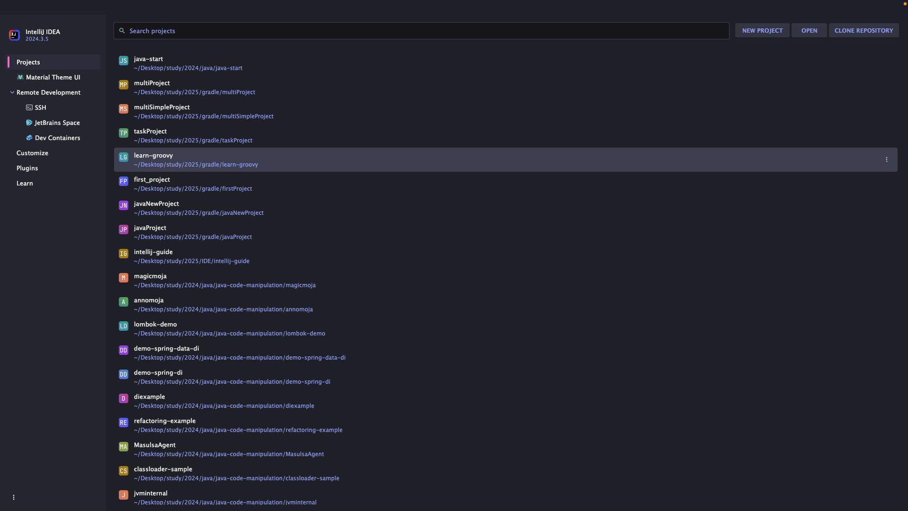

필자는 기존에 여러 프로젝트를 했기에 리스트처럼 여러개 프로젝트가 나오지만 처음 설치하시는 분들은 빈 화면일 것이다. 여기서 `New Project`버튼을 클릭한다.

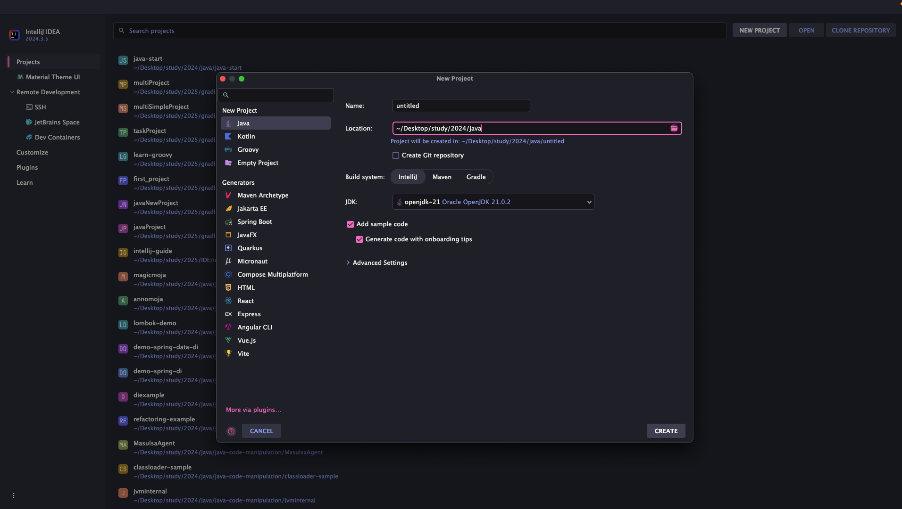

클릭하면 위와 같이 나오는데 우측에 자바를 택하고 프로젝트 이름과 해당 프로젝트 설치 경로를 선택해준다.

> 빌드 시스템은 기본으로 IntelliJ로 되어 있을 것이다. 하지만 다른 것이 선택되어 있다면 IntelliJ로 선택하자.

다음으로 JDK를 설치해야 한다. 필자는 기존에 이미 JDK를 설치한 경험이 있어서 JDK가 자동으로 뜨지만 처음 설치하시는 분들은 No-SDK라고 표시가 될 것이다. 그 부분을 클릭하면 아래와 같이 화면이 나온다.

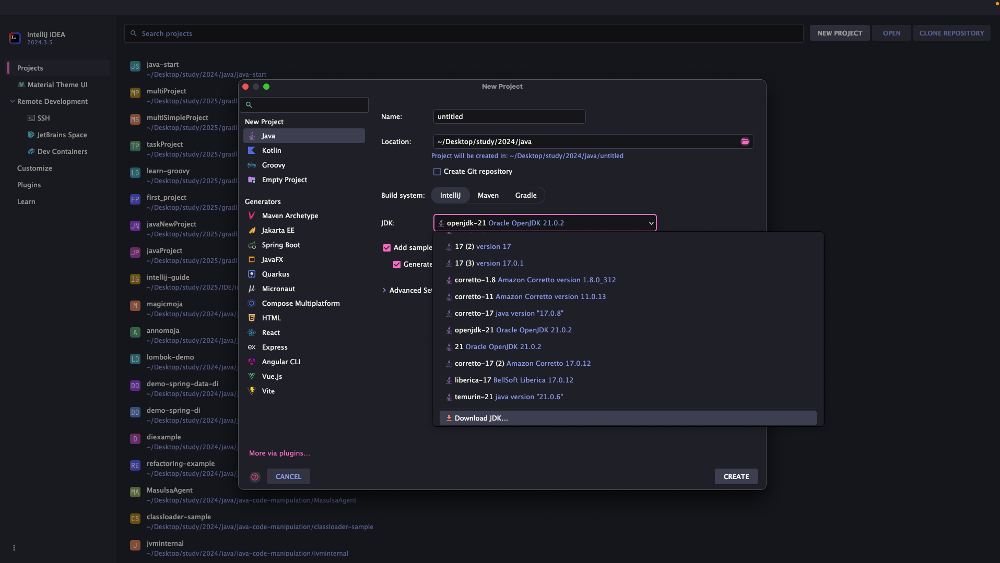

여기서 Download JDK를 클릭 후, 원하는 종류와 버전의 JDK를 아래와 같이 클릭 후 설치해주면 된다.

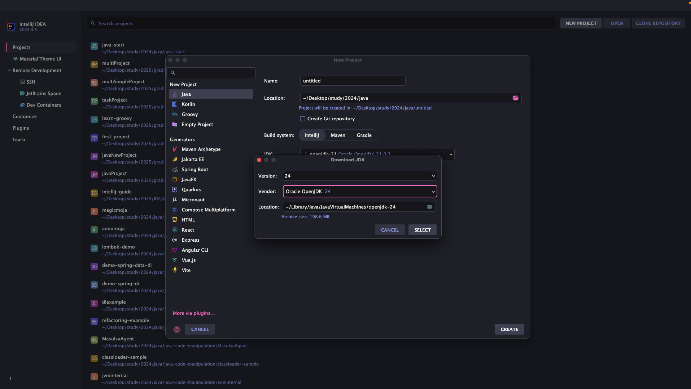

그리고 create 버튼을 클릭하면 샘플코드와 같이 코드가 나올 것이다. 지금은 아무것도 모르니 일단 실행만 해보자. 단축키로 `Ctrl + Shift + R` 혹은 윈도우 기준 `Ctrl + Shift + F10`을 누르면 아래와 같이 뭔가 실행이 된 것을 알 수 있다.

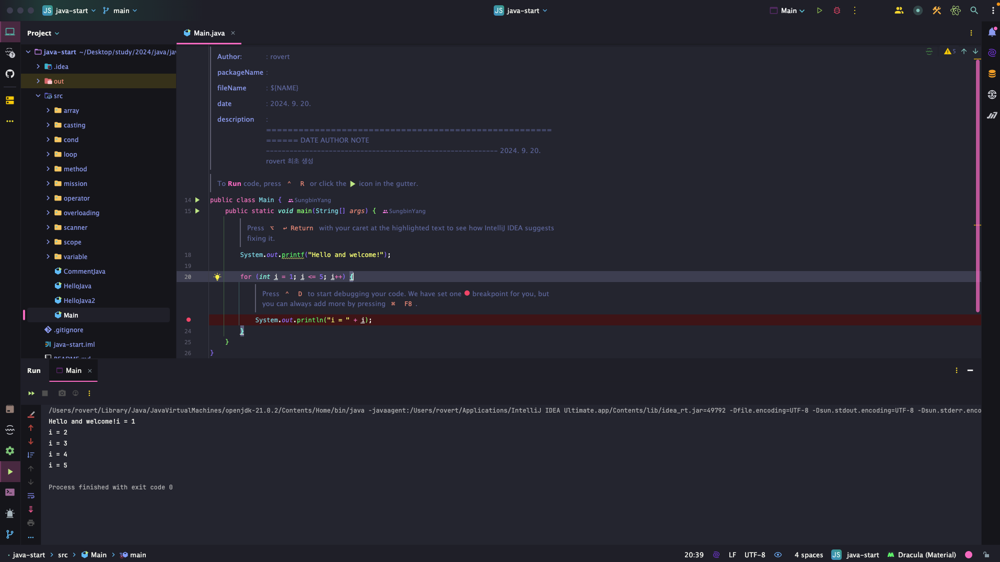

### 윈도우와 다른 점

UI상 인텔리제이는 거의 맥과 윈도우와 비슷하다. 하지만 단축키를 포함해서 다른 부분들이 몇가지 존재한다. 대표적으로 `settings`를 클릭하는 메뉴가 다른데 필자는 맥환경이기도 하고 일일이 다 설명하기에는 글이 길어지므로 생략할 예정이다. 다른 부분이 있다면 구글링이나 AI Agent 도움을 받아서 해결해보자.

### 한국어 설치 팩

가끔 가다가 한국어 설치 팩이 자동으로 설치되는 경우가 있다. 그러면 매우 좋지 않다. 왜냐하면 에러나 메뉴같은 것을 찾을 때 대부분 영어로 검색해야 빨리 찾을 수 있기 때문이다. 그래서 혹여나 설치하였다면 `action` 검색 단축키를 통해 아래와 같이 플러그인을 검색하여 해제해주자.

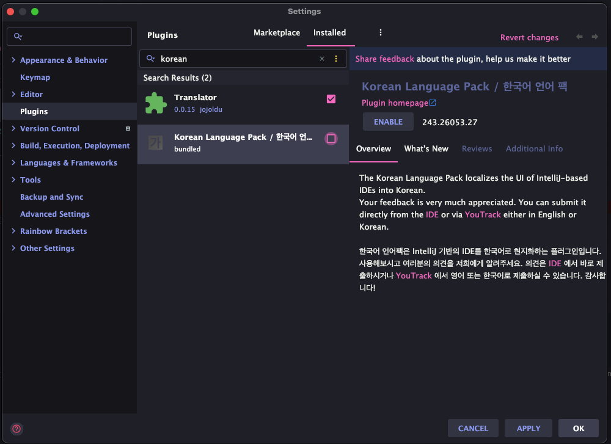

### 이클립스 설치 방법

어쩌다가 이클립스 설치가 필요한 경우도 있을 것이다. 해당 독자분들을 위해 예전에 학부생때 작성했던 [네이버 블로그 포스팅](https://blog.naver.com/ysb05222/221916326429)을 참고해보자.

## 다운로드 소스 코드 실행 방법

인텔리제이를 실행하고 나서, `File -> New -> Project from Existing Sources...`를 선택한다. 

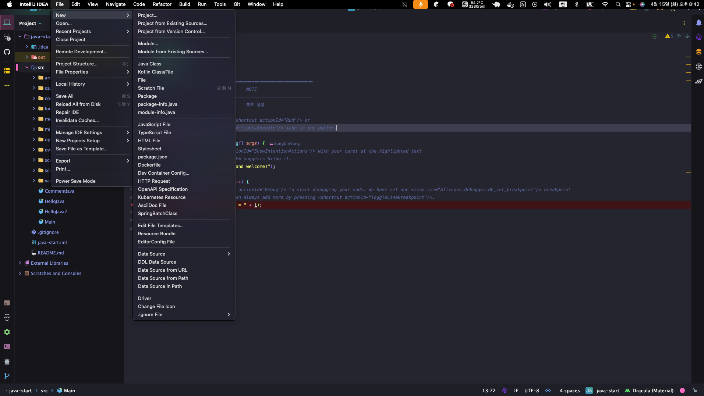

그 후, 블러 올 압축을 푼 폴더를 선택한다. 그 후, `Create project from existing sources`를 선택한다. 

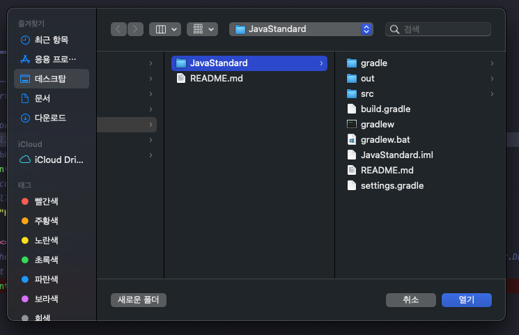

그리고 나서, 계속 Next를 하다가 JDK 선택 화면이 나오면 JDK 선택 (미 다운로드 시, 설치를 해당 화면에서 가능)하고 나서 마지막 Create를 눌러주면 기존 프로젝트를 불러 올 수 있다.

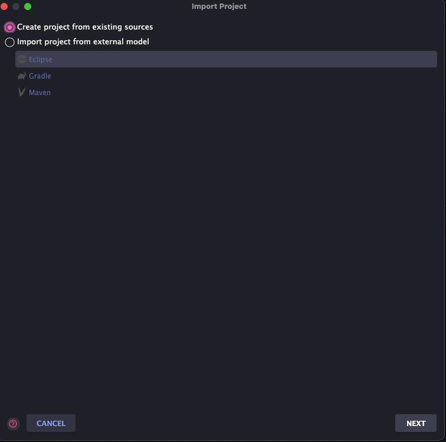

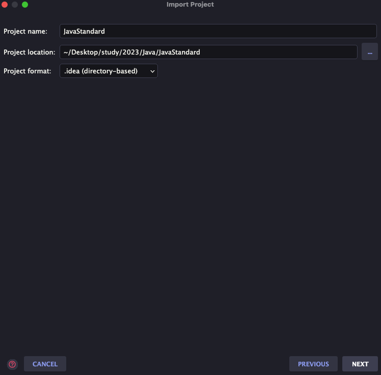

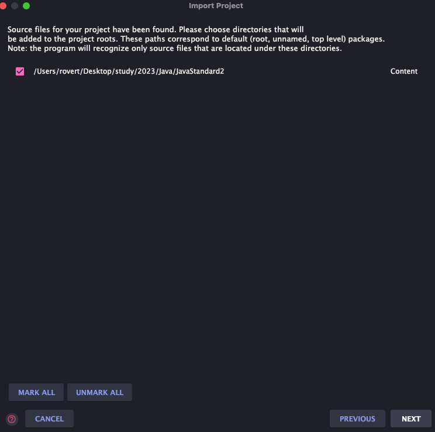

## 자바 프로그램 실행

이제 자바 파일을 생성해보자. `src` 디렉토리 밑에 단축키 `command + n`을 누른 후 자바 클래스를 선택하여 자바 파일을 생성할 수 있다.

``` java
public class HelloJava {
    public static void main(String[] args) {
        System.out.println("Hello Java");
    }
}
```

그리고 대소문자를 유의해서 위와 같이 코딩하자. 그 후에 실행을 하면 아래와 같이 콘솔창에 글자가 찍혀서 나온다.

``` bash
Hello Java
```

이제 각각 작성한 코드들이 무엇인지 살펴보자.

### `public class HelloJava` 

- 클래스라고 한다. 아직은 클래스가 무엇인지 몰라도 된다.
- 지금은 단순히 파일 하나 만들었다고 생각하자.
- 파일명과 클래스명이 동일하야 한다.
- `{}` 블록을 사용해서 클래스의 시작과 끝을 나타낸다.

### `public static void main(String[] args)` 

- main 메서드라고 한다. 아직은 메서드가 뭔지 몰라도 된다.
- 자바는 `main(String[] args)` 메서드를 찾아서 시작한다.
- 지금은 단순히 **main**은 프로그램의 시작점이라 이해!
- `{}` 블록을 사용해서 메서드의 시작과 끝을 나타낸다.

### `System.out.println(”Hello Java”);` 

- 값을 콘솔에 출력하는 기능이다.
- 자바는 문자열을 사용할 때 “을 사용한다. 쌍따옴표 사이에 원하는 문자열을 감싸면 된다.
- 자바는 세미콜론으로 문장을 구분한다. 문장이 끝나면 세미콜론이 필수다. 한글로 치면 마침표 느낌이다.

### 블록

- 블록이 시작되고 끝날때마다 들여쓰기 적용을 확인하자! 이것은 코드를 쉽게 구분하고 이해하도록 도와주는 좋은 관례이다. 블록이 중첩될 때마다 들여쓰기 깊이가 추가된다.
- 들여쓰기는 보톤 space 4번이다. 인텔리제이에서는 Tab키가 space 4번으로 기본적용 되어 있다.
- 원한다면 다르게 변경이 가능하지만 실제 실무에서는 **팀 컨벤션**에 따라야 한다.
- 들여쓰기 안 해도 프로그램이 동작한다. 하지만 가독성은 좋지 않다.

## 주석(comment)

주석은 소스코드의 대한 이해가 필요하거나 잠시 막아두고 싶은 코드가 있을 때 사용을 한다. 실무에서는 모호한 코드같은 것이 보이거나 `java docs`를 작성할 때 많이 이용한다. 주석을 이용하면 자바는 해당 부분을 무시한다. 즉, 우리 개발자가 보기 위한 용도로 보면 좋을 것 같다.

### 주석의 종류

- 한줄 주석
    - `//` 기호로 시작한다. 이 기호 이후의 모든 텍스트는 주석으로 처리된다.

- 여러 줄 주석
    - `/*` 로 시작해서 `*/` 로 끝난다. 이 사이의 모든 텍스트는 주석으로 처리된다.

주석을 쉽게 할 수 있는 단축키가 존재한다. 맥 기준으로 `command + /`를 하면 주석이 자동 처리 된다.

## 자바란?

## 자바 표준 스펙

자바는 표준스펙을 정의하고 그 스펙을 가지고 여러 회사들이 다양한 JDK를 만들어서 제공을 한다. 왜 이런 스펙이 존재하는걸까? 그냥 필자가 생각하기에는 이런 것 같다. 각 회사마다 JDK를 제멋대로 만들었다고 해보자. 그런데 갑자기 개발자가 운영배포를 하면서 JDK를 변경했다고 해보자. 그러면 개발환경에서 잘 돌아가던 프로젝트가 운영에서 박살이 날 수 있을 것이다. 이에 자바 커뮤니티 프로세스(JCP)에서 자바 표준 스펙을 관리하며 해당 스펙이 일종의 설계도가 되는 것이다. 그리고 이것을 바탕으로 다양한 회사에서 회사의 특징들을 추가해서 JDK를 배포하는 것이다. 그래서 우리는 Oracle JDK를 사용하다가 Amazone Corretto JDK로 변경해도 이상이 없는 것이다.

## 컴파일과 실행

자바는 컴파일이라는 과정과 실행이라는 과정으로 나눠진다. 상세 과정은 아래와 같다.

- 자바 소스 코드를 개발자가 작성한다.
- 자바 컴파일러를 사용해서 소스코드를 컴파일한다.
    - 자바가 제공하는 `javac` 라는 프로그램을 사용
    - .java → .class 파일이 생성
    - 자바 소스 코드를 바이트 코드로 변환하며 자바 가상 머신에서 더 빠르게 실행될 수 있게 최적화하고 
    문법 오류 검출
- 자바 프로그램 실행
    - 자바가 제공하는 `java` 라는 프로그램을 사용
    - 자바 가상 머신이 실행되면서 프로그램 작동

## IDE와 자바

인텔리제이에서 자바 코드를 실행하면 컴파일과 실행을 모두 한번에 처리한다.


### 인텔리제이를 통한 자바 컴파일, 실행 과정

- 컴파일
    - 자바 코드를 컴파일하면 `javac` 라는 프로그램을 직접 사용해야 하는데 인텔리제이는 자바 코드를 실행할 때 이 과정을 자동으로 처리한다.
    - 인텔리제이 화면에서 프로젝트에 있는 out 폴더에 가보면 컴파일 된 .class 파일이 있는 것을 확인이 가능하다.

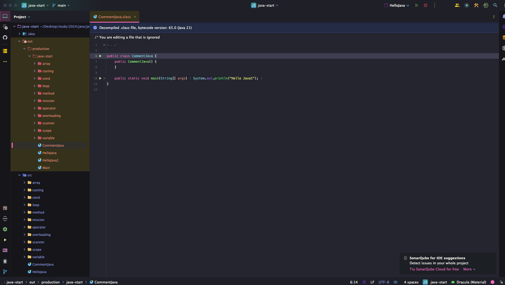

이렇게 인텔리제이를 통해 class파일이 확인 가능하다. 하지만 원래 클래스 파일 자체는 기계어로 구성되어 있다. 그것을 인텔리제이가 우리가 보기 쉽게 디컴파일을 한 것이다.

- 실행
    - 자바를 실행하려면 `java` 라는 프로그램을 사용한다. 이 때 컴파일 된 .class 파일 지정
- 인텔리제이에서 자바 코드를 실행하면 컴파일과 실행을 모두 한번에 처리한다.

## 자바와 운영체제 독립성

일반적인 프로그램은 다른 운영체제에서 실행이 불가능하다. 예컨데, 윈도우에서 다운받은 LOL 게임 프로그램이 맥에서 실행이 안되는 것처럼 말이다. 왜냐하면 윈도우 프로그램은 윈도우 운영체제가 사용하는 명령어들로 구성이 되어 있기 때문이다.

하지만 자바는 자바가 설치된 모든 운영체제에서 실행이 가능하다. 그 이유는 JDK가 큰 역할을 한다. 개발자가 자바를 작성하면 OS에 특회된 JDK가 각 OS에 맞게 컴파일을 해주기 때문이다. 그래서 개발자는 운영체제를 고려하지 않고 개발에만 집중하면 되는 것이다.

### 자바 개발과 운영 환경

개발할 때 자바와 서버에서 실행할 때 다른 자바를 사용 가능하다. 그래서 개발할 때는 편리한 JDK나 혹은 팀 컨벤션에 맞는 JDK를 사용하지만 실무에서는 해당 환경에 맞는 JDK를 사용 하는 것이 효과가 나올 것이다. 예를들어 AWS에 EC2 인스턴스에 JDK를 설치하려고 한다면 AWS Correto를 사용하는 것이 더 최적화 되고 좋을 것이다.

> 잘못된 지식이 있을 경우 댓글로 남겨주시면 빠르게 반영하겠습니다!