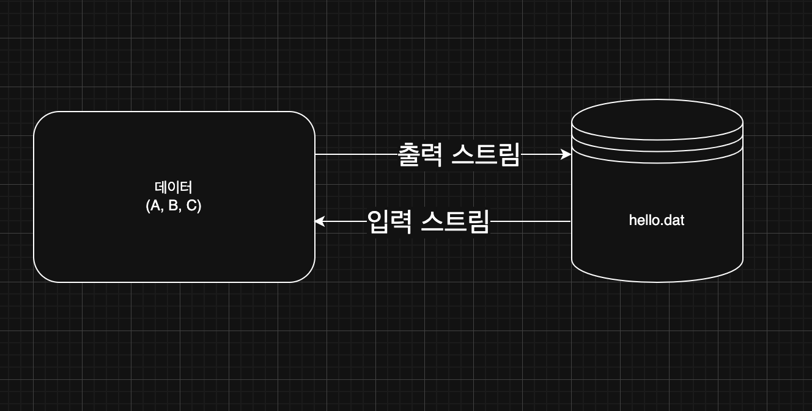
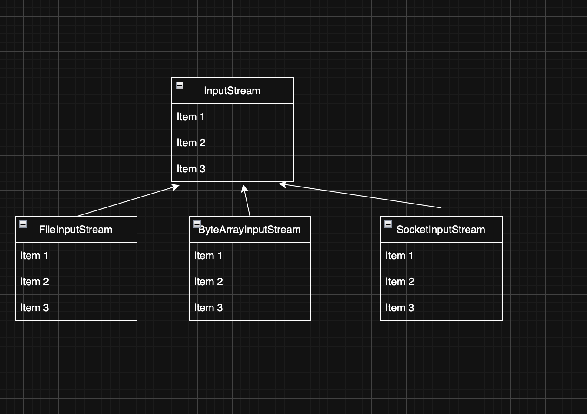
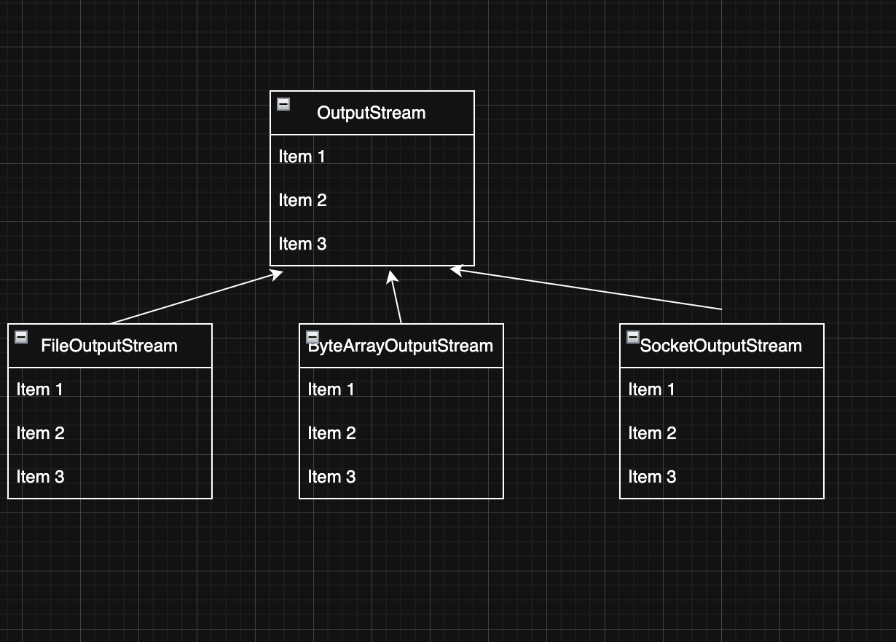
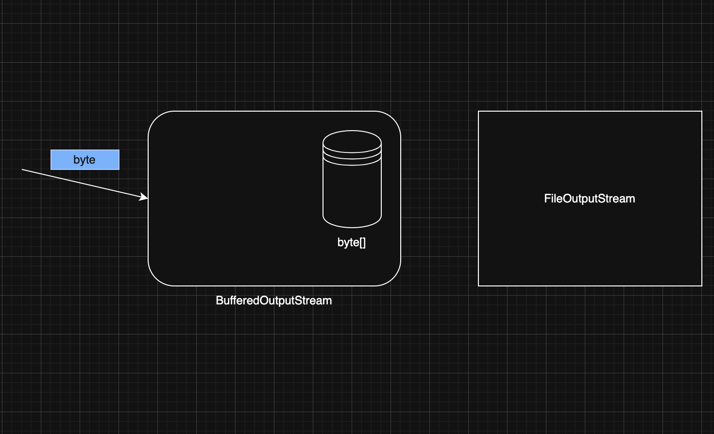
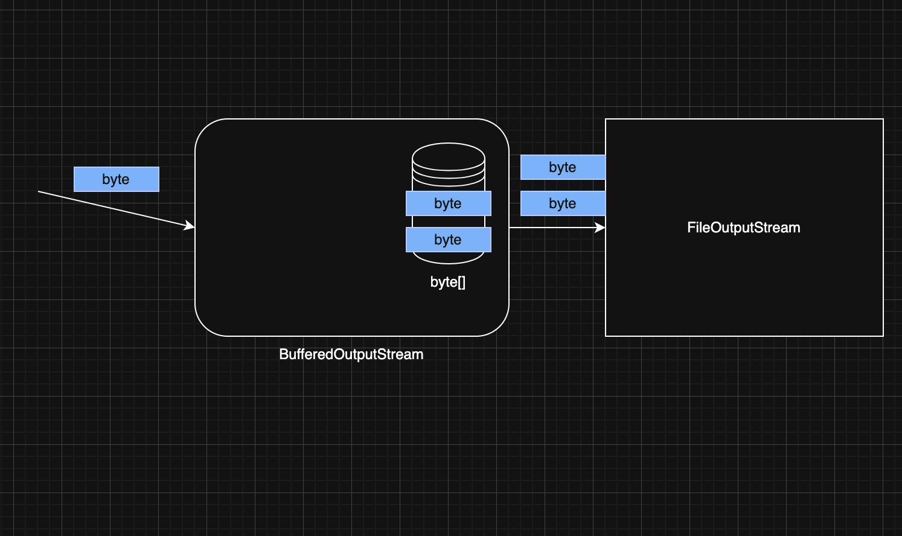
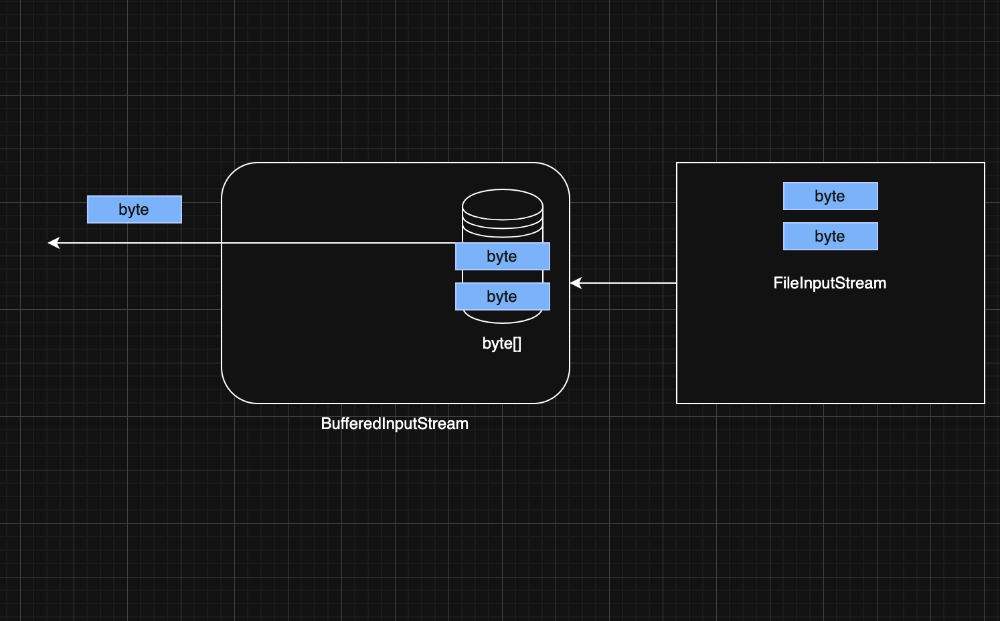

> 해당 블로그 글은 [영한님의 인프런 강의](https://inf.run/vskmA)를 바탕으로 쓰여진 글입니다.

## 스트림 시작1



자바의 데이터를 특정 파일에 저장하고 싶을 경우 어떻게 할까? 자바 프로세스가 가지고 있는 데이터를 밖으로 보내려면 출력 스트림을 사용하면 되고, 반대로 외부 데이터를 자바 프로세스 안으로 가져오려면 입력 스트림을 사용하면 된다.

> ✅ 참고
>
> 스트림은 단방향이다. 양방향으로 할 수 없다.

> 🙋🏻 명심
>
> 주체는 자바다. 그래서 자바에서 나가는 것을 출력 스트림이라고 하고 들어오는 것을 입력 스트림이라고 한다. 절대 까먹지 말자!!

그럼 예제를 통해 살펴보자.

``` java
package io.start;

import java.io.FileInputStream;
import java.io.FileOutputStream;
import java.io.IOException;

public class StreamStartMain1 {
    public static void main(String[] args) throws IOException {
        FileOutputStream fos = new FileOutputStream("temp/hello.dat");
        fos.write(65);
        fos.write(66);
        fos.write(67);
        fos.close();

        FileInputStream fis = new FileInputStream("temp/hello.dat");
        System.out.println(fis.read());
        System.out.println(fis.read());
        System.out.println(fis.read());
        System.out.println(fis.read());
        fis.close();
    }
}
```

- `new FileOutputStream("temp/hello.dat")`
    - 파일에 데이터를 출력하는 스트림이다.
    - 파일이 없으면 파일을 자동으로 만들고, 데이터를 해당 파일에 저장한다.
    - 단, 폴더는 생성하지 않으므로 직접 만들어줘야 한다. 그렇지 않으면 `java.io.FileNotFoundException` 예외가 발생한다.
- `write()`
    - byte 단위로 값을 출력한다. 여기서는 65, 66, 67을 출력했다.
    - 하지만 실제 파일에 가보면 65, 66, 67이 저장이 되지 않고 그의 문자 집합에 따라 A, B, C가 저장이 된다.
- `new FileInputStream("temp/hello.dat")`
    - 파일에서 데이터를 읽어오는 스트림이다.
- `read()`
    - 파일에서 데이터를 byte 단위로 하나씩 읽어온다.
    - 파일의 끝에 도달해서 더는 읽을 내용이 없다면 -1을 반환한다. 이것은 파일의 끝(EOF)이라는 특수한 표기이다.
- `close()`
    - 파일에 접근하는 것은 자바 입장에서 외부 자원을 사용하는 것이다. 자바에서 내부 객체는 자동으로 GC가 되지만 외부 자원은 사용 후 반드시 닫아주어야 한다.

> ✅ 참고
>
> 우리는 실습으로 65, 66, 67을 저장했고 출력을 해봐도 65, 66, 67이 나온다. 그런데 실제 파일에는 A, B, C가 저장이 되어 있다. 왜 그럴까? 바로 문자 집합때문이다. 일반 메모장같은 에디터는 UTF-8과 같은 문자집합을 사용하기 때문에 읽어 들일 때 문자집합을 통해 인코딩을 한 형태로 보여준다.

> ✅ 참고
>
> `FileOutputStream`의 생성자에는 `append`라는 옵션이 있다. 두번째 인자로 넣어주면 되는데 `true`를 넣어주면 기존 파일을 다시 생성하지 않고 이어서 붙여서 저장한다. 기본 값 `false`는 기존 파일을 다 지우고 새로 만들어서 저장한다.

> ✅ 참고: read()가 int를 반환하는 이유
>
> 자바에서 `byte`는 부호 있는 8비트 값(-128 ~ 127)이다. 그런데 파일의 끝을 나타내려면 특별한 값이 필요했다. 그래서 생각한 것이 `int`를 반환함으로 0에서 255까지의 모든 가능한 바이트 값을 부호 없이 표현할 수 있게 하고 EOF는 -1을 반환하게 설계하였다.

> ⚠️ 주의
>
> `write()`의 인자로 `int`를 받는 이유도 위와 같아서이다. 그래서 음수값을 집어넣으면 오버플로우 효과가 일어나 이상한 값이 출력이 되니 유의하자.

> ✅ 참고
>
> `read()`나 `write()` 메서드는 `IOException`이라는 체크 예외를 던진다. 그래서 예외를 잡아주거나 던져야 한다.

## 스트림 시작2

이번에는 `byte`를 하나씩 다루는 것이 아니라, `byte[]`을 사용해서 데이터를 원하는 크기 만큼 더 편리하게 저장하고 읽는 방법을 알아보자.

``` java
package io.start;

import java.io.FileInputStream;
import java.io.FileOutputStream;
import java.io.IOException;
import java.util.Arrays;

public class StreamStartMain3 {
    public static void main(String[] args) throws IOException {
        FileOutputStream fos = new FileOutputStream("temp/hello.dat");
        byte[] input = {65, 66, 67};

        fos.write(input);
        fos.close();

        FileInputStream fis = new FileInputStream("temp/hello.dat");
        byte[] buffer = new byte[10];
        int readCount = fis.read(buffer, 0, 10);

        System.out.println("readCount = " + readCount);
        System.out.println(Arrays.toString(buffer));
        fis.close();
    }
}
```

`write(byte[])`를 사용하면 바이트 배열에 원하는 바이트 데이터를 담고 파일에 한번에 저장할 수 있다. 또한 `read(byte[], offset, length)`를 통하여 파일에 데이터를 읽어서 미리 바이트 배열을 만든 후 데이터 기록되는 `byte[]`의 인덱스 시작 위치와 길이를 정해주면 해당 길이의 바이트 배열에 지정한 인덱스 위치부터 데이터를 저장한다.

> ⚠️ 주의
>
> 만약에 지정한 offset과 length와 데이터 길이가 미리 만들어둔 배열의 길이를 벗어나면 예외가 발생한다.

그런데 뭔가 읽는 과정이 매우 번거롭다. 그래서 자바에서 '한방에 읽기'기능을 제공해준다. 예제 코드를 살펴보자.

``` java
package io.start;

import java.io.FileInputStream;
import java.io.FileOutputStream;
import java.io.IOException;
import java.util.Arrays;

public class StreamStartMain4 {
    public static void main(String[] args) throws IOException {
        FileOutputStream fos = new FileOutputStream("temp/hello.dat");
        byte[] input = {65, 66, 67};

        fos.write(input);
        fos.close();

        FileInputStream fis = new FileInputStream("temp/hello.dat");
        byte[] readBytes = fis.readAllBytes();

        System.out.println(Arrays.toString(readBytes));
        fis.close();
    }
}
```

`readAllBytes()`를 사용하면 스트림이 끝날 때 까지(파일의 끝에 도달할 때 까지) 모든 데이터를 한 번에 읽어올 수 있다.

### 부분으로 나누어 읽기 vs 전체 읽기

파일이 하나 있다고 하자. 해당 파일의 데이터를 읽으려면 `readAllBytes()` 메서드를 사용하면 된다. 하지만 해당 메서드는 메모리 사용량을 제어할 수 없어서 작은 파일이나 메모리에 모든 내용을 올려서 처리해야 하는 경우에 적합하다. 큰 파일의 경우 OutOfMemoryError가 발생할 수 있다. 그러면 예외가 발생하는 경우에는 `read(byte[], offset, lentgh)` 메서드를 이용하여 부분적으로 끊어서 읽으면 좋다. 해당 메서드는 스트림의 내용을 부분적으로 읽거나, 읽은 내용을 처리하면서 스트림을 계속해서 읽어야 할 경우에 적합하다. 이 메서드는 메모리 사용량을 제어할 수 있다. 즉, 큰 파일을 읽으려면 `read(byte[], offset, lentgh)` 메서드를 사용하고 그게 아니라면 `readAllBytes()`를 사용하자.

> ✅ 참고
>
> `read(byte[], offset, lentgh)` 말고 `read(byte[])` 메서드도 존재하는데 이러면 offset=0, length=byte[].length이다.

## InputStream, OutputStream

현대의 컴퓨터는 대부분 byte 단위로 데이터를 주고 받는다. 이렇게 데이터를 주고 받는 것을 I/O라 한다. 자바 내부에 있는 데이터를 외부에 있는 파일에 저장하거나, 네트워크를 통해 전송하거나 콘솔에 출력할 때 모두 byte 단위로 데이터를 주고 받는다. 만약 방식이 각기 다르다면 개발자 입장에서 매우 불편하고 사용하기 힘들 것이다. 이런 문제를 해결하기 위해 자바는 `InputStream`,`OutputStream`이라는 기본 추상 클래스를 제공한다.



- `InputStream`과 상속 클래스
- `read()`,`read(byte[])`,`readAllBytes()` 제공



- `OutputStream`과 상속 클래스
- `write(int)`,`write(byte[])` 제공

스트림을 사용하면 파일을 사용하든, 소켓을 통해 네트워크를 사용하든 모두 일관된 방식으로 데이터를 주고 받을 수 있다. 그리고 수 많은 기본 구현 클래스들도 제공한다. 그러면 구현 클래스들을 조금 더 살펴보자.

### 메모리 스트림

``` java
package io.start;

import java.io.ByteArrayInputStream;
import java.io.ByteArrayOutputStream;
import java.io.IOException;
import java.util.Arrays;

public class ByteArrayStreamMain {
    public static void main(String[] args) throws IOException {
        byte[] input = {1, 2, 3};
        ByteArrayOutputStream baos = new ByteArrayOutputStream();
        baos.write(input);

        ByteArrayInputStream bais = new ByteArrayInputStream(baos.toByteArray());
        byte[] bytes = bais.readAllBytes();
        System.out.println(Arrays.toString(bytes));
    }
}
```

`ByteArrayOutputStream`, `ByteArrayInputStream`을 사용하면 메모리에 스트림을 쓰고 읽을 수 있다. 이 클래스들은 `OutputStream`, `InputStream`을 상속받았기 때문에 부모의 기능을 모두 사용할 수 있다. 코드를 보면 파일 입출력과 매우 비슷한 것을 확인할 수 있다.

> ✅ 참고
>
> 메모리에 어떤 데이터를 저장하고 읽을 때는 컬렉션이나 배열을 사용하면 되기 때문에, 이 기능은 잘 사용하지 않는다. 주로 스트림을 간단하게 테스트 하거나 스트림의 데이터를 확인하는 용도로 사용한다.

### 콘솔 스트림

``` java
package io.start;

import java.io.IOException;
import java.io.PrintStream;

import static java.nio.charset.StandardCharsets.UTF_8;

public class PrintStreamMain {
    public static void main(String[] args) throws IOException {
        PrintStream printStream = System.out;

        byte[] bytes = "Hello!\n".getBytes(UTF_8);
        printStream.write(bytes);
        printStream.println("Print!");
    }
}
```

우리가 자주 사용했던 `System.out`이 사실은 `PrintStream`이다. 이 스트림은 `OutputStream`를 상속받는다. 이 스트림은 자바가 시작될 때 자동으로 만들어진다. 따라서 우리가 직접 생성하지 않는다. 그래서 우리가 `System.out.println()`을 바로 호출할 수 있는 것이다. 또한 `println()`은 `write()`와 달리 바이트 배열을 담지 않고 문자열을 담는다. 사실 `println()`안에서는 문자열을 문자 배열로 변환 후 그것을 바이트 배열로 변환하여 내부에 `write()`메서드를 호출하고 다른 최적화를 하였기 때문에 바이트 배열을 사용 안 해도 된 것이다.

### 정리

`InputStream`과 `OutputStream`이 다양한 스트림들을 추상화하고 기본 기능에 대한 표준을 잡아둔 덕분에 개발자는 편리하게 입출력 작업을 수행할 수 있다. 이러한 추상화의 장점은 다음과 같다.

- **일관성**: 모든 종류의 입출력 작업에 대해 동일한 인터페이스(여기서는 부모의 메서드)를 사용할 수 있어, 코드의 일관성이 유지된다.
- **유연성**: 실제 데이터 소스나 목적지가 무엇인지에 관계없이 동일한 방식으로 코드를 작성할 수 있다.
- **확장성**: 새로운 유형의 입출력 스트림을 쉽게 추가할 수 있다.
- **재사용성**: 다양한 스트림 클래스들을 조합하여 복잡한 입출력 작업을 수행할 수 있다.
- **에러 처리**: 표준화된 예외 처리 메커니즘을 통해 일관된 방식으로 오류를 처리할 수 있다.

## 파일 입출력과 성능 최적화1 - 하나씩 쓰기

그러면 성능 분석을 위해 파일에 1byte씩 데이터를 쓰고 읽는 과정들을 살펴보자.

``` java
package io.buffered;

import java.io.FileOutputStream;
import java.io.IOException;

import static io.buffered.BufferedConst.FILE_NAME;
import static io.buffered.BufferedConst.FILE_SIZE;

public class CreateFileV1 {
    public static void main(String[] args) throws IOException {
        FileOutputStream fos = new FileOutputStream(FILE_NAME);
        long startTime = System.currentTimeMillis();

        for (int i = 0; i < FILE_SIZE; i++) {
            fos.write(1);
        }

        fos.close();

        long endTime = System.currentTimeMillis();

        System.out.println("File created: " + FILE_NAME);
        System.out.println("File size: " + FILE_SIZE / 1024 / 1024 + " MB");
        System.out.println("Time taken: " + (endTime - startTime) + " ms");
    }
}
```

10MB만큼 1byte씩 파일에 데이터를 저장했다. 그러다 보니 성능 분석을 하였을 때 필자같은 경우 2분이 걸렸다. 이제 이렇게 쓴 파일을 가지고 1byte씩 읽어보자.

``` java
package io.buffered;

import java.io.FileInputStream;
import java.io.IOException;

import static io.buffered.BufferedConst.FILE_NAME;

public class ReadFileV1 {
    public static void main(String[] args) throws IOException {
        FileInputStream fis = new FileInputStream(FILE_NAME);
        long startTime = System.currentTimeMillis();
        int filesize = 0;
        int data;

        while ((data = fis.read()) != -1) {
            filesize++;
        }

        fis.close();

        long endTime = System.currentTimeMillis();
        System.out.println("File created: " + FILE_NAME);
        System.out.println("File size: " + (filesize / 1024 / 1024) + " MB");
        System.out.println("Time taken: " + (endTime - startTime) + " ms");
    }
}
```

필자 같은 경우는 11초가 걸렸다. 상당히 매우 느리다. 지금 이런 경우들은 마치 창고에 쌀 1000만개가 존재하는데 1개씩 옮기는 과정과 같다고 보면 된다. 근데 실제 왜 이렇게나 느릴까?

- `write()`나 `read()`를 호출할 때마다 OS의 시스템 콜을 통해 파일을 읽거나 쓰는 명령어를 전달한다. 이러한 시스템 콜은 상대적으로 무거운 작업이다.
- HDD, SDD 같은 장치들도 하나의 데이터를 읽고 쓸 때마다 필요한 시간이 있다. HDD의 경우 더욱 느린데, 물리적으로 디스크의 회전이 필요하다.
- 이러한 무거운 작업을 무려 1000만 번 반복한다.

이러한 이유로 읽기와 쓰기 성능이 너무 안 나온 것이다.

> ✅ 참고
>
> 이렇게 자바에서 운영 체제를 통해 디스크에 1byte씩 전달하면, 운영 체제나 하드웨어 레벨에서 여러가지 최적화가 발생한다. 따라서 실제로 디스크에 1byte씩 계속 쓰는 것은 아니다. 그렇다면 훨씬 더 느렸을 것이다. 하지만, 자바에서 1바이트씩 write()나 read()를 호출할 때마다 운영 체제로의 시스템 콜이 발생하고, 이 시스템 콜 자체가 상당한 오버헤드를 유발한다. 운영 체제와 하드웨어가 어느 정도 최적화를 제공하더라도, 자주 발생하는 시스템 콜로 인한 성능 저하는 피할 수 없다. 결국 자바에서 read(), write() 호출 횟수를 줄여서 시스템 콜 횟수도 줄여야 한다.

## 파일 입출력과 성능 최적화2 - 버퍼 활용

이번에는 1byte씩 데이터를 하나씩 전달하는 것이 아니라 `byte[]`을 통해 배열에 담아서 한 번에 여러 byte를 전달해보자.

``` java
package io.buffered;

import java.io.FileOutputStream;
import java.io.IOException;

import static io.buffered.BufferedConst.*;

public class CreateFileV2 {
    public static void main(String[] args) throws IOException {
        FileOutputStream fos = new FileOutputStream(FILE_NAME);
        long startTime = System.currentTimeMillis();

        byte[] buffer = new byte[BUFFER_SIZE];
        int bufferIndex = 0;

        for (int i = 0; i < FILE_SIZE; i++) {
            buffer[bufferIndex++] = 1;

            if (bufferIndex == BUFFER_SIZE) {
                fos.write(buffer);
                bufferIndex = 0;
            }
        }

        if (bufferIndex > 0) {
            fos.write(buffer, 0, bufferIndex);
        }

        fos.close();

        long endTime = System.currentTimeMillis();

        System.out.println("File created: " + FILE_NAME);
        System.out.println("File size: " + FILE_SIZE / 1024 / 1024 + " MB");
        System.out.println("Time taken: " + (endTime - startTime) + " ms");
    }
}
```

이번에는 1byte씩 데이터를 저장하는게 아니라 미리 버퍼라는 byte 배열을 만들어서 데이터를 담은 후에 한번에 파일에 저장하는 방식이다. 여기서는 `BUFFER_SIZE`만큼 데이터를 모아서 `write()`를 호출하였다. 예를 들어 `BUFFER_SIZE`가 100이라면 100만큼 담고 파일에 저장 후 버퍼를 비우는 방식이다. 필자가 테스트 해본 결과 1.4초라는 어마무시한 성능을 보였다.

### 버퍼 크기에 따른 성능

`BUFFER_SIZE` 에 따른 쓰기 성능

만약 버퍼 사이즈가 1이라면 기존에 1byte씩 파일에 저장하는거와 다를게 없어진다. 하지만 이 버퍼 사이즈를 점점 키울수록 엄청난 성능을 보인다. 버퍼 사이즈를 2로 두면 1에 절반의 성능을 보인다. 이렇게 버퍼 사이즈를 잘 조절해야 한다. 그러면 만약 버퍼 사이즈를 천만으로 하면 어떻게 될까? 성능이 막 1ns만큼 나올까? 그렇지는 않다. 일정 크기가 되면 성능의 차이가 없어진다. 그래서 적절한 버퍼 사이즈를 찾는 것이 중요하다.

정리하면 많은 데이터를 한 번에 전달하면 성능을 최적화 할 수 있다. 이렇게 되면 시스템 콜도 줄어들고, HDD, SDD 같은 장치들의 작동 횟수도 줄어든다. 하지만 무작정 키우는 것은 크게 성능 차이를 못 느낀다. 결국 버퍼에 많은 데이터를 담아서 보내도 디스크나 파일 시스템에서 해당 단위로 나누어 저장하기 때문에 효율에는 한계가 있다. 따라서 버퍼의 크기는 보통 4KB, 8KB 정도로 잡는 것이 효율적이다.

그러면 이제 읽기를 버퍼를 두어서 테스트 해보자.

``` java
package io.buffered;

import java.io.FileInputStream;
import java.io.IOException;

import static io.buffered.BufferedConst.BUFFER_SIZE;
import static io.buffered.BufferedConst.FILE_NAME;

public class ReadFileV2 {
    public static void main(String[] args) throws IOException {
        FileInputStream fis = new FileInputStream(FILE_NAME);
        long startTime = System.currentTimeMillis();
        byte[] buffer = new byte[BUFFER_SIZE];
        int filesize = 0;
        int size;

        while ((size = fis.read(buffer)) != -1) {
            filesize += size;
        }

        fis.close();

        long endTime = System.currentTimeMillis();
        System.out.println("File created: " + FILE_NAME);
        System.out.println("File size: " + (filesize / 1024 / 1024) + " MB");
        System.out.println("Time taken: " + (endTime - startTime) + " ms");
    }
}
```

읽기 성능도 버퍼 사이즈를 조절하여 이전보다 약 1000배정도 성능 이득을 보았다. 이렇게 버퍼를 사용하면 큰 성능 향상이 있다. 하지만 직접 버퍼를 만들고 관리해야 하는 번거로운 단점이 있다.

## 파일 입출력과 성능 최적화3 - Buffered 스트림 쓰기

`BufferedOutputStream` 은 버퍼 기능을 내부에서 대신 처리해준다. 따라서 단순한 코드를 유지하면서 버퍼를 사용하는 이점도 함께 누릴 수 있다.

``` java
package io.buffered;

import java.io.BufferedOutputStream;
import java.io.FileOutputStream;
import java.io.IOException;

import static io.buffered.BufferedConst.*;

public class CreateFileV3 {
    public static void main(String[] args) throws IOException {
        FileOutputStream fos = new FileOutputStream(FILE_NAME);
        BufferedOutputStream bos = new BufferedOutputStream(fos, BUFFER_SIZE);
        long startTime = System.currentTimeMillis();

        for (int i = 0; i < FILE_SIZE; i++) {
            bos.write(1);
        }

        bos.close();

        long endTime = System.currentTimeMillis();

        System.out.println("File created: " + FILE_NAME);
        System.out.println("File size: " + FILE_SIZE / 1024 / 1024 + " MB");
        System.out.println("Time taken: " + (endTime - startTime) + " ms");
    }
}
```

`BufferedOutputStream`은 단순히 버퍼만 제공해주는 이야기고 실제 데이터를 받은 스트림 객체가 있어야 한다. 그래서 여기서는 `FileOutputStream` 객체를 생성자에 전달하였다. 또한 버퍼 사이즈도 지정할 수 있는데 생략도 가능하다. 만약 생략을 하면 4KB정도로 잡힌다. 그런데 실제 성능을 보면 이전 코드에 비해 성능이 약간 느린 것을 볼 수 있다. 왜냐하면 해당 `BufferedOutputStream` 안에는 동기화 로직도 포함되어 있기 때문이다. 그럼 자세히 분석해보자.



처음 코드를 실행하게 되면 1byte씩 `BufferedOutputStream`의 버퍼에 전달 된다. 그렇게 버퍼의 크기 만큼 점점 쌓일 것이다.



그러다가 위와 같이 버퍼가 가득 차면 그제서야 `write()` 메서드로 `FileOutputStream`에 전달되는 것이다. 이렇게 전달하면 버퍼는 내용을 비운다. 그리고 다시 1byte씩 버퍼의 크기를 채워나가는 식으로 반복한다.

### flush

버퍼가 다 차지 않아도 버퍼에 남아있는 데이터를 전달하려면 `flush()`라는 메서드를 호출하면 된다.

### close

그런데 우리는 `flush()`를 호출한 적이 없다. 그런데 버퍼는 비워졌다. 어떻게 그랬을까? `BufferedOutputStream`을 `close()`로 닫으면 먼저 내부에서 `flush()`를 호출한다. 따라서 버퍼에 남아 있는 데이터를 모두 전달하고 비운다. 따라서 `close()`를 호출해도 남은 데이터를 안전하게 저장할 수 있다. 버퍼가 비워지고 나면 `close()`로 `BufferedOutputStream`의 자원을 정리한다. 그리고 나서 다음 연결된 스트림의 `close()`를 호출한다. 여기서는 `FileOutputStream`의 자원이 정리된다. 그 덕에 우리는 `FileOutputStream`을 안 닫아주고 `BufferedOutputStream`만 닫아줘도 되었던 이유다. 만약 `FileOutputStream`만 닫고 `BufferedOutputStream`을 안 닫아주면 어떻게 될까? `byte`가 버퍼에 남아있게 되고, 파일에 저장되지 않는 심각한 문제가 발생한다. 따라서 지금과 같이 스트림을 연결해서 사용하는 경우에는 마지막에 연결한 스트림을 반드시 닫아주어야 한다.

### 기본 스트림과 보조 스트림

- `FileOutputStream`과 같이 단독으로 사용할 수 있는 스트림을 기본 스트림이라 한다.
- `BufferedOutputStream`과 같이 단독으로 사용할 수 없고, 보조 기능을 제공하는 스트림을 보조 스트림이라 한다.

## 파일 입출력과 성능 최적화4 - Buffered 스트림 읽기

``` java
package io.buffered;

import java.io.BufferedInputStream;
import java.io.FileInputStream;
import java.io.IOException;

import static io.buffered.BufferedConst.BUFFER_SIZE;
import static io.buffered.BufferedConst.FILE_NAME;

public class ReadFileV3 {
    public static void main(String[] args) throws IOException {
        FileInputStream fis = new FileInputStream(FILE_NAME);
        BufferedInputStream bis = new BufferedInputStream(fis, BUFFER_SIZE);
        long startTime = System.currentTimeMillis();
        int filesize = 0;
        int data;

        while ((data = bis.read()) != -1) {
            filesize++;
        }

        bis.close();

        long endTime = System.currentTimeMillis();
        System.out.println("File created: " + FILE_NAME);
        System.out.println("File size: " + (filesize / 1024 / 1024) + " MB");
        System.out.println("Time taken: " + (endTime - startTime) + " ms");
    }
}
```

위의 코드를 분석해보자.



`read()`가 호출이 되면 `BufferedInputStream`안에 버퍼에다가 `FileInputStream`의 데이터를 버퍼 사이즈만큼 쌓는다. 그 후, 버퍼 사이즈가 비워질때까지 따로 `FileInputStream`에 조회하지 않고 버퍼에서만 사용자에게 1byte씩 넘겨준다. 그리고 버퍼가 비워지면 다시 `FileInputStream`에 데이터를 요청하여 버퍼 사이즈만큼 채운다. 해당 과정들을 반복한다.

### 버퍼를 직접 다루는 것 보다 BufferedXxx의 성능이 떨어지는 이유

이유는 앞서 잠깐 이야기를 했지만 바로 `BufferedXxx` 클래스는 동기화 락이 걸려져 있다. 1byte씩 저장해서 총 10MB를 저장해야 하는데 이렇게 하려면 `write()`를 약 1000만 번 호출해야 한다. 결과적으로 락을 걸고 푸는 코드도 1000만 번 호출된다는 뜻이다. 그래서 매우 느릴 것이다.

### BufferedXxx 클래스의 특징

`BufferedXxx` 클래스는 자바 초창기에 만들이진 클래스인데, 처음부터 멀티 스레드를 고려해서 만든 클래스이다. 따라서 멀티 스레드에 안전하지만 락을 걸고 푸는 동기화 코드로 인해 성능이 약간 저하될 수 있다. 하지만 싱글 스레드 상황에서는 동기화 락이 필요하지 않기 때문에 직접 버퍼를 다룰 때와 비교해서 성능이 떨어진다. 일반적인 상황이라면 이 정도 성능은 크게 문제가 되지는 않기 때문에 싱글 스레드여도 `BufferedXxx`를 사용하면 충분하다. 물론 매우 큰 데이터를 다루어야 하고, 성능 최적화가 중요하다면 예제 2와 같이 직접 버퍼를 다루는 방법을 고려하자. 아쉽게도 동기화 락이 없는 `BufferedXxx` 클래스는 없다. 꼭 필요한 상황이라면 `BufferedXxx`를 참고해서 동기화 락 코드를 제거한 클래스를 직접 만들어 사용하면 된다.

## 파일 입출력과 성능 최적화5 - 한 번에 쓰기

파일의 크기가 크지 않다면 간단하게 한 번에 쓰고 읽는 것도 좋은 방법이다. 이 방법은 성능은 가장 빠르지만, 결과적으로 메모리를 한 번에 많이 사용하기 때문에 파일의 크기가 작아야 한다.

먼저 한번에 쓰기 코드를 살펴보자.

``` java
package io.buffered;

import java.io.FileOutputStream;
import java.io.IOException;

import static io.buffered.BufferedConst.FILE_NAME;
import static io.buffered.BufferedConst.FILE_SIZE;

public class CreateFileV4 {
    public static void main(String[] args) throws IOException {
        FileOutputStream fos = new FileOutputStream(FILE_NAME);
        long startTime = System.currentTimeMillis();
        byte[] buffer = new byte[FILE_SIZE];

        for (int i = 0; i < FILE_SIZE; i++) {
            buffer[i] = 1;
        }

        fos.write(buffer);
        fos.close();

        long endTime = System.currentTimeMillis();

        System.out.println("File created: " + FILE_NAME);
        System.out.println("File size: " + FILE_SIZE / 1024 / 1024 + " MB");
        System.out.println("Time taken: " + (endTime - startTime) + " ms");
    }
}
```

실행시간은 이전 버퍼를 직접 다룬 코드와 별 차이가 없다. 왜냐하면 디스크나 파일 시스템에서 데이터를 읽고 쓰는 기본 단위가 보통 4KB 또는 8KB이기 때문에, 한 번에 쓴다고해서 무작정 빠른 것은 아니다. 그럼 한번에 읽기 코드도 살펴보자.

``` java
package io.buffered;

import java.io.FileInputStream;
import java.io.IOException;

import static io.buffered.BufferedConst.FILE_NAME;

public class ReadFileV4 {
    public static void main(String[] args) throws IOException {
        FileInputStream fis = new FileInputStream(FILE_NAME);
        long startTime = System.currentTimeMillis();
        byte[] bytes = fis.readAllBytes();

        fis.close();

        long endTime = System.currentTimeMillis();
        System.out.println("File created: " + FILE_NAME);
        System.out.println("File size: " + (bytes.length / 1024 / 1024) + " MB");
        System.out.println("Time taken: " + (endTime - startTime) + " ms");
    }
}
```

이 코드도 버퍼를 직접 다룬 코드와 별 차이가 없다. 왜냐하면 `readAllBytes()`는 자바 구현에 따라 다르지만 보통 4KB, 8KB, 16KB 단위로 데이터를 읽어들인다.

> 잘못된 지식이 있을 경우 댓글로 남겨주시면 빠르게 반영하겠습니다!