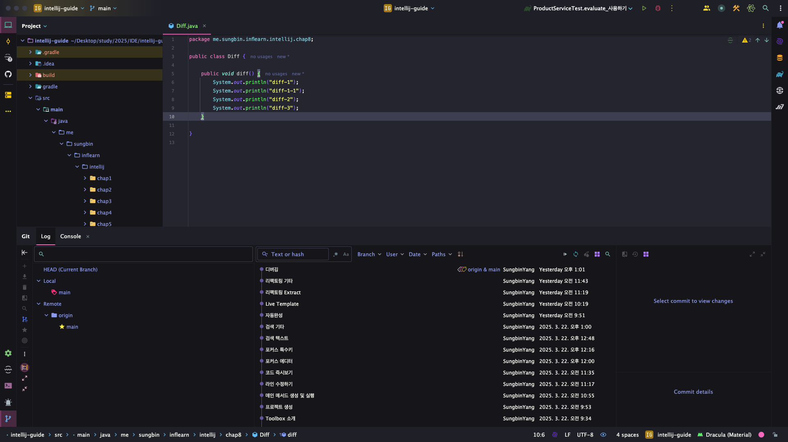
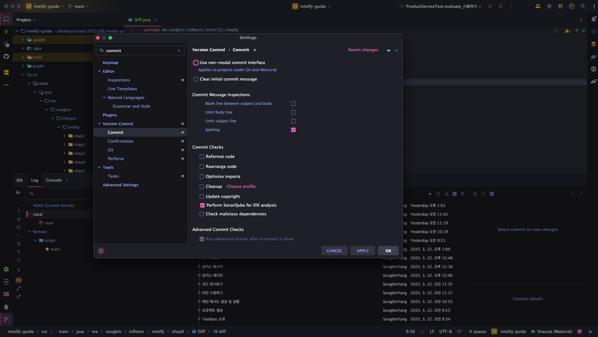
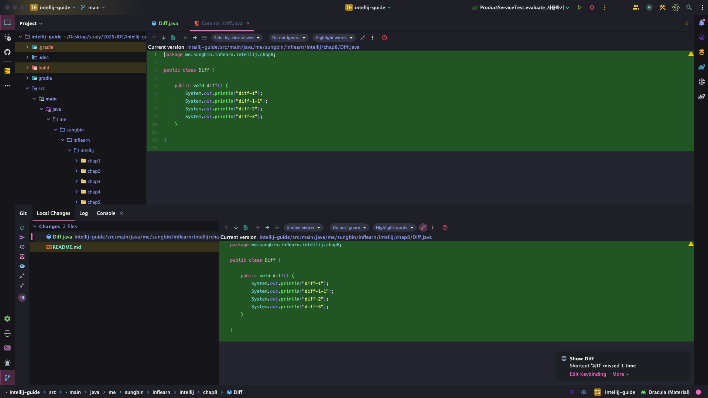
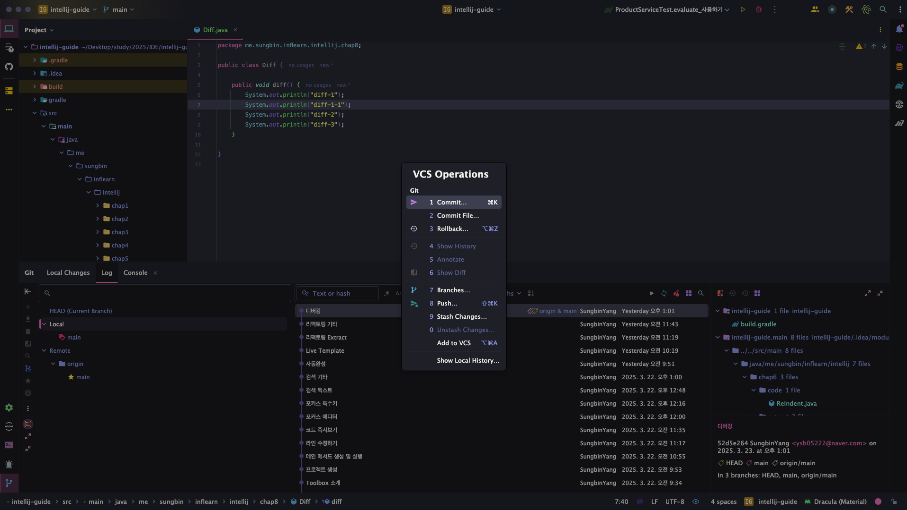
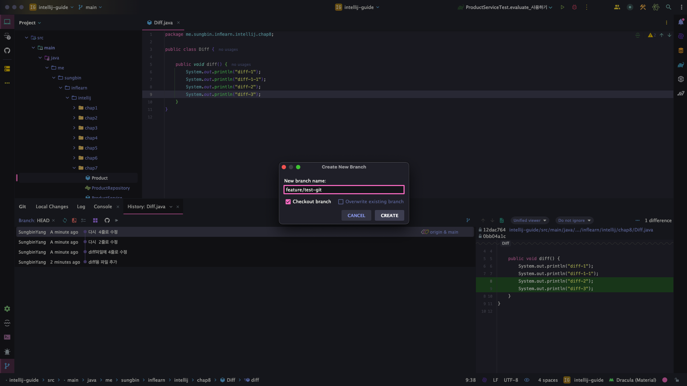
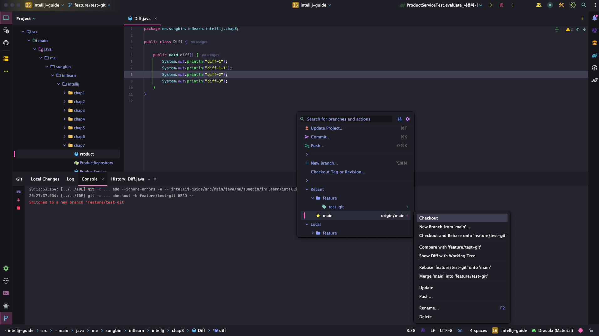
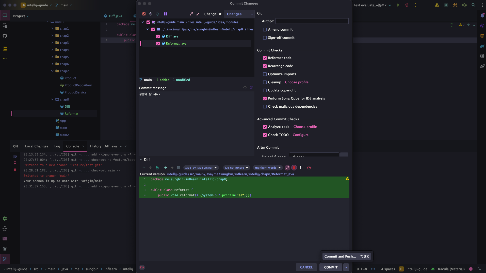
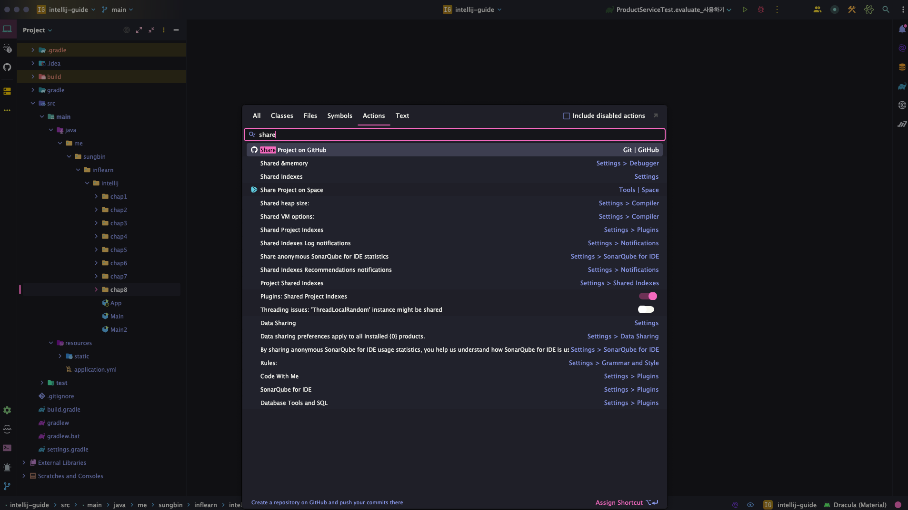
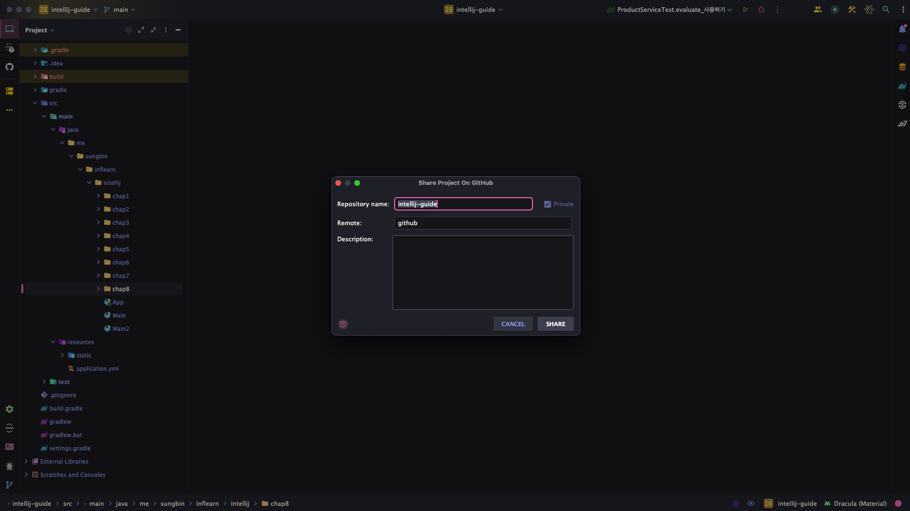
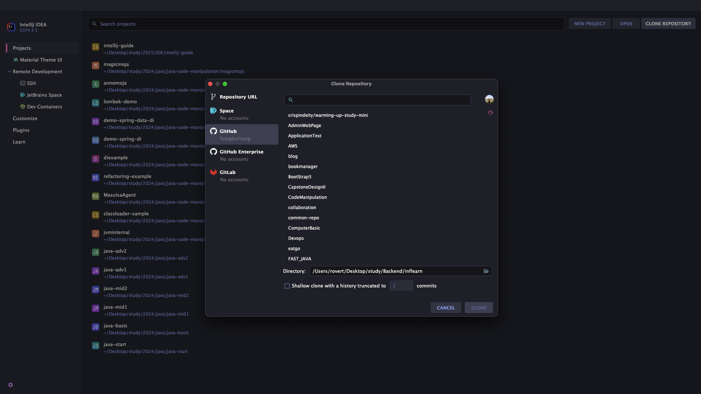

> 해당 블로그 글은 [향로님의 인프런 강의](https://inf.run/NwFz)를 바탕으로 쓰여진 글입니다.

## Git 기본 기능 사용하기

사실 해당 기능은 별 의미가 없어 보인다고 생각을 했다. 그냥 터미널에서 다 해결이 가능하기 때문이다. 하지만 해당 기능들의 단축키를 체득하니 이만한 꿀팁이 없는 것 같다. 그럼 한번 시작해보겠다.

### Git View On

해당 기능은 Git에 관련된 기능은 아니고 깃의 여러가지 화면을 보여주는 기능이다. 해당 기능의 시작으로 여러 단축키를 통해 깃을 자유롭게 이용할 수 있는 것이다.

> ⌨️ 단축키
>
> 맥: command + 9
> 윈도우/리눅스: Alt + 9

실행화면은 아래와 같다.

여기서 추가로 설정할것이 있다. 우리는 쉽게 변경사항들을 알고 싶지만 위의 사진만 봐서는 변경사항이 일어나는지 확인하기 힘들다. 그럴때는 `settings`에 가서 commit이라고 검색을 하면 아래와 같이 나오는데 해당 팝업에서 `Use non-modal commit interface` 체크박스를 체크해제한다.

그러면 아래와 같이 `Local History` 탭이 보일텐데 해당 탭을 통해 변경사항들을 쉽게 알 수 있다.

### Git option Popup

깃에 기능들을 쉽게 사용할 수 있게 하는 팝업이다.

> ⌨️ 단축키
>
> - 맥: Ctrl + v
> - 윈도우/리눅스: Alt + `

실행화면은 아래와 같다.

### Git History

해당 기능은 해당 파일에 history, 즉 변경사항들의 이력을 볼 수 있는 기능이다. 이전에 배웠던 Git option popup을 킨 후에 4번으로 가면 아래처럼 이력을 볼 수 있다.

> ⌨️ 단축키
>
> - 맥: Ctrl + v => 4
> - 윈도우/리눅스: Alt + ` => 4

### branch

브랜치도 명령어 없이 단축키로 생성 및 변경을 할 수 있다.

> ⌨️ 단축키
>
> - 맥: Ctrl + v => 7
> - 윈도우/리눅스: Alt + ` => 7

실행 화면은 아래와 같다.

이렇게 생성 및 체크아웃까지 가능하다. 그러고 git views on 터미널에 콘솔탭을 확인해보면 아래와 같이 이력이 나와 있는 것을 볼 수 있다.

### Commit

커밋도 단축키로 진행이 가능하다.

> ⌨️ 단축키
>
> - 맥: command + k
> - 윈도우/리눅스: Ctrl + k

실행 화면은 아래와 같다.

단축키를 입력하면 위와 같이 나오는데 커밋 메세지를 작성해주고 커밋과 push를 동시에 진행이 가능하다. 더 신기한 것은 오른쪽 옵션에서 reformat과 rearrage 기능등이 있는데 해당 기능들을 통해 정렬이 안되어 있는 코드들을 정렬해서 커밋 및 푸시 할 수 있다. 다양한 옵션들이 있으니 궁금하면 한번 찾아서 적용해보자.

### push

가끔 파일을 새로 생성한 경우 위와 같이 진행할때 push까지 진행이 안되는 경우가 있다. 그럴때는 일단 커밋만 진행하고 아래의 단축키를 이용해서 push를 별도로 진행해줘야 한다.

> ⌨️ 단축키
>
> - 맥: command + Shift + k
> - 윈도우/리눅스: Ctrl + Shift + k

### pull

해당 기능은 단축키가 존재하지 않는다. 사용하려면 별도 키 매핑을 하거나 action 탭을 열어서 `git pull`이라고 검색 후 진행해야 한다.

## Github 연동하기

### Github 연동하기

이 기능은 별도 단축키가 존재하지 않는다. action탭을 열어서 `share github`을 입력하여 진향을 해야 한다.

위에처럼 입력하여 엔터를 누르면 아래처럼 프로젝트를 생성하는 팝업이 나온다. 원하는 repository 이름을 작성하고 설명란을 적고 share를 하면 된다. 그러면 깃헙에 해당 프로젝트가 생성이 된 것을 볼 수 있다.

### Github clone

해당 기능은 단축키가 있는 것이 아니고 아래와 같은 화면에서 클론 받고 싶은 url을 입력하거나 repository를 선택하면 된다.

> ✅ 참고
>
> 위의 Github연동 및 clone과정은 지금까지 인텔리제이를 깃헙과 연동한 경험이 없다면 로그인을 하라는 창이 등장할 것이다. 그러면 로그인을 진행해주면 된다. 필자는 이미 경험이 있어서 로그인 창 화면은 따로 보여드리지 못할 것 같다.

> 잘못된 지식이 있을 경우 댓글로 남겨주시면 빠르게 반영하겠습니다!