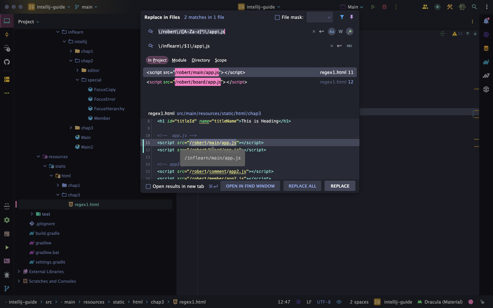
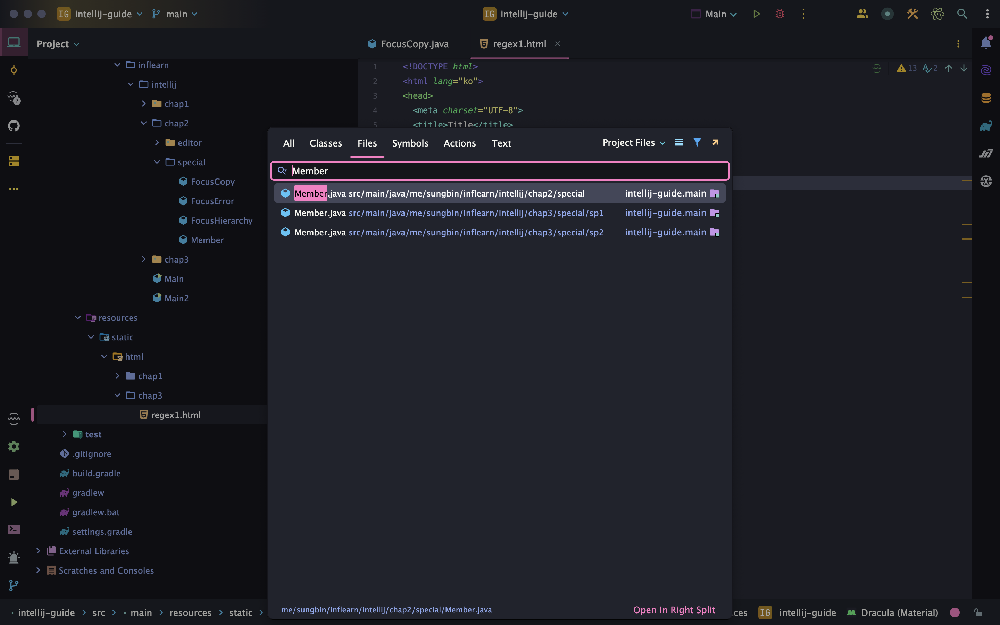
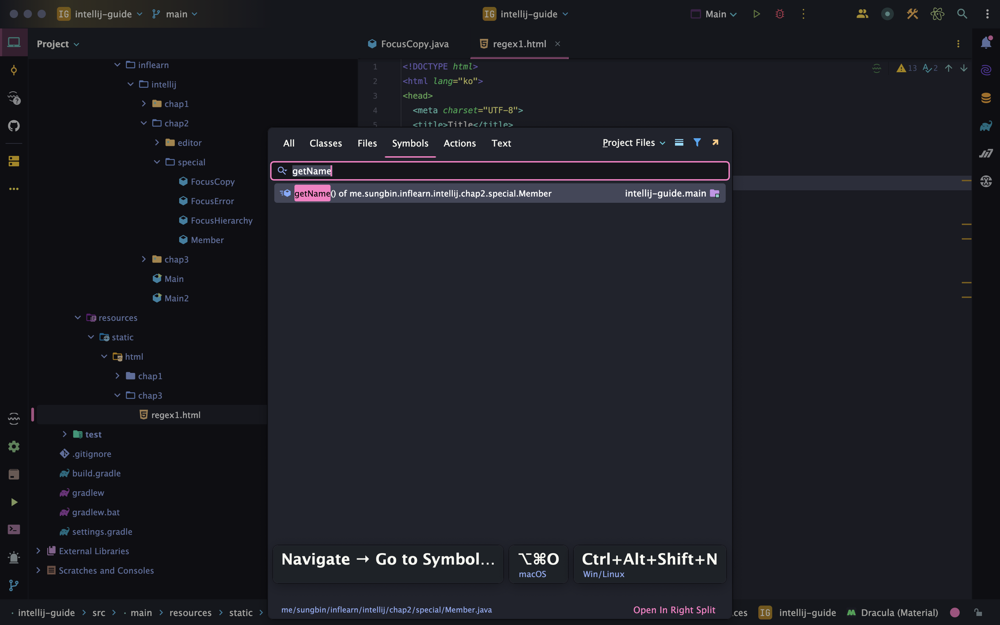
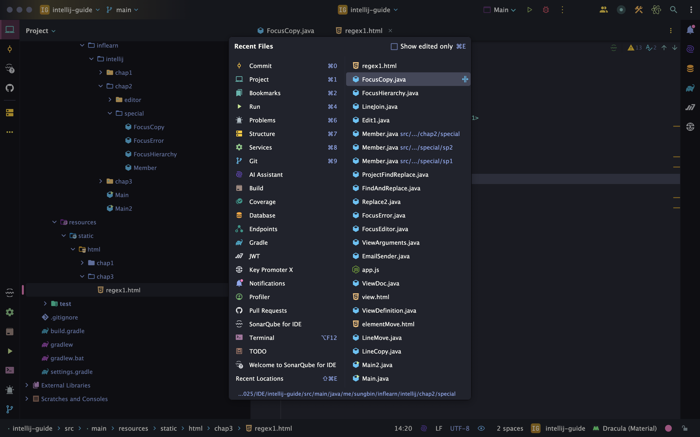

> 해당 블로그 글은 [향로님의 인프런 강의](https://inf.run/NwFz)를 바탕으로 쓰여진 글입니다.

## 검색 텍스트

### 현재 파일 검색

이 기능도 여러분은 누구나 알 수 있는 단축키이다.

> ⌨️ 단축키
>
> - 맥: command + f
> - 윈도우/리눅스: Ctrl + f

### 현재 파일에서 교체

> ⌨️ 단축키
>
> - 맥: command + r
> - 윈도우/리눅스: Ctrl + r

### 전체에서 검색

> ⌨️ 단축키
>
> - 맥: command + Shift + f
> - 윈도우/리눅스: Ctrl + Shift + f

### 전체에서 교체

> ⌨️ 단축키
>
> - 맥: command + Shift + r
> - 윈도우/리눅스: Ctrl + Shift + r

### 정규 표현식으로 검색, 교체

이 부분은 매우 유용하다. 정규식으로 특정 부분만 교체하고 싶을 때 사용한다. 대표적인 예시로 아래 코드를 보자.

``` html
<!DOCTYPE html>
<html lang="ko">
<head>
  <meta charset="UTF-8">
  <title>Title</title>
</head>
<body>
  <h1 id="titleId" name="titleName">This is Heading</h1>

  <!--  app.js -->
  <script src="/robert/main/app.js"></script>
  <script src="/robert/board/app.js"></script>

  <!-- app2.js  -->
  <script src="/robert/comment/app2.js"></script>
  <script src="/robert/member/app2.js"></script>
</body>
</html>
```

위의 코드에서 app.js의 상단에 'robert'를 inflearn으로 변경하고 싶을 때 사용하면 된다. 방법은 다음과 같다. 먼저 **전체에서 교체** 단축키를 한 후 아래 이미지처럼 우측 상단에 *모양의 Regex를 체크하면 된다.



## 검색 기타

### 파일 검색

> ⌨️ 단축키
>
> - 맥: Shift + command + o
> - 윈도우/리눅스: Shift + Ctrl + n

실행 화면은 다음과 같다.



### 메서드 검색

> ⌨️ 단축키
>
> - 맥: option + command + o
> - 윈도우/리눅스: Shift + Ctrl + Alt + n

실행 화면은 다음과 같다.



### Action 검색

> ⌨️ 단축키
>
> - 맥: Shift + command + a
> - 윈도우/리눅스: Shift + Ctrl + a

실행 화면은 다음과 같다.


### 최근에 열었던 파일 목록 보기

> ⌨️ 단축키
>
> - 맥: command + e
> - 윈도우/리눅스: Ctrl + e

실행 화면은 다음과 같다.



### 최근에 수정했던 파일 목록 보기

> ⌨️ 단축키
>
> - 맥: command + Shift + e
> - 윈도우/리눅스: Ctrl + Shift + e

실행 화면은 다음과 같다.


> 잘못된 지식이 있을 경우 댓글로 남겨주시면 빠르게 반영하겠습니다!