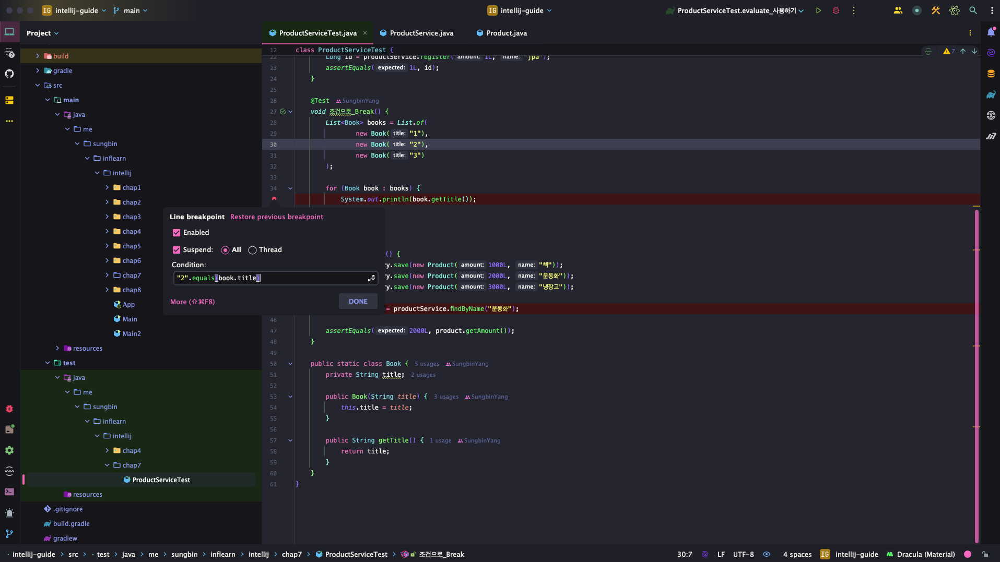
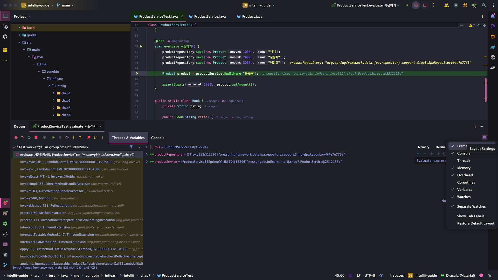
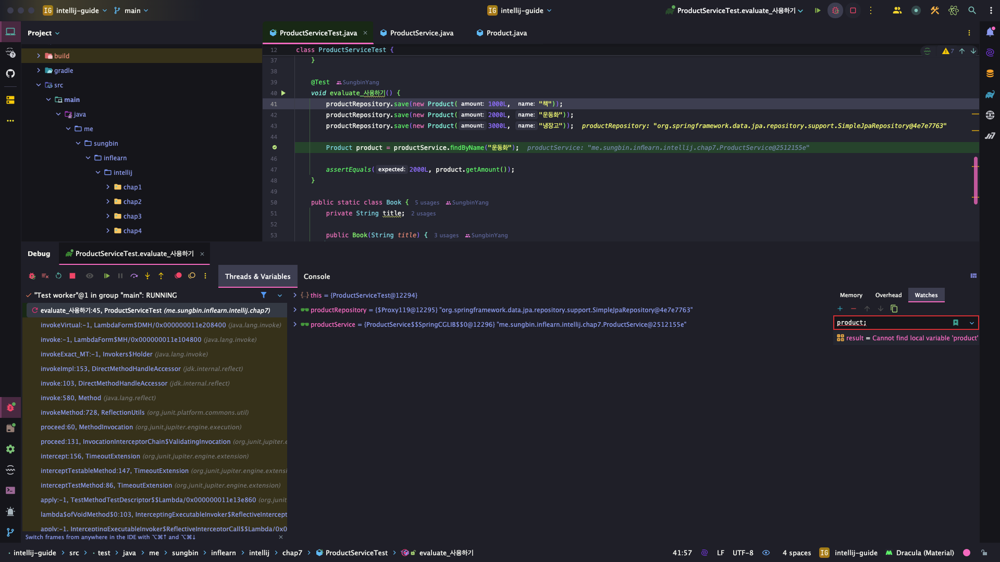
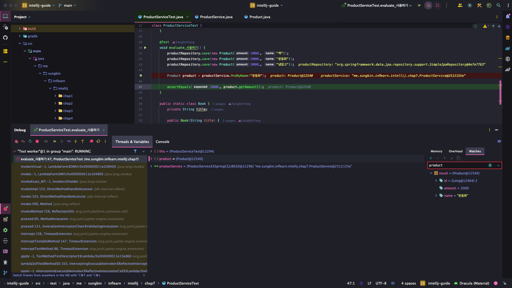

> 해당 블로그 글은 [향로님의 인프런 강의](https://inf.run/NwFz)를 바탕으로 쓰여진 글입니다.

## 디버깅

디버깅이란, 소프트웨어에서 오류 또는 버그를 찾아 개발이나 실행 중 발생하는 시스템의 논리적 오류나 비정상적인 연산을 찾아내고 수정하는 작업 과정이다. 그러면 디버깅 과정과 단축키에 대해 살펴보자.

### 디버그 모드로 실행(현재 위치)

> ⌨️ 단축키
>
> - 맥: Ctrl + Shift + d
> - 윈도우/리눅스: 단축키 없음

### 디버그 모드로 실행(이전에 실행한 메서드)

> ⌨️ 단축키
>
> - 맥: Ctrl + d
> - 윈도우/리눅스: Shift + F9

그러면 디버깅 실행 화면을 살펴보자.


디버깅 창을 보면 왼쪽이 `call stack`이라고 해서 해당 메서드의 브레이크 포인트까지 어떤 걸 타고 왔냐를 볼 수 있는 화면이다. 오른쪽 창은 `variable`이라고 해서 해당 브레이크 포인트까지 쓸 수 있는 변수들을 나열해 놓은 것이다. 보통 우리는 실무에서 디버깅을 할 때 `variable`의 변화를 보면서 코드의 흐름을 파악하곤 한다.

> ✅ 용어정리
>
> 브레이크 포인트란, 코드 실행에 있어서 오류가 의심되는 부분이나 실행 중 연산하는 값을 중간 확인해야 하는 부분에 종단점이라고 볼 수 있다.

그러면 이제 디버그 모드에서 다양한 기능들을 살펴보자.

### Resume: 다음 브레이크 포인트로 이동하기

> ⌨️ 단축키
>
> 맥: command + option + r
> 윈도우/리눅스: F9

### Step Over: 현재 브레이크에서 다음 한 줄로 넘어가기

> ⌨️ 단축키
>
> F8

### Step Into: 현재 브레이크의 다음 메서드 이동

> ⌨️ 단축키
>
> F7

### Step Out: 현재 메서드 밖으로 이동

> ⌨️ 단축키
>
> Shift + F8

### 조건식 브레이크

아래와 같이 코드가 있을 때 2번째 요소 아이템에만 브레이크 포인트를 걸고 싶을 때가 있을 것이다.

``` java
@Test
void 조건으로_Break() {
  List<Book> books = List.of(
          new Book("1"),
          new Book("2"),
          new Book("3")
  );

  for (Book book : books) {
      System.out.println(book.getTitle());
  }
}
```

그럴 때 브레이크 포인트를 출력 코드에 두고 오른쪽 마우스를 클릭 하면 아래와 같은 팝업창이 뜨는데 여기서 원하는 조건을 코드로 적어주면 된다.



### Evaluate Expression: 브레이크 된 상태에서 코드 즉시 실행

해당 기능은 브레이크 포인트까지 사용 가능한 모든 변수 및 메서드를 이용해서 테스트 해보고 싶은 기능들을 테스트 해볼 수 있다.

``` java
@Test
void evaluate_사용하기() {
  productRepository.save(new Product(1000L, "책"));
  productRepository.save(new Product(2000L, "운동화"));
  productRepository.save(new Product(3000L, "냉장고"));

  Product product = productService.findByName("운동화");

  assertEquals(2000L, product.getAmount());
}
```

위의 코드에서 `findByName` 라인에 브레이크 포인트를 잡았다고 한다면 productRepository변수와 해당 인터페이스가 제공하는 메서드들을 전부 이용하여 Evaluate Expression을 해볼 수 있다.

> ⌨️ 단축키
>
> 맥: option + F8
> 윈도우/리눅스: Alt + F8

실행화면은 다음과 같다.


### watch: 브레이크 이후의 코드 변경 상태 확인하기

해당 기능은 단축키가 없다. 그러면 버튼이라도 좀 보이게 있어야 하는데 처음 접하시는 분들은 버튼이 어디 있는지 모를 것이다. 처음에는 안 보인다. 이것을 보이게끔 세팅을 해줘야 한다. 가장 우측에 칠판모양 아이콘인 `Layer Settings`를 클릭 후 `Seperate Watches`를 클릭하면 위에 `Watches`탭이 아래와 같이 활성화 된다.



그리고 한번 product라고 입력해보자. 그러면 아래와 같이 변수가 없다고 나올 것이다.



당연한 이야기이다. product라는 지역변수가 없으니 안 나올 것이다. 다만, Step Over 단축키를 통해 다음 라인으로 이동해보자. 그러면 갑자기 아래처럼 product 변수에 값이 나올 것이다.



### Evaluate Expression vs watch

언제 Evaluate Expression을 사용하고 언제 watch를 사용해야할까? Evaluate Expression은 해당 순간 즉시 값을 확인해보거나 테스트 해보고 싶을 때 자주 사용하며, watch는 브레이크 시점부터 다음 브레이크까지 상태를 연속적으로 확인할 때 사용을 한다. 이 점을 생각하면서 적용해보자.

## 추가

### 브레이크 포인트 잡는 단축키

마우스로 브레이크 포인트를 잡을 수 있지만 단축키로도 잡을 수 있다.

> ⌨️ 단축키
>
> - 맥: command + F8
> - 윈도우/리눅스: Ctrl + F8


> 잘못된 지식이 있을 경우 댓글로 남겨주시면 빠르게 반영하겠습니다!

