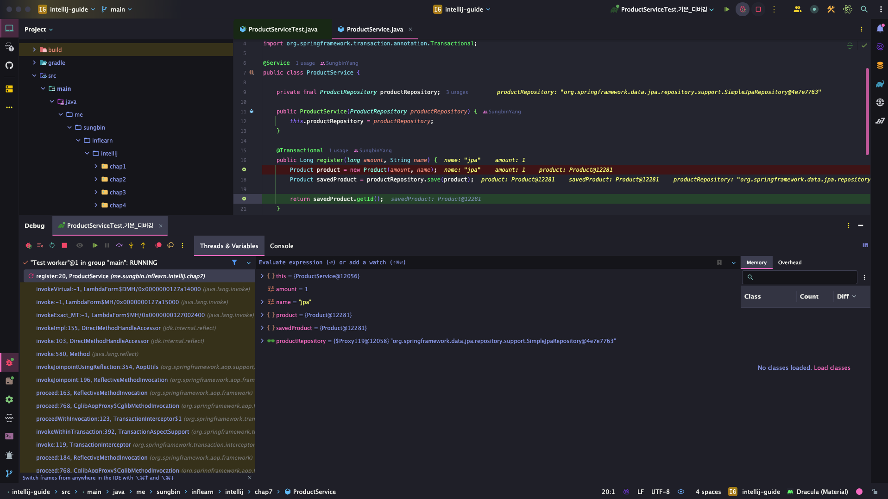
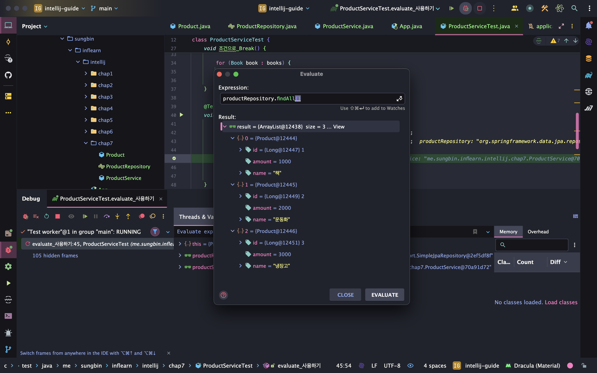

> 해당 블로그 글은 [향로님의 인프런 강의](https://inf.run/NwFz)를 바탕으로 쓰여진 글입니다.

## 디버깅

디버깅이란, 소프트웨어에서 오류 또는 버그를 찾아 개발이나 실행 중 발생하는 시스템의 논리적 오류나 비정상적인 연산을 찾아내고 수정하는 작업 과정이다. 그러면 디버깅 과정과 단축키에 대해 살펴보자.

### 디버그 모드로 실행(현재 위치)

> ⌨️ 단축키
>
> - 맥: Ctrl + Shift + d
> - 윈도우/리눅스: 단축키 없음

### 디버그 모드로 실행(이전에 실행한 메서드)

> ⌨️ 단축키
>
> - 맥: Ctrl + d
> - 윈도우/리눅스: Shift + F9

그러면 디버깅 실행 화면을 살펴보자.

디버깅 창을 보면 왼쪽이 `call stack`이라고 해서 해당 메서드의 브레이크 포인트까지 어떤 걸 타고 왔냐를 볼 수 있는 화면이다.

> ✅ 용어정리
>
> 브레이크 포인트란, 코드 실행에 있어서 오류가 의심되는 부분이나 실행 중 연산하는 값을 중간 확인해야 하는 부분에 종단점이라고 볼 수 있다.

그러면 이제 디버그 모드에서 다양한 기능들을 살펴보자.

### Resume: 다음 브레이크 포인트로 이동하기

> ⌨️ 단축키
>
> 맥: command + option + r
> 윈도우/리눅스: F9

### Step Over: 현재 브레이크에서 다음 한 줄로 넘어가기

> ⌨️ 단축키
>
> F8

### Step Into: 현재 브레이크의 다음 메서드 이동

> ⌨️ 단축키
>
> F7

### Step Out: 현재 메서드 밖으로 이동

> ⌨️ 단축키
>
> Shift + F8

### Evaluate Expression: 브레이크 된 상태에서 코드 즉시 실행

> ⌨️ 단축키
>
> 맥: option + F8
> 윈도우/리눅스: Alt + F8

실행화면은 다음과 같다.

### watch: 브레이크 이후의 코드 변경 상태 확인하기

해당 기능은 단축키가 없고 디버깅 채널에 안경모양 아이콘을 클릭하면 된다.

> 잘못된 지식이 있을 경우 댓글로 남겨주시면 빠르게 반영하겠습니다!

