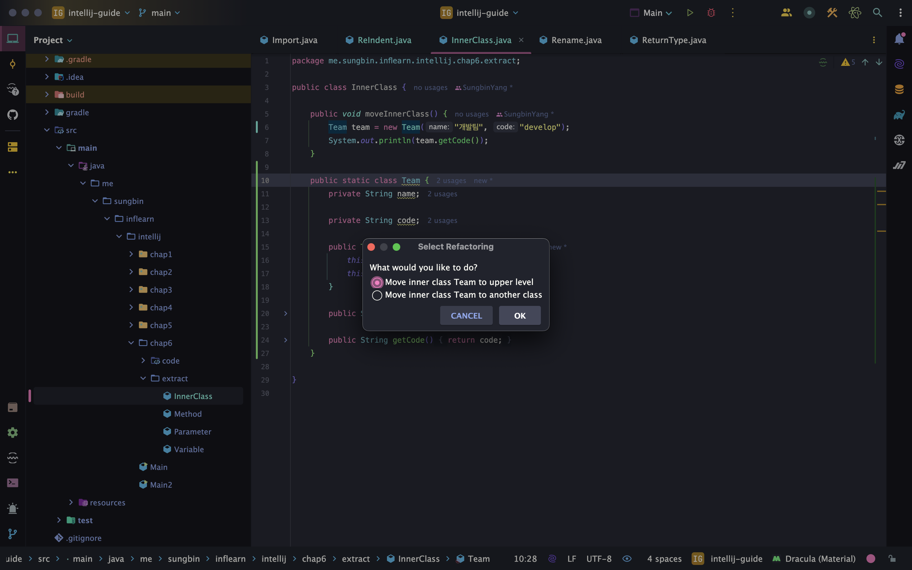
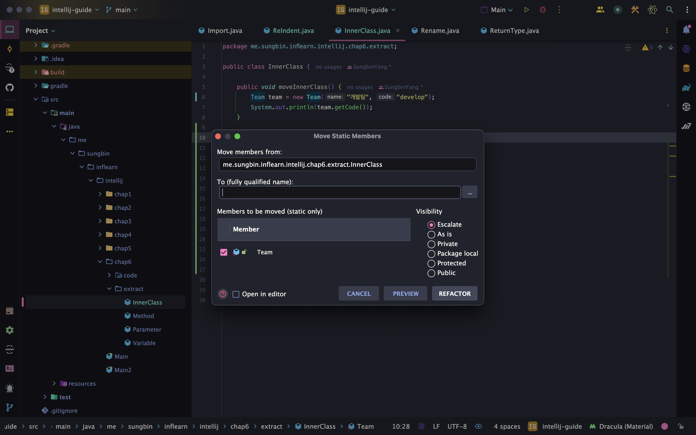
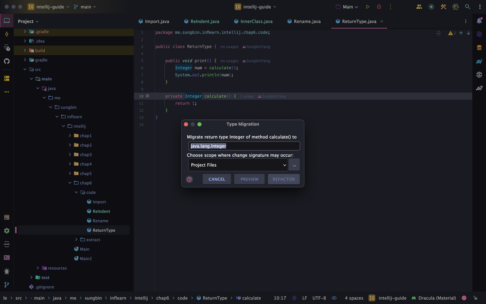
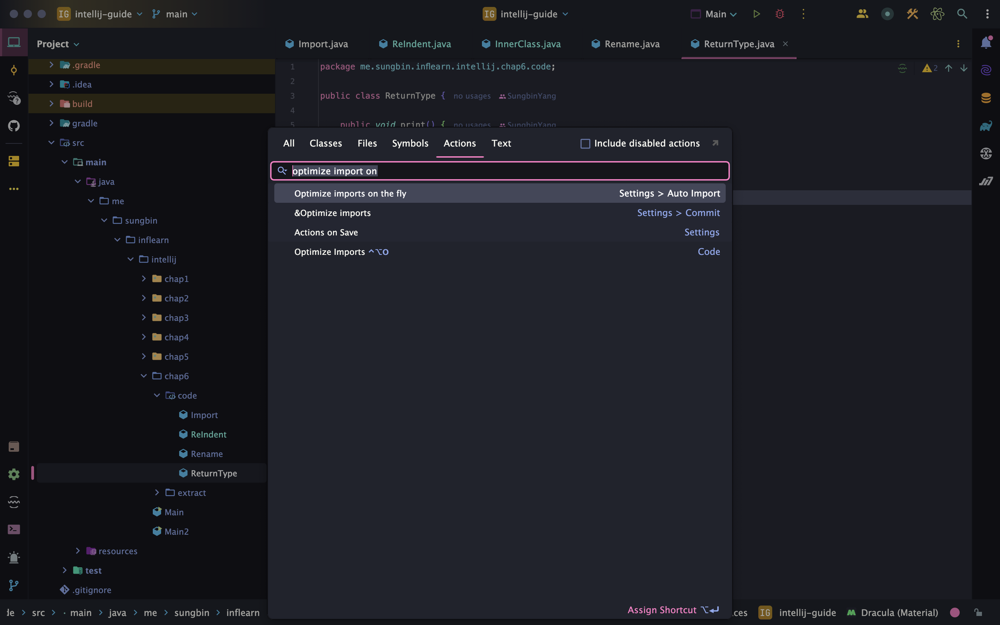
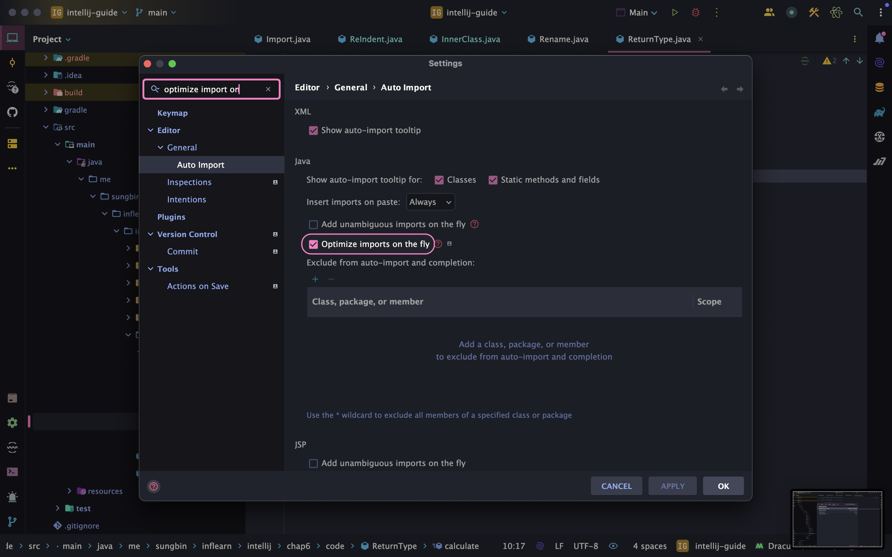

> 해당 블로그 글은 [향로님의 인프런 강의](https://inf.run/NwFz)를 바탕으로 쓰여진 글입니다.

## 리팩토링 extract

인텔리제이는 리팩토링 작업을 위한 여러 자동화된 도구나 기능들을 제공한다. 코드 변경을 수동으로 할 때 생길 수 있는 착오 입력이나 오동작을 막을 수 있으며, 빠른 리팩토링을 가능하게 한다. 그러면 천천히 단축키를 알아보자.

### 변수 추출하기

> ⌨️ 단축키
>
> - 맥: command + option + v
> - 윈도우/리눅스: Ctrl + Alt + v

### 파리미터 추출하기

> ⌨️ 단축키
>
> - 맥: command + option + p
> - 윈도우/리눅스: Ctrl + Alt + p

### 메서드 추출하기

> ⌨️ 단축키
>
> - 맥: command + option + m
> - 윈도우/리눅스: Ctrl + Alt + m

### 이너 클래스 추출하기

해당 단축키는 '추출하기'라고 말했지만 사실 상 이동하기이다. 해당 내부 클래스를 다른 곳에서도 사용할 상황이 발생할 때 원하는 패키지 경로로 이동시킬 수 있다. 단축키를 알아보기 전에 먼저 실행화면부터 살펴보자.

``` java
package me.sungbin.inflearn.intellij.chap6.extract;

public class InnerClass {

    public void moveInnerClass() {
        Team team = new Team("개발팀", "develop");
        System.out.println(team.getCode());
    }

    public static class Team {
        private String name;

        private String code;

        public Team(String name, String code) {
            this.name = name;
            this.code = code;
        }

        public String getName() {
            return name;
        }

        public String getCode() {
            return code;
        }
    }

}
```

위와 같은 `Team` 내부 클래스를 다른 곳에서도 사용해야해서 이동 시키려고 한다. 그럴 때 내부 클래스 이름에 포커스를 두고 단축키를 사용하면 아래와 같이 화면이 나온다.



팝업에서는 해당 내부 클래스를 다른 상위레벨로 옮길 것이냐 혹은 다른 클래스로 만들 것이냐고 물어보는 것이다. 첫번째 옵션은 같은 패키지에서 옮겨지는 것이고 두번째 옵션은 다른 패키지로 옮기는 것이다. 어느 옵션을 하던 일단 선택하자.



그러면 위와 같이 나오는데 여기에 패키지명을 적어주고 refactor 버튼을 클릭해주면 된다.

> ⌨️ 단축키
>
> F6

## 리팩토링 기타

### 이름 일괄 변경하기

> ⌨️ 단축키
>
> Shift + F6

### 타입 일괄 변경하기

> ⌨️ 단축키
>
> - 맥: Shift + command + F6
> - 윈도우/리눅스: Shift + Ctrl + F6

실행화면은 다음과 같다.



타입에 포커스를 두고 단축키를 사용하면 위와 같은 팝업이 나오는데 원하는 타입으로 변경하면 된다.

### Import 정리하기

> ⌨️ 단축키
>
> - 맥: Ctrl + option + o
> - 윈도우/리눅스: Ctrl + Alt + o

하지만 이렇게 단축키를 이용해서 안 쓰는 import문을 정리하면 되지만 Action 검색에 optimize import on을 검색을 해서 하면 자동으로 해준다.





위와 같이 강조된 체크박스에 체크를 해주면 앞으로 코드 생성 시, 안 쓰는 import문을 정리해준다.

### 코드 자동 정렬

> ⌨️ 단축키
>
> - 맥: command + option + L
> - 윈도우/리눅스: Ctrl + Alt + L

> 잘못된 지식이 있을 경우 댓글로 남겨주시면 빠르게 반영하겠습니다!

