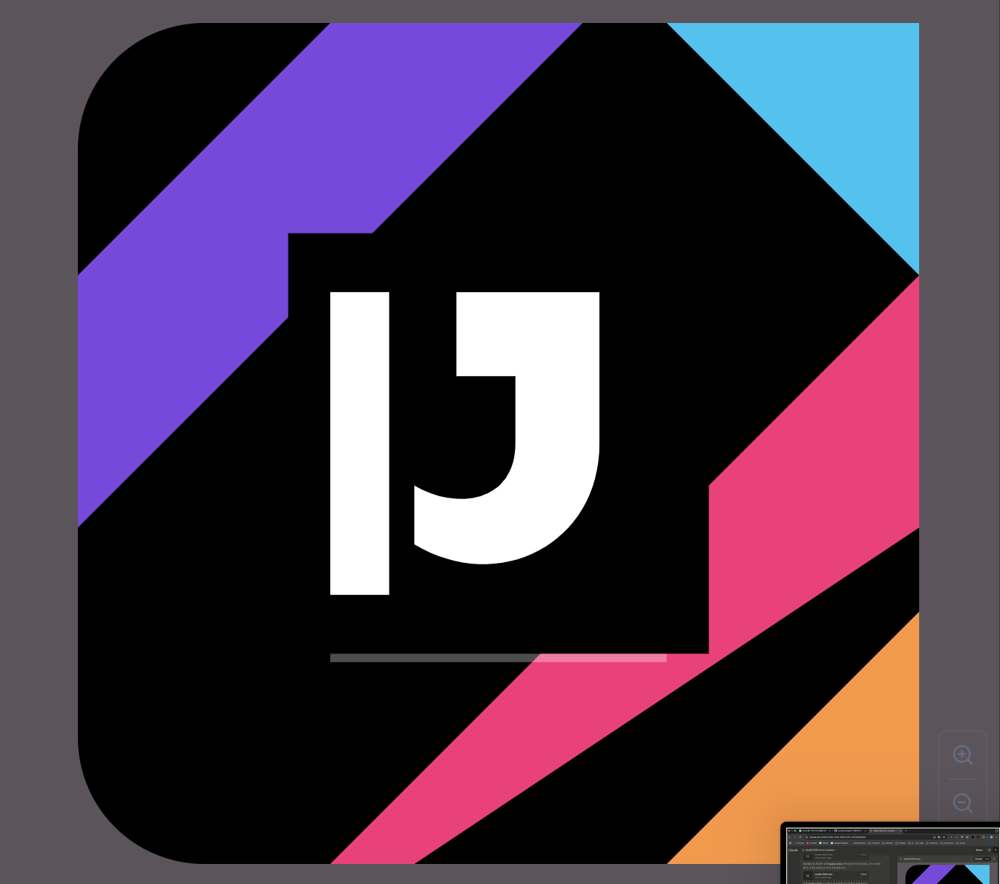
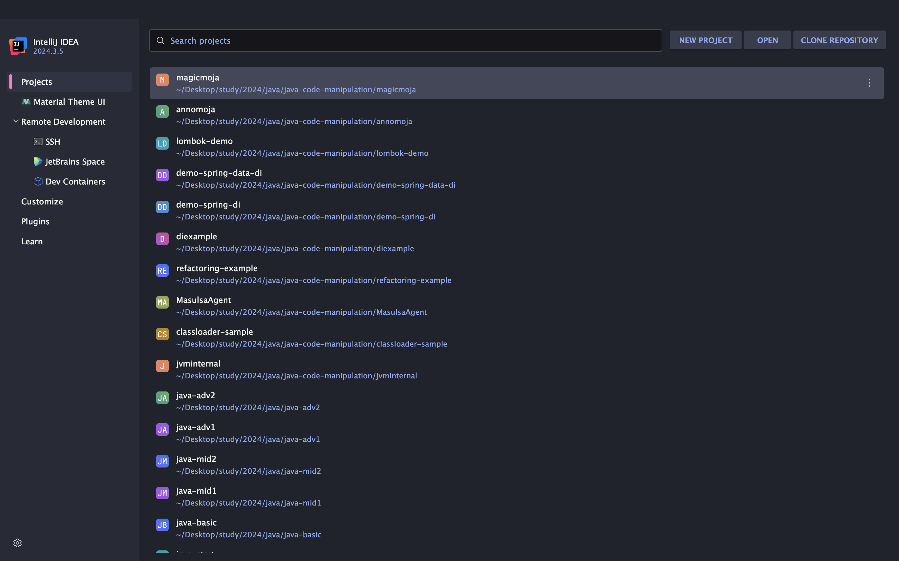
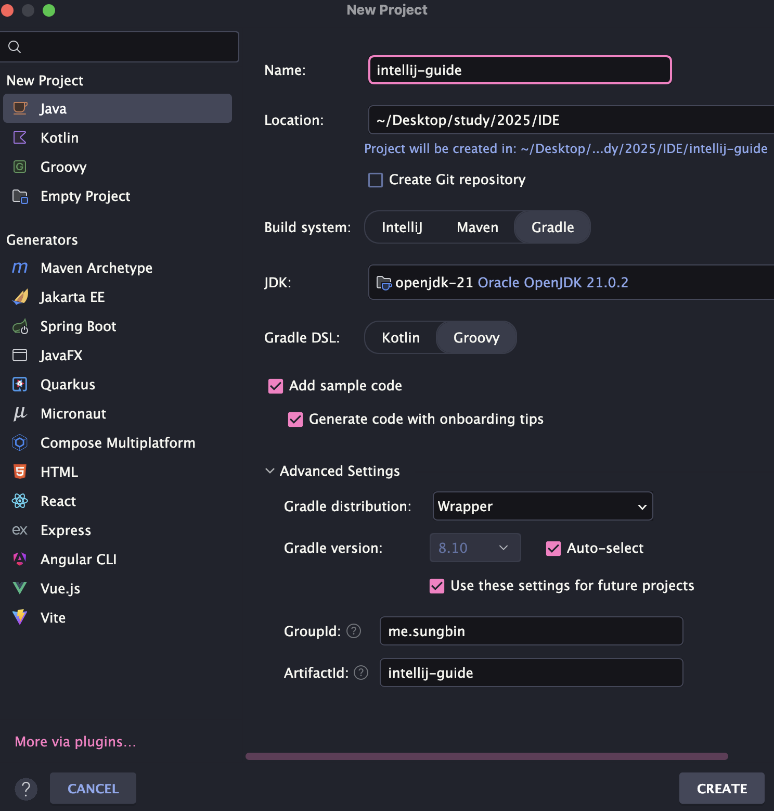
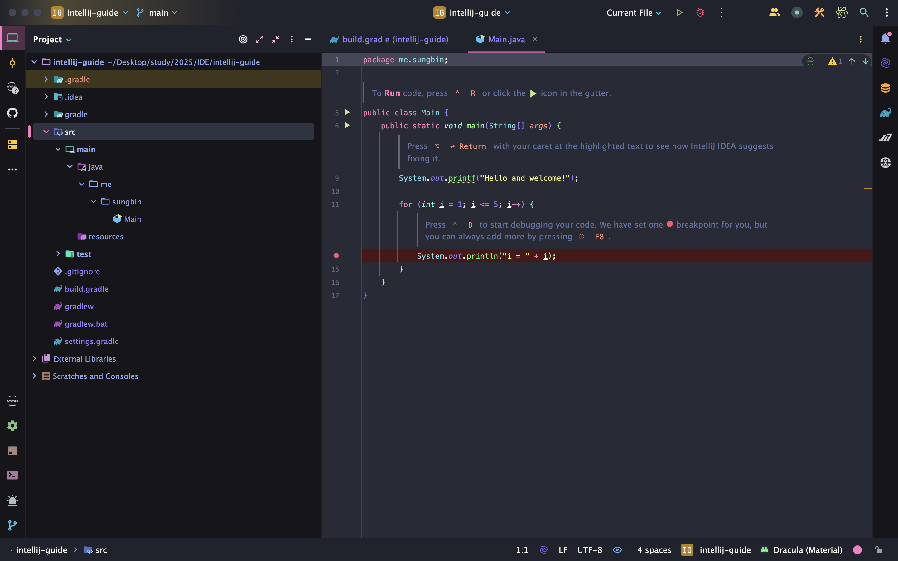
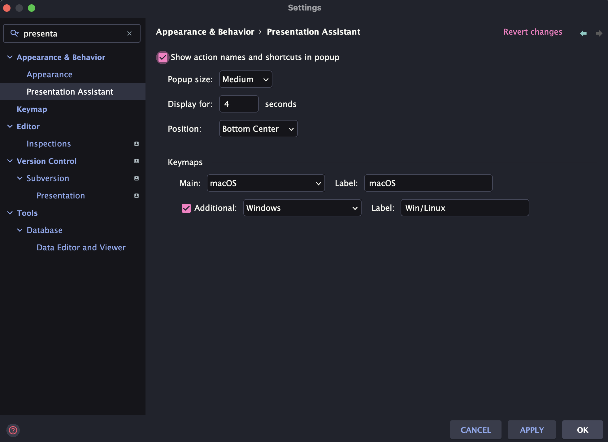

> 해당 블로그 글은 [향로님의 인프런 강의](https://inf.run/NwFz)를 바탕으로 쓰여진 글입니다.

## 왜 해당 글을 쓰려는가?

개발에 있어서 가장 중요한 것은 프로그래밍 언어이다. 하지만 그 언어를 이용하여 프로젝트를 진행할 때 가장 중요한 역할을 하는 것은 바로 IDE다. 이 강의와 글을 바탕으로 다른 분들이 업무에 적용하셔서 더 효과적인 업무환경을 만들고자 이 글을 시작하려 한다.

## Toolbox 소개

몇몇 분들은 실제 인텔리제이 같은 프로그램을 직접 설치하시는 경우가 있으신 경험이 있을 것이다. 필자도 그랬다. 하지만 매번 IDE 버전이 올라갈때마다 설치를 해줘야 하고 세밀한 세팅도 하기 힘든 구조였다. 필자는 그래서 아래와 같이 생각을 해 본 경험이 있다.

> 이럴꺼면 이클립스랑 뭐 다를께 없구만!

하지만 젯브레인은 이런 것을 좀 더 편리하게 해주고자 Toolbox를 제공해준다. Toolbox 앱을 설치만 하면 해당 앱을 통해서 자유롭게 젯브레인에서 제공하는 프로그램들을 설치 할 수 있다. 또한 간편한 세팅도 제공을 해준다. 대표적으로 프로그램들의 힙 사이즈를 변경할 수 있다. 가끔 인텔리제이 같은 프로그램을 돌리다가 메모리 부족으로 강제종료 한 경험도 있을 것이다. 이럴때 해당 힙 사이즈를 조절해주면 된다.

> 💡 꿀팁
>
> 기본 힙 사이즈는 아마 750MB일 것이다. 하지만 본인에 환경에 맞게 조절을 하면 된다. 예를 들어 내 PC 메모리가 8GB라 한다면 1GB로 16GB라 한다면 2~4GB로 맞춰주면 훨씬 원활하게 작업할 수 있을 것이다. 물론 필자는 기본 세팅을 그대로 유지했다.

그리고 가장 혁신 적인 부분은 바로 Release버전과 Release EAP 버전을 선택할 수 있다. Release버전은 정식 버전이며, Release EAP버전은 베타 버전이고 본인이 원하는 버전에 선택해서 IDE를 설치하면 된다.

> ⚠️ 주의
>
> Release EAP는 베타버전이라 플러그인 충돌 및 잔 오류가 존재할 수 있다. 그래서 필자는 Release 버전을 추천한다.

## 프로젝트 생성

이제 그러면 프로젝트를 한번 생성해보려 한다. 필자는 인텔리제이로 자바 프로젝트를 생성하려 한다. 그러면 먼저 인텔리제이를 실행시켜야 한다. 처음 설치하고 실행하면 뭔가 이것저것 물어보는게 많을 것이다. 이것은 구글링을 통해 살펴보면 될 것 같아서 이 글에는 따로 남기지 않겠다.

인텔리제이를 실행시키면 아래와 같이 나올 것이다.

필자는 이전에 여러 프로젝트를 해봐서 위와 같이 뜨는데 처음 설치하시는 분들이라면 위의 화면과 다를 수 있다. 다음으로 New Project를 클릭하자. 그러면 아래와 같이 볼 수 있을 것이다.

필자는 위와 같이 세팅을 했다. 물론 프로젝트 빌드 시스템을 인텔리제이로 할 수 있다. 하지만 필자는 Gradle로 했고 실제로도 Gradle이나 Maven을 추천한다. 그 이유는 프로젝트를 진행하다 보면서 여러 라이브러리들이 필요할 경우가 있는데 실제 Gradle이나 Maven을 사용하면 해당 라이브러리 url만 넣어주면 알아서 의존성 주입을 해준다. 쉽게 말해 설치해주는 것이다. 하지만 인텔리제이 빌드 시스템을 이용한다면 우리가 직접 해당 라이브러리 jar파일을 설치해줘야 한다.

> ✅ 용어 정리
>
> - GroupId: 프로젝트 그룹(ex. spring-projects)
> - ArtifactId: 그룹의 하위 모듈(ex. spring-aop)

이제 위와 같이 세팅을 하고 create를 눌러주면 아래와 같이 화면이 나오는 것을 볼 수 있다.

이제 간단한 플러그인까지 설치해보자. 지금 필자는 맥환경이지만 독자는 다른 환경인 사람들이 있을 것이다. 각 환경마다 단축키가 달라서 화면에 보여주는 플러그인을 설치하려 한다. 바로 Presentation Assistant이다. 이전에는 플러그인으로 존재했지만 IntelliJ 2023.03버전부터 플러그인 Presentation Assistant 기능이 인텔리제이로 내장되었다고 한다. 혹시 플러그인에서 검색이 안 되시는 독자들은 settings에서 검색해보시면 찾으실 수 있으실것이다. 필자는 아래와 같이 세팅을 했으니 참고 바란다.

## 결론

앞으로의 시리즈에서 단축키 위주로 진행을 할 예정이다. 반드시 해당 단축키를 암기만 하지 말고 직접 사용해보면서 체득하는게 해당 시리즈에서 가장 중요할 것 같다.

> 잘못된 지식이 있을 경우 댓글로 남겨주시면 빠르게 반영하겠습니다!