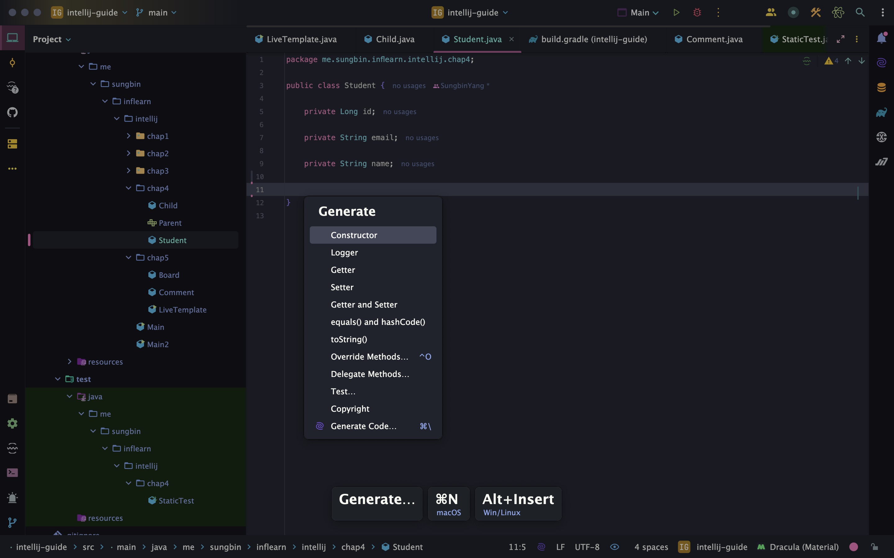
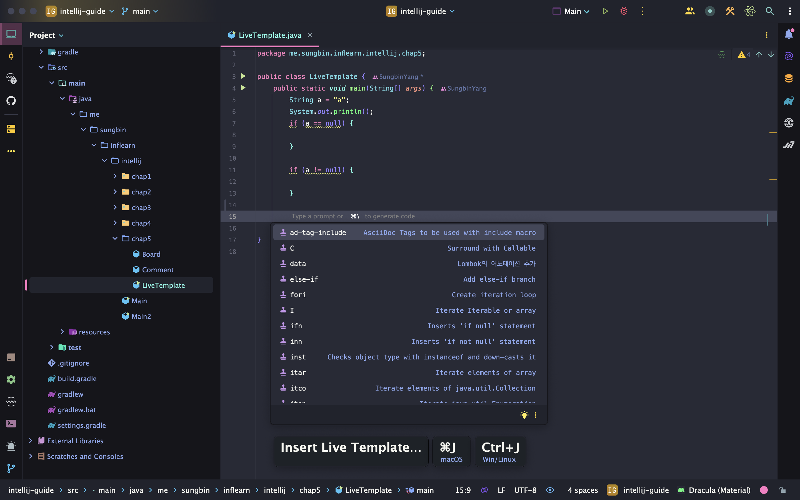
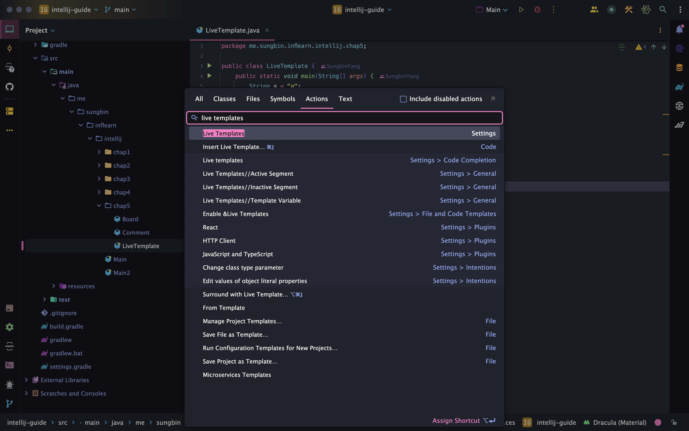
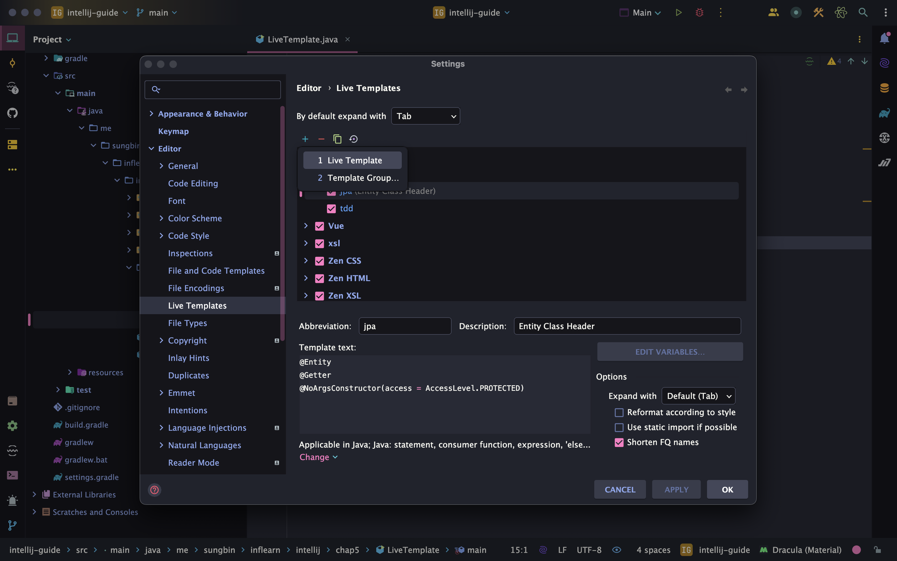
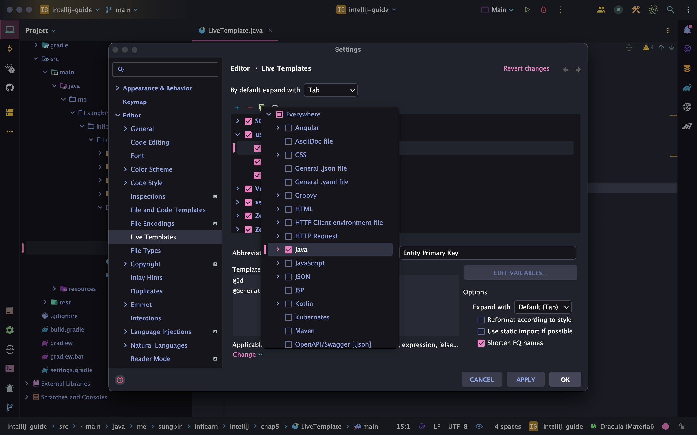

> 해당 블로그 글은 [향로님의 인프런 강의](https://inf.run/NwFz)를 바탕으로 쓰여진 글입니다.

## 자동완성

자동완성은 매우 중요하다. 개발자가 일일이 하나하나 전부 타이핑을 한다면 개발하는데 시간이 매우 오래 걸리기 때문이며, 비즈니스 로직에 작성하는데도 방해가 될 것이다. 이런 불편함에 많은 개발자들은 자동완성 기능을 많이 이용한다. 그러면 자동완성 기능을 알아보자.

### 스마트 자동완성

스마트 자동완성이란, 말 그대로 똑똑하게 자동완성을 시켜준다. 대표적인 예시로 아래의 코드가 있을때 해당 인터페이스에 어떤 구현체가 들어가야할지 혹은 파라미터에 어떤 값이 들어가는게 좋을지 선별해서 IDE가 우리에게 알려준다.

``` java
package me.sungbin.inflearn.intellij.chap4;

import org.junit.jupiter.api.Test;

import java.util.Calendar;
import java.util.GregorianCalendar;
import java.util.Locale;

class StaticTest {

    @Test
    void name() {
        // 스마트 자동완성 기능으로 구현체도 선별할 수 있고 구현체뿐만 아니라 구현체의 파리미터 값도 알 수 있다.
        Calendar c = new ;
    }
}
```

> ⌨️ 단축키
>
> Ctrl + Shift + Space

### 스태틱 메서드 자동완성

테스트 코드를 작성하다보면 `assertThat`과 같은 static 메서드를 import하기가 인텔리제이에서 좋게 지원해주지는 않는다. 그럴 때 스태틱 메서드 자동완성 단축키를 쓰면 쉽게 import 혹은 어느 패키지에 있는지 알려준다.

> ⌨️ 단축키
>
> Ctrl + Space + Space

### Getter/Setter/생성자 자동완성

우리는 객체를 설계할 때 getter, setter, 생성자등을 다양하게 만들어야 할 수 있다. 그럴 때 우리는 단축키를 이용해서 쉽게 만들 수 있다. 단축키를 사용하면 아래와 같이 나오는데 여기서 골라서 진행하면 된다.



> ⌨️ 단축키
>
> - 맥: command + n
> - 윈도우/리눅스: Alt + Insert

### 오버라이드 메서드 자동완성

우리는 인터페이스를 구현하거나 상속을 받아서 오버라이딩 메서드를 구현해야 하는 경우에도 쉽게 하는 경우가 있다. 원래는 기존 구현해야 할 메서드들을 복사해서 구현하거나 클래스에 빨간 밑줄이 그어지면 `Alt + Enter`를 이용해서 구현해야 하는 경우가 있었는데 더 쉽게 하는 단축키가 존재한다.

> ⌨️ 단축키
>
> Ctrl + i

## Live Template

### Live Template?

라이브 템플릿은 미리 약속된 약어를 입력하고 특정 키를 누르면 미리 구성되어 템플릿화되어 있는 코드를 화면에 자동으로 표시해주는 기능이다. 우리가 이전에 학습했던 `main`, `psvm`, `sout`등이 그렇다. 하지만 우리가 이런 약어를 전부 알 수는 없다. 그래서 이런 목록들을 볼 수 있게 인텔리제이가 단축키를 제공해준다.

> ⌨️ 단축키
>
> - 맥: command + j
> - 윈도우/리눅스: Ctrl + j



대표적으로 해당 변수에 대한 if 긍정 조건문을 쉽게 만드는 `ifn`과 if 부정 조건문을 만드는 `inn`이 있다.

## Custom Live Template

우리는 우리의 입맛에 맞게 라이브 템플릿을 커스텀해서 만들 수 있다. 그런 방법을 알아보자.

먼저, 우리가 이전에 배운 Action 검색을 키는 `command + Shift + a`를 눌러서 Live Template을 검색하자.



그 후, Settings에 있는 Live Templates를 들어간다.



그 후 + 버튼에 Live Template을 누르고 Abbreviation과 description을 작성 후, 마지막으로 Template text에 작성한다.



그 후, 아래 Define이라는 밑줄이 나올텐데 해당 템플릿을 어느 언어 혹은 프레임워크에 쓸건지 선택해야한다. 본인이 쓸 곳이 어딘지 선택을 하고 apply 후 ok를 하면 끝이다.

> 잘못된 지식이 있을 경우 댓글로 남겨주시면 빠르게 반영하겠습니다!