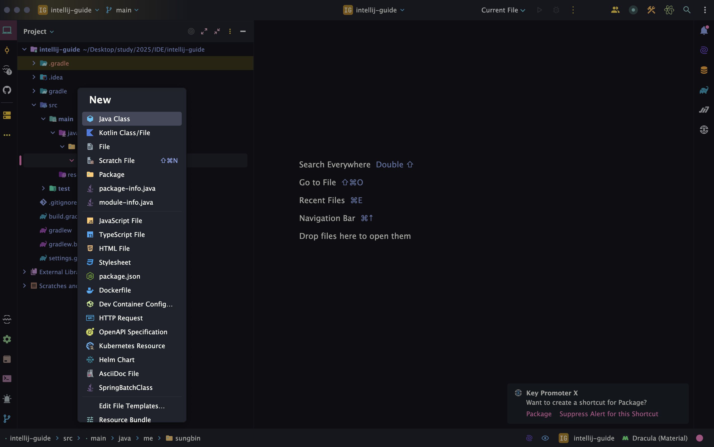
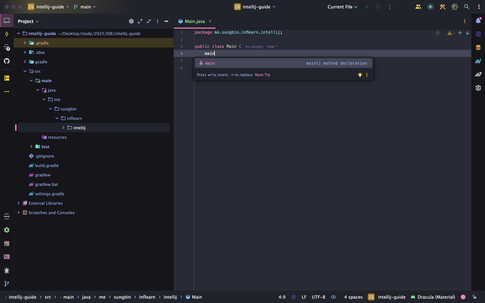
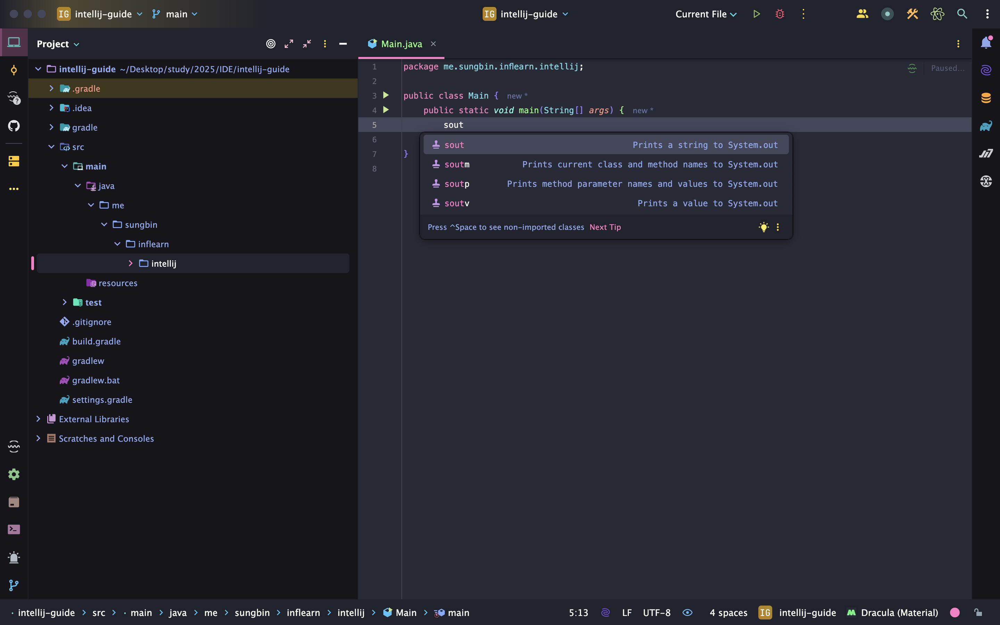
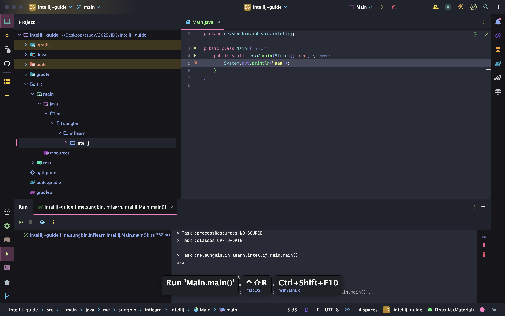
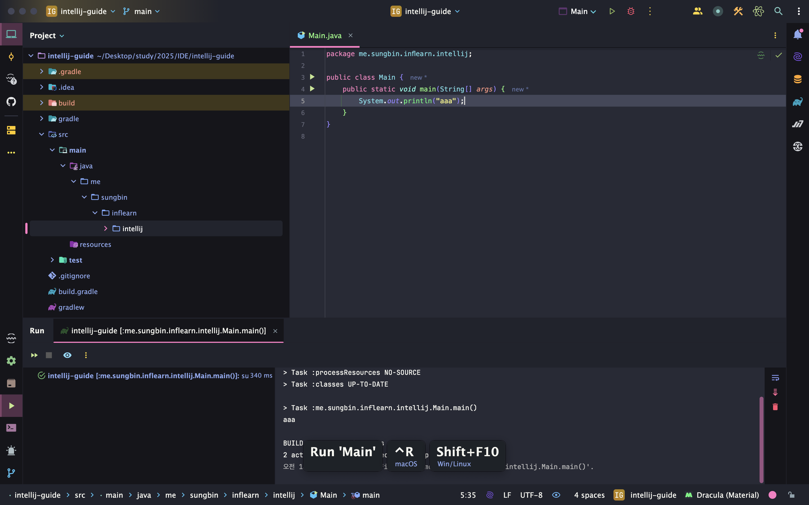
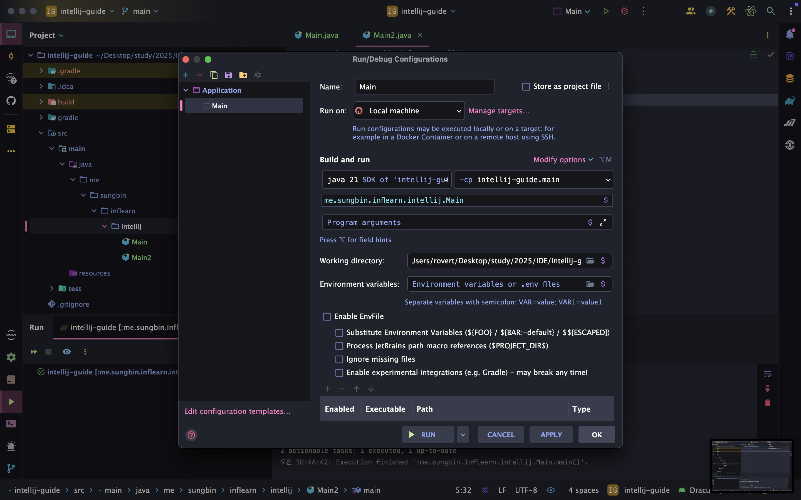
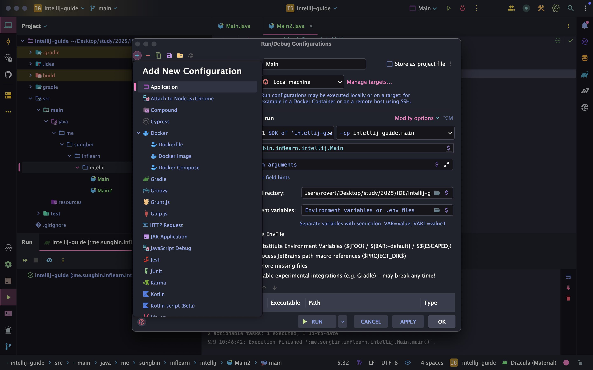

> 해당 블로그 글은 [향로님의 인프런 강의](https://inf.run/NwFz)를 바탕으로 쓰여진 글입니다.

## 서문

지금부터 우리는 IntelliJ에서 단축키를 통해 조금 더 빠르게 개발을 해보려고 한다. 그러면 왜 우리는 단축키를 알아야 할까? 만약 우리가 단축키 자체가 존재하지 않는다면 우리는 마우스로 작업하다가 코드를 작성할 때는 키보드로 갔다가 매우 불편할 것이다. 단축키만 제대로 배운다면 우리는 키보드만으로도 충분히 개발을 할 수 있을 것이다. 그럼 지금부터 단축키에 대해 알아보자.

## 메인 메서드 생성 및 실행

프로그래밍에 가장 먼저 할 것은 메인 메서드 클래스를 생성하고 실행하는 법을 알아야 한다. 그럼 먼저 디렉토리, 패키지를 생성하고 클래스를 만드는 법에 대해 살펴보자.

### 디렉토리, 패키지, 클래스등 생성 목록 보기

> ⌨️ 단축키
>
> - 맥: command + n
> - 윈도우/리눅스: alt + insert

실행 화면은 아래와 같다.



위의 화면에서 생성을 원하는 부분을 키보드로 입력하거나 찾으면 된다. 상세한 것은 직접 실습을 통해 해보자.

### 코드 템플릿

- 메인 메서드 생성
  - `psvm` 혹은 `main`
- `System.out.println()`
  - `sout`

실행 화면은 아래와 같다.





이제 실행을 해보자. 실행의 방법은 여러가지가 있다. 마우스로 녹색 실행 버튼을 누르는 방법도 있지만 해당 방법은 마우스를 사용해야 한다. 그러면 쉬운 단축키를 알아보자.

### 실행

> ⌨️ 단축키
>
> - 현재 포커스
>   - 맥: Ctrl + Shift + R
>   - 윈도우/리눅스: Ctrl + Shift + F10
> - 이전 포커스
>   - 맥: Ctrl + R
>   - 윈도우/리눅스: Shift + F10

> ✅ 참고
>
> - 현재 포커스: 현재 포커스 가져있는 파일
> - 이전 포커스: 이전에 실행했던 파일

실행화면은 다음과 같다.





이전 포커스를 알 수 있는 방법은 위의 사진에 우측 상단에 'Main'이라고 되어 있는 것으로 구분한다. 이것을 우리는 **Run Configuration**이라는데 실행한 클래스가 이 곳에 담긴다. 이것을 보고 이전 포커스가 무엇인지 확인할 수 있다.

해당 부분을 클릭하여 Edit Configuration을 눌러서 어떤 파일들이 실행이 되었는지 혹은 이곳에 파일을 만들 수 있다.





## 라인 수정하기

이제 라인을 복제, 삭제, 합치는 등 다양한 단축키들을 알아보자.

### 라인 복제하기

> ⌨️ 단축키
>
> - 맥: command + d
> - 윈도우/리눅스: Ctrl + d

### 라인 삭제하기

> ⌨️ 단축키
>
> - 맥: command + delete
> - 윈도우/리눅스: Ctrl + Y

### 라인 합치기

라인 합치기라는게 생소할 수 있을 것이다. 이 부분을 코드를 통해 먼저 보여주고 단축키를 설명하겠다.

라인 합치기 전 코드는 아래와 같다.

``` java
package me.sungbin.inflearn.intellij.chap1.lineedit;

public class LineJoin {

    public String joinString() {
        return "안녕하세요. " +
                "IntelliJ 강의에 오신 것을 " +
                "환영합니다.";
    }

    public String createQuery() {
        return "SELECT * " +
                "FROM MEMBER " +
                "WHERE MEMBER.name = 'robert'";
    }
}
```

라인 합치기를 한 코드는 아래와 같다.

``` java
package me.sungbin.inflearn.intellij.chap1.lineedit;

public class LineJoin {

    public String joinString() {
        return "안녕하세요. IntelliJ 강의에 오신 것을 환영합니다.";
    }

    public String createQuery() {
        return "SELECT * FROM MEMBER WHERE MEMBER.name = 'robert'";
    }
}
```

그럼 단축키를 알아보자.

> ⌨️ 단축키
>
> Ctrl + Shift + J

이번 단축키는 맥과 윈도우/리눅스 둘다 동일하다.

### 라인 단위로 옮기기

라인 단위로 옮기기는 구문 이동과 라인 이동이 있다. 이 둘의 차이는 다음과 같다.

구문 이동은 문법에 맞게 라인 한줄을 이동한다. 라인 한줄을 이동할 때 문법에 맞지 않을 것 같으면 이동하지 않는다. 라인 이동은 구문 무시하고 무작정 라인을 이동하는 것이다.

> ⌨️ 단축키
>
> - 구문이동
>   - 맥: Shift + command + 위/아래 방향키
>   - 윈도우/리눅스: Shift + Ctrl + 위/아래 방향키
> - 라인 이동
>   - 맥: Shift + option + 위/아래 방향키
>   - 윈도우/리눅스: Shift + Alt + 위/아래 방향키

### Element 단위로 옮기기

이 방법은 코드를 좌우로 움직일때 유용하다. 예를 들어, html의 속성 값을 옮기거나 파라미터 값을 위치 조정할때 유용하다.

> ⌨️ 단축키
>
> - 맥: option + Shift + command + 좌/우 방향키
> - 윈도우/리눅스: Alt + Ctrl + Shift + 좌/우 방향키

## 코드 즉시 보기

우리는 프로젝트를 진행하다보면 해당 코드가 어떻게 구현되어 있는지 보고 싶을 때가 존재한다. 그럴 때마다 매번 해당 코드로 가서 직접 확인하는 것은 매우 번거로운 일이다. 그럴 때 단축키를 활용하면 효율적일 것이다.

### 인자 값 즉시 보기

해당 메서드나 클래스의 인자 값을 보고 싶을 때는 아래와 같은 단축키를 활용하면 된다.

> ⌨️ 단축키
>
> - 맥: command + p
> - 윈도우/리눅스: Ctrl + p

### 코드 구현부 즉시 보기

> ⌨️ 단축키
>
> - 맥: option + space
> - 윈도우/리눅스: Shift + Ctrl + i

### 문서 즉시 보기

> ⌨️ 단축키
>
> - 맥: F1
> - 윈도우/리눅스: Ctrl + q

> 잘못된 지식이 있을 경우 댓글로 남겨주시면 빠르게 반영하겠습니다!