> 해당 블로그 글은 [향로님의 인프런 강의](https://inf.run/NwFz)를 바탕으로 쓰여진 글입니다.

## 플러그인

플러그인들을 이용하면 좀 더 편리하기 인텔리제이를 활용할 수 있다. 플러그인들을 어떻게 설치하는지 먼저 알아보자.

우리가 이전에 배웠듯이 `command + shift + a`를 통해 action 탭을 연다. 그리고 plugin을 검색하면 아래와 같이 나온다.

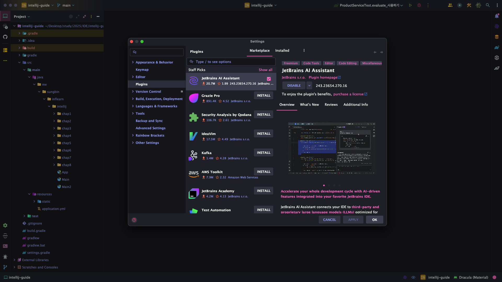

여기서 원하는 플러그인들을 설치하면 된다. 그러면 이제 추천 플러그인들을 살펴보자.

### .ignore

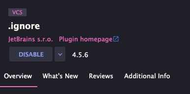

.ignore 플러그인은 `.gitignore`와 같이 ignore파일을 자동완성 해주고 좀 더 색깔도 나오게 해주며 여기에 작성된 파일 혹은 디렉토리는 회색처리 기능 및 새로운 ignore파일을 만들어주는 기능까지 담당한다.

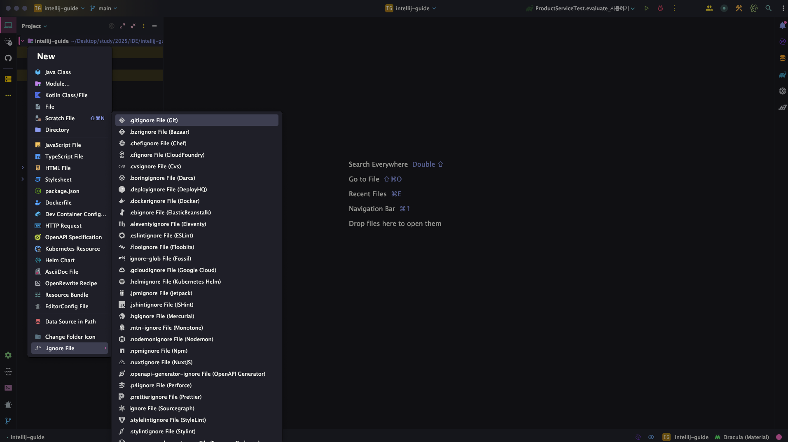

### bash support

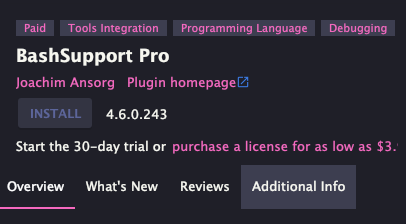

해당 플러그인은 shell script를 작성할 때 오티 및 자동완성을 지원해주는 기능을 한다. 이전에는 bash support 플러그인이 있었으나, 지금은 갑자기 안 보이고 유료로 `BashSupport Pro`로 되어 있다. 유료라 필자는 안 했으나, 궁금하시면 직접 설치해서 해보시면 될 것 같다.

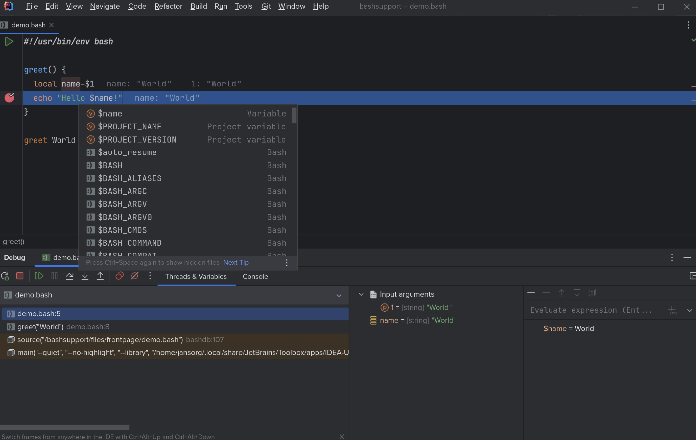

### Material Theme

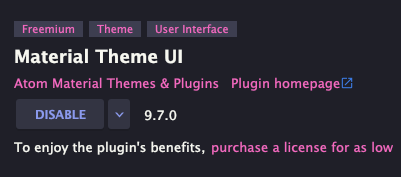

해당 테마는 유료 라이선스가 있는 테마로 직접 설치해서 테마를 이쁘게 바꿔주는 기능을 한다. 필자는 유료로 사용하고 있으며 `Dracula Theme`를 사용한다.

### Translator

해당 플러그인은 향로님께서 직접 만드신 번역 플러그인이다. 한글이나 영어를 번역해주는 기능을 해준다.

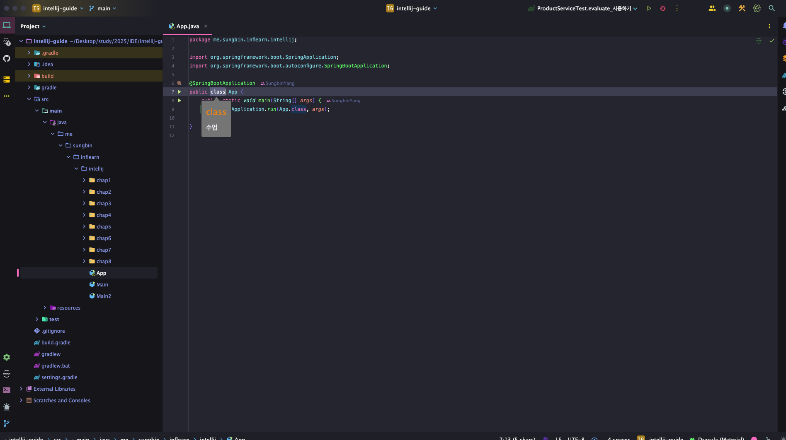

## 추가 플러그인

이번에는 내가 자주 애용하는 플러그인들을 몇가지 소개해보려고 한다. 해당 플러그인들을 보고 유용하다 싶으시면 적용해보시면 좋을 것 같다.

### Lombok

롬복은 실제 프로젝트에서 많이 사용한다. 하지만 단순히 롬복 의존성만 넣어준다고 해서 제대로 IDE에 나오지 않을 수 있다. 그래서 많은 분들이 해당 플러그인을 설치한다.

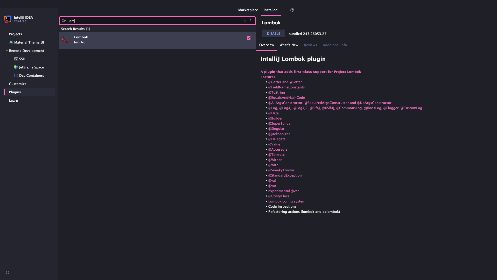

### AsciiDoc

해당 플러그인은 `spring rest docs`를 사용하고 테스트 코드로 생성한 snippet들을 문서화 할때 이용하는 플러그인이다. 해당 플러그인을 설치하면 자동완성 기능과 아무색깔이 없는 텍스트를 색깔이 나오게끔 하며 미리보기 기능도 지원하게 된다.

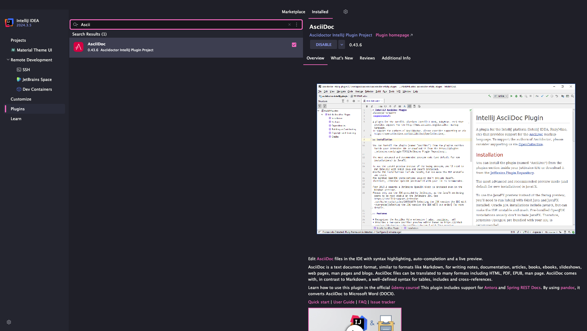

### Key Promoter X

해당 플러그인은 우리가 단축키를 일일이 외우지 못하니 해당 부분들을 도움을 주는 플러그인이다. 만약 마우스로 우리가 무슨 행위를 한다면 해당 플러그인이 단축키를 팝업 형태로 제공해준다. 또한 커스텀하게 키 매핑하는 기능도 지원해주는 아주 좋은 플러그인이다.

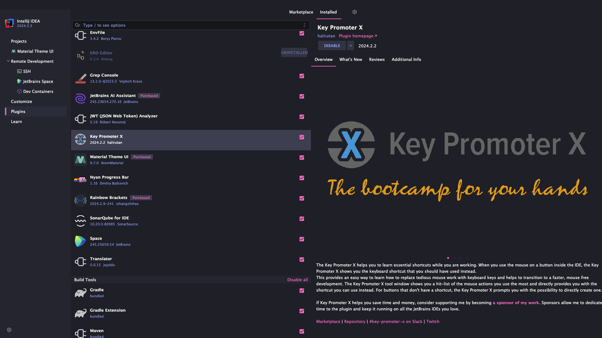

### Nyan Progress Bar

일단 인텔리제이 상에서 로딩화면이 딱딱한데 해당 플러그인을 설치하면 고양이가 돌아다니는 귀여운 행위를 감상할 수 있다.

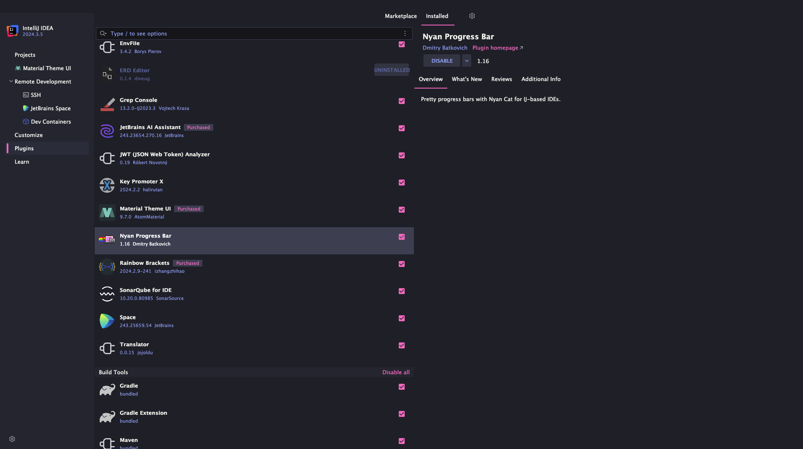

### SonarQube For IDE

해당 플러그인은 코드 품질을 자동으로 체크해주는 기능으로 우리가 개발하면서 고쳐봐야 할 부분들을 실시간 검사를 해서 밑줄 형태로 경고를 띄워준다.

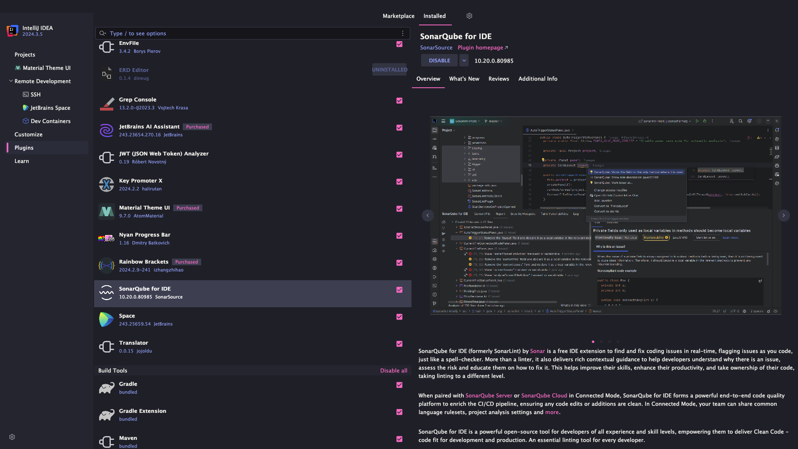

### JWT Analyzer

해당 플러그인은 jwt값을 디코딩해서 내부 정보를 확인해보려면 [jwt 공식 사이트](https://jwt.io)에 직접 방문해서 확인하는 번거로움이 있지만 해당 플러그인을 이용하면 IDE내에서 확인이 가능하다.

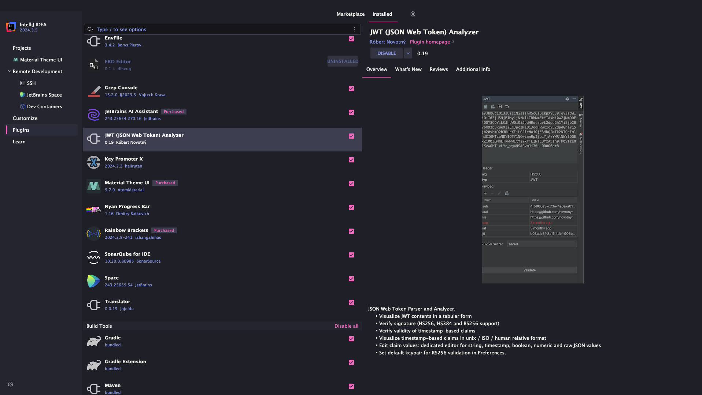

### Jetbrains AI Assistant

해당 플러그인은 유료이다. AI시대인만큼 우리는 AI를 적극적으로 활용한다. 다만, 우리는 일정 금액을 지불하고 다양한 AI를 사용한다. 하지만 해당 IDE를 이용하면 일정 금액만 지불하면 코파일럿처럼 코드도 알아서 자동완성 해주고 채팅도 가능하며 심지어 다양한 AI모델을 골라서 쓸 수 있다. 한번 자금적인 여유가 된다면 추천한다.

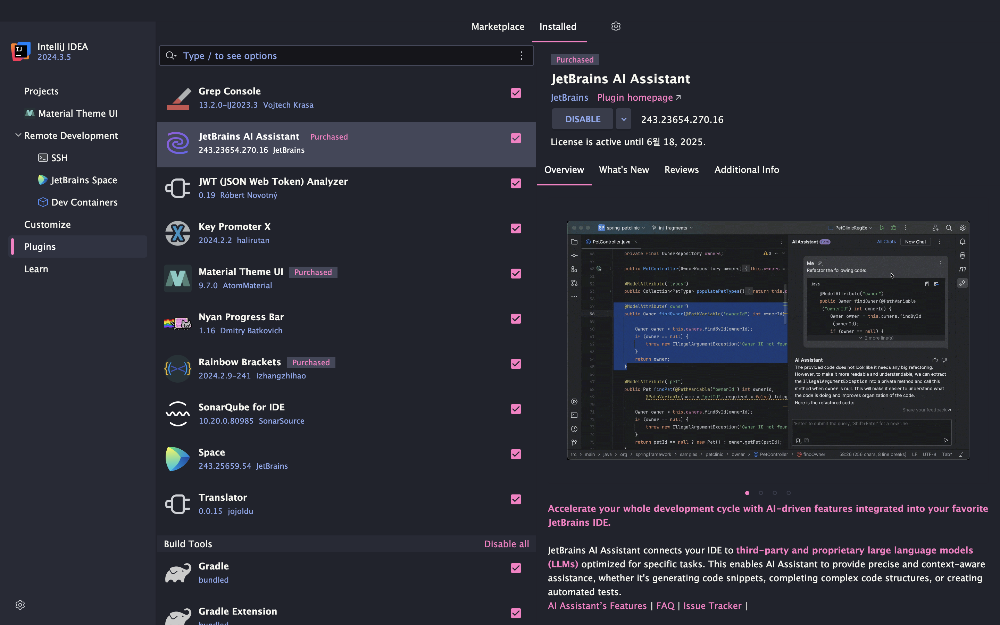

> 잘못된 지식이 있을 경우 댓글로 남겨주시면 빠르게 반영하겠습니다!