> 해당 포스팅은 인프런의 [백엔드 개발자에 의한, 백엔드 개발자들을 위한 프론트엔드 강의 - 기본편](https://inf.run/DQ8mU)를 참조하여 만들었습니다.


## Java와 비교하며 배우는 Javascript 기본 문법들

지금부터 자바스크립트 문법에 대해 알아보도록 하겠다. 자바스크립트 문법에 앞서서 실습 환경은 개발자 도구를 통해서 알아보도록 하겠다. 여기서는 단순히 코드만 보여주겠지만 직접 실습을 해보면 좋을 것 같다.

### 변수와 상수

자바에서는 변수와 상수를 정의할 때 타입과 함께 정의를 하였지만 자바스크립트는 타입을 안 적어줘도 괜찮다.

``` js
let a = 1;
```

위와 같이 정의를 하면 변수 a에 1을 대입한 것과 같다. 그러면 이제 정수가 아닌 문자열 변수를 정의해보자.  문자열 변수를 정의하는 방법은 아래와 같다.

``` js
let b = "자바스크립트";
```

그러면 여러분이 위의 실습을 통해 변수를 정의하고 엔터를 치면 아래와 같이 `undefined`라고 나오는 것을 확인 했을 것이다.


그러면 개발자 도구 창에 `3 + 5`라고 작성해보자. 그러면 아마 아래와 같이 숫자 8이 나오는 것을 볼 수 있을 것이다.

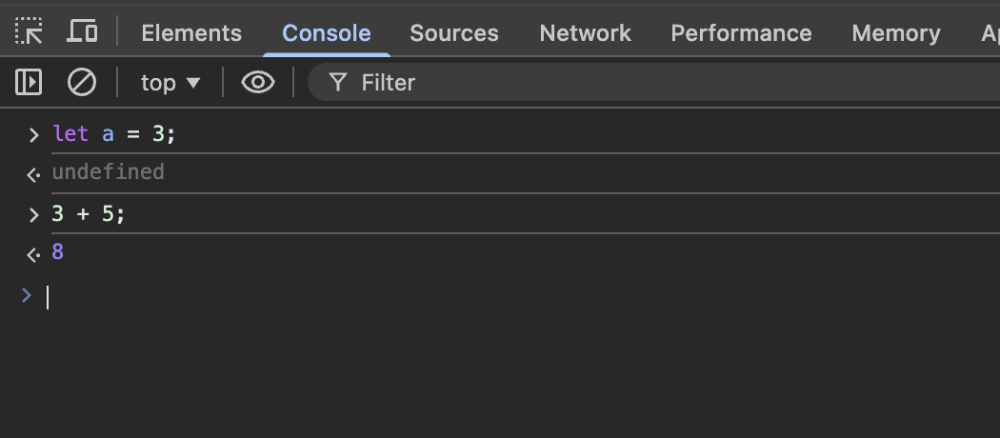

그러면 이 숫자 8과 `undefined`의 차이를 좀 알아보자. 개발자 도구에서 엔터를 쳤을 때 나오는 이 값은 해당 명령문에 대한 반환값을 의미하는 것이다. 즉, 3과 5를 더했을 때 숫자 8이 나오는 반환 값이 존재하므로 개발자 도구에 숫자 8이 나오는 것이고 변수에 값을 할당에서 정의하는 행위는 반환값이 없으므로 `undefined`라고 나오는 것이다. 잠시 후에 알아 볼 함수를 정의하는 것도 반환값이 없다면 `undefined`라고 나올 것이고 결과 값이 없다면 그 값이 개발자 도구창에 나올 것이다.

그러면 여기서 1가지 의문이 들 것이다.

> 자바처럼 변수 할당하는 것은 비슷한데 자바스크립트는 타입이 없나요?

위의 물음에 일반적으로 타입이 없다라고 말씀하시는 분들도 계시지만 필자의 생각으로는 자바스크립트에도 타입은 존재한다라고 말할 수 있을 것이다. 그 이유는 바로 `typeof`라는 키워드 때문이다. 위의 선언된 변수에 대해서 실습을 해보도록 하겠다.

``` js
typeof a; // number
typeof b; // string
```

이런 이유로 자바스크립트에도 여전히 타입은 존재하고 그 타입을 알려면 `typeof`라는 키워드를 통해 알아야 한다.

다음으로 상수에 대해 알아보자. 자바에서 상수를 선언할 때는 `final` 키워드를 통해서 상수를 선언하였는데 자바스크립트에서는 `const`라는 키워드를 사용한다. 상수 변수 네이밍 규칙은 자바와 동일하다. 그러면 한번 상수를 정의해보자.

``` js
const PI = 3.14;
```

그리고 자바스크립트도 자바처럼 상수에 값을 변경하려고 하면 안된다. 만약 변경하려고 한다면 아래와 같은 에러가 발생할 것이다.

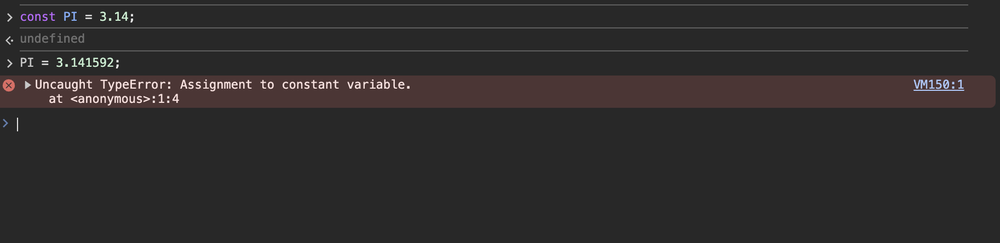

### 로그

자바스크립트도 자바처럼 로그를 찍을 수 있다. 자바에서는 lombok의 `log`나 `System.out.println`을 통하여 로그 출력문을 작성할 수 있었지만 자바스크립트는 아래처럼 `console.log`를 통해 로그를 찍을 수 있다.

``` js
console.log('Hello World!');
```

혹은 변수에 있는 값을 출력하고 싶다면 아래와 같이 해주면 된다.

``` js
let a = 3;
console.log(a); // 숫자 3 출력
```

그런데 독자들이 실습을 하면서 1가지 의문사항이 생길 수도 있다. 위와 같이 실습을 하면 아래와 같은 화면처럼 값이 출력 되고 `undefined`라고 찍히는 것도 볼 수 있을 것이다.

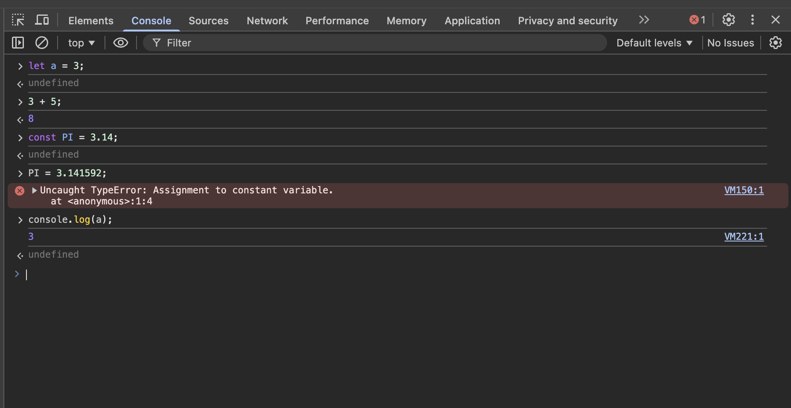

숫자 3은 `console.log`를 통해 나온 실행 결과물로 보면 좋을 것이고 `undefined`는 `console.log`에 대한 반환 값을 의미하는 것이다.

### alert

다음으로는 `alert`에 대한 것에 대해서도 알아보겠다. `alert`에는 브라우저 창에 알림창을 띄워주는 기능을 한다. 이것을 변수와 조합해서 사용할 수 있다.

``` js
const PI = 3.14;
alert('PI = ' + PI);
```

위와 같이 작성하여 실행을 하면 아래와 같은 결과처럼 브라우저에서 기본으로 제공해주는 알림창이 나올 것이다.

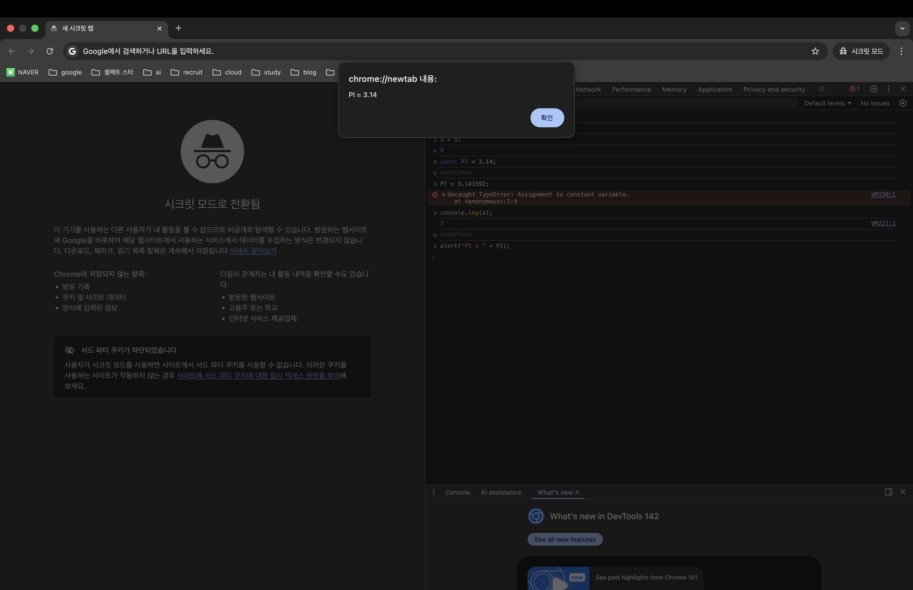

### 논리 연산자

다음으로 논리 연산자에 대해 알아보자. 자바스크립트도 자바처럼 논리 연산자를 가지고 있다. 단 차이가 있다면 등호 연산자에서 `==`를 쓰냐 `===`를 쓰냐 차이가 존재한다. 자바스크립트에서는 등호 연산자로 `==`과 `===`를 제공하는데 `===`을 쓸 경우 타입까지 같은지 체크를 해준다.

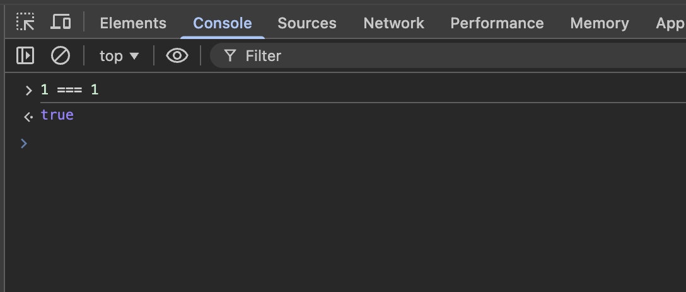

만약 서로 다른 타입으로 `===` 비교를 진행하였다면 아래처럼 `false`를 반환할 것이다.

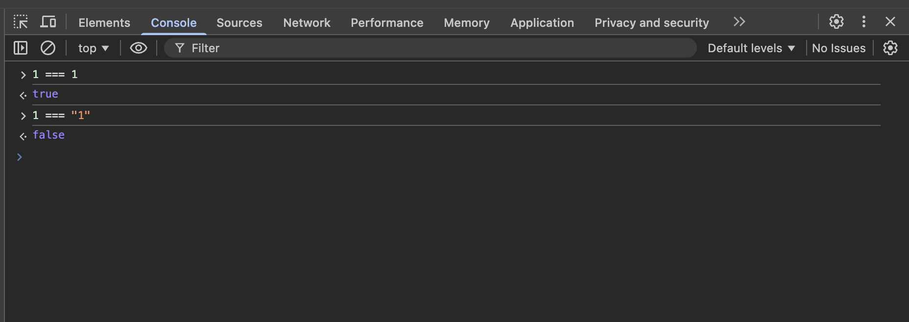

그런데 만약 서로 다른 타입이라고 하더라고 값이 논리상 같아 보인다면 `==`를 쓰면 `true`가 나온다.

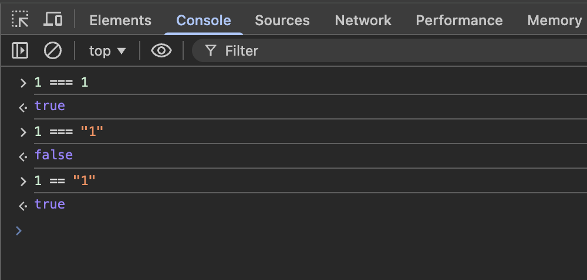

여기서 우리가 원하는 것은 자바처럼 타입이 다르면 다르다라고 `false`를 반환하기를 원할 것이다. 그래서 우리는 자바스크립트를 작성해서 비교 연산을 진행하려면 `==`보다는 `===`을 사용하는 것을 추천한다.

만약 다름을 비교하려면 `!==`를 사용하면 된다. 해당 연산자는 타입까지 체크를 해준다. 만약 값만 같은지 다른지 여부를 보려면 `!=`를 해주면 된다.

### 조건문

자바스크립트에서도 자바와 같이 조건문을 제공해준다. 그러면 바로 실습을 해보자.

``` js
let a = 1;

if (a === 1) {
    console.log('number는 1입니다.');
} else {
    console.log('number는 1이 아닙니다.');
}
```

간단한 내용이니 여기서 조건문은 여기서 마무리해보도록 하겠다.

### 배열과 반복문

자바스크립트에서 배열은 아래와 같이 선언할 수 있다.

``` js
const arr = [];
```

위와 같이 선언하면 비어있는 배열 하나가 생성된 것이다. 그런데 여기서 자바와 다른 점이 존재한다. 자바같은 경우 배열이 한번 정해지면 그 사이즈를 변경할 수 없다. 하지만, 자바스크립트는 중간의 사이즈를 변경할 수 있다. 마치 자바의 컬렉션의 `ArrayList`와 같은것과 생각하면 된다. 그럼 위에서 선언한 배열에 값을 넣으려면 어떻게 해야할까? 바로 아래와 같이 작성하면 된다.

``` js
arr.push(10);
arr.push(20);
arr.push(30);
```

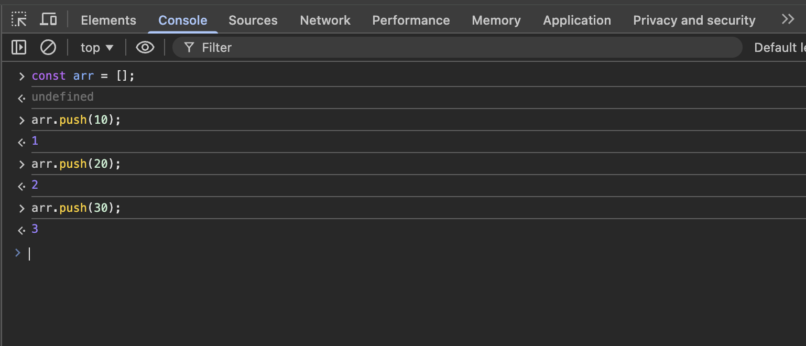

여기서 유심히 볼만한 부분은 `push` 함수는 반환 값이 `undefined`가 아닌 해당 배열의 사이즈를 반환한다라는 것을 볼 수 있다. 그러면 배열을 출력해보자.

``` js
console.log(arr); // [10, 20, 30]
```

주석에 달아논 것처럼 출력이 이쁘게 잘 되는 것을 볼 수 있을 것이다. 또한, 몇번째 인덱스에 어떤 값이 들어가는지도 확인이 된다.

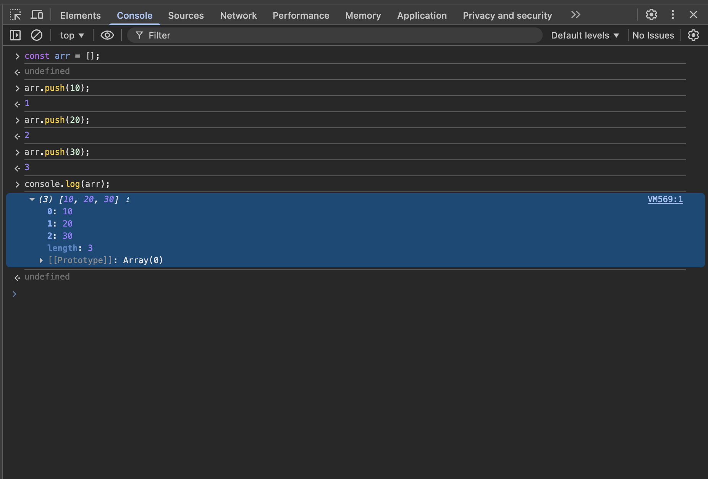

자바스크립트도 자바처럼 배열의 몇번째 인덱스에 접근하는 것은 같다.

``` js
console.log(arr[1]); // 20
```

그리고 배열의 길이를 알 고 싶을 때는 `length`를 이용하면 배열의 길이를 알 수 있다.

``` js
console.log(arr.length); // 3
```

또한, 배열을 자를 수도 있다. 아래와 같이 `splice`를 사용하면 되는데 첫번째 인자로는 짜르기 시작할 인덱스 위치고 2번째 인자로는 몇개를 짜를지를 적어주면 된다.

``` js
arr.splice(1, 1); // [20]
```

이렇게 하면 1번째 인덱스가 잘려나가고 기존 배열에는 `[10, 30]`이 남을 것이다.

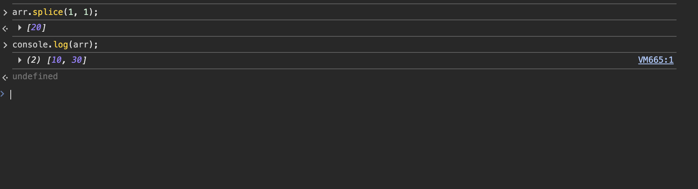

다음으로 배열과 반복문 조합을 알아보도록 하겠다. 아래와 같이 배열을 정의하고 반복문을 돌려보자. 반복문의 문법은 자바와 거의 동일하다.

``` js
const arr = [1, 2, 3, 4, 5];

for (let i = 0; i < arr.length; i++) {
    console.log(arr[i]);
}
```

이렇게 하면 배열을 순회하면서 해당 인덱스에 맞는 원소가 하나씩 출력이 될 것이다.

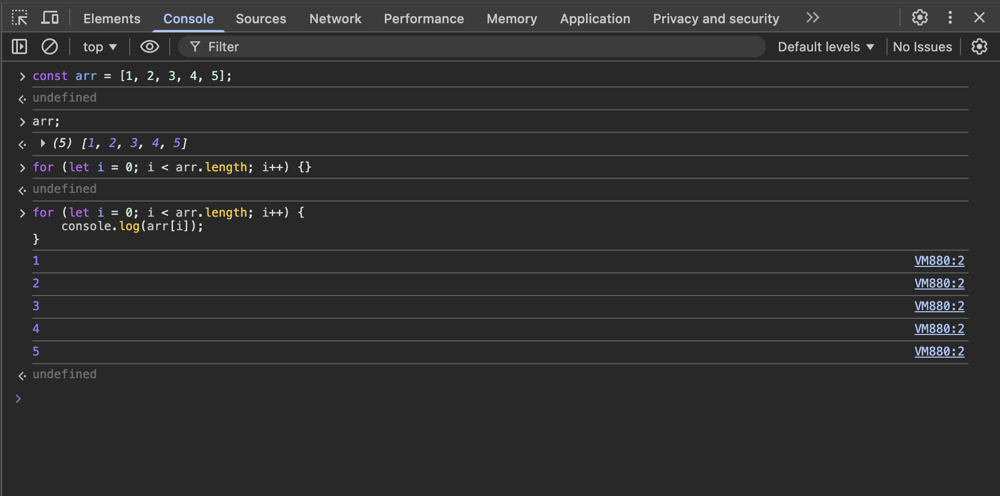

### 함수

다음으로 자바스크립트의 함수를 선언하는 방식에 대해 알아보자. 자바스크립트에서 함수를 선언하는 방법은 `function` 키워드를 이용하면 된다.

``` js
function addTwoNumber(one, two) {
    return one + two;
}
```

위의 함수는 두 인자를 받아서 더하는 것을 반환하는 함수이다. 이제 실제 호출을 해보자. 호출하는 방법은 직접 함수 시그니쳐를 적어서 호출이 가능하고 함수를 변수에 할당할 수 있다.

``` js
let result = addTwoNumber(3, 5);
```

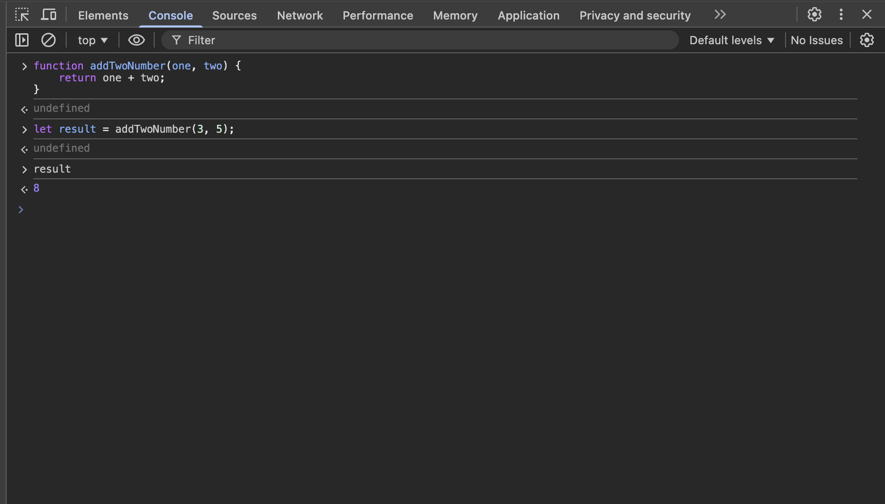

또한 자바스크립트는 함수를 마치 변수처럼 취급할 수 있다. 마치 자바의 람다처럼 활용할 수 있다라는 것이다.

``` js
const addTwoNumber = (one, two) => {
    return one + two;
}
```

이를 실행하면 아래와 같이 나오는 것을 볼 수 있다.

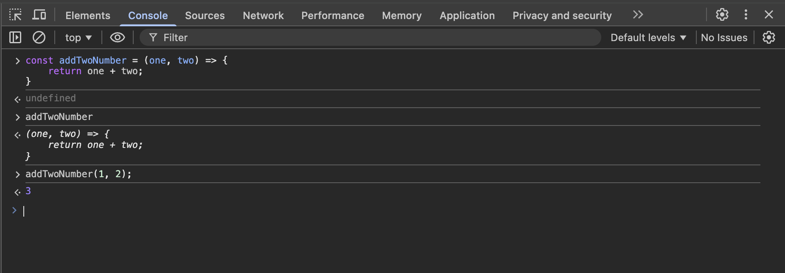

이처럼 자바스크립트는 함수를 변수처럼 사용할 수 있다. 이를 이용하면 함수를 파라미터에 넣는 행위도 가능해진다. 아래의 코드를 입력해보자.

``` js
const wrapperFunction = (func) => {
    const result = func(10, 20);
    console.log(result);
}
```

그리고 아래와 같이 호출을 하는데 `addTwoNumber`를 마치 변수처럼 넘겨주면 실행이 잘 되는 것을 볼 수 있다.

``` js
wrapperFunction(addTwoNumber);
```


그러면 세부동작을 살펴보자. wrapperFunction을 호출할 때 인자로 함수를 넣어줬다. 그러면 그 함수는 내부에 func를 호출하는 부분에서 call이 된다. 이처럼 자바스크립트는 자바와 다르게 함수를 1급시민으로 간주한다. 간단히 말하면 변수처럼 함수를 쓸 수 있다라고 생각하면 좋을 것 같다.

## JSON

JSON은 Javascript Object Notation의 약자로 쉽게 말해 자바스크립트 객체 표기법을 의미하는 것이다. 그런데 여기서 주목할 점은 표기법이라는 점이다. 즉, **자바스크립트에서 객체를 표기하는 방법을 빌려온 것이지 분명 자바스크립트 객체와는 다르다는 점**이다. JSON은 서로 다른 언어로 작성된 애플리케이션 사이에 데이터를 전송하기 위한 일종의 표준처럼 사용되고 있다. JSON과 보통 비교되는 대상은 XML인데 XML은 무겁다는 단점도 있고 요즘은 잘 사용하지 않으니 설명은 생략하겠다.

``` json
{
    "name": "양성빈",
    "age": 30,
    "address": "서울시 강남구"
}
```

JSON 문법을 보면 위와 같이 되어 있다. JSON은 key와 value로 나뉜다. 위의 코드를 보면 name이라는 key와 "양성빈"이라는 value가 묶여 있듯이 말이다. 즉, key와 value가 쌍으로 존재한다라는 것이다. 그리고 key와 value 사이에는 콜론이 위치하고 그리고 하나의 key와 value 쌍 사이에는 ,로 나눠주고 있다. 이런 이유로 마지막 key와 value에는 ,가 없다.

또한, key에는 문자열 형태만 올 수 있고 값에는 문자열이나 숫자 혹은 다른 값들이 올 수 있다. 그리고 몇가지 문법적 특징이 있는데 이건 더 복잡한 JSON 예제를 보면서 이야기 해보도록 해보자.

``` json
{
    "firstName": "Yang",
    "lastName": "Sungbin",
    "isAlive": true,
    "age": 30,
    "height": 175.4,
    "address": {
        "streetAddress": "21 2nd Street",
        "city": "NewYork",
        "state": "NY",
        "postalCode": "10021-3100"
    },
    "phoneNumber": [
        {
            "type": "home",
            "number": "212 555-1234"
        },
        {
            "type": "office",
            "number": "646 555-4567"
        }
    ],
    "children": [],
    "lootoNumbers": [3, 6, 11, 32, 37, 42],
    "spouse": null
}
```

위의 JSON 예시에서는 앞서 살펴본 예시보다 복잡하다. 여기서는 앞에서 설명 안한 문법적인 특징들이 몇가지 존재한다. 위의 isAlive라는 key를 보면 value값으로 문자열도 아니고 숫자도 아닌 boolean형 값이 있다. JSON에서는 value값으로 boolean형 값도 가능하다. 또한 숫자에서 정수형과 실수형 모두 가능하고 또한, JSON의 값으로 또 다른 JSON을 포함하는게 가능하다. 또한 배열도 값으로 가질 수 있다. 또한 spouse라는 key에 value값으로 null이 나오고 있는데 값으로 null도 가능하다.

그러면 이런 JSON의 문법적 특징을 외워야 할까? 전혀 외울 필요는 없다고 생각한다. 그냥 눈으로 보면서 익숙해지는게 좋을 것이다.

### 자바스크립트로 JSON 다루기

이제 자바스크립트의 객체와 JSON이 서로 다르다는 것을 확인해보자. 이걸 확인하려면 둘 사이에 각각 변환을 해보면 된다. Javascript의 객체를 JSON 문자열로도 바꿔보고 그리고 JSON 문자열을 Javascript 객체로도 변경해보면 뭐가 다른지 한 눈에 알 수 있을 것이다. 여기서 용어를 알고 넘어가면 좋을 것 같은데 Javascript의 객체를 JSON으로 만드는 행위를 **직렬화**라고 표현한다. 자바스크립트 객체를 전송하기 위해서는 이런 직렬화 과정이 필요하다. 여기에서 `JSON.stringify`라는 함수가 사용된다. 이 함수를 사용하면 자바스크립트 객체를 JSON으로 변환해준다. 그리고 반대 과정을 하는 것을 **역직렬화**라고 표현한다. 이 과정에서는 `JSON.parse`라는 함수가 사용된다.

> 📝 용어 정리
>
> - 직렬화: 특정 프로그래밍 언어의 객체를 메모리에서 파일이나 네트워크등 다른 곳으로 전송하기 위해 데이터를 변환하는 것을 말한다.
> - 역직렬화: 직렬화의 반대 과정

우리가 이후 Ajax로 데이터를 주고 받을 때 이 직렬화, 역직렬화 과정이 필요하기 때문에 반드시 알고 있어야 한다. 그럼 이제 실습을 해보자. 먼저 자바스크립트의 객체를 만드는 과정을 살펴보자.

``` js
const obj = {
    name: "양성빈",
    age: 30
};
```

자바스크립트 객체를 만들때 JSON과 달리 key값은 문자열로 안 하고 그 값을 그대로 작성해줘도 좋다.

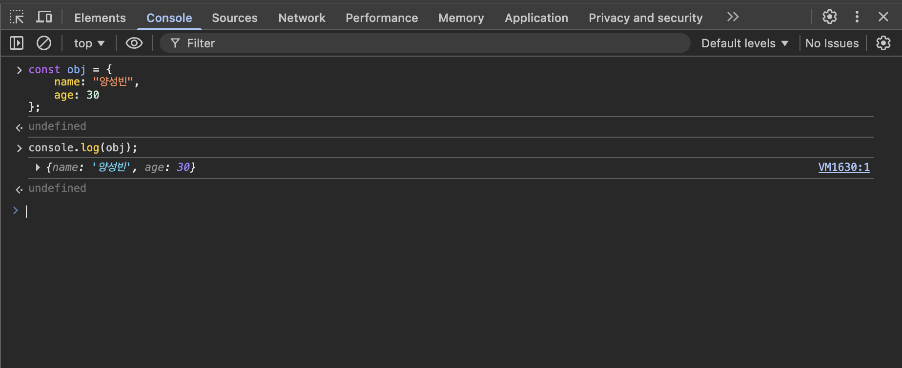

그럼 선언한 자바스크립트 객체를 JSON으로 직렬화해보겠다.

``` js
JSON.stringify(obj);
```

이렇게 하면 아래와 같이 잘 변환된 것을 알 수 있다.

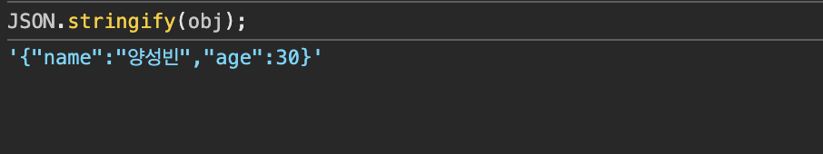

그러면 이제 다시 역직렬화를 통해 다시 JSON 문자열을 자바스크립트 객체로 변경해보자.

``` js
let json = JSON.stringify(obj);
JSON.parse(json);
```

위와 같이 작성하면 역직렬화가 된 것을 알 수 있다.

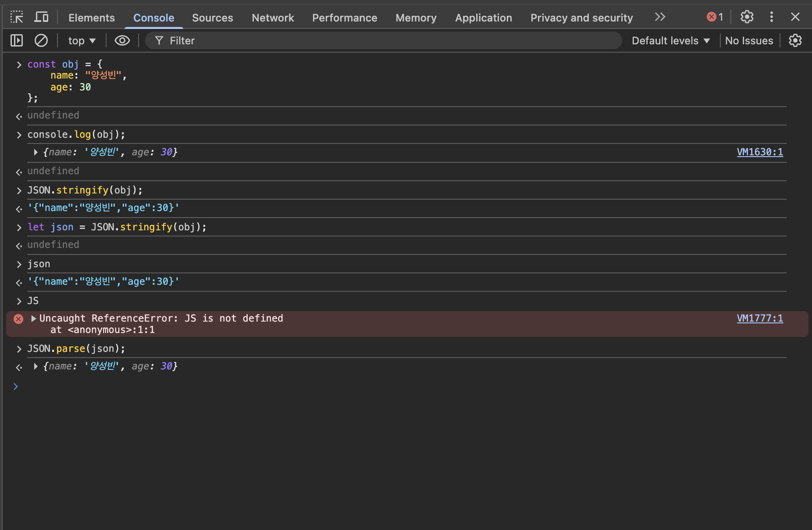

## XHR을 활용한 AJAX 요청 보내기

다음으로 XHR을 이용해서 AJAX 요청을 보내는 방법에 대해 알아보자. 우리가 만든 API 서버와 상호작용하는 부분이니 자세히 살펴보도록 하겠다. 일단 용어부터 살펴보면 좋을 것 같다. "XHR을 활용한~"이라는 문구에서 XHR은 뭔가 일종의 도구처럼 느껴지고 XHR이라는 도구를 이용해서 AJAX 요청을 보낼 수 있다라는 의미처럼 느껴진다.

XHR은 자바스크립트에서 Ajax 요청을 보낼 수 있도록 제공해주는 내장 객체이다. 여기서 내장 객체라는 말은 기본 라이브러리라고 보면 좋을 것 같다. 그러면 XHR과 Ajax는 무엇의 줄임말인지 알아보자. XHR은 XMLHttpRequest의 줄임말이고 Ajax는 Asynchronous Javascript and XML의 줄임말이다. 여기서 보면 둘다 XML이라는 용어가 보이는 것을 알 수 있다. 원래 이 XHR과 Ajax가 처음 정의되었을 때는 데이터 전송 포맷으로 XML이 주로 사용되었다. 따라서 여기 이름에 각각 XML이라는 말이 들어가져 있으나 현재에는 XML보다는 JSON을 주로 전송하고 있다.

아무튼 XHR은 XML을 포함한 Http 요청을 보낼 수 있는 객체라는 의미인데 Ajax는 무슨 의미일까? 여기서 Asynchronous라는 말은 비동기라는 의미이기에 직역하면 비동기 자바스크립트와 XML이라는 의미가 된다. 여기서 핵심적인 단어는 이 비동기라는 말이다. Ajax에서의 비동기는 여러가지 의미를 가지고 있는데 Ajax 요청이 완료되기 전까지 Javascript 코드가 대기 중인 상태가 아니라 완료되면 실행될 수 있는 로직을 지정하는 부분이 있는데 바로 이 부분이 비동기적 특성을 가지고 있다.

아무튼 Ajax를 사용하면 웹 페이지를 새로고침 없이 서버에서 데이터를 가져와서 화면을 갱신해줄 수 있다. 이를 통해 더 나은 사용자 경험을 제공해줄 수 있는 것이다. 이제 본격적으로 실습을 해보자.

먼저 서버쪽의 RestController를 만들어보자.

``` kotlin
package me.sungbin.controller

import org.springframework.web.bind.annotation.GetMapping
import org.springframework.web.bind.annotation.RestController

@RestController
class NoParameterAjaxRestController {

    @GetMapping("/get-with-no-parameter")
    fun getWithNoParameter(): String {
        return "파라미터가 없는 GET 요청"
    }
}
```

위와 같이 컨트롤러를 정의하였다. 다음으로 html과 javascript 코드를 정의해보자.

``` html
<!DOCTYPE html>
<html lang="ko">
<head>
    <meta charset="UTF-8">
    <title>Title</title>
</head>
<body>
    <script src="./no-parameter-ajax.js"></script>
</body>
</html>
```

``` js
function onReadyStateChange(event) {
    if (AJAX_REQUEST.readyState === XMLHttpRequest.DONE) {
        if (AJAX_REQUEST.status === 200) {
            console.log(AJAX_REQUEST.responseText);
        } else {
            console.error('request failed');
        }
    }
}

const AJAX_REQUEST = new XMLHttpRequest();

AJAX_REQUEST.onreadystatechange = onReadyStateChange;
AJAX_REQUEST.open('GET', '/get-with-no-parameter');
AJAX_REQUEST.send();
```

그러면 한번 코드를 살펴보도록 하겠다. restController로 ajax요청을 받을 수 있게 정의를 해두었다. 그런데 사실 ajax 요청을 받을 수 있는 컨트롤러가 존재하는 것은 아니다. 그냥 일반적인 컨트롤러이다. `/get-with-no-parameter`로 GET 요청을 보냈을 때 "파라미터가 없는 GET 요청"이라는 응답이 나가도록 설계가 되었다.

다음으로 js코드를 살펴보도록 하겠다. js코드를 보면 먼저 함수 하나가 선언되어 있다. onReadyStateChange라는 함수가 하나 선언되어 있다. 그리고 아래쪽으로 가보면 AJAX_REQUEST라는 상수가 하나 선언되어 있다. 그리고 그 상수에 XMLHttpRequest 즉, XHR 객체를 `new`라는 연산자로 객체를 생성하여 넣어주고 있다. 그리고 아래쪽을 보면 AJAX_REQUEST.onreadystatechange라는 변수가 있는데 해당 변수에 함수를 넣어주고 있다. 여기서 onreadystatechange라는 변수는 특별한 의미를 가지고 있는데 이 ajax request 즉, XMLHttpRequest에 readyState라는 상태 값이 있는데 이 XHR 객체가 어떤 상태인지 예를 들면, Ajax 요청을 시도 했는지, 이 Ajax 요청에 대한 응답이 왔는지, 이런 것들을 기록을 하는 상태 값이다. 해당 상태 값에 변화가 생겼을 때 여기 있는 onreadystatechange라는 곳에 등록된 함수가 실행이 될 준비를 하는 것이다.

그리고 그 다음 줄을 보면 `AJAX_REQUEST.open`을 통해서 GET 방식으로 해당 URL에 요청을 보내겠다라고 준비를 하는 단계이다. 그리고 실제 요청을 보내는 것은 `AJAX_REQUEST.send()` 함수를 호출할 때 비로소 Ajax 요청을 보내는 것이다. 그제서야 우리가 선언했던 함수가 실행이 되는 것이다. 그리고 readyState같은 경우 요청이 완료가 될 때까지 총 4번의 과정을 거친다. 그런데 우리가 관심을 가지는 부분은 4번이 바뀌는 동안에 요청이 완료된 상태만 관심을 가지기 때문에 우리가 정의한 함수에 `AJAX_REQUEST.readyState === XMLHttpRequest.DONE`와 같이 조건문을 작성해준 것이다. 그러면 실제 실행을 해보면 아래와 같이 우리가 작성한 API와 html, js코드가 잘 나오는 것을 볼 수 있다.


위와 같이 로그가 찍힌 것도 잘 볼 수가 있으며, 네트워크 탭을 통해 아래처럼 응답이 잘 간 것도 확인 할 수 있다.


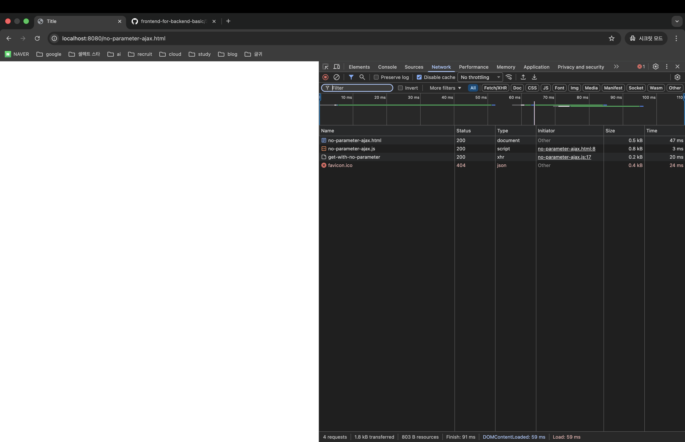

여기서 네트워크 탭에서 우리가 만든 API가 xhr방식으로 잘 전송 된 것도 확인 할 수 있다. 즉, ajax로 잘 날라갔다는 것이 확인 되는 것이다.

그러면 이제 조금 더 복잡한 예제를 들어보겠다.

``` kotlin
package me.sungbin.model

data class Bookmark(
    val name: String,
    val url: String,
)
```

위와 같이 북마크 모델을 선언하고 아래와 같이 북마크 조회 API와 등록 API를 작성해보자.

``` kotlin
package me.sungbin.controller

import me.sungbin.model.Bookmark
import org.springframework.web.bind.annotation.GetMapping
import org.springframework.web.bind.annotation.PostMapping
import org.springframework.web.bind.annotation.RequestBody
import org.springframework.web.bind.annotation.RestController

@RestController
class BookmarkAjaxRestController {

    private val bookmarks = mutableListOf<Bookmark>()

    @GetMapping("/bookmarks")
    fun getBookmarks(): List<Bookmark> {
        return bookmarks
    }

    @PostMapping("/bookmark")
    fun registerBookmark(
        @RequestBody bookmark: Bookmark
    ): String {
        bookmarks.add(bookmark)

        return "registered"
    }
}
```

그리고 html과 js코드를 작성해보자.

``` html
<!DOCTYPE html>
<html lang="ko">
<head>
    <meta charset="UTF-8">
    <title>Title</title>
</head>
<body>
<form onsubmit="return addBookmarkRequest();">
    <label>즐겨찾기 이름 : </label><input type="text" name="name"><br>
    <label>즐겨찾기 URL : </label><input type="text" name="url"><br>
    <input type="submit"><br>
</form>
<button onclick="getBookmarkListRequest();">즐겨찾기 목록 가져오기</button>
<ol id="bookmark-list">
    <!-- 여기에 즐겨찾기 목록이 나옵니다. -->
</ol>
<script src="./bookmark-ajax.js"></script>
</body>
</html>
```

``` js
function addBookmarkRequest() {
    const name = document.querySelector('input[name=name]').value;
    const url = document.querySelector('input[name=url]').value;
    const requestObject = {name: name, url: url};
    const requestJson = JSON.stringify(requestObject);

    function onReadyStateChange(event) {
        const currentAjaxRequest = event.currentTarget;

        if (currentAjaxRequest.readyState === XMLHttpRequest.DONE) {
            if (currentAjaxRequest.status === 200) {
                alert("즐겨찾기가 등록되었습니다.");
            } else {
                console.error('request failed');
            }
        }
    }

    const ajaxRequest = new XMLHttpRequest();

    ajaxRequest.onreadystatechange = onReadyStateChange;
    ajaxRequest.open('POST', '/bookmark');
    ajaxRequest.setRequestHeader('Content-Type', 'application/json');
    ajaxRequest.send(requestJson);

    return false;
}

function getBookmarkListRequest() {
    function onReadyStateChange(event) {
        const currentAjaxRequest = event.currentTarget;

        if (currentAjaxRequest.readyState === XMLHttpRequest.DONE) {
            if (currentAjaxRequest.status === 200) {
                const bookmarkListDom = document.querySelector('#bookmark-list');
                bookmarkListDom.innerHTML = '';

                const bookmarks = JSON.parse(currentAjaxRequest.responseText);
                bookmarks.forEach(bookmark => {
                    const liNode = document.createElement('li');
                    const textNode = document.createTextNode(bookmark.name + ' - ' + bookmark.url);
                    liNode.appendChild(textNode);
                    bookmarkListDom.appendChild(liNode);
                });
            } else {
                console.error('request failed');
            }
        }
    }

    const ajaxRequest = new XMLHttpRequest();

    ajaxRequest.onreadystatechange = onReadyStateChange;
    ajaxRequest.open('GET', '/bookmarks');
    ajaxRequest.send();
}
```

코드를 그러면 살펴보자. 등록 API부터 보자. 다른건 이전이랑 비슷한데 여기서 핵심은 `@RequestBody`로 Bookmark 객체를 받는 다는 것을 알 수 있다. 이 부분이 Ajax 요청의 body에 json으로 이 bookmark에 대한 body를 받는 것이다. 조회 API는 이전과 동일하니 설명을 생략하겠다.

다음으로 프론트 코드에 대해서 살펴보자. 프론트 코드를 보면 form 태그가 존재한다. 그리고 form 태그 안에 input 태그들이 존재한다. 해당 input 태그는 UI로 보면 알겠지만 사용자가 무언가를 입력하는 창을 보여주는 태그이다. 그리고 그 input 태그들에 name 속성으로 이름을 지정해준 것을 볼 수 있는데 해당 이름이, 등록 API의 request body로 들어가는 네이밍들과 일치하는 것을 알 수 있다. 또한, 마지막 input 태그를 보면 type이 submit으로 되어 있는 것을 볼 수 있는데 이것은 서버로 무언가 데이터를 보낼 때 자주 사용되는 타입이다. 정확히는 input의 type이 submit으로 태그를 생성하면 브라우저에 제출 버튼이 생성되고 해당 버튼을 클릭하면 input의 부모 태그인 form 태그의 onsubmit 속성의 값이 자바스크립트로 실행이 된다. 또한, onsubmit 속성의 value 값을 보면 `return` 키워드가 나와 있는데 이 부분은 이후에 설명해보도록 하겠다.

그러면 자바스크립트 코드를 보자 `addBookmarkRequest` 함수를 보면 `querySelector`로 무언가를 가져오는게 있는데 이 부분은 css때 설명을 하겠지만 지금 잠깐 설명을 해보자면 `querySelector`는 HTML의 특정 태그를 가져올 수 있다라고 보면 좋을 것이다. 지금은 input 태그의 name 속성의 값이 있는 것들을 가져오고 있는 것을 볼 수 있다. 정확히는 input 태그의 사용자가 입력한 value 값을 가져오는 것이다. 이유는 `.value`라는 것 때문이다. 다음으로 코드를 보면 자바스크립트 object로 만들고 이것을 JSON으로 직렬화를 한다. 이후는 이전에 살펴본 것과 유사하니 자세한 설명은 생략하겠다.

> ✅ 참고
>
> post 메서드로 데이터를 전달할 때 header에 Content-Type: application/json으로 넣어줘야 한다. ajax에서는 `setRequestHeader`로 지정해주면 된다.

다음으로 보면 button 태그가 있는데 해당 태그를 보면 `onclick` 속성이 있다. 이 속성은 해당 버튼을 클릭할 때 호출되는 자바스크립트 코드를 지정할 수 있다. 그리고 자바스크립트 코드를 보면 `event.currentTarget`을 볼 수 있는데 이것은 지금은 굳이 필요 없을 수 있겠으나 만약 여러 XHR 객체를 쓸 수도 있다. 그러면 뭔가 꼬일 수도 있기에 보통은 해당 함수를 호출하는 target정보로 이용하는게 좋다. 즉, 해당 함수를 호출하는 target정보의 readyState값이 DONE이고 상태가 200일 때 id가 bookmark-list인 태그를 찾아서 해당 태그의 자식 태그들을 전부 비워주고 응답 값들을 받아와서 해당 응답 값들을 li 태그를 생성하여 넣어주는 행위를 하고 있다. 여기서 몇가지 함수와 속성에 대해 알아볼건데 먼저 `innerHTML`은 해당 태그의 HTML 태그들을 넣어주는 역할인데 뒤에서 나오는 `appendChild`와 기능이 유사하다. `createElement`가 HTML 태그들을 생성해주는 자바스크립트 내장 함수이며, `createTextNode`를 통해 텍스트를 생성해주는 함수이다. 또한, `appendChild`는 인자로 들어가는 HTML 태그를 해당 함수를 호출하는 태그에 넣어준다고 이해하면 편할 것이다.

그러면 실제 실행해보고 네트워크 탭을 통해 살펴보자.

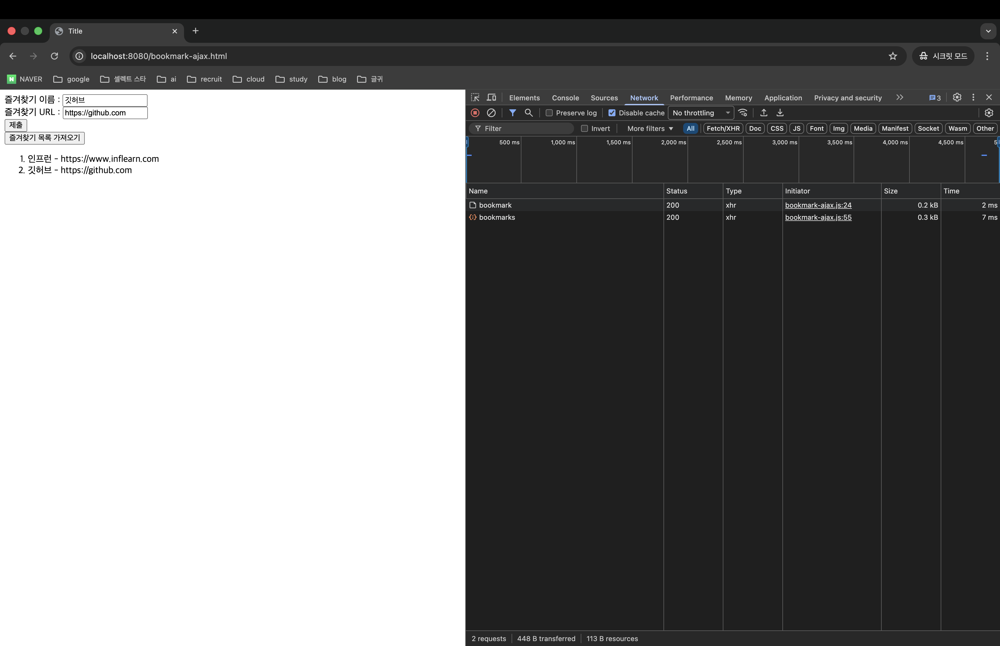

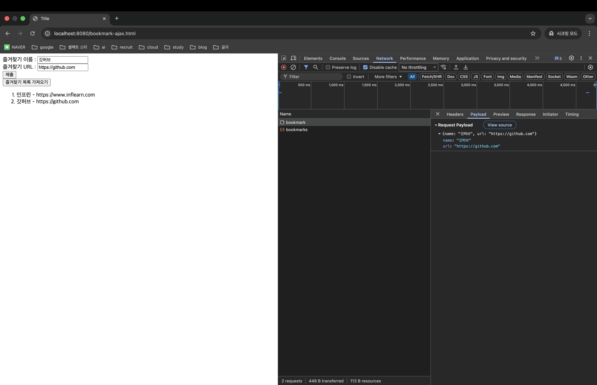

위의 화면은 네트워크 탭의 payload 탭이고 해당 부분은 프론트에서 request body에 들어가는 값들이 존재한다. 우리가 만든 Bookmark 값이 json꼴로 잘 들어가는 것을 볼 수 있다.

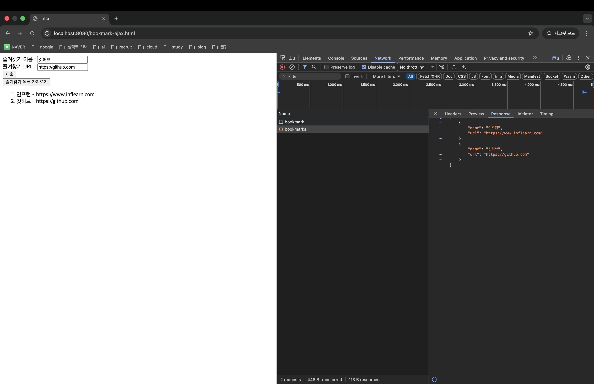

다음으로, `fetch`로 API를 불러오는 방법에 대해 알아보자.

``` html
<!DOCTYPE html>
<html lang="ko">
<head>
    <meta charset="UTF-8">
    <title>Title</title>
</head>
<body>
<form onsubmit="return addBookmarkRequest();">
    <label>즐겨찾기 이름 : </label><input type="text" name="name"><br>
    <label>즐겨찾기 URL : </label><input type="text" name="url"><br>
    <input type="submit"><br>
</form>
<button onclick="getBookmarkListRequest();">즐겨찾기 목록 가져오기</button>
<ol id="bookmark-list">
    <!-- 여기에 즐겨찾기 목록이 나옵니다. -->
</ol>
<script src="./bookmark-ajax-fetch.js"></script>
</body>
</html>
```

``` js
function addBookmarkRequest() {
    const name = document.querySelector('input[name=name]').value;
    const url = document.querySelector('input[name=url]').value;
    const requestObject = {name: name, url: url};

    fetch('/bookmark', {
        method: 'POST',
        headers: {
            'Content-Type': 'application/json'
        },
        body: JSON.stringify(requestObject)
    })
        .then(response => {
            if (response.status === 200) {
                alert("즐겨찾기가 등록되었습니다.");
            } else {
                console.error('request failed');
            }
        })
        .catch(error => {
            console.error('request failed', error);
        });

    return false;
}

function getBookmarkListRequest() {
    fetch('/bookmarks')
        .then(response => {
            if (response.status === 200) {
                return response.json();
            } else {
                console.error('request failed');
                throw new Error('request failed');
            }
        })
        .then(bookmarks => {
            const bookmarkListDom = document.querySelector('#bookmark-list');
            bookmarkListDom.innerHTML = '';

            bookmarks.forEach(bookmark => {
                const liNode = document.createElement('li');
                const textNode = document.createTextNode(bookmark.name + ' - ' + bookmark.url);
                liNode.appendChild(textNode);
                bookmarkListDom.appendChild(liNode);
            });
        })
        .catch(error => {
            console.error('request failed', error);
        });
}
```

코드는 방금 XHR과 봤던 코드와 유사하지만 `fetch`라는 내장 함수를 사용했다. 차이는 XHR보다 간결하고 현대적인 느낌이 있다. 아마 ajax를 학습했다면 이해가 어느정도 될 것이니 자세한 설명은 생략하겠다. 상세한 자바스크립트 설명을 드리고 싶지만, 이러면 포스팅이 너무 길어질 것 같다. 그래서 간단히만 설명을 드렸는데 자세하게 궁금한 사항이 있을 시, 댓글로 질문 작성 바란다.

## form 태그와 AJAX

다음으로 form 태그와 함께 Ajax를 활용해보는 방법에 대해 알아볼 예정이다.

``` html
<form onsubmit="return addBookmarkRequest();">
    <label>즐겨찾기 이름 : </label><input type="text" name="name"><br>
    <label>즐겨찾기 URL : </label><input type="text" name="url"><br>
    <input type="submit"><br>
</form>
```

이전에 위와 같은 form 태그를 보았을 것이다. form 태그는 원래 사용자에게 어떤 내용들을 입력 받는 기능을 수행한다. 이전에 했던 것처럼 즐겨찾기의 이름과 url을 입력받게 할 수도 있지만 더 복잡하게는 회원가입 페이지 같은 것을 만들 수도 있다. 단순히 이렇게 입력만 받는다면 크게 설명은 안 했겠지만 `document.querySelector`로 태그를 선택하여 value 속성으로 value값을 가져와서 서버로 전송할 수 있기에 우리가 유심히 살펴 본 것이다.

form 태그를 사용할 때 가장 좋은 장점은 html 태그만으로 유효성 검사를 할 수 있다. 그래서 이번에는 form 태그가 사용할 수 있는 여러가지 유효성 검사를 알아보고 이 유효성 검사 기능과 Ajax를 함께 결합하여 사용하는 방법에 대해 알아보겠다.

``` html
<!DOCTYPE html>
<html lang="ko">
<head>
    <meta charset="UTF-8">
    <title>Title</title>
</head>
<body>
<form onsubmit="return onSubmit();">
    <label>아이디 : </label><input type="text" name="user-id" minlength="4" maxlength="20" required>
    <label>나이 : </label><input type="number" name="age" min="0" max="200">
    <label>URL : </label><input type="url" name="url">
    <input type="submit">
    <script src="./validation-check.js"></script>
</form>
</body>
</html>
```

``` js
function onSubmit(event) {
    console.log(event);

    // AJAX 요청 로직

    return false;
}
```

위의 프론트 코드가 있다고 가정하자. 먼저 html 코드부터 확인해보자. 먼저 form 태그가 존재하고 그 form 태그 안에 label과 input 태그가 존재한다. 이 input 태그에서 유효성 검사를 진행할 수 있는데 위의 코드를 보면 `minlength`, `maxlength`, `required`, `min`, `max`등이 존재한다.

`minlength`는 해당 입력 폼에 최소 길이를 설정해줄 수 있다. `maxlength`는 해당 입력 폼에 최대 길이를 설정해 줄 수 있다. 이 속성을 이용하면 입력 폼의 길이의 제약을 줄 수 있다. 그리고 `required`를 이용하면 해당 input이 반드시 입력이 되어야 한다라고 설정할 수 있다.

다음 input을 보면 이번엔 type이 number로 되어 있는 것을 볼 수 있다. 이렇게 `type`을 number로 설정하면 숫자만 들어 올 수 있다. 이렇게 type이 number로 지정을 하면 `min`이나 `max`같은 속성을 쓸 수 있는데 `min`은 입력하는 값의 최소 값이고 `max`는 입력하는 값의 최대 값을 지정할 수 있는 것이다.

다음 input을 보면 type이 url로 되어 있는 것을 볼 수 있다. 이렇게 `type`을 url로 설정을 하면 입력 값이 문자열인데 url형식인지 유효성 검사를 해줄 수 있다.

다음 input을 보면 type이 submit인데 앞에서 살펴봤듯이 해당 태그를 설정하면 제출 버튼이 나오고 그 버튼을 클릭했을 때 form 태그의 onsubmit의 자바스크립트 코드를 실행 시켜 준다. 실행 화면은 아래와 같다.

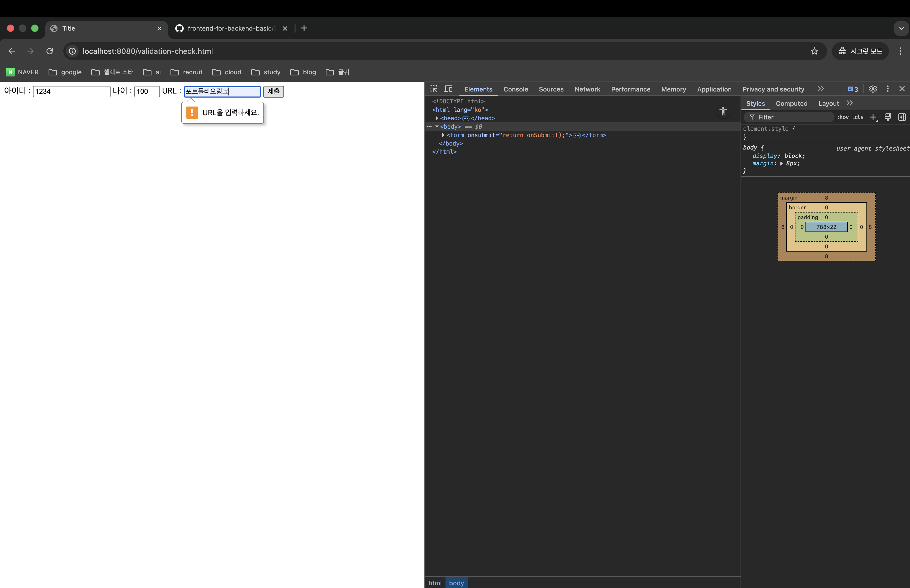

그러면 여기서 좀 더 살펴 볼 부분이 있다. 바로 form 태그의 `onsubmit`의 `return onSubmit();` 부분의 `return`부분이다. 여기에는 왜 `return`을 넣어줬을까? 그걸 알기 위해서 한번 `return false`하는 부분을 `return true`로 변경해보자. 즉, js 코드처럼 작성해보자는 의미이다.

``` js
function onSubmit(event) {
    console.log(event);

    // AJAX 요청 로직

    return true;
}
```

실제 바꿔서 해본 독자는 알겠지만 입력했던 값들이 전부 없어진 것을 알 수 있을 것이다. 그리고 뭔가 url도 바뀌고 네트워크 탭을 보면 뭔가 나온 것을 볼 수 있다.

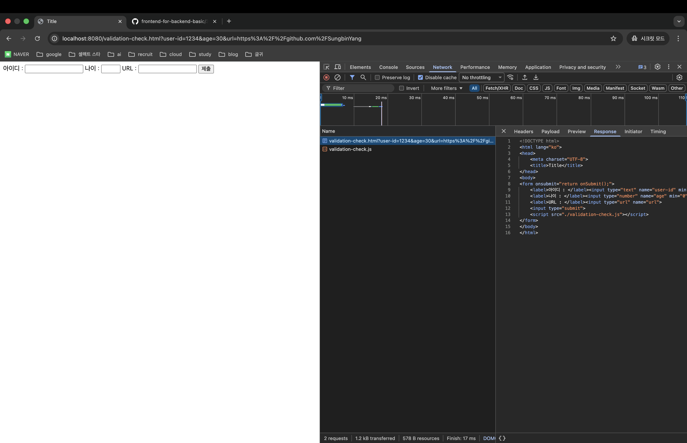

url을 자세히 보면 기존 url에 우리가 입력했던 값들이 쿼리스트링으로 붙어나간 것을 볼 수 있다. 그러면 왜 이런 일이 발생했을까? 그것을 알기 위해서는 해당 폼에 `onSubmit` 이벤트 핸들러가 어떤 식으로 동작을 하는지 이해할 필요가 있다. 해당 `onSubmit` 이벤트 핸들러 같은 경우 `return onSubmit()`으로 호출을 해주는데 이때 이 결과가 `return true`이면 form의 정의된 행동, 즉 웹 페이지에 제출하면서 웹 페이지가 이동하려는 것을 하려고 한다. 그런데 우리는 여기서 ajax 요청을 하려고 하는데 즉, 페이지를 새로고침하지 않고 서버로 요청을 보내려고 하는 것이다. 그렇기 때문에 우리는 원래 form 태그가 정의한 html의 기능을 차단시켜야 한다. 그래서 우리는 return값을 `false`로 지정해줌으로서 폼 자체가 제출되지 않게 하고 오직 ajax로만 제출하게 하는 것이다.