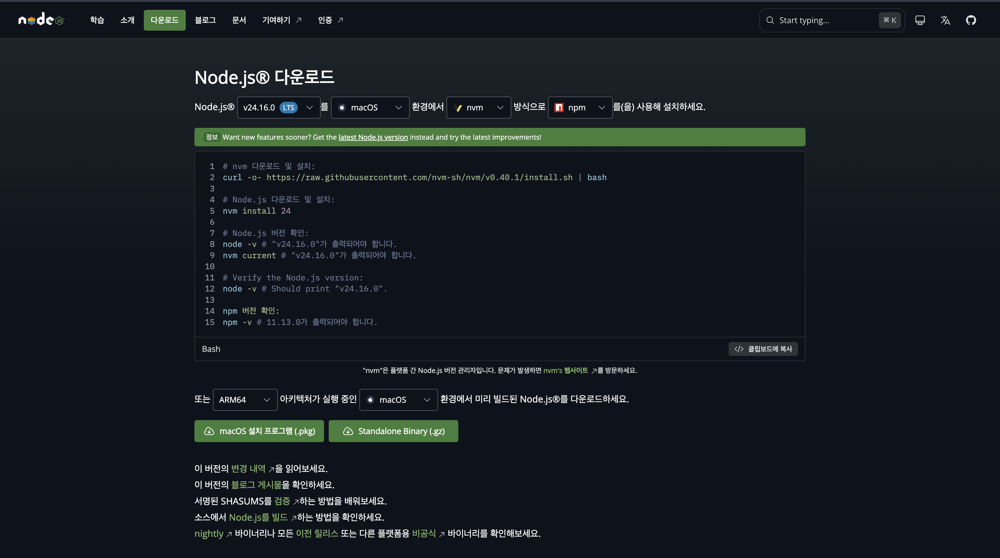
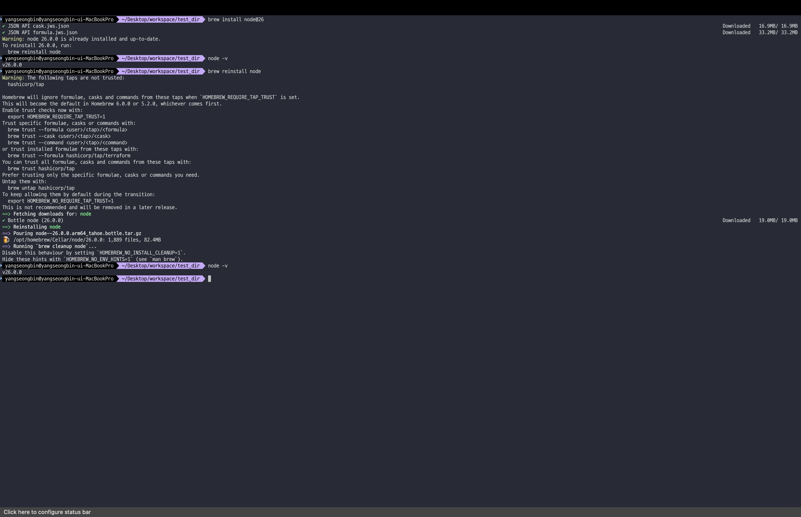
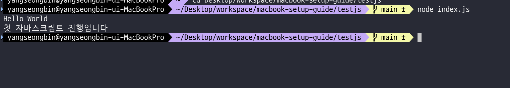
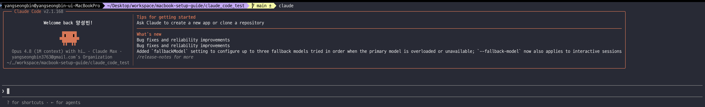
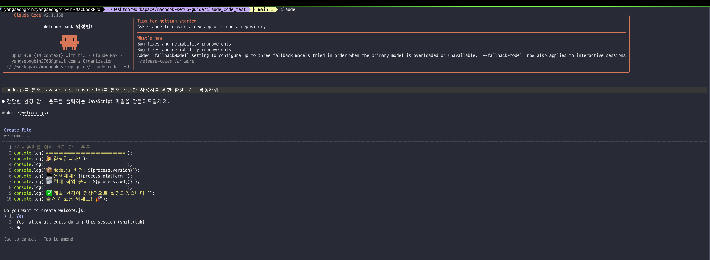
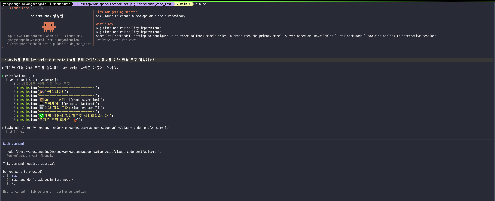
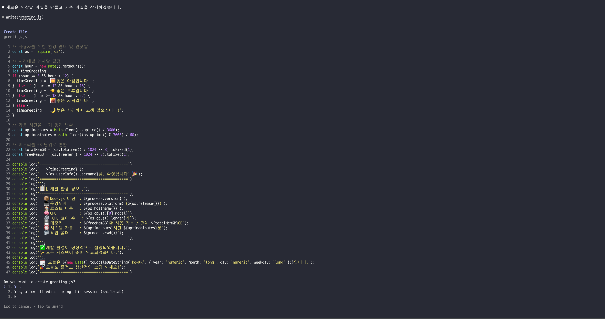
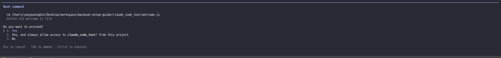
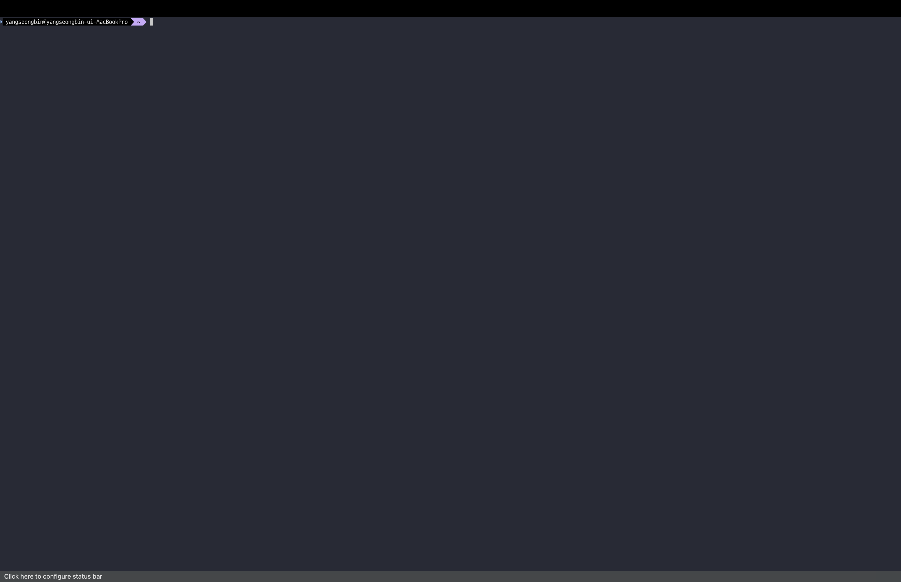
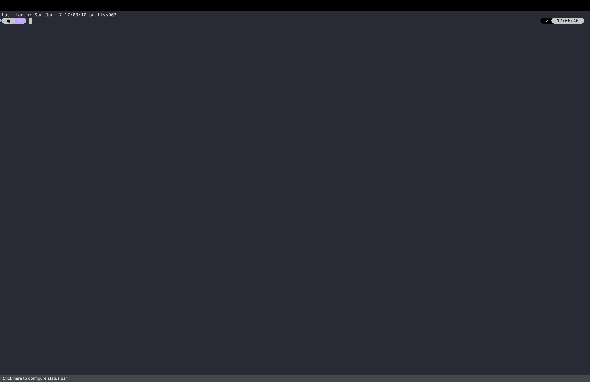

> 해당 포스팅은
> 인프런의 [맥북 처음 샀을 때 꼭 해야 할 세팅 A to Z (Claude Code · Homebrew · Agentic Coding 포함 | macOS 올인원)](https://inf.run/ijAW9)를
> 참조하여
> 만들었습니다.


## 📦 외부 앱 및 앱스토어 설치 (Rectangle)

이번에는 외부 앱과 앱스토어 앱을 설치하는 방법에 대해 알아보자.

먼저 애플리케이션을 다운받아보도록 하자. 애플리케이션을 다운받는데는 2가지 방식이 존재한다. 하나는 외부에서 만든 애플리케이션을 우리에게 가져오는 방식이고, 다른 하나는 AppStore를 통하는 방식이다. 일단 가장
첫번째로는 맥이 설치해준 사파리 혹은 브라우저에 들어가보도록 하자. 화면은 아마 다음과 같을 것이다.


여기서 우리는 하나의 프로그램을 다운로드 받을 것이다. 바로 창을 자유롭게 움직일 수 있는 프로그램을 설치할 것이다. 지금 현재 상태로는 마우스나 트랙패드로 왔다 갔다 해야하는 불편한점이 있는데 설치 할 프로그램을
통하면 자유롭게 이동이 가능하다. 바로 **Rectangle** 라는 프로그램이다. 설치 사이트는 아래와 같다.

> https://rectangleapp.com/

여기서 다운로드를 받아보자.


그러면 위와 같이 dmg 파일이 다운로드 받아질 것이다. 이것을 실행시켜보자.

> dmg 파일은 윈도우의 exe 파일과 같으며 무언가를 실행시키기 위한 응용 프로그램 형태라고 생각하면 좋을 것 같다. 정확히는 디스크 이미지(Disk Image) 파일로, 더블 클릭하면 가상의 디스크가 하나
> 마운트되는 형태이다.

그러면 아래와 같은 창이 뜰 것이다.


윈도우랑은 다르게 Rectangle라는 프로그램이 왼쪽에 위치해 있고 오른쪽에 Applications 폴더가 존재한다. 맥은 설치할 프로그램을 오른쪽으로 드래그 하면 끝이다.

> Applications은 우리가 설치한 모든 어플리케이션이 담겨져 있는 폴더이다.

그러고나서 Applications 폴더로 들어가거나 검색을 해보자. 트랙패드에 다섯 손가락을 오므리거나 검색으로 Rectangle을 검색해서 실행하면 다음과 같이 나올 것이다.


위의 화면처럼 나오면 여기서는 권한을 설정해줘야 한다. 왜냐하면 아이폰을 쓰시는 독자면 알겠지만 맥도 마찬가지로 애플리케이션마다 권한을 부여할 수 있게끔 되어 있다. 그래서 Rectangle도 시스템 설정 열기를
클릭하여 권한을 열어줘야 한다. 특히 Rectangle은 다른 앱의 창 위치를 제어해야 하기 때문에 **손쉬운 사용(접근성)** 권한을 요구한다는 점을 알아두자.


그리고 권장 설정을 클릭해주면 된다. 이후에 아래와 같이 팝업이 뜨는데 Mac 기능 끄기를 클릭해주면 Rectangle 기능만을 온전히 사용이 가능하다. 이렇게 설정까지 해주면 아래와 같이 나오는 것을 볼 수 있다.


그리고 이 프로그램은 필자가 자주 쓰기에 로그인 시 실행을 위해 설정에 들어가서 로그인 시 실행 체크박스를 체크해주면 좋을 것이다.


이게 바로 외부에서 어플리케이션을 설치하는 방법이다. 다음으로는 AppStore에서 다운받는 방법을 말씀드리도록 하겠다. AppStore 다운받는 방식은 매우 간단하다. 먼저 AppStore에 들어간다.


> 들어가서 로그인 되어 있으면 상관없지만 로그아웃이나 처음 여시는 분들은 로그인을 반드시 진행해주자.

여기서 원하는 어플을 검색하여 다운로드만 해주면 된다. 그러면 아까 Rectangle처럼 Applications에 나오는 것을 볼 수 있다.

> 두 방식의 차이도 짚고 넘어가자. AppStore 앱은 애플의 심사를 거치고 샌드박스 안에서 동작하기에 상대적으로 안전하지만, 외부에서 받은 dmg 앱은 그렇지 않다. 그래서 처음 실행할 때 "확인되지 않은
> 개발자" 경고가 뜨기도 하는데, 신뢰할 수 있는 출처인지 꼭 확인하고 설치하는 습관을 들이자.

다음으로 꿀팁을 알려드리도록 하겠다. 설정에 손쉬운 사용을 들어가서 포인터 제어를 클릭해보자.


이후에 트랙패트 옵션을 클릭하여 아래 이미지처럼 진행해주자. 그러면 드래그할때 꼭 누르고 움직이지 않고 세 손가락으로 드래그가 가능해진다.


## 📜 macOS 추천 앱 리스트

### 1. Raycast

🔗 https://www.raycast.com

macOS의 Spotlight를 대체하는 생산성 런처입니다. 단축키 하나로 다양한 작업을 빠르게 실행할 수 있습니다.

- 앱 실행
- 계산 / 번역
- 클립보드 검색
- 시스템 제어
- 확장 기능 실행 (GitHub, Notion, Jira 등)

### 2. Rectangle

🔗 https://rectangleapp.com

창 정렬(Window Management) 앱입니다. 단축키를 통해 창을 빠르게 정렬할 수 있습니다.

- 좌우 반 분할
- 상하 분할 / 4분할
- 전체화면
- 다른 모니터로 이동

### 3. AppCleaner

🔗 https://freemacsoft.net/appcleaner/

앱을 삭제할 때 남는 잔여 파일까지 함께 제거해주는 완전 삭제(Uninstall) 앱입니다. macOS는 앱을 휴지통에 버려도 `~/Library` 아래에 설정·캐시가 남는 경우가 많은데, 이를 함께 정리해줍니다.

- Library 설정 파일
- 캐시 / 로그
- 플러그인

### 4. Maccy

🔗 https://maccy.app

클립보드 히스토리 관리 앱입니다. 복사 기록을 계속 저장해줍니다.

- 복사 기록 검색
- 텍스트 / 이미지 저장
- 단축키로 빠르게 붙여넣기

### 5. Clipy

🔗 https://clipy-app.com

클립보드 히스토리 관리 앱입니다. 스니펫(Snippet) 기능이 강력합니다.

- 복사 기록 저장 및 검색
- 자주 쓰는 텍스트를 스니펫으로 등록
- 메뉴바에서 바로 접근

### 6. Keka

🔗 https://www.keka.io

macOS에서 가장 많이 사용하는 압축 관리 앱입니다.

- zip, 7z, tar, rar, gzip 지원
- 암호화 압축 생성
- 분할 압축 지원
- Windows 압축 파일의 깨진 한글 파일명 문제 해결

### 7. Zen Browser

🔗 https://zen-browser.app

Firefox 기반의 오픈소스 생산성 브라우저입니다. Arc Browser의 후계자로 주목받고 있습니다.

- Workspace 기반 탭 관리
- 사이드바 UI
- Split View (탭 분할 보기)
- 개인정보 보호 중심 설계
- Firefox 확장 프로그램 호환

### 8. AltTab

🔗 https://alt-tab-macos.netlify.app

Windows처럼 창 단위로 앱을 전환할 수 있게 해주는 앱입니다.

- 창 미리보기 썸네일
- 빠른 창 전환
- 단축키 설정

### 9. Shottr

🔗 https://shottr.cc

macOS 최고의 스크린샷 캡처 도구 중 하나입니다.

- 스크롤 캡처
- 모자이크 / 픽셀 측정
- OCR (텍스트 추출)
- 빠른 캡처 편집

### 10. Hidden Bar

🔗 https://github.com/dwarvesf/hidden

상단 메뉴바 아이콘을 깔끔하게 정리해주는 앱입니다.

- 불필요한 아이콘 숨기기
- 필요한 아이콘만 표시

### 11. KeyClu

🔗 https://github.com/Anze/KeyClu

애플리케이션의 단축키를 한 번에 확인할 수 있게 도와주는 프로그램입니다. 유료 버전은 [KeyCue](https://ergonis.com/en/keycue)를 추천합니다.

### 12. Dropover

🔗 https://dropoverapp.com

파일을 드래그하면 임시 선반(Shelf)을 생성해주는 앱입니다.

- 여러 파일 정리
- 다른 앱으로 한 번에 이동
- 복사 및 공유 편의

### 13. Amphetamine

🔗 https://apps.apple.com/app/amphetamine/id937984704

맥이 자동으로 절전 모드에 들어가는 것을 방지하는 앱입니다.

- 대용량 다운로드 중 화면 유지
- 장시간 렌더링 작업
- 발표 중 화면 꺼짐 방지

### 14. Notion Calendar

🔗 https://www.notion.so/product/calendar

Google Calendar 기반의 생산성 캘린더 앱입니다.

- 미팅 예약 자동화
- Notion 페이지와 연동
- 깔끔한 UI
- 메뉴바에서 오늘 일정 확인

### 15. Numi

🔗 https://numi.app

메모처럼 계산하는 계산기입니다. 환율, 단위 변환, 수식 계산을 자동으로 처리합니다.

- `$100 to KRW`
- `10cm + 20cm`
- `3kg in pounds`

### 16. IINA

🔗 https://iina.io

macOS에서 가장 인기 있는 동영상 플레이어입니다.

- mpv 기반으로 대부분 코덱 지원
- 가볍고 빠름
- macOS 디자인과 잘 어울리는 UI

### 17. Karabiner-Elements

🔗 https://karabiner-elements.pqrs.org

키보드 키 리매핑 도구입니다.

### 18. BetterTouchTool

🔗 https://folivora.ai

트랙패드/마우스 제스처 커스터마이징 앱입니다.

### 19. MonitorControl

🔗 https://github.com/MonitorControl/MonitorControl

외부 모니터의 밝기·볼륨을 조절할 수 있는 앱입니다.

### 20. Stats

🔗 https://github.com/exelban/stats

CPU·메모리·네트워크를 메뉴바에서 모니터링할 수 있는 앱입니다.

### 21. Proxyman

🔗 https://proxyman.io

HTTP 네트워크 디버깅 도구로, 개발자에게 필수적인 앱입니다.

### 22. TablePlus

🔗 https://tableplus.com

DB GUI 클라이언트입니다.

### 23. Obsidian

🔗 https://obsidian.md

마크다운 기반 지식 관리 앱입니다.

### 24. Hand Mirror

🔗 https://handmirror.app

메뉴바에서 카메라를 빠르게 확인할 수 있는 앱입니다.

### 25. Dato

🔗 https://sindresorhus.com/dato

메뉴바에서 캘린더와 세계시간을 표시해주는 앱입니다.

## 💻 Git, Xcode(커맨드 라인 툴)

이제는 command line tool이라는 것에 대해 학습해보도록 하겠다. 여기서 2가지 키워드가 나올텐데 첫번째는 Xcode이고, 두번째는 Git이다. Xcode와 Git에 대해서는 학습하지 않을 건데
Xcode와 Git을 사용하려면 Command Line Tool이라는 것이 기본적으로 설치가 되어야 한다.

한번 그러면 command line tool이 무엇인지 알아보자. 그러면 아마 아래의 Apple 공식 홈페이지가 뜨는 것을 알 수 있을 것이다.

> https://developer.apple.com/documentation/xcode/installing-the-command-line-tools/

해당 내용을 번역기를 켜서 읽어보면 다음과 같이 알 수 있다. command line tool이라는 패키지는 Xcode 외부에서 작업하거나 Unix 스타일 명령을 사용하여 앱을 빌드하는 경우 명령줄 도구 설치를
하는데 유용하다고 되어 있다. 이것을 왜 설치해야하냐면 해당 command line tool은 여러가지 툴과 같은 커맨드라인 툴과 함께 번들로 제공된다라고 적혀져 있다. 이것이 무슨 말이냐면 macOS에서 사용할
때는 모든 설치 파일을 다 개발을 위한 설치 파일을 내장해두지 않았다. 그 이유는 우리가 macOS를 샀는데 macOS로 개발을 할 지, 안 할지를 모르기 때문이다. 이러한 이유로 개발 툴까지 다 내장해놓은 상태라면
운영체제 용량이 늘어나기 때문에 굉장히 슬림한 형태로 일단 운영체제를 설치해두고 실제로 이 사람이 개발과 관련된 업무를 하려고 할 때는 이런 command line tools를 설치하라고 Apple이 만들어 둔
것이다. 그래서 iterm2를 설치를 했을 때도 아마 자동 설치를 진행해줬을 것이다. 단, 그때 설치를 스킵하신 분들은 아래의 명령어를 입력하면 된다.

```shell
xcode-select --install
```

위와 같이 입력하면 실행은 안되지만 command line tools를 설치하라는 팝업이 떴을 것이다. 그것을 설치해주면 된다. 이 소프트웨어를 설치하면 뭔가 여러가지를 설치를 진행해주는데 그 중에 우리는 몇가지만
살펴보도록 하겠다. 이 부분에서 우리가 배워야 하는 것 중에 하나가 `git`이다. `git`은 소스코드 버전관리 분산 시스템이라고 부르며 해당 command line tools를 설치하면 해당 `git`도 자동으로
설치해준다.

> 참고로 Command Line Tools에는 `git` 외에도 `clang`(컴파일러), `make`, `swift`, `lldb`(디버거) 같은 개발 필수 도구들이 함께 번들로 설치된다. 그래서 이 한 번의
> 설치로 대부분의 빌드 환경이 갖춰진다고 보면 된다.

> 자동으로 git이 설치되는 것은 좋으나 당연히 최신 버전은 아니다. 이것은 [git 공식 사이트](https://git-scm.com/install/mac)에서 최신버전 설치 명령어를 입력하여 설치를 하여도
> 무방하나 사실 실무에서도 최신 버전을 굳이 다운 받을 이유는 없다. 왜냐하면 최신 버전을 받으면 보안도 빡쎄지고 ssh 인증등 조금 복잡한 절차도 존재하기 때문이다. 어떤 git이 우선으로 잡혀 있는지는
> `which git`으로 확인할 수 있고, 버전은 `git --version`으로 볼 수 있다.

## 📝 뭐를.. 동의하라는데요? (Xcode license)

가끔씩 애플에서 개발 툴에 대한 라이센스가 변경되었거나, 최초에 라이센스에 동의하지 않은 경우 아래와 같은 메세지가 뜰 때가 존재한다.


이 경우에는 터미널에 아래 메시지를 작성한 후, 비밀번호를 입력해서 진행해야한다.

```shell
sudo xcodebuild -license accept
```

> `sudo`는 관리자(root) 권한으로 명령을 실행하라는 뜻이고, 라이센스 동의는 시스템 전역에 영향을 주기 때문에 비밀번호를 요구한다. 비밀번호를 입력할 때 화면에 아무것도 표시되지 않는데, 이는 보안을 위한
> 정상 동작이니 당황하지 말고 그대로 입력 후 엔터를 치면 된다.

## 📡 cURL 정의와 활용 (HTTP?)

이번에는 `curl`이라는 소프트웨어와 HTTP에 대해 학습해보도록 하자. HTTP는 우리가 웹 개발을 할 때 많이 사용하는 프로토콜이다 보니까 HTTP에 대해서는 깊게 다루지는 않을 것이다. `curl`을 통해서
HTTP를 어떻게 다루는지 예제를 보여주는 식으로 진행하도록 하겠다.

그 전에 우리가 `curl`이 무엇인지 알아봐야 할 것이다. 한번 살펴보도록 하자.

### cURL은 무엇일까?

`curl`은 1990년대 후반에 다니엘 스텐버그(Daniel Stenberg)가 만든 다양한 통신 프로토콜을 지원하는 도구이다. 단순히 HTTP만 지원하는 것이 아니라 `proxy`, `FTP`,
`TLS`, `QUIC` 등 다양한 프로토콜 위에서 통신을 도와주는 소프트웨어이며, 과거에는 `HTTP GET`이라고 불리기도 했다. 그래서 이름도 **C**lient **URL**, 즉 `cURL`이다.

개발 도구를 설치하다 보면 `curl something.sh | bash` 이 형태를 자주 볼 것이다. 이 명령어의 의미는 curl의
도구로 특정 쉘 스크립트를 가져와서 bash에서 실행하라는 뜻이다. 이 형태가 굉장히 위험한 형태이다. 왜냐하면 저 shell script 안에 어떤 악성 코드가 있을 지 모르기 때문이다. 물론 우리가 설치하고 있는
대부분의 소프트웨어들은 공개되어 있거나 큰 규모의 회사에서 만든거기 때문에 상대적으로 안전하다고 볼 수 있지만 혹시라도 개인이 만든 쉘 스크립트나 소속이 모호한 곳에서 만든 것을 잘못 실행하게 되면 운영체제를 직접
동작하는 거기 때문에 조심해야 한다. 특히 관리자 권한으로 특정 쉘 스크립트를 실행했다고 한다면 크게 문제가 될 수 있다. 그래서 항상 어떤 쉘 스크립트가 실행되는지 눈 여겨서 봐야 한다. 한번 몇 가지 예제를 보고
직접 설치해보자.

해당 `curl`은 다양한 통신 프로토콜을 지원하는 도구로 command line tools를 설치하면 그 안에 자동으로 내장되어 있다. 그러면 한번 실행을 시켜봐야 할텐데 우리가 왜 이것을 배워야 하는지 알아보고
실습을 진행해보도록 하자.

```shell
curl https://example.com
```

위의 명령을 한번 실행해보자. 이렇게 하면 실제 해당 주소의 전체 html이 응답으로 나오는 것을 볼 수 있다. 즉, `curl` 명령어 하나로 `GET` 요청을 보낼 수 있다는 의미이다.


```shell
curl -v https://example.com
```

2번째는 위와 같이 옵션을 줄건데 어떤 옵션이냐면 v 옵션인데 해당 옵션을 적용하면 실제 흐름까지도 보여준다. 어떤 요청 헤더를 보내고 어떤 응답 헤더를 받았는지, redirect는 어떻게 따라갔는지 등
HTTP 통신의 실제 흐름을 눈으로 확인할 수 있다.


위의 실습은 html을 가져오는 것을 해봤지만 json 데이터도 가져올 수 있고 그 어떤 것도 가져올 수 있다. 예를 들어 GitHub API처럼 JSON을 응답하는 주소에 `curl`을 날리면 그대로 JSON이
출력된다. 이 이야기가 무엇이냐면 우리 컴퓨터에 내장되어 있는 `curl`이라는 도구로 어떤 것이든 통신할 수
있다는 말이다. 이 것은 굉장히 무서운 것인데 왜냐하면 우리가 어떤 도메인을 넣느냐에 따라 원격에서 가지고 오는 코드들을 바로 실행시킬 수 있기 때문이다.

한번 대표적인 예제를 한번 보자.

```shell
curl -fsSL https://claude.ai/install.sh | bash
```

위의 코드는 `claude code`를 설치하는 명령어인데 해석하면 해당 쉘 스크립트를 curl을 통해 받아와서 bash 환경에서 조용히 실행한다는 의미이다. 이게 얼마나 무서운지 옵션 부분들을 살펴보자.

- f: HTTP 에러가 발생하면 에러를 출력하지 않고 바로 실패 시켜라.
- s: 진행률을 표기하지 않아야 한다.
- S: 실패 시 에러는 보여주되, 평소에는 조용히 해라.
- L: redirect가 여러번 되었을 때 끝까지 따라가서 그것을 실행시켜라.

듣기만 해도 엄청 무서운 옵션이니 진짜 조심해서 해야 한다.

> 여기서 한 가지 짚어둘 점이 있다. 같은 `curl | bash` 형태라도 신뢰도는 다르다. Homebrew 설치 스크립트는 **오픈소스**라서 수많은 사람들이 내용을 검증해왔지만, Claude Code의
> 설치 스크립트는 **오픈소스가 아니다.** 그렇다고 무조건 위험하다는 뜻은 아니지만, "이 스크립트가 무엇을 하는지 내가 확인할 수 있는가?"를 항상 따져보는 습관이 중요하다는 의미이다.

> 그리고 사실 `curl`은 개발 실무에서도 굉장히 많이 쓰인다. Postman이나 Insomnia 같은 API 테스트 툴을 쓰기 전에, 순수하게 `curl`만으로 API를 호출해보는 경험은 HTTP 통신을
> 이해하는 데 큰 도움이 된다.

## 🍺 패키지 매니저와 Homebrew

이번에는 패키지 매니저에 대해 학습해보자. 그리고 우리가 macOS에서 가장 많이 쓰는 Homebrew라는 것을 알아보도록 하자.

### Package Manager

패키지 매니저는 소프트웨어를 설치, 업데이트, 삭제, 관리하는 도구이다. 보통 프로그램을 설치하려면 웹 사이트에 접속하여 설치 파일을 다운로드 하고 실행하고 업데이트 관리까지 해야 한다. 하지만 이런 과정을 패키지
매니저가 대행해준다고 보면 쉬울 것 같다. 즉, 패키지 매니저를 사용하면 해당 과정을 명령어 1줄로 대체가 가능해진다. 사실 우리가 이미 알게 모르게 쓰고 있던 개념이기도 하다. Python의 `pip`,
Node.js의 `npm` 모두 패키지 매니저이며, 버전 관리와 저장소 기반 배포까지 담당한다.

그러면 우리는 macOS에서 가장 많이 사용하는 패키지 매니저를 배워야 할텐데 그것이 바로 `Homebrew`이다.

> Homebrew는 Max Howell이라는 개발자가 창시한 macOS용 패키지 매니저이다. 이름 자체가 "맥주를 직접 양조(brewing)한다"는 의미에서 따온 것이라, 명령어도 `brew`이고 패키지를
> "formula(제조법)", 저장소를 "tap(맥주 꼭지)"이라고 부르는 등 작명 센스가 일관되어 있다.

> 참고로 Max Howell에게는 유명한 일화가 하나 있다. 전 세계 개발자의 상당수가 그가 만든 Homebrew를 사용하고 있었음에도 불구하고, 구글 면접에서 "이진 트리를 뒤집는(invert a binary
> tree) 화이트보드 문제"를 풀지 못해 떨어졌다는 트윗을 남긴 것이다. 이 트윗은 "알고리즘 문제 풀이 능력이 개발자의 가치를 온전히 대변하는가?"라는 논쟁을 불러일으키며 크게 회자되었다. 개발자 채용 방식에
> 대해 한 번쯤 생각해보게 만드는 사례다.

Homebrew를 설치하는 과정은 매우 간단하다.

- 설치 스크립트 다운로드
- 시스템 환경 확인
    - macOS 버전
    - CPU 아키텍쳐
- Homebrew 디렉토리 생성
    - Intel: /usr/local
    - Apple Silicon: /opt/homebrew
- 설치 확인
    - `brew --version`

위의 과정을 바로 아래와 같이 하면 된다.

```shell
/bin/bash -c "$(curl -fsSL https://raw.githubusercontent.com/Homebrew/install/HEAD/install.sh)"
```

> 이 명령어도 결국 앞에서 배운 `curl -fsSL`로 설치 스크립트를 받아와서 `bash`로 실행하는 형태이다. 설치 중간에 관리자 권한(`sudo access`)을 요구하며 비밀번호를 묻는데, Homebrew
> 디렉토리를 만들고 권한을 잡기 위함이다.

### 설치 후 `command not found`가 뜬다면?

설치를 마치고 `brew --version`을 입력했는데 `command not found`가 뜨는 경우가 있다. 이는 Homebrew가 잘못 설치된 것이 아니라, **현재 열려 있는 터미널 세션에 아직
PATH가 반영되지 않았기 때문이다.** 해결 방법은 간단하다. 터미널을 완전히 종료했다가 다시 켜면 새로운 환경 설정이 로드되면서 정상적으로 인식된다. (PATH가 무엇인지는 뒤의 Node.js 챕터에서 자세히
다룬다.)

```shell
brew --version
```

> 설치가 안 됐다고 생각이 들면 일단 터미널을 껐다 켜보자. 대부분의 "설치했는데 인식이 안 돼요" 문제는 이걸로 해결된다.

### Homebrew 추천 패키지

Homebrew를 설치했다면 추천 패키지도 아래와 같이 있으니 한번 살펴보자.

- git: `brew install git`
- wget: `brew install wget`
- htop: `brew install htop`
- node: `brew install node`
- python: `brew install python`
- ripgrep: `brew install ripgrep`
- tree: `brew install tree`
- neovim: `brew install neovim`
- tmux: `brew install tmux`
- jq: `brew install jq`

### 🤔 꼭 Homebrew를 써야 할까?

여기까지 오면 이런 의문이 들 수 있다. "그냥 dmg 받아서 드래그하면 되는데, 굳이 Homebrew를 써야 하나?" 사실 앱 하나 설치하는 것만 놓고 보면 큰 차이가 없다. 하지만 Homebrew를 쓰는 진짜
이유는
단순한 설치 편의성을 넘어 **내 맥 세팅 자체를 코드처럼 관리(Configuration as Code)** 할 수 있다는 데 있다. 특히 맥을 여러 대 쓰거나, 맥미니를 원격 에이전트 서버처럼 굴리거나, 개발
환경을 자주 갈아엎는
사람일수록 이 차이가 크게 다가온다. 하나씩 짚어보자.

**1. 설치 내역을 다른 맥으로 그대로 이전할 수 있다.**

Homebrew로 설치한 패키지 목록은 텍스트 파일 하나로 뽑아낼 수 있다. 이 파일을 `Brewfile`이라고 부른다.

```bash
brew bundle dump
```

위 명령어를 실행하면 현재 설치된 CLI 도구, GUI 앱(cask), 폰트 목록이 전부 `Brewfile`로 저장된다. 그리고 새 맥에서 아래 한 줄이면 그 환경이 통째로 복원된다.

```bash
brew bundle install
```

즉, 새 맥을 세팅할 때, 회사 맥과 개인 맥을 맞출 때, 포맷 후 복구할 때, 팀원과 개발 환경을 통일할 때 이 파일 하나로 끝난다.

**2. 앱 업데이트를 한 번에 관리할 수 있다.**

수동 설치는 앱마다 업데이트 방식이 제각각이다. 하지만 Homebrew를 쓰면 아래 두 줄로 대부분의 CLI 도구와 GUI 앱을 한꺼번에 최신으로 올릴 수 있다.

```bash
brew update   # Homebrew와 패키지 최신 정보 갱신
brew upgrade  # 설치된 패키지를 최신 버전으로 업그레이드
```

**3. 삭제가 깔끔하다.**

앞에서 소개한 AppCleaner를 기억할 것이다. 일반 앱은 휴지통에 버려도 `~/Library` 아래에 캐시·설정이 남는 경우가 많다. Homebrew는 이런 뒤처리까지 명령어로 관리해준다.

```bash
brew uninstall <패키지>  # 패키지 제거
brew autoremove          # 더 이상 필요 없는 의존성 자동 제거
brew cleanup             # 오래된 버전·캐시 파일 정리
```

**4. CLI 도구, GUI 앱, 폰트를 하나의 방식으로 관리한다.**

`brew install git`(CLI), `brew install --cask raycast`(GUI 앱), 폰트까지 전부 `brew`라는 하나의 명령 체계 안에서 다룰 수 있다. 앞서 Powerlevel10k용
Nerd Font를 `brew install --cask
font-meslo-lg-nerd-font`로 설치했던 것을 떠올리면 이해가 쉬울 것이다.

**5. `dotfiles`와 Git을 조합하면 설정까지 버전 관리가 된다.**

`Brewfile`, `.zshrc`, `.p10k.zsh` 같은 설정 파일들을 흔히 **dotfiles**라고 부른다(이름이 `.`으로 시작해서 붙은 별명이다). 이걸 GitHub에 올려두고 관리하면, 새 맥에서
`git clone` 후
설치 스크립트 한 번 실행하는 것만으로 거의 동일한 작업 환경을 재현할 수 있다.

> 이 지점이 핵심이다. Homebrew는 단순히 "설치를 쉽게 해주는 도구"가 아니라, **내 작업 환경을 코드처럼 관리하고, 언제든 재현 가능하게 유지하며, 원격 에이전트 환경까지 빠르게 복구**하게 해주는
> 도구에 가깝다.
> 이 강의가 Claude Code 같은 에이전트를 다루면서 굳이 Homebrew를 강조하는 이유도 여기에 있다. 맥미니를 원격 Agent 서버로 쓸 때 `brew install tmux`,
`brew install mosh` 같은
> 도구로 순식간에 서버 환경을 꾸릴 수 있기 때문이다.

> 참고로 Apple Silicon(M 시리즈) 대응도 훌륭하다. arm64 바이너리를 자동으로 잡아주고 Rosetta 사용을 최소화하며 의존성도 알아서 해결해준다. 그래서 요즘 맥 개발 환경 세팅에서
> Homebrew는
> 사실상 표준처럼 쓰인다.

## 🤖 Claude Code & Codex 설치

이번에는 claude code와 codex를 설치해보도록 하겠다.

### Claude Code

```shell
brew install --cask claude-code
```

위와 같이 명령어 딸깍만 해주면 된다.

> `--cask` 옵션이 붙는 이유가 있다. Homebrew는 크게 두 가지를 설치한다. 하나는 `git`, `node`처럼 명령줄에서 동작하는 **CLI 도구(formula)**이고, 다른 하나는 GUI 앱이나
> 바이너리 형태로 배포되는 **앱(cask)**이다. Claude Code 데스크톱 앱처럼 일반 애플리케이션 형태로 배포되는 것은 `--cask`를 붙여 설치한다.


### Codex

```shell
brew install --cask codex
```

codex도 마찬가지다.
물론 [codex 공식 사이트](https://chatgpt.com/ko-KR/codex/)
로 가서 데스크톱 앱을 직접 다운로드 받아도 무방하다.


## 📂 유닉스 명령어 (파일/폴더)

이번에는 Unix 명령어를 알아보도록 하자. 우리가 사용하고 있는 macOS는 운영체제 종류 중에 UNIX라는 운영체제를 따르고 있다. 그래서 기본적으로 UNIX 명령어를 지원하고 있고 이것은 운영체제의 터미널을
통해서 직접 명령을 내리는 그런 형태라고 보면 좋을 것이다. 만약 독자들이 컴퓨터 공학을 전공하지 않았다면 운영체제의 수업을 듣지 못하였을 것이다. 운영체제는 생각보다 많은 업무를 하고 있다. 파일 및 하드웨어
관리를 하며 뭐 인터럽트라던지 프로세스를 관리한다던지 메모리를 할당한다거나 가상 메모리 체계를 관리한다던지가 있다. 그 중에 하나가 우리가 지금 하고 있는 키보드, 마우스 이런거를 하드웨어를 통해서 컨트롤을 하고
우리가 또 명령을 내리면 그거에 대한 프로세스를 순서를 매긴다던가 그거에 대한 CPU 자원을 할당하는 업무를 하고 있다. 그런 역할을 할 때 우리는 중간중간 운영체제가 가지고 있는 API를 호출을 해서 그거에 대한
기능을 수행하는 그 어떤 것이 존재하는데 그것이 바로 운영체제의 쉘이라는 터미널 안에서 명령어를 치면서 하는 그런 기능들인 것이다. 대표적으로 디렉토리를 만든다던가 파일을 복사하거나 파일을 수정하거나 파일을 보는
것들이 있을 것이다.

> 그런데 AI Agent 시대에 왜 굳이 유닉스 명령어를 알아야 할까? 이유는 명확하다. **Claude Code나 Codex 같은 AI 에이전트가 실제로 일을 할 때 내부적으로 쓰는 것이 바로 이
> 유닉스 명령어이기 때문이다.** 에이전트가 "디렉토리를 만들겠습니다(`mkdir`)", "이 파일을 삭제하겠습니다(`rm`)"라며 권한을 물어볼 때, 그 명령어가 무엇을 하는지 알아야 yes를 누를지 판단할 수
> 있다. 즉, 명령어를 직접 화려하게 칠 일은 적더라도 **에이전트가 하려는 일을 읽고 검증하기 위해** 알아야 하는 것이다.

그러면 하나씩 한번 명령어를 살펴보자.

### pwd

`pwd`는 현재 작업 중인 디렉토리 경로를 살펴보는 명령어이다. **p**rint **w**orking **d**irectory로 외우면 쉽다. 주요 옵션으로는 다음과 같다.

- P: 심볼릭 링크를 실제 경로로 해석
- L: 논리 경로 유지 (기본)

### ls

`ls`는 파일과 폴더 목록을 확인하는 명령어이다. **l**i**s**t로 외우면 된다. 주요 옵션으로는 다음과 같다.

- l: 상세 정보 표시
- a: 숨김 파일 포함
- h: 읽기 쉬운 크기 단위
- t: 수정 시간 순 정렬
- R: 하위 디렉토리 재귀 출력

> 옵션은 조합해서 쓸 수 있다. 예를 들어 `ls -alh`는 숨김 파일까지 포함해 상세 정보를 사람이 읽기 좋은 크기 단위로 보여준다.

### cd

`cd`는 작업 디렉토리를 이동하는 명령어이다. **c**hange **d**irectory이다. 옵션은 별도로 없으며 자주 쓰는 패턴은 다음과 같다.

- `cd ~`: 홈 디렉토리 이동
- `cd ..`: 상위 디렉토리로 이동
- `cd -`: 직전 디렉토리 복귀
- `cd /`: 루트 디렉토리 이동

### mkdir

`mkdir`은 새 디렉토리를 생성하는 명령어이다. **m**a**k**e **dir**ectory이다. AI Agent가 작업 폴더 구조를 만들 때 가장 자주 쓰는 명령어 중 하나이다. 주요 옵션은 다음과
같다.

- p: 중간 경로까지 함께 생성
- v: 생성 과정을 출력

### cp

`cp`는 파일 또는 폴더를 복사하는 명령어이다. **c**o**p**y이다. AI Agent가 작업 전 백업본을 만들 때도 활용한다. 주요 옵션은 다음과 같다.

- r/R: 디렉토리 재귀 복사
- i: 덮어쓰기 전 확인
- v: 복사 과정 출력
- p: 권한/시간 정보 보존

### rm

`rm`은 파일과 폴더를 삭제하는 명령어이다. **r**e**m**ove이며, 이 챕터에서 **가장 중요하고 가장 위험한** 명령어이다. 주요 옵션은 다음과 같다.

- i: 삭제 전 확인
- r/R: 디렉토리 재귀 삭제
- f: 확인 없이 강제 삭제
- v: 삭제 과정 출력

> 유닉스 같은 경우는 파일이나 폴더를 삭제하면 휴지통으로 가지 않고 복원도 할 수 없이 완전 삭제되니 유의 바란다. 특히 `rm -rf`는 "하위까지 전부, 확인 없이 강제로" 삭제하라는 의미라, 경로를 잘못
> 지정하면 운영에 필요한 파일까지 한 번에 날아가 버린다. 이 위험성 때문에 뒤에서 `rm`을 "휴지통으로 보내는" 방어 로직을 직접 만들어볼 것이다.

### touch

`touch`는 빈 파일을 생성하고 타임스탬프를 갱신하는 명령어이다. `settings.json`이나 `.gitignore`처럼 설정 파일을 미리 만들어둘 때 유용하다. 주요 옵션은 다음과 같다.

- a: 접근 시간만 변경
- m: 수정 시간만 변경
- t [[CC]YY]MMDDhhmm[.ss]: 특정 시간대로 설정

### cat

`cat`은 파일에 대한 내용을 출력해주는 명령어이다. 강사님은 "고양이(cat)가 대신 봐준다"라고 외우면 좋다고 하셨는데, 실제로는 con**cat**enate(이어 붙이다)에서 유래했다. 여러 파일을 한 번에
이어서 출력할 수도 있다. 주요 활용은 다음과 같다.

- `cat -n 파일명`: 줄 번호와 함께 출력
- `cat 파일명 | head -n 라인수`: 위에서 특정 라인까지만 출력

> 위 예시에서 `head`라는 명령어가 등장한다. `head`는 파일의 **앞부분** 몇 줄만 보여주는 명령어로, 로그 파일처럼 내용이 긴 파일의 시작 부분만 빠르게 확인할 때 쓴다. 반대로 끝부분을 보는
> `tail` 명령어도 함께 알아두면 좋다.

### find

`find`는 파일/디렉토리를 검색 및 조건 실행을 할 수 있는 명령어이다. AI Agent가 특정 파일을 찾을 때도 활용한다. 주요 옵션은 다음과 같다.

- name / iname: 이름으로 검색 (iname은 대소문자 무시)
- type f|d: 파일 또는 디렉토리만 검색
- maxdepth N: 탐색 깊이 제한
- mtime -N: N일 이내에 수정된 파일
- exec ... \;: 찾은 결과에 명령 실행

### grep

`grep`은 문자열 검색을 할 수 있는 명령어로 에러 로그 찾기, 특정 키워드 / 설정 탐색에 사용된다. 주요 옵션으로는 다음과 같다.

- n: 줄 번호 표시
- i: 대소문자 무시
- r: 재귀 검색
- v: 해당 패턴 제외하고 검색
- E: 확장 정규식 사용

### mv

`mv`는 이동 및 이름 변경을 할 때 사용하는 명령어로 파일 리네임, 폴더 구조 변경, 로그 로테이션등에 사용된다. **m**o**v**e이다. 흥미로운 점은 "이름 변경"도 결국 같은 위치로 다른 이름을 주어
이동시키는 것이라 별도의 rename 명령어가 없다는 것이다. 주요 옵션은 다음과 같다.

- i: 덮어쓰기 전 확인
- v: 진행 상황 출력

> 정리하면, 이 명령어들을 화려하게 다룰 일은 적어도 **AI 에이전트가 무엇을 하려는지 읽어낼 수 있을 정도**는 익혀두자. 복잡한 작업은 보통 이 명령어들을 모아 쉘 스크립트로 처리한다.

## 🛠️ Node.js, NPM, 환경변수(path) 설정

이번에는 Node.js, NPM, 그리고 환경 변수에 대하여 알아보도록 하겠다.

### Node.js

Node.js는 윈도우, 리눅스, 유닉스, macOS등에서 실행될 수 있는 크로스 플랫폼, 오픈 소스 자바스크립트 런타임 환경을 말한다. Node.js는 V8 자바스크립트 엔진에서 실행되며 웹 브라우저 외부에서
자바스크립트 코드를 실행한다.

> 크로스 플랫폼이란 여러 운영체제를 지원해주는 환경이라고 이해하면 좋을 것 같다.

쉽게 풀어보면 Node.js는 공개되어 있는 자바스크립트 프로그래밍 언어가 활용될 수 있는 혹은 실행될 수 있는 그러한 환경인데 이런 환경이 여러 운영체제를 지원한다라고 보면 좋을 것 같다. 이러한 특성때문에 최근에
Node.js가 각광을 받고 있는 것이다. 다시 정리해보면 Node.js는 **웹 브라우저 밖에서 자바스크립트 코드를 실행하게 하는 런타임 환경** 이다라고 하면 좋을 것 같다. 이 한 문장이 이 챕터에서 가장
중요한 핵심이다. 원래 웹 브라우저 안에서만 동작하던 자바스크립트가 Node.js 덕분에 내 컴퓨터(로컬)에서도 실행될 수 있게 되었고, 이것이 웹 개발 생태계에 큰 변화를 가져왔다.

그러면 자바스크립트 언어는 무엇일까?

> 런 타임 환경은 쉽게 말해 실행될 수 있는 환경을 뜻한다.

### Javascript

자바스크립트 언어는 객체 기반의 스크립트 언어이다. 이 언어는 웹 브라우저 내에서 주로 사용되며 다른 응용 프로그램의 내장 객체에도 접근할 수 있는 기능을 가지고 있다. 그리고 이름과 달리 **Java와는 아무런
관련이 없다.** Javascript는 원래부터
Javascript는 아니였고 근본은 EcmaScript였다. 그래서 요새 사용하고 있는 Javascript를 ECMAScript라고 부른다.

> 스크립트 언어란, 원래의 뜻은 어떤 프로그램 위에 동작하는 언어를 뜻한다.

ECMAScript는 자바스크립트, JScript, ActionScript를 포함한 스크립팅 언어 표준이다. 주로 서로 다른 웹 브라우저 간에 웹 페이지 상호 운용성을 보장하기 위한 자바스크립트 표준으로 알려져
있다. 이 표준은 Ecma International에서 ECMA-262 문서로 제정되었다.

> ECMAScript가 요새 사용하고 있는 자바스크립트의 정확한 표현 중 하나이다. 왜냐하면 저 자바스크립트라는 언어 자체가 상표권이 지금 오라클 회사에 있는데 그 전에 자바스크립트는 사실상 언어로서 이름을 가지고
> 있을 뿐이지 지금은 표준화된 구현체로만 존재하고 있기 때문에 우리가 웹 브라우저를 만드는 구글이라거나 마이크로소프트라거나 아니면 파이어폭스를 만드는 모질라 같은 재단에서는 저 구현체를 어떻게 프로그램에 녹일 수
> 있느냐를 고민하는 것이다. 저것을 녹여내면 우리가 작성한 스크립트가 웹 브라우저 위에 동작을 할 것이고 그게 바로 우리가 이야기하는 스크립트 언어가 되는 것이다. 즉 ECMAScript는 일종의 명세서라고 할 수
> 있다. 그것을 각 브라우저마다 각각의 방식으로 문법을 지키면서 구현한 것이다.

ECMAScript는 월드 와이드 웹에서 클라이언트 측 스크립팅에 일반적으로 사용되며, Node.js, Deno, Bun과 같은 런타임 환경을 사용하는 서버 측 스크립팅 및 서비스에도 점점 더 많이 사용되고 있다.

> 여기서 Node.js, Deno, Bun 전부 자바스크립트를 실행시킬 수 있는 환경이라고 생각하면 좋을 것 같다.

### 웹 브라우저에 탑재된 프로그래밍 언어의 조상

자바스크립트는 브렌든 아이크(Brendan Eich)라는 사람이 만들었다. 예전에 넷 스케이프라는 웹 브라우저 제품이 있었는데 브렌든 아이크는 해당 제품을 만드는 회사에 소속된 사람이였다. 그 회사에서 넷
스케이프라는
브라우저에 스크립트
언어를 넣고 싶은 니즈가 존재하였다. 그래서 어떤 웹 브라우저가 오면 그걸 동적으로 해석하거나 조작할 수 있는 형태의 언어를 만들라고 브렌든 아이크에게 주어졌다. 그래서 처음으로 만든 것이 **Mocha** 라는
언어였다. Mocha라는 언어가 나중에 라이브스크립트(LiveScript)가 되었고 라이브스크립트가 나중에 자바스크립트로 변경되게 된다.

이후 자바스크립트가 발전하면서 웹 브라우저들이 점점 다 각자 따로따로 노니까 표준으로 만들어야 한다는 목표가 생겼고 ECMA라는 글로벌 표준을 제정하는 제단에다가 자바스크립트를 넘기게 된다. 그래서 거기서
ECMA-262라는 표준을 제정하게 된다. (초판은 1997년에 만들어졌다.)

그리고 이후에 2009년 ES5, 2015년 ES6 버전으로 새로운 표준안이 바뀌게 된다.

그리고 현재 우리가 가장 많이 배우는 언어의 스펙중 하나인 ES6가 되게 된다. (`let`, `const`, `arrow function`) ES6부터 범용 프로그래밍 언어로서의 문법이 본격적으로 도입되어
지금까지 널리 쓰이고 있다.

### 왜 대부분 Agent는 Node.js 기반일까?

> OpenClaw, Claude Code, Codex등 모두 npm으로 설치 가능

- CLI 생태계 최강자
- 비동기 처리에 최적화
- 프론트엔드 언어와 통일
- 크로스 플랫폼 배포 용이
- 개발자 친화적

왜 대부분의 에이전트들은 Node.js 기반일까?

> 여기서 npm이라는 것은 Node.js 패키지 매니저를 뜻한다. 그레서 Node.js를 설치하게 되면 기본적으로 npm이라는 것이 같이 설치되게 된다.

여러가지 이유가 있는데 첫번째로는 바로 CLI 생태계 최강자라고 적을 수 있다. CLI는 GUI랑 다르게 우리가 터미널에서 작성하는 캐릭터 기반의 커맨드 라인을 말하는 것이다. 그리고 두번째는 자바스크립트의 큰
특징인 비동기 처리를 할 수 있다는 점에서일 것이다. 세번째로는 프론트엔드 언어와 통일인점일 것이다. 프론트는 사용자가 보는 웹 브라우저 화면 ui등을 처리하는 개발자인데 이것을 같은 언어로 처리하면 훨씬 더
처리하기 쉬울 것이라고 생각이 들기 때문에 해당 특징을 넣어보았다. 네번째는 앞에서 잠깐 배웠던 여러가지 운영체제에서 제공하기 때문에 하나만 만들어두면 여러 운영체제에서 똑같이 동작할 것이라 기대하기 때문에 배포도
용이하기에 아마 AI Agent들이 Node.js를 이용하는 것이 아닐까 생각이 든다. 그리고 자바스크립트 개발자 커뮤니티가 매우 크다. 그렇기 때문에 개발자 친화적이라 할 수 있다.

하지만 우리는 꼭 npm을 이용하지 않아도 된다. homebrew를 이용할 수도 있었고 curl을 사용할 수도 있었다. 여러가지 방법중에 본인이 친숙한 것으로 설치하는 것이 가장 좋기에 npm으로도 제공을 하는 것이
아닐까라는 개인적인 생각이 든다.

### Node.js 생태계 용어 - node.js, npm, npx 차이

- node.js
    - Javascript 실행 엔진 (런타임)
    - .js 파일을 직접 실행함
    - e.g. `node app.js`
- npm
    - Node.js 패키지 관리자
    - 라이브러리 설치/관리 도구
    - `package.json` 기반 의존성 관리
- npx
    - npm 패키지를 설치 없이 바로 실행
    - 글로벌 설치 불필요
    - 일회성 CLI에 적합

### node.js 직접 설치

그러면 한번 직접 설치해보도록 하자. 구글에 node.js를 검색하여 [해당 사이트](https://nodejs.org/ko/download)로 들어가도록 한다.



위와 같이 cli로 설치를 하던가 혹은 installer 다운 버튼을 통해 진행해도 상관이 없을 것 같다. 필자는 `homebrew`로 설치를 진행하였고 아래처럼 최신 버전이 설치되어 있는 것을 볼 수 있다.



### PATH 환경 변수란?

그리고 처음 설치하시는 분은 환경 변수를 설정해줘야 한다. 그 전에 **PATH**가 무엇인지 짚고 가자. PATH는 **운영체제가 명령어를 입력받았을 때, 그 실행 파일을 어디서 찾을지 정해놓은 경로들의 목록**
이다.
예를 들어 우리가 터미널에 `node`라고 치면, 운영체제는 PATH에 등록된 디렉토리들을 **순서대로** 훑으면서 `node`라는 실행 파일을 찾아 실행한다. 현재 내 PATH가 어떻게 설정되어 있는지는 아래
명령어로 확인할 수 있다.

```bash
echo $PATH
```

> macOS에서는 `/etc/paths` 파일에 기본 PATH 경로들이 설정되어 있다. 운영체제는 이 순서대로 실행 파일을 검색한다.

이제 환경 변수를 설정해보자. 필자는 이미 한번 했기에 따로 안 뜨지만 처음 설치하는 분들을 위해 한번 직접 보여주도록 하겠다. `homebrew`로 설치를 할 경우 환경 변수 세팅은
정말 간단하다. 아래의 명령어를 실행해주기만 하면 된다.

```bash
brew link --overwrite --force node@26
```

혹은 아래와 같이 진행해주면 된다.

```bash
echo 'export PATH="/opt/homebrew/opt/node@26/bin:$PATH"' >> ~/.zshrc
source ~/.zshrc
```

즉, 우리는 zshell을 처음 실행하고 로딩할 때 어떤 형태로 어떤 프로그램을 읽어들일지는 위와 같이 다 설정을 할 수 있으며 해당 경로 안에 있는 프로그램을 순서대로 훓으면서 실행한다는
것을 알 수 있다. 이것이 우리가 작성한 자바스크립트 실행 원리이다.

> 여기서 PATH의 순서가 중요한 이유가 하나 있다. 같은 이름의 실행 파일이 여러 경로에 존재할 경우, **PATH에서 먼저 등장하는 경로의 것이 우선** 실행된다. 그래서 PATH 설정이 꼬이면 내가 원하지
> 않는 버전의 프로그램이 실행될 수 있다. 어떤 실행 파일이 실제로 잡히는지는 `which node`로 확인할 수 있다.

그러면 실제 자바스크립트를 만들고 실제 실행을 해보자. 먼저 특정 경로에 아래의 자바스크립트 파일을 작성해준다.

```js
console.log('Hello World');
console.log('첫 자바스크립트 진행입니다');
```

이후에 아래의 명령어를 치면 결과가 나올 것이다.

```bash
node index.js
```



혹은 만약 `node`가 동작을 안 하면 아래와 같이 해주면 된다. PATH가 제대로 안 잡혀 있을 때, 실행 파일의 절대 경로를 직접 지정해서 실행하는 방법이다.

```bash
/opt/homebrew/opt/node@26/bin/node index.js
```

## 🚀 Claude Code 실행하고 작업해보기 (Node.js)

이번에는 AI Agent들을 한번 사용해보는 시간을 가져보도록 하겠다. 간단하게 실행하고 실행한거에 대하여 파일도 삭제하고 디렉토리가 만들어지는 것을 제대로 보는 그런 형태로 진행을 할 것이다. 이것을 하는 이유는
뒤에서 유닉스 명령어에 대한 쉘 스크립트를 작성해서 방어 로직을 만든다거나 아니면 우리만의 로깅을 한다던가 하는 식의 여러가지 AI Agent들을 한 번 더 래핑하기 위한 작업을 위해서이다.

그러면 가장 먼저 `mkdir` 명령어를 통해서 우리가 테스트할 파일이 들어갈 디렉토리를 하나 만들 것이다. 필자는 아래와 같이 진행하였다.

```bash
mkdir claude_code_test
```

혹은 생성 후 바로 들어갈려면 아래와 같이 하면 된다.

```bash
mkdir claude_code_test && cd claude_code_test
```

이후에 claude code를 접속해준다. 그러면 아래와 같이 나올 것이다.



그리고 아래의 프롬프트를 작성해준다.

```text
node.js를 통해 javascript로 console.log를 통해 간단한 사용자를 위한 환경 문구 작성해줘!
```



이것을 보면 권한을 부여해달라는 창이 뜬다. 기본적으로 에이전트라는 것은 LLM을 통해서 JSON이든 XML이든 어떤 리턴을 받으면 그 리턴 값을 툴이라는 곳에 전달을 한다. 우리가 만드는 툴은 유닉스 명령어이다.
유닉스 명령어 안에는 클로드 코드와 연결된 고리가 존재할 것이고 이 연결고리를 실행시키기 전에 파일을 정말 만들 것인지 확인을 해주는 것이다. 여기서 yes를 엔터하는 순간 우리의 운영체제 API를 통해서 파일을
생성해줄 것이다.

> 바로 이 지점이 앞에서 유닉스 명령어를 배운 이유다. 에이전트가 실행하려는 bash 명령어를 읽고 "이게 안전한가?"를 판단할 수 있어야 한다. 특히 `rm`처럼 위험한 명령어가 보이면 신중하게 확인해야 한다.



그리고 위의 bash command가 나올 것이다. 해당 명령어를 확인해보면 `node`라는 명령어를 통해 만든 파일을 실행하려는 것을 볼 수 있다. 실행을 해보면 정상적으로 우리가 원하는 쿼리에 대한 응답이 나오는
것을 볼 수 있다. 필자는 아래와 같이 만들어주었다.

```js
// 사용자를 위한 환경 안내 문구
console.log('================================');
console.log('🎉 환영합니다!');
console.log('================================');
console.log(`📦 Node.js 버전: ${process.version}`);
console.log(`💻 운영체제: ${process.platform}`);
console.log(`📂 현재 작업 폴더: ${process.cwd()}`);
console.log('================================');
console.log('✅ 개발 환경이 정상적으로 설정되었습니다.');
console.log('즐거운 코딩 되세요! 🚀');
```

여기서 우리는 가장 많이 하는 것이 해당 만든 파일에 대하여 기능의 확장 혹은 파일의 삭제를 진행한다. 그러면 한번 실습을 해보자. 해당 만든 파일을 삭제하고 만든 파일과 똑같은 기능의 파일을 생성하는 것을
진행하려고 한다. 적절하게 프롬프트를 입력해보자! 필자는 아래와 같이 나왔다.





## 🛡️ AI 에이전트 명령어 방어 로직 (최악의 사태 막자!)

이번에는 우리가 AI Agent를 이용할 때 `rm`이라는 명령어를 래핑하여 무언가를 삭제를 당했을 때 AI Agent가 알아채서 휴지통으로 보내는 작업을 해보도록 하자. 앞에서 강조했듯이 유닉스의 `rm`은 파일을
영구 삭제해버리기 때문에, 에이전트가 실수로 중요한 파일을 지우면 복구가 매우 어렵다. 이를 막기 위한 안전장치를 만드는 것이다.

해당 방식에는 2가지 방식이 존재할 것이다. 첫번째는 직접 외부에서 라이브러리를 다운로드 받아서 그냥 실행시키는 경우가 있을 것이고 두번째는 우리가 원하는 형태의 쉘 스크립트를 이용하는 것이다.

실제 라이브러리로 유명한 것은 `rmtrash`라는 라이브러리가 존재한다. 이 경우는 `brew install rmtrash`로 설치한 뒤 아래처럼 `alias`로 `rm` 명령어를 대체하는 식으로 쓴다.

```bash
# 외부 라이브러리(rmtrash)를 이용하는 방식 예시
brew install rmtrash
alias rm='rmtrash'
```

> `alias`는 기존 명령어에 다른 이름(혹은 다른 동작)을 붙여주는 기능이다. 위처럼 하면 `rm`을 칠 때 실제로는 `rmtrash`가 동작하게 된다. 궁금하면 독자들도 구글링해봐서 설치를 해봐도 좋을 것
> 같다.

여기서는 외부 의존성을 설치하는 것이 아닌 직접 만들어보는 방향으로 가보도록
하겠다. (외부 의존성을 최소화하고 동작 원리를 직접 이해해보기 위함이다.)

그러면 먼저 홈 디렉토리로 이동을 해보자. 그리고 `bin` 디렉토리를 만들어보자.

```bash
mkdir -p ~/bin
```

이후에 아래처럼 `cat` 명령어를 통해 출력이 아닌 파일 생성을 해보도록 하자. 우리가 만들 스크립트의 이름은 `rm`이다. (기존 `rm`을 가로채기 위함이다.)

```bash
cat > ~/bin/rm << 'EOF'
```

> `cat > 파일명 << 'EOF'` 형태는 "EOF가 나올 때까지 입력하는 내용을 파일로 저장하라"는 의미의 heredoc 문법이다. 따옴표로 감싼 `'EOF'`를 쓰면 입력 내용 안의 변수($)가 치환되지
> 않고 그대로 저장된다.

해당 명령어를 치고 아래의 스크립트를 붙여넣어보자!

```bash
#!/bin/bash
# safe-rm: macOS에서 rm 대신 파일을 휴지통으로 이동시키는 래퍼 스크립트
# 영구 삭제가 필요하면 /bin/rm을 직접 사용할 것

set -uo pipefail
# -u: 정의되지 않은 변수 참조 시 즉시 에러
# -o pipefail: 파이프라인 중간 명령 실패도 에러로 감지
# -e(에러 즉시 종료)는 의도적으로 제외 — 흐름을 직접 제어하기 위함

# ── 도움말 ───────────────────────────────────────────────────────────────────

show_help() {
  cat <<'EOT'
safe rm for macOS
Usage:
  rm [OPTION]... FILE...

Behavior:
  - Moves files/directories to Trash instead of permanently deleting them.

Supported options:
  -f, --force
  -i
  -I
  -r, -R, --recursive
  -d, --dir
  -v, --verbose
  -- 
  -h, --help

To permanently delete, use /bin/rm explicitly.
EOT
}

# ── 플래그 초기화 ─────────────────────────────────────────────────────────────

force=0           # -f: 없는 파일 에러 무시
interactive_each=0 # -i: 파일마다 개별 확인
interactive_once=0 # -I: 조건 충족 시 한 번만 확인
verbose=0         # -v: 처리된 경로 출력
paths=()          # 처리 대상 경로 목록

# ── 대화형 확인 함수 ──────────────────────────────────────────────────────────

confirm() {
  local prompt="$1"
  local reply
  read -r -p "$prompt [y/N] " reply
  case "$reply" in
    y|Y|yes|YES) return 0 ;;  # 긍정 답변이면 성공(0) 반환
    *) return 1 ;;             # 그 외는 취소(1) 반환
  esac
}

# ── 옵션 파싱 ─────────────────────────────────────────────────────────────────

while [ $# -gt 0 ]; do
  case "$1" in
    --)
      # -- 이후는 전부 파일명으로 처리 (옵션 파싱 종료)
      shift
      while [ $# -gt 0 ]; do
        paths+=("$1")
        shift
      done
      break
      ;;
    -f|--force)
      force=1
      ;;
    -i)
      interactive_each=1
      ;;
    -I)
      interactive_once=1
      ;;
    -v|--verbose)
      verbose=1
      ;;
    -r|-R|--recursive|--dir|-d)
      # rm 호환성을 위해 옵션은 받되 실제로는 아무것도 하지 않음
      # (Finder delete는 디렉토리도 재귀적으로 휴지통 이동하므로 불필요)
      ;;
    -h|--help)
      show_help
      exit 0
      ;;
    -*)
      # 지원하지 않는 옵션은 에러 처리
      echo "safe-rm: unsupported option: $1" >&2
      echo "Use /bin/rm for permanent deletion or unsupported flags." >&2
      exit 2
      ;;
    *)
      # 옵션이 아닌 인수는 파일 경로로 수집
      paths+=("$1")
      ;;
  esac
  shift
done

# ── 경로가 없으면 조용히 종료 ─────────────────────────────────────────────────

if [ ${#paths[@]} -eq 0 ]; then
  exit 0
fi

# ── 존재하는 경로만 필터링 + 절대경로 변환 ────────────────────────────────────

existing=()  # 실제로 존재하는 파일의 절대경로 목록
has_dir=0    # 디렉토리 포함 여부 (-I 조건 판단에 사용)

for p in "${paths[@]}"; do
  if [ -e "$p" ] || [ -L "$p" ]; then
    # -e: 일반 파일/디렉토리 존재 체크
    # -L: 심볼릭 링크는 -e에서 누락될 수 있으므로 별도 체크
    [ -d "$p" ] && has_dir=1

    # python3으로 절대경로 변환 (realpath가 없는 환경 대비)
    abs="$(python3 -c 'import os,sys; print(os.path.abspath(sys.argv[1]))' "$p" 2>/dev/null)"
    if [ -n "$abs" ]; then
      existing+=("$abs")
    else
      echo "safe-rm: cannot resolve path: $p" >&2
      exit 1
    fi
  else
    # 파일이 존재하지 않을 때: force 모드가 아니면 에러 출력
    if [ "$force" -ne 1 ]; then
      echo "safe-rm: $p: No such file or directory" >&2
    fi
  fi
done

# ── 처리할 파일이 없으면 종료 ─────────────────────────────────────────────────

if [ ${#existing[@]} -eq 0 ]; then
  [ "$force" -eq 1 ] && exit 0  # force 모드면 에러 없이 종료
  exit 1
fi

# ── -I: 조건 충족 시 한 번만 일괄 확인 ───────────────────────────────────────
# GNU rm -I 기준: 파일이 3개 초과이거나 디렉토리가 포함된 경우

if [ "$interactive_once" -eq 1 ]; then
  if [ ${#existing[@]} -gt 3 ] || [ "$has_dir" -eq 1 ]; then
    confirm "Trash ${#existing[@]} item(s)?" || exit 1
  fi
fi

# ── -i: 파일마다 개별 확인 후 선택된 것만 selected[]에 추가 ──────────────────

selected=()
for p in "${existing[@]}"; do
  if [ "$interactive_each" -eq 1 ]; then
    confirm "Trash '$p'?" || continue  # N 답변이면 이 파일은 건너뜀
  fi
  selected+=("$p")
done

# ── 최종적으로 선택된 파일이 없으면 종료 ──────────────────────────────────────

if [ ${#selected[@]} -eq 0 ]; then
  exit 0
fi

# ── AppleScript용 파일 목록 문자열 조합 ──────────────────────────────────────
# 형식: POSIX file "/path/a", POSIX file "/path/b"

applescript_input=""
for p in "${selected[@]}"; do
  # AppleScript 문자열 안에서 문제가 될 수 있는 문자 이스케이프
  escaped="${p//\\/\\\\}"   # 백슬래시 이스케이프
  escaped="${escaped//\"/\\\"}"  # 큰따옴표 이스케이프
  applescript_input+="POSIX file \"$escaped\", "
done
applescript_input="${applescript_input%, }"  # 마지막 ", " 제거

# ── Finder를 통해 휴지통으로 이동 ────────────────────────────────────────────
# Finder의 delete 명령은 영구 삭제가 아닌 휴지통 이동

osascript >/dev/null <<EOT
tell application "Finder"
  delete {${applescript_input}}
end tell
EOT

status=$?
if [ $status -ne 0 ]; then
  echo "safe-rm: failed to move one or more items to Trash" >&2
  exit $status
fi

# ── verbose 모드: 처리된 경로 출력 ───────────────────────────────────────────

if [ "$verbose" -eq 1 ]; then
  for p in "${selected[@]}"; do
    echo "trashed: $p"
  done
fi
```

> 위의 핵심 아이디어는 간단하다. macOS의 **Finder가 가진 `delete` 명령은 영구 삭제가 아니라 휴지통으로 이동**시키는 동작이라는 점을 이용하는 것이다. 그래서 스크립트는 `osascript`(
> AppleScript
> 실행기)를 통해 Finder에게 "이 파일들을 delete(휴지통으로 이동) 해줘"라고 명령한다. 그 외 코드는 `rm`이 받는 다양한 옵션(`-f`, `-i`, `-r` 등)과 호환되도록 처리하는 부분이다.

> 위의 파일을 조금 더 개선해도 좋을 것 같다.

그리고 마지막에 EOF를 누르면 종료된다. 이제 해당 스크립트에 권한을 줘야 할 것이다. 아래의 명령어를 통해 진행해보자.

```bash
chmod +x ~/bin/rm
```

> `chmod`는 **ch**ange **mod**e의 약자로, 파일의 권한을 변경하는 명령어이다. `+x`는 실행(e**x**ecute) 권한을 부여한다는 뜻이다. 스크립트 파일은 실행 권한이 있어야
> 명령어처럼 동작할 수 있다.

이후에 zsh 설정을 해줘야 한다. 어떤 설정이냐면 `.zshrc`라는 파일에다가 우리가 zsh를 어떻게 사용할지 작성해놓으면 그것을 참고해서 진행을 해준다. 한번 진행해보자. 우리가 원하는 것은 binary에 있는
것을 PATH로 잡고 싶어한다. 그 PATH를 zsh 안에다가 넣을 예정이다.

```bash
echo 'export PATH="$HOME/bin:$PATH"' >> ~/.zshrc
source ~/.zshrc
hash -r
```

> 여기서 `$HOME/bin`을 PATH **맨 앞**에 추가한 것이 핵심이다. 앞에서 배웠듯 PATH는 앞에 있는 경로가 우선되기 때문에, 시스템의 기본 `/bin/rm`보다 우리가 만든 `~/bin/rm`이
> 먼저 잡히게 된다. `hash -r`은 셸이 캐싱해둔 명령어 경로 정보를 초기화하라는 의미로, 이걸 해줘야 변경된 `rm`이 곧바로 반영된다.

이후에 우리가 사용하는 rm 명령어가 어떤 건지 보면 우리가 만든 스크립트로 교체된 것을 볼 수 있다.

```bash
which rm
```

실제 LLM을 통해 파일을 만들고 삭제를 해도 정상 동작을 하는 것을 알 수 있다.

> 한 가지 주의할 점. PATH에 `~/bin`을 추가하는 이 방식은 비교적 안전하지만, `/bin`이나 `/usr/bin` 같은 **시스템 디렉토리의 원본 `rm`을 직접 건드리는 것은 절대 권장하지 않는다.**
> 시스템 디렉토리를 잘못 수정하면 운영체제 동작 자체가 불안정해질 수 있기 때문이다. 우리처럼 PATH 우선순위를 이용해 "덮어쓰는" 방식이 가장 안정적이다.

## Powerlevel10k 설정

이제 우리가 사용하는 터미널을 한번 커스터미이징 해보자! 대표적으로 [Powerlevel10k](https://github.com/romkatv/powerlevel10k)로 설정을 진행할 수 있다. 뭐 다양하게
테마부터 커스터미이징을 진행할 수 있고 검색을 해보면 뭐 다양하게 세팅해둔 테마들을 적절히 이용하면 된다.

필자가 이것을 다 세팅을 보여주기보다는 아래의 터미널에 내 계정정보가 나오는 것을 다르게 꾸며보도록 하겠다.



먼저 폰트부터 설치해보자!

```bash
brew install --cask font-meslo-lg-nerd-font
```

> Powerlevel10k는 화살표, 깃 브랜치, 폴더 아이콘 같은 특수 글리프(glyph)를 많이 사용한다. 일반 폰트에는 이런 아이콘이 없어서 깨져 보이기 때문에, 아이콘이 포함된 **Nerd Font**(
> 여기서는
> MesloLGS NF)를 먼저 설치하는 것이다.

이후에 `Settings(⌘,) → Profiles → Text → Font`로 들어가서 MesloLGS NF를 선택한다.

이후에 아래와 같이 진행하자.

```bash
git clone --depth=1 https://github.com/romkatv/powerlevel10k.git ~/powerlevel10k
```

> `--depth=1`은 전체 커밋 히스토리를 받지 않고 가장 최신 상태만 얕게(shallow) 받아오라는 옵션이다. 테마처럼 히스토리가 필요 없는 저장소를 빠르게 받을 때 유용하다.

이후에 `.zshrc`을 세팅해준다.

```bash
echo 'source ~/powerlevel10k/powerlevel10k.zsh-theme' >> ~/.zshrc
echo '[[ ! -f ~/.p10k.zsh ]] || source ~/.p10k.zsh' >> ~/.zshrc
source ~/powerlevel10k/powerlevel10k.zsh-theme
[[ ! -f ~/.p10k.zsh ]] || source ~/.p10k.zsh
```

이후에 터미널을 재 시작하고 아래의 명령어를 실행하면 세팅이 진행되는데 원하는 것을 세팅해주면 된다.

```bash
p10k configure
```

그리고 이후에 아이콘을 보일 수 있게 LLM한테 `~/.p10k.zsh`파일을 던져서 물어보고 진행해보자. 그러면 아래와 같이 나올 것이다.

