> 해당 포스팅은
> 인프런의 [맥북 처음 샀을 때 꼭 해야 할 세팅 A to Z (Claude Code · Homebrew · Agentic Coding 포함 | macOS 올인원)](https://inf.run/ijAW9)를
> 참조하여
> 만들었습니다.


## 📦 외부 앱 및 앱스토어 설치 (Rectangle)

이번에는 외부 앱과 앱스토어 앱을 설치하는 방법에 대해 알아보자.

먼저 애플리케이션을 다운받아보도록 하자. 애플리케이션을 다운받는데는 2가지 방식이 존재한다. 하나는 외부에서 만든 애플리케이션을 우리에게 가져오는 방식이다. 일단 가장 첫번째로는 맥이 설치해준 사파리 혹은 브라우저에
들어가보도록 하자. 화면은 아마 다음과 같을 것이다.


여기서 우리는 하나의 프로그램을 다운로드 받을 것이다. 바로 창을 자유롭게 움직일 수 있는 프로그램을 설치할 것이다. 지금 현재 상태로는 마우스나 트랙패드로 왔다 갔다 해야하는 불편한점이 있는데 설치 할 프로그램을
통하면 자유롭게 이동이 가능하다. 바로 **Rectangle** 라는 프로그램이다. 설치 사이트는 아래와 같다.

> https://rectangleapp.com/

여기서 다운로드를 받아보자.

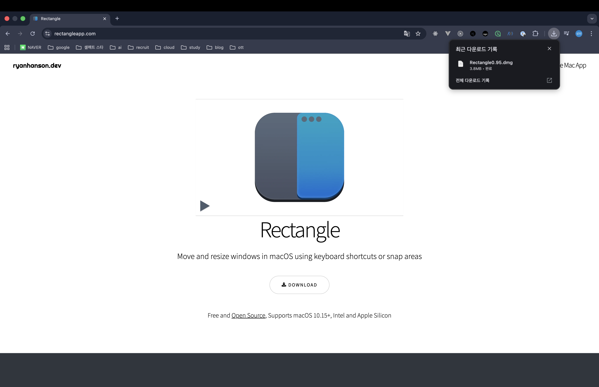

그러면 위와 같이 dmg 파일이 다운로드 받아질 것이다. 이것을 실행시켜보자.

> dmg 파일은 윈도우의 exe 파일과 같으며 무언가를 실행시키기 위한 응용 프로그램 형태라고 생각하면 좋을 것 같다.

그러면 아래와 같은 창이 뜰 것이다.

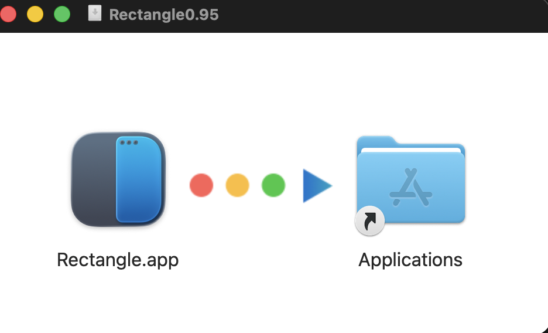

윈도우랑은 다르게 Rectangle라는 프로그램이 왼쪽에 위치해 있고 오른쪽에 Applications 폴더가 존재한다. 맥은 설치할 프로그램을 오른쪽으로 드래그 하면 끝이다.

> Applications은 우리가 설치한 모든 어플리케이션이 담겨져 있는 폴더이다.

그러고나서 Applications 폴더로 들어가거나 검색을 해보자. 트랙패드에 다섯 손가락을 오므리거나 검색으로 Rectangle을 검색해서 실행하면 다음과 같이 나올 것이다.

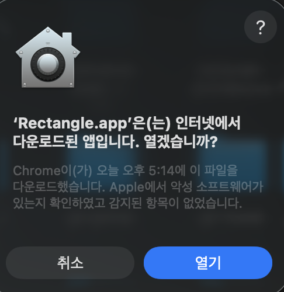

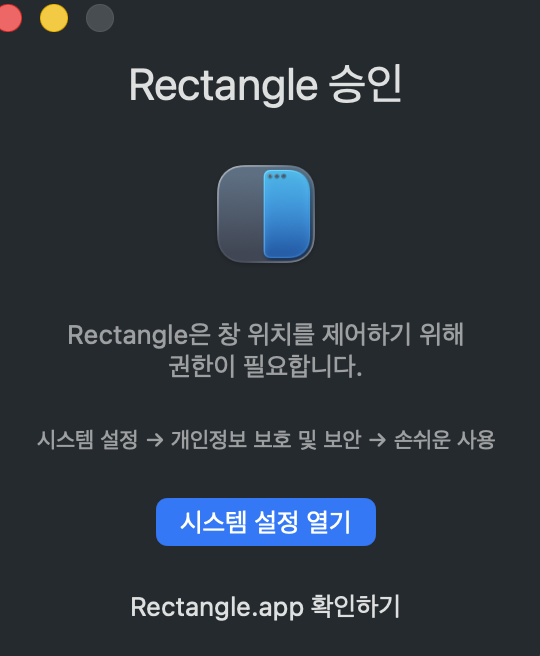

위의 화면처럼 나오면 여기서는 권한을 설정해줘야 한다. 왜냐하면 아이폰을 쓰시는 독자면 알겠지만 맥도 마찬가지로 애플리케이션마다 권한을 부여할 수 있게끔 되어 있다. 그래서 Rectangle도 시스템 설정 열기를
클릭하여 권한을 열어줘야 한다.

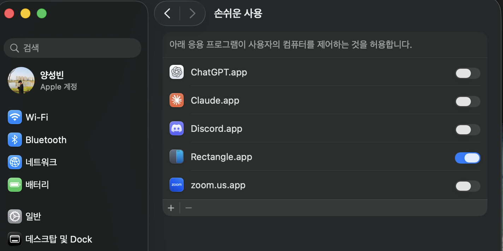

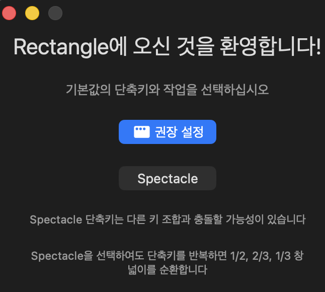

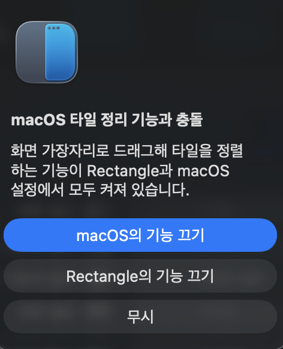

그리고 권장 설정을 클릭해주면 된다. 이후에 아래와 같이 팝업이 뜨는데 Mac 기능 끄기를 클릭해주면 Rectangle 기능만을 온전히 사용이 가능하다. 이렇게 설정까지 해주면 아래와 같이 나오는 것을 볼 수 있다.

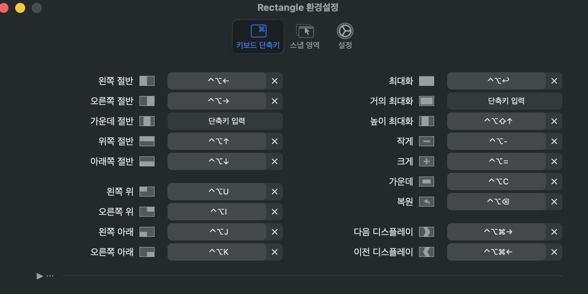

그리고 이 프로그램은 필자가 자주 쓰기에 로그인 시 실행을 위해 설정에 들어가서 로그인 시 실행 체크박스를 체크해주면 좋을 것이다.

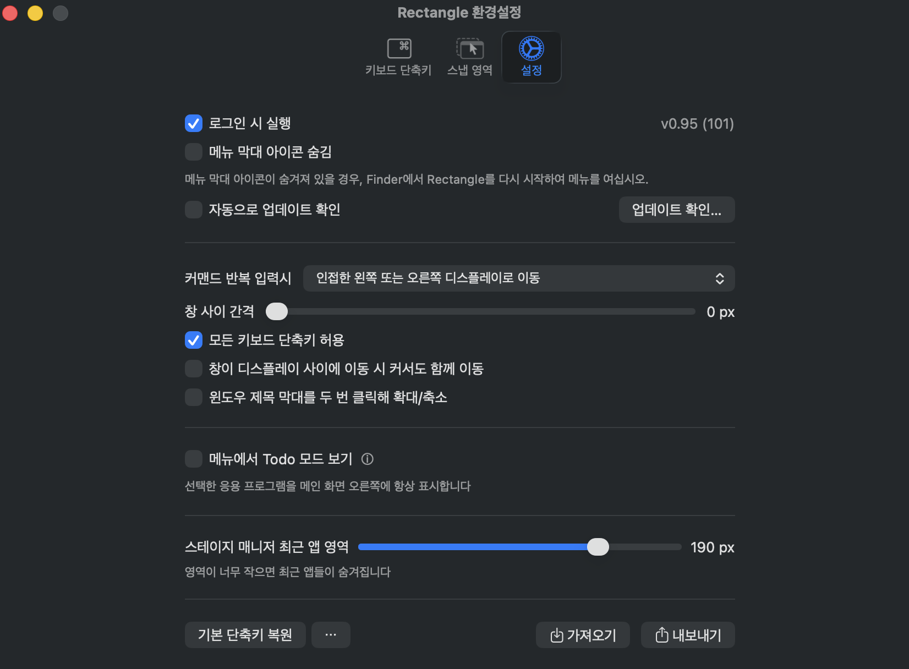

이게 바로 외부에서 어플리케이션을 설치하는 방법이다. 다음으로는 AppStore에서 다운받는 방법을 말씀드리도록 하겠다. AppStore 다운받는 방식은 매우 간단하다. 먼저 AppStore에 들어간다.


> 들어가서 로그인 되어 있으면 상관없지만 로그아웃이나 처음 여시는 분들은 로그인을 반드시 진행해주자.

여기서 원하는 어플을 검색하여 다운로드만 해주면 된다. 그러면 아까 Rectangle처럼 Applications에 나오는 것을 볼 수 있다.

다음으로 꿀팁을 알려드리도록 하겠다. 설정에 손쉬운 사용을 들어가서 포인터 제어를 클릭해보자.

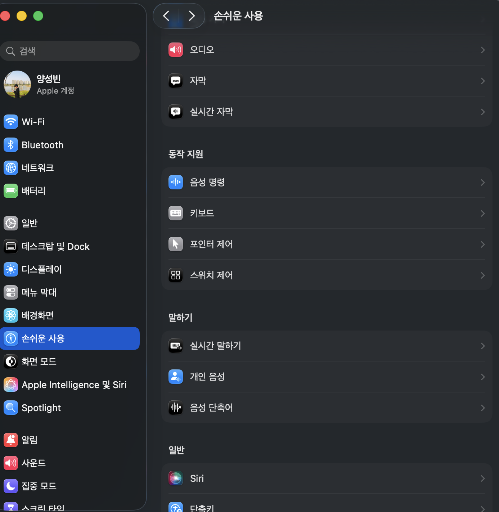

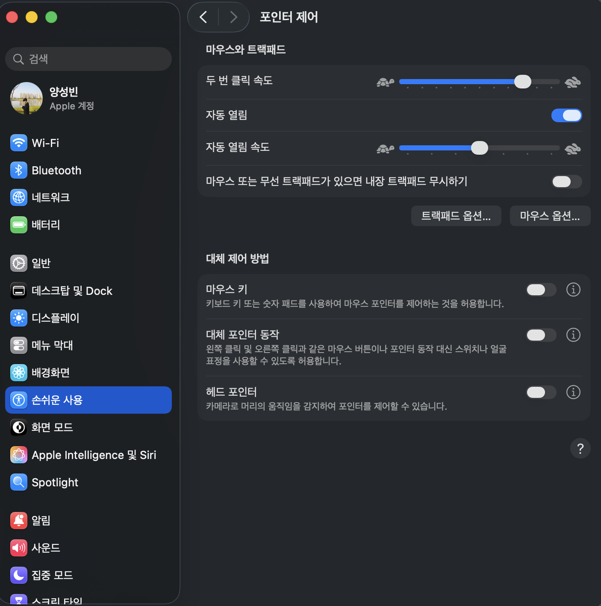

이후에 트랙패트 옵션을 클릭하여 아래 이미지처럼 진행해주자. 그러면 드래그할때 꼭 누르고 움직이지 않고 세 손가락으로 드래그가 가능해진다.

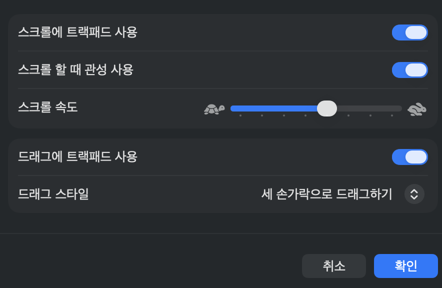

## 📜 macOS 추천 앱 리스트

### 1. Raycast

🔗 https://www.raycast.com

macOS의 Spotlight를 대체하는 생산성 런처입니다. 단축키 하나로 다양한 작업을 빠르게 실행할 수 있습니다.

- 앱 실행
- 계산 / 번역
- 클립보드 검색
- 시스템 제어
- 확장 기능 실행 (GitHub, Notion, Jira 등)

### 2. Rectangle

🔗 https://rectangleapp.com

창 정렬(Window Management) 앱입니다. 단축키를 통해 창을 빠르게 정렬할 수 있습니다.

- 좌우 반 분할
- 상하 분할 / 4분할
- 전체화면
- 다른 모니터로 이동

### 3. AppCleaner

🔗 https://freemacsoft.net/appcleaner/

앱을 삭제할 때 남는 잔여 파일까지 함께 제거해주는 완전 삭제(Uninstall) 앱입니다.

- Library 설정 파일
- 캐시 / 로그
- 플러그인

### 4. Maccy

🔗 https://maccy.app

클립보드 히스토리 관리 앱입니다. 복사 기록을 계속 저장해줍니다.

- 복사 기록 검색
- 텍스트 / 이미지 저장
- 단축키로 빠르게 붙여넣기

### 5. Clipy

🔗 https://clipy-app.com

클립보드 히스토리 관리 앱입니다. 스니펫(Snippet) 기능이 강력합니다.

- 복사 기록 저장 및 검색
- 자주 쓰는 텍스트를 스니펫으로 등록
- 메뉴바에서 바로 접근

### 6. Keka

🔗 https://www.keka.io

macOS에서 가장 많이 사용하는 압축 관리 앱입니다.

- zip, 7z, tar, rar, gzip 지원
- 암호화 압축 생성
- 분할 압축 지원
- Windows 압축 파일의 깨진 한글 파일명 문제 해결

### 7. Zen Browser

🔗 https://zen-browser.app

Firefox 기반의 오픈소스 생산성 브라우저입니다. Arc Browser의 후계자로 주목받고 있습니다.

- Workspace 기반 탭 관리
- 사이드바 UI
- Split View (탭 분할 보기)
- 개인정보 보호 중심 설계
- Firefox 확장 프로그램 호환

### 8. AltTab

🔗 https://alt-tab-macos.netlify.app

Windows처럼 창 단위로 앱을 전환할 수 있게 해주는 앱입니다.

- 창 미리보기 썸네일
- 빠른 창 전환
- 단축키 설정

### 9. Shottr

🔗 https://shottr.cc

macOS 최고의 스크린샷 캡처 도구 중 하나입니다.

- 스크롤 캡처
- 모자이크 / 픽셀 측정
- OCR (텍스트 추출)
- 빠른 캡처 편집

### 10. Hidden Bar

🔗 https://github.com/dwarvesf/hidden

상단 메뉴바 아이콘을 깔끔하게 정리해주는 앱입니다.

- 불필요한 아이콘 숨기기
- 필요한 아이콘만 표시

### 11. KeyClu

🔗 https://github.com/Anze/KeyCluCask/

애플리케이션의 단축키를 한 번에 확인할 수 있게 도와주는 프로그램입니다. 유료 버전은 [KeyCue](https://ergonis.com/en/keycue)를 추천합니다.

### 12. Dropover

🔗 https://dropoverapp.com

파일을 드래그하면 임시 선반(Shelf)을 생성해주는 앱입니다.

- 여러 파일 정리
- 다른 앱으로 한 번에 이동
- 복사 및 공유 편의

### 13. Amphetamine

🔗 https://apps.apple.com/app/amphetamine/id937984704

맥이 자동으로 절전 모드에 들어가는 것을 방지하는 앱입니다.

- 대용량 다운로드 중 화면 유지
- 장시간 렌더링 작업
- 발표 중 화면 꺼짐 방지

### 14. Notion Calendar

🔗 https://www.notion.so/product/calendar

Google Calendar 기반의 생산성 캘린더 앱입니다.

- 미팅 예약 자동화
- Notion 페이지와 연동
- 깔끔한 UI
- 메뉴바에서 오늘 일정 확인

### 15. Numi

🔗 https://numi.app

메모처럼 계산하는 계산기입니다. 환율, 단위 변환, 수식 계산을 자동으로 처리합니다.

- `$100 to KRW`
- `10cm + 20cm`
- `3kg in pounds`

### 16. IINA

🔗 https://iina.io

macOS에서 가장 인기 있는 동영상 플레이어입니다.

- mpv 기반으로 대부분 코덱 지원
- 가볍고 빠름
- macOS 디자인과 잘 어울리는 UI

### 17. Karabiner-Elements

🔗 https://karabiner-elements.pqrs.org

키보드 키 리매핑 도구입니다.

### 18. BetterTouchTool

🔗 https://folivora.ai

트랙패드/마우스 제스처 커스터마이징 앱입니다.

### 19. MonitorControl

🔗 https://github.com/MonitorControl/MonitorControl

외부 모니터의 밝기·볼륨을 조절할 수 있는 앱입니다.

### 20. Stats

🔗 https://github.com/exelban/stats

CPU·메모리·네트워크를 메뉴바에서 모니터링할 수 있는 앱입니다.

### 21. Proxyman

🔗 https://proxyman.io

HTTP 네트워크 디버깅 도구로, 개발자에게 필수적인 앱입니다.

### 22. TablePlus

🔗 https://tableplus.com

DB GUI 클라이언트입니다.

### 23. Obsidian

🔗 https://obsidian.md

마크다운 기반 지식 관리 앱입니다.

### 24. Hand Mirror

🔗 https://handmirror.app

메뉴바에서 카메라를 빠르게 확인할 수 있는 앱입니다.

### 25. Dato

🔗 https://sindresorhus.com/dato

메뉴바에서 캘린더와 세계시간을 표시해주는 앱입니다.

## 💻 Git, Xcode(커맨드 라인 툴)

이제는 command line tool이라는 것에 대해 학습해보도록 하겠다. 여기서 2가지 키워드가 나올텐데 첫번째는 Xcode이고, 두번째는 Git이다. Xcode와 Git에 대해서는 학습하지 않을 건데
Xcode와 Git을 사용하려면 Command Line Tool이라는 것이 기본적으로 설치가 되어야 한다.

한번 그러면 command line tool이 무엇인지 알아보자. 그러면 아마 아래의 Apple 공식 홈페이지가 뜨는 것을 알 수 있을 것이다.

> https://developer.apple.com/documentation/xcode/installing-the-command-line-tools/

해당 내용을 번역기를 켜서 읽어보면 다음과 같이 알 수 있다. command line tool이라는 패키지는 Xcode 외부에서 작업하거나 Unix 스타일 명령을 사용하여 앱을 빌드하는 경우 명령줄 도구 설치를
하는데 유용하다고 되어 있다. 이것을 왜 설치해야하냐면 해당 command line tool은 여러가지 툴과 같은 커맨드라인 툴과 함께 번들로 제공된다라고 적혀져 있다. 이것이 무슨 말이냐면 macOS에서 사용할
때는 모든 설치 파일을 다 개발을 위한 설치 파일을 내장해두지 않았다. 그 이유는 우리가 macOS를 샀는데 macOS로 개발을 할 지, 안 할지를 모르기 때문이다. 이러한 이유로 개발 툴까지 다 내장해놓은 상태라면
운영체제 용량이 늘어나기 때문에 굉장히 슬림한 형태로 일단 운영체제를 설치해두고 실제로 이 사람이 개발과 관련된 업무를 하려고 할 때는 이런 command line tools를 설치하라고 Apple이 만들어 둔
것이다. 그래서 iterm2를 설치를 했을 때도 아마 자동 설치를 진행해줬을 것이다. 단, 그때 설치를 스킵하신 분들은 아래의 명령어를 입력하면 된다.

```shell
xcode-select --install
```

위와 같이 입력하면 실행은 안되지만 command line tools를 설치하라는 팝업이 떴을 것이다. 그것을 설치해주면 된다. 이 소프트웨어를 설치하면 뭔가 여러가지를 설치를 진행해주는데 그 중에 우리는 몇가지만
살펴보도록 하겠다. 이 부분에서 우리가 배워야 하는 것 중에 하나가 `git`이다. `git`은 소스코드 버전관리 분산 시스템이라고 부르며 해당 command line tools를 설치하면 해당 `git`도 자동으로
설치해준다.

> 자동으로 git이 설치되는 것은 좋으나 당연히 최신 버전은 아니다. 이것은 [git 공식 사이트](https://git-scm.com/install/mac)에서 최신버전 설치 명령어를 입력하여 설치를 하여도
> 무방하나 사실 실무에서도 최신 버전을 굳이 다운 받을 이유는 없다. 왜냐하면 최신 버전을 받으면 보안도 빡쎄지고 ssh 인증등 조금 복잡한 절차도 존재하기 때문이다.

## 📝 뭐를.. 동의하라는데요? (Xcode license)

가끔씩 애플에서 개발 툴에 대한 라이센스가 변경되었거나, 최초에 라이센스에 동의하지 않은 경우 아래와 같은 메세지가 뜰 때가 존재한다.

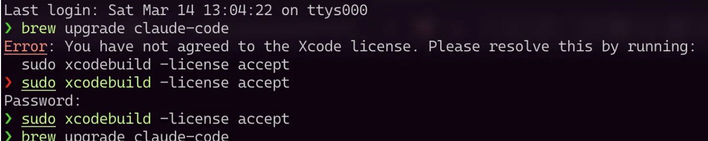

이 경우에는 터미널에 아래 메시지를 작성한 후, 비밀번호를 입력해서 진행해야한다.

```shell
sudo xcodebuild -license accept
```

## 📡 cURL 정의와 활용 (HTTP?)

이번에는 `curl`이라는 소프트웨어와 HTTP에 대해 학습해보도록 하자. HTTP는 우리가 웹 개발을 할 때 많이 사용하는 프로토콜이다 보니까 HTTP에 대해서는 깊게 다루지는 않을 것이다. `curl`을 통해서
HTTP를 어떻게 다루는지 예제를 보여주는 식으로 진행하도록 하겠다.

그 전에 우리가 `curl`이 무엇인지 알아봐야 할 것이다. 한번 살펴보도록 하자.

### cURL은 무엇일까?

1996년에 다니엘 스텐베리가 만든 다양한 통신 프로토콜을 지원하는 도구이다. 개발 도구를 설치하다 보면 `curl something.sh | bash` 이 형태를 자주 볼 것이다. 이 명령어의 의미는 curl의
도구로 특정 쉘 스크립트를 가져와서 bash에서 실행하라는 뜻이다. 이 형태가 굉장히 위험한 형태이다. 왜냐하면 저 shell script 안에 어떤 악성 코드가 있을 지 모르기 때문이다. 물론 우리가 설치하고 있는
대부분의 소프트웨어들은 공개되어 있거나 큰 규모의 회사에서 만든거기 때문에 상대적으로 안전하다고 볼 수 있지만 혹시라도 개인이 만든 쉘 스크립트나 소속이 모호한 곳에서 만든 것을 잘못 실행하게 되면 운영체제를 직접
동작하는 거기 때문에 조심해야 한다. 특히 관리자 권한으로 특정 쉘 스크립트를 실행했다고 한다면 크게 문제가 될 수 있다. 그래서 항상 어떤 쉘 스크립트가 실행되는지 눈 여겨서 봐야 한다. 한번 몇 가지 예제를 보고
직접 설치해보자.

해당 `curl`은 다양한 통신 프로토콜을 지원하는 도구로 command line tools를 설치하면 그 안에 자동으로 내장되어 있다. 그러면 한번 실행을 시켜봐야 할텐데 우리가 왜 이것을 배워야 하는지 알아보고
실습을 진행해보도록 하자.

```shell
curl https://example.com
```

위의 명령을 한번 실행해보자. 이렇게 하면 실제 해당 주소의 전체 html이 응답으로 나오는 것을 볼 수 있다.

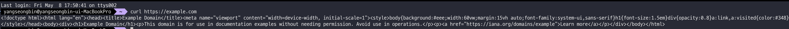

```shell
curl -v https://example.com
```

2번째는 위와 같이 옵션을 줄건데 어떤 옵션이냐면 v 옵션인데 해당 옵션을 적용하면 실제 흐름까지도 보여준다.

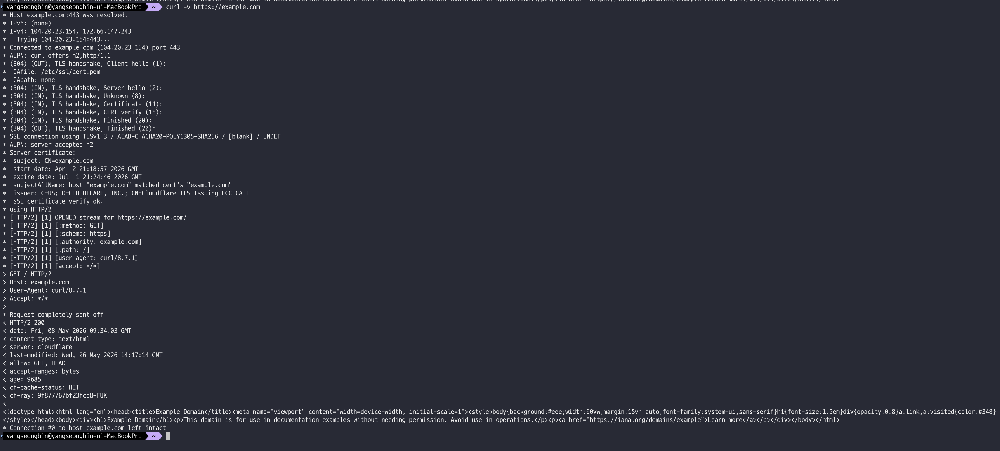

위의 실습은 html을 가져오는 것을 해봤지만 json 데이터도 가져올 수 있고 그 어떤 것도 가져올 수 있다. 이 이야기가 무엇이냐면 우리 컴퓨터에 내장되어 있는 `curl`이라는 도구로 어떤 것이든 통신할 수
있다는 말이다. 이 것은 굉장히 무서운 것인데 왜냐하면 우리가 어떤 도메인을 넣느냐에 따라 원격에서 가지고 오는 코드들을 바로 실행시킬 수 있기 때문이다.

한번 대표적인 예제를 한번 보자.

```shell
curl -fsSL https://claude.ai/install.sh | bash
```

위의 코드는 `claude code`를 설치하는 명령어인데 해석하면 해당 쉘 스크립트를 curl을 통해 받아와서 bash 환경에서 조용히 실행한다는 의미이다. 이게 얼마나 무서운지 옵션 부분들을 살펴보자.

- f: HTTP 에러가 발생하면 에러를 출력하지 않고 바로 실패 시켜라.
- s: 진행률을 표기하지 않아야 한다.
- S: 실패 시 에러는 보여주되, 평소에는 조용히 해라.
- L: redirect가 여러번 되었을 때 끝까지 따라가서 그것을 실행시켜라.

듣기만 해도 엄청 무서운 옵션이니 진짜 조심해서 해야 한다.

## 🍺 패키지 매니저와 Homebrew

이번에는 패키지 매니저에 대해 학습해보자. 그리고 우리가 macOS에서 가장 많이 쓰는 Homebrew라는 것을 알아보도록 하자.

### Package Manager

패키지 매니저는 소프트웨어를 설치, 업데이트, 삭제, 관리하는 도구이다. 보통 프로그램을 설치하려면 웹 사이트에 접속하여 설치 파일을 다운로드 하고 실행하고 업데이트 관리까지 해야 한다. 하지만 이런 과정을 패키지
매니저가 대행해준다고 보면 쉬울 것 같다. 즉, 패키지 매니저를 사용하면 해당 과정을 명령어 1줄로 대체가 가능해진다.

그러면 우리는 macOS에서 가장 많이 사용하는 패키지 매니저를 배워야 할텐데 그것이 바로 `Homebrew`이다.

> Homebrew는 Max Howell이라는 개발자가 창시한 macOS용 패키지 매니저이다.

Homebrew를 설치하는 과정은 매우 간단하다.

- 설치 스크립트 다운로드
- 시스템 환경 확인
    - macOS 버전
    - CPU 아키텍쳐
- Homebrew 디렉토리 생성
    - Intel: /usr/local
    - Apple Silicon: /opt/homebrew
- 설치 확인
    - `brew --version`

위의 과정을 바로 아래와 같이 하면 된다.

```shell
/bin/bash -c "$(curl -fsSL https://raw.githubusercontent.com/Homebrew/install/HEAD/install.sh)"
```

### Homebrew 추천 패키지

Homebrew를 설치했다면 추천 패키지도 아래와 같이 있으니 한번 살펴보자.

- git: `brew install git`
- wget: `brew install wget`
- htop: `brew install htop`
- node: `brew install node`
- python: `brew install python`
- ripgrep: `brew install ripgrep`
- tree: `brew install tree`
- neovim: `brew install neovim`
- tmux: `brew install tmux`
- jq: `brew install jq`

## 🤖 Claude Code & Codex 설치

이번에는 claude code와 codex를 설치해보도록 하겠다.

### Claude Code

```shell
brew install --cask claude-code
```

위와 같이 명령어 딸깍만 해주면 된다.

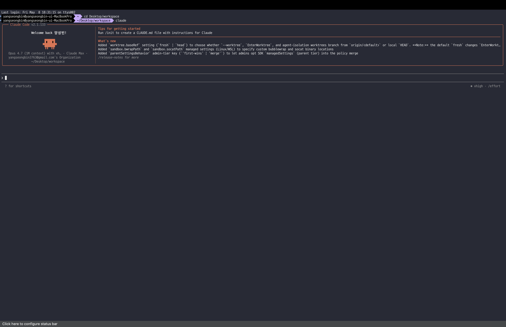

### Codex

```shell
brew install --cask codex
```

codex도 마찬가지다.
물론 [codex 공식 사이트](https://chatgpt.com/ko-KR/codex/?utm_source=google&utm_medium=paid_search&utm_campaign=GOOG_X_SEM_GBR_Codex_CDX_BAU_ACQ_PER_MIX_ALL_APAC_KR_EN_111325&c_id=23219700864&c_agid=204690243028&c_crid=807898942277&c_kwid=kwd-21294781&c_ims=&c_pms=1009872&c_nw=g&c_dvc=c&gad_source=1&gad_campaignid=23219700864&gbraid=0AAAAA-I0E5fCxZNv60Uvz5CFbUL8Jh20h&gclid=Cj0KCQjwk_bPBhDXARIsACiq8R3HyqkI1gp-HAnSqXq-0Mr92uIFiqAV0X3dwD_EDP3OtcjOaM_9bPQaAlgGEALw_wcB)
로 가서 데스크톱 앱을 직접 다운로드 받아도 무방하다.

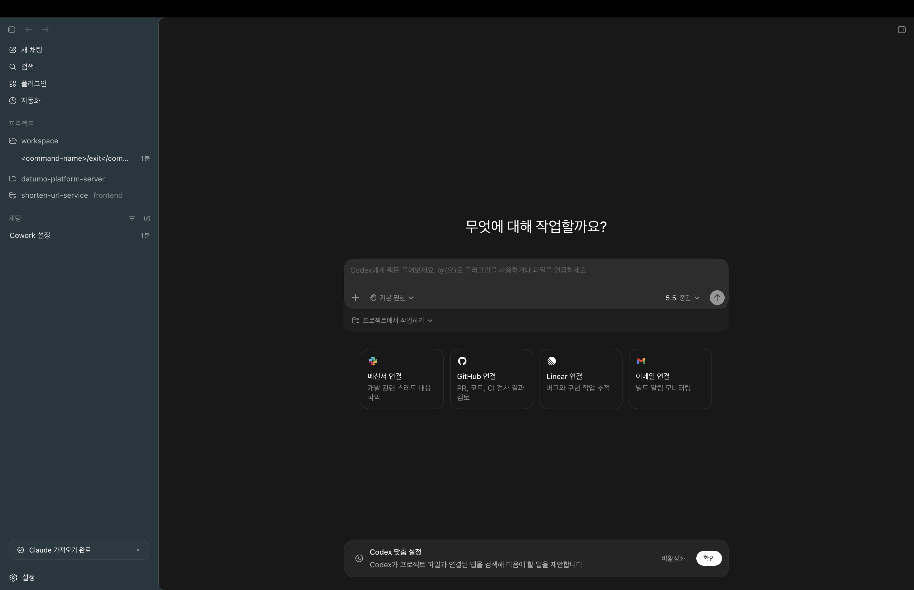

## 📂 유닉스 명령어 (파일/폴더)

이번에는 Unix 명령어를 알아보도록 하자. 우리가 사용하고 있는 macOS는 운영체제 종류 중에 UNIX라는 운영체제를 따르고 있다. 그래서 기본적으로 UNIX 명령어를 지원하고 있고 이것은 운영체제의 터미널을
통해서 직접 명령을 내리는 그런 형태라고 보면 좋을 것이다. 만약 독자들이 컴퓨터 공학을 전공하지 않았다면 운영체제의 수업을 듣지 못하였을 것이다. 운영체제는 생각보다 많은 업무를 하고 있다. 파일 및 하드웨어
관리를 하며 뭐 인터럽트라던지 프로세스를 관리한다던지 메모리를 할당한다거나 가상 메모리 체계를 관리한다던지가 있다. 그 중에 하나가 우리가 지금 하고 있는 키보드, 마우스 이런거를 하드웨어를 통해서 컨트롤을 하고
우리가 또 명령을 내리면 그거에 대한 프로세스를 순서를 매긴다던가 그거에 대한 CPU 자원을 할당하는 업무를 하고 있다. 그런 역할을 할 때 우리는 중간중간 운영체제가 가지고 있는 API를 호출을 해서 그거에 대한
기능을 수행하는 그 어떤 것이 존재하는데 그것이 바로 운영체제의 쉘이라는 터미널 안에서 명령어를 치면서 하는 그런 기능들인 것이다. 대표적으로 디렉토리를 만든다던가 파일을 복사하거나 파일을 수정하거나 파일을 보는
것들이 있을 것이다. 그러면 하나씩 한번 명령어를 살펴보자.

### pwd

`pwd`는 현재 작업 중인 디렉토리 경로를 살펴보는 명령어이다. 주요 옵션으로는 다음과 같다.

- P: 심볼릭 링크를 실제 경로로 해석
- L: 논리 경로 유지 (기본)

### ls

`ls`는 파일과 폴더 목록을 확인하는 명령어이다. 주요 옵션으로는 다음과 같다.

- l: 상세 정보 표시
- a: 숨김 파일 포함
- h: 읽기 쉬운 크기 단위
- t: 수정 시간 순 정렬
- R: 하위 디렉토리 재귀 출력

### cd

`cd`는 작업 디렉토리를 이동하는 명령어이다. 옵션은 별도로 없으며 자주 쓰는 패턴은 다음과 같다.

- `cd ~`: 홈 디렉토리 이동
- `cd ..`: 상위 디렉토리로 이동
- `cd -`: 직전 디렉토리 복귀
- `cd /`: 루트 디렉토리 이동

### mkdir

`mkdir`은 새 디렉토리를 생성하는 명령어이다. 주요 옵션은 다음과 같다.

- p: 중간 경로까지 함께 생성
- v: 생성 과정을 출력

### cp

`cp`는 파일 또는 폴더를 복사하는 명령어이다. 주요 옵션은 다음과 같다.

- r/R: 디렉토리 재귀 복사
- i: 덮어쓰기 전 확인
- v: 복사 과정 출력
- p: 권한/시간 정보 보존

### rm

`rm`은 파일과 폴더를 삭제하는 명령어이다.(주의 필요) 주요 옵션은 다음과 같다.

- i: 삭제 전 확인
- r/R: 디렉토리 재귀 삭제
- f: 확인 없이 강제 삭제
- v: 삭제 과정 출력

> 유닉스 같은 경우는 파일이나 폴더를 삭제하면 휴지통으로 가서 복원도 할 수 없이 완전 삭제되니 유의 바란다.

### touch

`touch`는 빈 파일을 생성하고 타임스탬프를 갱신하는 명령어이다. 주요 옵션은 다음과 같다.

- a: 접근 시간만 변경
- m: 수정 시간만 변경
- t [[CC]YY]MMDDhhmm[.ss]: 특정 시간대로 설정

### cat

`cat`은 파일에 대한 내용을 출력해주는 명령어이다. 주요 옵션은 다음과 같다.

- n 파일명 | head -n 라인수: 위에서 특정 라인까지만 출력된다.

### find

`find`는 파일/디렉토리를 검색 및 조건 실행을 할 수 있는 명령어이다. 주요 옵션은 다음과 같다.

- name / iname: 이름으로 검색 (대소문자 무시)
- type f|d: 파일 또는 디렉토리만 검색
- maxdepth N: 탐색 깊이 제한
- mtime -N: N일 이내에 수정된 파일
- exec ... \;: 찾은 결과에 명령 실행

### grep

`grep`은 문자열 검색을 할 수 있는 명령어로 에러 로그 찾기, 특정 키워드 / 설정 탐색에 사용된다. 주요 옵션으로는 다음과 같다.

- n: 줄 번호 표시
- i: 대소문자 무시
- r: 재귀 검색
- v: 해당 패턴 제외하고 검색
- E: 확장 정규식 사용

### mv

`mv`는 이동 및 이름 변경을 할 때 사용하는 명령어로 파일 리네임, 폴더 구조 변경, 로그 로테이션등에 사용된다. 주요 옵션은 다음과 같다.

- i: 덮어쓰기 전 확인
- v: 진행 상황 출력

## 🛠️ Node.js, NPM, 환경변수(path) 설정

이번에는 Node.js, NPM, 그리고 환경 변수에 대하여 알아보도록 하겠다.

### Node.js

Node.js는 윈도우, 리눅스, 유닉스, macOS등에서 실행될 수 있는 크로스 플랫폼, 오픈 소스 자바스크립트 런타임 환경을 말한다. Node.js는 V8 자바스크립트 엔진에서 실행되며 웹 브라우저 외부에서
자바스크립트 코드를 실행한다.

> 크로스 플랫폼이란 여러 운영체제를 지원해주는 환경이라고 이해하면 좋을 것 같다.

쉽게 풀어보면 Node.js는 공개되어 있는 자바스크립트 프로그래밍 언어가 활용될 수 있는 혹은 실행될 수 있는 그러한 환경인데 이런 환경이 여러 운영체제를 지원한다라고 보면 좋을 것 같다. 이러한 특성때문에 최근에
Node.js가 각광을 받고 있는 것이다. 다시 정리해보면 Node.js는 웹 브라우저 밖에서 자바스크립트 코드를 실행하게 하는 런타임 환경이다라고 하면 좋을 것 같다.

그러면 자바스크립트 언어는 무엇일까? 그것에 대해서도 알아보자.

### Javascript

자바스크립트 언어는 객체 기반의 스크립트 언어이다. 이 언어는 웹 브라우저 내에서 주로 사용되며 다른 응용 프로그램의 내장 객체에도 접근할 수 있는 기능을 가지고 있다. Javascript는 원래부터
Javascript는 아니였고 근본은 EcmaScript였다. 그래서 요새 사용하고 있는 Javascript를 ECMAScript라고 부른다.

ECMAScript는 자바스크립트, JScript, ActionScript를 포함한 스크립팅 언어 표준이다. 주로 서로 다른 웹 브라우저 간에 웹 페이지 상호 운용성을 보장하기 위한 자바스크립트 표준으로 알려져
있다. 이 표준은 Ecma International에서 ECMA-262 문서로 제정되었다.

ECMAScript는 월드 와이드 웹에서 클라이언트 측 스크립팅에 일반적으로 사용되며, Node.js, Deno, Bun과 같은 런타임 환경을 사용하는 서버 측 스크립팅 및 서비스에도 점점 더 많이 사용되고 있다.

### 왜 대부분 Agent는 Node.js 기반일까?

- CLI 생태계 최강자
- 비동기 처리에 최적화
- 프론트엔드 언어와 통일
- 크로스 플랫폼 배포 용이
- 개발자 친화적

