> 해당 블로그 글은 [인프런 강의](https://inf.run/xZG3C)를 바탕으로 쓰여진 글입니다.

## Multi 모듈 프로젝트 소개

이제 멀티 모듈 프로젝트에 대해 알아보자. 먼저 이론적인 부분부터 알아보고 Single module에서 멀티 모듈로 전환하는 방법을 간단하게 살펴보자.

### Gradle 멀티 모듈 프로젝트

- 멀티 모듈 프로젝트는 `단일 Gradle 빌드 단계에서 여러 관련 하위 프로젝트를 함께 구성`하고 빌드할 수 있게 해주는 프로젝트 구조이다.

- 더 작고 논리적으로 분리된 모듈이나 컴포넌트로 나눌 수 있는 대규모 프로젝트에 특히 유용하다.

- 각 모듈은 `서로 다른 기능`을 나타낼 수 있으며, `서로 의존할 수 있으며 root 프로젝트의 일부`로 빌드, 테스트 및 관리한다.

### 루트 프로젝트와 서브 프로젝트

- 루트 프로젝트
    - 전체 구성을 포함하고 모듈 간의 관계를 정의하는 메인 프로젝트이다.
    - 일반적으로 모든 하위 프로젝트를 나열하는 settings.gradle 파일(또는 Kotlin DSL의 경우 settings.gradle.kts)을 포함한다.
- 서브 프로젝트
    - 루트 프로젝트 내에 정의된 개별 모듈 또는 프로젝트
    - 각 하위 프로젝트는 자체 build.gradle 파일을 가질 수 있으며 독립적으로 또는 전체 빌드 프로세스의 일부로 빌드될 수 있다.

### 멀티 모듈 프로젝트의 특징

- 모듈성: 대규모 프로젝트를 특정 측면이나 기능에 초점을 맞춘 더 작고 관리하기 쉬운 모듈로 나눌 수 있다.

- 의존성 관리: 하위 프로젝트 간의 의존성을 지정함으로써 Gradle은 자동으로 빌드 순서를 관리하고 필요할 때 의존성이 컴파일되고 사용 가능하도록 보장한다.

- 재사용성: 모듈은 다양한 프로젝트에서 재사용될 수 있으며, 이는 마이크로서비스나 공유 라이브러리 개발에 특히 유용하다. ex. api 서버의 공통 인증모듈

- 병렬성: Gradle은 독립적인 모듈을 병렬로 빌드할 수 있어 빌드 프로세스의 속도를 잠재적으로 향상시킬 수 있다.

### 실습

그러면 `gradle init`을 통하여 멀티 모듈 프로젝트를 만들기 전에 싱글 모듈 프로젝트를 만들고 싱글 모듈을 멀티 모듈로 바꾸는 방법부터 알아보자. 왜냐하면 실무에서 보통 싱글 모듈일 경우가 있을 것이다. 그리고 해당 프로젝트를 멀티모듈로 전환하는 작업을 하는 경우가 대부분이다. 그러기에 해당 방법을 알아둬야 실무에서 써먹을 수 있을 것이다.

그러면 application으로 싱글 모듈 프로젝트를 만들자. 해당 방법은 이전에 설명하였으니 생략한다.

싱글 모듈 프로젝트를 만들었으니 이제 app 디렉토리안에 `build.gradle`이 존재하고 루트에 `settings.gradle`이 존재하는 것을 확인할 수 있을 것이다. 이제 `build.gradle`이 속한 app 디렉토리를 복사해서 원하는 이름으로 디렉토리를 하나 만든다. 그 다음에 아래와 같이 `settings.gradle`을 수정한다.

``` groovy
/*
 * This file was generated by the Gradle 'init' task.
 *
 * The settings file is used to specify which projects to include in your build.
 * For more detailed information on multi-project builds, please refer to https://docs.gradle.org/8.13/userguide/multi_project_builds.html in the Gradle documentation.
 */

plugins {
    // Apply the foojay-resolver plugin to allow automatic download of JDKs
    id 'org.gradle.toolchains.foojay-resolver-convention' version '0.9.0'
}

rootProject.name = 'multiSimpleProject'
include('data') // app 디렉토리의 이름을 변경
include('service')
```

그 다음에 `gradle build`를 이용하여 빌드를 하자. 그러면 아래와 같이 성공적으로 내가 만든 디렉토리와 기존 디렉토리가 build가 되었음을 확인할 수 있을 것이다.

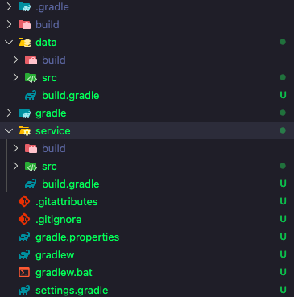

## Project script blocks에 대해 알아보자

우리는 지금까지 멀티모듈 프로젝트를 만드는 작업 및 빌드까지의 과정을 하였다. 그런데 여기서 궁금한 사항이 있을 것이다. 각 서브모듈 하나만 빌드를 하고 싶을 경우도 있을 것이다. 그럴때 어떻게 할까? 아래와 같이 명령어를 작성하면 해당 모듈만 명령을 내릴 수 있다.

``` bash
gradle :서브모듈명:태스크
```

그러면 해당 모듈만 태스크가 내려지는 것을 알 수 있다. 다음으로 script blocks에 대해 알아보자. 이게 과연 뭘까? 우리는 이미 알고 있다. 바로 `repositories`나 `dependencies`같은 것이다. 그러면 실습을 통해 좀 더 자세히 살펴보자.

우리는 이전에 만든 프로젝트에서 루트 프로젝트에 `build.gradle`을 만들어서 아래와 같이 작성해보자.

``` groovy
tasks.register('getProjectName') {
    def projectName = project.name
    doLast {
        println projectName
    }
}
```

그리고 루트 경로에 `gradle build`를 하면 잘 나오는 것을 확인할 수 있을 것이다. 그러면 각 만든 서브모듈에도 해당 task를 만들고 싶어한다. 그러면 어떻게 해야할까? 각 서브모듈의 `build.gradle`에 들어가서 위의 코드를 복붙을 해야할까? 그러면 너무 힘들고 멀티모듈을 쓰는 의미가 없을 것이다. 여기서 gradle은 script block으로 `allprojects`라는 것을 제공해준다. 아래와 같이 작성해보자.

``` groovy
allprojects {
    tasks.register('getProjectName') {
        def projectName = project.name
        doLast {
            println projectName
        }
    }
}
```

위와 같이 작성하고 `gradle gPN`을 하면 루트 프로젝트뿐만 아니라 그 안의 서브모듈 프로젝트에도 다 적용이 되는 것을 볼 수 있다. 다음으로 또 하나의 script block인 `subprojects`를 알아보자. 해당 script block을 쓰면 그 안에 있는 task를 **루트 프로젝트를 제외한** 서브모듈 프로젝트만 적용하여 실행시킬 수 있다.

``` groovy
subprojects {
    tasks.register('getProjectName') {
        def projectName = project.name
        doLast {
            println projectName
        }
    }
}
```

다음으로 또 하나 궁금한 사항이 있다. 만약 서브모듈의 공통적인 부분들을 빼고 싶을 경우도 있을 것이다. 이럴 경우도 `subprojects`를 이용할 수 있다. 공통적인 부분들을 해당 script block에 넣는다. 그리고 나머지 서브 모듈의 build.gradle에서 공통적인 부분들을 빼보자. 다음으로 `gradle build`를 통하여 빌드를 해보면 정상적으로 빌드 되는 것을 볼 수 있다.

``` groovy
subprojects {
    tasks.register('getProjectName') {
        def projectName = project.name
        doLast {
            println projectName
        }
    }

    apply plugin: 'application'

    repositories {
        // Use Maven Central for resolving dependencies.
        mavenCentral()
    }

    dependencies {
        // Use JUnit Jupiter for testing.
        testImplementation libs.junit.jupiter

        testRuntimeOnly 'org.junit.platform:junit-platform-launcher'

        // This dependency is used by the application.
        implementation libs.guava
    }

// Apply a specific Java toolchain to ease working on different environments.
    java {
        toolchain {
            languageVersion = JavaLanguageVersion.of(21)
        }
    }

    application {
        // Define the main class for the application.
        mainClass = 'org.example.App'
    }

    tasks.named('test') {
        // Use JUnit Platform for unit tests.
        useJUnitPlatform()
    }
}
```

또한 이렇게 공통적인 부분을 뺐지만 특정 모듈에서는 해당 공통적인 부분의 일부를 오버라이딩 하고 싶을 경우도 있을 것이다. 그럴때는 그러고 싶은 부분만 그 모듈의 build.gradle에 넣어두면 해당 부분이 오버라이딩 된다.

## 모듈 간의 Dependency에 대해 알아보자

멀티 모듈을 이용하면 정말 다양한 것을 할 수 있다. 그 중에서도 하나의 서브 모듈의 의존성에 다른 서브 모듈의 의존성을 가져오게 할 수 있다. 방법은 2가지가 있는데 한번 알아보자.

### 루트 프로젝트에서 적용

아래와 같이 `build.gradle`에 적용하고 나서 `gradle :서브모듈명:build`를 하게 해주면 된다.

``` groovy
project(":service") {
    dependencies {
        implementation project(":data")
    }
}
```

그러면 해당 모듈의 build/distribution에 모듈명.zip을 열어서 확인해보면 아래와 같이 다른 서브모듈의 의존성을 가져온 것을 볼 수 있다.

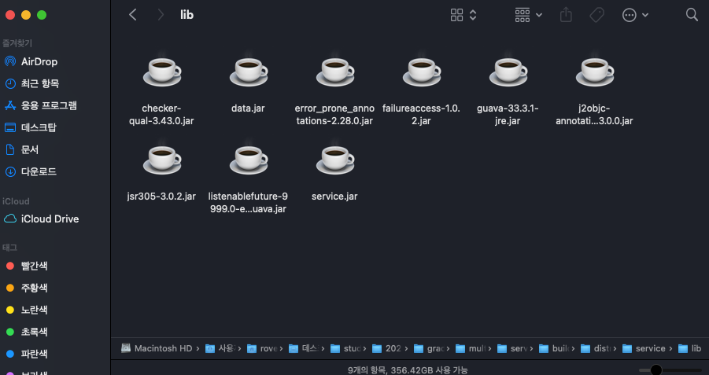

필자는 service라는 서브모듈에 data의 서브 모듈 의존성을 불러왔다. 하지만 매번 이렇게 확인하기는 번거로울 것이다. 아래와 같은 명령어를 이용하면 쉽게 의존성 리스트를 확인할 수 있다.

``` bash
gradle :service:dependencies
```

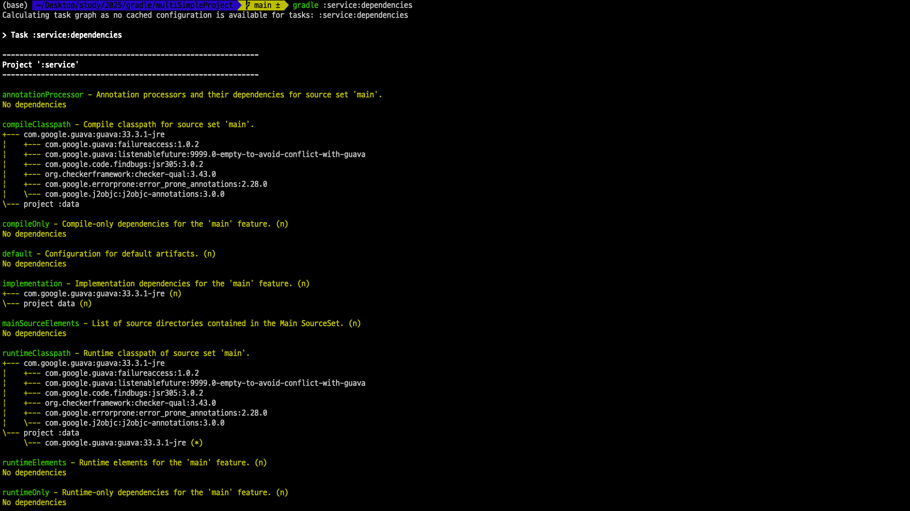

### 의존성을 가져와야 하는 곳의 모듈에서 적용

의존성을 가져와야 하는 곳의 모듈의 build.gradle에 해당 코드를 적어줘도 동작을 할 수 있다.

``` groovy
dependencies {
    implementation project(":data")
}
```

## Java Applications with libraries(ft. Convention Plugins)에 대해 알아보자

그러면 이제 컨벤션 플러그인에 대해 살펴보자. 일단 새로운 프로젝트를 만들어서 확인할건데 기존처럼 `gradle init`을 이용하여 프로젝트를 만드는데 타입을 멀티 모듈 타입으로 설정하고 만들어보자.

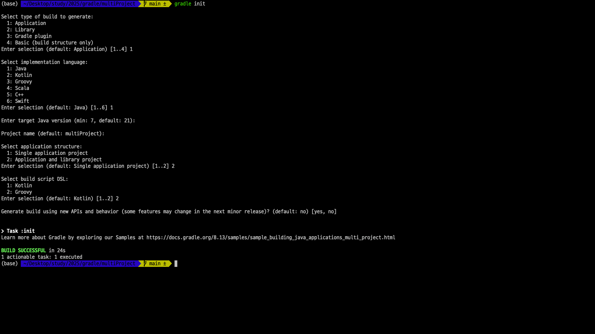

그러면 한번에 멀티모듈 프로젝트가 완성이 된다. 이제 구조를 확인해보자. 보면 알겠지만 여러 모듈들이 존재하고 각 모듈별로 여러 라이브러리 샘플들이 존재한다.

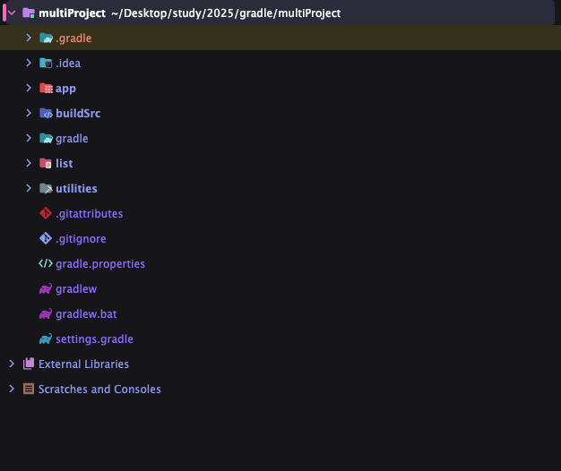

구조를 보면 `app`, `buildSrc`, `list`, `utilities` 서브모듈들이 만들어진 것을 볼 수 있다. 그러면 빌드할 때 어떻게 흘러가는지 `settings.gradle`을 통해 확인해보자.

``` groovy
/*
 * This file was generated by the Gradle 'init' task.
 *
 * The settings file is used to specify which projects to include in your build.
 * For more detailed information on multi-project builds, please refer to https://docs.gradle.org/8.13/userguide/multi_project_builds.html in the Gradle documentation.
 */

plugins {
    // Apply the foojay-resolver plugin to allow automatic download of JDKs
    id 'org.gradle.toolchains.foojay-resolver-convention' version '0.9.0'
}

rootProject.name = 'multiProject'
include('app', 'list', 'utilities')
```

settings.gradle을 살펴보면 app과 list와 utilities가 서브모듈로 import가 되어 있다는 것을 알 수 있다. 그러면 궁금한게 buildSrc 모듈이다. 이 녀석은 무엇일까? 일단 buildSrc 모듈의 구조는 아래와 같이 되어 있다.

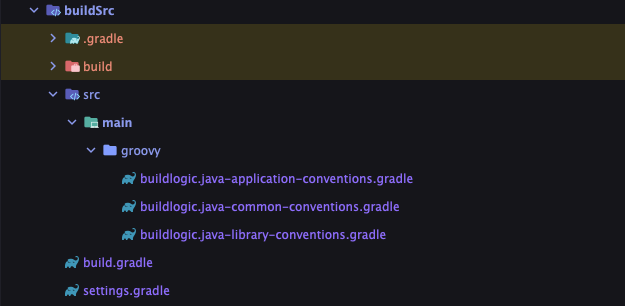

뭔가 복잡해 보인다. 그러면 해당 파일들이 뭔지 살펴보기 전에 이론적인 부분부터 학습하고 살펴보자.

### 컨벤션 플러그인

- Gradle에서 컨벤션 플러그인은 여러 프로젝트나 하위 프로젝트에 걸쳐 빌드 구성을 캡슐화하고 표준화하는 데 사용되는 경량 플러그인이다.

- 이러한 플러그인을 사용하면 공통 설정, 의존성 및 태스크를 한 곳에서 정의하고 빌드의 다양한 부분에 일관되게 적용할 수 있다.

### 왜 컨벤션 플러그인을 사용할까?

- DRY Principle: 단일 플러그인에 중앙 집중화하여 하위 프로젝트 전반에 걸친 반복적인 구성을 제거하는 데 도움이 된다.

- Consistency: 컨벤션 플러그인을 사용함으로써 의존성 버전, 코드 스타일 설정 및 테스트 프레임워크와 같은 동일한 표준과 구성을 모든 하위 프로젝트가 준수하도록 보장할 수 있다.

- Maintainability: 구성을 업데이트해야 하는 경우 컨벤션 플러그인에서 수행할 수 있으며, 모든 하위 프로젝트는 자동으로 변경 사항을 상속받는다.

- Modularity: 빌드 로직을 쉽게 관리하고 유지할 수 있는 재사용 가능한 모듈식 컴포넌트로 분리하는 데 도움이 된다.

### 어떻게 컨벤션 플러그인이 동작할까?

- 컨벤션 플러그인은 일반적으로 buildSrc 디렉토리에 정의되거나 독립형 Gradle 플러그인 프로젝트의 일부로 정의된다.

- Gradle이 buildSrc 디렉토리를 감지하면 추가 구성 없이 그 안에 있는 모든 플러그인이나 클래스를 자동으로 컴파일하여 메인 빌드 스크립트에서 사용할 수 있게 한다.

그러면 한번 각각 파일들을 살펴보자. 먼저 buildSrc의 build.gradle을 살펴보면 아래와 같이 작성 되어 있는 것을 볼 수 있을 것이다.

``` groovy
/*
 * This file was generated by the Gradle 'init' task.
 */

plugins {
    // Support convention plugins written in Groovy. Convention plugins are build scripts in 'src/main' that automatically become available as plugins in the main build.
    id 'groovy-gradle-plugin' // 이것을 사용해서 컨벤션 플러그인을 만들게끔 즉 명령어를 사용할 수 있게끔 한다.
}

repositories {
    // Use the plugin portal to apply community plugins in convention plugins.
    gradlePluginPortal() // 다른 사람들이 만든 플러그인들을 import할 수 있도록 도와준다.
}
```

플러그인으로 `groovy-gradle-plugin`을 사용함으로 컨벤션 플러그인을 만들 수 있게 해주는 역할을 한다. 또한 다양한 플러그인을 사용할 수 있게 `gradlePluginPortal()`에서 가져오게 한다.

다음으로 `buildlogic.java-common-conventions.gradle`을 살펴보면 아래와 같다.

``` groovy
/*
 * This file was generated by the Gradle 'init' task.
 */

plugins {
    // Apply the java Plugin to add support for Java.
    id 'java'
}

repositories {
    // Use Maven Central for resolving dependencies.
    mavenCentral()
}

dependencies {
    constraints {
        // Define dependency versions as constraints
        implementation 'org.apache.commons:commons-text:1.12.0'
    }

    // Use JUnit Jupiter for testing.
    testImplementation 'org.junit.jupiter:junit-jupiter:5.11.3'

    testRuntimeOnly 'org.junit.platform:junit-platform-launcher'
}

// Apply a specific Java toolchain to ease working on different environments.
java {
    toolchain {
        languageVersion = JavaLanguageVersion.of(21)
    }
}

tasks.named('test') {
    // Use JUnit Platform for unit tests.
    useJUnitPlatform()
}
```

각종 라이브러리와 자바 플러그인을 사용하게끔 구성이 되어있다. 그리고 해당 파일은 다른 컨벤션 플러그인과 모듈들에서 사용이 가능하다. 즉, 전반적인 공통적인 설정 값들을 넣어두는 곳이라 보면 될 것 같다.

다음으로 `buildlogic.java-application-conventions.gradle`을 살펴보자.

``` groovy
/*
 * This file was generated by the Gradle 'init' task.
 */

plugins {
    // Apply the common convention plugin for shared build configuration between library and application projects.
    id 'buildlogic.java-common-conventions'

    // Apply the application plugin to add support for building a CLI application in Java.
    id 'application'
}
```

이 파일은 공통 컨벤션 플러그인을 사용함과 동시에 application 플러그인이 추가된 것을 볼 수 있다.

다음으로 `buildlogic.java-library-conventions.gradle`을 살펴보자.

``` groovy
/*
 * This file was generated by the Gradle 'init' task.
 */

plugins {
    // Apply the common convention plugin for shared build configuration between library and application projects.
    id 'buildlogic.java-common-conventions'

    // Apply the java-library plugin for API and implementation separation.
    id 'java-library'
}
```

해당 파일은 공통 컨벤션 플러그인과 자바 라이브러리를 사용하는 것을 볼 수 있다. 이렇게 컨벤션 플러그인들을 만들고 각 모듈들에서 사용이 가능하다. 각 모듈의 build.gradle을 보면 아래 예시코드처럼 되어 있는 것을 볼 수 있다.

``` groovy
/*
 * This file was generated by the Gradle 'init' task.
 */

plugins {
    id 'buildlogic.java-library-conventions'
}

```

## Application과 Library의 차이점에 대해 알아보자(ft. Producer vs. Consumer)

Application과 Library를 개발할 때 차이점이 뭔지 알기 전에 Producer와 Consumer에 대해 알아야 한다. 그럼 한번 둘이 뭐하는 놈이고 차이가 무엇인지 살펴보자.

### Producer vs Consumer

- 생산자(Producers)는 다른 사람이 사용할 아티팩트를 생성하는 반면, 소비자(consumers)는 이러한 아티팩트를 사용한다.

- Gradle에서 의존성 관리는 기존 빌드 시스템과 달리 생산자와 소비자를 구분한다. 기존 빌드 시스템은 사실 비교하지 않고 둘이 동일시 하는 경우가 있다.

- 소비자 유형
    - 다른 프로젝트에 의존하는 프로젝트는 소비자이다.
    - 아티팩트에 의존하는 태스크도 소비자이다.
- Producer Variants
    - 생산자는 다양한 소비자를 위해 서로 다른 아티팩트를 생성할 수 있다(예: Java용과 Android용 Guava 버전)
    - 소비자는 적절한 버전을 선택하고, Gradle은 변형 모델을 사용하여 의존성 일관성을 보장한다.

### API vs Implementation

멀티모듈 프로젝트를 만들었으면 각 프로젝트에 build.gradle을 살펴보면 아래와 같이 뭔가 차이점이 보인다.

``` groovy
/*
 * This file was generated by the Gradle 'init' task.
 * app module
 */

plugins {
    id 'buildlogic.java-application-conventions'
}

dependencies {
    implementation 'org.apache.commons:commons-text'
    implementation project(':utilities')
}

application {
    // Define the main class for the application.
    mainClass = 'org.example.app.App'
}
```

``` groovy
/*
 * This file was generated by the Gradle 'init' task.
 * utilities module
 */

plugins {
    id 'buildlogic.java-library-conventions'
}

dependencies {
    api project(':list')
}
```

어느 모듈은 `implementation` 키워드를 사용하고 어느 모듈은 `api` 키워드를 사용했다. 그럼 둘의 차이는 무엇일까?

- API Exposure: api는 의존성을 다른 모듈에 노출시키는 반면, implementation은 이를 비공개로 유지한다. 쉽게 생각해서 api는 접근제어자가 public이고 implementation은 접근제어자가 private인걸로 알면 이해가 쉬울 것이다.

- Build Performance: implementation은 내부 사용으로 재컴파일을 제한하기 때문에 더 빠르다.

- Compatibility: api는 공개 API를 정의하는 의존성에 더 적합하고, implementation은 내부 의존성에 더 적합합니다. 즉, open API를 만든다면 api로 노출시키는게 좋고 어플레키이션을 만드는거라면 implementation을 하는게 좋다.

- 의존성을 추가하면 소비자에게 전이적 의존성이 되어 잠재적으로 버전 충돌을 일으킬 수 있다. 즉, Producer가 api를 만들기 위해 다른 라이브러리를 가져다 쓸건데 해당 api를 가져다 쓰는 Consumer가 Producer와 같은 라이브러리를 쓰다가 버전 충돌이 발생할 우려가 있기 때문이다.

- 애플리케이션 프로젝트는 소비 체인의 끝에 있어 exclusions이 더 안전하다. implementation은 exclude라는 옵션을 쓸 수 있는데 해당 키워드를 통해 해당 라이브러리중 제외할 부분을 지정할 수 있다. 

- 라이브러리의 경우, exclusions는 소비자 기능에 영향을 미칠 수 있다. 왜냐하면 함부로 제외를 했다가 사용자가 쓸때는 exclude가 포함되서 사용하기 때문에 라이브러리가 동작을 안 할 수 있다.

## Java Applications with libraries 구조에 대해 알아보자


이제 전체적인 구조에 모듈들이 뭐하는 놈들인지 살펴보자.

- app: 어플리케이션 -> 자바 어플리케이션 컨벤션 플러그인 이용

- buildSrc: 컨벤션 플러그인 집합소

- list: 라이브러리. 약간 MSA의 core부분의 역할인것 같다.

- utilities: 라이브러리. -> list를 사용.

그러면 세부내용은 직접 파일들을 열어보면 이해가 될 것이고 커맨드 창에서 api와 implementation이 어떤건지 살펴보자.

``` bash
gradle :utilities:dependencies
```

이렇게 입력하면 이전에 했던것처럼 쓰고 있는 라이브러리들을 다 볼 수 있다. 하지만 어떤 라이브러리가 api로 노출한거고 어떤 라이브러리가 implementation으로 하는 것인지 알 수가 없다. 그럴 때 아래와 같이 옵션을 줄 수 있다. 아래와 같이 옵션을 주면 api로 노출한 라이브러리만 볼 수 있다.

``` bash
gradle :utilities:dependencies --configuration api
```

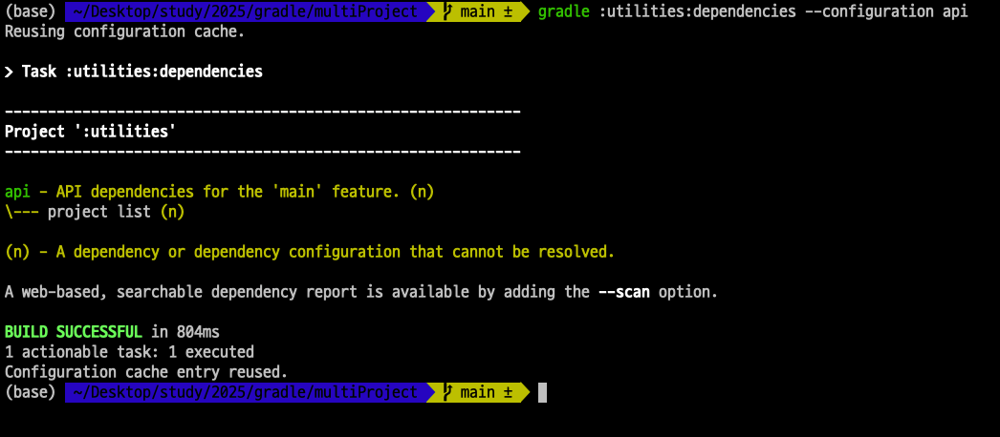

아래와 같이 주면 implementation 한것들만 볼 수 있다. 현재 utilities 모듈에는 implementation이 없기 때문에 없다고 콘솔에 뜨는 것이다.

``` bash
gradle :utilities:dependencies --configuration implementation
```

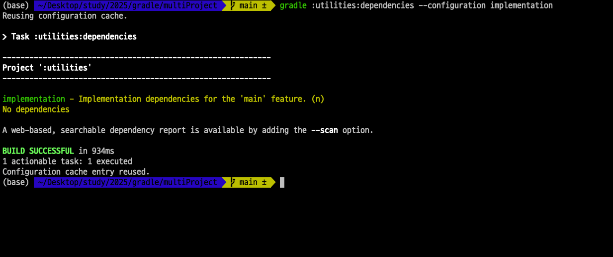

## Unit Test와 Test Coverage 설정해 보기

기본적으로 테스트를 실행하면 자동으로 리포트를 만들어 준다.

``` bash
gradle test
```

위와 같이 명령을 하고 모듈들의 build 디렉토리 안에 reports 디렉토리가 생성된 것을 볼 수 있다. 그 안에 tests 하위 test 하위 index.html을 열어보면 리포트 문서를 볼 수 있다.


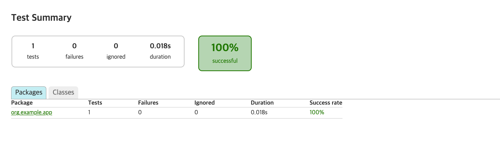

또한 테스트 커버리지를 측정할 수 있는데 바로 `jacoco`를 활용할 수 있다. build.gradle에 plugins에 jacoco를 추가하고 아래 코드들을 추가한다.

``` groovy
test {
    finalizedBy jacocoTestReport // report is always generated after tests run
}

jacocoTestReport {
    dependsOn test // tests are required to run before generating the report
}
```

그리고 `gradle tasks --all`을 통해서 보면 jacoco관련 task가 생성이 된 것을 볼 수 있다.

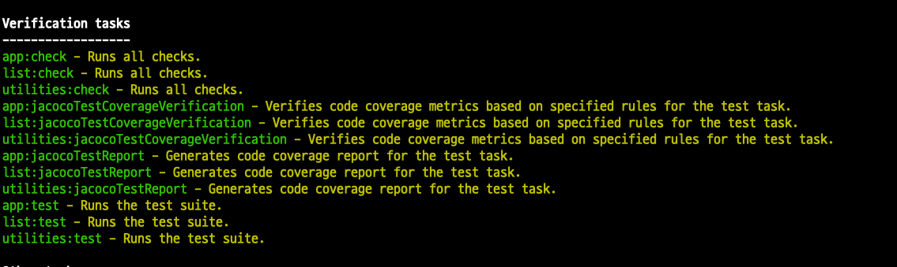

그러면 jacoco로 테스트 커버리지를 측정하자.

``` bash
gradle jacocoTestReport
```

위와 같이 실행하면 아래와 같이 jacoco 디렉토리가 생성되고 해당 html문서를 열어보면 커버리지가 몇% 달성되었는지 확인이 가능하다.

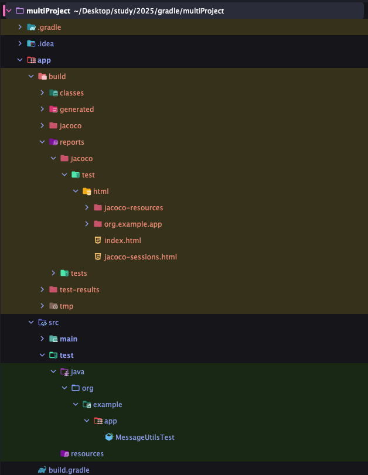

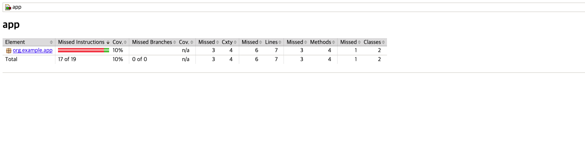

자세한 내용은 [gradle의 jacoco부분 공식문서](https://docs.gradle.org/current/userguide/jacoco_plugin.html)를 확인하자.

## 추가사항

그런데 이제까지 학습을 하면서 헷갈리는 부분들이 있다.

``` groovy
tasks.named('태스크명') {
    // something
}

태스크명 {
    // something
}

task 태스크명 {
    // something
}

tasks.register('태스크명') {
    // something
}
```

이런 유형들을 봤을 것이다. 다 비슷비슷한 역할을 하는 것 같은데 어떤걸 써야할까? 하나씩 살펴보자.

- tasks.named('태스크명'): 기존에 존재하는 즉, gradle에서 기본으로 제공해주는 태스크명을 쓸 때 사용한다.

- 태스크명: 기존에 존재하는 즉, gradle에서 기본으로 제공해주는 태스크명을 쓸 때 사용한다. 다만 이 방식은 위의 tasks.named와 동일한 효과나 이렇게 쓰는 것을 추천하지는 않는다고 그런다.

- task 태스크명: 이것은 gradle에서 이렇게 쓰지 말라고 SonarQube만 사용한다면 경고를 띄워준다.

- tasks.register: 위에 task 태스크명을 대신에 사용한다. 기존에 존재하지 않는 즉, 우리가 커스텀하게 만들 태스크를 만들 때 사용한다.

> 잘못된 지식이 있을 경우 댓글로 남겨주시면 빠르게 반영하겠습니다!
