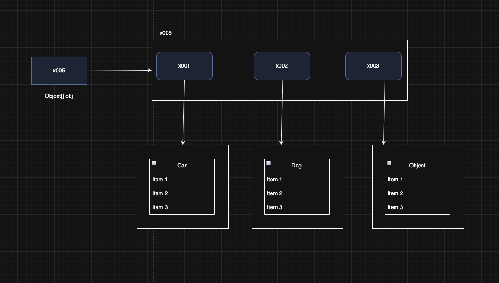
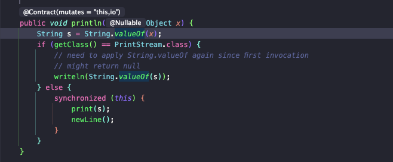
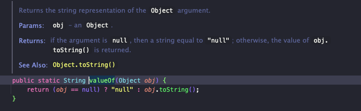
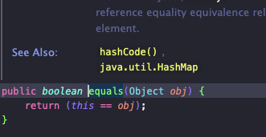

> 해당 블로그 글은 [영한님의 인프런 강의](https://inf.run/FiFGQ)를 바탕으로 쓰여진 글입니다.

## 프로젝트 환경 구성

프로젝트 환경 구성은 필자가 쓴 [자바 입문편 내용](https://sungbin.kr/Hello-World/#%EA%B0%9C%EB%B0%9C-%ED%99%98%EA%B2%BD-%EC%84%A4%EC%A0%95)을 참고 바란다.

## java.lang 패키지 소개

자바가 기본으로 제공하는 라이브러리(클래스 모음) 중에 가장 기본이 되는 것이 바로 `java.lang` 패키지이다. 대표적인 클래스들로는 다음과 같다.

- `Object` : 모든 자바 객체의 부모 클래스
- `String` : 문자열
- `Integer`,`Long`,`Double` : 래퍼 타입, 기본형 데이터 타입을 객체로 만든 것
- `Class` : 클래스 메타 정보
- `System` : 시스템과 관련된 기본 기능들을 제공

그러면 여기서 우리는 의문이 든다. 이제까지 `System.out.println()`이나 `String`같은 문자열을 썼는데 `import java.lang.*;`같은 것을 안 해줬다. 그 이유가 무엇일까?

### import 생략 가능

기본적으로 우리가 `System.out.println()`이나 `String`같은 것을 사용할 때 `import`를 해줘야 한다. 하지만 우리는 해준 기억이 없다. 사실은 이것을 안 붙이더라도 자바 컴파일러가 컴파일을 할 때 자동으로 삽입해준다. 그래서 우리가 이제까지 `import`를 하지 않아도 되었던 이유이다.

## Object 클래스

자바에서 모든 클래스의 최상위 부모 클래스는 항상 `Object` 클래스이다. 클래스를 상속할 때 `extends`를 사용하지 않는 즉, 상속을 받지 않는 클래스는 묵시적으로 `Object` 클래스를 상속 받는다. 이것은 우리가 따로 적지 않아도 자바에서 자동으로 넣어준다.


``` java
package lang.object;

public class Parent {

    public void parentMethod() {
        System.out.println("Parent.parentMethod");
    }
}
```

위와 같이 Parent 클래스는 따로 상속을 받지 않기 때문에 `Object` 클래스를 상속 받는다.

``` java
package lang.object;

public class Child extends Parent {

    public void childMethod() {
        System.out.println("Child.childMethod");
    }
}
```

Child 클래스는 Parent 클래스를 상속받기 때문에 `Object` 클래스를 상속받지 않는다.

> 📚 용어정리
>
> 묵시적 vs 명시적
>
> - 묵시적: 개발자가 코드에 직접 기술하지 않아도 시스템 또는 컴파일러에 의해 자동으로 수행되는 것을 의미한다.
> - 명시적: 개발자가 코드에 직접 기술해서 작동하는 것을 의미한다.

그러면 이제 사용하는 코드를 보자.

``` java
package lang.object;

public class ObjectMain {
    public static void main(String[] args) {
        Child child = new Child();
        child.childMethod();
        child.parentMethod();

        String string = child.toString();
        System.out.println(string);
    }
}
```

위의 코드는 우리가 이전 기본편 시간때 지겹도록 본 코드이다. 그런데 이전과 다르게 색다른 메서드가 있다. 바로 `toString`메서드이다. 이 메서드는 우리가 선언한 적이 없다. 하지만 사용이 가능하고 오류없이 잘 나오는 것을 볼 수 있다. `toStirng`메서드는 객체의 정보를 출력(패키지명+클래스명+@+참조값)한다. 이 메서드는 `Object`클래스에 선언된 메서드이다. 즉, `Object`클래스를 상속받았다는 것을 알 수 있다. 그러면 그림을 통해 확인해보자.


먼저 참조변수가 Child타입이고 `new`연산자로 Child 인스턴스를 만들었다. 인스턴스를 만들때 Child뿐만 아니라 그 위의 부모클래스도 만들어진다. 즉, Parent클래스뿐만 아니라 Object클래스까지 만들어진다. 그리고 참조값을 할당받은 참조변수를 통해 `toString`을 호출한다. 그러면 해당 값 타입의 인스턴스로 간다. 하지만 메서드가 없으니 그 부모로 가고 결국 Object클래스까지 가서 호출이 되는 것이다.

### 자바에서 Object 클래스가 최상위 부모 클래스인 이유

#### 공통 기능 제공

객체의 정보를 제공하고, 같은지 유무를 확인하는 등 객체 고유의 기본 기능이 필요할 경우가 있을 것이다. 그럴때마다 우리가 직접 구현한다면 어떻게 될까? 메서드명부터 반환타입부터 난리가 날 것이다. 또한 내가 작성한 코드를 라이브러리로 배포하거나 다른 개발자와 협업할때 호환성 문제도 발생할 것이다. 그래서 자바는 이를 해결하기 위해 객체의 기본기능을 정의하기 위해 Object 클래스를 만든 것이다. 이로 인하여 프로그래밍이 단순화되고, 일관성을 가진다.

#### 다형성의 기본 구현

부모 클래스는 자식 클래스를 담을 수 있다. `Object` 는 모든 클래스의 부모 클래스이다. 따라서 모든 객체를 참조할 수 있다. 만약 서로 다른 타입의 참조값들을 어디다가 임시로 담아두고 싶을 때 `Object`클래스를 이용하면 쉽게 해결이 가능하다. 만약 `Object`클래스가 없었다면 엄청난 고생을 했을 것이다.(무한 다운캐스팅 지옥의 시작이였을지도...)

## Object 다형성

`Object` 는 모든 클래스의 부모 클래스이다. 따라서 `Object` 는 모든 객체를 참조할 수 있다. 예제코드를 통하여 한번 확인해보자.

``` java
package lang.object.poly;

public class Car {

    public void move() {
        System.out.println("자동차 이동");
    }
}
```

``` java
package lang.object.poly;

public class Dog {

    public void sound() {
        System.out.println("멍멍");
    }
}
```

위의 2개의 클래스가 존재한다. 이 2개의 클래스를 사용하는 main 메서드 코드를 작성해보자.

``` java
package lang.object.poly;

public class ObjectPolyExample1 {
    public static void main(String[] args) {
        Dog dog = new Dog();
        Car car = new Car();

        dog.sound();
        car.move();
    }
}
```

이렇게 작성된 코드에서 뭔가 dog와 car의 호출하는 메서드를 하나의 메서드로 처리할 수 없을까라는 의문이 든다. dog든 car든 전부 뭔가 행위를 하는 것이나 action이라는 메서드로 묶어보자.

``` java 
package lang.object.poly;

public class ObjectPolyExample1 {
    public static void main(String[] args) {
        Dog dog = new Dog();
        Car car = new Car();

        action(dog);
        action(car);
    }

    private static void action(Object obj) {
        obj.sound();
        obj.move();
    }
}
```

위와 같이 작성하면 안 된다는 것을 작성하고 문득 깨달을 것이다. 왜냐하면 부모 타입 Object에서 자식 타입 Dog, Car는 참조가 가능하다. 하지만 Object타입이니 먼저 Object 인스턴스를 확인하지만 sound나 move 메서드가 존재하는지 찾아 볼 것이다. 하지만 존재하지 않으므로 부모타입으로 올라가야 한다. 하지만 Object의 부모는 존재하지 않으므로 에러가 발생한다. 그러면 어떻게 해결할 수 있을까? 바로 다운캐스팅을 통해 해결이 가능하다.

``` java
package lang.object.poly;

public class ObjectPolyExample1 {
    public static void main(String[] args) {
        Dog dog = new Dog();
        Car car = new Car();

        action(dog);
        action(car);
    }

    private static void action(Object obj) {
//        obj.sound();
//        obj.move();

        if (obj instanceof Dog dog) {
            dog.sound();
        } else if (obj instanceof Car car) {
            car.move();
        }
    }
}
```

위의 `instanceof`를 통하여 각각 메서드 호출이 가능한 것이다. 다형성을 제대로 활용하려면 자바 기본편에서 배운 것 처럼 다형적 참조 + 메서드 오버라이딩을 함께 사용해야 한다. 그런면에서 `Object` 를 사용한 다형성에는 한계가 있다. 즉, 제대로 다형성을 하려면 메서드 오버라이딩도 이루어져야 한다. 그러면 Object는 어떻게 활용할까? 한번 활용이 가능할 것 같은 예제로 한번 알아보자.

## Object 배열

만약 서로 다른 타입의 객체들을 배열에 넣고 그 배열에 사이즈를 구하는 로직을 작성하려면 어떻게 할까? 바로 Object를 이용하면 해결이 가능하다.

``` java
package lang.object.poly;

public class ObjectPolyExample2 {
    public static void main(String[] args) {
        Dog dog = new Dog();
        Car car = new Car();
        Object object = new Object();

        Object[] objects = {dog, car, object};
        size(objects);
    }

    private static void size(Object[] objects) {
        System.out.println("전달된 객체의 수: " + objects.length);
    }
}
```



이렇게 작성하면 내가 작성한 `size`라는 메서드는 어디서든 사용이 가능할 것이다. 만약 Object가 없었다면 내가 다른 부모클래스를 만들고 위의 객체들을 전부 상속시킨 다음에 사용해야한다는 부담감이 있었을 것이다. 하지만 자바가 제공하는 `Object`덕에 이런 기능도 만들 수 있고 심지어 호환도 가능하니 얼마나 강력한 기능인가?

## toString()

`Object.toString()` 메서드가 클래스 정보와 참조값을 제공하지만 이 정보만으로는 객체의 상태를 적절히 나타내지 못한다. 그래서 보통 `toString()` 을 재정의(오버라이딩)해서 보다 유용한 정보를 제공하는 것이 일반적이다. 그러면 예제를 통해 한번 살펴보자.

``` java
package lang.object.tostring;

public class Car {

    private String carName;

    public Car(String carName) {
        this.carName = carName;
    }
}
```

``` java
package lang.object.tostring;

public class Dog {

    private String dogName;

    private int age;

    public Dog(String dogName, int age) {
        this.dogName = dogName;
        this.age = age;
    }

    @Override
    public String toString() {
        return "Dog{" +
                "dogName='" + dogName + '\'' +
                ", age=" + age +
                '}';
    }
}
```

위의 Car 클래스는 생성자만 정의하였고 Dog클래스는 toString까지 오버라이딩 하였다. 이제 이를 사용하는 main메서드를 작성해보자.

``` java
package lang.object.tostring;

public class ToStringMain2 {
    public static void main(String[] args) {
        Car car = new Car("ModelY");
        Dog dog1 = new Dog("멍멍이1", 2);
        Dog dog2 = new Dog("멍멍이2", 5);

        System.out.println("1. 단순 toString 호출");
        System.out.println(car.toString());
        System.out.println(dog1.toString());
        System.out.println(dog2.toString());

        System.out.println("2. println 내부에서 toString 호출");
        System.out.println(car);
        System.out.println(dog1);
        System.out.println(dog2);
    }
}
```

결과를 확인해보면 1번 출력문과 2번 출력문이 완전히 똑같다. 이유가 뭘까? 1번은 `toString` 메서드를 호출했고 2번은 객체 자체를 출력했다. 그런데 결과는 동일하게 나온다. 그 이유는 `System.out.println`에 있다. 사실 `System.out.println`은 인자 값으로 객체타입(Object)가 들어오면 `toString`메서드를 호출하게끔 설계가 되어 있다. 아래는 `System.out.println`의 내부 구현 로직 일부이다.





그러면 만약 `System.out.println`이 없다면 어떻게 할까? 아래와 같은 클래스를 만들어서 했을 것이다.

``` java
package lang.object.tostring;

public class ObjectPrinter {

    public static void print(Object obj) {
        String string = "객체 정보 출력: " + obj.toString();
        System.out.println(string);
    }
}
```

그래서 메인 메서드에 아래와 같이 메서드를 호출해서 사용했을 것이다. 지금 이 ObjectPrinter가 바로 `System.out.println`과 같다고 생각하면 될 것이다.

> ✅ 참고
>
> toString을 오버라이딩 할 때 직접 만들지 않고 IDE의 도움을 받으면 편하다. 맥 기준 command + n을 한 이후 toString을 검색하면 IDE가 필드값을 토대로 자동으로 만들어 준다. 또한 lombok을 사용한다면 어노테이션 `@ToString`만 붙이면 해결이 된다.

## Object와 OCP

만약 `Object` 가 없고, 또 `Object` 가 제공하는 `toString()` 이 없다면 서로 아무 관계가 없는 객체의 정보를 출력하기 어려울 것이다. 만약 이렇다면 위에서 작성한 ObjectPrinter는 아래와 같이 작성될 것이다.

``` java
public class ObjectPrinter {

    public static void print(Dog dog) {
        String string = "객체 정보 출력: " + dog.showInfo();
        System.out.println(string);
    }

    public static void print(Car car) {
        String string = "객체 정보 출력: " + car.showInfo();
        System.out.println(string);
    }
}
```

이렇게 메서드 오버로딩을 이용하여 객체가 생성될 때마다 추가가 되어야 한다. 그런데 위에서 미리 언급했듯이 ObjectPrinter는 `System.out.println`과 같다고 하였다. 그럼 생각해보자. 우리가 객체를 생성할 때마다 `System.out.println`을 메서드 오버로딩으로 구현했나? 아니다! 왜 그럴까? 바로 Object클래스의 다형성을 이용한 것이다.

우리가 앞서 만든 `ObjectPrinter` 클래스는 `Car` , `Dog` 같은 구체적인 클래스를 사용하는 것이 아니라, 추상적인 `Object` 클래스를 사용한다. 이렇게 `ObjectPrinter` 클래스가 `Object` 클래스를 사용하는 것을 `ObjectPrinter` 클래스가 `Object` 에 클래스에 의존한다고 표현한다.

> 📚 용어 정리
>
> 추상적: 여기서 말하는 추상적이라는 뜻은 단순히 추상 클래스나 인터페이스만 뜻하는 것은 아니다. 쉽게 생각해서 구체적과 비교하면 좋은데 구체라는 것은 예를들어, "성대에 힘을주어 박자에 맞춰서 성대의 근육을 수축 및 이완하여 남이 듣기 좋은 소리를 낸다."라는것이 구체이다. 뭔소린가 싶다. 이것을 추상화해보자. 그러면 "노래를 부른다."라고 할 수 있다. 이것을 보고 바로 추상화가 뭔지 감이 잡힐 것이다.

이처럼 `System.out.println`은 다형적 참조를 잘 지킨 메서드이다. 해당 메서드는 `Object` 매개변수를 사용하고 내부에서 `toString()` 을 호출한다. 따라서 `System.out.println()`를 사용하면 세상의 모든 객체의 정보(`toString()`)를 편리하게 출력할 수 있다.

> 📚 용어 정리
>
> - 정적 의존 관계: 정적 의존관계는 컴파일 시간에 결정되며, 주로 클래스 간의 관계를 의미한다. 즉, 구체적인 것에 의존한다라고 보면 된다. 쉽게 생각해서 위의 `ObjectPrinter`의 파라미터 타입으로 구체적인 Car, Dog를 받는 것이다.
> - 동적 의존 관계: 동적 의존관계는 프로그램을 실행하는 런타임에 확인할 수 있는 의존관계이다. 즉, ObjectPrinter의 Object 인자를 받는 것이라고 생각하면 된다.

## equals() - 1. 동일성과 동등성

`Object` 는 동등성 비교를 위한 `equals()` 메서드를 제공한다.

- 동일성: `==` 연산자를 사용해서 두 객체의 참조가 동일한 객체를 가리키고 있는지 확인한다.
- 동등성: `equals()` 메서드를 사용하여 두 객체가 논리적으로 동등한지 확인

즉, 동일성은 참조값이 같다라는 뜻이다. 쉽게 말해 완전히 같은 것을 의미하고 동등성은 참조값은 다르지만 논리적으로 같으니 같은 존재로 인정해준다라고 생각하면 쉬울 것이다. 예제를 보자.

``` java
public class Product {
    private String serialCode;

    public Product(String serialCode) {
        this.serialCode = serialCode;
    }
}
```

위의 코드를 이용해서 동등성과 동일성 비교를 해보자.

``` java
Product product1 = new Product("S-123");
Product product2 = new Product("S-123");

System.out.println(product1 == product2);
System.out.println(product1.equals(product2));
```

결과는 어떻게 될까? 일단 생각해보자. product1과 product2는 참조값이 다르므로 동일성은 false일 것이다. 그러면 동등성은 어떨까? serialCode가 같으니 똑같은 상품이라 볼 수 있어 true가 나올 것 같지만 사실은 false가 나온다. 왜 일까? `Object`클래스의 `equals`의 기본 정의는 동일성 비교로 되어 있다. 왜냐하면 각 클래스마다 동등성 기준은 다르다. 그래서 미리 그것을 `Object`클래스가 알 수 없기 때문에 기본은 동일성 비교로 해둔 것이다.



그러면 동등성 비교가 true가 나오게 할려면 해당 `equals` 메서드를 오버라이딩해야 한다.

## equals() - 2. 구현

그러면 위의 Product 클래스에 `equals` 메서드를 오버라이딩 해보겠다.

``` java
public class Product {
    private String serialCode;

    public Product(String serialCode) {
        this.serialCode = serialCode;
    }

    @Override
    public boolean equals(Object o) {
        if (o == null || getClass() != o.getClass()) return false;
        Product product = (Product) o;
        return Objects.equals(serialCode, product.serialCode);
    }

    @Override
    public int hashCode() {
        return Objects.hashCode(serialCode);
    }
}
```

인텔리제이 단축키(command + n)을 이용하여 `equals`메서드를 재정의 하였다. 그런데 IDE의 기능을 사용하면 `hashCode`까지 재정의를 해두었다. 이유는 무엇일까? 바로 컬렉션 프레임워크와 관련이 있는데 일단은 같이 구현해야한다라고만 알자.

### equals() 메서드를 구현할 때 지켜야 하는 규칙

- **반사성(Reflexivity)**: 객체는 자기 자신과 동등해야 한다.
- **대칭성(Symmetry)**: 두 객체가 서로에 대해 동일하다고 판단하면, 이는 양방향으로 동일해야 한다.
- **추이성(Transitivity)**: 만약 한 객체가 두 번째 객체와 동일하고, 두 번째 객체가 세 번째 객체와 동일하다면, 첫번째 객체는 세 번째 객체와도 동일해야 한다.
- **일관성(Consistency)**: 두 객체의 상태가 변경되지 않는 한, `equals()` 메소드는 항상 동일한 값을 반환해야 한다.
- **null에 대한 비교**: 모든 객체는 `null` 과 비교했을 때 `false` 를 반환해야 한다.

이것을 다 암기하는 것은 정말 바보같은 짓이다. 지금은 IDE의 기능을 활용해서 사용하면 된다. 혹은 롬복의 `@EqualsAndHashCode`를 사용하면 된다.

> ✅ 참고
>
> 동등성 비교가 항상 필요한 것은 아니다. 동등성 비교가 필요한 경우에만 `equals()` 를 재정의하면 된다.

> 잘못된 지식이 있을 경우 댓글로 남겨주시면 빠르게 반영하겠습니다!