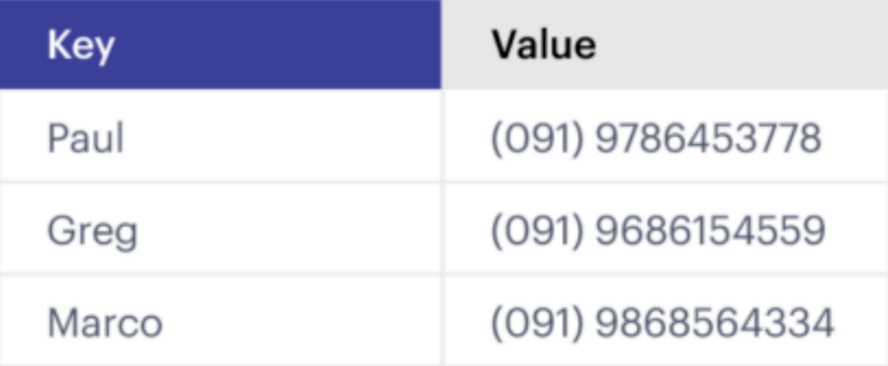

> 해당 포스팅은 인프런의 [비전공자도 이해할 수 있는 Redis 입문/실전 (조회 성능 최적화편)](https://inf.run/SAtv5)를 참조하여 만들었습니다.

## Redis란? / Redis의 장점

### Redis란?

Redis란 무엇일까? 정의가 무엇인지 궁금하여 위키백과 사전을 찾아보았다. 위키백과 사전에서는 다음과 같이 Redis를 정의하곤 한다.

> 레디스(Redis)는 Remote Dictionary Server의 약자로서, “키-값” 구조의 비정형 데이터를 저장하고 관리하기 위한 오픈 소스 기반의 비관계형 데이터베이스 관리 시스템(DBMS)이다.

이렇게 정의를 받아들이기엔 뭔가 어려운 표현들이 섞여 있다. 따라서, 조금 쉽게 표현을 해보도록 하겠다. Redis의 정의를 쉽게 표현하면 다음과 같이 표현할 수 있다.

> Redis는 데이터 처리 속도가 엄청 빠른 NoSQL 데이터베이스이다.

이것을 좀 더 쉽게 그림으로 표현해보도록 하겠다. 그림으로 표현하면 쉽게 표 형태의 key-value형태로 이루어진 것을 볼 수 있다.

### Redis의 장점

Redis는 정말 다양한 장점을 가지고 있다. 그 중에 핵심적인 장점을 꼽아보자면 아래와 같이 말할 수 있을 것이다.

> 레디스(Redis)는 인메모리(in-memory)에 모든 데이터를 저장한다. 그래서 데이터의 처리 성능이 굉장히 빠르다.

우리가 흔히 아는 MySQL과 같은 RDBMS는 디스크에 데이터를 저장한다. 하지만 Redis는 `in-memory` 용어에 맞게 디스크가 아닌 RAM에 저장한다. 운영체제를 공부하면 알겠지만 디스크에 저장된 데이터를 불러오는 것보다 RAM에 저장된 데이터를 불러오는 것이 훨씰 빠르다. 이 때문에 Redis의 데이터 처리 속도가 RDBMS에 비해 훨씬 빠르다.

## Redis 주요 사용 사례

Redis의 주요 사용 사례는 인터넷에 검색해보면 다음과 같이 나온다.

- 캐싱 (Caching)
- 세션 관리 (Session Management)
- 실시간 분석 및 통계 (Real-time Analystics)
- 메시지 큐 (Message Queue)
- 지리공간 인덱싱 (Geospatial Indexing)
- 속도 제한 (Rate Limiting)
- 실시간 채팅 및 메시징 (Real-time Chat And Messaging)

이렇게 다양한 곳에서 Redis는 사용된다. 하지만 해당 기능을 한번에 다 배우는 것은 막막하다. 그래서 필자는 먼저 캐싱에 초점을 맞춰서 학습을 이어나가보도록 하겠다. 이후에 캐싱 기능을 어느정도 배우면 나머지 기능들도 살을 붙여서 이어나가보겠다.