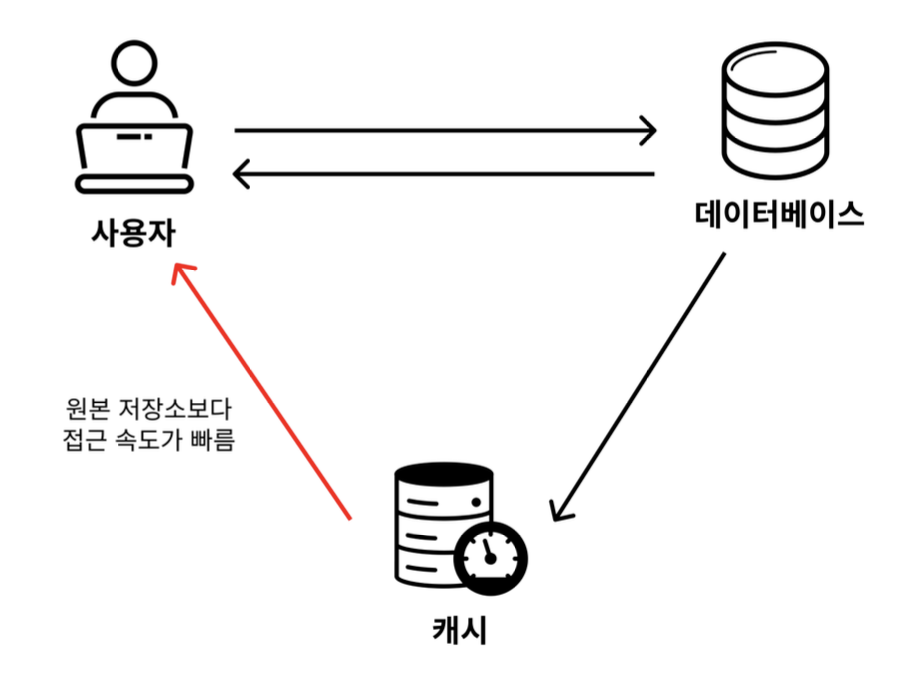

> 해당 포스팅은 인프런의 [비전공자도 이해할 수 있는 Redis 입문/실전 (조회 성능 최적화편)](https://inf.run/SAtv5)를 참조하여 만들었습니다.

## 캐시(Cache), 캐싱(Caching)이란?

### 캐시란?

캐시(Cache)란, 원본 저장소보다 빠르게 가져올 수 있는 임시 데이터 저장소를 의미한다. 즉, 디스크에서 데이터를 바로 가져올려고 한다면 엄청 느린 경우가 있을 것이다. 그럴 때는 디스크에서 바로 가져오기 보다는 RAM과 같은 메인 메모리에서 데이터를 가져오는 방식이다.

> ✅ 참고
>
> 캐시(Cache)라는 단어는 Redis에서만 쓰이는 용어는 아니고 전반적인 개발 분야에서 통용돼서 쓰인다.

### 캐싱이란?

캐싱(Caching)이란 캐시(Cache, 임시 데이터 저장소)에 접근해서 데이터를 빠르게 가져오는 방식을 의미한다. 이런 말은 현업에서 "API 응답 속도가 느리니 캐싱해서 가져오자"라고 말을 하곤 한다. 해당 말은 API 응답 결과를 원본 저장소보다는 빠르게 가져올 수 있는 임시 데이터 저장소에 두고 빠르게 가져오자라는 말과 같은 말이다.

## 데이터를 캐싱할 때 사용하는 전략 (Cache Aside, Write Around)

다음으로 Redis의 캐싱 전략에 대해 알아보자. Redis의 캐싱 전략은 정말 다양하다. 하지만 지금은 실무에서 가장 많이 쓰는 캐싱 전략 2가지를 살펴보도록 하겠다. 한번에 많은 캐싱 전략을 다 배우면 금방 지치기 때문이다.

### Cache Aside (= Look Aside, Lazy Loading) 전략

데이터를 조회할 때 주로 사용하는 전략이 Cache Aside 전략이다. Look Aside 전략 또는 Lazy Loading 전략이라고 부른다. 이 전략은 어떤 식으로 작동하는 지 하나씩 알아보자. 먼저 쉽게 게시판의 예시를 통해 알아보도록 하겠다.

- 처음 게시판 서비스를 배포했기 때문에 데이터베이스와 레디스에는 아무런 데이터도 저장이 안 되어 있다.
- 일부 사용자가 들어와 게시글 작성을 함으로써 데이터를 저장한다. 이 데이터는 데이터베이스에 저장된다. (레디스에는 저장되지 않는다.)
- 사용자가 데이터를 조회하려고 요청한다. 이 때, 데이터베이스로부터 바로 데이터 조회를 하기 전에 레디스에 있는 지 먼저 확인한다.
- 레디스에 데이터가 없는 걸 확인한 뒤에 데이터베이스로부터 데이터를 조회해서 응답한다.
- 데이터베이스로부터 조회한 데이터를 응답한 뒤에 레디스에도 데이터를 저장해둔다.
- 다시 한 번 사용자가 데이터를 조회하려고 요청한다.
- 레디스에 조회하고자 하는 데이터가 있는 지 확인했더니, 데이터가 존재해서 레디스로부터 데이터를 바로 가져와버린다.

위의 시나리오가 캐싱 전략중 Cache Aside 전략을 적용한 사례이다. 그러면 조금 세밀하게 가보도록 하자.

만약, 실제 어플리케이션에서 Redis에 데이터가 있는지 조회를 해볼 것이다. 그래서 정상적인 응답을 준다. 그러면 이 때를 우리는 **캐시 히트**가 되었다고 한다. 그런데 만약 데이터가 없다고 하자. 그러면 이 때를 우리는 **캐시 미스**가 되었다고 하고 이 경우 DB에 데이터를 조회해서 가져온 뒤에 캐시에 데이터를 저장하는 형식이다.

### Write Around 전략

Cache Aside 전략이 데이터를 어떻게 조회할 지에 대한 전략이었다면, Write Around 전략은 데이터를 어떻게 쓸 지(저장, 수정, 삭제)에 대한 전략이다. Write Around 전략은 Cache Aside 전략과 같이 자주 활용되는 전략이다. Write Around 전략이 어떤 방식인지 ‘저장’의 예시로 알아보자.

Write Around 전략은 생각보다 너무 간단하다. 데이터를 저장할 때는 레디스에 저장하지 않고 데이터베이스에만 저장하는 방식이다. 그러다 데이터를 조회할 때 레디스에 데이터가 없으면 데이터베이스로부터 데이터를 조회해와서 레디스에 저장시켜주는 방식이다. 그래서 해당 2가지 전략을 보통은 같이 적용해서 실무에서 사용되곤 한다.

## Cache Aside, Write Around 전략의 한계점 / 해결 방법

### Cache Aside, Write Around 전략의 한계점

Cache Aside 전략과 Write Around 전략을 같이 사용하면 다음과 같은 문제점이 존재한다. 

첫째로, 캐시된 데이터와 DB 데이터가 일치하지 않을 수 있다. Cache Asdie와 Write Around 전략을 같이 썼을 때의 한계점 중 하나는 캐시된 데이터와 DB 데이터가 일치하지 않을 수 있다는 점이다. 조금 어렵게 표현하자면 데이터의 일관성을 보장할 수 없다는 뜻이다. Write Around 전략에 따르면 데이터를 수정할 때 DB만 업데이트를 시키기 때문에 기존에 저장된 레디스의 데이터 값과 DB의 데이터 값은 다를 수 밖에 없다.

둘째로, 캐시에 저장할 수 있는 공간이 비교적 작다. DB는 디스크(Disk)에 저장해서 많은 양을 저장하기 용이하지만, 캐시는 메모리(RAM)에 저장하기 때문에 DB에 비해 많은 양의 데이터를 저장할 수가 없다.

### 이 한계를 어떻게 극복할까?

캐시된 데이터와 DB 데이터가 일치하지 않을 수 있다. 캐시와 DB의 데이터를 일치시키기 위해, 데이터를 수정할 때마다 동시에 업데이트 시키면 성능적으로 느려진다. 그렇다고 성능 향상을 위해 DB의 데이터만 업데이트 시키면 캐시와 DB의 데이터가 일치하지 않게 된다. 하지만 어쩔 수 없다. 어떤 선택을 하든 기회 비용(Trade Off)이 발생한다. 무언가를 얻으면 무언가를 포기해야 한다. 대부분의 개발 기술들이 장점이 있으면 단점이 있다. 따라서 데이터 조회 성능 개선 목적으로 레디스를 쓰는 경우에는 데이터의 일관성을 포기하고 성능 향상을 택한 것이다. 이러한 이유로 인해 캐시를 적용시키기에 적절한 데이터는 다음과 같다.

- 자주 조회되는 데이터
- 잘 변하지 않는 데이터
- 실시간으로 정확하게 일치하지 않아도 되는 데이터

하지만 장기간 데이터가 일치하지 않는 건 문제가 될 수 있다. 따라서 적절한 주기로 데이터를 동기화시켜주어야 한다. 이 때 활용하는 기능이 레디스의 TTL 기능(만료 시간 설정 기능)이다. 일정 시간이 지나면 데이터가 캐시에서 삭제된다. 그럼 특정 사용자가 조회를 하는 순간 Cache Miss가 발생한다. DB의 데이터를 새로 조회해와서 캐시에 데이터를 넣게 된다. 즉, 데이터가 새롭게 갱신되는 효과가 있는 것이다.

그러면 저장공간에 대한 문제는 어떻게 해결할까? 이것도 TTL 기능(만료 시간 설정 기능)을 활용하면 캐시의 공간을 효율적으로 쓸 수 있다. 왜냐면 자주 조회하지 않는 데이터는 만료 시간에 의해 데이터가 삭제되기 때문이다.

## 캐싱으로 조회 성능 개선을 하기 전 OOO을 항상 먼저해야 한다!

### 데이터 조회 성능을 개선하는 방법

데이터 조회 성능을 개선하는 방법은 다양하다.

- SQL 튜닝
- 캐싱 서버 활용 (Redis 등)
- 레플리케이션 (Master/Slave 구조)
- 샤딩
- DB 스케일업 (CPU, Memory, SSD 등 하드웨어 업그레이드)

### 많은 성능 개선 방법 중 ‘SQL 튜닝’을 왜 먼저 고려해야 할까?

이 많은 방법 중에서 우리는 SQL 튜닝부터 진행해야 할 것이다. SQL 튜닝을 제외한 나머지 방법은 추가적인 시스템을 구축해야 한다. 따라서 금전적, 시간적 비용이 추가적으로 발생한다. 조금 더 복잡해진 시스템 구조로 인해 관리 비용이 늘어난다. 그에 비해 SQL 튜닝은 기존의 시스템 변경 없이 성능을 개선할 수 있다. 또한, 근본적인 문제를 해결하는 방법이 SQL 튜닝일 가능성이 높다. SQL 자체가 비효율적으로 작성됐다면 아무리 시스템적으로 성능을 개선한다고 하더라도 한계가 있다. 하지만 SQL 튜닝을 통해 기본적으로 성능을 향상시킨다면, 시스템적인 성능 개선이 필요없거나 훨씬 간단한 개선으로 큰 성능 개선 효과를 얻을 수 있다.