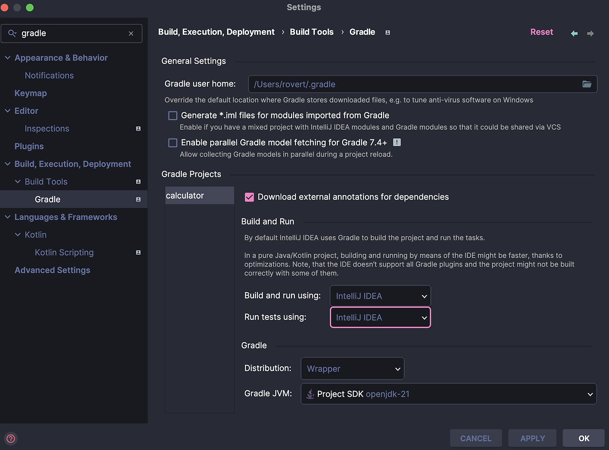
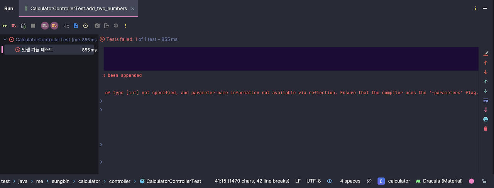
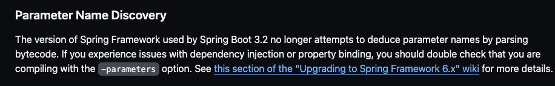
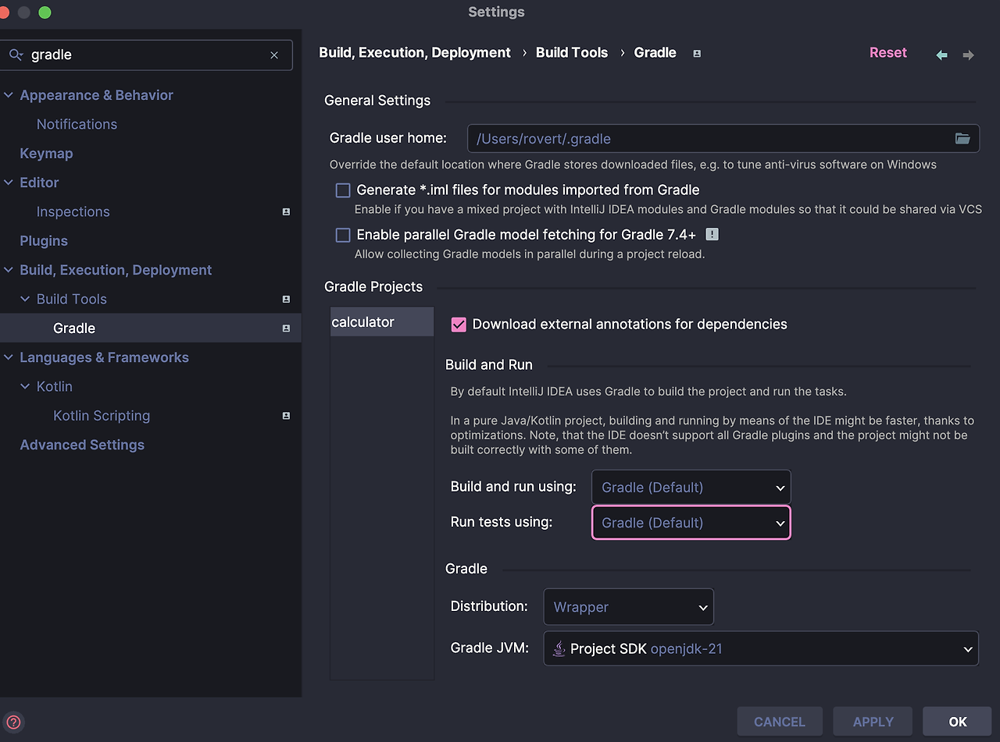
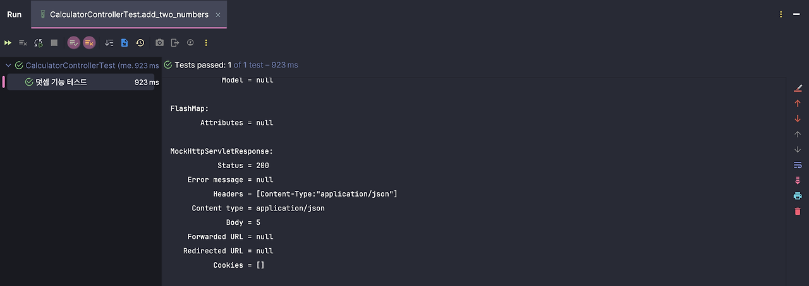

## 트러블 슈팅

나는 '**인프런 스터디 클럽**'을 진행하면서 하나의 트러블슈팅을 맞이하여 블로그 글로 작성해보려고 합니다. 과제를 진행하면서 **Spring Boot 3.2.x** 버전과 관련한 이슈를 발견하였고 이 이슈를 예제를 통하여 재현해보려고 한다.

### 본론

현재 나는 **Java 21 + Spring Boot 3.2.4** 버전을 이용하여 인텔리제이 IDE를 이용하여 계산기 API를 만들어볼려고 한다. 현재 예제는 덧셈 API만 작성해 보았다. 또한 설정은 아래와 같이 진행해 주었다. 인텔리제이의 **Build, Execution, Deployment > Build Tools > Gradle**로 들어가서 빌드 부분을 gradle에서 인텔리제이로 변경해준다.

> 🙋🏻 왜 변경해 주나요?  
> 일단 gradle보다 인텔리제이로 빌드와 run, test부분을 변경해 주면 실제로 동작속도가 gradle에 비해 훨씬 빠르다.



이제 아래의 코드를 작성해 보았다.

``` java
package me.sungbin.calculator.controller;

import org.springframework.web.bind.annotation.PostMapping;
import org.springframework.web.bind.annotation.RequestMapping;
import org.springframework.web.bind.annotation.RequestParam;
import org.springframework.web.bind.annotation.RestController;

/**
 * @author : rovert
 * @packageName : me.sungbin.calculator.controller
 * @fileName : CalculatorController
 * @date : 3/22/24
 * @description :
 * ===========================================================
 * DATE 			AUTHOR			 NOTE
 * -----------------------------------------------------------
 * 3/22/24       rovert         최초 생성
 */

@RestController
@RequestMapping("/api/cal")
public class CalculatorController {

    @PostMapping("/add")
    public int add(@RequestParam int num1, @RequestParam int num2) {
        return num1 + num2;
    }
}
```

그리고 테스트 코드를 아래와 같이 작성하여 테스트를 실행해 보자.

``` java
package me.sungbin.calculator.controller;

import org.junit.jupiter.api.DisplayName;
import org.junit.jupiter.api.Test;
import org.springframework.beans.factory.annotation.Autowired;
import org.springframework.boot.test.autoconfigure.web.servlet.AutoConfigureMockMvc;
import org.springframework.boot.test.context.SpringBootTest;
import org.springframework.test.web.servlet.MockMvc;

import static org.junit.jupiter.api.Assertions.*;
import static org.springframework.test.web.servlet.request.MockMvcRequestBuilders.post;
import static org.springframework.test.web.servlet.result.MockMvcResultHandlers.print;
import static org.springframework.test.web.servlet.result.MockMvcResultMatchers.status;

/**
 * @author : rovert
 * @packageName : me.sungbin.calculator.controller
 * @fileName : CalculatorControllerTest
 * @date : 3/22/24
 * @description :
 * ===========================================================
 * DATE 			AUTHOR			 NOTE
 * -----------------------------------------------------------
 * 3/22/24       rovert         최초 생성
 */

@SpringBootTest
@AutoConfigureMockMvc
class CalculatorControllerTest {

    @Autowired
    private MockMvc mockMvc;

    @Test
    @DisplayName("덧셈 기능 테스트")
    void add_two_numbers() throws Exception {
        this.mockMvc.perform(post("/api/cal/add")
                        .param("num1", "2")
                        .param("num2", "3"))
                .andDo(print())
                .andExpect(status().isOk());
    }
}
```

그리고 실행을 하면 당연히 success가 떨어져야 하지만 아래와 같은 에러가 발생한다.



대체 이유가 무엇일까? 당연히 @RequestParam 어노테이션에 name속성을 생략해도 자동으로 변수명과 매칭시켜서 매핑시켜 주었는데 지금 파라미터 이름을 알 수 없다는 에러가 발생한다. 그래서 한번 스프링 공식문서를 확인해 보았다. 그리고 원인을 알 수 있었다. 공식문서에는 아래와 같이 이야기하고 있었다. 



> Spring Boot 3.2에서 사용되는 Spring Framework 버전은 더 이상   
> 바이트코드를 구문 분석하여 매개변수 이름을 추론하려고 시도하지 않습니다.

이 사실을 알고 해결책을 한번 찾아보았고 아래와 같은 해결책을 알 수 있었다.

> 1\. 이름을 명시한다. 즉, **@RequestParam**의 어노테이션에 name속성을 전부 주는 것이다.

정말 단순한 방법이고, 예제와 같이 API가 많지 않다면 이렇게 하는 것이 더 효율적일 수 있지만, 만약 실무처럼 수많은 API가 존재하는 경우 이것을 전부 name속성을 줄려고 한다면 야근 당첨일 것이다. 🥲🥲🥲

그럼 다음 해결책을 확인해 보았다. 그 해결책은 아래와 같다.

> 2. 컴파일 시점에 -parameters 옵션 적용
> 
> \* IntelliJ IDEA에서 File -> Settings를 연다. (Mac은 IntelliJ IDEA -> Settings)  
> \*  Build, Execution, Deployment → Compiler → Java Compiler로 이동한다.  
> \*  Additional command line parameters라는 항목에 다음을 추가한다.  
>    -parameters  
> \* out 폴더를 삭제하고 다시 실행한다. 꼭 out 폴더를 삭제해야 다시 컴파일이 일어난다.  

이 경우가 매우 좋아 보여 한번 적용해 보려고 하였지만 나의 경우는 잘 작동되지는 않았다. 그래서 다른 해결책을 찾은 결과 아래와 같은 결과를 찾을 수 있었다.

> 인텔리제이의 세팅에  Build, Execution, Deployment > Build Tools > Gradle   
> 을 들어가서 아래 세팅처럼 Gradle로 변경한다. 초기세팅은 Gradle이다. 나처럼 IntelliJ로 변경한 사람만 적용하면 된다.



그리고 다시 적용해 보면 아래와 같이 테스트가 성공하는 것을 볼 수 있다.



### 후기

이 트러블 슈팅은 **@RequestParam**만 해당되는 것이 아니며, **@PathVariable, @Autowired, @ConfigurationProperties에** 동일하게 발생한다. 그러면 왜 스프링 쪽에서 이렇게 변경한 것일까? 이 부분이 궁금해지기 시작했다. 이 부분은 한번 알아보고 다음 포스트에 남겨보도록 노력해 보겠다.

> 📚 참조  
> [https://github.com/spring-projects/spring-boot/wiki/Spring-Boot-3.2-Release-Notes](https://github.com/spring-projects/spring-boot/wiki/Spring-Boot-3.2-Release-Notes "스프링 깃헙 문서")