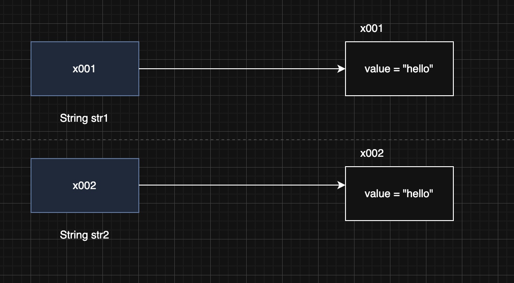

> 해당 블로그 글은 [영한님의 인프런 강의](https://inf.run/FiFGQ)를 바탕으로 쓰여진 글입니다.

## String 클래스 - 기본

자바에서 문자를 다루는 대표적인 타입은 `char` , `String` 2가지가 있다. 원래 문자열을 다룰려면 `char`배열을 만들어서 해야했다. 하지만 이 과정이 매우 번거롭고 힘들어서 자바에서 `String`이라는 클래스를 만들어서 제공해준다.

`String`클래스를 통하여 문자열을 만드는 방법은 2가지가 존재한다.

``` java
String str1 = "hello";
String str2 = new String("java");
```

`String`은 클래스이다. 즉, 참조형 타입이다. 그래서 기본적으로 참조값이 들어가 있고 생성할 때도 `new`연산자를 통하여 인스턴스를 생성하고 사용해야 한다. 그래서 아래의 코드가 뭔가 이상하다고 느껴질 것이다.

``` java
String str1 = "hello";
```

하지만 위의 문법은 오류가 아니다. 실제로 실무에서도 이렇게 쓴다. 이렇게 되는 이유는 문자열 자체를 자주 사용해서 자바에서 허용해주기 때문이다. 문자열은 매우 자주 사용된다. 그래서 편의상 쌍따옴표로 문자열을 감싸면 자바 언어에서 `new String("hello")`와 같이 변경해준다. (이 경우 실제로는 성능 최적화를 위해 문자열 풀을 사용한다.)

### String 클래스 구조

String 클래스 구조는 아래와 같이 되어 있다.

``` java
public final class String {
    private final char[] value;

    // ...
}
```

String은 클래스이니 데이터와 기능을 가진다. 여기서 데이터의 대표적인 것은 value라는 속성이다. value의 타입을 보면 알겠지만 `char`배열 타입이다. 즉, 우리가 입력한 문자열이 해당 배열로 저장된다는 것을 유추할 수 있다.

> ✅ 참고
>
> 자바 9부터 `String` 클래스에서 `char[]` 대신에 `byte[]` 을 사용한다. 자바에서 문자 하나를 표현하는 `char` 는 `2byte` 를 차지한다. 그런데 영어, 숫자는 보통 `1byte`로 표현이 가능하다. 그래서 단순 영어, 숫자로만 표현된 경우 `1byte` 를 사용하고(정확히는 Latin-1 인코딩의 경우 `1byte` 사용) , 그렇지 않은 나머지의 경우 `2byte` 인 UTF-16 인코딩을 사용한다. 따라서 메모리를 더 효율적으로 사용할 수 있게 변경되었다.

또한 `String`클래스에는 다양한 메서드가 존재한다.

- `length()` : 문자열의 길이를 반환한다.
- `charAt(int index)` : 특정 인덱스의 문자를 반환한다.
- `substring(int beginIndex, int endIndex)` : 문자열의 부분 문자열을 반환한다.
- `indexOf(String str)` : 특정 문자열이 시작되는 인덱스를 반환한다.
- `toLowerCase()`,`toUpperCase()` : 문자열을 소문자 또는 대문자로 변환한다.
- `trim()` : 문자열 양 끝의 공백을 제거한다.
- `concat(String str)` : 문자열을 더한다.

이외에도 다양한 메서드가 있는데 이것을 다 외울 필요는 없고 지금은 이게 이거구나라고만 알고 까먹으면 ai나 구글링을 통해서 찾아보자!

### String클래스와 참조형

`String`클래스는 참조형이다. 즉, 참조값이 들어 있고 `+`같은 연산은 원래 허용이 안된다. 하지만 해당 클래스는 너무 자주 사용함으로 자바에서 허용을 해준다.

``` java
String str1 = "hello";
String str2 = " World!";

String result = str1 + str2;
```

만약 이것을 허용 안 해주었다면 `String`클래스의 `concat`메서드를 이용했을 것이다.

``` java
String str1 = "hello";
String str2 = " World!";

String result = str1.concat(str2);
```

## String 클래스 - 비교

`String` 클래스 비교할 때는 `==` 비교가 아니라 항상 `equals()` 비교를 해야한다. 왜 그런지 코드를 통해 살펴보자.

``` java
package lang.string.equals;

public class StringEqualsMain1 {
    public static void main(String[] args) {
        String str1 = new String("hello");
        String str2 = new String("hello");
        System.out.println("new String() == 비교: " + (str1 == str2));
        System.out.println("new String() equals 비교: " + (str1.equals(str2)));

        String str3 = "hello";
        String str4 = "hello";
        System.out.println("리터럴 == 비교: " + (str3 == str4));
        System.out.println("리터럴 equals 비교: " + (str3.equals(str4)));
    }
}
```

위의 코드에서 비교 연산자와 `equals`메서드를 이용하여 값이 같은지 여부를 확인하고 있다. 해당 내용을 그림을 통해서 살펴보고 정리해보자. 먼저 `new String`을 이용하여 생성된 문자열 비교를 진행해보자.



`new`연산자로 생성한 문자열 객체는 위의 그림처럼 다른 인스턴스를 참조한다. 그래서 `==`연산자는 당연히 false가 나오는게 맞다. `equals`연산자를 사용하면 해당 메서드를 `String`클래스가 동등성 비교로 오버라이딩 해두었기에 true가 나온다.


이제 리터럴로 문자열을 생성한 방법을 살펴보자. 문자열 리터럴을 사용하는 경우 자바는 메모리 효율성과 성능 최적화를 위해 문자열 풀을 사용한다. 자바가 실행되는 시점에 클래스에 문자열 리터럴이 있으면 문자열 풀에 `String` 인스턴스를 미리 만들어둔다. 이때 같은 문자열이 있으면 만들지 않는다. 그래서 자바가 로드할 때 문자열 리터럴 "hello"를 보면 문자열 상수 풀에 "hello"를 만든다. 그리고 다음 그 문자열을 보면 해당 참조값을 가리키게 한다. 따라서 `==`연산자도 true, `equals`도 true가 나오는 것이다.

> ✅ 참고
>
> 풀(Pool)은 자원이 모여있는 곳을 의미한다. 프로그래밍에서 풀(Pool)은 공용 자원을 모아둔 곳을 뜻한다. 여러 곳에서 함께 사용할 수 있는 객체를 필요할 때 마다 생성하고, 제거하는 것은 비효율적이다. 대신에 이렇게 문자열 풀에 필요한 `String` 인스턴스를 미리 만들어두고 여러곳에서 재사용할 수 있다면 성능과 메모리를 더 최적화 할 수 있다. 참고로 문자열 풀은 힙 영역을 사용한다. 그리고 문자열 풀에서 문자를 찾을 때는 해시 알고리즘을 사용하기 때문에 매우 빠른 속도로 원하는 `String` 인스턴스를 찾을 수 있다.

그렇다면 문자열 리터럴을 사용하면 `==` 비교를 하고, `new String()` 을 직접 사용하는 경우에만 `equals()` 비교를 사용하면 되지 않을까? 그렇지 않다! 무조건 `equals()`를 사용해야 한다. 왜냐하면 만약 문자열을 파라미터로 받는 메서드를 개발한다고 해보자. 그런데 그 안에서 `==`연산자로 동등성 비교를 한다 해보자. 만약 파리미터로 `new String()`이 오면 실패할것이고 리터럴이 들어오면 성공할 것이다. 이런 실패의 경우 때문에 무조건 성공하는 `equals()`를 통해 동등성 비교를 해야 한다.

## String 클래스 - 불변 객체

`String` 은 불변 객체이다. 따라서 생성 이후에 절대로 내부의 문자열 값을 변경할 수 없다.

``` java
package lang.string.immutable;

public class StringImmutable1 {
    public static void main(String[] args) {
        String str = "hello";
        str.concat(" java");
        System.out.println("str = " + str);
    }
}
```

이렇게 `concat`메서드로 문자열을 합쳐보는 로직을 작성한다. 하지만 `String`클래스는 불변 객체이므로 `concat`메서드에 반환값을 받아야 한다. 만약 위와 같이 작성하면 아무런 반응이 없을 것이다. 아래처럼 반환 값을 받아야 한다. 즉, `String`클래스는 불변임을 증명이 되었다.

``` java
package lang.string.immutable;

public class StringImmutable2 {
    public static void main(String[] args) {
        String str1 = "hello";
        String str2 = str1.concat(" java");

        System.out.println("str1 = " + str1);
        System.out.println("str2 = " + str2);
    }
}
```

### String이 불변으로 설계된 이유

`String` 이 불변으로 설계된 이유는 앞서 불변 객체에서 배운 내용에 추가로 다음과 같은 이유도 있다. 문자열 풀에 있는 `String` 인스턴스의 값이 중간에 변경되면 같은 문자열을 참고하는 다른 변수의 값도 함께 변경된다.

## String 클래스 - 주요 메서드

`String` 클래스는 문자열을 편리하게 다루기 위한 다양한 메서드를 제공한다. 엄청 많은 메서드이고 이것을 다 외우는 것은 너무 비효율적이다. 그래서 일단 자주 사용하는 메서드 위주로 이 메서드가 뭐하는 놈인지 파악하고 나중에 모를때 여기와서 찾아보자. 그리고 코드로 메서드들을 사용해보면서 체득하는 것도 중요할 듯 보인다.

### 문자열 정보 조회

- `length()` : 문자열의 길이를 반환한다.
- `isEmpty()` : 문자열이 비어 있는지 확인한다. 길이가 0인 문자열을 찾는 것이다. ex. ""
- `isBlank()` : 문자열이 비어 있는지 확인한다. (길이가 0이거나 공백만 있는 경우) 자바11 이상부터 사용 가능. ex. " "
- `charAt(int index)` : 지정된 인덱스에 있는 문자를 반환한다.

### 문자열 비교

- `equals(Object anObject)` : 두 문자열이 동일한지 비교한다.
- `equalsIgnoreCase(String anotherString)` : 두 문자열을 대소문자 구분 없이 비교한다.
- `compareTo(String anotherString)` : 두 문자열을 사전 순으로 비교한다. ex. anotherString이 b고 비교대상이 a라면 -1이 반환된다. 만약 같다면 0으로 반환된다.
- `compareToIgnoreCase(String str)` : 두 문자열을 대소문자 구분 없이 사전적으로 비교한다.
- `startsWith(String prefix)` : 문자열이 특정 접두사로 시작하는지 확인한다.
- `endsWith(String suffix)` : 문자열이 특정 접미사로 끝나는지 확인한다.

### 문자열 검색

- `contains(CharSequence s)` : 문자열이 특정 문자열을 포함하고 있는지 확인한다.
- `indexOf(String ch)` / `indexOf(String ch, int fromIndex)` : 문자열이 처음 등장하는 위치를 반환한다. ex. fromIndex부터 찾는거고 못 찾으면 -1을 반환한다.
- `lastIndexOf(String ch)` : 문자열이 마지막으로 등장하는 위치를 반환한다. 못 찾으면 -1을 반환한다.

### 문자열 조작 및 변환

- `substring(int beginIndex)`/`substring(int beginIndex, int endIndex)` : 문자열의 부분 문자열을 반환한다. ex. beginIndex 이상 endIndex 미만이다.
- `concat(String str)` : 문자열의 끝에 다른 문자열을 붙인다.
- `replace(CharSequence target, CharSequence replacement)` : 특정 문자열을 새 문자열로 대체한다.
- `replaceAll(String regex, String replacement)` : 문자열에서 정규 표현식과 일치하는 부분을 새 문자열로 대체한다.
- `replaceFirst(String regex, String replacement)` : 문자열에서 정규 표현식과 일치하는 첫 번째 부분을 새 문자열로 대체한다.
- `toLowerCase()`/`toUpperCase()` : 문자열을 소문자나 대문자로 변환한다.
- `trim()` : 문자열 양쪽 끝의 공백을 제거한다. 단순 공백만 제거할 수 있다.
- `strip()` : 공백과 유니코드 공백을 포함해서 제거한다. 자바11이상부터 사용 가능

### 문자열 분할 및 조합

- `split(String regex)` : 문자열을 정규 표현식을 기준으로 분할한다.
- `join(CharSequence delimiter, CharSequence... elements)` : 주어진 구분자로 여러 문자열을 결합한다. static 메서드다.

### 기타 유틸리티

- `valueOf(Object obj)` : 다양한 타입을 문자열로 변환한다. static 메서드다.
- `toCharArray():` 문자열을 문자 배열로 변환한다.
- `format(String format, Object... args)` : 형식 문자열과 인자를 사용하여 새로운 문자열을 생성한다. static 메서드다.
- `matches(String regex)` : 문자열이 주어진 정규 표현식과 일치하는지 확인한다.

> ✅ 참고
>
> `CharSequence`는 `String`,`StringBuilder`의 상위 타입이다. 문자열을 처리하는 다양한 객체를 받을 수 있다.

## StringBuilder - 가변 String

불변인 `String` 클래스의 단점은 문자를 더하거나 변경할 때 마다 계속해서 새로운 객체를 생성해야 한다는 점이다. 문자를 자주 더하거나 변경해야 하는 상황이라면 더 많은 `String` 객체를 만들고, GC해야 한다. 결과적으로 컴퓨터의 CPU, 메모리를 자원을 더 많이 사용하게 된다. 그리고 문자열의 크기가 클수록 문자열을 더 자주 변경할수록 시스템의 자원을 더 많이 소모한다.

### StringBuilder

이 문제를 해결할 수 있게 가변 String 클래스인 `StringBuilder`를 자바가 제공해준다. 예시 코드를 살펴보자.

``` java
package lang.string.builder;

public class StringBuilderMain1_1 {
    public static void main(String[] args) {
        StringBuilder sb = new StringBuilder();
        sb.append("A"); // 문자열 이어 붙이기
        sb.append("B");
        sb.append("C");
        sb.append("D");
        System.out.println("sb = " + sb);

        sb.insert(4, "Java"); // 특정 인덱스에 문자열 삽입
        System.out.println("insert = " + sb);

        sb.delete(4, 8); // 특정 범위의 문자열 삭제
        System.out.println("delete = " + sb);

        sb.reverse(); // 문자열 뒤집기
        System.out.println("reverse = " + sb);

        String string = sb.toString(); // String 변환
        System.out.println("string = " + string);
    }
}
```

`String` 은 불변하다. 즉, 한 번 생성되면 그 내용을 변경할 수 없다. 따라서 문자열에 변화를 주려고 할 때마다 새로운 `String` 객체가 생성되고, 기존 객체는 버려진다. 이 과정에서 메모리와 처리 시간을 더 많이 소모한다. 반면에 `StringBuilder`는 새로운 객체를 생성하지 않지만 사이드 이펙트에 주의할 필요가 있다. `StringBuilder` 는 보통 문자열을 변경하는 동안만 사용하다가 문자열 변경이 끝나면 안전한 `String` 변환하는 것이 좋다.

## String 최적화

`String`은 객체다. 그래서 일반적으로 원래는 `+`같은 연산자를 지원 안 하지만 너무 자주 쓰다보니 자바에서 `+`을 지원해준다. 그러면 `+`연산을 자바에서 어떻게 변경해줄까? 바로 `StringBuilder`를 이용한다.

``` java
String str = "hello" + " java";
```

위와 같이 문자열 리터럴 연산이 있다고 해보자. 이것은 자바가 컴파일을 하면 아래와 같이 자동으로 변환한다.

``` java
String str = "hello java";
```

하지만 아래와 같이 변수를 사용해서 연산을 하는 경우는 그 안에 어떤 값이 들어있는지 컴파일 시점에는 알 수 없기 때문에 단순하게 합칠 수 없다.

``` java
String result = str1 + str2;
```

그래서 `StringBuilder`를 이용해서 아래와 같이 최적화를 진행한다.

``` java
String result = new StringBuilder().append(str1).append(str2).toString();
```

> ✅ 참고
>
> 자바 9부터는 `StringConcatFactory` 를 사용해서 최적화를 수행한다.

이렇듯 자바가 최적화를 처리해주기 때문에 지금처럼 간단한 경우에는 `StringBuilder` 를 사용하지 않아도 된다. 대신에 문자열 더하기 연산(`+`)을 사용하면 충분하다.

하지만 `String` 최적화가 어려운 경우가 존재한다. 바로 반복문에서 연산을 실행할 때이다. 반복문의 루프 내부에서는 최적화가 되는 것 처럼 보이지만, 반복 횟수만큼 객체를 생성해야 한다. 반복문 내에서의 문자열 연결은, 런타임에 연결할 문자열의 개수와 내용이 결정된다. 이런 경우, 컴파일러는 얼마나 많은 반복이 일어날지, 각 반복에서 문자열이 어떻게 변할지 예측할 수 없다. 따라서, 이런 상황에서는 최적화가 어렵다. 그래서 반복문 내에 문자열 연산을 사용한다면 `StringBuilder`를 사용하는것이 합리적일 것이다.

### **StringBuilder를 직접 사용하는 것이 더 좋은 경우**

- 반복문에서 반복해서 문자를 연결할 때
- 조건문을 통해 동적으로 문자열을 조합할 때
- 복잡한 문자열의 특정 부분을 변경해야 할 때
- 매우 긴 대용량 문자열을 다룰 때

> ✅ 참고: StringBuilder vs StringBuffer
>
> `StringBuilder` 와 똑같은 기능을 수행하는 `StringBuffer` 클래스도 있다. `StringBuffer` 는 내부에 동기화가 되어 있어서, 멀티 스레드 상황에 안전하지만 동기화 오버헤드로 인해 성능이 느리다. `StringBuilder` 는 멀티 쓰레드에 상황에 안전하지 않지만 동기화 오버헤드가 없으므로 속도가 빠르다.

## 메서드 체인닝 - Method Chaining

메서드 호출의 결과로 자기 자신의 참조값을 반환하면, 반환된 참조값을 사용해서 메서드 호출을 계속 이어갈 수 있다. 코드를 보면 `.` 을 찍고 메서드를 계속 연결해서 사용한다. 마치 메서드가 체인으로 연결된 것 처럼 보인다. 이러한 기법을 메서드 체이닝이라 한다.

``` java
package lang.string.builder;

public class StringBuilderMain1_1 {
    public static void main(String[] args) {
        StringBuilder sb = new StringBuilder();
        sb.append("A"); // 문자열 이어 붙이기
        sb.append("B");
        sb.append("C");
        sb.append("D");
        System.out.println("sb = " + sb);

        sb.insert(4, "Java"); // 특정 인덱스에 문자열 삽입
        System.out.println("insert = " + sb);

        sb.delete(4, 8); // 특정 범위의 문자열 삭제
        System.out.println("delete = " + sb);

        sb.reverse(); // 문자열 뒤집기
        System.out.println("reverse = " + sb);

        String string = sb.toString(); // String 변환
        System.out.println("string = " + string);
    }
}
```

메서드 체이닝을 이용하면 어처피 자기 자신 참조값을 반환하니 이어메서드 호출이 가능한 것이다. 위의 코드를 한번 메서드 체이닝으로 바꿔보자.

``` java
package lang.string.builder;

public class StringBuilderMain1_2 {
    public static void main(String[] args) {
        StringBuilder sb = new StringBuilder();
        String string = sb.append("A").append("B").append("C").append("D")
                .insert(4, "Java")
                .delete(4, 8)
                .reverse()
                .toString();

        System.out.println("string = " + string);
    }
}
```

엄청 간단해지고 읽기도 쉬워졌다.

> 잘못된 지식이 있을 경우 댓글로 남겨주시면 빠르게 반영하겠습니다!