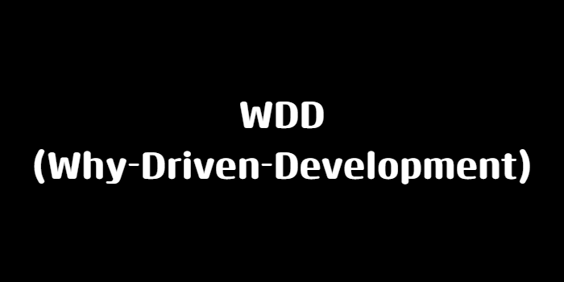

## WDD(Why-Driven-Development)

지금까지 스터디를 운영해보고 스스로 학습을 해보면서 가장 중요한 깨달음을 얻었고 WDD라는 방법론을 소개하려고 합니다.

### WDD란?

WDD(Why-Driven-Development)란 `왜`라는 의문을 가지며 그것을 주도하여 개발을 하는 과정을 말합니다.
이제까지 스터디, 토이프로젝트, 공부를 하면서 이런 물음없이 학습을 진행하게 되었습니다. 그러고 나서 스스로 복습을 하고 회고를 해보는 과정에서 해당 물음이 문득 떠올랐습니다.
토이 프로젝트를 진행하면서 "왜 이런 방식으로 해야할까? 다른 방법은 안될까?"라는 물음이 상기되었고 공부를 하면서도 "이것이 왜 이렇게 동작할까?"라는 물음이 스스로에게 나오게 되었습니다.
그러면서 조금의 반성이 들기 시작했습니다. 이런 물음 없이 학습을 하게 되면 나중에 왜 이렇게 되고 왜 그러는지에 대한 의문만 잔뜩 남게 되었습니다.
그러면 WDD를 어떻게 적용하고 학습을 하는지에 대해 한번 공유해보겠다.

### WDD 적용방법

> 해당 방법은 저의 방법이고 개개인마다 다를 수 있습니다. 참고만 부탁드립니다!

적용방법은 다음과 같습니다.

첫번째, '왜'라는 물음을 항상 가진다. 저는 학습을 하면서 해당 개념에 대해 왜 이 개념이 등장했는가에 대해 고민을 먼저 합니다. 강의를 듣더라도 해당 물음이 생기면 바로바로 찾아보기도 합니다.
또한 프로젝트를 진행하더라도 왜 우리가 이 기술을 도입하는가에 대해 팀원분들과 고민을 하려는 노력을 합니다. 예를 들어 스프링의 DI의 개념에 대해 학습을 한다고 하면 왜 DI가 등장을 했는지부터 찾아보는 것 같습니다. 이처럼 항상 '왜'라는 질문을 생각합니다.

둘째, '왜'라는 물음에 답하기 위해 고민을 해본다. 저는 해당 물음을 스스로에게 던지면 한번 구글링을 해보거나 gpt에게 물어봅니다. 이를 통해 나온 결론 혹은 답변을 메모장이나 저만의 노트, 노션에 정리를 해둡니다.

### WDD 효과

 WDD를 적용하면서 물음을 던지고 그에 대한 물음을 알고 개념을 학습을 하니 조금 더 개념이 와닿은것 같습니다. 또한 팀 프로젝트에는 개념뿐만 아니라 코드리뷰 과정에도 왜 라는 질문에 리뷰를 주면 고민을 해보고 더 나은 방법에 대해 공부를 해보는 것 또한 많은 성장을 저한테 주는 것 같습니다. 또한 면접에서 "왜 이렇게 로직을 적용하셨나요? 더 나은 방법은 없는가요?"라는 질문에도 답변을 할 수 있는 자신감이 생겼던 것 같습니다.

### 결론

이건 제가 찾은 방법이고 다른 분들께는 비효율적이다라고 생각이 들 수 있을겁니다. 이 부분은 미래의 저한테도 느껴질 수 있는 부분입니다. 하지만 현재에 저한테 가장 좋았던 방법이고 꾸준히 실천해보려고 합니다. 응원 부탁드리며, 적용해보고 싶으신 분들은 적용해서 같이 성장하는 하루가 되었으면 합니다. 감사합니다.