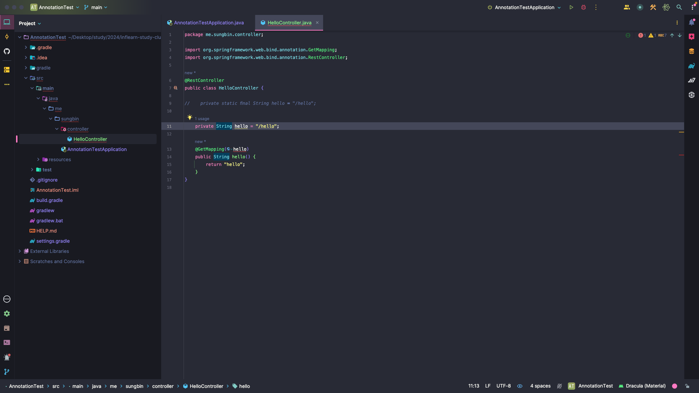
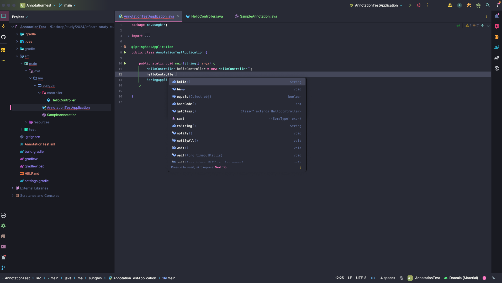
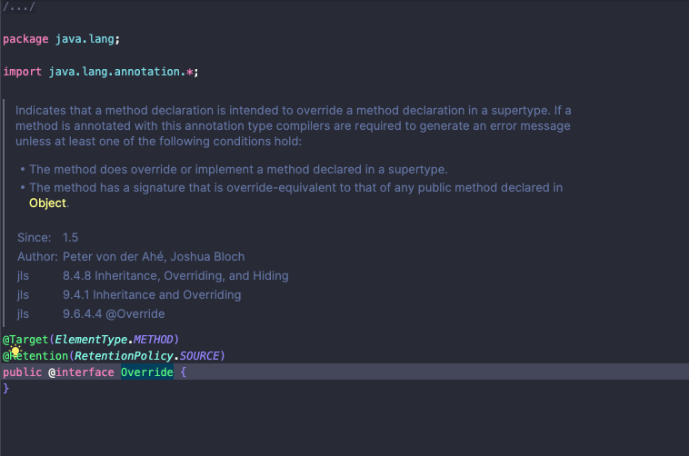
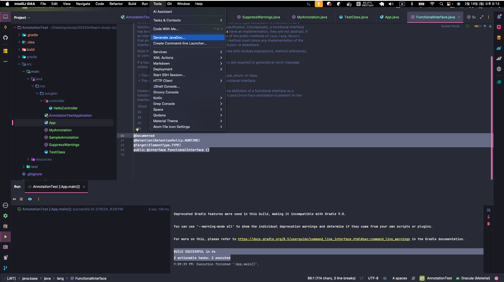
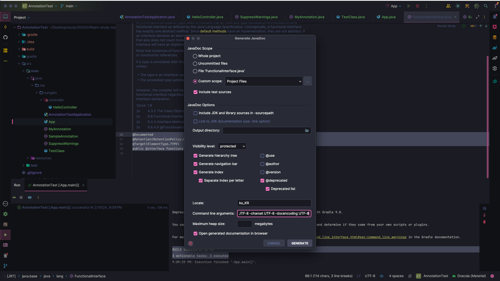
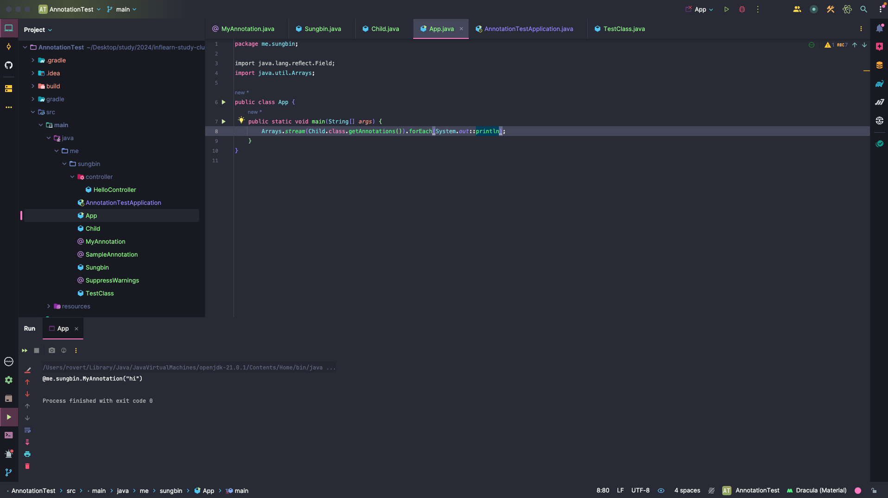
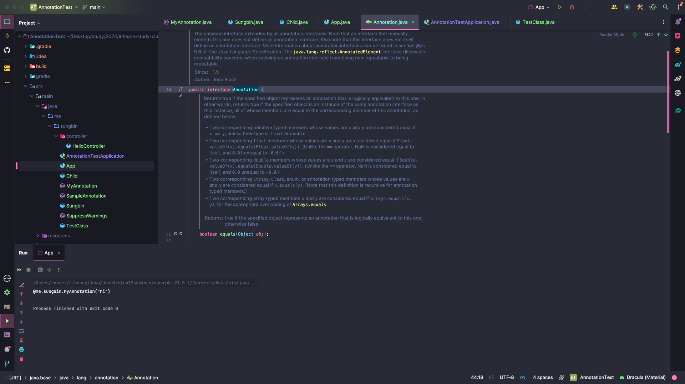
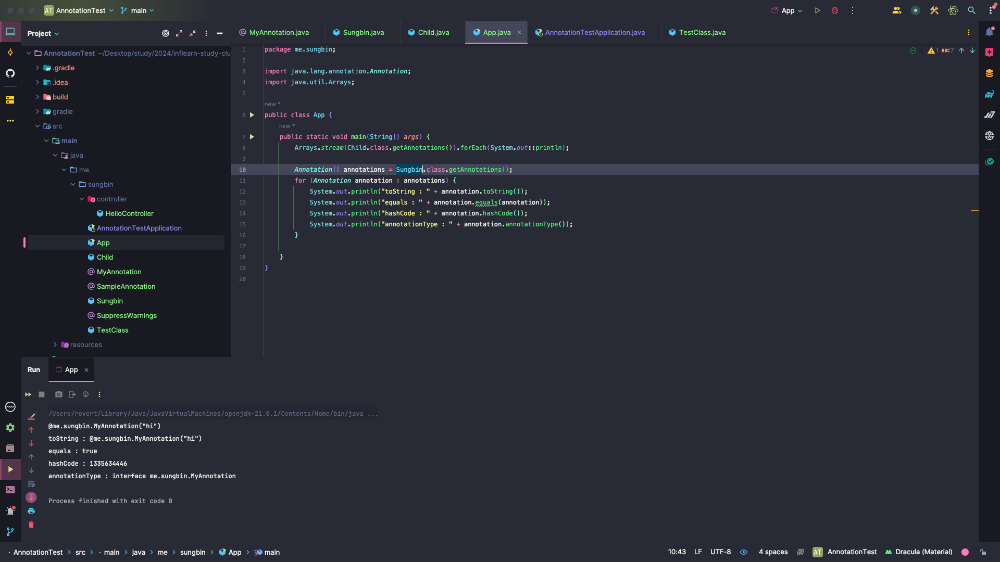

# 어노테이션

## 서론

드디어 '**인프런 워밍업 스터디 클럽 0기**' 첫 날이 밝아왔다. 강의를 듣고 미션을 보니 어노테이션에 관련한 내용이었다.

나는 이 미션을 보고 오히려 기쁜 마음이 들었다. 😆 내가 강의를 들으면서 어노테이션 부분이 많이 궁금하였는데 이렇게 공부하게 될 계기가 생긴 것 같아서 미션도 완성시키고 나 스스로 깊게 공부도 할 겸 미션을 시작할려고 한다.

미션은 아래와 같다.

> 진도표 1일차와 연결됩니다
우리는 최초로 API를 만들어 보았습니다. GET API를 만들기 위해 사용했던 어노테이션에 익숙하지 않다면 자바 어노테이션에 대해서 몇 가지 블로그 글을 찾아보세요! 다음 질문을 생각하며 공부해보면 좋습니다! 😊

> **[질문]**
> * 어노테이션을 사용하는 이유 (효과) 는 무엇일까?
> * 나만의 어노테이션은 어떻게 만들 수 있을까?

## 내가 알아본 어노테이션의 정의

나는 강의의 실습을 통하여 스프링 부트 프로젝트를 생성하고, GET API를 만들어보고 포스트맨을 통하여 테스트 작업도 해보았다. 나는 여기서 다양한 어노테이션들을 볼 수 있었다. ```@SpringBootApplication```, ```@RestController```, ```@GetMapping``` 등 여러 어노테이션들을 볼 수 있었다. 여기서 나는 어노테이션이 무엇일까 고민을 해보았다. 단순히 어노테이션은 @ 붙인거라고만 알고 있었기에 이번 기회에 미션도 수행할 겸 깊게 알아보는 것도 좋다 생각하여 공부해보기로 하겠다.

먼저 어노테이션이 대체 어떤 정의가 있는지 구글링을 해보기로 하였다. 구글링을 해보니, 다양한 블로그들이 나왔지만 정의가 수록된 위키백과를 먼저 참조해보기로 하였다. 위키백과는 다음과 같이 정의를 내렸다.

> 자바 어노테이션은 자바 소스 코드에 추가하여 사용할 수 있는 메타데이터의 일종이다. 보통 @ 기호를 앞에 붙여서 사용한다. JDK 1.5 버전 이상에서 사용 가능하다. 자바 어노테이션은 클래스 파일에 임베디드되어 컴파일러에 의해 생성된 후 자바 가상머신에 포함되어 작동한다.

그리고 강의 중에 코치님께서도 어노테이션에 대해 아래와 같이 언급해주셨다.

> 어노테이션은 어노테이션마다 너무 다양한 역할을 한다. 또한 마법같은 일을 자동으로 해준다는 것이다. 예를 들어서, ```@SpringBootApplication``` 어노테이션은 스프링을 실행시킬 때 다양한 설정이 필요한데 이 설정을 모두 자동으로 해준다. 또한 이런것이 가장 핵심적인 마법같은 일이다.

위키사전, 코치님의 설명을 통해 어노테이션의 정의를 알 수 있었다. 좀 더 내가 설명한 식으로 풀어보자면 다음과 같다.

> 자바의 어노테이션은 코드에 추가 정보를 제공하는 데 사용되며, 컴파일 시간, 배포 시간, 또는 실행 시간에 해당 정보를 활용할 수 있습니다. 이를 통해 개발자는 코드에 메타데이터를 추가하여 코드의 가독성, 유지 보수성을 향상시키고, 다양한 도구와 프레임워크에서 활용될 수 있는 정보를 제공할 수 있습니다.

좀 더 자세히 풀어보자.

> 어노테이션은 자바 5부터 도입된 기능으로, 코드에 대한 메타데이터를 제공하는 방법입니다. 어노테이션은 주석과 비슷하지만, 실제로 코드에 영향을 줄 수 있으며, 컴파일러에게 정보를 제공하거나 실행 시간에 특정 동작을 하도록 할 수 있습니다. 어노테이션은 선언적 형태로 코드 안에 포함되어, 클래스, 메소드, 변수 등 다양한 요소에 적용될 수 있습니다.

이제 위의 내용을 좀 더 정리해보겠다.

## 어노테이션이란?

자바를 개발한 사람들은 소스코드에 대한 문서를 따로 만들기보다 소스코드와 문서를 하나의 파일로 관리하는 것이 낫다고 생각했다. 그래서 소스코드의 주석에 소스코드에 대한 정보를 저장하고, 소스코드의 주석으로부터 HTML 문서를 생성해내는 프로그램(javadoc.exe)를 만들어 사용했다.

그런데 여기서 의문점이 하나 든다.

> 🙋🏻 왜 어노테이션이라는 것을 살펴보려 하는데 주석이라는 내용이 먼저 나올까?

프로그램의 소스코드 안에 다른 프로그램을 위한 정보를 미리 약속된 형식으로 포함시킨 것이 바로 어노테이션이다. 어노테이션은 주석(comment)처럼 프로그래밍 언어에 영향을 미치지 않으면서도 다른 프로그램에게 유용한 정보를 제공할 수 있다는 장점이 있다.

> 📚 어노테이션(annotation)의 뜻은 주석, 주해, 메모이다.

``` java
package org.example;

public @interface SampleAnnotation {
}
```

위의 코드는 인텔리제이로 나의 어노테이션을 만든 코드이다.

그럼 인텔리제이로 어노테이션을 만드는 것도 끝났으니 이제 끝인가? 나는 여기서 더 나아가서 이 어노테이션 코드가 .class파일로 컴파일 되었을 때 어떻게 나오는지 보고 싶어서 터미널로 컴파일을 해보았다.

컴파일 결과는 다음과 같다.

``` java
public interface org.example.SampleAnnotation extends java.lang.annotation.Annotation {
}
```

컴파일 시점에 extends 한적 없는 **java.lang.annotation.Annotation** 이 **extends** 되어 있다.

이제 좀 더 자세한 어노테이션의 내용과 활용법을 알아가보자.

어노테이션은 JDK에서 기본적으로 제공하는 것과 다른 프로그램에서 제공하는 것들이 있는데, **어느 것이든 그저 약속된 형식의 정보를 제공하기만 하면 될 뿐이다.**

JDK에서 제공하는 표준 어노테이션은 주로 컴파일러를 위한 것으로 컴파일러에게 유용한 정보를 제공한다.

> 📚 JDK에서 제공하는 어노테이션은 'java.lang.annotation' 패키지에 포함되어 있다.

---

어노테이션은 코드에 넣는 주석이다. 완전히 주석같지는 않지만 그 비슷한 부류이다.

주석이기 때문에, 실행되는 코드라고 생각하면 안된다. 어노테이션은 기능을 가지고 있는 것이라 착각을 할 수 있지만 어노테이션은 마크, 표시 해놓는 주석이다.

>어노테이션은 다이나믹하게 실행되는 코드는 들어가지 않는다. <br>
> 즉, 런타임에 알아내야 하는 것들은 못 들어간다.

위의 내용을 좀 더 풀어쓰면 컴파일러 수준에서 해석이 되야 하거나, 완전히 정적이어야 한다는 말이다. 이유를 아래 코드로 설명해보겠다.

``` java
package me.sungbin.controller;

import org.springframework.web.bind.annotation.GetMapping;
import org.springframework.web.bind.annotation.RestController;

@RestController
public class HelloController {
    
    private static final String hello = "/hello";
    
    @GetMapping(hello)
    public String hello() {
        return "hello";
    }
}
```

위와 같이 hello 변수는 정적 변수이므로 @GetMapping 어노테이션에 사용할 수 있다.하지만. hello 변수가 동적인 변수라면 컴파일 에러가 발생한다. 아래의 코드를 보자. 컴파일 에러가 발생하는 것을 볼 수 있을 것이다.



---

## 간략한 어노테이션 정의 방법

새로운 어노테이션을 정의하는 방법은 아래와 같다.

'@'기호를 붙이는 것을 제외하면 인터페이스 정의와 동일하다.

``` java
package me.sungbin;

public @interface SampleAnnotation {
  타입요소이름();
}
```

> 📚 타입요소등, 어노테이션 정의에 대한 자세한 정의방법과 내용들은 구체적인 내용들을 확인 후, 살펴보자.

---

## 자바의 표준 어노테이션

자바에서 기본적으로 제공하는 어노테이션들은 몇 개 없다.

**그나마 이들의 일부는 '메타 어노테이션(meta annotation)' 으로 어노테이션을 정의하는데 사용되는 어노테이션의 어노테이션이다.**

### 표준 어노테이션과 메타 어노테이션

* @Override: 컴파일러에게 오바리이딩하는 메서드라는 것을 알린다.

* @Deprecated: 앞으로 사용하지 않을 것을 권장하는 대상에 붙인다.

* @SuppressWarnings: 컴파일러의 특정 경고메시지가 나타나지 않게 해준다.

* @SafeVarags: 제네릭스 타입의 가변인자에 사용한다. (JDK 1.7)

* @FunctionalInterface: 함수형 인터페이스라는 것을 알린다. (JDK 1.8)

* @Native: native 메서드에서 참조되는 상수 앞에 붙인다. (JDK 1.8)

* @Target*: 어노테이션이 적용가능한 대상을 지정하는데 사용한다.

* @Documented*: 어노테이션 정보가 javadoc으로 작성된 문서에 포함되게 한다.

* @Inherited*: 어노테이션이 자손 클래스에 상속되도록 한다.

* @Retention*: 어노테이션이 유지되는 범위를 지정하는데 사용한다.

* @Repeatable*: 어노테이션을 반복해서 사용할 수 있게 한다. (JDK 1.8)

> *이 붙은 것이 메타 어노네이션이다. <br>
📚 메타 어노테이션: 어노테이션을 정의하는데 사용하는 어노테이션의 어노테이션

#### @Override

현재 메서드가 슈퍼 클래스의 메서드를 오버라이드한 것임을 컴파일러에게 명시해준다.

메서드가 슈퍼클래스에 없다면 에러를 발생시기 때문에 오타와 같은 실수도 잡을 수 있다.

#### @Deprecated

마커 어노테이션으로 다음 버전에 지원되지 않을 수도 있기 때문에 앞으로 사용하지 말라고 경고를 알린다.

@Deprecated를 붙인 메서드는 인텔리제이에서 아래의 사진과 같이 표시해준다.



#### @SuppressWarning

경고를 제거하는 어노테이션으로 개발자가 의도를 가지고 설계를 했는데 컴파일은 이를 알지 못하고 컴파일 경고를 띄울 수 있기 때문에 이를 제거하는 목적이다.

#### @SafeVarargs

Java 7이상에서 사용가능하고 제네릭같은 가변인자 매개변수 사용시 경고를 무시한다.

제네릭사용할 클래스,메서드 내부에서의 데이터타입을 외부에서 지정하는 기법

#### @FunctionalInterface

Java 8이상에서 사용가능하고 컴파일러에게 **함수형 인터페이스**라는 것을 알리는 어노테이션이다.

---

## 메타 어노테이션

'어노테이션을 위한 어노테이션' 쯕, 어노테이션에 붙이는 어노테이션으로 어노테이션을 정의할 때 어노테이션의 **적용대상(target)** 이나 **유지기간(retention)**등을 지정하는데 사용된다.

> 📚 메타 어노테이션은 java.lang.annotation 패키지에 포함되어 있다.

### @Target

어노테이션이 적용가능한 대상을 지정하는데 사용한다. 아래 예제는 '@SuppressWarnings' 를 정의한 것인데, 이 어노테이션에 적용할 수 있는 대상을 '@Target' 으로 지정한다.

* 여러 개의 값을 지정할 때는 배열처럼 괄호{} 를 이용하여 지정할 수 있다.

``` java
package me.sungbin;

import java.lang.annotation.Retention;
import java.lang.annotation.RetentionPolicy;
import java.lang.annotation.Target;

import static java.lang.annotation.ElementType.*;

@Target({TYPE, FIELD, METHOD, PARAMETER, CONSTRUCTOR, LOCAL_VARIABLE})
@Retention(RetentionPolicy.SOURCE)
public @interface SuppressWarnings {
    String[] value();
}
```

#### @Target으로 지정할 수 있는 어노테이션 적용대상의 종류

* ANNOTATION_TYPE: 어노테이션

* CONSTRUCTOR: 생성자

* FIELD: 필드(멤버 변수, ENUM 상수)

* LOCAL_VARIABLE: 지역변수

* METHOD: 메서드

* PACKAGE: 패키지

* PARAMETER: 매개변수

* TYPE: 타입(클래스, 인터페이스, ENUM)

* TYPE_PARAMETER: 타입 매개변수(JDK1.8)

* TYPE_USE: 타입이 사용되는 모든 곳(JDK1.8)

> 📚 java.lang.annotation.ElementType 이라는 열거형에 정의되어 있다. static import문을 사용하면 ElementType.TYPE 이 아니라 TYPE 과 같이 간략히 사용할 수 있다.

* TYPE은 타입을 선언할 때 어노테이션을 붙일 수 있다는 뜻

* TYPE_USE는 해당 타입의 변수를 선언할 때 붙일 수 있다는 뜻이다.

* FIELD 는 기본형에 사용할 수 있고, TYPE_USE는 참조형에 사용된다는 점을 주의한다.

* 타입 선언부
  * 제네릭 타입, 변수 타입, 매개변수 타입, 예외 타입...

* 타입에 사용할 수 있으려면
  * **TYPE_PARAMETER** : 타입 변수에만 사용할 수 있다.
  * **TYPE_USE** : 타입 변수를 포함해서 모든 타입 선언부에 사용할 수 있다.

``` java
package me.sungbin;

import java.lang.annotation.Target;

import static java.lang.annotation.ElementType.*;

@Target({FIELD, TYPE, TYPE_USE})
public @interface MyAnnotation {
}
```

``` java
package me.sungbin;

import me.sungbin.controller.HelloController;
import org.springframework.boot.SpringApplication;
import org.springframework.boot.autoconfigure.SpringBootApplication;

@SpringBootApplication
@MyAnnotation
public class AnnotationTestApplication {

    @MyAnnotation
    int i;

    @MyAnnotation
    HelloController helloController;

    public static void main(String[] args) {
        SpringApplication.run(AnnotationTestApplication.class, args);
    }

}
```

### @Retention

어노테이션 유지되는 기간을 지정하는데 사용한다.

#### 어노테이션 유지정책의 종류

* SOURCE: 소스 파일에만 존재. 클래스파일에는 존재하지 않는다.
* CLASS: 클래스 파일에 존재. 실행 시에 사용 불가능하다. **(기본값)**
* RUNTIME: 클래스 파일에 존재하며 실행시에 사용 가능하다.

#### SOURCE -> CLASS -> RUNTIME

* SOURCE는 소스코드만 유지하겠다.
  * 컴파일 시에만 사용하겠다는 것!
  * 컴파일하고 나면 어노테이션은 없어진다. -> 바이트코드에도 남아있지 않다.
* CLASS
  * 애노테이션에 대한 정보를 클래스 파일까지, 즉 바이트 코드에도 남겨 두겠다.
  * 클래스 정보를 읽어들이는 방법(바이트 코드를 읽어들이는)을 바탕으로 애노테이션 정보를 읽어와서 처리할 수 있다.
    * 예) BYTE BUDDY, ASM 활용
  * 바이트 코드엔 남아 있지만, **이 클래스파일을 JVM이 실행할 때 클래스에 대한 정보를 클래스로더가 읽어서 메모리에 적재하게되고,** 이후 사용 시점에 메모리에서 읽어올 때 애노테이션 정보를 제외하고 읽어옴
* RUNTIME
  * 위 CLASS와 동일하지만, **메모리에 적재된 클래스 정보를 읽어올 때 애노테이션 정보를 그대로 포함하는 것이다.**

> 📚 바이트코드에서 읽어오는게 빠를까? <br>
RetentionPolicy를 CLASS로 한 이후, 바이트코드를 읽어 처리하는 라이브러리를 활용?

> 📚 리플렉션으로 읽어오는게 빠를까? <br>
RetentionPolicy를 CLASS로 한 이후, 바이트코드를 읽어 처리하는 라이브러리를 활용?

-> 리플렉션 자체가 부하가 존재한다.

-> 바이트 코드의 양에 영향을 끼친다.

-> 리플렉션은 메모리에 이미 올라와 있는 정보를 읽는다. 클래스 로더가 읽고 메모리에 적재시킨 후 읽어온다.

> 📚 커스텀하게 만든 애노테이션이 정말로 **RUNTIME** 까지 필요한 정보인가? RUNTIME 까지 사용할 필요가 없다면, CLASS 레벨로 내려가거나 SOURCE 레벨로 내려갈 수도 있을 것이다. 그냥, 의례적으로 RUNTIME으로 작성하는 경우가 있었다면? 그 역할을 다시 살펴보고 명확한 Retention Policy 를 정의하자.

표준 어노테이션 중 ```@Override``` 나 ```@SuppressWarnings``` 처럼 컴파일러가 사용하는 어노테이션은 **유지 정책이 'SOURCE'** 이다. -> 컴파일러를 직접 작성할 것이 아니면, SOURCE 이상의 유지정책을 가질 필요가 없다.



유지 정책을 **RUNTIME** 으로 한다면,

실행 시에 **리플렉션(Reflection)** 을 통해 클래스 파일에 저장된 어노테이션의 정보를 읽어서 처리 할 수 있다.

* Retention 정책은 RUNTIME 으로 정의하고

* Target은 TYPE과 FIELD로 정의한다.

``` java
package me.sungbin;

import java.lang.annotation.Retention;
import java.lang.annotation.RetentionPolicy;
import java.lang.annotation.Target;

import static java.lang.annotation.ElementType.*;

@Target({TYPE, FIELD})
@Retention(RetentionPolicy.RUNTIME)
public @interface MyAnnotation {
}
```

* Target이 TYPE과 FIELD 임으로 클래스에도 애노테이션을 선언할 수 있고

* 클래스 내부의 필드에도 애노테이션을 선언할 수 있다.

``` java
package me.sungbin;

@MyAnnotation
public class TestClass {
    
    @MyAnnotation
    private String name;

    public String getName() {
        return name;
    }

    public void setName(String name) {
        this.name = name;
    }
}
```

* TestClass 클래스에 선언된 Annotation을 리플렉션을 이용해 확인할 수 있다.

``` java
package me.sungbin;

import java.lang.reflect.Field;
import java.util.Arrays;

public class App {
    public static void main(String[] args) {
        Arrays.stream(TestClass.class.getAnnotations()).forEach(System.out::println);

        Field[] declaredFields = TestClass.class.getDeclaredFields();

        for (Field declaredField : declaredFields) {
            Arrays.stream(declaredField.getAnnotations()).forEach(System.out::println);
        }
    }
}
```

표준 어노테이션 중 '**@FunctionalInterface**' 는 '@Override' 처럼 컴파일러가 체크해주는 어노테이션이지만, **실행 시에도 사용되므로 유지 정책이 "RUNTIME"으로 되어 있다.**

``` java
@Documented
@Retention(RetentionPolicy.RUNTIME)
@Target(ElementType.TYPE)
public @interface FunctionalInterface {}
```

유지 정책을 "CLASS" 으로 한다면

컴파일러가 어노테이션의 정보를 클래스 파일에 저장할 수 있게 하지만,

클래스 파일이 **JVM에 로딩 될 때는 어노테이션의 정보가 무시**되어 실행 시에 어노테이션에 대한 정보를 얻을 수 없다.

→ CLASS 가 유지정책의 기본값임에도 불구하고 잘 사용되지 않는 이유

지역 변수에 붙은 어노테이션은 컴파일러만 인식할 수 있으므로, 유지 정책이 RUNTIME인 어노테이션을 지역변수에 붙여도 실행 시에는 인식되지 않는다.

### @Documented

어노테이션에 대한 정보가 javadoc으로 작성한 문서에 포함되도록 한다.

표준 어노테이션 중 Override와 SuppressWarnings를 제외하고 모두 Documented 메타 어노테이션이 붙어 있다.

그런데 이것이 어떤 말일지 조금 고민해보자. 내 코드가 javadoc으로 올라간다는 말인걸까? 정확히 말하면 javadoc에 올라간다는 말이 아니라 **직접 javadoc을 만들 수 있다는 뜻이다.**





* Local 지역입력: ko_KR

* other command line arguments : 한글깨짐 방지-encoding UTF-8 -charset UTF-8 -docencoding UTF-8

적절하게 내용을 채운뒤 output directory에 경로를 입력해주면 끝이다.

### JavaDoc

그럼 JavaDoc을 조금 더 자세히 알아보자. JavaDoc은 Java코드에서 API문서를 HTML 형식으로 생성해주는 도구이다. HTML 형식이기 때문에 다른 API를 하이퍼 링크를 통해 접근이 가능하다.

#### JavaDoc Tags

* JavaDoc은 여러 Tag를 작성하여 문서를 완성한다.

* Java 코드에서 애노테이션으로 추가한다.

* IDE에서 /** 입력 후 엔터를 치면 자동으로 형식이 생성된다.

##### Javadoc Tags의 종류들

* @author

* @deprecated

* @exception

* @param

* @return

* @see

* @serial

* @serialData

* @serialField

* @since

* @throws

* @since

* @throws

* @version

---

### @Inherited

**어노테이션이 자손 클래스에 상속되도록 한다.**

'@Inherited' 가 붙은 어노테이션을 조상 클래스에 붙이면, 자손 클래스도 이 어노테이션이 붙은 것과 같이 인식된다.

* MyAnnotation은 Inherited 애노테이션을 통해 자손 클래스에도 인식되도록 정의한다.

``` java
package me.sungbin;

import java.lang.annotation.Inherited;
import java.lang.annotation.Retention;
import java.lang.annotation.RetentionPolicy;
import java.lang.annotation.Target;

import static java.lang.annotation.ElementType.*;

@Retention(RetentionPolicy.RUNTIME)
@Target({TYPE, FIELD})
@Inherited
public @interface MyAnnotation {
}
```

* 부모클래스인 Sungbin클래스에 MyAnnotation을 정의

``` java
package me.sungbin;

@MyAnnotation("hi")
public class Sungbin {
    
    @MyAnnotation("yang sung bin")
    private String name;
}
```

* Sungbin 클래스의 자식 클래스인 Child 클래스에는 별도의 어노테이션 정의가 없다.

``` java
package me.sungbin;

public class Child extends Sungbin {
}
```

* 리플렉션을 이용해 Child 클래스의 어노테이션을 확인해보자.



→ ChildSson 클래스에는 정의한 애노테이션이 없지만,

→ 부모 클래스인 Sson 클래스에 정의한 애노테이션이 확인됨을 볼 수 있다.

→ Inherited 애노테이션을 통해 자식 클래스까지 전파될 수 있음을 확인할 수 있다.

Inherited 애노테이션을 바탕으로 리플렉션을 활용해 자식클래스에서 부모클래스에 정의되어 있는 Inherited 애노테이션을 확인할 수 있다.

> 📚 리플랙션의 ```getDeclaredFields();``` 를 하면 클래스에 정의된(선언된) 것들을 가져와서 조작할 수 있다. public이던, private 이던,, Getter와 Setter에 대해 논의를 하며 큰 비용을 소모하는 것이 크게 가치가 없다.. 객체지향을 얘기하며 Getter, Setter의 정의 관련한 내용으로 얘기할 수 있겠지만, Getter와 Setter가 없더라도 리플랙션을 이용하면 충분히 가져오고 수정할 수 있기 때문이다. 중요한건 Getter, Setter 가 아닌것 같다.

### @Repeatable

보통은 하나의 대상에 한 종류의 어노테이션을 붙이게 되는데, '@Repeatable'이 붙은 어노테이션은 여러 번 붙일 수 있다.

* 일반적인 어노테이션과 달리 같은 이름의 어노테이션이 어러 개가 하나의 대상에 적용될 수 있기 때문에, 이 어노테이션들을 하나로 묶어서 다룰 수 있는 어노테이션도 추가로 정의해야 한다.

### @Native

네티이브 메서드(native method)에 의해 참조되는 '상수 필드(constant field)'에 붙이는 어노테이션이다. 여기서, 네이티브 메서드는 JVM이 설치된 OS의 메서드를 말한다. 네이티브 메서드는 보통 C언어로 작성되어 있는데, 자바에서는 메서드의 선언부만 정의하고 구현하지 않는다. 그래서 추상 메서드처럼 선언부만 있고 구현부가 없다.

## 어노테이션 타입 정의

### 어노테이션의 요소

어노테이션 내에 선언된 메서드를 어노테이션의 요소라고 한다.

> 📚 어노테이션에도 인터페이스처럼 상수를 정의할 수 있지만, 디폴트 메서드는 정의할 수 있다.

어노테이션의 요소는 반환 값이 있고 매개변수는 없는 추상 메서드의 형태를 가진다. **다만, 어노테이션을 적용할 때 이 요소들의 값을 빠짐없이 지정해주어야 한다.**

* 각 요소들은 기본값을 가질 수 있으며, 기본값이 있는 요소들은 어노테이션을 적용할 때 값을 지정하지 않으면 기본값이 사용된다.

* 어노테이션의 요소가 오직 하나 뿐이고 이름이 value 인 경우, 어노테이션을 적용할 때 요소의 이름을 생략하고 값만 적어도 된다.

* 요소 타입이 배열인 경우, 괄호{} 를 사용해 여러 개의 값을 지정할 수 있다.
  * 하나인 경우는 괄호{} 를 생략할 수 있다.

### java.lang.annotation.Annotation

모든 어노테이션의 조상은 Annotation이다. 그러나 어노테이션은 상속이 허용되지 않으므로 아래와 같이 명시적으로 Annotation을 조상으로 지정할 수 없다.

``` java
@interface TestInfo extends Annotation{   // 에러. 허용되지 않는 표현이다.
	int count();
	String testedBy();
	...
}
```

Annotation 을 살펴보면 Annotation은 어노테이션이 아니라 일반적인 인터페이스로 정의되어 있다.



모든 어노테이션의 조상인 Annotation 인터페이스가 위와 같이 정의되어 있기 때문에 모든 어노테이션 객체에 대해 equals(), hashCode(), toString() 과 같은 메서드를 호출하는 것이 가능하다.

리플랙션(Reflection)을 이용해 특정 클래스에 선언된 애노테이션들을 조회하여 equals, hashCode, toString 메서드를 호출해본다.



### 어노테이션 요소의 규칙

어노테이션의 요소를 선언할 때 반드시 지켜야 하는 규칙

1. 요소 타입은 **기본형, String, Enum, 어노테이션, Class** 만 허용
2. () 안에 매개변수를 선언할 수 없다.
3. 예외를 선언할 수 없다.
4. 요소를 타입 매개변수로 정의할 수 없다.

### 커 어노테이션 Marker Annotation

값을 지정할 필요가 없는 경우, 어노테이션의 요소를 하나도 정의하지 않을 수 있다.

Serializable 이나 Cloneable 인터페이스처럼, 요소가 하나도 정의되지 않은 어노테이션을 마커 어노테이션이라 한다.

> 🙋🏻 이런 마커 어노테이션은 왜 사용될까?

글을 찾아보니 아래의 내용이 있었다. 마커 어노테이션을 통해 코드 작성 시점, 컴파일 시점, 러타임 시점에 부가적인 작업을 추가할 수 있을 것이다.

* 코드 작성 시점에 어노테이션 정보를 통해 부가적인 정보를 check 하여 컴파일에러를 발생시킬 수 있을 것이며

* 컴파일하는 과정에서 어노테이션 정보를 바탕으로 부가적인 정보를 포함하여 컴파일된 결과를 내보낼 수도 있을 것이다.

* 또한, 런타임 시점에 리플랙션을 이용하여 애노테이션 정보를 바탕으로 부가적인 작업을 할 수 있을 것이다.

## Java8 어노테이션 변화

### 애노테이션 관련 큰 변화 두가지

1. 자바 8 부터 애노테이션을 타입 선언부에도 사용할 수 있게 되었다.
2. 자바 8 부터 애노테이션을 중복해서 사용할 수 있게 되었다.

### 타입 선언부

* 제네릭 타입

* 변수 타입

* 매개변수 타입

* 예외 타입

* ...

### 타입에 사용할 수 있으려면

* **TYPE_PARAMETER** : 타입 변수에만 사용할 수 있다.

* **TYPE_USE** : 타입 변수를 포함해서 모든 타입 선언부에 사용할 수 있다.

### 중복 사용할 수 있는 애노테이션을 만들기

* @Repeatable

* 애노테이션들을 감싸고 있을 컨테이너 애노테이션을 선언해야 한다.

* 중복 사용할 애노테이션 만들기
  * 컨테이너 애노테이션은 중복 애노테이션과 @Retention 및 @Target 이 같거나 더 넓어야 한다.
    * 컨테이너이기 떄문에 , 이것은 접근 지시자의 범위와 유사한 개념이라고 볼 수 있다.
  * @Retention : 애노테이션을 언제까지 유지할 것이냐?
  * @Target : 애노테이션을 어디에 사용할 것이냐?

---

## 애노테이션 프로세서

애노테이션 프로세서는 소스코드 레벨에서 소스코드에 붙어있는 애노테이션을 읽어서 컴파일러가 컴파일 하는 중에 새로은 소스코드를 생성하거나 기존 소스코드를 바꿀 수 있다. 또는, 클래스(바이트코드) 도 생성할 수 있고 별개의 리소스파일을 생성할 수 있는 강력한 기능이다.

### 애노테이션 프로세서 사용 예

* 롬복 (기존코드를 변경한다)

* AutoService (리소스 파일을 생성해준다.)
  * java.util.ServiceLoader 용 파일 생성 유틸리티
* @Override

### 애노테이션 프로세서 장점

* 바이트코드에 대한 조작은 런타임에 발생되는 조작임으로 런타임에 대한 비용이 발생한다.

* **but. 애노테이션 프로세서는 애플리케이션을 구동하는 런타임 시점이 아니라,**

* **컴파일 시점에 조작하여 사용함으로 런타임에 대한 비용이 제로가 된다.**

* 단점은 기존의 코드를 고치는 방법은 현재로써는 public 한 API 가 없다.

* 롬복 같은 경우.. 기존 코드를 변경하는 방법이지만 public 한 api를 이용한 것이 아님으로 해킹이라고 할 수 도 있다.

### 롬복(Lombok)의 동작원리

#### Lombok

* @Getter @Setter, @Builder 등의 애노테이션과
* 애노테이션 프로세서를 제공하여 표준적으로 작성해야 할 코드를 개발자 대신 생성해주는 라이브러리이다.

#### 사용하기

* 의존성 추가

* IntelliJ Lombok 플로그인 설치

* Intellij Annotation Processing 옵션 활성화

#### 동작원리

* 컴파일 시점에 "애노테이션 프로세서"를 사용하여 (자바가 제공하는 애노테이션 프로세서)

* 소스코드의 AST(Abstract Syntax Tree) 를 조작한다.

##### AST에 대한 참고 사이트 (아래 참조 참고)

javax.annotation.processing || Interfaec Processor

⇒ 소스코드의 AST를 원래는 참조만 할 수 있다. // 수정하지 못한다. 그리고 하면 안된다!

⇒ 그러나 수정이 됬음을 알 수 있다.(컴파일 이후 바이트코드 확인)

⇒ 참조만 해야 하는 것을 내부 클래스를 사용하여 기존 코드를 조작하는 것임으로 "해킹" 이라고 얘기하기도 한다.

#### 논란 거리

* 공개된 API가 아닌 컴파일러 내부 클래스를 사용하여 기존 소스 코드를 조작한다.

* 특히 이클립스의 경우에는 Java Agent를 사용하여 컴파일러 클래스까지 조작하여 사용한다.

* 해당 클래스들 역시 공개된 API가 아니다보니 버전 호환성에 문제가 생길 수도 있고 언제라도 그런 문제가 발생해도 이상하지 않다.

* 그럼에도 불구하고 엄청난 편리함 때문에 널리 쓰이고 있으며, 대안이 몇가지 있지만 롬복의 모든 기능과 편의성을 대체하지 못하는 상황이다.
  * AutoValue
  * Immutables

### 기존 Getter, Setter, equals, hasCode 등의 메소드를 생성하는 순간?

해당 클래스는 이미 방대해진 모습을 볼 수 있다. 해당 클래스를 위한 메소드들이 선언이 되어 있더라도 위 메소드들 사이에 파묻혀 있다면?

개발자 입장에서 놓칠 수도 있다. (그래서 boilerplat 코드라는 개념도 나온다.)

⇒ 롬복을 이용하여 쉽게, 그리고 가독성 높게 클래스를 구현할 수 있다.

``` java
package me.sungbin;

import lombok.Getter;
import lombok.Setter;

@Getter
@Setter
public class Member {
    
    private String name;
    
    private int age;
}
```

위의 롬복이 적용된 코드를 컴파일하면 아래와 같이 나온다.

``` java
package me.sungbin;

public class Member {

    private String name;

    private int age;

    public String getName() {
        return name;
    }

    public void setName(String name) {
        this.name = name;
    }

    public int getAge() {
        return age;
    }

    public void setAge(int age) {
        this.age = age;
    }
}
```

## 결론

위에서 미션에 대해 다 애기한 듯 하다. 결론을 내보겠다. 어노테이션을 사용하는 이유는 단순하다.

1. 코드의 가독성과 유지보수성 향상: 어노테이션을 사용하면 개발자가 코드의 의도를 더 명확하게 표현할 수 있습니다. 예를 들어, @Override 어노테이션은 메소드가 상위 클래스의 메소드를 오버라이드한다는 것을 명시합니다.

2. 컴파일 시간 검사: 어노테이션을 통해 코드에 대한 추가적인 검사를 수행할 수 있어, 잠재적인 오류를 컴파일 시간에 발견하고 수정할 수 있습니다.

3. 런타임 처리: 특정 어노테이션이 적용된 요소를 런타임에 검사하고 처리할 수 있어, 리플렉션을 사용한 동적 처리가 가능해집니다. 이는 프레임워크와 라이브러리에서 많이 활용됩니다.

이런 이유로 사용이 되며 이로인하여 코드문서화, 컴파일러에 특정처리를 지시, 코드분석 도구 지원, 런타임처리등이 가능해지게 된다. 우리가 스프링의 의존성 주입을 할 때 @Autowired도 이런 기능처리를 해준다.

### 컴파일러에서의 처리:

1. 코드 검증: 컴파일러는 어노테이션을 사용하여 코드에 대한 추가적인 검증을 수행합니다. 예를 들어, @Override 어노테이션은 메서드가 실제로 상위 클래스나 인터페이스의 메서드를 오버라이드하는지 확인하는 데 사용됩니다. 만약 오버라이드하는 메서드가 없다면, 컴파일러는 에러를 발생시킵니다.

2. 정책 적용: 일부 어노테이션은 컴파일러에 특정 정책을 적용하도록 지시합니다. 예를 들어, @Deprecated 어노테이션이 적용된 요소를 사용하는 코드는 컴파일러 경고를 발생시키며, 이는 개발자에게 해당 요소가 더 이상 사용되지 않아야 함을 알립니다.

3. 소스 코드 변환: 어노테이션 프로세서를 사용하여 컴파일 시점에 소스 코드를 자동으로 생성하거나 수정할 수 있습니다. 이는 코드 생성 라이브러리나 프레임워크에서 흔히 사용되는 기법입니다.

### 런타임에서의 처리:

1. 리플렉션을 통한 접근: 런타임에는 리플렉션 API를 사용하여 어노테이션 정보에 접근할 수 있습니다. 이를 통해 개발자는 실행 중인 프로그램에서 클래스, 메서드, 필드 등에 적용된 어노테이션을 검사하고, 해당 어노테이션에 지정된 정보를 바탕으로 동적인 처리를 수행할 수 있습니다.

2. 동적 처리: 런타임에 어노테이션을 기반으로 동적 처리를 하는 예로, Java EE와 Spring 프레임워크에서 의존성 주입을 구현하는 방법을 들 수 있습니다. 이러한 프레임워크는 특정 어노테이션(@EJB, @Autowired)이 붙은 필드나 메서드를 찾아, 런타임에 자동으로 의존성을 주입합니다.

3. 구성 관리: 어플리케이션의 구성 정보를 어노테이션을 통해 관리할 수 있습니다. 예를 들어, 웹 어플리케이션에서 서블릿이나 REST 엔드포인트를 정의할 때 사용되는 어노테이션들은 런타임에 웹 서버가 해당 구성 정보를 읽어들여 서비스를 구동하는 데 사용됩니다.

이러한 방식으로 어노테이션은 컴파일 시점과 런타임에 다양한 목적으로 활용됩니다. 컴파일 시점에는 코드의 정확성을 보장하고, 런타임에는 코드의 동적인 행위를 제어하는 데 중요한 역할을 합니다.

### 커스텀 어노테이션

이것 또한 위에서 예제로 많이 보여드렸으므로 어노테이션 예제를 보여줌으로 이 글을 마치려고 한다. 정말 단순히 어노테이션부터 시작해서 리플렉션까지 갔는데 정말 험난한 여정이였지만 보람찬 공부가 되었다.

``` java
package me.sungbin;

import java.lang.annotation.Inherited;
import java.lang.annotation.Retention;
import java.lang.annotation.RetentionPolicy;
import java.lang.annotation.Target;

import static java.lang.annotation.ElementType.*;

@Retention(RetentionPolicy.RUNTIME)
@Target({TYPE, FIELD})
@Inherited
public @interface MyAnnotation {
    String value();
}

```

> 📚 참조 <br>
https://b-programmer.tistory.com/264 <br>
http://javaparser.org/inspecting-an-ast/