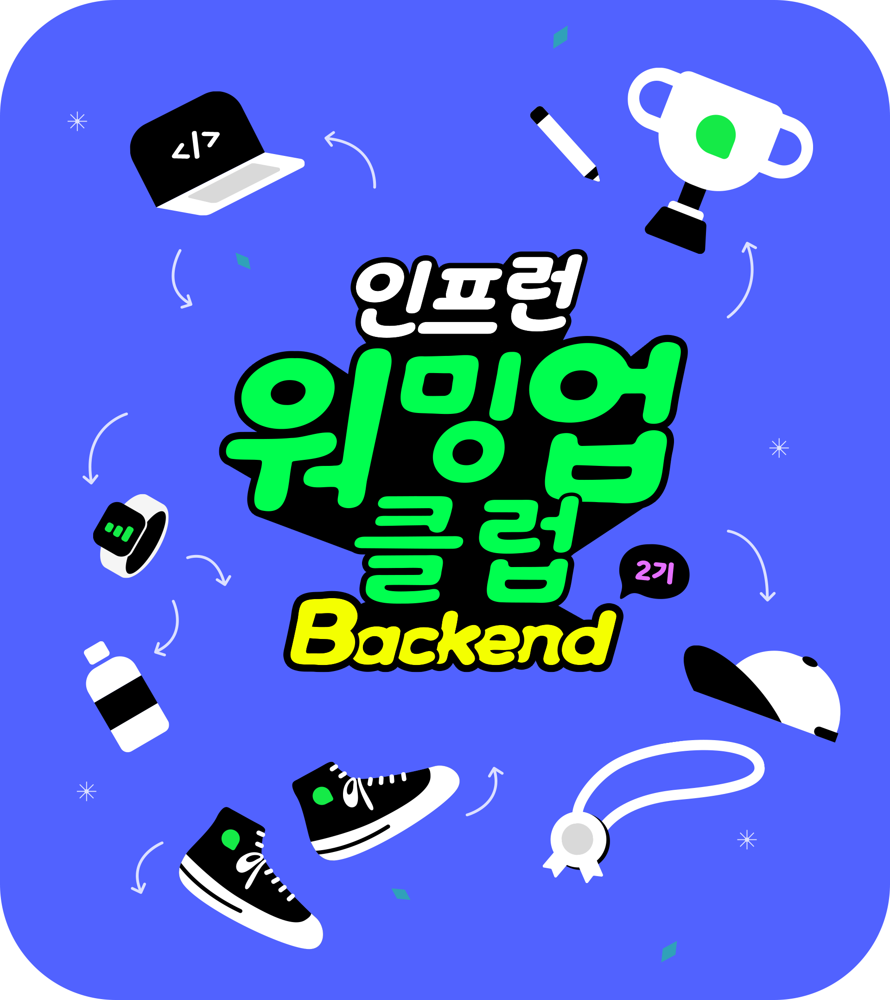

<!--  -->

> 이 블로그 글은 [박우빈님의 인프런 강의](https://inf.run/kHiWM)를 참조하여 작성한 글입니다.

드디어 0기때 이후 첫 발자국을 작성해보는 시간이다. 처음 마음 먹었던 초심을 생각하며 0기때보다 더 나은 활동을 해보자고 다짐하며 이 글을 써내려간다.

## 강의 소개

처음 이 강의를 듣기 전, 나는 아래와 같이 생각했다.

> 🤔 읽기 좋은 코드가 과연 무엇일까? 읽기 좋은 코드는 왜 필요할까?

해당 물음을 가지고 강의를 듣기 시작하였다.

우리는 코드를 작성(쓰기)보단 읽는데 시간을 더 많이 투자한다. 기존 코드에 내 코드를 추가하기 위해 내가 과거에 작성한 코드 혹은 다른 동료분들이 작성한 코드를 읽는다고 해보자. 하지만 이해가 안된다면 다시금 읽게 될 것이다. 그리고 많은 시간 끝에 이해라는 경지에 도달하거나 절망이라는 경지에 도달할 것이다.

결국 코드를 작성한다는 것은 모두가 이해하기 쉬운 읽기 기반의 코드를 작성한다는 의미이다. 그리고 코드를 잘 짠다라고 말하는 것은 결국 읽기가 좋다는 의미이고 읽기 좋은 코드는 결국 미래를 위해 유지보수를 위해 필요한 작업이라고 생각이 든다.

또한 우린 가끔 이런 말을 하곤 한다. 나도 몇번 들었던 말이다.

> 코드는 작성하고 난 순간부터 레거시다.

여기서 레거시란, 오래되고 유지보수가 힘든 코드라고 생각하면 된다. 즉, 우리가 작성한 코드들은 먼 훗날의 레거시 코드가 되고 이 레거시 코드들을 유지보수 할 미래의 나 혹은 동료들을 위해 읽기 쉬운 코드를 작성함이 좋을듯 싶어진다. 나 또한 이번에 **제대로 학습**하여 실무에도 적용해볼 수 있는 기회가 되었으면 한다.

> ✅ 읽기 쉬운 코드 작성하는 현재까지 생각
>
> - 미래를 위해 그래야함
> - 유지보수 하기 좋음
> - 미래의 나와 동료를 위해 읽기 쉬운 **클린코드**를 작성해야함.

## 강의 구성

클린코드, 리팩토링 과정의 최고의 연습은 테스트코드를 작성하는 것이다.

테스트 코드를 작성문화를 가진 기업들은 일반적으로 아래의 절차를 가진다.

> 🛠 리팩토링 프로세스 (주관적인 생각)
>
> 1. 리팩토링 대상/범위 확인
> 2. 기능보장을 위한 테스트 코드 작성
> 3. 리팩토링
> 4. 테스트 코드 검증

위의 프로세스로 리팩토링을 진행하지만 우빈님께서는 현재 테스트코드 없이 진행한다고 하셨다. 또한 롬복도 사용을 하지 않으신다고 하며, 순수코드에 집중한다고 하셨다.

나 또한 이번에 우빈님 말씀대로 순수코드에 집중해보며, 시간과 여유가 있을 시, 내가 스스로 테스트 코드도 작성해봄이 좋을 것 같다!

## 강의에 사용할 용어들

> 📚 용어정리
>
> - 도메인(domain): 실무에 자주 사용되는 말들로, 해결하고자하는 문제영역들을 말한다.(비즈니스 요구사항 함축)
> - 도메인 지식: 도메인을 이해하고 해결하는데 필요한 지식
> - 레거시, 유산: 우리가 현자 가지고 있는 코드 \*
> - 조상: 과거의 나 / 동료 / 이 코드를 작성했던 개발자분들
> - 후손: 미래의 나 / 동료 / 내가 만든 코드들을 보게 될 많은 개발자분들

> 📚 추가 참조
> https://johnlock.tistory.com/405
