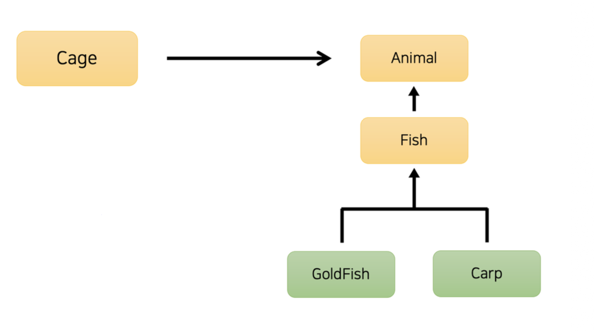
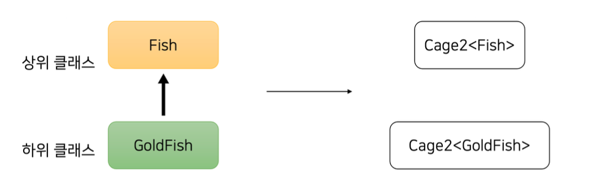
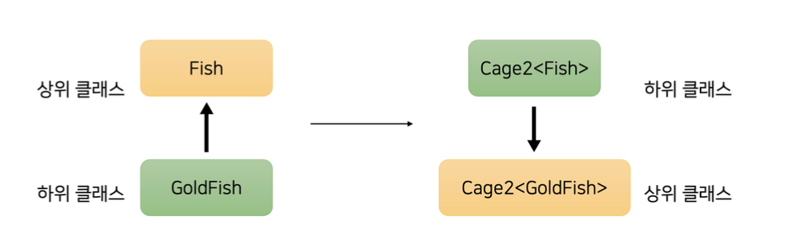

> 해당 포스팅은 인프런의 [코틀린 고급편](https://inf.run/GZfvz) 강의를 참조하여 작성한 글입니다.

## 제네릭과 타입 파라미터

이번 포스팅에서는 제네릭에 대하여 다뤄보도록 하겠다. 먼저 예시를 들면서 설명을 해보도록 하겠다. 아래와 같이 동물들을 넣을 수 있는 `Cage` 클래스가 있다고 하자.

``` kotlin
package me.sungbin.generic

class Cage {

    private val animals: MutableList<Animal> = mutableListOf()

    fun getFirst(): Animal {
        return this.animals.first()
    }

    fun put(animal: Animal) {
        this.animals.add(animal)
    }

    fun moveFrom(cage: Cage) {
        this.animals.addAll(cage.animals)
    }
}
```

당연히 동물도 같이 넣을 수 있어야 하니 `Animal`관련 클래스들도 만들어보겠다.

``` kotlin
package me.sungbin.generic

abstract class Animal(
    val name: String,
)

abstract class Fish(name: String) : Animal(name)

class Goldfish(name: String) : Fish(name)

class Carp(name: String) : Fish(name)
```

위의 클래스들을 도식화 하면 아마 아래와 같은 상속 구조가 나올 것이다.



이제 Cage를 인스턴스화하여 잉어를 넣었다가 빼보자. 그러면 아마 아래와 같은 main함수를 작성할 수 있을 것이다.

``` kotlin
package me.sungbin.generic

fun main() {
    val cage = Cage()
    cage.put(Carp("잉어"))
    val carp: Carp = cage.getFirst() // Error: Type mismatch
}
```

위와 같이 코드를 작성하게 되면 컴파일 오류가 발생한다. 왜냐하면 `put` 함수에서는 인자가 Animal 타입이면 다 들어갈 수 있으니 하위 자식 클래스인 Carp는 들어갈 수 있다. 하지만 꺼낼 때 `getFirst`함수는 반환 타입이 Animal이다. 하지만 받는 변수는 하위 타입이라 Type mismatch가 발생하는 것이다.

이런 에러를 해결하기 위해서는 어떻게 해야할까? 제일 간단한 방법은 아래와 같이 타입 캐스팅을 이용하는 방법일 것이다.

``` kotlin
package me.sungbin.generic

fun main() {
    val cage = Cage()
    cage.put(Carp("잉어"))
    val carp: Carp = cage.getFirst() as Carp
}
```

이렇게 하면 바로 잉어타입을 가져올 수 있다. 하지만 해당 방법은 좋지 못한 방식이다. 왜냐하면 지금은 코드가 몇 줄이 안되서 괜찮지만 누군가가 Carp대신에 다른 클래스를 넣어버리면 바로 깨지는 코드가 발생하는 것이기 때문이다. 그러면 어떻게 type safe하게 잉어만 가져올 수 있을까? 또 다른 방식으로는 타입 캐스팅과 엘비스 연산자를 이용하는 방식이 존재한다. 바로 아래와 같이 말이다.

``` kotlin
package me.sungbin.generic

fun main() {
    val cage = Cage()
    cage.put(Carp("잉어"))
    val carp: Carp = cage.getFirst() as? Carp ?: throw IllegalArgumentException()
}
```

하지만 이 방법은 역시 `as`를 사용했을 때처럼 실수의 여지가 여전히 존재하며 실수로 다른 타입을 넣었을 때 런타임 예외가 발생하게 된다. 그렇다면, 동일한 Cage 클래스이지만 잉어만 넣을 수 있는 Cage, 금붕어만 넣을 수 있는 Cage를 구분하는 방법은 어떨까? 이러한 아이디어로 착안된 것이 바로 **제네릭**이다. 아래와 같이 Cage클래스를 다시 만들어보자.

``` kotlin
package me.sungbin.generic

class Cage2<T> {
    private val animals: MutableList<T> = mutableListOf()

    fun getFirst(): T {
        return this.animals.first()
    }

    fun put(animal: T) {
        this.animals.add(animal)
    }

    fun moveFrom(cage: Cage2<T>) {
        this.animals.addAll(cage.animals)
    }
}
```

이때 특정 타입만 Cage가 받을 수 있도록 처리하기 위해 타입 파라미터를 사용할 것이다. 타입 파라미터를 클래스에 적용하는 방법은 간단하다. 클래스 뒤에 `< >` 를 이용해 대문자를 적어주면 된다. 이렇게 Cage2처럼 타입 파라미터가 적용된 클래스를 제네릭 클래스라고 부르고 `< >`안에 들어간 `T`를 타입 파라미터라고 부른다. 그러면 제네릭 클래스를 통해 잉어를 넣었다가 빼는 코드를 다시 작성해보자.

``` kotlin
package me.sungbin.generic

fun main() {
    val cage2 = Cage2<Carp>()
    cage2.put(Carp("잉어2"))
    val carp2 = cage2.getFirst()
}
```

제네릭을 활용한 덕분에 타입 안전하게 잉어를 가져올 수 있게 되었다. 실제로 이런 제네릭 클래스는 `List`나 `Collection`같은 자바 표준 라이브러리, 코틀린 표준 라이브러리에서 많이 사용된다.

그러면 다음과 같은 요구사항이 추가로 왔다고 해보자.

> 금붕어 한마리를 Cage에 넣고 물고기 Cage에 `moveFrom` 함수를 통하여 금붕어를 옮겨보자.

그러면 우리는 아래와 같이 작성할 수 있을 것이다.

``` kotlin
package me.sungbin.generic

fun main() {
    val cage2 = Cage2<Carp>()
    cage2.put(Carp("잉어2"))
    val carp2 = cage2.getFirst()

    val goldFishCage = Cage2<Goldfish>()
    goldFishCage.put(Goldfish("금붕어"))

    val fishCage = Cage2<Fish>()
    fishCage.moveFrom(goldFishCage) // Error: Type misMatch
}
```

그런데 이상하게 금붕어는 물고기 Cage에 들어갈 수 있을것 같음에도 Type MisMatch가 발생한다. 왜 그럴지 한번 살펴보자.

## 배열과 리스트, 제네릭과 무공변

이전의 문제를 정리해보면 우리는 금붕어 Cage에서 금붕어를 꺼내서 물고기 Cage에 옮길 수 없었다. 그런데 곰곰이 생각을 해보면 그냥 금붕어 자체를 물고기 Cage에 넣는 것은 큰 문제가 없다. 바로 아래처럼 말이다.

``` kotlin
val cage = Cage2<Fish>()
cage.put(GoldFish("금붕어"))
```

즉, 물고기 Cage에 금붕어가 들어가는 것은 큰 문제가 아니다. 그러면 왜 이런 문제가 발생하는 것일까? 문제의 원인을 파악하기 위해서 상속관계의 의미를 파악해야 한다. 예시를 한번 들어보자. 아래와 같이 상속관계가 존재하는 `Number` 클래스와 `Int` 클래스가 있다고 해보자. `Number`는 `Int`의 상위 타입이다. 이럴 때 아래와 같은 코드의 작성이 가능하다.

``` kotlin
fun doSomething(num: Number) {
    // TODO()
}

val a: Int = 3
doSomething(a)
```

`Number`타입을 받는 파라미터에 하위 타입인 `Int`가 들어가도 무방하다. 또한 아래와 같은 경우도 충분히 가능하다.

``` kotlin
val integer: Int = 5
val number: Number = integer
```

너무 당연한 이야기다. 그러면 다시 문제의 코드를 한번 살펴보도록 하자.

``` kotlin
package me.sungbin.generic

fun main() {
    val cage2 = Cage2<Carp>()
    cage2.put(Carp("잉어2"))
    val carp2 = cage2.getFirst()

    val goldFishCage = Cage2<Goldfish>()
    goldFishCage.put(Goldfish("금붕어"))

    val fishCage = Cage2<Fish>()
    fishCage.moveFrom(goldFishCage) // Error: Type misMatch
}
```

cage의 타입 파라미터는 `Fish`이므로 `moveFrom` 함수에서 파라미터 타입은 `Cage2<Fish>`가 된다. 그리고 이 함수에 넣으려는 goldFishCage는 `Cage2<GoldFish>` 타입을 가지고 있고 Type MisMatch가 발생하는 것이다. 따라서 `Fish`와 `GoldFish`는 상속 관계가 확실하지만 `Cage2<Fish>`와 `Cage2<GoldFish>`는 아무런 관계가 아닌 것을 볼 수 있다. 즉, 상속관계가 아닌 아무런 관계가 아니기 때문에 Type MisMatch가 발생한 것이다.



이것을 어려운 용어로 **무공변**하다라고 의미한다. 그러면 왜 `Fish`와 `GoldFish`의 상속관계가 제네릭에서는 왜 유지가 되지 않을까? 이것을 이해하기 위해서는 잠시 자바코드를 살펴볼 필요성이 있다. 잠시 자바의 배열과 리스트에 대해 살펴보고 이야기를 진행해보도록 하겠다.

자바에서 배열은 제네릭과 다르다. 자바에서 A객체가 B객체의 하위타입일 때 A 배열이 B 배열의 하위타입으로 간주를 시킨다. 즉, 아래와 같은 코드가 가능하게 되는 것이다.

``` java
public static void main(String[] args) throws IOException {
String[] strs = new String[]{"A","B","C"};
// Object가 String의 상위 타입이므로 Object[]가 String[]의 상위 타입으로 간주된다.
// 따라서 objs에 strs를 대입할 수 있다.
Object[] objs = strs;
objs[0] = 1; // java.lang.ArrayStoreException: java.lang.Integer
}
```

이는 어려운 말로 자바 배열은 **공변**하다라고 표현한다. 즉, `Object[]`타입은 사실 `String[]`인데 숫자를 넣을 수 있는 말도 안되는 상황이 벌어지는 것이다. 이러한 코드는 컴파일 타임에서는 괜찮지만 런타임때 예외를 발생시킬 수 있으므로 굉장히 위험하다.

반면 `List`는 다르다. `List`는 제네릭을 사용하고 있으므로 불공변하기 때문에 오류를 즉각적으로 확인할 수 있다. 만약 제네릭도 배열과 같은 원리로 동작했다면, List 역시 배열과 같은 결함을 가지게 되고 타입-안전하지 않은 코딩을 해야 했을 것이다. 제네릭은 이런 결함 자체를 막기 위해 무공변하도록 만들어졌다.

> 이러한 차이가 바로, 배열보다 리스트를 사용하라는 격언의 배경이기도 하다. (Effective Java #3 Item28)

그러면 왜 금붕어 Cage에서 물고기 Cage로 옮기지 못하는 이유는 납득이 되었다. 하지만 문제는 해결되지 못했다. 사실 코틀린 제네릭이 공변한다라고 가정해도 전혀 문제가 될 것은 없기 때문이다. 어떻게 문제를 해결할 수 있을까? 바로 `Cage2<Fish>`와 `Cage2<GoldFish>`가 공변하도록 만들어주는 것이다.

## 공변과 반공변

그러면 이제 Cage2 클래스에 `moveFrom` 함수를 공변하도록 만들어보자. 이 함수를 공변하게 만든다면 해당 함수를 호출할 때 `Cage2<Fish>`는 `Cage2<GoldFish>`의 상위타입이 되며 우리의 문제를 해결할 수 있게 된다.

방법은 매우 간단하다. 바로 타입 파라미터 앞에 `out`이라는 키워드를 아래와 같이 붙여주면 된다.

``` kotlin
fun moveFrom(otherCage: Cage2<out T>) {
    this.animals.addAll(otherCage.animals)
}
```

이때 `out`을 **변성 어노테이션**이라고 부른다. 이렇게 되면 이 함수를 호출할 때 `Cage2`가 공변하게 되고 우리의 문제를 바로 해결이 가능하다. 이제 `out`의 의미에 대해 조금 더 자세히 살펴보도록 하겠다. 이렇게 `out` 변성 어노테이션이 붙은 파라미터는 오직 생산자의 역할만 할 수 있다. 생산자의 역할만 할 수 있다는 것은 데이터를 꺼내기만 가능하다는 의미이다. 한번 코드를 통해서 알아보도록 하겠다.

``` kotlin
fun moveFrom(otherCage: Cage2<out T>) {
    this.animals.addAll(otherCage.animals)
}
```

위의 함수의 타입 파라미터에 변성 어노테이션을 붙였기에 `otherCage`입장에서는 데이터를 꺼내기만 할 수 있다. 즉, `Cage2`클래스의 함수중에서 데이터를 꺼내는 함수인 `getFirst()`와 getter만 해당 함수에서 호출할 수 있다라는 의미이다. 만약 아래와 같이 데이터를 소비하려고 한다면 즉, 소비자 역할을 시키려고 한다면 에러가 발생한다.

``` kotlin
fun moveFrom(otherCage: Cage2<out T>) {
    otherCage.put(getFirst()) // 에러
    this.animals.addAll(otherCage.animals)
}
```

그러면 왜 `out`을 붙이면 생산자 역할만 할 수 있을까? 그 이유는 바로 타입 안정성때문이다. 만약 공변하는 `Cage2` 클래스에 animal을 집어넣을 수 있다라고 해보자. 즉, otherCage가 데이터를 가져가는 소비자 역할도 하게 되는 것이다. 즉 아래의 코드가 정상 동작한다라고 해보자.

``` kotlin
fun moveFrom(otherCage: Cage2<out T>) {
    otherCage.put(getFirst()) // 정상 동작 가정
    this.animals.addAll(otherCage.animals)
}
```

그리고 아래의 코드를 실행한다라고 해보자.

``` kotlin
val goldFishCage = Cage2<GoldFish>()
goldFishCage.put(GoldFish("금붕어"))

val cage2 = Cage2<Fish>()
cage2.put(Carp("잉어"))
cage2.moveFrom(goldFishCage)
```

이렇게 되면 otherCage가 `Cage2<GoldFish>`인 상황에서 otherCage에 `Carp`를 넣으려고 하게 된다. 하지만 otherCage에는 GoldFish만 들어갈 수 있을 뿐 Carp를 넣을 수 없다. 따라서 `otherCage.put(getFirst())`를 허용해준다면 타입 안정성이 깨지고 런타임 에러가 발생하게 된다.

이번에는 반대의 경우를 한번 생각해보자. 주어진 Cage에서 동물을 현재 Cage로 옮겨오는 `moveFrom` 함수 대신에 현재 Cage에서 동물을 주어진 Cage로 보내는 `moveTo`함수가 존재한다고 해보자. 변성을 고려하지 않는다면 아래와 같이 작성이 가능할 것이다.

``` kotlin
fun moveTo(otherCage: Cage2<T>) {
    otherCage.animals.addAll(this.animals)
}
```

그러면 이 코드 역시 아래와 같은 코드가 작성이 된다.

``` kotlin
val myCage = Cage2<Fish>()

val goldFishCage = Cage2<GoldFish>()
goldFishCage.put(GoldFish("금붕어"))
goldFishCage.moveTo(myCage) // Type Mismatch
```

이 코드 역시 실행되더라도 큰 문제는 없어 보인다. 금붕어 Cage에서 금붕어를 꺼내 물고기 Cage로 옮겨주고 있기 때문이다. 하지만 현재는 무공변상태이므로 할 수가 없다. 이번에는 `out`이라는 변성 어노테이션을 붙여주는 것으로 할 수가 없다. `Cage2<GoldFish>`자리에 `Cage2<Fish>`가 들어가야 하기 때문이다. 즉, Fish가 GoldFish의 상위 타입일 때 반대가 되어야 한다. 이를 어려운 말로 **반공변**하다라고 표현한다.



이때는 `out` 대신에 `in`을 사용할 수 있다.

``` kotlin
fun moveTo(otherCage: Cage2<in T>) {
    otherCage.animals.addAll(this.animals)
}
```

이렇게 `in` 변성 어노테이션이 붙은 매개변수는 `out`과 다르게 소비자 역할만 할 수 있다. 즉, `put`이나 `moveFrom`같은 것만 호출할 수 있다라는 의미이다.

## 선언 지점 변성 / 사용 지점 변성

우리는 이전까지 특정 함수를 사용할 때에만 제네릭 클래스에 변성을 부여하였다. 우리가 사용한 방식을 적절히 이용만 한다면 함수를 사용할 때 말고 변성을 적절히 이용할 수 있다. 아래의 코드를 살펴보자.

``` kotlin
val int: Int = 1_000
val num: Number = int
```

`Int`타입의 변수 int를 `Number` 타입의 변수 `num`에 넣었다. `Int`는 `Number`의 하위타입이기 때문에 가능한 문법이다. 비슷하게 `out` 변성 어노테이션을 이용한다면 제네릭 클래스간에 상속관계를 만들 수 있다.

``` kotlin
val goldFishCage: Cage2<GoldFish> = Cage2()
val fishCage: Cage2<out Fish> = goldFishCage
```

`out` 변성 어노테이션을 이용하여 `Cage2<GoldFish>`를 `Cage2<out Fish>`의 하위 타입으로 만든 것이다. 만약 자바를 배우신 독자라면 위의 구조와 비슷한 문법을 보셨을 것이다. 바로 아래와 같이 말이다.

``` java
List<Integer> ints = List.of(1, 2, 3);
List<? extends Number> nums = ints;
```

위의 코드에서 `out` 대신에 `? extends Number`가 들어갔다. 해당 의미는 리스트에 `Number` 혹은 해당 하위 타입이 들어갈 수 있다라는 의미이다. 이와 비슷하게 자바에서는 `? super T`라는 문법도 존재하는데 코틀린에서는 `in T`와 같은 역할을 한다. 이렇게 특정 지점에 변성을 주는 방식은 유용하지만 조금 복잡하게 생긴 타입이 계속해서 퍼진다는 것은 다소 번거롭게 느껴진다. 그러면 이를 해결할 방법은 없을까? 즉, 복잡한 타입을 계속해서 퍼지게 하는 대신에 제네릭 클래스 자체를 공변시키거나 반공변시킬 수는 없을까?

자바에서는 불가능하지만 코틀린에서는 가능하다. 만약 `Cage3` 클래스가 있고 거기에 생산자 역할 함수만 있다고 했을 때 아래와 같이 가능하다.

``` kotlin
package me.sungbin.generic

class Cage3<out T> {
    private val animals: MutableList<T> = mutableListOf()

    fun getFirst(): T {
        return this.animals.first()
    }

    fun getAll(): List<T> {
        return this.animals
    }
}
```

위와 같이 `out` 변성 어노테이션을 클래스 타입 파라미터에 붙이면 해당 클래스는 그 타입 파라미터에 대해 데이터 생산만이 가능하고 클래스 전체에 공변을 적용한다. 물론 반대로 반공변도 아래와 같이 가능하다. 반대인 만큼 생산대신에 소비하는 함수만 있어야 한다.

``` kotlin
package me.sungbin.generic

class Cage4<in T> {
    private val animals: MutableList<T> = mutableListOf()

    fun put(animal: T) {
        this.animals.add(animal)
    }

    fun putAll(animals: List<T>) {
        this.animals.addAll(animals)
    }
}
```

이렇게 클래스 타입 파라미터에 변성 어노테이션을 사용해 클래스간의 상속관계를 구성하는 것을 **선언 지점 변성**이라고 부르고 특정 지점에 한정해 변성을 주는 것을 **사용 지점 변성**이라고 부른다.

> 선언 지점 변성은 자바에서는 존재하지 않고 코틀린에서만 존재한다.

그러면 코틀린 표준 라이브러리에서 선언 지점 변성을 어떻게 사용하고 있을까? 대표적으로 `Comparable` 인터페이스가 존재한다.

``` kotlin
public interface Comparable<in T> {
    public operator fun compareTo(other: T): Int
}
```

Comparable은 데이터를 받기만 하므로 in 변성 어노테이션을 클래스에 사용했다. 데이터를 생산만 하는 대표적인 인터페이스로는 `List`가 존재한다. 코틀린의 `List`는 자바와 달리 불변 컬렉션이기 때문에 아래와 같이 생산자 역할만 하는 함수만 존재한다.

``` kotlin
public interface List<out E> : Collection<E> {
    // Query Operations
    override val size: Int
    override fun isEmpty(): Boolean
    override fun iterator(): Iterator<E>
    public operator fun get(index: Int): E
    // 생략...
}
```

그런데 `List`를 잘 생각해보면 불변 컬렉션일지라도 생산자 역할만 하지는 않는다. `contains`라던지 `containsAll` 함수가 존재하기 때문이다.

``` kotlin
public interface List<out E> : Collection<E> {
    override fun contains(element: @UnsafeVariance E): Boolean
    override fun containsAll(elements: Collection<@UnsafeVariance E>): Boolean
}
```

여기서 우리는 `@UnsafeVariance` 어노테이션을 확인할 수 있다. 이 어노테이션은 안전하지 않은 변성을 감수하고, 타입 어노테이션을 다른 곳에 사용할 수 있도록 해준다. 예를 들어, List 인터
페이스는 out 선언 지점 변성이 걸려 있어 데이터를 생산만 할 수 있지만, `contains()`나 `containsAll()`처럼 소비도 하고 싶은 경우에는 `@UnsafeVariance`를 사용해 함수를 구현할 수 있는 것이다. 당연하게도, 해당 함수를 구현할 때 타입 안정성을 신경 써야 한다.

## 제네릭 제약과 제네릭 함수

이번에는 제네릭 제약과 제네릭 함수에 대해 알아보자. 이전 `Cage5` 클래스를 살펴보자. `Cage5` 클래스에는 타입 파라미터로 Animal 클래스의 하위 타입만 받고 싶다. 하지만 실제로는 `Int`나 `String`과 같은 타입도 들어갈 수 있다. 어떻게 하면 타입 파라미터 T에 Animal과 Animal의 하위 타입만 들어오게 할 수 있을까? 바로 타입 파라미터에 제약을 주면 된다. 이것을 **제네릭 제약**이라고 부른다.

제네릭 제약을 부여하는 방법은 아래와 같이 타입 상한을 지정해주면 된다.

``` kotlin
class Cage5<T : Animal> {
    private val animals: MutableList<T> = mutableListOf()
}
```

위와 같이 되면 `Int`나 `String`과 같은 타입은 못 들어오고 `Animal` 타입이거나 그 하위 타입만 들어올 수 있다. 만약, 타입 파라미터에 여러 제약을 두고 싶은 경우는 어떻게 할까? 여러 제약이 있을 경우 문법이 달라지는데 아래와 같이 변경이 가능하다.

``` kotlin
package me.sungbin.generic

class Cage5<T>(
    private val animals: MutableList<T> = mutableListOf()
) where T : Animal, T : Comparable<T> {
    fun getFirst(): T {
        return this.animals.first()
    }

    fun put(animal: T) {
        this.animals.add(animal)
    }

    fun moveFrom(otherCage: Cage5<T>) {
        this.animals.addAll(otherCage.animals)
    }

    fun moveTo(otherCage: Cage5<T>) {
        otherCage.animals.addAll(this.animals)
    }

    fun printAfterSorting() {
        this.animals.sorted()
            .map { it.name }
            .let { println(it) }
    }
}
```

위의 예시는 타입 파라미터가 `Animal`이거나 그 하위 타입이어야 하며 `Comparable`을 구현하고 있어야 한다. 그리고 `Comparable`을 구현하니 `printAfterSorting`과 같이 정렬 기능도 만들 수 있다.

제네릭 제약은 타입 파라미터에 `non-nullable` 타입만 들어오게 제약도 할 수 있다. 이전에 만든 `Cage2` 클래스는 `Cage2<Animal>`도 가능하지만 `Cage2<Animal?>`도 가능하다. 만약 non-nullable하게 제약을 두고 싶다면 아래와 같이 `Any`를 상속하게 하면 된다.

``` kotlin
package me.sungbin.generic

class Cage2<T : Any> {
    private val animals: MutableList<T> = mutableListOf()

    fun getFirst(): T {
        return this.animals.first()
    }

    fun put(animal: T) {
        this.animals.add(animal)
    }

    fun moveFrom(otherCage: Cage2<out T>) {
        this.animals.addAll(otherCage.animals)
    }

    fun moveTo(otherCage: Cage2<in T>) {
        otherCage.animals.addAll(this.animals)
    }
}
```

타입 파라미터를 `Any` 타입의 하위 타입으로 제한하여 nullable한 타입을 못 들어오게 막는 것이다. 더 하나 살펴보자. 사실 이전에 사용한 `sorted`도 제네릭을 활용한 함수이다.

``` kotlin
public fun <T : Comparable<T>> Iterable<T>.sorted(): List<T> {
    if (this is Collection) {
        if (size <= 1) return this.toList()
        @Suppress("UNCHECKED_CAST")
        return (toTypedArray<Comparable<T>>() as Array<T>).apply { sort() }.asList()
    }
    return toMutableList().apply { sort() }
}
```

우리가 클래스에 제네릭을 사용했던 것과 매우 유사하다. 단지 fun 키워드와 함수 사이에 타입 파라미터 `<T>`가 들어가는 차이가 있다. 이런 제네릭 함수를 사용하면 유틸성 기능을 개발하는 데 유용하다. 바로 아래와 같이 말이다.

``` kotlin
fun <T> List<T>.hasIntersection(other: List<T>): Boolean {
    return (this.toSet() intersect other.toSet()).isNotEmpty()
}
```

이런 제네릭 함수는 확장 함수는 물론, 일반 함수에도 적용할 수 있다.

## 타입 소거와 Star Projection

지금까지 우리는 제네릭에 대한 다양한 개념들을 학습했다. 그런데 사실 제네릭이라는 개념 자체가 JDK 초기부터 있었던 것은 아니다. 제네릭은 JDK1.5부터 도입이 되었으며 Java5버전 컴파일러와 가상머신은 기존 코드와의 하위 호환성을 유지해야 했다. 기존 코드는 타입 인자 자체가 없었고, 하위 호환성을 위해 JVM 진영에서는 런타임 때 타입 정보를 제거하기로 결정했다. 런타임때 타입 정보를 제거하면 타입 정보가 없는 코드나 있는 코드나 동일하게 처리할 수 있었기 때문이다.

실제로 자바에서 `List<Integer>`처럼 타입 파라미터를 넣지 않고 타입 정보가 없는 `List` 타입을 만들 수 있다.

``` java
List numbers = List.of(1, 2, 4);
```

물론, 타입 정보가 없으면 컴파일을 하는 시점에 타입 체크를 할 수 없고 타입 안정성이 현저히 떨어지기에 현재는 권장되지 않는다. 여기서 코틀린과 자바의 차이가 한 가지 더 발생한다. 코틀린은 언어를 설계할 때부터 제네릭을 염두했기 때문에 타입 정보가 없는 raw type 제네릭 클래스 인스턴스를 만들 수 없다. 하지만, 코틀린 역시 JDK 위에서 동작하기 때문에 자바와 마찬가지로 런타임 때는 타입 정보를 잃어버리게 된다. 이를 어려운 말로 **타입 소거**라고 한다.

타입 소거를 확인할 수 있는 대표적인 코드를 살펴보자. 아래의 코드를 살펴보자.

``` kotlin
fun checkStringList(data: Any) {
    if (data is List<String>) { // Error: Cannot check for instance of erased type: List<String>
    }
}
```

위의 코드는 파라미터로 들어오는 타입이 `List<String>`인지 확인하고 싶어하는 코드이다. 하지만 실제 타입 소거로 `List<String>`인지는 확인이 불가능하다. 이럴때 코틀린에서는 `List`인지라도 확인만이라도 하고 싶을때 스타 프로젝션을 이용할 수 있다.

``` kotlin
fun checkList(data: Any) {
    if (data is List<*>) { // data가 List인지 확인할 수 있다.
    }
}
```

이때 `<*>`을 스타 프로젝션이라고 부르고 해당 타입 파라미터에 어떤 타입이 들어 있을지 모른다는 뜻으로 생각할 수 있다. 이렇게 스타 프로젝션을 사용하면 data는 List의 기능들을 활용할 수 있다. 바로 아래처럼 말이다.

``` kotlin
fun checkList(data: Any) {
    if (data is List<*>) {
        val element: Any? = data[0]
    }
}
```

리스트에 있는 데이터는 가져올 수 있다. 다만, 해당 타입이 어떠한 타입인지 확인이 불가능하기 때문에 `Any?`로 받는 것뿐이다. 이렇게 타입이 정확히 알기 어렵기 때문에 아래와 같은 문법은 사용이 어렵다.

``` kotlin
fun checkMutableList(data: Any) {
    if (data is MutableList<*>) {
        data.add(3)
    }
}
```

위의 코드는 들어오는 data가 `MutableList`타입인지 확인하는 구문이다. 그런데 정확히 타입을 알기 어렵기 때문에 추가하는 `add`같은 것들은 막혀있다. 왜냐하면 실제 `MutableList` 타입과 다른 타입의 원소를 넣을 수 있고 그렇게 되면 타입 안정성을 헤치기 때문이다. 다행히, 때때로 코틀린 컴파일러가 제네릭 타입 파라미터까지 추측 가능한 경우도 있다. 바로 아래와 같은 경우이다.

``` kotlin
fun checkMutableList(data: Collection<String>) {
    if (data is MutableList<String>) {
        data.add("Hello World")
    }
}
```

이 코드에서는 checkMutableList의 파라미터를 받을 때부터 `Collection<String>`으로 타입을 확인하고 있기 때문에 타입 추론이 가능한 것이다.

런타임때 타입이 소거되는 것은 제네릭 함수도 마찬가지다. 그래서 아래와 같은 함수는 문법적으로 불가능하다.

``` kotlin
fun <T> T.toSuperString(): String {
    println(T::class.java.name) // T가 무엇인지 런타임 때도 알 수 없기 때문에 오류가 난다
    return "Super $this"
}
```

이 코드에서 우리는 타입 파라미터인 T 정보가 런타임 때 소거되기 때문에 T 가 어떤 타입인지 알 수 없다. 따라서 `T::class.java.name`과 같은 코드를 수행할 수 없다.

> `::class.java`는 리플렉션과 관련된 기능으로, 해당 클래스의 정보를 가져온다고 생각하면 된다.

하지만, 때때로 우리는 T의 정보를 가져오고 싶을 때가 있다. 바로 아래와 같은 경우이다.

``` kotlin
// 우리가 원하는 형태
fun <T> List<*>.hasAnyInstanceOf(): Boolean {
    return this.any { it -> it is T }
}

// 각 타입별로 만드는 방법
fun List<*>.hasAnyInstanceOfString(): Boolean {
    return this.any { it is String }
}

fun List<*>.hasAnyInstanceOfInt(): Boolean {
    return this.any { it is Int }
}
```

실제 첫번째 케이스는 불가능하기 때문에 우리는 해당 로직을 구현하려면 각 타입별로 만드는 방법인데 이것은 매우 비효율적인것 같다. 이럴 때 바로 `reified` 키워드와 `inline 함수`를 사용할 수 있다. `inline 함수`는 함수의 본문을 함수 호출 지점에 옮기는 특성을 가지고 있는데, 이 특성을 활용하면 주어진 제네릭 타입 정보를 알 수 있다. 실제로는 inline 함수의 본문이 호출지점에 옮겨갈 테니 타입 정보도 본문 지점에 정적으로 존재할 수 있게 되는 것이다.

``` kotlin
inline fun <reified T> T.toSuperString() {
    println("${T::class.java.name}: $this")
}

inline fun <reified T> List<*>.hasAnyInstanceOf(): Boolean {
    return this.any { it is T }
}
```

이렇게 되면 inline 함수 내에서 주어진 원소가 T 타입인지 확인할 수도 있고, T 타입의 정보를 가져올 수도 있다. 물론, `reified` 키워드가 만능은 아니다. `refieid` 키워드가 붙은 타입을 이용해 해당 클래스의 생성자를 호출하거나 해당 클래스에 존재하는 동반 객체(companion object)에는 접근할 수 없다. 또한, 최초의 타입 파라미터의 정보가 소실된다면 해당 타입 파라미터를 이용해 `reified` 키워드가 붙은 타입 파라미터로 사용할 수도 없다.

``` kotlin
fun <T> List<*>.hasAnyInstanceOf(): Boolean {
return this.filterIsInstance<T>() // 여기에 T를 사용할 수 없다.
        .isNotEmpty()
}
```

## 간단한 팁

### 타입 파라미터 셰도잉

아래의 코드를 보자.

``` kotlin
class Cage<T : Animal> {
    fun <T : Animal> addAnimal(animal: T) {
    }
}
```

위의 코드에 잘못된 점이 무엇일까? Cage에 사용된 타입 파라미터 T 와 addAnimal에 사용된 타입 파라미터 T가 독립적이라는 것이다. 때문에 아래의 잘못된 코드가 정상 동작하는 것이다.

``` kotlin
fun main() {
    val cage = CageShadow<Goldfish>()
    cage.addAnimal(Goldfish("금붕어"))
    cage.addAnimal(Carp("잉어"))
}
```

이런 경우를 **타입 파라미터 섀도잉**이라고 한다. 우리가 함수 파라미터와 같은 이름의 변수를 함수 지역 변수로 쓸 때 함수 파라미터가 무시되는 것처럼 클래스와 함수에서 같은 타입 파라미터 T를 사용하게 되면 더 큰 범위인 클래스의 타입 파라미터가 무시되는 것이다. 결론적으로 타입 파라미터 셰도잉은 의도하지 않는 동작을 불러일으킬 수 있기 때문에 피하는 것이 좋다. 차라리 아래처럼 코드를 작성하는 것이 좋다.

``` kotlin
class Cage<T : Animal> {
    fun addAnimal(animal: T) {

    }
}
```

### 제네릭 클래스 상속

제네릭 클래스 역시 상속이 가능하다. 아래의 코드가 있다고 하자.

``` kotlin
open class CageV1<T : Animal> {
    open fun addAnimal(animal: T) {

    }
}
```

위의 클래스를 상속받는 클래스를 만든다고 해보자. 방법은 총 2가지가 존재한다. 먼저 첫번째 방법은 상속할 때 상위 클래스 타입을 적을 때 타입 파라미터도 함께 사용하는 방법이다.

``` kotlin
class CageV2<T: Animal> : CageV1<T>()
```

두번째 방법으로 상위 클래스 타입을 적을 때 타입 파라미터 대신 특정 타입으로 구체화할 수도 있다. 바로 아래와 같이 말이다.

``` kotlin
class GoldFishCageV2 : CageV1<Goldfish>() {
    override fun addAnimal(animal: Goldfish) {

    }
}
```

### 제네릭과 Type Alias

Type Alias와 제네릭을 함께 사용하는 방법을 알아보자. 코틀린에는 Type Alias 라는 기능이 있어 특정 타입을 간단한 이름으로 축약할 수 있다. 제네릭을 사용할 때 타입 이름이 길어질 수 있다는 점을 고려하면 제네릭과 Type Alias는 좋은 조합이다. 예를 들어 아래와 같은 타입이 있다고 해보자.

``` kotlin
fun handleCacheStore(store: Map<PersonDtoKey, MutableList<PersonDto>>) {
}
```

이럴 때 type alias를 사용하면 제네릭으로 길어진 타입을 적절한 타입 이름 대체할 수 있다.

``` kotlin
typealias PersonDtoStore = Map<PersonDtoKey, MutableList<PersonDto>>

fun handleCacheStore(store: PersonDtoStore) {
}
```