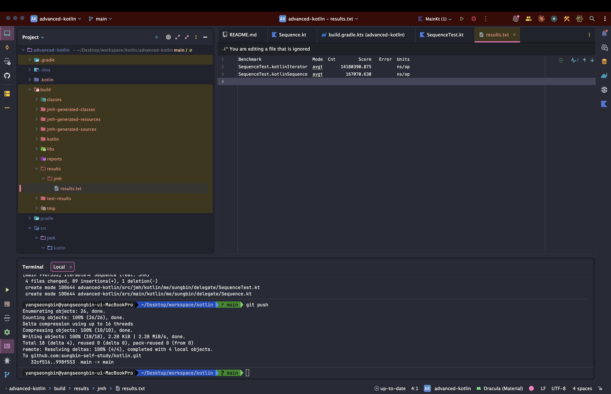

> 해당 포스팅은 인프런의 [코틀린 고급편](https://inf.run/GZfvz) 강의를 참조하여 작성한 글입니다.

## lateinit과 lazy()

일반적으로 코틀린에서 클래스를 생성할 때 주 생성자를 만들며 프로퍼티를 선언한다. 아래와 같이 말이다.

``` kotlin
class Person(
    val name: String,
) {
    val isKim: Boolean
        get() = this.name.startsWith("김")
    val maskingName: String
        get() = name[0] + (1 until name.length).joinToString("") { "*" }
}
```

위의 클래스는 `Person("양성빈")`과 같은 코드로 인스턴스화를 진행할 수 있는데 이 때 클래스 인스턴스화가 이루어짐과 동시에 name에는 양성빈이라는 값이 들어간다. 하지만 우리는 인스턴스 생성과 초기화 부분을 분리하고 싶은 욕구가 있을 때가 있다. 아래의 테스트 코드를 한번 보자.

``` kotlin
class PersonTest1 {

    @Test
    fun isKimTest() {
        // given
        val person = Person("김수한무")
        // when & then
        assertThat(person.isKim).isTrue
    }

    @Test
    fun maskingNameTest() {
        // given
        val person = Person("양성빈")
        // when & then
        assertThat(person.maskingName).isEqualTo("양**")
    }
}
```

위의 테스트 코드를 보면 테스트 메서드마다 person을 인스턴스화 하고 있다. 또한 인스턴스화를 하는데 초기 값이 테스트 코드마다 다르다. 여기서 우리는 조금 더 효율적으로 작성하기 위해 아래와 같은 욕구가 생길 것이다.

- 인스턴스화를 한 번만 하고, 테스트를 할 때에 변수를 초기화하고 싶다.
- 또한, 인스턴스화를 할 때 초기값을 넣어주고 싶지도 않다.

가장 간단한 방법은 생성을 할 때 name에 default parameter를 주어서 기본 값을 세팅해주는 방법이 있을 것이다. 그러면 아마 아래와 같이 코드를 변경해야 할 것이다.

``` kotlin
class Person {
    var name: Stirng = "홍길동"
}
```

``` kotlin
class PersonTest2 {
    private val person = Person() // 객체 변수를 만들 때 초기값을 넣지 않았다.

    @Test
    fun isKimTest() {
        assertThat(person.apply { name = "김수한무" }.isKim).isTrue
    }
    @Test
    fun maskingNameTest() {
        assertThat(person.apply { name = "양성빈" }.maskingName).isEqualTo("최**")
    }
}
```

위의 코드는 겉보기에는 괜찮은 코드로 보일 것이다. 하지만 이 코드는 위험이 잠재되어 있는 코드이다. 누군가가 Person을 인스턴스화를 한 뒤에 name을 초기화하지 않고 사용할 수도 있는 것이다. 그러면 예외라도 터져야 하는데 기본 값이 세팅이 됨으로 예외는 터지지 않으니 엄청 문제가 많은 코드가 되는 것이다. 즉 클래스를 인스턴스화할 때 임의의 값을 넣었다가, 나중에 값을 변경해주는 방법은 때때로 위험할 수 있다.

이런 위험성을 해결하기 위해서 실제 name은 null이 될 수 없지만, nullable 변수로 만들 수 있다. 바로 아래와 같이 작성하면 누군가가 초기화를 하지 않았을 때 예외를 터지게 할 수 있다.

``` kotlin
class Person {
    var name: String? = null
    
    val isKim: Boolean
        get() = this.name!!.startsWith("김")
    
    val maskingName: String
        get() = name!![0] + (1 until name!!.length).joinToString("") { "*" }
}
```

하지만 이 방법 역시 단점이 존재한다. 실제로 null이 될 수 없는 name을 null이 들어갈 수 있는 타입인 `String?`로 null처리를 하여 널 관련 처리를 해줘야 한다. 상황에 따라 Safe Call ( ?. ) 엘비스 연산자, 널 아님 단언이 지속적으로 들어가야 한다.

핵심은 객체의 인스턴스화 시점과 변수 초기화 시점을 분리하고 싶다는 점이다. 이럴 때 바로 코틀린에서 `lateinit`이라는 키워드를 제공해준다. `lateinit` 키워드를 `var` 변수 앞에 붙이게 되면, 이 변수는 다음과 같은 특징을 갖게 된다.

- 초기값을 지정하지 않고, null이 들어갈 수 없는 변수를 선언할 수 있다.
- `var` 변수이므로 언제든지 값을 변경할 수 있다.
- 초기값이 지정되지 않은 채로 해당 변수를 사용하려 하면 `UninitializedPropertyAccessException` 예외가 발생한다.

그러면 이런 의문점이 들 것이다. `lateinit`은 어떻게 이런 특징을 가지게 할 수 있을까? 비밀은 바로 컴파일 단계에 존재한다. `lateinit` 변수가 존재하면 코틀린은 컴파일을 할 때에 이 변수에 null을 저장할 수 있게 해주고, getter에서 변수 값이 null인지 확인해 예외를 던지거나 값을 정상 반환시킨다. 아래 코드는 컴파일된 코틀린 코드를 decompile로 확인한 코드이다.

``` kotlin
package me.sungbin.delegate

class Person {
    lateinit var name: String

    val isKim: Boolean
        get() = this.name.startsWith("김")

    val maskingName: String
        get() = name[0] + (1 until name.length).joinToString("") { "*" }
}
```

``` java
public final class Person {
    public String name;
    
    @NotNull
    public final String getName() {
        String var10000 = this.name;
        if (var10000 == null) {
            Intrinsics.throwUninitializedPropertyAccessException("name");
        }

        return var10000;
    }

    public final void setName(@NotNull String var1) {
        Intrinsics.checkNotNullParameter(var1, "<set-?>");
        this.name = var1;
    }
}
```

이런 원리로 인해, `lateinit` 변수는 `Int`나 `Long`과 같은 primitive type에 사용할 수 없다. `Int`나 `Long`은 `Int?`와 `Long?`과 다르게 null을 저장할 수 없어야 하는데, `lateinit var Int`나 `lateinit var Long`을 사용한다면 컴파일이 되었을 때 null을 저장할 수 있어야 하기 때문이다. primitive type의 컴파일 원리와 `lateinit`의 컴파일 원리가 모순되는 것이다.

이번에는 다른 관점에서 한번 살펴보자. 객체의 인스턴스화 시점과 초기화 시점을 분리하되, 최초로 변수를 사용할 때 지정된 로직을 1회만 실행시켜 값을 가져오고 싶다라는 니즈가 있다고 해보자. 이런 경우는 특정 값을 가져오는 비용이 크고 해당 변수가 사용되지 않을 수도 있다라면 이런 특성이 필요해진다. 예를 들어 사람의 이름을 File을 통해 읽어야 하는데 I/O 비용이 2초정도 걸린다고 해보자. 그러면 우리는 예시 코드를 아래와 같이 작성할 수 있을 것이다.

``` kotlin
class Person {
    val name: String
    get() {
        Thread.sleep(2_000)
        return "김수한무"
    }
}
```

혹은 아래와 같이 작성 할 수도 있을 것이다.

``` kotlin
class Person {
    val name: String
    
    init {
        Thread.sleep(2_000)
        name = "김수한무"
    }
}
```

첫번째 방식은 name을 사용하지 않으면 `Thread.sleep`이 호출되지 않는 장점이 있다. 하지만 name이 사용될 때마다 `Thread.sleep`이 호출되어 name을 쓸수록 I/O가 발생한다. 방법 2는 `Thread.sleep`이 딱 한번만 호출되는 장점을 가진다. 하지만, name이 필요하지 않은 경우에도 `Thread.sleep`이 호출되는 손해가 발생한다.

그래서 우리의 요구사항을 명확히 구현하려면 **backing property**를 사용해야 한다. 바로 아래처럼 말이다.

``` kotlin
class Person {
    // name과 대응되는, 외부로 드러나지 않는 프로퍼티 : backing property
    private var _name: String? = null

    val name: String
        get() {
            if (_name == null) {
                Thread.sleep(2_000)
                this.name = "김수한무"
            }
            return this._name
        }
}
```

하지만 지금 딱 보더라도 매우 복잡하다는 것을 느낄 수 있을 것이다. 이럴 때 바로 `by lazy`를 사용할 수 있다.

``` kotlin
package me.sungbin.delegate

class Person2 {
    val name: String by lazy {
        Thread.sleep(2_000L)
        "김수한무"
    }
}
```

여기서 `lazy`는 코틀린에서 제공하는 함수로, 또 다른 함수를 파라미터로 받는다. 우리는 이 함수에 `{}`와 같은 람다를 넣어준 것이다. 이 람다는 name 프로퍼티가 최초로 get 될 때 실행되고 기본적으로 Thread-safe하다.

## by lazy의 원리와 위임 프로퍼티

이번에는 `by lazy`의 원리를 파헤쳐보자. 먼저 `backing property`를 사용한 코드 예제를 다시 한번 보자.

``` kotlin
package me.sungbin.delegate

class Person3 {

    private var _name: String? = null

    val name: String
        get() {
            if (_name == null) {
                Thread.sleep(2_000L)
                this._name = "김수한무"
            }

            return this._name!!
        }
}
```

이전에 우리는 객체의 인스턴스화 시점과 초기화 시점을 분리하고 최초로 변수를 사용할 때 지정한 로직을 1회만 실행시켜 가져오고 싶은 요구사항을 위와 같이 직접 구현했었다. 만약 `by lazy`를 사용하지 않고 위 코드를 계속해서 써야 한다면, 조금 더 재사용할 법한 구조로 변경가능하지 않을까? 바로 아래와 같이 말이다.

``` kotlin
package me.sungbin.delegate

import kotlin.reflect.KProperty

class LazyInitProperty<T>(
    val init: () -> T,
) {
    private var _value: T? = null

    val value: T
        get() {
            if (_value == null) {
                this._value = init()
            }

            return this._value!!
        }
}

```

지연 초기화 로직을 대신 담당하고 있을 클래스를 만들어, 지연 초기화를 원하는 프로퍼티가 이 클래스를 사용하도록 하는 것이다. 이 `LazyInitProperty`를 사용하면 `Person` 클래스를 다음과 같이 변경할 수 있다.

``` kotlin
package me.sungbin.delegate

class Person3 {

    private val delegateProperty = LazyInitProperty {
        Thread.sleep(2_000L)
        "김수한무"
    }

    val name: String
        get() = delegateProperty.value
}
```

`LazyInitProperty`를 활용하도록 변경된 Person 코드에서는, Person에 있는 getName이 실제 getter 로직을 갖고 있지 않고 단지 `LazyInitProperty`의 getter를 호출하고 있다. 이러한 패턴을 **위임(Delegate) 패턴**이라고 부른다. 다시 `by lazy`로 돌아와서, `by lazy` 역시 우리가 작성한 것과 완전히 동일한 원리를 갖고 있다. `by`라는 키워드는 `if`나 `when`처럼 Kotlin 언어에 존재하는 키워드로, 앞에 있는 프로퍼티의 getter나 setter를 뒤 클래스의 getter나 setter로 이어주는 역할을 한다. 프로퍼티를 위임하는 것이다. 그리고 이때 뒤에 위치한 클래스의 호출되는 getter / setter는 일반적인 getter / setter 와는 다르게 특별한 시그니처를 갖고 있어야 하고, 시그니처는 다음과 같다.

``` kotlin
operator fun getValue(thisRef: R, property: KProperty<*>): T { }
operator fun setValue(thisRef: R, property: KProperty<*>, value: T) { }
```

`lazy`는 우리가 만든 `LazyInitProperty`의 `init: () -> T`처럼 함수를 받아 `Lazy`라는 객체를 만드는 함수이다.

``` kotlin
public actual fun <T> lazy(initializer: () -> T): Lazy<T> = SynchronizedLazyImpl(initializer)
```

그리고 바로 이 `Lazy` 인터페이스 구체적으로는 SynchronizedLazyImpl 객체가 실제 getter 로직을 수행하는 객체이다. 이렇게 다른 객체로 getter나 setter를 위임하는 프로퍼티를 위임 프로퍼티라 부르고, `by` 뒤에서 실제 getter나 setter를 수행하는 객체를 위임 객체라고 한다.

이제 `getValue`와 `setValue`를 조금 더 자세하게 살펴보고, 이를 이용해 우리가 만들었던 `LazyInitProperty`를 코틀린 키워드 `by`와 함께 사용할 수 있도록 변경해 보자. 먼저 `getValue()`는 2가지 매개변수를 가지고 있다. 각 매개변수에 들어오는 값은 다음과 같다.

- `thisRef: R` - 위임 프로퍼티를 갖고 있는 클래스의 인스턴스가 들어온다. 위의 예시로는 `Person` 인스턴스이다.
- `property: KProperty<*>` - 위임 프로퍼티 정보가 들어온다. 위의 예시로는 `name` 필드이다.

또한 getValue()는 `operator fun`이라는 특별한 지시어를 붙여야 한다. 그러면 한번 우리의 코드에 적용을 해보자.

``` kotlin
package me.sungbin.delegate

import kotlin.reflect.KProperty

class LazyInitProperty<T>(
    val init: () -> T,
) {
    private var _value: T? = null

    val value: T
        get() {
            if (_value == null) {
                this._value = init()
            }

            return this._value!!
        }

    operator fun getValue(thisRef: Any, property: KProperty<*>): T {
        return value
    }
}
```

> 이때 getValue()가 반드시 멤버 함수일 필요는 없고, 확장 함수로 제공되어도 괜찮다.

`setValue()`도 마찬가지다. 다만 다른 점은 setter인 만큼 변경하고 싶은 값을 받아야 하는데, 이를 `value: T`에 받게 된다.

실제로, 우리가 만든 Person 클래스의 Decompile 코드를 확인해 보면 아래와 같으니 참고 바란다.

``` java
public final class Person {
    @NotNull
    private final LazyInitProperty name$delegate;
    
    @NotNull
    public final String getName() {
        return (String)this.name$delegate.getValue(this, $$delegatedProperties[0]);
    }
}
```

## 코틀린의 표준 위임 객체

이번에는 코틀린 표준 라이브러리에서 제공하는 위임 객체 함수와 종류에 대해 살펴보도록 하겠다.

### notNull

가장 먼저 `notNull()` 함수이다.

``` kotlin
public fun <T : Any> notNull()
```

``` kotlin
// 사용 예시
class Person {
    var age: Int by notNull()
}
```

`notNull()` 함수는 `lateinit`과 비슷한 역할을 한다. `var`로 설정된 age의 값을 여러번 변경할 수 있고 아직 age의 값이 설정되지 않았다면 내부적으로 null을 저장하고 있다. 만약 age의 값이 설정되지 않았는데 getter를 호출할 경우 `IllegalStatementException`이 호출된다. 대부분 경우, `lateinit`을 사용하면 되기에 `notNull()`을 쓸 필요는 없지만, `Int`나 `Long` 같은 primitive type에는
`lateinit`을 사용할 수 없기 때문에 `notNull()`이 유용할 수 있다.

### observable

다음으로 `observable` 함수이다. `observable()`은 프로퍼티의 값이 변경되는 경우, 추가적인 행동을 하고 싶을 때 활용할 수 있다.

``` kotlin
// 간단히 표현한 observable 함수
public inline fun <T> observable(
    initialValue: T,
    onChange: (property: KProperty<*>, oldValue: T, newValue: T) -> Unit
)
```

이 함수는 2가지 파라미터를 받을 수 있다.

- initialValue: 위임 프로퍼티의 초기값
- onChange: 파라미터의 setter가 적용되고 난 후 호출되는 함수. setter가 사용되기만 하면 onChange 함수가 호출 된다.
    - property: `observable()`이 적용된 위임 프로퍼티
    - oldValue: 현재 값
    - newValue: setter에 의해 들어온 새로운 값. oldValue와 같을 수 있다.

`observable()`을 이용하면 아래와 같이 특정 프로퍼티의 setter가 호출될 때 이전값, 새로운 값을 로깅할 수 있다.

``` kotlin
package me.sungbin.delegate

import kotlin.properties.Delegates

class Person5 {
    var age: Int by Delegates.observable(20) { _, oldValue, newValue ->
        println("이전 값: $oldValue, 다음 값: $newValue")
    }
}
```

### vetoable

다음은 `vetoable`이다. `vetoable()` 함수는 `observable()` 함수와 굉장히 유사한 형태를 가지고 있으며, setter가 호출될 때 실제 값을 변경할 것인지 변경하지 않을지 선택할 수 있다.

``` kotlin
// 간단히 표현한 vetoable 함수
public inline fun <T> vetoable(
    initialValue: T,
    onChange: (property: KProperty<*>, oldValue: T, newValue: T) -> Boolean
)
```

`observable()`과 비슷한 파라미터 구성으로 이루어져 있다. 한 가지 차이점이라면, onChange 함수가 `Boolean`을 반환하는 것이다. setter가 호출될 때에 onChange 함수가 true를 반환하면 새로운 값으로 변경되고, false를 반환하면 이전 값 그대로 남게 된다.

### 또 다른 프로퍼티로 위임하기

프로퍼티 위임을 사용할 때 또 다른 프로퍼티를 사용할 수도 있다. 아래 코드를 보자.

``` kotlin
class Person {
    var num: Int = 0
}
```

이 코드에서는 `num`이라는 필드로 사람의 나이를 받고 있다. 하지만 이것이 age로 변경될 필요가 있어서 변경하려고 하니 기존 프로젝트에서 `num`을 쓰는 곳이 너무 많고 이미 배포가 되어 있다. 그런 경우 변경이 매우 위험하다. 그런 경우 아래와 같이 변경을 시킬 수 있다.

``` kotlin
class Person {
@Deprecated("age를 사용하세요!", ReplaceWith("age"))
var num: Int = 0,

var age: Int by this::num // 위임할 프로퍼티 앞에 ::을 붙여 위임 객체로 활용할 수 있다.
}
```

이렇게 프로퍼티 위임을 사용하면, num을 사용하고 있던 코드에서는 점진적으로 num 을 걷어내고 age 를 사용할 수 있다. 꼭 같은 클래스에 있는 프로퍼티만 위임할 수 있는 것은 아니고, 다른 클래스에 있는 프로퍼티 혹은 Top-Level 프로퍼티를 위임할 수 있다.

### Map에 위임하기

코틀린에 존재하는 표준 컬렉션인 Map도 위임 객체가 될 수 있다.

``` kotlin
class Person(map: Map<String, Any>) {
    val name: String by map
    val age: Int by map
}
```

예를 들어 위의 코드를 살펴보자. 위의 코드에서 Person의 프로퍼티인 name과 age는 생성자를 통해 들어온 map에 의존하고 있다. 만약 외부에서 Person 의 name 에 접근하게 된다면, 주어진 map에서 key가 이름인 값을 찾아 반환하게 된다.

## 위임과 관련된 몇 가지 추가 기능

이번에는 위임과 관련된 몇 가지 추가 기능에 대해 살펴보자. 위임 객체를 만들기 위해 우리는 `operator fun getValue()` 또는 `operator fun setValue()`를 위임 객체의 함수로 가지고 있어야 한다. 물론 우리가 직접 함수를 추가할 수도 있지만, 코틀린은 getValue()와 setValue()를 갖고 있는 인터페이스를 제공한다. 바로 `ReadOnlyProperty`와 `ReadWriteProperty`이다.

두 인터페이스는 단순히 `getValue`와 `setValue`를 가지고 있을 뿐이다.

``` kotlin
public fun interface ReadOnlyProperty<in T, out V> {
    public operator fun getValue(thisRef: T, property: KProperty<*>): V
}
```

``` kotlin
public interface ReadWriteProperty<in T, V> : ReadOnlyProperty<T, V> {
    public override operator fun getValue(thisRef: T, property: KProperty<*>): V

    public operator fun setValue(thisRef: T, property: KProperty<*>, value: V)
}
```

우리가 만들었던 `LazyInitProperty`에 `ReadOnlyProperty` 인터페이스를 적용하면 다음과 같다.

``` kotlin
package me.sungbin.delegate

import kotlin.properties.ReadOnlyProperty
import kotlin.reflect.KProperty

class LazyInitProperty<T>(
    val init: () -> T,
) : ReadOnlyProperty<Any, T> {
    private var _value: T? = null

    val value: T
        get() {
            if (_value == null) {
                this._value = init()
            }

            return this._value!!
        }

    override fun getValue(thisRef: Any, property: KProperty<*>): T {
        return value
    }
}
```

크게 달라지는 부분은 없고, 우리가 getValue / setValue의 시그니처를 기억하지 않아도 된다는 소소한 장점이 있다.

일회성으로 위임 객체를 만들어야 할 때 `ReadOnlyProperty`와 `ReadWriteProperty` 인터페이스를 유용하게 사용할 수 있다.

``` kotlin
package me.sungbin.delegate

import kotlin.properties.ReadOnlyProperty
import kotlin.reflect.KProperty

class Person3 {

    private val delegateProperty = LazyInitProperty {
        Thread.sleep(2_000L)
        "김수한무"
    }

    val name: String
        get() = delegateProperty.value

    val status: String by object : ReadOnlyProperty<Person3, String> {
        private var isGreen = false

        override fun getValue(thisRef: Person3, property: KProperty<*>): String {
            return if (isGreen) {
                isGreen = false
                "Happy"
            } else {
                isGreen = true
                "Sad"
            }
        }
    }
}
```

`ReadOnlyProperty` 인터페이스를 구현하는 익명 클래스를 만들어 일회성으로 위임 프로퍼티를 만들어보았다.

다음으로 살펴볼 기능은 위임 프로퍼티와 위임 객체 사이를 연결할 때 로직을 끼워 넣는 방법이다. 예를 들어 우리가 위임 객체를 만들었는데, 이 위임 객체는 위임 프로퍼티의 이름이 “name”일 때만 정상 동작한다고 가정해 보자. 그럼 우리는 위임 프로퍼티에서 이 위임 객체를 사용할 때 위임 프로퍼티의 이름을 검증해 주어야 한다. 생각할 수 있는 첫 번째 방법은 다음과 같이 위임 객체를 생성할 때 프로퍼티 이름을 받아 검증하는 방법이다.

``` kotlin
class Person {
    val name by DelegateProperty("양성빈", "name")

    val country by DelegateProperty("한국", "country")
}

class DelegateProperty(
    private val initValue: String,
    propertyName: String,
) : ReadOnlyProperty<Any, String> {
    init {
        if (propertyName != "name") {
            throw IllegalArgumentException("${propertyName}대신 name이라는 프로퍼티에만 사용할 수 있다.")
        }
    }

    override fun getValue(thisRef: Any, property: KProperty<*>): String {
        return initValue
    }
}
```

하지만 이런 방법은 당연히 문자열로 프로퍼티 이름을 직접 넣어주어야 하기 때문에 번거롭고, 비슷한 요구사항이 나올 때마다 인터페이스를 변경하거나 추가적인 작업을 해주어야 한다. 때문에 코틀린에서는 위임 프로퍼티와 위임 객체를 연결할 때 중간 객체를 만들 수 있게 해준다. 그리고 이 중간 객체는 아래의 함수를 가지고 있어야 한다.

``` kotlin
operator fun provideDelegate(thisRef: R, prop: KProperty<*>): D
```

- thisRef: 위임 프로퍼티를 사용한 클래스
- prop: 위임이 적용된 프로퍼티
- D: getValue와 setValue를 가지고 있는 클래스 타입

이것을 적용하면 아래와 같이 작성이 가능하다.

``` kotlin
package me.sungbin.delegate

import kotlin.properties.ReadOnlyProperty
import kotlin.reflect.KProperty

class DelegateProperty(
    private var initValue: String,
) : ReadOnlyProperty<Any, String> {
    override fun getValue(thisRef: Any, property: KProperty<*>): String {
        return initValue
    }
}
```

``` kotlin
package me.sungbin.delegate

import kotlin.properties.PropertyDelegateProvider
import kotlin.reflect.KProperty

class DelegateProvider(
    private val initValue: String,
) {

    operator fun provideDelegate(thisRef: Any, property: KProperty<*>): DelegateProperty {
        if (property.name != "name") {
            throw IllegalArgumentException("name에만 사용이 가능합니다!")
        }

        return DelegateProperty(initValue)
    }
}
```

``` kotlin
package me.sungbin.delegate

class Person6 {
    val name by DelegateProvider("양성빈")
    val country by DelegateProvider("대한민국")
}
```

프로퍼티와 위임객체를 연결하는 중간에 끼어드는 기능이 있어, 연결 과정에 필요한 로직을 담당할 수 있게 되는 것이다. `provideDelegate` 함수 역시 시그니처를 외우는 대신, `PropertyDelegateProvider`를 사용할 수도 있다.

``` kotlin
package me.sungbin.delegate

import kotlin.properties.PropertyDelegateProvider
import kotlin.reflect.KProperty

class DelegateProvider(
    private val initValue: String,
) : PropertyDelegateProvider<Any, DelegateProperty> {

    override fun provideDelegate(thisRef: Any, property: KProperty<*>): DelegateProperty {
        if (property.name != "name") {
            throw IllegalArgumentException("name에만 사용이 가능합니다!")
        }

        return DelegateProperty(initValue)
    }
}
```

다음으로 살펴 볼 것은 위임 클래스이다. 지금까지 우리는 `by`를 사용하여 프로퍼티에만 적용을 해보았는데 클래스에도 `by` 키워드를 사용할 수 있다. 한번 예제를 보자.

``` kotlin
interface Fruit {
    val name: String
    val color: String
    fun bite()
}

class Apple : Fruit {
    override val name: String
        get() = "사과"
    
    override val color: String
        get() = "빨간색"
    
    override fun bite() {
        print("사과 톡톡~ 아삭~")
    }
}
```

과일을 표현하는 Fruit 인터페이스와 Apple 클래스가 존재한다. 이때 Apple과 기능이 거의 동일하자민 색깔만 다른 GreenApple을 만든다고 해보자. 그러면 단순하게 아래와 같이 만들 수 있을 것이다.

``` kotlin
class GreenApple : Fruit {
    override val name: String
        get() = "사과"
    override val color: String
        get() = "초록색"
    override fun bite() {
        print("사과 톡톡~ 아삭~")
    }
}
```

Fruit 인터페이스를 구현하여 만들었다. 매우 간단하지만 아쉬운 점은 Apple과 중복된 코드가 많다라는 것이다. 이런 중복을 없애기 위해 우리는 상속을 사용할 수 있다.

``` kotlin
open class Apple : Fruit { ... }

class GreenApple : Apple() {
    override val color: String
        get() = "초록색"
}
```

코드가 확 줄었지만 조금 꺼림직한 부분이 남는다. 왜냐하면 불필요하게 Apple을 open해줬기 때문이다. “상속보다는 합성”이라는 격언이 있듯이 Apple 클래스를 상속가능하게 만드는 것이 나중에 어떤 side effect를 가져올지 확신할 수 없다. 이럴때 바로 합성, 그러니까 위임을 사용할 수 있다.

``` kotlin
class GreenApple3(
    private val apple: Apple,
) : Fruit {

    override val name: String
        get() = apple.name

    override val color: String
        get() = "초록색"

    override fun bite() {
        apple.bite()
    }
}
```

GreenApple 객체를 인스턴스화할 때 Apple의 객체를 받도록 하여 색깔만 초록색으로 바꾸고 다른 기능들은 본래 Apple의 기능을 그대로 가져왔다. 하지만 코드 양이 너무 늘어났다. 이런 번거로운 코드를 줄이기 위해서 코틀린 언어가 지원하는 클래스 위임 기능을 사용할 수 있다. 아래 코드는 위의 코드와 동일한 역할을 한다.

``` kotlin
class GreenApple4(
    private val apple: Apple,
) : Fruit by apple {
    override val color: String
        get() = "초록색"
}
```

이처럼 코틀린의 by 키워드를 활용해 클래스 위임을 사용하면, 번거로운 준비 코드를 사용하지 않고도 객체 합성의 이점을 살릴 수 있다. 코틀린의 위임은 “상속보다는 합성”이라는 객체지향 설계 원칙을 사용하도록 장려하는 것이다.

## Iterable과 Sequence (feat. JMH)

우리는 수백개, 수천개 데이터를 조작할 때 `List`와 같은 `Collection`을 사용한다. 아래 코드를 살펴보자.

``` kotlin
package me.sungbin.delegate

fun main() {
    val fruits = listOf(
        MyFruit("사과", 1000L),
        MyFruit("바나나", 3000L),
    )

    val average = fruits
        .filter { it.name == "사과" }
        .map { it.price }
        .take(1000)
        .average()
}

data class MyFruit(
    val name: String,
    val price: Long,
)
```

위의 코드에 대하여 분석하면 다음과 같다.

- 주어진 200만 건의 과일 중 사과를 골라 임시 `List<Fruit>`를 만든다.
- 위에서 만들어진 임시 `List<Fruit>`에서 가격만 골라 `List<Long>`으로 만든다.
- 위에서 만들어진 `List<Long>`에서 10,000개를 골라 평균을 구한다.

이 원리를 보면 한 가지 큰 단점이 드러나는데, 바로 연산의 각 단계마다 중간 Collection이 계속 생성된다는 점이다. 만약 전체 과일의 20% 정도가 사과라고 한다면, 첫 번째 단계인 filter의 결과로 400,000개의 원소가 들어 있는 `List`가 생성되고, map 의 결과로 또다시 400,000개의 `List<Long>`이 생성된다. 이렇게 대용량의 데이터를 처리를 해야 하는 경우에 Kotlin은 `Iterable`과 비슷한 `Sequence`를 제공한다. 존재하는 Collection에 `Sequence`를 적용하고 싶다면, `asSequence()`를 활용할 수 있다.

``` kotlin
package me.sungbin.delegate

fun main() {
    val fruits = listOf(
        MyFruit("사과", 1000L),
        MyFruit("바나나", 3000L),
    )

    val average = fruits.asSequence()
        .filter { it.name == "사과" }
        .map { it.price }
        .take(1000)
        .average()
}

data class MyFruit(
    val name: String,
    val price: Long,
)
```

Sequence 역시 Iterable 과 마찬가지로 filter / map / take 등 기본적인 함수를 제공하고 있기 때문에 익숙한 Iterable 과 동일한 코드를 사용할 수 있다. 이 Sequence는 Iterable과 다른 동작 방식으로 동작을 한다. 먼저 각 단계가 모든 원소에 대해 적용되지 않을 수 있다. 즉, Sequence는 한 원소에 대해서 가능한 모든 연산을 수행하고, 다음 원소에 대해 이를 반복한다. 또한 최종연산이 나오기 전까지 계산 자체를 미리하지 않는다. 예를 들어, filter와 map까지만 수행한다면 실제 원소를 필터링하고 매핑하는 작업 자체를 진행하지 않는 것이다. 이를 “지연 연산”이라 한다. 지금 코드에서는 average라는 최종 연산이 있기에 각 단계가 수행된다.

그러면 위의 코드의 동작 방식을 살펴보겠다.

- fruits에 들어 있는 첫 번째 과일이 filter 에 들어간다.
    - 이 과일이 만약 “사과”라면 map 과 take 를 거쳐 대기한다. 그리고 다음에 대해 1번 절차가 수행된다.
    - “사과”가 아니라면 다음 과일로 넘어가 위의 과정을 반복한다.
- 위의 과정에 의해 총 10,000개가 모였다면 더 이상 filter 나 map 을 하지 않고 평균을 계산한다.

즉, Iterable과 달리 임시 중간 컬렉션이 생기지 않아 대용량 처리를 할때 성능이 매우 뛰어나다. 그렇다면 정말 Sequence가 Iterable보다 빠를까?! 간단히 측정을 해 확인해 보자. 간단히 로깅을 찍어서 실행시간을 확인해볼 수 있지만 JVM에서 사용할 수 있는 micro bechmarking framework JMH를 이용해 보자.

해당 플러그인을 적용하고 사용하는 방법은 매우 간단하다. 먼저 아래와 같이 gradle파일에 추가를 한다.

``` kotlin
plugins {
    kotlin("jvm") version "2.3.0"
    id("me.champeau.jmh") version "0.7.3"
}

jmh {
    threads = 1
    fork = 1
    warmupIterations = 1
    iterations = 1
}
```

> 해당 플러그인 버전은 사용하고 있는 gradle 버전에 따라 차이가 존재한다. 따라서 [공식문서](https://github.com/melix/jmh-gradle-plugin)를 통해 확인해보자.

실제 벤치마킹을 하고 싶은 코드는 `src/jmh/kotlin/패키지` 안에 넣으면 된다. JMH는 어노테이션을 이용해 다음과 같이 적용할 수 있고, 각 어노테이션의 의미는 다음과 같다.

``` kotlin
package me.sungbin.delegate

import org.openjdk.jmh.annotations.Benchmark
import org.openjdk.jmh.annotations.BenchmarkMode
import org.openjdk.jmh.annotations.Mode
import org.openjdk.jmh.annotations.OutputTimeUnit
import org.openjdk.jmh.annotations.Scope
import org.openjdk.jmh.annotations.Setup
import org.openjdk.jmh.annotations.State
import java.util.concurrent.TimeUnit
import kotlin.random.Random

@State(Scope.Benchmark)
@BenchmarkMode(Mode.AverageTime)
@OutputTimeUnit(TimeUnit.NANOSECONDS)
open class SequenceTest {
    private val fruits = mutableListOf<Fruit>()

    @Setup
    fun init() {
        (1..2_000_000).forEach { _ -> fruits.add(Fruit.random()) }
    }

    @Benchmark
    fun kotlinSequence() {
        val average = fruits.asSequence()
            .filter { it.name == "사과" }
            .map { it.price }
            .take(10_000)
            .average()
    }

    @Benchmark
    fun kotlinIterator() {
        val average = fruits
            .filter { it.name == "사과" }
            .map { it.price }
            .take(10_000)
            .average()
    }
}

data class Fruit(
    val name: String,
    val price: Long,
) {
    companion object {
        private val NAME_CANDIDATES = listOf("사과", "바나나", "수박", "체리", "오렌지")

        fun random(): Fruit {
            val randNum1 = Random.nextInt(0, 5)
            val randNum2 = Random.nextLong(1000, 20001)

            return Fruit(
                name = NAME_CANDIDATES[randNum1],
                price = randNum2,
            )
        }
    }
}
```

- `@State`
    - 벤치마크에 사용되는 매개변수의 상태를 지정할 수 있다. `Scope.Benchmark`로 설정하면 SequenceTest 내의 인스턴스들이 스레드에서 같은 값을 공유한다.
- `@BenchmarkMode`
    - 벤치마크 방식을 결정한다. `Mode.AverageTime`로 설정하면 각 함수를 몇 번 실행하여 평균 소요 시간을 측정한다.
- `@OutputTimeUnit`
    - 벤치마크 결과를 어떤 단위로 표기할지 결정한다. `TimeUnit.MICROSECONDS`를 통해 `micro second (us)`단위를 지정했다.
- `@Setup`
    - 벤치 마크 수행 전에 호출되어야 하는 메소드를 지정한다. 우리는 fruits를 여기서 만들어주었다.
- `@Benchmark`
    - 실제 벤치마크 대상 함수를 지정한다.

JMH를 이용해 벤치마킹을 돌리려면, 터미널에 들어가 `./gradlew jmh`를 수행하면 된다. 그럼 JMH가 실행되고 결과가 `build/reports/jmh`에 `results.txt`로 나오게 된다.

