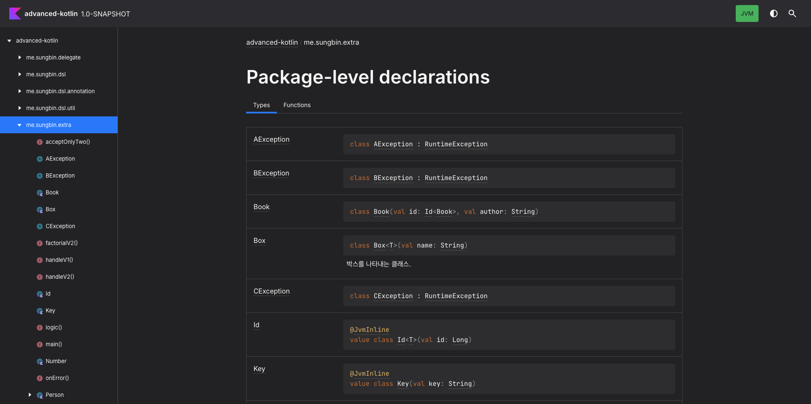
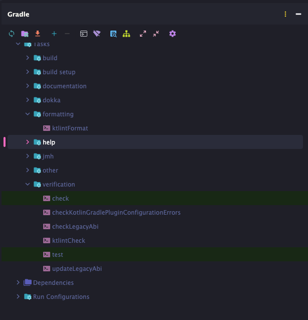

> 해당 포스팅은 인프런의 [코틀린 고급편](https://inf.run/GZfvz) 강의를 참조하여 작성한 글입니다.

## 유용한 코틀린 표준 라이브러리 함수들

이번에는 코틀린의 유용한 표준 라이브러리 함수들에 대해 살펴보도록 하겠다.

첫번째 함수는 `repeat`이다. `repeat` 함수는 함수 하나를 받아 주어진 횟수만큼 반복한다.

``` kotlin
public inline fun repeat(times: Int, action: (Int) -> Unit) {
    for (index in 0 until times) {
        action(index)
    }
}
```

두 번째 함수는 `TODO`이다. 놀랍게도 Kotlin에는 대문자로만 이루어진 `TODO` 함수가 있는데, 이 함수는 IDE에서도 아직 구현되지 않은 부분을 나타내는 것으로 간주해 준다.

``` kotlin
fun hello() {
    TODO("추가적인 출력 필요")
}
```

문자열을 받아 어떤 작업을 해야 하는지 기록할 수도 있다.

다음 함수는 `measureTimeMillis`이다. 이 함수는 함수를 하나 받고, 이 함수에서 사용된 시간을 밀리초 단위로 반환한다.

``` kotlin
val timeMillis = measureTimeMillis {
    // do something
}
```

가볍게 성능을 비교할 때 혹은 우리가 작성한 로직이 얼마나 걸렸는지 확인하고 싶을 때 유용하다.

다음 함수는 `require`이다. `require` 함수는 우리가 정한 조건을 확인해 실패하면 `IllegalArgumentException`를 던진다.

``` kotlin
fun acceptOnlyTwo(num: Int) {
    require(num == 2) {
        "2만 허용한다"
    }
}
```

`require`과 비슷하게 `check`라는 함수가 있다. `check`는 우리가 정한 조건을 확인해 실패하면 `IllegalStateException`을 던진다.

``` kotlin
class Person {

    val status: PersonStatus = PersonStatus.PLAYING

    fun sleep() {
        check(this.status == PersonStatus.PLAYING) {
            "현재 상태가 PLAYING이 아닙니다"
        }
    }

    enum class PersonStatus {
        PLAYING, SLEEPING
    }
}
```

각 함수가 던지는 예외 형태에서 알 수 있듯이, require은 보통 들어오는 파라미터에 대해 사용하고 check 는 보통 어떠한 객체가 스스로 갖고 있는 상태에 대해 사용한다. 개발을 하다 보면 검증을 많이 해야 하는데 그때마다 if 문과 throw 예외를 직접 작성하기보다 `require`, `check`를 활용하면 간편하게 검증이 가능하다.

``` kotlin
public inline fun <R> runCatching(block: () -> R): Result<R> {
    return try {
        Result.success(block())
    } catch (e: Throwable) {
        Result.failure(e)
    }
}
```

`runCatching` 함수는 함수 블록을 받아 try catch로 감싼 후 성공 실패 여부에 상관없이 `Result` 객체를 반환한다. 이 함수를 이용하면, try catch 구문을 더 간략하게 사용할 수 있으며, 구체적인 예외 처리 역할을 호출부에 위임할 수도 있다. 이렇게 받은 Result 객체로는 우리가 실행시킨 block이 성공인지 실패인지 확인하거나, 성공 결과 또는 발생 예외를 가져올 수 있다.

``` kotlin
val result = runCatching { 1 / 0 }
result.isSuccess // 성공했으면 true
result.isFailure // 실패했으면 true
result.getOrNull() // 성공했으면 결과값, 실패했으면 null 반환
result.exceptionOrNull() // 성공했으면 null, 실패했으면 해당 예외 반환
```

이 외에도 getOrElse, map 같은 체이닝 메소드를 사용할 수 있다.

## 꼬리 재귀 함수와 인라인 클래스, multiple catch

이번에는 추가적인 코틀린 언어 기능 두 가지를 살펴보고, 코틀린에서 지원하지 않는 언어 특징과 우회법도 한 가지 알아보도록 하자.

첫 번째는 `꼬리 재귀 함수 최적화`이다. `꼬리 재귀 함수`는 간단하다. 아래 코드를 살펴보자.

``` kotlin
fun factorial(n: Int): Int {
    return if (n <= 1) {
        1
    } else {
        n * factorial(n - 1)
    }
}
```

이 코드는 재귀 함수이다. factorial 함수 안에서 다시 factorial 함수를 호출하고 있기 때문이다. 하지만 `꼬리 재귀 함수`는 아니다. `꼬리 재귀 함수`가 되려면 `n * factorial(...)`처럼 재귀적인 호출과 연결된 추가 연산이 없어야 한다. 예를 들어, factorial 함수를 꼬리 재귀 함수로 만들려면 다음과 같이 작성할 수 있다.

``` kotlin
fun factorialV2(n: Int, curr: Int = 1): Int {
    return if (n <= 1) {
        curr
    } else {
        factorialV2(n - 1, curr * n)
    }
}
```

코틀린에서는 이런 꼬리 재귀 함수를 최적화하기 위해 `tailrec`이란 키워드를 제공한다.

``` kotlin
tailrec fun factorialV2(n: Int, curr: Int = 1): Int {
    return if (n <= 1) {
        curr
    } else {
        factorialV2(n - 1, curr * n)
    }
}
```

`tailrec` 키워드를 붙이면, 함수가 호출될 때마다 스택이 쌓이는 재귀적인 함수 호출 구조를 컴파일 과정 때 루프 형태로 바꾸어 최적화해준다. 아래는 컴파일 코드의 예시이다.

``` java
public static final int factorialV2(int n, int curr) {
    while(n > 1) {
        int var10000 = n - 1;
        curr = n * curr;
        n = var10000;
    }

    return curr;
}
```

다음 기능은 인라인 클래스 이다. 인라인 클래스 는 인라인 함수나 인라인 프로퍼티처럼, 클래스 내부 프로퍼티가 컴파일 타임 때 인라이닝되는 것을 의미한다. 인라인 클래스를 만들기 위해서는 `@JvmInline` 어노테이션과 `value class`를 사용하면 된다.

``` kotlin
fun main() {
    val key = Key("나의 비밀 열쇠")
}

@JvmInline
value class Key(val key: String)
```

이 코드를 컴파일하면, main 함수의 본문은 다음과 같이 바뀐다.

``` java
public static final void main() {
    String key = Key.constructor-impl("나의 비밀 열쇠");
}
```

변경된 코드의 핵심은 우리가 선언한 Key 타입의 변수가 String 타입으로 변경되었다는 점이다. 이런 기능을 유지하기 위해서 인라인 클래스는 프로퍼티를 하나만 갖고 있어야 한다. 인라인 클래스는 여러 객체들의 key를 함수 파라미터에 사용할 때 도움이 된다. 예를 들어 `User`와 `Book`이 있다고 해보자. 그리고 각 클래스는 고유한 id를 갖고 있다.

``` kotlin
class User(
    val id: Long,
    val name: String,
)

class Book(
    val id: Long,
    val author: String,
)
```

이때 User의 id와 Book의 id를 받는 함수를 만든다면, 아래와 같이 함수를 만들 것이다.

``` kotlin
fun handleV1(userId: Long, bookId: Long) {

}
```

이 함수는 Long 타입의 연속한 매개변수를 갖고 있기 때문에 개발자가 실수로 순서를 바꿔 넣을 수 있다. 특히나 여러 종류의 객체를 한 번에 다루어야 할수록 실수의 여지는 늘어나며, 런타임이 되어서야 알 수 있는 심각한 문제를 야기할 수 있다. 물론, named argument로 이 문제를 어느 정도 해소할 수 있지만, 그렇게 되면 handle을 호출하는 쪽에서 코드가 길어지는 아쉬움이 있다. 이럴 때 바로 인라인 클래스를 이용할 수 있다. 아래의 코드를 먼저 만들어보자.

``` kotlin
@JvmInline
value class Id<T>(val id: Long)
```

그리고, User와 Book에서 `Id<User>` `Id<Book>` 타입의 id 프로퍼티를 갖도록 변경하자.

``` kotlin
class User(
    val id: Id<User>,
    val name: String,
)

class Book(
    val id: Id<Book>,
    val author: String,
)
```

이렇게 되면 handle 함수 역시 매개변수의 타입이 `Id<User>` `Id<Book>`으로 변경되고, 혹시나 순서를 바꿔 함수를 호출하면 다른 타입이기 때문에 컴파일 타임 때 문제를 확인할 수 있다.

``` kotlin
fun handleV2(userId: Id<User>, bookId: Id<Book>) {

}
```

심지어 인라인 클래스는 컴파일 타임 때 일반 타입으로 변경되기 때문에 boxing, unboxing 오버헤드가 적다.

마지막으로 try catch 구문에서 여러 예외를 받고 싶은 경우를 살펴보자. Java에서는 아래 코드와 같이 한 catch 에서 여러 예외를 받을 수 있다.

``` java
try {
    // ...
} catch(AException | BException e) {
    // ...
}
```

하지만 코틀린에서는 하나의 catch 에서 하나의 예외만을 받을 수 있기에 비슷한 형태를 만들기 위해서는 꼼수를 사용해야 한다.

``` kotlin
fun logic(n: Int) {
    when {
        n > 0 -> throw AException()
        n == 0 -> throw BException()
    }

    throw CException()
}

class AException : RuntimeException()
class BException : RuntimeException()
class CException : RuntimeException()
```

가장 먼저 생각나는 꼼수는 위와 같이 when expression을 사용하는 방법이다. 또 다른 방법으로는 조금 번거롭긴 하지만, `Result<T>` 객체를 활용할 수도 있다.

``` kotlin
package me.sungbin.extra

import kotlin.reflect.KClass

class RunWrapper<T>(
    private val result: Result<T>,
    private val knownException: MutableList<KClass<out Throwable>>,
) {
    fun toResult(): Result<T> {
        return this.result
    }

    fun onError(vararg exceptions: KClass<out Throwable>, action: (Throwable) -> Unit): RunWrapper<T> {
        this.result.exceptionOrNull()?.let { exception ->
            if (exception::class in exceptions && exception::class !in this.knownException) {
                action(exception)
            }
        }

        return this
    }
}

fun <T> Result<T>.onError(vararg exceptions: KClass<out Throwable>, action: (Throwable) -> Unit): RunWrapper<T> {
    exceptionOrNull()?.let { exception ->
        if (exception::class in exceptions) {
            action(exception)
        }
    }

    return RunWrapper(this, exceptions.toMutableList())
}
```

그리고 아래와 같이 처리를 할 수 있다.

``` kotlin
fun main() {
    runCatching {
        logic(0)
    }.onError(AException::class, BException::class) {
        println("A or B")
    }.onError(CException::class) {
        println("C")
    }
}
```

## 유용한 k-도구들!!

이번에는 프로그래밍을 할 때 간접적으로 도와주는 유용한 k-도구들을 2가지 알아보자.

### kdoc

먼저 주석이나 문서화에 활용할 수 있는 `kdoc`이다. 먼저 `kdoc`의 사용법에 대해 알아보자. kdoc은 코틀린 코드의 문서화를 위해 작성되는 언어를 의미한다. Javadoc과 매우 유사하고 마크다운의 문법을 활용할 수 있다. 예시를 하나 살펴보며 kdoc을 사용해 보자!

``` kotlin
class Box<T>(
	val name: String,
) {
	fun add(item: T): Boolean {
		TODO()
	}
}
```

위의 `Box` 클래스가 존재한다. 만약 이 `Box`에 대한 설명을 적어야 한다면 아래와 같이 적을 수 있다.

``` kotlin
/**
 * 박스를 나타내는 클래스.
 * 타입 파라미터 T는 박스에 들어가는 아이템의 타입을 나타낸다.
 */
class Box<T>(val name: String) {
    fun add(item: T): Boolean {
        TODO()
    }
}
```

그런데 이렇게만 주석을 사용하면 우리가 원하는 특정 언어 요소 설명을 보기 위해 전체 줄글을 읽어야 한다는 단점이 존재한다. 이럴 때 사용할 수 있는 것이 바로 kdoc의 block tag이다. block tag를 적용하면 아래와 같다.

``` kotlin
/**
 * 박스를 나타내는 클래스.
 *
 * @param T 박스의 아이템 타입
 * @property name 박스의 이름
 */
class Box<T>(
	val name: String,
) {
	fun add(item: T): Boolean {
		TODO()
	}
}
```

block tag는 우리가 사용한 `@param` / `@property` 외에도 다양한 종류를 갖고 있다. 자주 사용되는 몇 가지 종류를 살펴보자.

- `@param`: 함수의 파라미터 또는 타입 파라미터를 의미한다.
- `@property`: 클래스의 특정 프로퍼티를 의미한다.
- `@constructor`: 클래스의 주 생성자를 의미한다.
- `@return`: 함수의 반환 값을 의미한다.
- `@receiver`: 확장 함수의 수신 객체를 의미한다.
- `@thorws class` / `@exception class`: 함수를 통해 발생할 수 있는 예외를 의미한다.
- `@sample identifier`: 주어진 qualified name을 이용해 함수의 body를 임베딩한다. `identifier`란 패키지를 포함한 클래스 이름을 의미한다.
- `@see identifier`: 특정 클래스 또는 메서드로 링크를 건다.
- `@author`: 저자를 명시한다.
- `@since`: s/w의 버전을 명시한다.
- `@suppress`: 주석에 쓰고 싶지만 공식 API 문서에는 넣고 싶지 않은 텍스트를 추가할 수 있다.

또한 kdoc은 기본적인 마크다운 문법을 사용할 수도 있다. 예를 들어 특정 문구를 강조하기 위해 `*문구*`를 쓸 수도 있고, 링크를 걸기 위해 `[]`를 사용할 수도 있다.

이렇게 우리가 kdoc으로 작성한 주석들이 쌓여가면 이를 문서화하고 싶은 욕심이 생길 것이다. kdoc은 Dokka라는 엔진을 이용해 문서로 바뀔 수 있게 하는데 Dokka 엔진을 활용하는 방법은 간단하다. 아래와 같이 플러그인을 설정해주면 끝이다.

``` kotlin
id("org.jetbrains.dokka") version "2.1.0"
```

이 플러그인이 추가되면 `dokkaGenerateHtml`이 생성되는데 이것을 실행하면 끝이다.

``` bash
./gradlew dokkaGenerateHtml
```

그렇게 되면 우리가 작성한 주석이 HTML 파일로 적절히 변경되어 `build/dokka/`에 저장된다. 아래는 독자가 직접 돌려서 나온 결과물이다.



`dokkaGenerateHtml`을 실행할때 추가적인 옵션을 줄 수 있으니 자세한 옵션은 공식문서를 확인해보면 좋을 것 같다.

다음으로는 여러 개발자가 함께 협업할 때 포맷팅을 통일 시킬 수 있는 `ktlint`이다. 린팅이란, 코딩을 할 때 들여쓰기나 탭 사용 등 코드 컨벤션을 자동으로 맞춰주는 도구를 의미한다. 코틀린에서는 린팅 도구로 `ktlint`가 있는데, ktlint를 사용하는 방법은 다음과 같다.

kdoc과 마찬가지로 ktlint를 프로젝트에 적용하는 방법은 매우 간단하다. 아래와 같이 플러그인을 설정부터 해준다.

``` kotlin
id("org.jlleitschuh.gradle.ktlint") version "14.0.1"
```

ktlint가 정상적으로 적용이 되었다면 핵심적인 2가지 task인 `ktlintFormat`과 `ktlintCheck`가 추가가 되었을 것이다.



- `ktlintCheck` : 프로젝트에서 코드 컨벤션이 틀린 부분을 찾아준다.
- `ktlintFormat` : 설정된 ktlint 규칙에 따라 자동으로 코드를 수정해준다. 만약 자동 수정이 불가능할 경우 에러가 발생한다.

ktlint는 플러그인을 연결하기만 해도 정해진 규칙에 따라 코드 포맷팅을 검사해 준다. 하지만 이러한 규칙을 변경해야 할 때도 있으며, 이때 `.editorconfig` 파일을 사용할 수 있다. 먼저 기본적인 .editorconfig 파일 사용법을 알아보자.

```
root = true

[*]
indent_size = 4
indent_style = tab

tab_width = 4
end_of_line = lf
charset = utf-8
trim_trailing_whitespace = true
insert_final_newline = true
```

- root
    - 추가적인 `.editorconfig` 파일을 찾을 필요가 없다고 알려준다. 만약 `root = true`라는 표시가 없다면 계속해서 상위 폴더의 `.editorconfig` 파일을 찾으려 한다.
- [*]
    - 모든 파일에 적용됨을 의미한다.
- indent_size
    - 들여쓰기의 간격 개수를 지정한다.
- indent_style
    - 들여쓰기를 공백(스페이스 바)로 할지, 탭으로 할지 지정한다.
- tab_width
    - 탭을 사용할 경우, 그 간격을 지정한다.
- end_of_line
    - 줄바꿈 문자를 지정한다.
- charset
    - 우리가 타이핑할 문자의 인코딩 방식을 지정한다.
- trim_trailing_whitespace
    - 비어 있는 줄에 공백을 제거할지 (true) 놓아둘지 (false) 지정한다.
- insert_final_newline
    - 파일 가장 마지막에 한 줄의 공백을 추가할지 (true) 추가하지 않을지 (false) 지정한다.

그다음 Kotlin 코드에 대한 추가적인 설정을 해보자. 가장 먼저 지정해 줄 것은 전반적인 코드 스타일을 정해 주어야 한다. 현재 기본 설정은 ktlint_official인데 intellij_idea로 변경할수도 있다.

```
[*.{kt, kts}]
ktlint_code_style = intellij_idea
```

이제 전체적인 스타일을 지정했으니 세세한 설정을 해보자. 예를 들어 우리는 닫히는 괄호 앞에 빈 줄을 하나 허용하고 싶은 경우가 있을 것이다.

``` kotlin
// Class A가 닫힐 때 빈 줄 없음
class A {
    fun a() { }
}

// Class A가 닫힐 때 빈 줄 있음
class A {
    fun a() { }

}
```

이런 세세한 설정을 하기 위해서는 `RuleSet`과 `rule id`에 대해 이해해야 한다. 이 두 개념은 매우 간단하다. 우리가 코드의 컨벤션을 정할 때는 여러 규칙이 있을 텐데, 규칙 하나마다 고유한 id를 생각해 보자. 위의 예시인 “닫히는 괄호 앞 빈 줄 허용 여부”는 `no-blank-line-before-rbrace`라는 id를 부여할 수 있을 것이다. 이것이 바로 `rule id`이다. 그리고 이러한 규칙들은 여럿이 모여서 하나의 집합이 되는데 그것이 바로 `RuleSet`이다. 이러한 규칙들은 [ktlint rules](https://pinterest.github.io/ktlint/latest/rules/code-styles/) 사이트에서 확인해볼 수 있다.

그럼, 닫히는 괄호 앞에 빈 줄 허용을 적용해 보자. 그 방법은 `.editorconfig` 파일에서

```
ktlint_[RuleSet이름]_[rule id] = 값
```

이라고 지정하는 것이다.

이와 비슷한 방식으로 세세한 옵션을 설정할 수 있는데, 일부 설정의 경우는 다른 규칙을 갖고 있을 수도 있다. 예를 들어 wild card import를 특정 패키지에 허용하기 위해서는 `ij_kotlin_packages_to_use_import_on_demand`라는 옵션을 사용해야 한다. 이러한 규칙은 홈페이지를 통해 확인할 수 있다.

또한 ktlint는 공식 홈페이지에서 IntelliJ formatter 와 ktlint 둘 중 하나만 사용하는 것을 권장하고 있다. 둘 모두 사용하게 되면, 두 규칙에 다른 점이 있어 충돌이 날 수 있기 때문이다. 하지만 만약 둘을 함께 사용하고 싶은 경우, 공식 홈페이지에서는 다음 두 가지 설정을 추천하고 있다.

`.idea/codeStyles/codeStyleConfig.xml`

``` xml
<component name="ProjectCodeStyleConfiguration">
    <state>
        <option name="USE_PER_PROJECT_SETTINGS" value="true" />
    </state>
</component>
```

- 인텔리제이로 프로젝트를 열었을 때 독자적인 코드 스타일을 적용할지 공통 코드 스타일을 적용할지 설정한다.

`.idea/codeStyles/Project.xml`

``` xml
<component name="ProjectCodeStyleConfiguration">
    <code_scheme name="Project" version="173">
        <JetCodeStyleSettings>
            <option name="PACKAGES_TO_USE_STAR_IMPORTS">
                <value />
            </option>
            <option name="NAME_COUNT_TO_USE_STAR_IMPORT" value="2147483647" />
            <option name="NAME_COUNT_TO_USE_STAR_IMPORT_FOR_MEMBERS" value="2147483647" />
            <option name="CODE_STYLE_DEFAULTS" value="KOTLIN_OFFICIAL" />
        </JetCodeStyleSettings>
        <codeStyleSettings language="kotlin">
            <option name="CODE_STYLE_DEFAULTS" value="KOTLIN_OFFICIAL" />
        </codeStyleSettings>
    </code_scheme>
</component>
```

- wild card import의 사용 지점을 21억 개로 설정하여, 사실상 wild card import를 사용하지 않도록 한다.
- 이 프로젝트의 기본 코드 스타일을 kotlin_official로 설정한다.

추가적으로 IntelliJ에 있는 파일을 저장할 때 자동 포맷팅을 해주는 설정 을 활용할 수 있다. `Preferences > Tools > Actions on Save`에서 설정할 수 있으며, 이 설정을 사용하면 파일 저장 시 자동 포맷팅이 이루어지게 된다.


만약 ktlint의 포맷팅 체크를 git commit 전에 자동으로 수행하고 싶다면, git pre-commit hook을 이용할 수 있다. 이름 그대로 commit을 하기 직전 시점에 hook을 걸어 ktlint 포맷팅을 시작하는 방식으로 아래와 같이 적용할 수 있다.

``` bash
./gradlew addktlintCheckGitPreCommitHook
```

만약 hook을 삭제하고 싶다면, 아래 명령어를 통해 pre commit hook을 제거할 수 있다.

``` bash
rm .git/hooks/pre-commit
```

또한 이번 한 번만 hook 실행 없이 commit 하고 싶다면, --no-verify 옵션을 사용해 commit 할 수 있다.

``` bash
git commit -m "message" --no-verify
```