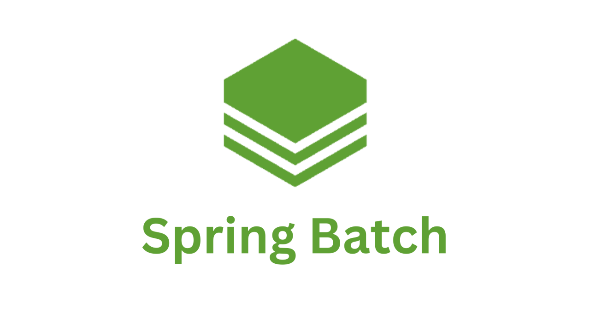

> 해당 블로그 글은 [AWS 강의실님의 인프런 강의](https://inf.run/ASZvZ)를 바탕으로 쓰여진 글입니다.

## AWS 소개 / AWS 공부 가이드 / 팁

### AWS란?

AWS는 전 세계적으로 분포한 데이터 센터에서 300개가 넘는 완벽한 기능의 서비스를 제공하는 세계적으로 가장 포괄적이며, 널리 채택되고 있는 클라우드다. 즉 정리하면 아래와 같다.

- Amazone에서 제공하는 클라우드 컴퓨팅 플랫폼
  - 소규모 스타트업부터 초거대 대기업까지 사용하는 클러벌 클라우드 플랫폼
- 국내 점유율 1위
- 전세계 점유율 1위

### AWS를 배워야 하는 이유

- 대한민국 기준 가장 점유율이 높은 클라우드 프로바이더
  - 많이 사용 -> 많은 레퍼런스, 많은 커뮤니티, 많은 리소스
- 다양한 서비스와 지속적인 업데이트

### AWS의 서비스 공부 순서

하나의 서비스를 마스터하고 넘어가는 것보다 적절하게 공부 후, 다음 서비스를 공부하는 것이 더욱 효율적이다. 왜냐하면 AWS 서비스들은 긴밀하게 연결되어 있어 다른 서비스를 모르면 완벽하게 한 서비스의 이해가 불가능하기 때문이다. 그래서 적절하게 보고 다른 서비스를 본 후 다시 돌아와서 공부해보자.

그럼 공부해야 할 서비스들을 살펴보자.

<table border="1" style="border-collapse: collapse; width: 100%;">
  <thead>
    <tr>
      <th style="padding: 10px; text-align: center; background-color: #f0f0f0;color: black;">티어</th>
      <th style="padding: 10px; text-align: center; background-color: #f0f0f0;color: black;">서비스</th>
      <th style="padding: 10px; text-align: center; background-color: #f0f0f0;color: black;">관련 서비스</th>
    </tr>
  </thead>
  <tbody>
    <tr>
      <td style="padding: 10px; text-align: center; background-color: #e91e63; color: white; font-weight: bold;">필수</td>
      <td style="padding: 10px;">
        • Amazon EC2 
        • AWS IAM + 계정/빌링 설정
      </td>
      <td style="padding: 10px;">
        • EBS 
        • ELB 
        • Auto Scaling 
        • Budgets 
        • Cost &amp;Usage Report
      </td>
    </tr>
    <tr>
      <td style="padding: 10px; text-align: center; background-color: #ffc107; color: white; font-weight: bold;">매우 중요</td>
      <td style="padding: 10px;">
        • Amazon VPC 
        • Amazon S3 
        • Amazon RDS
      </td>
      <td style="padding: 10px;">
        • Amazon Aurora
      </td>
    </tr>
    <tr>
      <td style="padding: 10px; text-align: center; background-color: #ffeb3b; font-weight: bold;">중요</td>
      <td style="padding: 10px;">
        • Amazon SQS 
        • Amazon CloudFront 
        • AWS CloudFormation 
        • Amazon CloudWatch 
        • Amazon Route 53 
        • Amazon SNS 
        • AWS Systems Manager 
        • AWS CloudTrail
      </td>
      <td style="padding: 10px;"></td>
    </tr>
  </tbody>
</table>

그럼 각각의 서비스들의 개념에 대해 간단히 한번 살펴보자.

### Amazone EC2

EC2는 안전하고 크기 조정이 가능한 컴퓨팅 파워를 클라우드에서 제공하는 웹 서비스이다. 개발자가 더 쉽게 웹 규모의 클라우드 컴퓨팅 작업을 할 수 있도록 설계되었다. 즉, 아마존한테 빌려쓰는 컴퓨팅 서비스라고 보면 좋을 것 같다.

- AWS에서 가장 중요한 서비스로 컴퓨팅 파워를 빌리는 서비스
  - 서버를 빌리는 서비스
  - 거의 모든 AWS 서비스는 직/간접적으로 EC2와 연결

### AWS IAM

IAM을 사용하면 AWS 서비스와 리소스에 대한 액세스를 안전하게 관리할 수 있습니다. 또한, AWS 사용자 및 그룹을 만들고 관리하며 AWS 리소스에 대한 액세스를 허용 및 거부할 수 있다.

- AWS의 보안 및 관리를 담당하는 글로벌 서비스
- 주요 기능
  - AWS 어카운트 관리 및 리소스/사용자/서비스의 권한 제어
    - 임시 권한 부여
    - 서비스 사용을 위한 인증 정보 부여
  - 사용자의 생성, 관리, 계정의 보안
    - Multi-factor Authentication
    - 사용자의 패스워드 정책 관리

### Virtual Private Cloud(VPC)

VPC는 사용자의 AWS 계정 전용 가상 네트워크이다. VPC는 AWS 클라우드에서 다른 가상 네트워크와 논리적으로 분리되어 있다. Amazone EC2 인스턴스와 같은 AWS 리소스를 VPC에서 실행할 수 있다. IP 주소 범위와 VPC 범위를 설정하고 서브넷을 추가하고 보안 그룹을 연결한 다음 라우팅 테이블을 구성한다. 즉, 쉽게 말해 가상으로 존재하는 데이터 센터를 뜻한다.

- 가상의 데이터 센터
- 원하는 대로 사설망을 구축 가능
  - 부여된 IP 대역을 분할하여 사용 가능
- EC2, RDS, Lambda등의 AWS의 컴퓨팅 서비스 실행을 할 때 사용
- 다양한 서브넷 구성
- 보안 설정(IP Block, 인터넷에 노출되지 않는 EC2등 구성)

### Simple Storage Service(S3)

S3는 업계 최고의 확장성과 데이터 가용성 및 보안과 성능을 제공하는 객체 스토리지 서비스이다. S3는 99.999999999%의 내구성을 제공하도록 설계되었으며 전 세계 기업의 수백만 애플리케이션을 위한 데이터를 저장한다.

- 객체 스토리지 서비스: 파일 보관만 가능
  - 애플리케이션 설치 불가능
- 무제한 용량
- 99.999999999% 내구성
- 일종의 웹하드

### Amazone Relational Database Service(RDS)

RDS를 사용하면 클라우드에서 관계형 데이터베이스를 간편하게 설정, 운영 및 확장할 수 있다. 하드웨어 프로비저닝, 데이터베이스 설정, 패치 및 백업과 같은 시간 소모적인 관리 작업을 자동화하면서 비용 효율적이고 크기 조정 가능한 용량을 제공한다. 사용자가 애플레케이션에 집중하여 애플리케이션에 필요한 빠른 성능, 고가용성, 보안 및 호환성을 제공할 수 있도록 지원한다.

- 관계형 데이터베이스를 서비스로 제공하는 서비스
- 암호화 지원
- 자동 백업 지원

### 주요 리소스

- 공식 문서
  - 언제나 표준
  - 다양한 기술 블로그, 인터넷 자료, chat gpt는 참고만!
- AWS ReInvent/Summit 발표 자료
  - 공식 문서에 없는 다양한 내용들이 출현
  - AWS 직원 분들이 이야기하는 컨텐츠에 한해서는 공식으로 인정
  - 이외에 주요 커뮤니티, 이벤트...

> 잘못된 지식이 있을 경우 댓글로 남겨주시면 빠르게 반영하겠습니다!