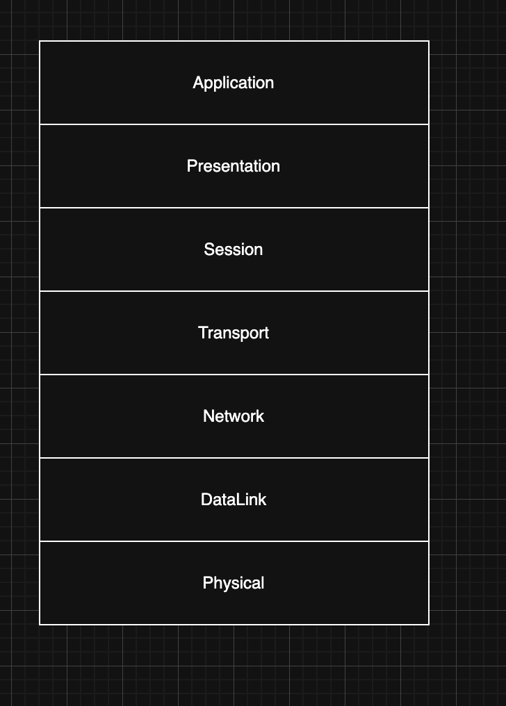

> 해당 블로그 글은 [AWS 강의실님의 인프런 강의](https://inf.run/ASZvZ)를 바탕으로 쓰여진 글입니다.

## OSI 7 Layer Model1 - Physical/Data Link

### OSI 7 Layer

- 컴퓨터의 네트워크 및 통신을 7개의 레이어(계층)으로 표현한 모델
- 각 계층은 하위 계층의 기능을 활용해 역할을 수행하고 상위 계층으로 처리 결과 전달
  - 낮은 계층에서 높은 계층 순서로

OSI 7 Layer를 그림으로 표현하면 위의 그림과 같이 표현이 가능하다. 그러면 각 계층을 하나씩 알아보자.

### Physical Layer

- 장치를 연결하기 위한 매체의 물리적 사항을 정의
  - 전압, 주기, 시간, 전선의 규격, 거리등
- 주요 단위: Bits
- 대표 구성 요소
  - 케이블/안테나/RF등 전송 매체, **허브**, **리피터**

처음 Physical Layer는 각 컴퓨터들끼리 광섬유나 구리선같은 전선으로 연결이 되었다. 하지만 이렇게 될 경우 각 컴퓨터들을 관리하기가 쉽지 않았고 하나가 고장나면 전체의 컴퓨터 통신의 장애가 발생하는 상황도 생기곤 했다. 따라서 이런 문제를 해결하고자 허브라는 것이 등장하였다.

### Hub

- Physical Layer 단위에서 다수의 기기들을 연결해주는 장치
- 특징
  - 에러 / 충돌(Collision) / 디바이스 별 제어 기능 없음
  - 받은 내용을 그대로 전달 -> 무조건 BroadCast

그래서 허브를 가운데에 두고 각 컴퓨터들을 전선으로 연결한 형태를 띄고 있다. 그래서 만약 연결된 PC 1대가 데이터를 보내면 허브는 그것을 연결된 다른 컴퓨터들에게 그대로 전달하는 역할을 진행한다. 단, 거리가 길수록 전압의 크기가 작아지면서 데이터 손실이 발생할 수 있는데 이를 방지하고자 전압의 크기도 다시 증폭시켜주는 역할도 한다. 일종의 확성기 역할인셈이다. 단, 허브의 문제도 있는데 내용은 다음과 같다.

- 충돌 발생
- BroadCast만 가능 -> 대상을 지정해서 전달 불가능

### DataLink Layer

- 물리적인 통신을 제어하여 디바이스와 디바이스간의 통신 및 전송을 안정화하기 위한 프로토콜
- 주요 단위: Frame
- 주요 구성 요소: **MAC Address**, **Switch**
- 주요 특징
  - CSMA/CD(Carrier-Sense Multiple Access with Collision Detection) 방식을 활용해서 각 디바이스간의 통신을 원활하게 연결
  - 대상을 구별하여 디바이스간의 통신을 지원(Unicast)
    - Broadcast도 지원

그러면 해당 계층의 주요 구성 요소에 대해 살펴보도록 하자. 먼저 MAC Address부터 살펴보자.

### MAC Address

- 네트워크 인터페이스에 부여된 고유의 주소
  - 데이터가 지정한 대상에게 잘 전달될 수 있도록 대상 식별에 사용
- 2개의 Hexadecimal(=byte) 단위로 6개를 나열 = 48bit = 6bytes
  - ex. 00:1A:2B:3C:4D:5E
- 두 파트로 구분
  - 첫 3개의 byte는 OUI(Organizationally Unique Identifier): 제조사에 부여된 고유 식별자
  - 나머지 3개의 byte는 NIC(Network Interface Controller): 네트워크 인터페이스 별 고유 번호
- **모든 네트워크 인테페이스의 MAC Address는 고유의 값이며 변하지 않음**
  - 즉 전 세계의 동일한 MAC Address를 가진 네트워크 인터페이스는 없음
  - IP는 변동

DataLink 계층을 이용하면 우리는 대표적인 장치인 스위치를 이용하여 각 장치들을 연결한다. 장치들간의 통신이 진행할때 기본 단위는 프레임을 이용하여 전송이 되는데 이 프레임에 구성을 잠깐 살펴보도록 하자.

### Frame

프레임에는 아래와 같이 7개의 구성요소로 이루어져 있다.

- Preamble(7bytes), SFD(1byte): Frame의 시작을 알림
- 대상 MAC Address(6bytes)
- 소스 MAC Address(6bytes)
- Ethertype(2bytes): Frame의 길이, Layer 3 프로토콜 명시
- Payload(46~1500bytes): 데이터 내용
- Frame Check Sequence(4bytes): 오류 검증

그래서 장치간 통신을 할 때 프레임 단위로 보내고 해당 프레임을 1계층으로 내려와서 전압으로 변경 후, 통신 대상 장치로 전달을 진행한다. 이때 대상 MAC주소를 통해 통신 대상 장치를 찾을 수 있다. 또한 CSMA/CD 방식을 지원하는데 CSMA/CD 동작 방식은 다음과 같다.

- 먼저 대상 장치로부터 데이터 통신이 이루어지는지 소스 장치가 확인을 진행한다.
- 데이터 통신 중이라면 소스 장치는 일단 기달린다.
- 만약 데이터가 안 들어온다면 데이터를 대상 장치로 보낸다.
- 만약 통신 도중에 충돌이 발생한다면 각 네트워크 인터페이스별로 가진 고유시간만큼 대기 후 재전송을 진행한다.
- 그래도 충돌이 나면 똑같이 대기를 하는데 이 과정이 3번 반복되면 통신을 중단한다.

이 과정을 상세히 좀 보자. 스위치를 가운데로 4대의 장치가 연결되어 있다고 하자. 이 때 A 장치가 D 장치에게 데이터 통신을 하려고 프레임 데이터를 보내려고 한다. 먼저 CSMA/CD 방식을 이용하여 데이터 통신중인지 확인하고 통신 중이라면 대기를 진행한다. 그리고 통신 중이 아니라면 통신을 진행한다. 그런데 혹여나 충돌이 발생한다면 해당 프레임을 스위치 내부의 Frame Storage에 임시 저장을 진행한다. 또한 스위치 내부의 Mac Address Table을 통해 해당 NIC을 찾아서 전달하는 것이다.

> ✅ 참고
>
> 만약 대상 MAC Address가 FF:FF:FF:FF:FF:FF라면 Broadcast를 의미한다.

이렇게 우리는 로컬 네트워크를 구축할 수 있다. 하지만 L2 계층에는 명확한 한계가 나타난다. 바로, 로컬 네트워크 외부로 통신 불가능하다는 점이다.

## OSI 7 Layer Model 2 - Network

이제 L3 계층인 Network Layer에 대해 학습해보자.

- 여러 노드의 경로를 찾고 올바르게 전달 될 수 있는 기능과 수단을 정의
- 주요단위: 패킷
- 주요 구성 요소: **Router**, **IP**, **ARP**
- 주요 특징
  - 서로 떨어진 Local Network간의 통신을 지원
  - "Network간의" -> Inter Network -> Internet
  - 중간중간 Node들을 거쳐서 목적지까지 도달할 수 있는 방법을 지원

### IP

- Internet Protocol 상에서 통신 주체를 식별할 수 있는 아이디
- 종류
  - IPv4: 32bits
    - IP를 최대로 활용하기 위해 사설 IP와 공인 IP로 분류
  - IPv6: 128bits
    - 사설 IP 개념이 필요 없음
- MAC Address와 다르게 수시로 변동 가능

### Classless Inter Domain Routing(CIDR)

- IP는 주소의 영역을 여러 네트워크 영역으로 나누기 위해 IP를 묶는 방식
- 여러 개의 사설망을 구축하기 위해 망을 나누는 방법

### CIDR Notation

- IP 주소의 **집합**
- 네트워크 주소와 호스트 주소로 나뉨
- 각 호스트 주소 숫자만큼의 아이피를 가진 네트워크망 형성 가능
- A.B.C.D/E 형식
  - ex. 10.0.1.0/24, 192.168.0.0/12
  - A,B,C,D: 네트워크 주소 + 호스트 주소 표시
  - E: 0~32: 네트워크 주소가 몇 bit인지 표시

예를 들어 192.168.12.0/24라고 한다면 192.168.12가 네트워크 주소이고 나머지가 호스트주소인셈이다. 즉, 192.168.12대역의 IP를 총 255개를 생성이 가능한 셈이다. 이런 방식을 CIDR Block이라고 칭한다.

> ✅ 참고
>
> 참고로, 192.168.0.0과 192.168.0.1과 192.168.0.255같은 IP는 일반 장치가 사용이 불가능하다. 따라소 사용할 수 있는 실질적인 IP는 252개인셈이다.

### Subnet Mask

- 어느 부분이 호스트 비트인지, 어느 부분이 네트워크 비트인지 구분해주는 Mask
  - AND 연산을 활용해 네트워크 주소를 필터링
- 네트워크 비트 수만큼 1을 보유한 마스크를 IP에 적용하면 네트워크 비트만 추출 가능

### Router

- 네트워크 간 패킷을 주고받는 Layer 3 장치
- IP 대역별 최적 경로를 수집 및 관리
  - 어떤 경로의 노드를 경유해야 가장 효율적으로 대상에 도착하는지 알고 있다. (Router Table)
  - 이 경로를 바탕으로 특정 IP 주소가 대상인 패킷의 전달을 요청받을 때 해당 경로로 요청
- 로컬 네트워크는 자신의 로컬 네트워크 주소가 아니라면 라우터로 전달
  - 확인 방법: 네트워크 주소가 같은지 확인(Subnet Mask 활용)
- 이후 Router는 패킷을 Frame 안에 넣어서 최적 경로에 따른 Router로 전달
  - IP 주소에 따른 Frame 확인 방법: ARP

### ARP(Address Resolution Protocol)

- IP로 MAC Address를 찾는 프로토콜
- 순서
  - Boradcast(MAC Address FF:FF:FF:FF:FF:FF)로 IP 요청
  - 응답 받은 IP, Mac Address를 기반으로 MAC 확정 후 테이블에 저장

그러면 한번 네트워크 단의 통신 방식을 한번 예를 들어서 설명을 해보겠다. 만약 서울에서 맨체스터로 네트워크 통신을 진행하려고 한다고 해보자. 서울의 나는 Local Network 123.123.1.0/24 대역에 123.123.1.3 IP를 가진 컴퓨터에서 맨체스터에 있는 Local Network 63.12.33.0/24 대역의 63.12.33.12 IP를 가진 PC에게 데이터를 전달하려고 한다.

그럼 먼저 라우터까지 데이터를 전달해야 할 것이다.

- IP 대상(63.12.33.12)이 로컬이 아닌 것을 먼저 서브넷 마스크를 통해 식별한다.
- 같은 네트워크가 아니므로 라우터로 프레임을 전달한다.
  - 하지만, 라우터의 IP는 알지만 MAC Address는 모른다.
- ARP를 이용하여 라우터 MAC 주소를 알아낸다.
- 이후 해당 Mac Address로 프레임 생성 후 전달을 한다.

라우터에 도착한 프레임은 payload를 꺼내어 패킷을 추출한 후, 대상 IP가 해당 대역인지 확인한다. 해당 대역이 아니라면 Router Table을 통해 다음 노드 경로를 찾아내고 해당 패킷을 다시 프레임화하고 대상 MAC Address와 소스 MAC Address를 변경하여 전달한다. 이렇게 다음 노드로 와서 이와 같은 과정을 반복한다. 이러다가 같은 네트워크 대역이라면 해당 패킷을 로컬 네트워크의 해당 PC로 전달한다.

하지만 L3 대역에도 해결하지 못한 문제가 존재한다. 한번에 하나씩만 통신이 가능하다는 점이다. 즉, 여러 어플리케이션이 동시에 통신이 불가능하다는 소리이다. 또한, 패킷등의 순서 보장이 안되며 유실에 대한 대응이 불가능하다.

## OSI 7 Layer Model 3 - Transport

### Transport Layer

- 통신 주체끼리 데이터 전달의 신뢰성을 확보하는 방법을 정의
- 주요단위: 세그먼트
- 주요 구성 요소: **TCP/UDP**
- 주요 특징
  - Network Layer로 성립된 통신 위에서 실질적인 활용을 위한 다양한 기능을 정의
    - 패킷의 순서 보장, 에러 처리, 포트 기반 분할등

### TCP

- 패킷의 전달 과정에서 순서를 보장하고 유실되지 않도록 보장할 수 있는 통신 규약
  - 패킷 안에 **세그먼트**를 담아 주고 받아서 로직을 처리
- 연결 지향
  - 지속적으로 채널을 수립하여 전달 여부를 확인하고 무결성을 확인
  - 지속적으로 무결성을 확보하는 과정에서 비교적 느리고 복잡한 과정 필요
- 주요 사용 사례
  - 웹 페이지(HTTP/HTTPS)
  - 이메일
  - 파일 전송
  - SSH 등

### 세그먼트

- TCP/UDP의 데이터 전달 단위
- TCP 세그먼트의 주요 구성 요소
  - Port(Source/Destination)
  - Sequence/Acknowledgement Number: 통신 주체끼리 데이터를 주고 받았는지 확인에 사용
  - Flags: Segment의 목적 등을 정의(ex. ACK, SYN, FIN)
  - Window Size: 세그먼트를 만든 주체가 얼마나 많은 데이터를 받을지 전달
  - Urgent Pointer: 세그먼트의 중요도를 설정(먼저 처리해야 하는 세그먼트등)
  - 기타(Checksum 등)
  - 실제 데이터

> 이런 세그먼트는 데이터를 전달할때 L3 Layer로 내려가서 해당 세그먼트가 패킷의 Payload에 담긴다.

그러면 세그먼트의 전달 과정에 대해 살펴보도록 하자.

클라이언트A와 B가 있다고 하자. A에서 B로 세그먼트를 전달할때 큰 세그먼트를 먼저 보낼 수 있는 크기만큼 짜른다. 그리고 먼저 세그먼트를 보내면 받은 B는 잘 받았다고 다음 세그먼트를 보내달라고 요청을 보낸다. 이것을 받은 A는 다시 다음 세그먼트를 보냄으로 순서가 보장이 된다. 그리고 혹여나 보낸 세그먼트가 유실이 되었다고 해도 바로 다음 세그먼트를 보내는게 아니라 잘 받았다라는 응답이 안오면 일정 시간을 기다렸다가 다시 보낸다. 이렇게 함으로 데이터 유실도 걱정할 필요가 없다.

하지만 이렇게 전달된 세그먼트는 우리 컴퓨터에 어떤 어플리케이션에 가야할지 알아야 한다. 하지만 우리가 지금까지 학습한 내용으로는 도저히 알 길이 없다. 이래서 나온 개념이 바로 포트이다.

세그먼트에는 소스 포트와 대상 포트가 담겨져 있다. 그래서 대상 포트를 통하여 우리가 원하는 어플리케이션으로 세그먼트가 전달이 가능한 셈이다.

### Port

- IP 프로토콜에서 패킷을 올바른 프로세스로 라우팅 하기 위한 논리적 단위
- TCP Port / UDP Port로 구분
  - 각각 0~65535까지 정수 범위
- Well Known Port: 주로 서버에서 사용하는 어플리케이션/프로토콜 별로 미리 지정한 포트
  - 주요 사용에 따라 표준으로 공통적으로 사용
  - 예
    - 80: HTTP
    - 443: HTTPS
    - 22: SSH
    - 3306: MySQL
- Ephemeral Port: 클라이언트에서 사용하는 포트로 연결할 때마다 임의로 지정

그래서 보통 클라이언트에서 서버로 접속할때 클라이언트 포트는 임의로 지정한 Ephemeral Port로 지정하며 서버는 Well Known Port로 지정한다. 예를 들어 우리가 HTTP 웹 서버에 접속할때는 80포트를 이용하는 것처럼 말이다.

### TCP Handshake

- TCP Protocol에서 통신을 수립하고 서로를 인식하는 첫 과정
- 보통 3 way handshake로 부르며 3가지 과정으로 구분된다.
  - SYN: 첫 요청으로 사용할 첫 클라이언트 Sequence Number(CS)를 전달
  - SYN + ACK: SYN에 대한 응답으로 CS + 1과 서버 Sequence Number(SS)를 전달
  - ACK: 마지막 단계로 연결이 수립되었음을 알려주며 CS + 1과 SS + 1을 전달

그럼 한번 예시를 통해 3 way handshake 과정을 살펴보도록 하자.

클라이언트에서 서버로 접속하는 과정이라 하자. 서버의 CS는 13으로 지정하고 포트는 Ephemeral Port로 13321번 임의 지정했다. 서버는 포트는 Well-known port로 80번을 설정했다 하자. 그러면 먼저 클라이언트가 서버쪽으로 세그먼트를 보낼 것이다. 이때 세그먼트의 소스 포트로 13321번을 담고 대상 포트로는 80번을 담는다. Sequence Number는 CS값인 13을 담고 Acknowledgement Number는 아직 서버쪽으로 받은게 없으로 빈 값으로 두고 Flags는 SYN을 보낸다. 그러면 서버는 CS값 13을 받게 되고 전달 받은 CS값에 1을 더한 14와 임의로 생성한 Sequence Number(SS) 4431을 세그먼트에 담아서 전달한다. 이때 Flags는 SYN, ACK 두개를 담고, Acknowledgement Number는 CS값을 증가시킨 14를 Sequence Number는 4431을 담아서 클라이언트한테 보낸다. 그러면 클라이언트는 전달받은 Acknowledgment Number에 1을 증가시키고 CS값 1을 증가시킨 4432와 14를 전달한다. Flags는 ACK를 보낸다.

### UDP

- 빠르고 간단하게 데이터를 주고 받을 수 있는 방법을 정의
- Connectionless
  - 연결 지향과는 달리 데이터의 무결성, 순서, 전달여부를 체크하지 않는다.
  - 즉, 패킷이 순서대로 오지 않거나 중복되거나 아예 전달되지 않을 수 있다.
- 빠르고 간단
- 주요 사용 사례
  - 스트리밍
  - 보이스톡
  - 게임

UDP 헤더는 TCP 헤더와 달리 연결 수립 과정이 없기에 Acknowledgement Number, Sequence Number, Urgent Pointer, Flags등은 존재하지 않는다.

### 주요 프로토콜(TCP/UDP)

- TCP
  - HTTP/HTTPS: TCP / 80, 443
  - FTP: TCP / 20, 21
  - SSH: TCP / 22
  - DNS: TCP / 53
- UDP
  - DNS: UDP / 53
  - DHCP: UDP / 67, 68
  - VoIP: UDP / 5060

## OSI 7 Layer Model 4 - Session/Presentation/Application

예전에 OSI 7 Layer가 등장하던 시기의 컴퓨터는 현대 컴퓨터와 달리 큰 컴퓨터에 여러 단말기를 두고 사용했다. 해당 단말기의 수준은 터미널만 작동되던 시기였다. 이 배경을 이해하고 세션 레이어를 들어가보자.

### Session Layer

- 통신 주체끼리 연결이 유지할 수 있는 방법을 정의
- 예전의 컴퓨팅 환경에서 Layer 1, 2, 3, 4 이외의 차원에서 지속적인 연결(세션)이 수립될 수 있는 방법을 제공
- 현재에서도 마찬가지로 Layer4이상의 추가적인 차원에서 지속적인 연결(세션)을 수립할 수 있는 방법을 포함
  - ex. HTTP Cookie
- 몇 몇 프로토콜의 경우 Session Layer를 구현하지 않음
  - ex. FTP

세션 레이어를 개념적으로 설명해보겠다. 예전에 하나의 컴퓨터끼리 통신을 하려고 할때 문제가 되는 부분이 있었다. MAC Address와 IP, Port까지 동일할때 단말기A가 통신하려는 주체 단말기F로 전달하려면 어떻게 이것을 할 수 있었을까? 바로 Session Layer덕분에 해당 연결 세션을 기억했다가 진행을 하곤 했다. 현재로 가서는 지하철에 와이파이를 연결하여 유튜브를 보다가 지하철에 나와서 LTE망으로 바꼈을때 우리는 유튜브를 끊기지 않고 계속 볼 수 있다. 그 이유가 바로 Session Layer가 해당 연결 세션을 기억하고 있기 때문이다.

또 하나로 우리는 웹 서버 접속을 둘 수 있다. 우리가 네이버 홈페이지에 접근해서 이메일과 패스워드를 입력하여 로그인을 한다. 그러면 서버는 해당 이메일과 패스워드가 일치하는지 파악하고 검증이 되면 쿠키를 생성하여 클라이언트에게 전달한다. 그래서 만약 다른 IP로 변경되어 네이버에 접속되어도 해당 쿠키가 존재한다면 따로 검증절차는 필요없고 로그인이 되어 있는 상태가 되는 것이다.

하지만 FTP의 경우는 해당 Session Layer를 구현해두지 않았기 때문에 만약 IP가 변경이 된다면 다시 검증 절차를 거쳐야 할 것이다.

### Presentation Layer

- 받은 데이터를 해석하는 방법을 정의
  - 파싱, 압축 해제, 복호화등 Application Layer에서 사용할 수 있는 형식으로 변환 담당

해당 레이어에서는 Binary Data로 되어 있는 데이터를 일종의 문자열로 변환한다라고 생각하면 쉽다. 단, 단순히 문자열이 아닌 `Content-Encoding`과 `Content-Type`에 맞춰서 변경한다라고 생각하면 쉽다.

### Application Layer

- 실제 받은 데이터를 처리하는 방법 정의
  - 말 그대로 데이터를 가지고 무엇을 어떻게 처리할지에 관한 레이어
- ex. HTTP의 경우
  - Method(GET/POST/PUT/PATCH/DELETE/OPTION/HEAD)
  - Status Code(2xx, 3xx, 4xxx...)
  - Header
    - Host
    - User-Agent
    - Authorizations
    - Accept-Encoding
    - Content-Type

## Domain Name Service

> 잘못된 지식이 있을 경우 댓글로 남겨주시면 빠르게 반영하겠습니다!