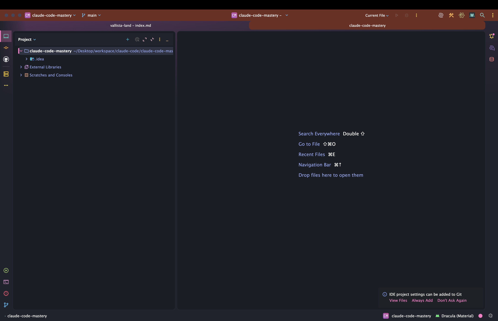
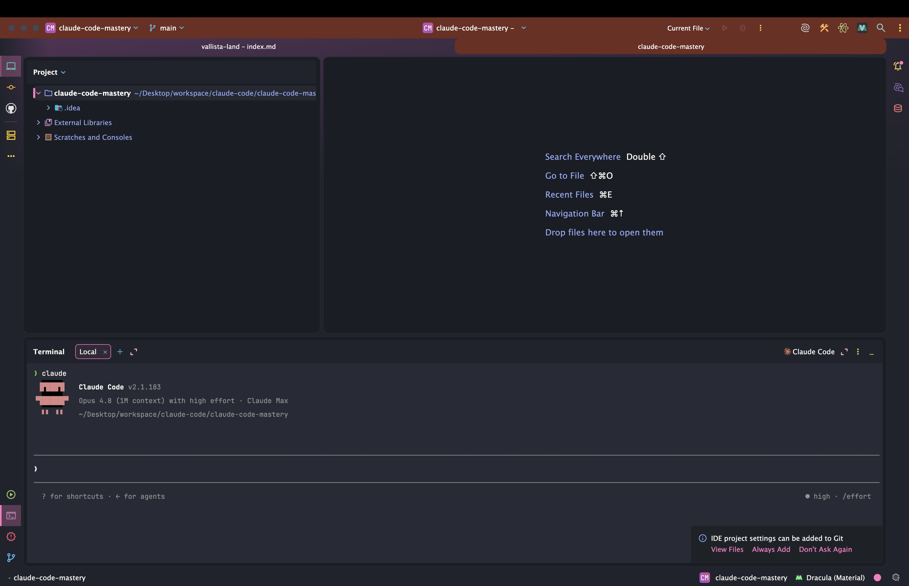
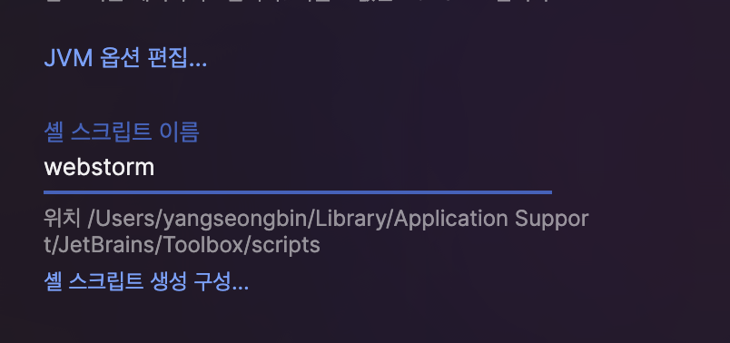
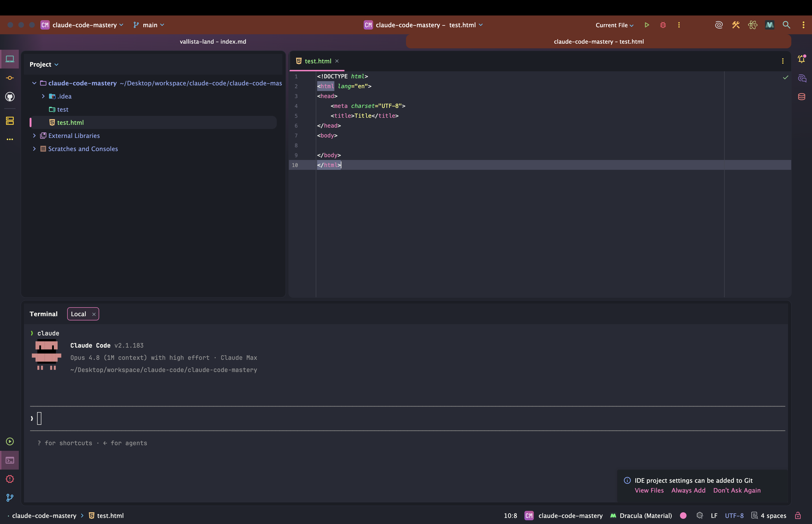
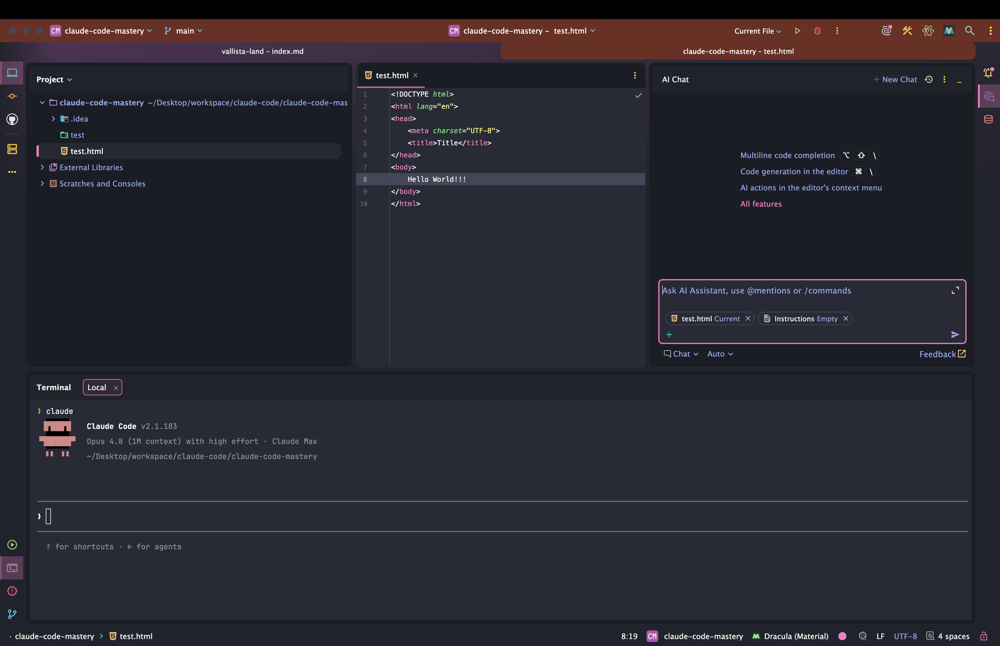
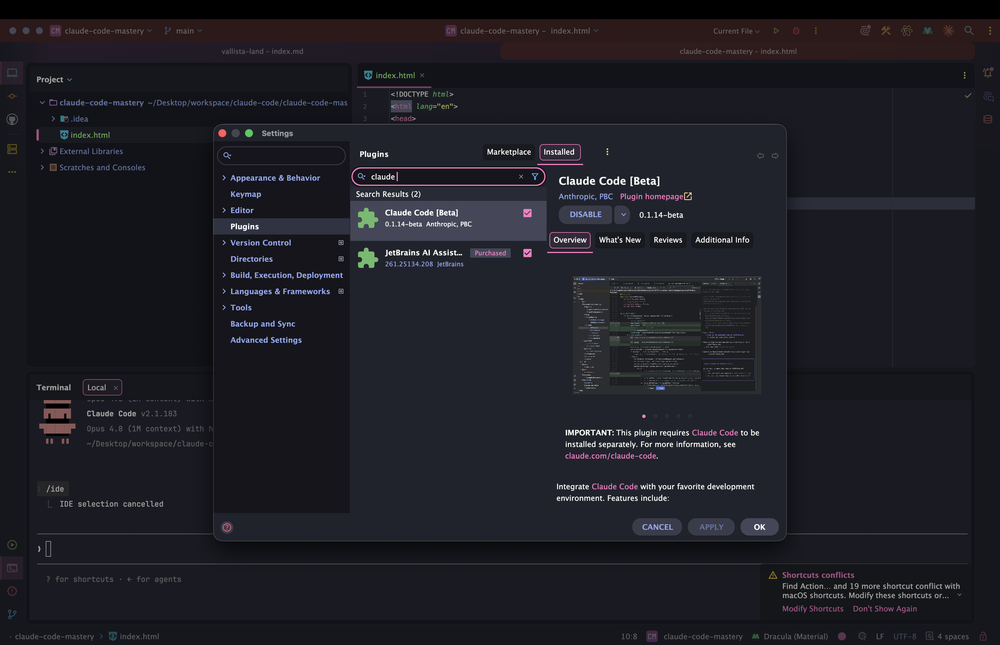
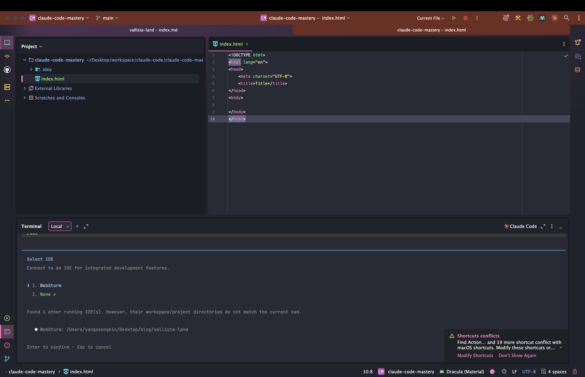
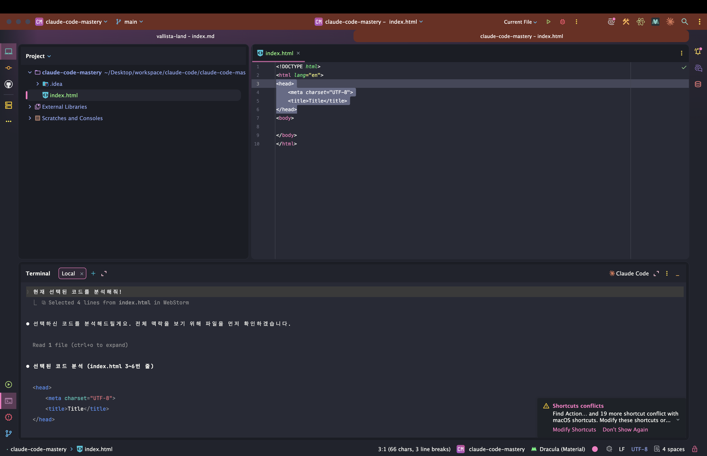

> 해당 포스팅은 [클로드 코드 완벽 마스터: AI 개발 워크플로우 기초부터 실전까지](https://inf.run/vN55k)를 참조하여 작성하였습니다.


## 🧩 Cursor AI 설치: VSCode, Cursor, Antigravity 관계

[지난 섹션](/claude-code-클로드-코드-맛보기-및-초기화)까지는 *터미널 환경* 에서 클로드 코드를 다뤘다. 이제부터는 **코드 에디터** 와 통합해, 변경된 파일을 *눈으로 보며*
작업하는 한층 편한 환경으로 넘어간다. 강의에서는 **Cursor** 를 쓰지만, 이 글은 *내가 실제로 쓰는* **WebStorm (JetBrains)** 을 중심으로 풀어가려 한다.

그래도 괜찮은지 *불안할 수 있는데*, 강사님이 못 박아 준다.

> 결론부터 말씀드리면 **다 됩니다.** 아무거나 사용하셔도 돼요.

왜 그런지, *에디터들의 관계* 부터 짚어보면 이 말이 완전히 이해된다.

### VS Code, Cursor, Antigravity는 한 뿌리

먼저 이름부터 정리하자. **VS Code** 는 *마이크로소프트* 가 만든, 코드 수정에 최적화된 대표적인 코드 에디터다. 그런데 이 VS Code가 **오픈소스** 라는 점이 중요하다. 소스 코드가 공개돼
있으니, *누구나 가져다* 자기만의 에디터를 만들 수 있다.

> 이게 바로 **Fork**, 복사해서 새로 만드는 개념이죠. 어렵지 않죠?

**Cursor** 와 **Antigravity** 가 바로 그렇게 태어났다. VS Code의 오픈소스를 *Fork (복사)* 한 뒤, 거기에 **자기만의 AI 코딩 기능** 을 얹어 출시한 에디터들이다.

| 에디터          | 정체                                                   |
|-----------------|--------------------------------------------------------|
| **VS Code**     | 마이크로소프트가 만든 *오픈소스* 코드 에디터 (뿌리)    |
| **Cursor**      | VS Code를 *Fork* 해 **AI 자동완성** 을 얹은 에디터     |
| **Antigravity** | VS Code를 *Fork* 해 **AI 기능** 을 얹은 또 다른 에디터 |

그래서 이 셋은 *UI·단축키·확장 프로그램 호환성* 이 거의 똑같다. 한 뿌리에서 갈라져 나왔으니 당연한 일이다.

### 핵심: 클로드 코드는 "터미널"에서 돈다

여기서 *가장 중요한 사실* 이 나온다. **클로드 코드는 터미널에서 실행되는 도구** 라는 점이다. 우리가 [앞서](/claude-code-클로드-코드-맛보기-및-초기화) 터미널에서 `claude`
명령어로 실행했던 걸 떠올려보자.

즉, 에디터는 클로드 코드를 *돌리는 주체* 가 아니다. 에디터가 하는 일은 딱 두 가지다.

1. **프로젝트 구조와 파일을 보여주는** *뷰어* 역할
2. **내장 터미널** 을 띄워, 그 안에서 `claude` 를 실행

> 우리는 (에디터 자체의) AI 기능은 사용 안 할 거기 때문에, **아무거나 선택해서 사용하셔도 돼요.**

핵심을 다시 짚으면 — *Cursor의 AI 자동완성* 같은 기능은 **쓰지 않는다.** 에디터는 그저 *파일을 보고, 내장 터미널로 클로드 코드를 실행* 하는 용도일 뿐이다. 그러니 **터미널만 지원한다면** VS
Code든, Cursor든, Antigravity든, **JetBrains 계열 (WebStorm·IntelliJ)** 이든 *전부 동일하게* 클로드 코드를 쓸 수 있다.

> 강의에서 굳이 *Cursor* 를 고른 건, 무료 플랜에서도 **탭 자동완성** 을 제공하기 때문이었다. 하지만 그 기능을 안 쓸 거라면 *선택의 이유* 도 사라진다. **편한 툴을 쓰면 된다.**

### 그래서 나는 WebStorm을 쓴다

**WebStorm** 은 *JetBrains* 가 만든 강력한 웹 개발 IDE다. 강사님이 *"IntelliJ를 써도 된다"* 고 언급했는데, WebStorm은 **IntelliJ와 같은 JetBrains 계열**
이니 *정확히 같은 이야기* 가 적용된다.

> 한 가지만 짚고 가자. WebStorm은 Cursor·Antigravity처럼 *VS Code를 Fork한 것은 아니다.* JetBrains의 독자적인 *IntelliJ 플랫폼* 위에서 동작한다. 하지만
> **클로드 코드가 터미널에서 돈다** 는 사실은 변하지 않으니, *에디터의 출신과 무관하게* 똑같이 잘 쓸 수 있다.

WebStorm은 이미 *프로젝트 탐색, 강력한 코드 인텔리전스, Git 연동* 등을 훌륭히 갖췄고, 무엇보다 **내장 터미널** 을 지원한다. 클로드 코드를 쓰는 데 필요한 조건은 이걸로 충분하다.

#### WebStorm에서 클로드 코드 실행하기

순서는 *터미널에서 했던 것* 과 똑같다. 단지 그 터미널을 **WebStorm 안에서** 연다는 점만 다르다.

1. WebStorm으로 **작업할 프로젝트 폴더를 연다** (`File → Open`)
2. 하단의 **터미널 탭** 을 연다 — 단축키는 다음과 같다
    - **macOS**: `Option(⌥)` + `F12`
    - **Windows/Linux**: `Alt` + `F12`
3. 열린 *내장 터미널* 에서 클로드 코드를 실행한다





```bash
claude    # WebStorm 내장 터미널에서 클로드 코드 실행
```

이게 전부다. 이제 **왼쪽 패널** 로는 프로젝트 구조와 파일을 *눈으로 확인* 하고, **아래 터미널** 에서는 클로드 코드와 대화하며 작업하면 된다. 클로드 코드가 파일을 수정하면, WebStorm 에디터에서
*바뀐 내용* 이 바로바로 보인다. 터미널만 쓰던 때보다 훨씬 *직관적* 이다.

> 💡 JetBrains 계열에는 클로드 코드 연동을 돕는 **플러그인** 도 있다. 클로드 코드 안에서 `/ide` 명령어로 연결하면 *진단 정보 공유* 등 통합이 더 매끄러워진다.
> (필수는 아니니, 우선 *내장 터미널* 로 시작해도 충분하다.)

### 정리하며

에디터 선택과 WebStorm 활용을 정리하면 다음과 같다.

- **Cursor·Antigravity** 는 *VS Code를 Fork* 해 AI 기능을 얹은 에디터 → 한 뿌리라 거의 동일
- **클로드 코드는 터미널에서 동작** → 에디터는 *뷰어 + 내장 터미널* 역할일 뿐
- 그래서 VS Code·Cursor·Antigravity· **WebStorm (JetBrains)** 무엇이든 *동일하게* 사용 가능
- **WebStorm** → 프로젝트를 열고 *내장 터미널*(`⌥F12` / `Alt+F12`)에서 `claude` 실행
- (선택) `/ide` 로 JetBrains 플러그인과 연동하면 통합이 더 매끄러움

강의는 Cursor로 진행되지만, 우리는 *손에 익은* **WebStorm** 그대로 따라가면 된다. 에디터는 거들 뿐, 주인공은 어디까지나 **클로드 코드** 다. 이제 환경이 갖춰졌으니, 다음 챕터부터는
*에디터와 클로드 코드를 오가며* 본격적인 작업을 시작해보자.

## 🛠️ 코드 편집기 설명: cursor 커맨드, 확장프로그램 설치

[앞 챕터](#-cursor-ai-설치-vscode-cursor-antigravity-관계)에서 *에디터는 무엇을 써도 된다* 는 걸 확인했다. 이번엔 에디터를 **더 똑똑하게** 만드는 방법을 다룬다. 강의는
Cursor를 기준으로 *터미널에서 에디터 열기, 확장 프로그램 설치, 한글화, Live Server* 를 설명하는데, 이 글은 그 하나하나를 **WebStorm에서 어떻게 하는지** 로 바꿔 풀어보겠다. 도구만
다를 뿐, *목적과 흐름은 똑같다.*

### 1. 터미널에서 에디터 열기 — `cursor` 커맨드 vs `webstorm` 런처

강의의 첫 주제는, *마우스로 에디터를 여는 대신* **터미널에서 한 줄로** 여는 방법이다.

> 우리가 마우스로 커서 툴을 열 수도 있지만, **터미널에서** 해당 툴을 편리하게 열 수 있어요.

Cursor는 커맨드 팔레트 (`Cmd/Ctrl + Shift + P`)에서 *Install 'cursor' command* 를 설치하면, 터미널에서 `cursor .` 로 현재 폴더를 열 수 있다.
**WebStorm도 똑같은 기능** 이 있다. 바로 *명령줄 런처 (command-line launcher)* 다.

- **JetBrains Toolbox 사용 시**: Toolbox 설정에서 *Shell scripts* 경로를 켜두면 `webstorm` 명령어가 등록된다.
- **WebStorm 단독 실행 시**: 메뉴에서 `Tools → Create Command-line Launcher…` 를 실행해 등록한다.

등록을 마치면, 터미널에서 이렇게 *현재 폴더를 통째로* 열 수 있다.



```bash
webstorm .                 # 현재 폴더를 WebStorm으로 열기
webstorm ~/workspaces/my-project   # 특정 폴더를 WebStorm으로 열기
```

터미널에서 프로젝트 폴더로 이동한 뒤 `webstorm .` 한 줄이면 끝이다. *마우스로 폴더를 찾아 여는* 수고를 덜어준다.

### 2. 에디터 기본기 — 탐색·검색·터미널

에디터를 열었다면, *자주 쓰는 기본기* 부터 손에 익히자. 강의에서 다룬 것들을 WebStorm 기준으로 정리하면 이렇다.

| 기능                 | Cursor / VS Code           | **WebStorm (JetBrains)**                       |
|----------------------|----------------------------|------------------------------------------------|
| **프로젝트 탐색기**  | 좌측 액티비티 바 → 탐색기  | **Project 도구창** (`Cmd/Ctrl + 1`)            |
| **전체 검색**        | 좌측 검색 아이콘           | **Find in Files** (`Cmd/Ctrl + Shift + F`)     |
| **무엇이든 찾기**    | `Cmd/Ctrl + P` (파일 찾기) | **Search Everywhere** (`Shift` 두 번)          |
| **내장 터미널 열기** | `Cmd/Ctrl + J`             | **Terminal** (`Option(⌥) + F12` / `Alt + F12`) |

좌측 **Project 도구창** 으로 프로젝트 구조를 보고 새 파일·폴더를 만들고, **Find in Files** 로 특정 텍스트가 든 파일을 찾고, 하단 **터미널** 에서 클로드 코드를 실행한다. 이 흐름만
익혀도 *작업의 8할* 은 해결된다. (Git 기능은 *다음 챕터* 에서 따로 다룬다.)



### 3. 확장 프로그램 = "에디터에 까는 앱" — WebStorm은 플러그인

다음 주제는 **확장 프로그램 (Extensions)** 이다. 코드 편집기는 *그 자체로는* 텍스트 편집기에 가깝다는 게 출발점이다.

> 우리가 사용하는 코드 편집기는 그냥 *메모장 같은 텍스트 편집기* 에요. 그런데 **확장 프로그램** 을 설치하면 이 코드 편집기가 점점 똑똑해지는 거죠.

강사님의 비유가 직관적이다.

> 스마트폰으로 비유하면, 코드 편집기는 **기본 폰** 이고, 확장 프로그램은 **앱스토어에서 다운받은 앱** 이라고 보시면 됩니다.

VS Code 계열 (Cursor·Antigravity)은 이걸 *Extensions (확장 프로그램)* 라 부르고, **WebStorm은 *플러그인 (Plugins)*** 이라 부른다. 이름만 다를 뿐 *개념은
동일*
하다. WebStorm에서는 다음 경로로 설치한다.

- `Settings(환경설정) → Plugins → Marketplace` 에서 원하는 플러그인을 검색해 **Install**

> 💡 한 가지 차이가 있다. WebStorm은 *풀 기능 IDE* 라, VS Code에서 확장으로 깔아야 하는 *많은 기능 (JS·TS 지원, Git, 디버거 등)* 이 이미 **기본 내장** 돼 있다. 그래서
> 설치할 플러그인이 VS Code보다 *훨씬 적다.*

### 4. 한글화 — Korean Language Pack 플러그인

에디터가 영어로 떠서 불편하다면 *한국어로* 바꿀 수 있다. 강의에서는 Cursor에 *Korean Language Pack* 확장을 설치했는데, **JetBrains도 공식 한국어 플러그인** 을 제공한다.

1. `Settings → Plugins → Marketplace` 열기
2. **`Korean Language Pack / 한국어 언어 팩`** 검색 후 **Install** (JetBrains 공식 제공)
3. **WebStorm을 재시작** 하면 메뉴가 한국어로 표시된다

영어 UI가 익숙하다면 *굳이 바꿀 필요는 없지만*, 입문 단계에서 메뉴가 한국어면 한결 편하다. *취향껏* 선택하자.

### 5. Live Server 대신 — WebStorm 내장 미리보기

마지막은 **Live Server** 다. HTML 파일을 저장할 때마다 *브라우저가 자동 새로고침* 되어, 결과를 바로 확인하게 해주는 도구다.

> 이러한 Live Server는 개발을 할 때 **테스트하는 과정** 에서 유용하게 사용할 수 있어요. 다시 한번 말씀드리면, **테스트할 때** 사용하는 확장 프로그램입니다.

여기서 *반가운 소식* 이 있다. **WebStorm은 이 기능이 기본 내장** 되어 있어, 별도 확장을 설치할 필요가 없다. HTML 파일을 열면,

- 에디터 *우측 상단* 에 뜨는 **브라우저 아이콘** 에 마우스를 올려 원하는 브라우저를 클릭

하면, WebStorm의 *내장 웹 서버* 로 페이지가 열린다. 이후 코드를 **수정하고 저장** 하면 브라우저가 *자동으로 새로고침* 된다. Live Server와 **똑같은 경험** 을 *추가 설치 없이*
누릴 수 있는 셈이다.

### Cursor의 탭 자동완성은?

강의 말미엔 Cursor의 **탭 자동완성**(코드를 입력하면 다음 줄을 제안)도 소개되는데, [앞 챕터](#-cursor-ai-설치-vscode-cursor-antigravity-관계)에서 짚었듯 우리는 *에디터
자체의 AI 기능은 쓰지 않는다.* 코딩은 **클로드 코드** 에게 맡길 것이기 때문이다. 그러니 이 기능은 *없어도 그만* 이고, WebStorm을 그대로 써도 **아무 지장이 없다.**

그래도 *"WebStorm에서도 Cursor 같은 탭 자동완성을 쓰고 싶다"* 면 방법이 있다. JetBrains가 공식 제공하는 **AI Assistant** 플러그인이다.

- `Settings → Plugins → Marketplace` 에서 **`AI Assistant`** 를 검색해 설치 (최신 WebStorm에는 *기본 번들* 된 경우도 많다)
- 설치 후 *JetBrains AI* 에 로그인하면, **인라인 코드 완성**(Cursor의 탭 자동완성에 해당)과 AI 채팅 등을 쓸 수 있다

다만 *솔직하게* 말하면, 이 시리즈의 *주인공은 어디까지나 클로드 코드* 다. AI Assistant는 **별도 구독 (유료)** 이 필요하고, 클로드 코드와 *역할이 겹치는* 면도 있다. 그래서 **굳이 켜둘
필요는 없다.** *"이런 선택지도 있다"* 정도로만 알아두고, 실제 코딩은 **클로드 코드** 에게 맡기자.

> 💡 정리하면, *탭 자동완성이 꼭 필요하면* **AI Assistant 플러그인** 으로 채울 수 있지만, 클로드 코드를 *메인* 으로 쓰는 우리에게는 **선택 사항** 이다.



### 정리하며

WebStorm으로 에디터 환경을 다듬는 법을 정리하면 다음과 같다.

- **터미널에서 열기** → `webstorm .` (명령줄 런처 등록 후)
- **기본기** → Project 도구창 / Find in Files (`⌘⇧F`) / Search Everywhere (`Shift`×2) / 터미널 (`⌥F12`)
- **확장 = 플러그인** → `Settings → Plugins → Marketplace` (단, IDE라 기본 내장이 많아 설치할 게 적음)
- **한글화** → *Korean Language Pack* 플러그인 설치 후 재시작
- **Live Server** → WebStorm은 **내장 미리보기** 로 대체 (우측 상단 브라우저 아이콘)
- **Cursor 탭 자동완성** → 코딩은 클로드 코드가 하므로 *불필요*

이렇게 WebStorm을 *작업하기 좋은 상태* 로 갖췄다. 이제 에디터도, 클로드 코드도 준비됐으니, 다음 챕터에서는 **WebStorm 내장 터미널에서 클로드 코드를 실제로 구동** 하며 둘을 함께 굴리는
워크플로우를 익혀보자.

## 🔗 커서 AI 클로드 코드 사용하기 (WebStorm · macOS)

환경 준비는 끝났다. 이제 *진짜 핵심* 인 **에디터와 클로드 코드의 통합** 을 다룰 차례다. 강의는 Cursor에서 진행하지만, 우리는 **WebStorm (macOS)** 에서 *똑같은 흐름* 으로 따라간다.
핵심 질문은 하나다 — *어떻게 하면 클로드 코드가, 내가 지금 보고 있는 파일과 선택한 코드를 **알아서 인식** 하게 만들까?*

### 1. WebStorm 내장 터미널에서 클로드 코드 실행

가장 먼저 할 일은 [앞서](#-cursor-ai-설치-vscode-cursor-antigravity-관계) 익힌 그대로다. *프로젝트를 열고, 내장 터미널을 열고, 클로드 코드를 실행* 한다.

> 그러면 Cursor를 열고 우리 프로젝트를 열어 보도록 할게요. … 보시는 것처럼 **Claude Code가 실행되는 걸** 확인할 수 있어요.

WebStorm 기준 순서는 이렇다.

1. WebStorm으로 **작업할 프로젝트 폴더를 연다**
2. **내장 터미널** 을 연다 — macOS 단축키는 `Option(⌥) + F12`
3. 터미널에서 클로드 코드를 실행한다

```bash
claude    # WebStorm 내장 터미널에서 클로드 코드 실행
```

> 💡 강의에서는 Cursor (VS Code 계열)라 터미널 단축키가 `Cmd + J` 였지만, **WebStorm은 `⌥F12`** 다. 에디터마다 단축키가 다르니 *내 도구의 것* 을 기억하자.

### 2. 통합의 진짜 이점 — 코드를 "알아서" 인식한다

단순히 터미널에서 실행하는 것만으로는 *터미널만 쓰던 때* 와 큰 차이가 없다. **통합의 진가** 는 따로 있다.

에디터와 클로드 코드가 제대로 연결되면, *내가 에디터에서 선택한 코드 블록* 이나 *지금 편집 중인 파일* 을 클로드 코드가 **자동으로 인식** 한다. 일일이 `@파일명` 으로 짚어주지 않아도, *"이 부분
고쳐줘"* 라고만 해도 **맥락을 알아듣는다** 는 뜻이다.

> 이러한 건 참고로 알고 계시면 **정말 편할 거예요.**

즉, 에디터에서 코드를 *드래그로 선택* 한 채 클로드 코드에게 말을 걸면, 그 선택 영역이 *대화의 컨텍스트로 자동 전달* 된다. 파일을 직접 열거나 경로를 입력하는 *수고* 가 확 줄어든다.

### 3. 통합 설정·확인 — `/ide` 명령어

그렇다면 이 통합은 어떻게 켤까? 핵심은 클로드 코드의 **`/ide`** 명령어다.

> 만약에 저처럼 우측 하단에 *Claude Code가 어떤 코드를 선택했는지, 어떤 파일 안에서 작업하고 있는지* 표시가 **안 되시는 분** 들은, Claude Code에서 **`/ide`** 를 해보세요.

WebStorm에서 통합을 켜는 순서는 다음과 같다.

1. **JetBrains 플러그인 설치** — `Settings → Plugins → Marketplace` 에서 **`Claude Code`** 를 검색해 설치한 뒤 WebStorm을 *재시작* 한다. *(
   Cursor·VS Code 계열은 터미널에서 `claude` 를 처음 실행할 때 확장이 자동 설치되지만, **JetBrains는 마켓플레이스에서 직접** 설치해주는 게 확실하다.)*
2. **내장 터미널에서 `claude` 실행** — 반드시 *WebStorm 안의* 내장 터미널이어야 한다. (외부 터미널이면 어떤 IDE에 붙을지 알 수 없다.)
3. **`/ide` 입력** — 연결할 IDE 목록이 뜨면 *실행 중인 WebStorm* 을 선택한다.

```bash
/ide    # 현재 IDE(WebStorm)와 통합 연결
```







연결에 성공하면, 클로드 코드 화면 한쪽에 *연결된 IDE 이름* 이 표시되고, 이때부터 **선택 영역·현재 파일** 이 자동으로 공유된다. (클로드 코드가 파일을 수정할 때 *변경 사항을 IDE의 diff*
로 보여주는 등, 통합이 한층 매끄러워진다.)

### 4. 터미널 다루기 — 이동·분할·여러 개 띄우기

작업을 하다 보면 *터미널 창을 내 입맛대로* 배치하고 싶어진다. WebStorm 내장 터미널도 이런 조작을 풍부하게 지원한다.

| 하고 싶은 것         | WebStorm에서                                                             |
|----------------------|--------------------------------------------------------------------------|
| **터미널 열기/닫기** | `Option(⌥) + F12` 토글                                                   |
| **창 위치 옮기기**   | 터미널 탭의 *우클릭 → Move* 또는 도구창 *설정(⚙️) → View Mode* 로 재배치 |
| **좌우로 분할**      | 터미널 우측 상단 *Split* 아이콘 (한 화면에 *여러 세션* )                 |
| **여러 터미널**      | 터미널 도구창의 `+` 로 *새 탭* 추가, 탭으로 전환                         |

예컨대 **한쪽엔 클로드 코드, 다른 쪽엔 개발 서버**(`npm run dev`)를 띄워두고 *나란히* 보는 식으로 쓰면 편하다. *터미널을 자유롭게* 다룰수록 작업 흐름이 매끄러워진다.

### 5. 플러그인 UI vs 터미널 — 무엇을 권장할까

JetBrains·VS Code 계열에는 클로드 코드를 *아이콘 클릭* 으로 띄우는 **플러그인 UI** 도 있다. 다만 강사님은 *분명한 권장* 을 남긴다.

> 현재 확장 프로그램은 Claude Code의 **모든 기능을 제공하지 않으므로**, 터미널 기반 실행을 권장합니다.

| 실행 방식                 | 특징                                                     |
|---------------------------|----------------------------------------------------------|
| **터미널 기반** (권장 ✅) | *모든 기능* 을 안정적으로 사용 + `/ide` 로 통합까지 챙김 |
| **플러그인 UI**           | 클릭으로 간편하지만, *아직 베타* 라 일부 기능만 지원     |

정리하면, **클로드 코드는 내장 터미널에서 `claude` 로 실행** 하고, **`/ide` 로 통합** 을 더하는 방식이 *가장 안정적* 이다. 플러그인 UI는 *정식 버전에서 무르익으면* 그때 편한 쪽을
고르면 된다.

### 정리하며

WebStorm에서 클로드 코드를 통합해 쓰는 법을 정리하면 다음과 같다.

- **실행** → 프로젝트를 열고 *내장 터미널*(`⌥F12`)에서 `claude`
- **통합의 이점** → 선택한 코드·현재 파일을 클로드 코드가 *자동 인식*
- **통합 켜기** → `Claude Code` 플러그인 설치 후, 내장 터미널에서 `claude` → **`/ide`** 로 WebStorm 연결
- **터미널 조작** → `⌥F12`(토글)·분할·여러 탭으로 *입맛대로* 배치
- **권장 방식** → *터미널 기반 실행* (플러그인 UI는 아직 베타)

이제 WebStorm과 클로드 코드가 *한 몸처럼* 움직인다. 에디터에서 코드를 보고, 터미널에서 클로드 코드와 대화하고, 변경 사항을 바로 확인하는 *왕복 없는* 워크플로우가 완성됐다. 다음 챕터에서는 이 환경
위에서 **클로드 코드의 권한 관리** 등 한 걸음 더 들어간 사용법을 다뤄보자.

## 🩹 코드 편집기 /ide 연결 이슈 공유

[앞 챕터](#-커서-ai-클로드-코드-사용하기-webstorm--macos)에서 `/ide` 로 에디터와 클로드 코드를 통합했다. 그런데 *막상 따라 해보면* `/ide` 가 잘 안 되는 경우가 있다. 결론부터
안심시켜 두자.

> 우선 결론부터 말씀드리면, **`/ide` 명령어로 통합 안 하셔도 됩니다.**

### `/ide`는 "있으면 편한" 부가 기능일 뿐

가장 중요한 사실부터 짚자. **IDE 통합은 *필수가 아니다.*** 클로드 코드의 진짜 엔진은 *터미널에서 도는 부분* 이고, `/ide` 는 그저 *보기 편하게* 거들어주는 양념이다.

> 해당 명령어 없이도 **Claude Code는 완벽하게 동작해요.** IDE로 통합을 해서 사용하면, 우리가 *어떤 코드를 보고 있는지* 인식해서 **조금 더 편리해질 뿐** 이에요.

즉, `/ide` 가 연결되면 *선택한 코드·현재 파일* 을 자동 인식해 편할 뿐, **연결이 안 돼도 클로드 코드의 모든 기능** 은 *그대로* 쓸 수 있다. 통합이 안 된다고 *작업을 못 하는 게 아니다.* 이
점만 기억해도 마음이 한결 편해진다.

### 알려진 이슈 — 당신 잘못이 아니다

`/ide` 를 입력해도 *인식하지 못하거나 연결에 실패* 하는 경우가 있다. 특히 **Windows 환경** 에서 자주 보고된다. 여기서 *자책할 필요 없다.*

> 이러한 건 수강생 분들이나 *환경이 잘못된 게 아니라*, **Claude Code에서 공개된 이슈** 이기 때문에, Claude Code가 업데이트되면서 **점점 안정화** 될 거예요.

정리하면 이렇다.

- 이건 *내 설정* 이나 *내 PC* 의 문제가 아니라, **클로드 코드 자체의 알려진 이슈** 다.
- 시간이 지나 **업데이트로 안정화** 될 예정이다.
- 경우에 따라 *명령어 자체가 바뀌거나 사라질* 수도 있다. (AI 도구는 *워낙 빠르게* 변한다.)

### WebStorm에서 `/ide`가 안 될 때 점검할 것

그래도 *통합을 꼭 쓰고 싶다면*, 막히기 전에 아래를 확인해보자. 강의에서 짚듯, **IDE 통합을 쓰려면 반드시 확장 (플러그인)이 설치돼 있어야** 한다.

| 점검 항목                | 확인 내용                                                                         |
|--------------------------|-----------------------------------------------------------------------------------|
| **플러그인 설치**        | `Settings → Plugins` 에 **`Claude Code`** 플러그인이 깔려 있는지 확인             |
| **재시작**               | 플러그인 설치 후 WebStorm을 *재시작* 했는지                                       |
| **내장 터미널에서 실행** | `claude` 를 *외부 터미널* 이 아닌 **WebStorm 내장 터미널**(`⌥F12`)에서 실행했는지 |
| **최신 버전**            | 클로드 코드를 *최신 버전* 으로 업데이트했는지 (`claude update` 등)                |

이걸 다 확인했는데도 안 된다면, *위에서 말한 알려진 이슈* 일 가능성이 크다. **억지로 붙들고 씨름하지 말자.** `/ide` 없이 *내장 터미널만으로도* 충분히 잘 돌아가고, 통합은 *나중에 안정화됐을 때*
다시 시도하면 된다.

### 정리하며

`/ide` 연결 이슈를 정리하면 다음과 같다.

- `/ide` 통합은 **필수 아님** → 없어도 클로드 코드는 *모든 기능* 정상 동작
- 연결 실패 (특히 *Windows* )는 **클로드 코드의 알려진 이슈** → 내 잘못 아님, *업데이트로 해결* 예정
- 통합을 쓰려면 → **`Claude Code` 플러그인 설치 + 재시작 + 내장 터미널 실행 + 최신 버전** 확인
- 그래도 안 되면 → *붙들지 말고* 내장 터미널로 진행, 통합은 *나중에*

통합이 *되면 좋고, 안 돼도 그만* 이라는 가벼운 마음으로 넘어가자. 이제 IDE 환경 이슈까지 정리했으니, 다음 섹션에서는 클로드 코드를 *더 안전하고 똑똑하게* 부리는 **권한 관리** 로 들어가 보자.

## 🏎️ 확장 프로그램 vs 터미널 CLI

지금까지 *플러그인 UI보다 터미널이 낫다* 는 이야기를 슬쩍슬쩍 흘렸다. 이번 챕터에서 그 이유를 **제대로** 못 박는다. 클로드 코드의 실행 방식이 *여러 갈래* 로 늘어나면서, *"어디서 실행해야 맞나?"*
하는 질문이 많아졌기 때문이다.

> 수강생 분들이나 유튜브에서 *이러한 질문* 이 자주 올라오는 걸 확인할 수 있어요.

### 결론: 무조건 "터미널 CLI"

결론부터 말하면 간단하다. 클로드 코드는 **반드시 터미널에서 `claude` 명령어로 실행** 해야 한다. 확장 프로그램 (플러그인)의 *사이드바·탭 UI* 나 데스크톱 앱의 *코드 탭* 이 아니라, **터미널
CLI** 가 정답이다.

두 방식의 차이는 *생각보다 크다.*

| 실행 방식                   | 기능 지원             | 응답 속도    | 권장도           |
|-----------------------------|-----------------------|--------------|------------------|
| **터미널 CLI** (`claude`)   | **모든 기능** 지원 ✅ | *빠름* ⚡    | **강력 권장** 🔥 |
| **확장 프로그램 / 코드 탭** | *일부 기능* 만 지원   | 느릴 수 있음 | 보조용으로만     |

공식 문서에서도 **터미널 CLI 방식이 완전한 기능을 지원** 한다고 명시한다. 반면 플러그인 UI는 *일부 기능만* 제공하고 응답도 *느릴 수 있다.* 그러니 플러그인 UI는 *간단한 질문* 같은 **보조
도구** 로만 쓰고, 본 작업은 *터미널 CLI* 로 하자.

> 람보르기니 사놓고 **주차장에서 에어컨만 트는 격** 이에요. *CLI로 도로에 나가세요~!* 😊

강사님의 이 비유가 핵심을 찌른다. 클로드 코드라는 *강력한 엔진* 을 사놓고, 플러그인 UI라는 *반쪽짜리 모드* 로만 쓰는 건 너무 아깝다. **제 성능을 다 쓰려면 터미널 CLI로 달려야 한다.**

### WebStorm에서는 — 내장 터미널이 곧 정답

여기서 *반가운 점* 이 있다. 우리는 [이미 앞에서](#-커서-ai-클로드-코드-사용하기-webstorm--macos) **WebStorm 내장 터미널에서 `claude` 로 실행** 하는 방식을 택했다. 즉,
*처음부터 가장 좋은 길* 로 가고 있었던 셈이다.

> 클로드 코드는 *커서 터미널, 일반 터미널, IntelliJ 내장 터미널* 등 **어떤 터미널에서 시작해도** 모든 스펙을 활용할 수 있어요.

강사님이 *IntelliJ 내장 터미널* 을 콕 집어 말했는데, **WebStorm도 같은 JetBrains 계열** 이니 *완벽히 동일* 하다. 다시 정리하면 이렇다.

1. WebStorm **내장 터미널** 을 연다 (`Option(⌥) + F12`)
2. 그 안에서 `claude` 를 실행한다

```bash
claude    # WebStorm 내장 터미널 = 터미널 CLI = 모든 기능 + 빠른 응답
```

이게 *전부* 다. WebStorm의 내장 터미널은 결국 **진짜 터미널** 이므로, 여기서 `claude` 를 치는 순간 우리는 **터미널 CLI 방식의 모든 이점** 을 그대로 누린다.

### 한 가지 주의 — "터미널로 열기" 메뉴와 플래그

플러그인 UI에는 보통 *"터미널에서 열기 (Open in Terminal)"* 같은 메뉴도 있다. 클릭하면 CLI로 시작되긴 하지만, **한 가지 함정** 이 있다.

> 이 방법으로는 별도의 **플래그 (flag)** 를 지정할 수 없다는 점에 유의해야 한다.

예를 들어 권한 확인을 건너뛰는 `--dangerously-skip-permissions` 같은 *플래그* 를 붙이고 싶어도, 메뉴로 띄우면 *기본 모드로만* 실행되어 옵션이 먹지 않는다.

```bash
# 플래그를 직접 붙이려면, 내장 터미널에서 직접 입력해야 한다
claude --dangerously-skip-permissions   # (예시) 권한 확인 건너뛰기
```

> ⚠️ `--dangerously-skip-permissions` 는 *이름 그대로* 모든 권한 확인을 건너뛴다. **위험할 수 있으니** 무엇을 하는지 정확히 알 때만, 신뢰하는 프로젝트에서 *신중히* 쓰자.
> (권한에 대한 자세한 내용은 *다음 섹션* 에서 다룬다.)

그래서 결국 **내장 터미널에 직접 `claude [플래그]` 를 입력** 하는 방식이, *기능도 속도도 유연함도* 모두 챙기는 최선이다.

### 정리하며

확장 프로그램과 터미널 CLI를 정리하면 다음과 같다.

- 클로드 코드 실행은 **무조건 터미널 CLI**(`claude`) → *모든 기능 + 빠른 응답*
- 플러그인 UI는 *일부 기능* 만, 응답도 느릴 수 있음 → **보조용** 으로만
- WebStorm은 **내장 터미널**(`⌥F12`)에서 `claude` → *처음부터 최선의 방식*
- *"터미널로 열기" 메뉴* 로는 **플래그 지정 불가** → 옵션이 필요하면 *직접 입력*

*람보르기니로 도로를 달리듯*, WebStorm 내장 터미널에서 클로드 코드의 **풀 파워** 를 끌어내자. 이것으로 **Cursor AI IDE 통합** 섹션을 마친다. 에디터와 클로드 코드를 *한 몸* 으로
묶었으니, 다음 섹션에서는 클로드 코드를 *더 안전하게* 다루는 **권한 관리** 의 세계로 들어가 보자.
