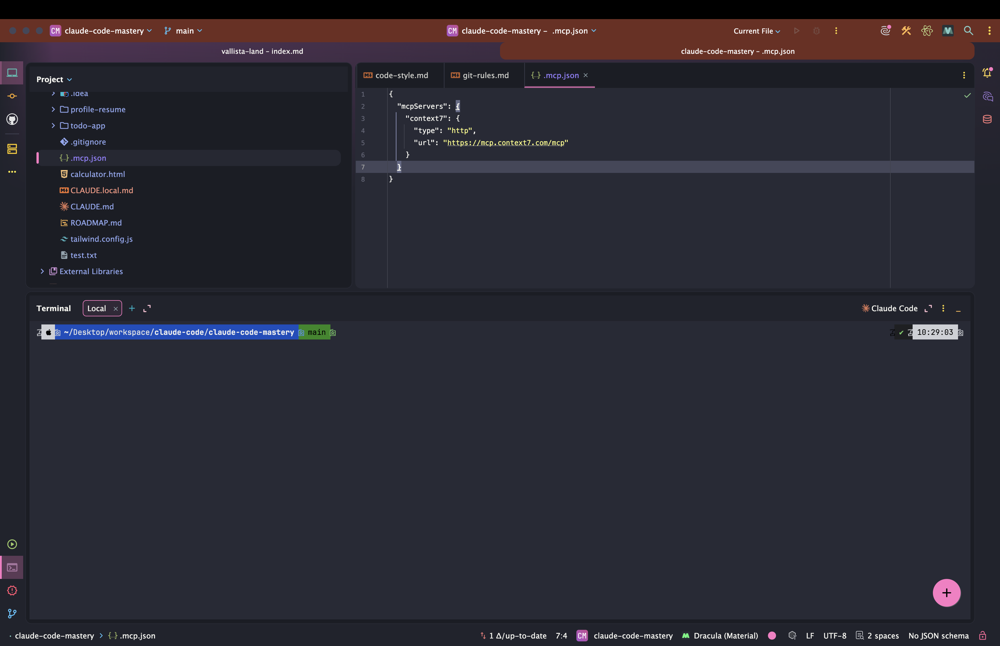
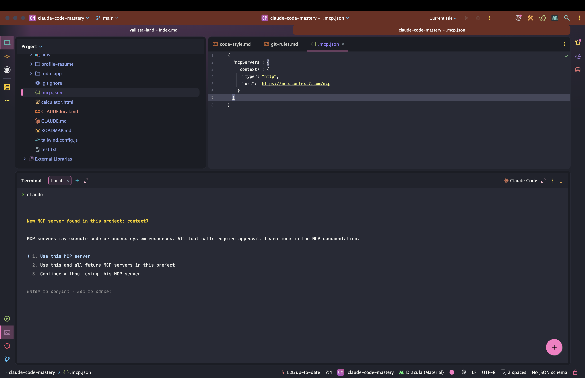
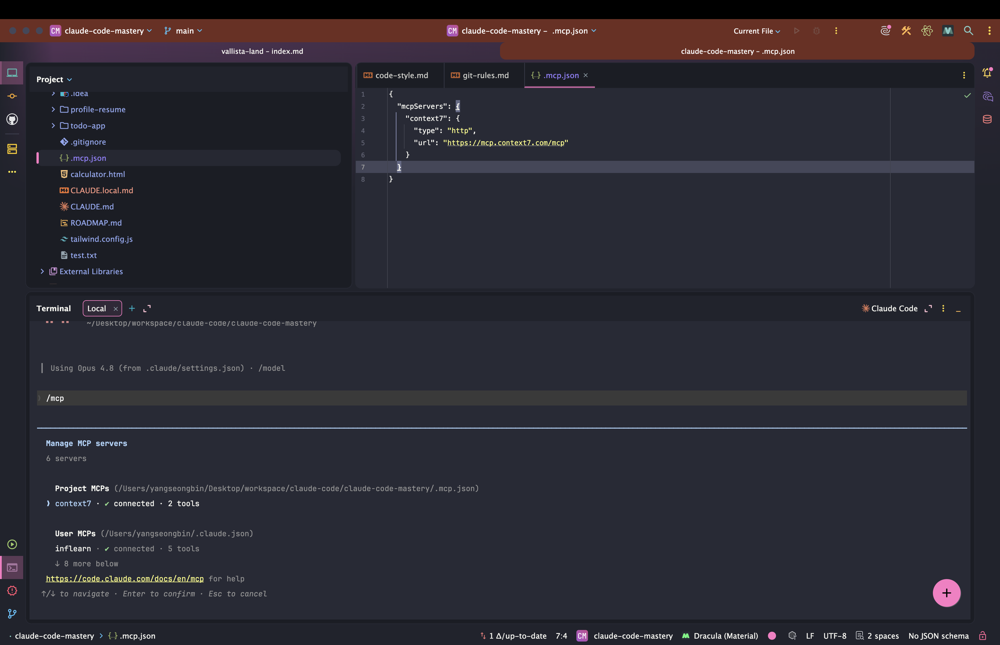
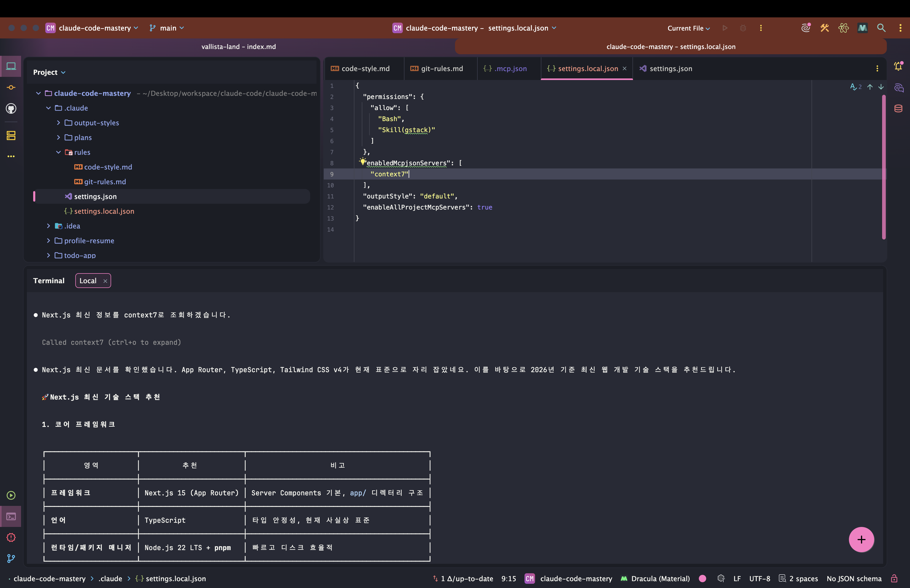

> 해당 포스팅은 [클로드 코드 완벽 마스터: AI 개발 워크플로우 기초부터 실전까지](https://inf.run/vN55k)를 참조하여 작성하였습니다.


## 🔌 MCP란? 클로드 코드 MCP 활용법

지금까지 클로드 코드를 *내 프로젝트에 맞게* 길들이는 법을 배웠다. 그런데 클로드 코드에는 *한 가지 한계* 가 있다. **자기 자신과 우리 코드** 말고는 *바깥세상* 을 모른다는 점이다. 내 Notion
워크스페이스도, 우리 회사 데이터베이스도, 유튜브 통계도 *직접 들여다볼 수 없다.* 이 **벽을 허무는** 기술이 바로 **MCP** 다.

> MCP는 모델 컨텍스트 프로토콜 (Model Context Protocol)의 약어로, Claude와 같은 AI 모델이 *다른 프로그램들과 소통* 할 수 있게 해주는 **다리 역할** 을 하는 기술이라고
> 생각하시면
> 됩니다.

### MCP란 무엇인가 — AI를 위한 '다리'

예를 들어 내 Notion에 *논문 한 편* 이 정리돼 있고, 그걸 *분석해서 새 글을 써달라* 고 클로드에게 부탁한다고 하자.

> 이러한 LLM은 제 워크스페이스에 접근할 수 없기 때문에 분석을 할 수 없겠죠.

클로드는 *우리 대화* 만 알 뿐, **Notion 안을 들여다볼 권한도 통로도 없다.** 바로 이 *통로* 를 표준화한 규칙이 **MCP** 이고, 그 규칙대로 만든 *실제 프로그램* 이 **MCP 서버** 다.

| 용어         | 뜻                                                         |
|--------------|------------------------------------------------------------|
| **MCP**      | AI 모델과 외부 프로그램이 *소통하는 규칙* (프로토콜)       |
| **MCP 서버** | 그 규칙을 *구현한* 실제 프로그램 (Notion·DB·API 등과 연결) |

이 *서버* 만 붙이면 클로드는 **유튜브 Data API**, **Notion**, **데이터베이스** 등 *온갖 외부 서비스* 와 연동된다. 활용 범위가 *대화* 를 넘어 **우리 업무 전체** 로 넓어지는
셈이다.

> 이처럼 MCP는 단순히 AI 모델과 대화할 수 있는 것을 넘어, 다른 프로그램들과 소통할 수 있게 해주는 *중요한 소통 방법* 이죠.

MCP는 *클로드를 만든* **Anthropic** 이 직접 만든 표준이다. 그래서 클로드 코드뿐 아니라 **Claude Desktop**, [**Cursor AI
**](/claude-code-cursor-ai-ide-통합) 같은 *여러 개발 툴* 이 *공통으로* 지원한다. 한 번 익혀두면 *도구를 바꿔도* 그대로 써먹을 수 있다는 뜻이다.

### 왜 중요할까 — 코드 할루시네이션 잡기

MCP의 가치를 *개발자* 입장에서 가장 크게 체감하는 순간은 **코드 할루시네이션** 을 막을 때다.

AI는 *학습한 시점* 까지의 정보만 안다. 그래서 *최신 라이브러리* 를 다루게 하면 **옛날 문법** 을 쓰거나, *존재하지도 않는 API* 를 *그럴듯하게* 지어내곤 한다. 이게 **할루시네이션 (환각)**
이다.

> 정확한 *맥락 (Context)* 을 제공하는 것이 중요하며, 이를 돕는 게 **Context7** 같은 최신 문서 플랫폼이에요.

**Context7** 은 *수많은 라이브러리의 최신 공식 문서* 를 모아두고, 클로드가 *코드를 짤 때 그 문서를 실시간으로 참고* 하게 해주는 MCP 서버다. 덕분에 **Next.js 15**, **React
19** 같은 *최신 스택* 도 *옛 문법 없이* 정확하게 다룰 수 있다. 이번 챕터에선 이 Context7을 *직접 설치* 해보며 MCP 설치의 흐름을 익혀보자.

### Context7 설치 — `claude mcp add`

MCP 서버 설치는 **`claude mcp add`** 명령으로 한다. 기본 형태는 이렇다.

```bash
claude mcp add <이름> -- <서버 실행 명령>
```

Context7을 *로컬 방식* 으로 붙이려면 이렇게 적는다.

```bash
claude mcp add context7 -- npx -y @upstash/context7-mcp
```

- **`context7`** — 내가 부를 *이름* (아무거나 지어도 되지만 보통 서버 이름 그대로 쓴다)
- **`-- npx ...`** — `--` *뒤* 는 그 서버를 *실제로 띄우는 명령* 이다

> Context7 사용 시 **API 키는 선택 사항** 이에요. 키 없이도 *무료* 로 쓸 수 있고, 필요하면 Context7 대시보드에서 발급받아 붙이면 됩니다.

API 키를 *쓰고 싶다면* 명령 끝에 옵션으로 붙인다. (없어도 동작하니, 처음엔 *키 없이* 시작하길 권한다.)

```bash
claude mcp add context7 -- npx -y @upstash/context7-mcp --api-key <발급받은_키>
```





설치한 MCP 서버 목록은 **`claude mcp list`** 로 확인할 수 있다.



### 설치 스코프 세 가지 — `.mcp.json`이 어디에 생기나

[설정 파일](/claude-code-설정-파일과-메모리-관리)·[메모리](/claude-code-설정-파일과-메모리-관리)와 *똑같이*, MCP도 **어디에 설치하느냐 (스코프)** 에 따라 적용 범위가 달라진다.
`--scope`(`-s`) 옵션으로 정한다.

| 스코프          | 옵션         | 적용 범위                 | 설정 위치                  |
|-----------------|--------------|---------------------------|----------------------------|
| **로컬** (기본) | `-s local`   | *나* + *이 프로젝트* 에만 | 내 로컬 설정 (Git 제외)    |
| **프로젝트**    | `-s project` | *이 프로젝트* (팀 공유)   | **`.mcp.json`** (Git 포함) |
| **유저**        | `-s user`    | *내 모든 프로젝트*        | 사용자 전역 설정           |

핵심은 **프로젝트 스코프** 다. `-s project` 로 설치하면 프로젝트 루트에 **`.mcp.json`** 파일이 *생성* 되고, 여기에 MCP 설정이 적힌다.

```bash
claude mcp add context7 -s project -- npx -y @upstash/context7-mcp
```

> 이 `.mcp.json` 을 **Git에 커밋** 하면, *팀원이 프로젝트를 받았을 때* 그 프로젝트에서 Claude Code가 Context7 MCP를 *마음껏 사용할 수 있는 거죠.*

즉 *팀 공통* 으로 쓸 서버는 **프로젝트 스코프**, *나만* 쓸 서버는 **로컬**, *모든 작업* 에 깔고 싶은 서버는 **유저** 스코프로 — [
`settings.json` 의 레벨 구분](/claude-code-설정-파일과-메모리-관리)과 *판박이* 다.

### ⚠️ 프로젝트 스코프 설치가 안 될 때

여기가 *강의 제목에도 콕 박힌* — **"프로젝트 스코프 설치가 안 될 때"** — 포인트다. MCP 서버를 추가하면 클로드 코드는 *보안상* **승인 요청 화면** 을 먼저 띄운다.

> 신뢰할 수 없는 MCP 서버는 *보안 위험* 이 될 수 있어, 클로드 코드가 *설치 전에* 한 번 더 물어보는 거예요.

그런데 *원격 (remote) 서버 방식* 으로 붙이려 할 때, **연결이 안 되거나 설치가 실패** 하는 경우가 있다. 이럴 땐 *당황하지 말고* 다음 순서로 풀어보자.

**① 로컬 (local) 서버 방식으로 바꿔본다.** 원격 URL로 붙이는 대신, `npx` 로 *내 컴퓨터에서 직접* 서버를 띄우는 방식으로 설치한다.

```bash
# 원격 방식이 실패한다면 ↓ 로컬 실행 방식으로
claude mcp add context7 -s project -- npx -y @upstash/context7-mcp
```

**② API 키를 빼고 재설치한다.** *키 설정* 때문에 막히는 경우가 있다. Context7은 *키 없이도 무료* 로 쓰이니, 일단 키를 **제거하고** 깔아본 뒤 잘 되면 그때 붙인다.

```bash
# 기존 설정을 지우고
claude mcp remove context7
# 키 없이 다시 설치
claude mcp add context7 -s project -- npx -y @upstash/context7-mcp
```

> 설치가 한 번에 안 된다고 *당황하실 필요 없어요.* 원격↔로컬, 키 유무를 *바꿔가며* 테스트해보면 됩니다.

MCP 서버는 *만든 곳마다* 설치 방식이 조금씩 다르다. **막히면** → *원격을 로컬로*, *키를 빼고*, 그래도 안 되면 [
`claude mcp list`](#context7-설치--claude-mcp-add) 로 *상태를 확인* 하는 — 이 *세 박자* 만 기억하자.

### MCP 사용하기 — `use [서버 이름]`

설치가 끝나면 *어떻게 쓸까?* MCP는 *항상* 끼어들지 않는다. 보통은 프롬프트에 **`use [서버 이름]`** 을 붙여 *명시적으로* 호출한다.

```text
React 19의 최신 useActionState 훅으로 폼을 만들어줘. use context7
```

이렇게 적으면 클로드는 *기억에 의존하지 않고* **Context7에서 최신 문서를 가져와** 코드를 짠다. 그래서 *옛 문법* 대신 *지금 맞는 코드* 가 나온다.

MCP **도구 (tool)를 실제로 쓰기 직전**, 클로드 코드는 — [권한 챕터](/claude-code-클로드-코드-권한)에서 봤던 그 방식대로 — **사용자 승인** 을 한 번 묻는다.

> MCP 서버의 도구를 사용하기 전 *승인을 요청* 하고, `allow` 목록에 추가하면 *다음부턴 묻지 않고* 재사용해요.

한 번 `allow` 해두면 *그 도구* 는 이후 자동 실행된다. 만약 **그 서버의 모든 도구** 를 *일일이 승인 없이* 쓰고 싶다면, [
`settings.json` 의 권한 규칙](/claude-code-클로드-코드-권한)에 **`mcp__[서버 이름]`** 형태로 적으면 된다.

```json
{
  "permissions": {
    "allow": [
      "mcp__context7"
    ]
  }
}
```

또는 아래와 같이 나올 수 있다.

```json
{
  "enabledMcpjsonServers": [
    "context7"
  ]
}
```



이렇게 하면 `context7` 서버가 *제공하는 도구 전부* 를 *묻지 않고* 허용한다. (단, *신뢰하는 서버* 에만 쓰자 — 권한을 통째로 여는 셈이니.)

### 정리하며

MCP 활용의 첫 단추를 정리하면 다음과 같다.

- **MCP** = AI와 외부 프로그램을 잇는 *소통 규칙*, 이를 구현한 게 **MCP 서버** (Anthropic 표준 → Claude·[Cursor](/claude-code-cursor-ai-ide-통합)
  공통 지원)
- **왜 쓰나** → 외부 서비스 연동 + **코드 할루시네이션** 방지 (예: **Context7** 로 최신 문서 참조)
- **설치** → `claude mcp add <이름> -- <실행 명령>`, 목록은 `claude mcp list`
- **스코프** → **로컬**(나·이 프로젝트) · **프로젝트**(`.mcp.json`, Git 공유) · **유저**(전역)
- ⚠️ **설치 실패 시** → *원격→로컬* 방식 전환, *API 키 제거 후* 재설치
- **사용** → 프롬프트에 **`use [서버 이름]`**, 모든 도구 허용은 **`mcp__[서버 이름]`** 권한

MCP를 붙이는 순간, 클로드 코드는 *우리 코드만 아는 도구* 에서 **바깥세상과 연결된 동료** 로 한 단계 올라선다. 다음 챕터부터는 *실무에서 진짜 유용한* MCP 서버들을 하나씩 붙여보며, 이 다리를
*어디까지 넓힐 수 있는지* 살펴보자.
