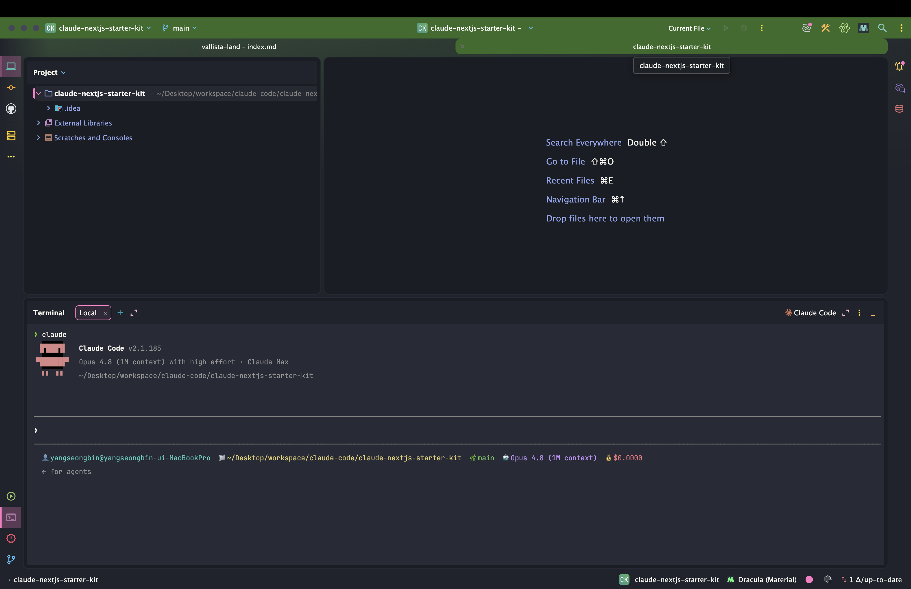
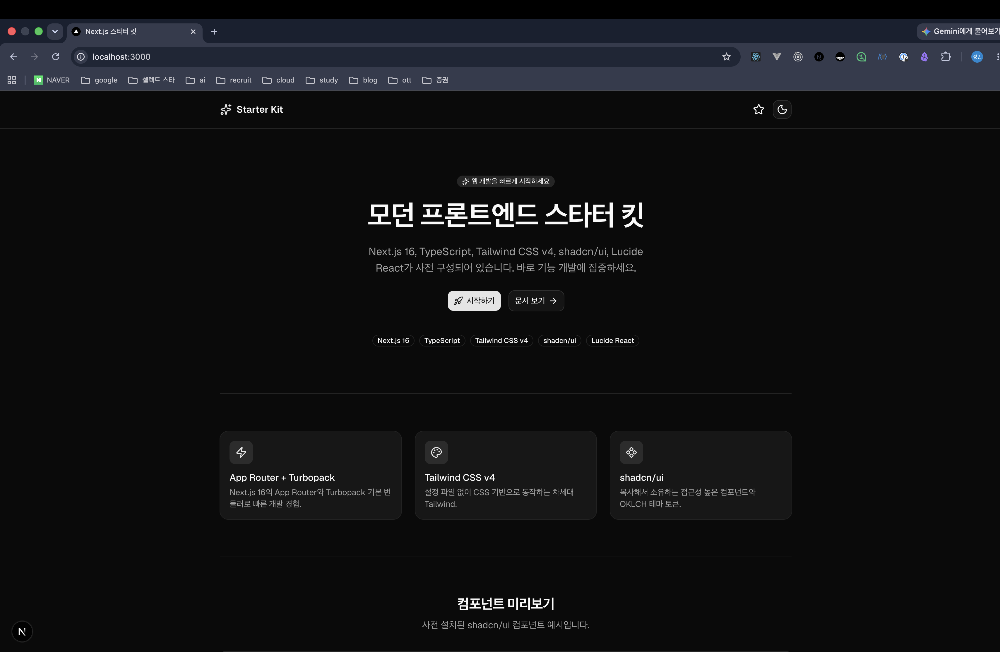

> 해당 포스팅은 [클로드 코드 완벽 마스터: AI 개발 워크플로우 기초부터 실전까지](https://inf.run/vN55k)를 참조하여 작성하였습니다.


## 🧠 AI 활용 프로젝트 생성 1: CoT 프롬프트 엔지니어링

[앞 섹션](/claude-code-모던-기술스택과-개발-워크플로우)에서 *기술 스택* 을 고르고, **탐색 → 계획 → 구현 → 커밋** 4단계 워크플로우까지 익혔다. 이제 그걸 *실전* 에 얹을 차례다. 드디어
**Next.js 스타터 킷** 을 *클로드 코드로 직접* 만들어본다.

폴더부터 잡자. 사용자 디렉터리 아래 `workspace/courses` 에 `claude-nextjs-starter-kit` 폴더를 만들고, [Cursor](/claude-code-cursor-ai-ide-통합)로
연 뒤 **`Ctrl+Esc`** 로 클로드 코드를 띄운다.

> 제가 *일부러* 터미널에 익숙해지도록 계속 보여드리는 거예요.



### AI 주도 vs 개발자 주도

프로젝트를 *시작* 하는 방식엔 두 갈래가 있다. **AI에게 전부 맡기기** vs **개발자가 주도하고 AI의 도움을 받기.**

> 어떤 게 좋을까요? 한번 *고민을 해보세요.*

정답은 *개발 경험* 에 달렸다. 경험이 *많을수록* — *무엇을 어떻게 시킬지* 알기에 — AI를 *더 싸게, 더 정확하게* 부린다.

> 기술 스택을 *이렇게 적는 것* 도, 제 **개발 경험이 있기 때문에** 가능한 거일 수도 있어요.

즉 *주도권을 쥔* 개발자일수록 AI가 *좋은 결과* 를 낸다. 이번 챕터는 **개발자가 주도하는** 쪽을 따라가 본다.

### 프로젝트 생성 요청 — 기술 스택을 '명시'하라

스타터 킷을 만들어달라고 할 때, *"Next.js로 만들어줘"* 처럼 *두루뭉술하게* 말하면 안 된다. **버전까지 콕 집어** 명시해야 한다.

```text
웹 개발을 빠르게 시작할 수 있는 스타터 킷을 만들어줘.
기술 스택:
- Next.js v15 (App Router)
- TypeScript
- Tailwind CSS v4 (no tailwind.config file)
- shadcn/ui
- Lucide React
```

*왜* 이렇게까지 적을까? AI는 *학습 시점* 의 정보에 기대다 보니, **옛 버전** 을 끌어오는 일이 잦기 때문이다.

> Next.js *v14* 나 *Page Router* 방식, Tailwind *v3* 방식 등 AI가 *간혹 이전 버전* 을 쓰는 경우가 있어요.

[기초 챕터에서 본 코드 할루시네이션](/claude-code-mcp-활용)과 같은 맥락이다. **최신 버전을 명확히 지정** 하는 것 — 이게 *개발자 주도* 의 첫 단추다.

### 플랜 모드로 계획부터

여기서 *바로 시키지 않는다.* [4단계 워크플로우](/claude-code-모던-기술스택과-개발-워크플로우)의 **계획** 단계를 살린다. **`Shift+Tab`**
으로 [플랜 모드](/claude-code-클로드-코드-권한)에 들어가, *정보를 수집하고 계획부터* 세우게 한다.

참고로 Next.js는 **`create-next-app`** 명령으로 *쉽게* 초기화된다. *이미 폴더가 있다면* 현재 위치에 까는 방식을 쓴다.

```bash
npx create-next-app .
```

> 단, `npx create-next-app .` 은 *현재 디렉터리에 파일이 없어야* 오류 없이 동작해요.

AI가 내놓은 계획 (초기화 → Tailwind·shadcn 설정 → 레이아웃 → 샘플 컴포넌트…)을 *그대로 수락* 하지 말고 **검토·수정** 하자. 강의에선 계획에 *"각 기술 스택의 최신 버전 준수 확인"*,
*"공식 문서 가이드 준수"* 같은 **고려사항** 을 더하고, *관련 공식 문서 링크* 를 **컨텍스트로 직접 제공** 한다.

### ⭐ CoT — AI를 '단계별로' 생각하게 하기

이 챕터의 *진짜 주제* 가 여기다. 계획을 *더 똑똑하게* 세우게 만드는 **CoT (Chain of Thought) 프롬프트 엔지니어링** 이다.

> CoT는 AI가 복잡한 문제를 **단계별로 끊어서** 논리적으로 *사고하도록 유도* 하는, Claude 공식 문서의 프롬프트 기법이에요.

사람도 *어려운 문제* 를 만나면 *머릿속으로 차근차근* 풀어나간다. AI에게도 *그 과정* 을 시키는 게 CoT다. 효과는 분명하다.

- **수학·논리·복잡한 작업** 의 해결 능력이 올라간다
- *중간 사고* 를 거치므로 **오류가 줄어든다**

활용법은 *놀랍도록 간단* 하다.

| 방식                    | 예시                                                    |
|-------------------------|---------------------------------------------------------|
| **트리거 문구**         | 프롬프트에 *"단계별로 생각하세요"* 한 줄 추가           |
| **사고 단계 개략 제시** | *"먼저 A를 확인하고, 다음 B를 설계한 뒤, C를 구현하라"* |

```text
스타터 킷을 만들기 전에, 단계별로 생각해서 계획을 세워줘.
먼저 공식 문서를 확인하고, 각 라이브러리의 최신 버전을 점검한 뒤,
설치 순서를 정리해줘.
```

이 *한 스푼* 이 [플랜 모드](/claude-code-클로드-코드-권한)와 만나면, AI는 *건너뛰지 않고* **논리적인 순서** 로 계획을 짠다. *복잡한 셋업일수록* 효과가 크다.

### 시행착오 — `temp` 디렉터리 트릭

순조롭진 않다. `create-next-app` 을 *현재 폴더* 에 돌리려는데, **이미 있는 `.claude` 디렉터리와 충돌** 해 오류가 났다. (앞서 *"파일이 없어야 한다"* 던 그 조건이다.)

*수동* 으로 우회하면 *오류가 더 늘고*, **공식 문서대로** 세팅되지 않을 위험이 있다. 그래서 강의가 쓰는 *영리한 트릭* 이 **임시 디렉터리** 다.

1. 루트에 **`temp`** 디렉터리를 만든다
2. 그 *안* 에 Next.js 프로젝트를 *깨끗하게* 세팅한다
3. 완료되면 `temp` 안의 내용을 **루트로 옮기고**, `temp` 는 **삭제** 한다

> 이렇게 하면 *오류 발생 가능성* 을 줄이면서, **정확하고 똑똑하게** 세팅할 수 있어요.

*빈 폴더* 에서 시작하니 충돌이 없고, 결과만 루트로 옮기면 끝이다. 덕분에 [앞서 명시한 컨텍스트](#프로젝트-생성-요청--기술-스택을-명시하라) 덕에 Claude Code가 *Tailwind v3* 가 아닌 *
*v4 가이드** 를 지키는 것도 확인된다.

### 진행 추적과 테스트

작업이 길어지면 *어디까지 됐나* 궁금하다. **`Ctrl+T`** 로 **To Do 목록** 을 열어 진행 상황을 추적한다. (강의에선 *7개 중 3개 완료* 를 확인하고 기다린다.)

완성되면 *직접* 띄워 확인한다.

```bash
npm run dev
```

`localhost` 에서 **다크모드까지 동작하는** Next.js 스타터 킷 UI를 *눈으로* 확인하면, 첫 프로젝트 셋업이 끝난다.

### 정리하며

CoT 프롬프트 엔지니어링으로 *프로젝트를 생성* 하는 흐름을 정리하면 다음과 같다.

- **AI 주도 vs 개발자 주도** → *경험이 많을수록* 개발자가 **주도** 할 때 결과가 좋다
- **기술 스택 명시** → *버전까지* (Next.js v15 App Router · TS · Tailwind v4 · shadcn/ui · Lucide) → *옛 버전* 방지
- **플랜 모드**(`Shift+Tab`) → *바로 코딩 X*, 계획을 **검토·수정** + 공식 문서를 컨텍스트로
- ⭐ **CoT** → *"단계별로 생각하라"* 로 **논리적 사고 유도** → 오류↓
- **`temp` 디렉터리 트릭** → `.claude` 충돌 회피, *빈 폴더* 에서 깨끗하게 세팅 후 이동
- **추적·테스트** → `Ctrl+T`(To Do) · `npm run dev`

핵심은 *"AI에게 떠넘기지 않는다"* 는 태도다. **명확한 스택**, **검토하는 계획**, **단계별 사고 (CoT)** — 개발자가 *주도권* 을 쥘수록 AI는 *더 좋은 동료* 가 된다. 다음 챕터에서는
이렇게 만든 스타터 킷의 **UI를 개선** 하며 *AI 활용* 을 이어가 보자.



## 🎨 AI 활용 프로젝트 생성 2: UI 개선

[앞 챕터](#-ai-활용-프로젝트-생성-1-cot-프롬프트-엔지니어링)에서 *클로드 코드로* Next.js 스타터 킷을 *만들었다.* 이번엔 그 결과물을 **검토하고 다듬는다.** *코드 자체* 보다, **AI가
짠 코드를 어떻게 리뷰하고 고치는지** 가 주제다.

> 작은 작업이라도 *오류 없이 명확하게* 해결하려면, 이러한 **AI 개발 워크플로우** 를 꼭 숙지하시길 권장드려요.

### 만들어진 결과 검토 — AI 코드를 '리뷰'하기

*무작정 다음으로* 넘어가지 않는다. AI가 짠 결과물을 **개발자의 눈으로** 훑는 게 먼저다. 강의가 확인하는 포인트는 셋이다.

- **`package.json`** — Next.js·React·Tailwind가 *최신 버전* 으로 잘 깔렸나
- **프로젝트 구조** — *재사용 컴포넌트* 는 `components/`, *레이아웃·페이지* 는 `app/`
- **`layout`** — *다크 모드 프로바이더* 와 **`Navbar`·`Footer`** 가 제대로 정의됐나

특히 [shadcn/ui](/claude-code-모던-기술스택과-개발-워크플로우)는 *공식 문서* 의 **테마 프로바이더** 방식을 권장하는데, AI가 짠 코드도 *그 가이드라인을 따르는지* 대조한다. **앞
챕터에서 "공식 문서 가이드 준수"를 컨텍스트로 넣어둔** 덕에, 결과가 *규칙대로* 나왔음을 확인할 수 있다.

> 코딩 경험이 없으셔도 괜찮아요. *코드를 직접 짜는 것* 보다, **AI가 만든 게 적절한지 리뷰** 하는 시각이 중요합니다.

### 첫 커밋도 플랜 모드로

검토가 끝났으니 *지금 상태를 안전하게* 박제하자 — **Git 커밋** 이다. 여기서도 *습관* 이 드러난다. `accept edits`(자동 수락)로 *후루룩* 넘기지 않고,
**[플랜 모드](/claude-code-클로드-코드-권한)** 로 *계획부터* 세운다.

```text
지금까지의 초기 설정을 커밋해줘.
```

그러면 AI는 *현재 상태 확인 → 파일 스테이징 → 커밋 메시지 생성* 까지 **계획** 을 먼저 제시한다. 강의에선 *"Next.js Starter Kit 초기 설정"* 이라는
메시지로 [커밋](/claude-code-git과-github)을 승인해 마무리한다. *작은 작업* 도 **계획 → 승인** 을 거치는 게 *워크플로우의 몸에 밴* 모습이다.

### ⭐ 컨텍스트 관리 — `/context` · `/compact` · `/clear`

작업이 쌓이면 *클로드 코드의 컨텍스트 (토큰)* 도 차오른다. *방치하면* 토큰이 *낭비* 되고 응답 품질도 떨어진다. 그래서 **컨텍스트를 관리하는 세 명령** 을 익혀두자.

| 명령           | 언제 쓰나                                           |
|----------------|-----------------------------------------------------|
| **`/context`** | 지금 *사용량* 이 얼마인지 **확인**                  |
| **`/compact`** | **70% 초과** 시 — 기존 메시지를 *요약* 해 압축      |
| **`/clear`**   | **새 작업** 을 시작할 때 — 컨텍스트를 *깨끗이* 비움 |

강의에선 **`/context`** 로 *39% 사용량* 을 확인하고, 그중 **메시지 컨텍스트** 가 가장 큰 비중임을 짚는다. *지금 작업* 의 연장선이라면 *그대로* 가되, **70% 를 넘으면
`/compact`**
로 줄이고, **주제가 바뀌면 `/clear`** 로 리셋하는 — 이 [컨텍스트 관리 흐름](/claude-code-슬래시-명령어와-단축키)이 *토큰을 아끼는* 핵심 워크플로우다.

### 스크린샷으로 UI 고치기 — 이미지 + 플랜 모드

이제 *마음에 안 드는 부분* 을 손본다. **푸터 (Footer)** 컨테이너가 *중앙 정렬이 안 되어* 왼쪽에 쏠려 있는 문제다. *말로 설명* 하기보다, **화면을 그대로 보여주는** 게 빠르다.

> 맥에서는 **`Command + Control + Shift + 4`** 로 영역을 캡처하면 *클립보드* 에 저장돼요.

캡처한 스크린샷을 클로드 코드에 **그대로 붙여넣고**, 문제를 설명하며 수정을 요청한다.

```text
[스크린샷 붙여넣기]
헤더와 푸터 UI가 중앙에 배치되지 않아. 중앙 정렬되도록 고쳐줘.
```

여기서도 **[4단계 워크플로우](/claude-code-모던-기술스택과-개발-워크플로우)** 가 그대로 흐른다 — *이미지로* **탐색**(정보 수집) → **계획**(플랜 모드) → **구현** → **커밋.**
AI는 헤더·푸터 컨테이너에 **`mx-auto`** 클래스를 더해 *중앙 정렬* 하는 계획을 내놓고, 수정 후 브라우저에서 *콘텐츠가 가운데로* 잘 모인 걸 확인한다.

> 정말 맘에 들죠? 어떻게 보면 *한 번에 완성* 된 거예요.

### 정리하며

UI 개선으로 *스타터 킷을 완성* 하는 흐름을 정리하면 다음과 같다.

- **결과 검토** → AI 코드를 **리뷰** (`package.json` 버전 · `components`/`app` 구조 · shadcn 가이드라인)
- **첫 커밋** → `accept edits` 대신 **플랜 모드** 로 계획 후 [커밋](/claude-code-git과-github)
- ⭐ **컨텍스트 관리** → **`/context`**(확인) · **`/compact`**(70%↑ 요약) · **`/clear`**(새 작업)
- **UI 수정** → **스크린샷**(`⌘⌃⇧4`) 붙여넣기 → 플랜 모드 → **`mx-auto`** 중앙 정렬
- **완성** → *단 두 번의 명령* (초기 설정 + 중앙 정렬)으로 — **CoT + 워크플로우** 덕분

> 작은 작업이라도, *오류 없이 명확하게* — 그게 **AI 개발 워크플로우** 의 힘이에요.

[CoT 프롬프트](#-ai-활용-프로젝트-생성-1-cot-프롬프트-엔지니어링)와 *단계별 워크플로우* 를 지킨 덕에, *복잡할 법한 셋업* 이 **단 두 번의 명령** 으로 끝났다. 다음 챕터에서는 이 스타터 킷에
**`/init` 으로 프로젝트를 초기화** 하며, 클로드 코드가 *우리 프로젝트를 기억* 하게 만들어보자.

## 🚀 AI 활용 프로젝트 생성 3: /init 프로젝트 초기화

스타터 킷을 *만들었고*([CoT](#-ai-활용-프로젝트-생성-1-cot-프롬프트-엔지니어링)), *다듬었다*([UI 개선](#-ai-활용-프로젝트-생성-2-ui-개선)). 이제 마지막 한 조각 — **클로드
코드가 이 프로젝트를 *기억* 하게** 만들 차례다. 그 도구가 바로 **`/init`** 이다.

### `/init` — 프로젝트를 스캔해 `CLAUDE.md` 자동 생성

[`/init` 은 맛보기 챕터](/claude-code-클로드-코드-맛보기-및-초기화)에서 한 번 만났다. *프로젝트 전체를 스캔·분석* 해서 *
*[`CLAUDE.md`](/claude-code-설정-파일과-메모리-관리)
파일을 자동 생성** 하는 명령이다.

> `/init` 을 쓰면 클로드가 *프로젝트 전체를 스캔하고 분석* 해서, 현재 상황을 **완벽하게 이해** 한 다음 그 맥락을 바탕으로 `CLAUDE.md` 를 자동으로 생성합니다.

생성된 `CLAUDE.md` 엔 *프로젝트 구조·기술 스택·코딩 컨벤션* 이 담긴다. 이 파일 덕분에 클로드 코드는 *세션이 바뀌어도* **일관된 코드** 를 짤 수 있다.

```bash
/init
```

### 왜 '초기 설정 후'에 `/init` 하나

여기서 *순서* 가 포인트다. 강의는 *프로젝트를 만들자마자* 가 아니라, **주요 기술 스택을 세팅한 뒤** `/init` 을 권한다.

*텅 빈 프로젝트* 를 스캔해봐야 클로드가 *알아낼 맥락* 이 없다. 반대로 [Next.js·Tailwind·shadcn 셋업](#-ai-활용-프로젝트-생성-2-ui-개선)이 *끝난 상태* 라면, 클로드는 *풍부한
단서* 를 읽고 **훨씬 정확한** `CLAUDE.md` 를 만든다. *맥락이 있어야 좋은 메모리가 나온다* — 앞선 [워크플로우의 '탐색' 단계](/claude-code-모던-기술스택과-개발-워크플로우)와 같은
원리다.

### ⭐ ultrathink — 확장 사고 모드

`/init` 에 **`ultrathink`** 키워드를 더하면, 클로드가 **확장 사고 모드** 로 *더 깊이* 분석한다.

```bash
/init ultrathink
```

> `ultrathink` 를 추가하면, 전체 코드베이스를 이해하고 `CLAUDE.md` 를 생성하는 과정에서 클로드가 *더 깊이 사고* 하도록 유도해요.

[권한 챕터의 사고 (thinking) 키워드](/claude-code-클로드-코드-권한)를 기억하자. `think` < `think hard` < … < **`ultrathink`** 로 갈수록 *사고에 쓰는
토큰*
이 늘어난다. *프로젝트 규모가 클수록* — **토큰을 더 써서라도** *더 나은 분석* 을 얻는 게 이득이다. `/init` 처럼 *코드베이스 전체* 를 훑는 작업에 *딱* 어울린다.

### 권한 미리 열어두기 — Bash·WebFetch

`/init` 은 *프로젝트를 훑고* (Bash), 때로 *공식 문서를 참고* (WebFetch)하며 일한다. 매번 승인을 물으면 *번거로우니*, [권한 설정](/claude-code-클로드-코드-권한)에서 *
*Bash 수락**
과 **WebFetch 허용** 을 *미리* 열어두면 매끄럽다.

```json
{
  "permissions": {
    "allow": [
      "Bash",
      "WebFetch"
    ]
  }
}
```

이렇게 해두면 클로드가 *외부 도구* 를 자유롭게 써, `/init` 을 *끊김 없이* 수행한다.

### 영어로 나왔다면 — `/memory`로 한국어 번역

`/init` 이 만든 `CLAUDE.md` 가 *영어로* 생성될 때가 있다. 이땐 **[`/memory`](/claude-code-설정-파일과-메모리-관리)** 로 손보면 된다.

> 유저 메모리에 **`Important`** 키워드로 *"한국어로 작성하라"* 는 지침을 넣고, 해당 파일을 **한국어로 번역** 하도록 요청하면 돼요.

[메모리 챕터에서 본 `IMPORTANT` 강조](/claude-code-설정-파일과-메모리-관리)를 그대로 활용하는 셈이다. *강조 문구* 를 붙이면 클로드가 그 지침을 *더 잘 따른다.*

### 유저 메모리 vs 프로젝트 `CLAUDE.md`

마지막 *현실적인 팁* 하나. 클로드가 **유저 메모리** 의 지침을 *잘 안 따를 때* 가 있다.

> Claude가 유저 메모리에 설정한 지침을 잘 안 듣는다면, 그 지침을 **프로젝트 레벨의 `CLAUDE.md`** 에도 추가해보세요.

[유저 메모리 (`~/.claude/CLAUDE.md`)는 전역, 프로젝트 메모리는 그 프로젝트 한정](/claude-code-설정-파일과-메모리-관리)이다. *꼭 지켜야 할* 규칙이라면 **양쪽에 다** 적어두는
게 *준수율* 을 높이는 길이다. *기술 스택 기반의 명확한 맥락* 을 담은 `CLAUDE.md` 일수록, 클로드가 *우리 프로젝트를 더 잘* 안다.

### 정리하며

`/init` 으로 프로젝트를 초기화하는 흐름을 정리하면 다음과 같다.

- **`/init`** → 프로젝트를 *스캔·분석* 해 **`CLAUDE.md` 자동 생성** (구조·스택·컨벤션)
- **순서** → *빈 프로젝트* 가 아니라 **주요 스택 세팅 후** 실행 → 맥락이 풍부해야 정확
- ⭐ **`ultrathink`** → 확장 사고 모드 → *큰 프로젝트* 일수록 토큰 더 써 **깊은 분석**
- **권한 미리** → `Bash`·`WebFetch` 열어두면 *끊김 없이* 진행
- **영어로 나오면** → `/memory` + **`Important`** 로 *한국어 번역* 요청
- **안 들으면** → 유저 메모리 지침을 **프로젝트 `CLAUDE.md`** 에도 *중복* 기재

이로써 *생성 → 개선 → 초기화* 까지, 클로드 코드와 함께 **Next.js 스타터 킷** 을 *AI로* 완성했다. 마지막에 변경분을 [커밋](/claude-code-git과-github)하면 끝이다. 다음
섹션에서는 *같은 스타터 킷* 을 이번엔 **공식 문서를 따라 처음부터** 세팅하며 — *개발 경험이 있다면 직접 초기 설정 후 클로드를 붙이는 게 토큰도 아끼고 더 정확하다는* — 또 다른 길을 살펴보자.
