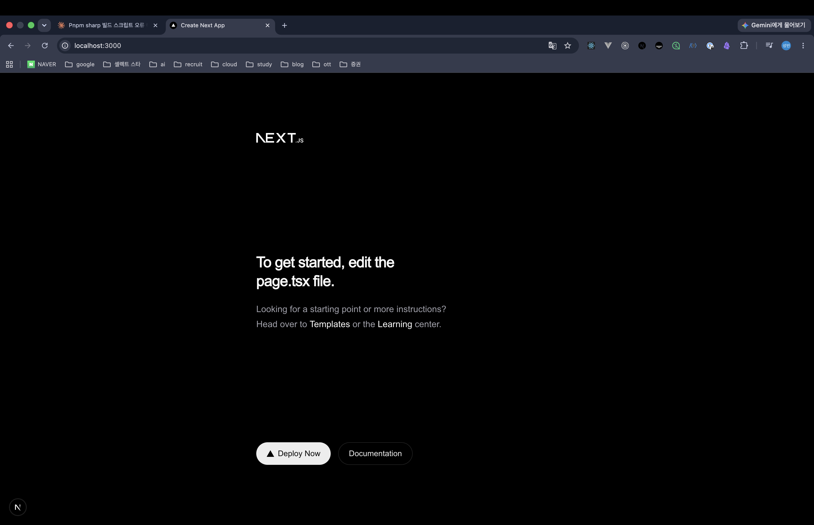
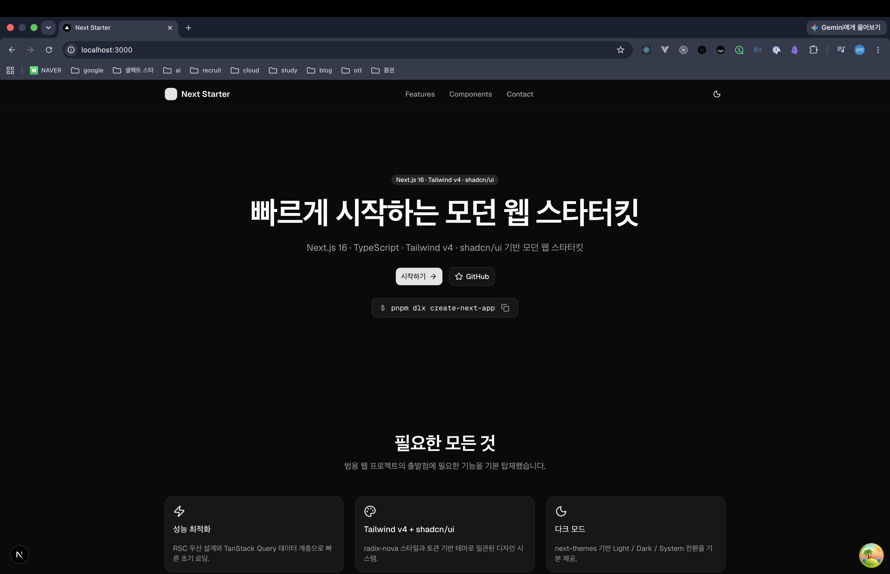
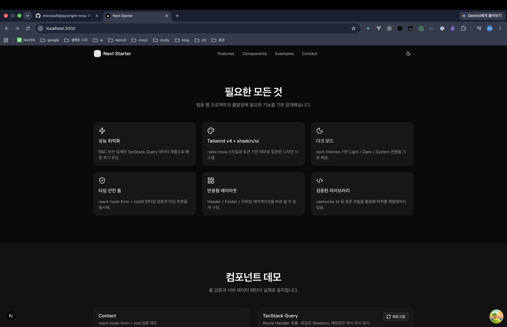

> 해당 포스팅은 [클로드 코드 완벽 마스터: AI 개발 워크플로우 기초부터 실전까지](https://inf.run/vN55k)를 참조하여 작성하였습니다.


## 📄 프로젝트 생성 1 - Next.js, ShadcnUI

[앞 섹션](/claude-code-starter-kit-만들기-ai-활용)에서는 **클로드 코드에게 맡겨** 스타터 킷을 만들었다. 이번 섹션은 *정반대* 길 — **공식 문서를 보고 개발자가 직접** 세팅한다.
*왜*
굳이 손으로 할까?

> 간혹 유튜브를 보면 *"○○ 해줘"* 식으로 프로젝트 초기 설정을 *전부 AI에게* 맡기시더라고요. 그런데 그 과정에서 *정말 많은 오류* 를 봤습니다.

### 왜 공식 문서로 직접 하나

AI에게 *초기 설정* 까지 통째로 맡기면 *세 가지* 가 걸린다.

- **오래된 버전** 으로 설치되거나
- *효과적이지 않은* **디렉터리 구조** 로 세팅되거나
- 무엇보다 **토큰을 잔뜩 낭비** 한다

> 프로젝트 초기 설정은 *그렇게 어렵지 않은데*, 시작부터 정말 많은 **토큰을 낭비** 했죠.

[AI 활용 챕터](/claude-code-starter-kit-만들기-ai-활용)에서 *개발 경험이 있다면 직접 세팅이 낫다* 고 했던 그 이야기다. **초기 설정** 은 *공식 문서* 만 따라가면 *오류도
적고*, [클로드의 컨텍스트 (토큰)](/claude-code-슬래시-명령어와-단축키)도 *아낀다.* 그 절약한 토큰을 *진짜 개발* 에 쓰는 게 영리하다.

> 자주자주 *공식 문서를 들여다보면* 익숙해지실 거예요.

### 폴더부터 — `mkdir` & IDE

먼저 터미널에서 *프로젝트 폴더* 를 만들고 들어가, [IDE](/claude-code-cursor-ai-ide-통합)로 연다.

```bash
mkdir claude-nextjs-starter-kit
cd claude-nextjs-starter-kit
```

### Next.js 설치 — `create-next-app`

[Next.js](/claude-code-모던-기술스택과-개발-워크플로우) **공식 문서** 의 안내대로 `create-next-app` 으로 *최신 버전* 프로젝트를 생성한다.

```bash
npx create-next-app@latest .
```

명령을 실행하면 *옵션을 묻는다.* 강의에서 선택하는 구성은 *모던 Next.js의 표준* 그대로다.

| 옵션             | 선택 |
|------------------|------|
| **TypeScript**   | Yes  |
| **ESLint**(린터) | Yes  |
| **Tailwind CSS** | Yes  |
| **App Router**   | Yes  |
| **Turbopack**    | Yes  |

> **ESLint** 는 *코드 품질* 을 검사해 잠재적 오류를 막는 린터고, **Turbopack** 은 *개발 서버 속도* 를 끌어올리는 차세대 번들러예요.

하나하나 고르는 게 번거롭다면 **`--yes`** 옵션으로 *기본값* 을 빠르게 적용할 수도 있다. 설치가 끝나면 *개발 서버* 를 띄워 확인한다.

```bash
npm run dev
```

`localhost:3000` 에 들어가 *Next.js 기본 화면* 이 뜨면 성공이다. (포트가 쓰이고 있으면 `3001`·`3002` 등으로 열린다.)



### Tailwind 경고 잠재우기 — `.vscode/settings.json`

Next.js와 함께 **Tailwind CSS** 도 깔린다. `globals.css` 를 열어보면 관련 설정이 보이는데, IDE가 `@tailwind` 같은 구문을 *모르는 규칙 (unknown rule)*
이라며 **경고**
를 띄울 때가 있다.

*동작엔 문제없는* 경고이니, **워크스페이스 단위** 로 무시하게 설정하면 깔끔하다. 프로젝트의 `.vscode/settings.json` 에 한 줄 더한다.

```json
{
  "css.lint.unknownAtRules": "ignore"
}
```

이러면 *그 프로젝트에서만* 해당 경고가 사라진다. *불필요한 빨간 줄* 에 신경 쓸 일이 없어진다.

### shadcn/ui 설치 + Git 커밋

스타일링 컴포넌트인 [shadcn/ui](/claude-code-모던-기술스택과-개발-워크플로우)도 **공식 문서의 Installation → Next.js** 가이드를 그대로 따른다.

그런데 설치 전에 *짚을 게* 있다. `create-next-app` 은 프로젝트를 만들며 **Git 저장소를 자동 초기화** 해둔다. 그러니 *지금까지의 깨끗한 상태* 를
먼저 [커밋](/claude-code-git과-github)해두자.

```bash
git add .
git commit -m "Next.js 초기 설정"
```

이제 shadcn/ui를 초기화한다. *기본 색상* 등을 묻는데, 고르면 *여러 파일* 이 생성·변경된다.

```bash
npx shadcn@latest init
```

> 소스 제어 탭을 잘 보세요. *명령어 한 줄* 이 우리 프로젝트를 *어떻게 변경시키는지* 보입니다.

개별 컴포넌트는 *이름을 붙여* 추가한다. (예: 버튼)

```bash
npx shadcn@latest add button
```

설치와 변경이 끝났으니, *다시 한 번* 커밋해 **단계를 박제** 한다. 강의가 *틈틈이* 커밋을 강조하는 건 — *명령 한 줄의 영향* 을 *작은 단위* 로 남겨두기 위해서다.

### 정리하며

공식 문서로 *직접* 스타터 킷을 세팅하는 흐름을 정리하면 다음과 같다.

- **왜 직접?** → AI에게 통째로 맡기면 *옛 버전·나쁜 구조·토큰 낭비* → **공식 문서** 가 정확하고 *토큰 절약*
- **폴더** → `mkdir` → `cd` → IDE로 열기
- **Next.js** → `create-next-app` (TS · ESLint · Tailwind · App Router · Turbopack), `npm run dev` 로 확인
- **Tailwind 경고** → `.vscode/settings.json` 에 `unknownAtRules: ignore`
- **shadcn/ui** → 공식 Installation 가이드 → `init` → `add <컴포넌트>`
- **Git** → *자동 초기화* 확인 → 단계마다 **작은 단위로 커밋**

핵심은 *"AI를 안 쓴다"* 가 아니라, **AI가 잘 못하거나 비싼 일은 직접** 하고 — *그 위에서* 클로드 코드를 붙인다는 전략이다. 다음 챕터에서는 이렇게 만든 토대 위에, **역할 프롬프트 엔지니어링**
으로 클로드 코드를 *더 똑똑하게* 부려보자.

## 🎭 프로젝트 생성 2 - 역할 프롬프트 엔지니어링

[앞 챕터](#-프로젝트-생성-1---nextjs-shadcnui)에서 *공식 문서로* Next.js·shadcn/ui 토대를 깔았다. 이제 그 위에 **클로드 코드를 붙여** 스타터 킷을 채운다. 이때 *결과의
질* 을 가르는 한 끗 — **역할 프롬프트 엔지니어링** 이 이번 주제다.

### ⭐ 역할 프롬프트 — AI를 '전문가'로 변신시키기

같은 질문이라도, **누구에게 묻느냐** 에 따라 답이 다르다. AI에게 *역할을 부여* 하면 — 그냥 *범용 코드 어시스턴트* 였던 클로드 코드가 **도메인 전문가** 로 *변신* 한다.

> AI에게 *역할을 부여* 하는 건, 클로드 코드를 *일반적인 코드 어시스턴트* 에서 **도메인 전문가** 로 바꾸는 핵심 기법이에요.

효과는 *네 갈래* 다.

| 효과               | 의미                                 |
|--------------------|--------------------------------------|
| **사고의 폭 확장** | 전문가 관점에서 *더 넓게* 검토       |
| **정확도 향상**    | *복잡한 시나리오* 에서 실수가 줄어듦 |
| **톤 조절**        | 커뮤니케이션 *어조* 를 역할에 맞게   |
| **집중도 향상**    | *특정 요구사항* 에 더 몰입           |

*"청소해줘"* 보다 *"너는 청소 전문가야, 이 집을 청소해줘"* 가 더 나은 결과를 내는 것과 같은 이치다.

### 역할 부여해 요청하기

이제 *역할* 을 입혀 요청한다. [앞 섹션의 기술 스택 명시](/claude-code-starter-kit-만들기-ai-활용)는 *그대로* 가져온다.

```text
당신은 모던 웹 스타터킷 제작 전문가입니다.
빠르게 웹 개발을 시작할 수 있도록 스타터킷을 개발해주세요.

기술 스택:
- Next.js 15 (App Router)
- TypeScript
- Tailwind CSS
- shadcn/ui
- Lucide React
```

물론 [플랜 모드](/claude-code-클로드-코드-권한)부터 켠다. *바로 코딩* 이 아니라 **계획** 을 먼저 받는다. 요청이 *틀어졌다면* **`ESC`** 로 작업을 멈추고 *다시* 요청하면 된다.

### 계획 보완 — "바퀴를 재발명하지 말라"

클로드가 내놓은 초기 계획 (shadcn 컴포넌트 설치 → 디렉터리 구조 → 레이아웃·페이지 → 유틸리티 기능)을 *그대로 받지 않는다.* 한 가지 **원칙** 을 더한다.

> **바퀴를 재발명하지 말아라.**

*범용적인 기능* 을 *직접 구현* 하게 두면 — 코드가 늘고, 버그도 늘고, 토큰도 샌다. *이미 검증된* **라이브러리** 가 있다면 *그걸 쓰라* 고 계획을 보완시킨다.

### 사고 순서까지 — 메타 프롬프트

더 나아가, 클로드의 *사고 과정* 자체를 *떠먹여* 줄 수 있다. *"어떤 웹에나 필요한 컴포넌트·레이아웃 정리 → 컴포넌트 계층 분류 → shadcn 설치·레이아웃 개발"* 같은 **사고 순서** 를
*컨텍스트로*
넣는 것이다.

> 이런 걸 **메타 프롬프트** 라고 해요. *프롬프트를 생성하기 위한 프롬프트.*

[CoT가 "단계별로 생각하라"였다면](/claude-code-starter-kit-만들기-ai-활용), 메타 프롬프트는 *그 단계의 내용* 까지 *지정* 해주는 셈이다. 여기에 *"유틸리티는 검증된 유명
라이브러리를 쓰라"* 는 요구를 **명확히** 덧붙인다.

### ultrathink로 라이브러리 고르기

복잡한 *선택* 이 필요하니 [`ultrathink`](/claude-code-starter-kit-만들기-ai-활용)로 **확장 사고 모드** 를 켠다. 그러면 클로드가 *검증된 라이브러리* 를 골라 계획에
반영한다.

- **Framer Motion** — 애니메이션
- **TanStack React Query** — 서버 상태 관리
- **[React Hook Form + Zod](/claude-code-모던-기술스택과-개발-워크플로우)** — 폼 + 유효성 검사

그런데 계획에 **커스텀 훅을 직접 구현** 하려는 부분이 보였다. 여기서 다시 *"바퀴를 재발명하지 말라"* 를 적용한다.

| 직접 구현하려던 것 | 검증된 대안                   |
|--------------------|-------------------------------|
| `useMediaQuery`    | **`react-responsive`**        |
| `useLocalStorage`  | **`use-local-storage-state`** |

이후 *여러 훅을 묶은* **`usehooks-ts`** 통합 라이브러리까지 분석해, *최종 선택* 을 내린다.

### 계획이 환각을 막는다

왜 이렇게까지 *계획에 공을 들일까?*

> 계획 없이 요청하면 AI가 **환각 (hallucination)** 을 일으킬 수 있어요.

실제 개발에서도 *베테랑일수록* **분석·설계·계획** 에 시간을 많이 쓴다. *코드 구현* 만큼이나 — 아니 그 이상으로 — **정보 수집과 계획** 이 중요하다는 이야기다. *꼼꼼히 확정한 계획* 위에서라야,
*핵심 프레임워크·스타일링·유틸리티 라이브러리* 설치가 *흔들림 없이* 진행된다.

### 개발 실행 & 남은 오류

계획이 확정됐으니 **`Accept Edit` 모드** 로 전환해 실제 개발을 돌린다. 이때 [`Bash`·`WebFetch`·`WebSearch` 권한](/claude-code-클로드-코드-권한)을 열어, 클로드가
*문서를 찾아가며* 작업하게 한다.

개발 서버가 뜨면 `localhost` 에서 *메인 페이지·기능 소개·CTA·푸터* 까지 **완성된 모습** 을 확인한다. 다만 *일부 페이지*(기능 메뉴·가격·폼 예제·문서)에서 **오류** 가 보인다.

> 이건 *어쩔 수 없습니다.*

*완벽하진 않다.* 이 오류는 **다음 챕터** 에서 — *명확한 프롬프트 엔지니어링* 으로 — 잡는다.

### 정리하며

역할 프롬프트 엔지니어링으로 *스타터 킷을 채우는* 흐름을 정리하면 다음과 같다.

- ⭐ **역할 프롬프트** → *"당신은 ○○ 전문가"* → 사고 폭·정확도·톤·집중 **향상**
- **요청** → 역할 + [기술 스택 명시](/claude-code-starter-kit-만들기-ai-활용) + [플랜 모드](/claude-code-클로드-코드-권한)(틀리면 `ESC`)
- **계획 보완** → *"바퀴를 재발명하지 말라"* → 범용 기능은 **검증된 라이브러리**
- **메타 프롬프트** → *사고 순서* 자체를 컨텍스트로 주입
- **`ultrathink`** → Framer Motion · TanStack Query · RHF+Zod, 커스텀 훅은 `usehooks-ts` 등으로
- **계획의 가치** → *계획 없는 요청 = 환각*, 분석·설계에 시간 쓰는 게 정석
- **실행** → `Accept Edit` + 권한 → 완성 (단, *일부 페이지 오류* 는 다음 챕터에서)

핵심은 *역할* 과 *계획* 이다. **전문가 역할** 을 입히고, **바퀴를 재발명하지 않는** 계획을 세우면 — 클로드 코드는 *훨씬 똑똑한* 결과를 낸다. 다음 챕터에서는 *남은 오류* 를 **명확한 프롬프트
엔지니어링** 으로 잡아보자.



## 🐛 오류 수정과 명확한 프롬프트 엔지니어링

[앞 챕터](#-프로젝트-생성-2---역할-프롬프트-엔지니어링)에서 스타터 킷을 채웠지만, *일부 페이지* 에 **404 오류** 가 남았다. 이번엔 그걸 *잡는다.* 더불어 *불필요한 메뉴* 도 정리한다.

> 우리 스타터 킷에서 *기능* 이나 *가격* 메뉴 같은 건 **없어도 될 것 같거든요.**

그런데 오류 수정에 들어가기 전, *반드시 짚어야 할* 개념이 하나 있다. **명확한 프롬프트 엔지니어링** 이다.

### ⭐ 명확한 프롬프트 — AI는 개발자 대체가 아니다

오류를 *"알아서 고쳐줘"* 라고 던지면 안 된다. 그 전에 *클로드 코드의 정체* 를 정확히 알아야 한다.

> Claude Code는 **AI 도구** 예요. 개발자를 대체해서 *혼자 알아서* 진행하는 그런 **에이전트가 아닙니다.**

즉 클로드 코드는 *만능 자율 개발자* 가 아니라, **명확한 지시를 받을 때** 일을 잘하는 *도구* 다. 그래서 *무엇을·어디서·어떻게* 고칠지 **분명하게** 지시해야 한다. 이건 *개인 취향* 이 아니라 *
*Anthropic 공식 가이드** 이기도 하다.

| 명확한 프롬프트의 3요소 | 의미                                       |
|-------------------------|--------------------------------------------|
| **명확하게**            | *모호함* 없이 무엇을 원하는지              |
| **직접적으로**          | 돌려 말하지 말고 *바로* 요구               |
| **상세하게**            | 작업·대상·워크플로우·*최종 목표* 까지 명시 |

앞 챕터의 [역할 프롬프트](#-프로젝트-생성-2---역할-프롬프트-엔지니어링)와 결합하면, 오류 수정 요청은 이렇게 *구체적* 이어야 한다.

```text
당신은 웹 개발 전문가입니다.
현재 웹 애플리케이션에 404 오류가 발생하고 있어요.
- 네비게이션의 '기능', '가격' 메뉴는 불필요하니 제거해주세요.
- 나머지 메뉴는 실제 페이지가 존재하는지 확인하고, 깨진 링크를 고쳐주세요.
```

### "동료에게 보여줘라" 테스트

내 프롬프트가 *충분히 명확한지* 헷갈릴 때가 있다. 강의가 소개하는 *간단한 점검법* 이 있다.

> 해당 프롬프트가 명확한지 잘 모르겠다면, 그 프롬프트를 **동료에게 보여주래요.**

*동료가 읽고도* **무슨 작업인지 헷갈린다면**, 클로드 코드도 *헷갈린다.* 반대로 *사람이 봐도 명확* 하면 AI에게도 명확하다. **"사람이 이해할 수 있게"** — 이게 *명확한 프롬프트* 의 *쉬운 기준*
이다.

### 오류 수정도 플랜 모드로

요청이 명확해졌으니, 늘 그랬듯 [플랜 모드](/claude-code-클로드-코드-권한)로 **계획부터** 받는다. 그러면 클로드는 *바로 고치지 않고* — **메뉴와 실제 페이지가 존재하는지** 하나씩 대조하며
**오류 목록** 을 수집하고, *해결 계획* 을 세운다.

이 *탐색 → 계획* 단계가 [4단계 워크플로우](/claude-code-모던-기술스택과-개발-워크플로우)의 정석이다. *오류의 전체 그림* 을 먼저 파악해야, *놓치는 페이지 없이* 한 번에 고칠 수 있다.

### 결과 확인 & 작업 분할

계획대로 실행하면, *기능·가격 메뉴* 가 깔끔히 제거되고 *문서 페이지* 도 **정상 출력** 된다. 그런데 *예제 페이지* 에서 또 다른 **링크 오류** 가 보인다. 원인을 추적해보니 —

**shadcn/ui의 `Select` 컴포넌트가 설치되지 않아** 생긴 문제였다. ([앞서 본 `npx shadcn add` 로](#-프로젝트-생성-1---nextjs-shadcnui) 필요한 컴포넌트를 그때그때
깔아야 한다.)

여기서 *교훈* 이 하나 더 나온다.

> **복잡한 작업** 은 한 번에 요청하기보다, *여러 단계로 나누어* 요청하는 게 좋아요.

*큰 덩어리* 를 통째로 시키면 *오류 가능성* 이 커진다. **작업을 분할** 해 *한 조각씩* 요청하면, *오류도 줄고* 진행도 또렷해진다. — [컨텍스트 관리](/claude-code-슬래시-명령어와-단축키)
와도 맞닿는 *효율 전략* 이다.

### 정리하며

오류 수정과 명확한 프롬프트 엔지니어링을 정리하면 다음과 같다.

- **AI는 대체자가 아니다** → 클로드 코드는 *명확한 지시* 를 받을 때 잘하는 **도구**
- ⭐ **명확한 프롬프트** → **명확·직접·상세** (Anthropic 공식 가이드)
- **점검법** → *"동료에게 보여줘서"* 이해되면 AI에게도 명확
- **오류 수정** → [플랜 모드](/claude-code-클로드-코드-권한)로 *메뉴·페이지 대조* → 오류 목록 → 계획 → 실행
- **남은 이슈** → `Select` 컴포넌트 *미설치* → 필요한 [shadcn 컴포넌트](#-프로젝트-생성-1---nextjs-shadcnui) 추가
- **작업 분할** → *복잡한 건 나눠서* 요청 → 오류↓ 효율↑

핵심은 *"AI에게 떠넘기지 말고, 명확히 지시하라"* 다. **명확·직접·상세** 한 프롬프트와 **작업 분할** — 이 둘이 오류를 *빠르고 정확하게* 잡는 열쇠다. 다음 챕터에서는 한발 더 나아가, 클로드가
*직접 브라우저를 열어 테스트하고 스스로 오류를 고치는* — **AI 자동화** 까지 들여다보자.

## 🤖 Playwright MCP란? - 오류 해결하기

[앞 챕터](#-오류-수정과-명확한-프롬프트-엔지니어링)에서는 *우리가 오류를 발견해* 클로드에게 *고치라고* 시켰다. 그런데 — *오류를 찾는 것* 부터 클로드가 **스스로** 한다면? 그걸 가능케 하는 게 이번
주제, **Playwright MCP** 다.

> 웹 개발을 하고, 브라우저에서 테스트하고, 버그를 발견하던 *일련의 과정* 을 **클로드에게 위임** 할 수 있는 거죠.

### Playwright MCP란 — 클로드에게 '브라우저'를 쥐여주기

먼저 **Playwright** 는 *웹 브라우저 자동화 도구* 다. *크롬·파이어폭스* 같은 브라우저를 *프로그램으로 제어* 해 **테스트 자동화·데이터 수집·화면 캡처** 를 한다.

그럼 **Playwright MCP** 는? [MCP](/claude-code-mcp-활용) 챕터에서 봤듯, *클로드가 외부 도구를 쓰게* 잇는 **다리** 다. 즉 **클로드가 Playwright를 부릴 수
있게** 해주는 MCP 서버다.

> 클로드에게 *"어떤 사이트에 접속해 정보를 수집해줘"* 하면, 클로드가 **실제로 브라우저를 열고** 그 사이트에 접속해 원하는 정보를 *직접* 수집해줘요.

[앞 섹션에서 스크린샷을 찍어 붙여넣던 것](/claude-code-starter-kit-만들기-ai-활용)과 비교해보자. 그땐 *사람이* 캡처해 줬다면, 이제는 **클로드가 직접** 브라우저를 열어
*보고·확인하고·고친다.*
**손이 생긴** 셈이다.

### 설치 — `claude mcp add` (프로젝트 스코프)

설치는 [MCP 설치 흐름](/claude-code-mcp-활용)과 똑같다. **GitHub에서 `playwright mcp`** 를 검색해 *공식 문서* 의 **Claude Code 설치 가이드** 를 따른다.
*팀과 공유* 할 거라 **프로젝트 스코프** 로 깐다.

```bash
claude mcp add playwright -s project -- npx @playwright/mcp@latest
```

`-s project` 로 설치하면 [`.mcp.json` 파일이 생성](/claude-code-mcp-활용)된다. 이 파일을 *커밋* 하면, *팀원도* 같은 Playwright MCP를 *그대로* 쓸 수 있다.

### ⭐ 오류 해결 4단계 — 수집·분석·해결·반복

Playwright MCP로 *오류를 잡는* 과정은 **4단계 루프** 다. [4단계 개발 워크플로우](/claude-code-모던-기술스택과-개발-워크플로우)와 *닮은꼴* 이다.

| 단계                | 하는 일                                           |
|---------------------|---------------------------------------------------|
| **① 오류 수집**     | 브라우저로 직접 접속해 *에러 정보* 를 모은다      |
| **② 원인 분석**     | *라이브러리 누락·404* 등 **원인** 을 파악         |
| **③ 오류 해결**     | 분석대로 **수정** (한 번에 안 될 수 있음)         |
| **④ 테스트 & 반복** | 다시 테스트 → *오류가 또 있으면* **①로 되돌아감** |

핵심은 **반복** 이다. *한 번에 완벽* 하지 않아도, 클로드가 *수집 → 수정 → 재확인* 을 **스스로 돌리며** 오류가 *없어질 때까지* 좁혀간다.

### 실제로 고쳐보기

이제 *남아 있던 오류* 를 잡는다. **예제 (Example) 메뉴** 를 클릭해 서브 페이지로 들어갈 때 나는 오류가 대상이다. (*푸터의 404* 는 *무시* 하도록
일러둔다 — [작업 범위를 명확히](#-오류-수정과-명확한-프롬프트-엔지니어링)하는 것이다.)

[플랜 모드](/claude-code-클로드-코드-권한)로 계획을 세우면, 클로드가 **Playwright MCP로 브라우저를 열어** *에러를 직접 확인* 한다. 그러곤 `hooks` 페이지 수정, *미설치였던*
**[`Select` 컴포넌트](#-프로젝트-생성-1---nextjs-shadcnui) 생성** 같은 *구체적 계획* 을 내놓는다. 실행 후엔 *쇼케이스·폼·레이아웃·훅 예제·데이터 패칭·UI* 등 **여러 페이지가
오류 없이** 도는 걸 — 역시 *클로드가 직접* 확인한다.

### 의미 있는 단위로 커밋 — 현업의 습관

오류를 다 잡았으면 [커밋](/claude-code-git과-github)이다. 여기서 *현업 감각* 을 하나 더 짚는다.

> 현업에서는 **커밋 목록** 을 굉장히 중요시해요.

변경을 *뭉뚱그려 한 방* 에 커밋하지 않고, **의미 있는 단위로 분리** 하는 게 좋다. 이 *쪼개는 작업* 마저 **클로드에게 맡길** 수 있다. 강의에선 변경분을 **5개 커밋 단위** 로 나눠 정리한다.
*나중에 이력을 읽기* 좋은, *깔끔한 히스토리* 가 남는다.

### 마무리 — `/init`로 마침표

마지막으로 [`/clear`](/claude-code-슬래시-명령어와-단축키)로 컨텍스트를 비운 뒤, **[`/init`](/claude-code-starter-kit-만들기-ai-활용)** 으로 **[
`CLAUDE.md`](/claude-code-설정-파일과-메모리-관리)** 를 생성한다. *지금 완성된* 기술 스택·프로젝트 구조·컴포넌트 패턴이 *그대로* 담긴다. 이것도 *커밋* 하면 끝이다.

이로써 **공식 문서 섹션** 의 큰 흐름이 마무리된다. 강의가 권하는 *접근 방식* 은 이렇다.

> 처음부터 클로드에게 *세팅을 통째로* 맡기는 것도 좋지만, **주요 기술 스택 설치** 만큼은 *공식 문서를 참고해 직접* 하고 — 이후 **`/init`** 으로 초기화한 뒤 개발을 시작하세요.

*개발 경험이 있다면* 직접 할 부분은 *효율적으로*, *경험이 없더라도* **설치만큼은 공식 문서대로** 정확하게 — 이게 [AI 활용](/claude-code-starter-kit-만들기-ai-활용)과 *공식
문서*
두 길을 모두 거친 *결론* 이다.

### 정리하며

Playwright MCP 자동화 테스트를 정리하면 다음과 같다.

- **Playwright** = 브라우저 자동화 도구 → **Playwright MCP** = 클로드가 *브라우저를 직접 제어* 하게 잇는 [MCP 서버](/claude-code-mcp-활용)
- **설치** → `claude mcp add playwright -s project -- npx @playwright/mcp@latest` → **`.mcp.json`**(팀 공유)
- ⭐ **오류 해결 4단계** → *수집 → 분석 → 해결 → 테스트·반복* (오류 없을 때까지 **루프**)
- **시연** → 예제 페이지 오류를 *클로드가 직접* 확인·수정 (`hooks`·`Select`)
- **커밋** → *의미 있는 단위* 로 분리 (강의는 5개) — 분리도 클로드에게
- **마무리** → `/clear` → `/init` 로 `CLAUDE.md` 생성 → 커밋
- **결론** → *주요 스택은 공식 문서로 직접*, 이후 `/init` → 개발

스크린샷을 *사람이* 찍어주던 단계를 지나, 이제 클로드가 **스스로 브라우저를 열어 테스트하고 고친다.** Playwright MCP는 *AI 개발 워크플로우* 의 **마지막 퍼즐** — *손과 눈* 을 달아주는
조각이다. 이렇게 우리만의 **Next.js 스타터 킷** 이, *AI와 함께* 완성되었다.

