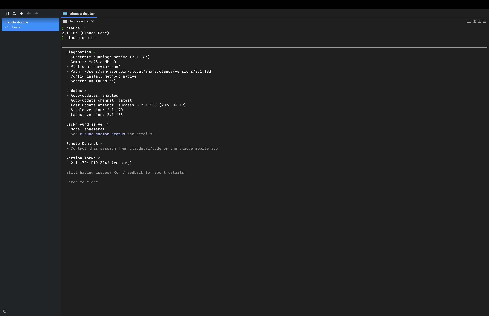
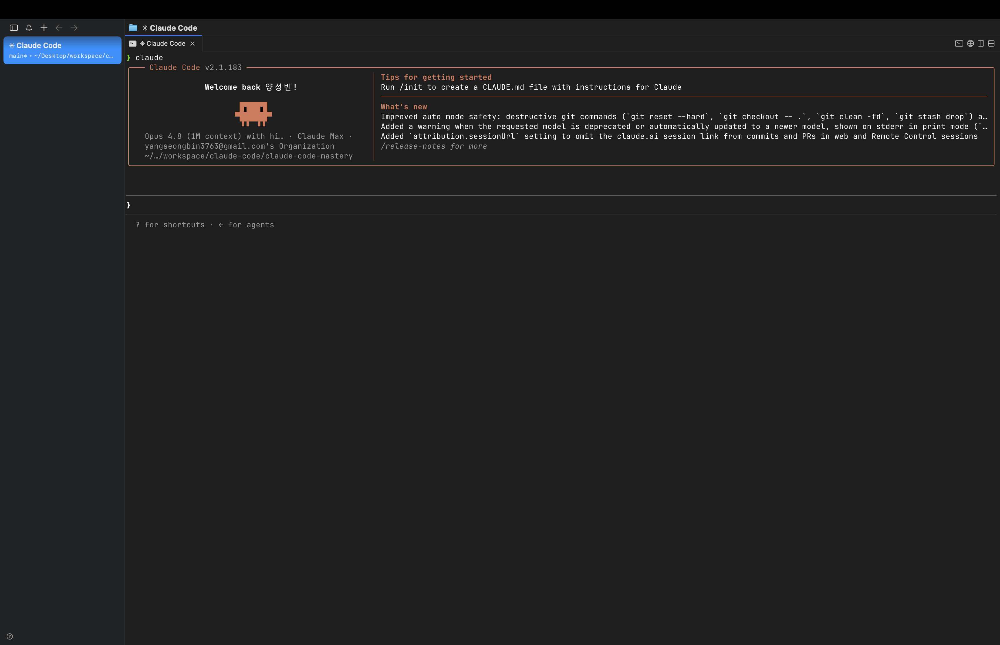

> 해당 포스팅은 [클로드 코드 완벽 마스터: AI 개발 워크플로우 기초부터 실전까지](https://inf.run/vN55k)를 참조하여 작성하였습니다.


## 🧰 개발환경 구성

[터미널과 친해지는 시간](/claude-code-터미널-익숙해지기)을 가졌으니, 이제 클로드 코드로 *웹 개발* 을 하기 위한 **기본 환경** 을 갖출 차례다. 이 챕터에서 설치할 건 딱 두 가지,
**Chrome 브라우저** 와 **Node.js** 다. 생각보다 간단하니 부담 없이 따라오자.

### 1. Chrome 브라우저 설치

첫 번째는 **Chrome 브라우저** 다. 웹 개발을 하면 결국 *브라우저에서 결과물을 확인* 하게 되는데, Chrome은 전 세계에서 가장 많이 쓰이는 브라우저이자 개발자 도구도 강력해서 사실상 표준에
가깝다.

설치는 어렵지 않다. [Chrome 공식 사이트](https://www.google.com/chrome/)에 접속해 다운로드한 뒤 설치하면 끝이다. *이미 설치되어 있다면* 이 단계는 건너뛰어도 된다.

### 2. Node.js 설치

두 번째는 **Node.js** 다. 이름은 거창해 보이지만, 한 문장으로 정리하면 이렇다.

> 쉽게 말해서 브라우저 밖에서도 자바스크립트를 실행할 수 있게 해주는 프로그램이라고 보면 됩니다.

원래 자바스크립트는 *브라우저 안* 에서만 돌아가는 언어였다. Node.js는 이 자바스크립트를 *브라우저 밖, 즉 내 컴퓨터에서도* 실행할 수 있게 해주는 **자바스크립트 런타임 환경** 이다.
강의 후반의 Next.js 같은 모던 기술 스택도 모두 이 Node.js 위에서 돌아가니, 웹 개발의 *기반* 이라고 보면 된다.

설치는 [Node.js 공식 사이트](https://nodejs.org/)에서 진행한다. 다운로드 메뉴에서 *내 운영체제(OS)에 맞는* 설치 프로그램을 받아 실행하면 된다.

#### ⚠️ 꼭 LTS 버전을 고르세요

여기서 **가장 중요한 주의사항** 이 하나 있다.

> Node.js를 설치할 때, 안정화 버전인 **LTS 버전을 꼭 선택** 해 주세요.

Node.js 다운로드 페이지에 가면 보통 두 가지 버전이 보인다.

- **LTS(Long Term Support)** — *장기 지원* 되는 **안정화 버전** ✅
- **Current(최신)** — 최신 기능이 들어갔지만 *상대적으로 불안정* 한 버전

최신 버전이 더 좋아 보일 수 있지만, 개발 환경에서는 *안정성* 이 훨씬 중요하다. 그러니 반드시 **LTS 버전** 을 선택하자.

### 3. 설치 확인하기

설치가 끝났다면, 정말 잘 깔렸는지 *터미널에서* 확인해보자. 앞 챕터에서 배운 터미널을 열고 다음 명령어를 입력한다.

```bash
node -v   # Node.js 버전 확인
npm -v    # npm 버전 확인
```

`v20.x.x` 처럼 **버전 번호가 출력되면 설치 성공** 이다.

여기서 `npm` 이 갑자기 등장했는데, 이건 **Node Package Manager** 의 약자로 *자바스크립트 라이브러리·프레임워크를 관리해주는 패키지 매니저* 다. 따로 설치할 필요 없이
**Node.js를 설치하면 npm도 함께** 깔린다.

### 💡 Windows에서 npm이 실행되지 않는다면

Windows PowerShell에서 `node` 는 되는데 `npm` 명령어가 실행되지 않는 경우가 있다. 이는 Windows의 **보안 기능** 때문인데, *신뢰할 수 있는 스크립트만 실행* 하도록
막아둔 것이 원인이다. 개발을 하려면 이 정책을 한 번만 풀어주면 된다.

1. 실행 중인 **PowerShell을 종료** 한다
2. Windows 검색창에 `PowerShell` 을 검색한 뒤, *우클릭* → **관리자 권한으로 실행**
3. 아래 명령어를 입력한다

   ```powershell
   Set-ExecutionPolicy RemoteSigned -Scope CurrentUser
   ```

4. 실행 정책 변경을 확인하는 메시지가 나오면 `Y` 를 입력하고 `Enter`
5. 이제 다시 `npm -v` 를 실행하면 *정상적으로 버전이 표시* 된다

> 이 설정은 *현재 사용자(`CurrentUser`)* 에게만 적용되며, `RemoteSigned` 는 **로컬에서 만든 스크립트는 실행을 허용** 하되 인터넷에서 받은 스크립트는 서명을 요구하는,
> 적당히 안전한 정책이다.

### 정리하며

이번 챕터에서 설치한 것을 정리하면 다음과 같다.

- **Chrome 브라우저** — 웹 개발 결과물을 *테스트·디버깅* 할 표준 환경
- **Node.js (LTS 버전)** — 자바스크립트를 컴퓨터에서 실행하는 기반 + `npm` 자동 포함
- 터미널에서 `node -v`, `npm -v` 로 **설치 확인**

이렇게 기본 환경을 갖췄다. 그런데 개발에서 *빠질 수 없는* 도구가 하나 더 있다. 바로 **Git** 이다. 다음 챕터에서 OS별로 제대로 설치해보자.

## 🐙 Git 설치: Windows, macOS

이번 챕터의 주인공은 **Git** 이다. 먼저 Git이 무엇인지부터 짚고, *macOS* 와 *Windows* 각각의 설치 방법, 그리고 설치 직후 **반드시 해야 하는 초기 설정** 까지 한 번에
다뤄본다.

### Git은 "소스 코드의 타임머신"

Git을 한마디로 표현하면 이렇다.

> 쉽게 말해서 우리 소스 코드의 **타임머신** 이라고 생각하시면 돼요.

Git은 작업 내용을 *저장* 하고, 문제가 생기면 *이전 버전으로 되돌리며*, 여러 사람이 *협업* 할 수 있게 해주는 도구다.

> 소프트웨어를 개발할 때 Git이라는 도구는 **선택이 아니라 필수** 라고 보면 됩니다.

특히 AI에게 코드를 맡기는 클로드 코드 시대에는, *멀쩡하던 코드가 갑자기 망가졌을 때* 이전 상태로 되돌리는 안전장치로서 Git의 가치가 더 커진다.

> Git의 명령어와 개념(커밋, 브랜치, 병합 등)은 *기초 사용법 섹션* 에서 따로 자세히 다룬다. 이번 챕터는 **설치와 초기 설정** 에만 집중하자.

설치 가이드는 구글에 **"Git install"** 을 검색해 [Git 공식 문서](https://git-scm.com/downloads)로 들어간 뒤, **Install** 메뉴에서 자신의 OS를
선택하면 된다.

### macOS — Homebrew로 설치

macOS에서는 **Homebrew** 를 이용해 Git을 설치하는 방식을 권장한다. Homebrew는 *맥용 패키지 관리자* 인데, 쉽게 말하면 이렇다.

> 쉽게 말해서 **앱스토어** 같은 거죠.

명령어 한 줄로 개발 도구를 깔고 관리할 수 있게 해준다.

먼저 Homebrew가 깔려 있지 않다면, [Homebrew 공식 사이트](https://brew.sh/)의 설치 명령어를 터미널에 붙여넣어 설치한다. 그다음 Git을 설치한다.

```bash
brew install git    # Homebrew로 Git 설치
git -v              # 설치된 Git 버전 확인
```

버전이 출력되면 설치 성공이다.

### Windows — 설치 파일로 설치

Windows에서는 [Git 공식 문서](https://git-scm.com/downloads)의 **Install** 메뉴에서 **Windows** 탭을 클릭하고, OS에 맞는 설치 파일을 다운로드한다.
받은 설치 파일을 실행한 뒤 **Next** 를 눌러가며 설치를 진행하면 된다. (설치 옵션은 *기본값* 그대로 두어도 무방하다.)

설치가 끝나면 PowerShell에서 버전을 확인한다.

```powershell
git --version    # 설치된 Git 버전 확인
```

### ⭐ 설치 직후 꼭 해야 할 초기 설정: 이름과 이메일

Git을 설치했다고 끝이 아니다. **이름과 이메일을 설정** 해야 비로소 쓸 준비가 끝난다. 왜냐하면,

> Git으로 코드를 저장할 때마다 *누가 이 작업을 했는지* 를 기록하거든요.

조별 과제에서 누가 어떤 부분을 맡았는지 적어두는 것처럼, Git도 모든 작업 기록(커밋)에 *작성자 이름* 을 자동으로 붙인다. **이 설정이 없으면 커밋 시 오류가 발생** 하니 반드시 해줘야 한다.

#### 0. 먼저 GitHub에 가입하기

이름·이메일을 설정하기 전에, **GitHub** 에 먼저 회원가입을 해두자. GitHub는 *전 세계 개발자들이 코드를 저장하고 공유하는 플랫폼* 이다. 중요한 점은, Git 이메일을 **GitHub
계정에 등록한 이메일과 동일하게** 설정해야 한다는 것이다. 그래야 나중에 코드를 올렸을 때 커밋 기록이 *내 GitHub 계정과 연결* 된다.

#### 1. 현재 설정 확인

먼저 지금 설정된 값이 있는지 확인해보자.

```bash
git config --global user.name     # 설정된 이름 확인
git config --global user.email    # 설정된 이메일 확인
```

아무것도 출력되지 않는다면 *아직 설정되지 않은* 상태다.

#### 2. 이름과 이메일 설정

이제 직접 설정한다. 이름은 GitHub에서 쓰는 이름이나 계정 아이디로 맞추면 깔끔하고, 이메일은 **GitHub 가입 이메일** 을 그대로 넣는다.

```bash
git config --global user.name "Your Name"
git config --global user.email "your.email@example.com"
```

`--global` 옵션은 *이 컴퓨터의 모든 프로젝트에 공통 적용* 한다는 의미다. 한 번만 설정해두면 매번 할 필요가 없다.

### 정리하며

이번 챕터에서 한 일을 정리하면 다음과 같다.

- **Git** 은 *소스 코드의 타임머신* — 저장·복구·협업을 위한 필수 도구
- **macOS** → Homebrew로 `brew install git`
- **Windows** → 공식 설치 파일 실행 후 `git --version` 확인
- 설치 직후 **이름·이메일 초기 설정** (GitHub 가입 이메일과 동일하게)

이것으로 개발 환경과 Git 준비가 모두 끝났다. 이제 드디어 **클로드 코드를 설치** 할 차례인데, 그 전에 *짧게 짚고 갈 안내사항* 이 하나 있다.

## 📌 클로드 코드 설치 안내

본격적인 설치에 앞서, 강사님이 짧게 *당부* 하는 내용이 있다. 결론부터 말하면 **설치 과정이 바뀔 수 있다** 는 이야기다.

> 참고로 이 영상은 추가로 촬영한 영상이에요. 그 사이에 Claude Code 메이저 버전이 업데이트되면서 *설치 과정이 일부 변경* 되었더라고요.

### AI 도구는 정말 빠르게 바뀐다

클로드 코드뿐 아니라 AI 기술 전반이 *눈 깜짝할 사이에* 발전한다. 그러다 보니 **업데이트가 자주 일어나고**, 그 과정에서 설치 방법 같은 *세부 절차* 도 종종 바뀐다. 강의를 찍은 시점과
지금 사이에도 메이저 버전이 올라가며 설치 과정이 조금 달라졌을 정도다.

### 그래도 걱정할 필요 없는 이유

여기서 중요한 건, **설치 과정이 바뀌어도 클로드 코드의 사용법 자체는 그대로** 라는 점이다. 즉, 설치만 무사히 마치면 *이후 내용은 걱정 없이* 따라올 수 있다.

> 이제 막 시작하는 시점에서 설치 단계에서 막히면 머리가 아프실 것 같아서, 이 부분만큼은 항상 *최신 상태* 로 유지하도록 할게요.

강사님은 설치 과정이 바뀔 때마다 **강의 교안이나 추가 영상** 으로 최신 정보를 제공하겠다고 약속한다. 그러니 혹시 *내 화면이 영상과 조금 다르더라도* 당황하지 말고, 교안의 최신 안내를 함께
참고하면 된다.

> 이 블로그 시리즈 역시 마찬가지다. 설치 절차는 시점에 따라 달라질 수 있으니, 막히는 부분이
> 있다면 [클로드 코드 공식 문서](https://docs.claude.com/en/docs/claude-code/overview)를
> 함께 확인하는 것을 권한다.

이제 진짜 설치를 시작할 차례다. 다음 글부터는 **macOS와 Windows** 로 나누어, OS별 클로드 코드 설치 방법을 순서대로 안내하도록 하겠다.

## 🍏 클로드 코드 설치: macOS

드디어 **클로드 코드** 를 직접 설치할 차례다. 먼저 **macOS** 부터 진행한다. (Windows는 다음 챕터에서 다룬다.)

### 공식 문서에서 설치 명령어 확인하기

설치는 [클로드 코드 공식 문서](https://docs.claude.com/en/docs/claude-code/setup)를 기준으로 진행한다. 문서에 들어가면 *내 OS에 맞는 설치
명령어* 가 안내되어 있으니, 그걸 복사해서 쓰면 된다.

> 참고로 한글 공식 문서는 *최신 버전이 반영되지 않은 경우가 많아요.* 최신 내용을 확인하고 싶다면 **영문 버전** 으로 보는 걸 권장드려요.

설치 절차는 [앞서 안내](#-클로드-코드-설치-안내)했듯 버전에 따라 바뀔 수 있으니, *영문 공식 문서를 기준* 으로 보는 습관을 들이자.

### 네이티브 설치 vs Homebrew

macOS에서 클로드 코드를 설치하는 방법은 크게 두 가지다.

| 설치 방법                 | 특징                                                       |
|-----------------------|----------------------------------------------------------|
| **네이티브 설치** (공식 권장 ✅) | 백그라운드에서 **자동 업데이트** → 항상 최신 버전 유지                        |
| **Homebrew 설치**       | `brew` 로 간편 설치는 가능하지만 *자동 업데이트가 안 됨* → 직접 주기적으로 업그레이드 필요 |

Homebrew가 익숙해서 끌릴 수 있지만, **자동 업데이트가 되지 않는다** 는 단점이 꽤 크다. AI 도구는 업데이트가 잦은 만큼, *특별한 이유가 없다면* 공식 문서가 권장하는 **네이티브 설치**
를 추천한다.

### 설치 실행하기

공식 문서의 네이티브 설치 명령어를 복사해, *터미널에 붙여넣고* 엔터를 누르면 설치가 진행된다. (아래는 예시이며, **실제 명령어는 공식 문서에서 확인** 하자.)

```bash
# 공식 문서 기준 네이티브 설치 명령어 (예시)
curl -fsSL https://claude.ai/install.sh | bash
```

> 네트워크 환경에 따라 설치에 *몇 분* 걸릴 수 있다. 멈춘 것처럼 보여도 잠시 기다려보자.

### 설치 확인: `claude -v`

설치가 끝났다면, 버전을 출력해 정상 설치를 확인한다.

```bash
claude -v    # 설치된 클로드 코드 버전 확인
```

버전 번호가 나오면 성공이다.

### 건강검진: `claude doctor`

클로드 코드에는 *설치 상태를 점검* 해주는 재미있는 명령어가 하나 있다. 바로 `claude doctor` 다.

```bash
claude doctor    # 클로드 코드 설치 상태 진단
```

> 클로드 코드가 제대로 작동하는지 **건강검진** 을 해주는 명령어예요.



이 명령어를 실행하면 다음과 같은 정보를 한눈에 확인할 수 있다.

- **설치 방식** (네이티브 / Homebrew 등)
- **현재 버전** 과 설치 **경로**
- **자동 업데이트** 활성화 여부
- **안정·최신 버전** 상태

특히 *자동 업데이트가 켜져 있는지* 를 확인할 수 있어, 네이티브 설치가 제대로 됐는지 검증하기에 좋다.

### 정리하며

macOS에서의 클로드 코드 설치를 정리하면 이렇다.

- 설치 명령어는 **영문 공식 문서** 기준으로 확인
- 자동 업데이트되는 **네이티브 설치** 를 권장 (Homebrew는 수동 업데이트 필요)
- `claude -v` 로 **버전 확인**, `claude doctor` 로 **상태 진단**

이제 macOS 사용자는 클로드 코드를 손에 넣었다. (Windows 환경에서의 설치는 *공식 문서* 를 따라 진행하면 되며, 설치 이후 과정은 동일하다.) 설치를 마쳤으니, 이제 **처음 실행하며 초기
설정** 을 해볼 차례다.

## ⚙️ 클로드 코드 초기 설정

클로드 코드를 설치했다고 바로 쓸 수 있는 건 아니다. **처음 한 번** 은 테마 선택, 로그인, 신뢰 설정 같은 *초기 설정* 을 거쳐야 한다. 그 과정을 순서대로 따라가 보자.

### 1. 프로젝트 폴더부터 만들기

클로드 코드를 실행하기 전에, **작업할 프로젝트 폴더** 부터 만든다. 앞서 배운 터미널 명령어를 써먹을 차례다.

```bash
mkdir -p ~/workspaces/claude-code-mastery   # 프로젝트 폴더 생성
cd ~/workspaces/claude-code-mastery         # 폴더 안으로 이동
```

여기서 *왜 굳이 폴더를 먼저 만들까?* 이유가 있다.

> 왜냐하면 Claude Code가 *해당 폴더 안에서* 파일을 읽거나 쓸 수 있거든요.

즉, 클로드 코드는 **실행한 폴더를 기준** 으로 동작한다. 그래서 아무 데서나 실행하기보다, *안전한 프로젝트 디렉터리 안에서* 실행하는 것이 중요하다.

### 2. 클로드 코드 실행

폴더 안으로 이동했다면, 이제 단 한 단어면 된다.

```bash
claude    # 클로드 코드 실행
```

처음 실행하는 것이므로, 몇 가지 *초기 설정 화면* 이 순서대로 나타난다.

### 3. 테마 선택

가장 먼저 **테마 선택** 화면이 뜬다. *방향키* 로 원하는 테마를 고르고 `Enter` 를 누르면 된다. (예시로는 보통 **Dark mode** 를 많이 선택한다.) 취향에 맞게 고르면 되고,
나중에 얼마든지 바꿀 수 있다.

### 4. 로그인 방식 선택

다음은 **로그인 방식** 이다. 크게 두 가지 중에서 고른다.

| 방식                       | 설명                       |
|--------------------------|--------------------------|
| **Claude 계정 구독** (권장 ✅)  | 매달 일정 비용을 내고 *구독* 형태로 사용 |
| **Anthropic Console 계정** | 크레딧을 충전해두고 *사용량만큼 차감*    |

> 정말 몇 번만 사용할 게 아니라면, **1번(Claude 계정 구독)** 을 선택하는 걸 권장드립니다.

최신 버전에서는 Amazon Bedrock, Microsoft Foundry, Vertex AI 같은 *클라우드 플랫폼 연동(3rd-party)* 옵션도 보이는데, **개인 사용자라면 1번** 을 고르면
된다.

### 5. 계정 로그인 및 승인

로그인 방식을 고르면 *브라우저* 가 열리며 Claude 계정 로그인 화면으로 넘어간다. 로그인을 완료하고, 클로드 코드가 *내 계정에 연결되도록* **승인** 해주면 된다. 승인이 끝나면 브라우저를
닫고, 터미널로 돌아와 `Enter` 를 누른다.

### 6. 보안 공지와 신뢰 설정

로그인이 끝나면 **보안 관련 공지** 가 나타난다. 핵심은 이렇다.

- Claude도 *실수를 할 수 있으니*, 실행 결과를 항상 **검토** 하자
- **신뢰할 수 있는 프로젝트** 에서만 클로드 코드를 실행하자

이어서 *"이 디렉터리에서 클로드 코드가 파일을 읽고 쓰고 실행해도 되는가?"* 를 묻는 **신뢰 확인** 화면이 뜬다. 우리가 직접 만든 안전한 폴더이니, **1번을 선택해 계속 진행** 하면 된다.

> 이 *신뢰(trust)* 절차는 단순한 형식이 아니다. 클로드 코드는 폴더 안의 파일을 직접 수정하고 명령어도 실행할 수 있으니, *내가 통제할 수 있는 디렉터리에서만* 실행하는 습관을 들이는 게
> 안전하다.

### 7. 설정 완료, 그리고 종료·재실행

모든 단계를 마치면,

> 이렇게 *귀여운 UI* 가 나오면서 Claude Code 설정이 완료된 걸 확인할 수 있습니다.



클로드 코드를 **종료** 하고 터미널로 돌아가려면 다음을 입력한다.

```bash
/exit    # 클로드 코드 종료
```

다시 실행하고 싶을 땐, *원하는 프로젝트 폴더로 이동한 뒤* `claude` 를 입력하면 된다. (초기 설정은 처음 한 번만 하면 되니, 이후로는 바로 실행된다.)

### 정리하며

클로드 코드 초기 설정을 정리하면 다음과 같다.

1. **프로젝트 폴더** 생성 후 그 안으로 이동
2. `claude` 로 실행 → **테마 선택**
3. **로그인 방식** 선택 (개인은 Claude 계정 구독 권장)
4. 계정 **로그인·승인**
5. 보안 공지 확인 후 **신뢰(trust) 설정**
6. `/exit` 로 종료, 다시 쓸 땐 `claude` 로 재실행

이제 정말로 **클로드 코드를 사용할 모든 준비** 가 끝났다. 그런데 초기 설정에서 *로그인 방식* 을 골랐던 것 기억나는가? 그 선택과 직결되는, **돈** 이야기를 마지막으로 짚고 넘어가자.

## 💳 클로드 코드 가격 정책

클로드 코드를 제대로 쓰려면 *가격 정책* 을 이해하는 게 중요하다. 비용을 알아야 **나에게 맞는 합리적인 선택** 을 할 수 있기 때문이다.

### 두 가지 과금 방식: API vs 구독

클로드 코드를 사용하는 방식은 크게 두 가지로 나뉜다.

| 방식                 | 과금 구조                                   | 적합한 경우                  |
|--------------------|-----------------------------------------|-------------------------|
| **API 키 (사용량 기반)** | Console에서 API 키 발급 → 크레딧 충전 → *쓴 만큼* 차감 | 아주 가끔, 잠깐만 쓸 때          |
| **구독 (정액제)**       | Claude 계정을 *월정액* 으로 구독                  | **지속적으로 사용** 할 때 (권장 ✅) |

API 키 방식은 [Claude Console](https://console.anthropic.com/)의 **API Keys** 메뉴에서 키를 발급받고, **Billing** 메뉴에서 크레딧을
충전해 쓰는 구조다. 그런데 강사님은 이렇게 짚는다.

> 이러한 방법으로 Claude Code를 *지속적으로 이용* 하는 경우에는 비용이 많이 발생될 수 있어요.

그래서 공식 문서도, 꾸준히 쓰는 사용자라면 **구독 방식** 이 더 *비용 효율적* 이라고 권장한다.

### 구독 플랜 한눈에 보기

그렇다면 구독 플랜은 어떻게 나뉠까? 핵심만 정리하면 다음과 같다.

| 플랜       | 가격            | 클로드 코드 | 특징                                |
|----------|---------------|--------|-----------------------------------|
| **Free** | 무료            | ❌ *불가* | Claude 체험용 (ChatGPT처럼 일반 LLM 기능만) |
| **Pro**  | 월정액           | ✅ 가능   | 클로드 코드 사용을 위한 **최소 플랜**           |
| **Max**  | 월 $100 / $200 | ✅ 가능   | Pro 대비 사용량 **5배 / 20배**           |

여기서 *가장 중요한 사실* 하나.

> **무료 플랜으로는 클로드 코드를 쓸 수 없다.** 클로드 코드를 이용하려면 **Pro 플랜 이상** 이 필요하다.

무료 플랜은 클로드를 *체험* 하거나 일반적인 챗봇처럼 쓰기엔 충분하지만, 클로드 코드는 **Pro 플랜부터** 열린다는 점을 기억하자.

### Pro로 시작해서, 부족하면 Max로

Pro 플랜으로 쓰다 보면 *사용량이 부족하다* 고 느껴질 때가 온다. 클로드 코드는 토큰을 꽤 많이 소모하기 때문이다. 그럴 때 고려하는 게 **Max 플랜** 이다.

- **월 $100** — Pro 대비 **5배** 사용량
- **월 $200** — Pro 대비 **20배** 사용량

실제로 많은 사용자가 Pro에서 Max로 전환하며, 특히 *$200 요금제* 를 쓰는 경우가 많다. 강사님도 이렇게 밝힌다.

> 저 같은 경우에는 현재 *200달러 요금제* 를 사용하고 있고요.

### 그래서, 어떻게 시작할까

결론은 단순하다.

> Pro 플랜을 통해서 우선 *가볍게 시작* 을 해보시고요.

처음부터 비싼 플랜을 지를 필요는 없다. **Pro로 가볍게 시작** 해보고, 써보니 만족스럽고 사용량이 부족하다 싶으면 그때 **Max로 전환** 하면 된다.

> 💡 가격과 플랜 구성은 *시점에 따라 달라질 수 있으니*, 결제 전에는 [Claude 공식 가격 페이지](https://www.anthropic.com/pricing)에서 최신 정보를 꼭
> 확인하자.

### 정리하며

클로드 코드 가격 정책을 정리하면 이렇다.

- 과금은 **API 키(사용량)** vs **구독(정액)** 두 방식 → 지속 사용자는 *구독* 이 유리
- **무료 플랜은 클로드 코드 사용 불가**, **Pro 플랜 이상** 필요
- 사용량이 부족하면 **Max($100 = 5배 / $200 = 20배)** 로 확장
- *Pro로 시작 → 필요 시 Max 전환* 이 합리적

이것으로 **개발 환경 구성부터 클로드 코드 설치·설정·가격 정책** 까지, 시작을 위한 모든 준비가 끝났다. 다음 글부터는 드디어 클로드 코드를 *직접 다루며* 본격적인 AI 개발 워크플로우 속으로
들어가 보도록 하겠다.
